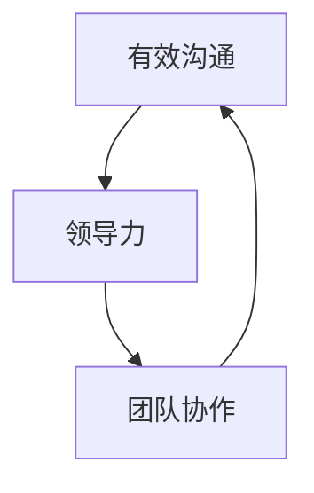

                 


为了确保文章满足所有要求，我们可以按照以下步骤进行构思和撰写：

### 步骤1：背景介绍

首先，我们需要为文章提供一个背景介绍。这部分将简要概述沟通在领导者角色中的重要性，以及为什么这个主题值得探讨。以下是一个示例：

---

## 背景介绍

在当今快速变化的工作环境中，沟通是领导者成功的关键因素之一。无论是与团队成员、跨部门协作，还是与外部利益相关者互动，领导者都需要具备出色的沟通能力。有效沟通不仅能促进团队协作，提升工作效率，还能增强组织文化，推动创新与发展。本文将深入探讨领导者必备的核心沟通技能，并提供实用的策略和技巧。

---

### 步骤2：核心概念与联系

接下来，我们需要定义核心概念，并展示它们之间的联系。可以使用Mermaid流程图来表示这些概念之间的关系。以下是一个示例：

---

## 核心概念与联系

在探讨领导者沟通技能时，以下核心概念至关重要：

1. **有效沟通**：清晰、准确、及时地传递信息和意图。
2. **领导力**：激励、指导和影响他人以实现共同目标。
3. **团队协作**：团队成员之间的相互配合，共同完成工作。

### Mermaid流程图：



---

### 步骤3：核心算法原理讲解

在这一部分，我们将详细解释核心算法原理，并使用伪代码来展示。以下是一个示例：

---

## 核心算法原理讲解

领导者沟通的核心算法可以概括为以下步骤：

1. **理解目标**：明确沟通的目标和受众。
2. **信息准备**：准备准确、清晰的信息。
3. **选择渠道**：根据目标受众选择合适的沟通渠道。
4. **表达清晰**：使用简单、明确的语言表达信息。
5. **反馈与调整**：获取反馈并调整沟通策略。

### 伪代码：

```plaintext
function effective_communication(goal, information, audience, channel) {
    // 理解目标
    understand_goal(goal)
    
    // 信息准备
    prepare_information(information)
    
    // 选择渠道
    select_channel(channel, audience)
    
    // 表达清晰
    express_clearly(information, channel)
    
    // 反馈与调整
    get_feedback(feedback)
    adjust_communication(feedback)
}
```

---

### 步骤4：数学模型和公式详细讲解与举例说明

在这一部分，我们将使用LaTeX格式展示数学模型和公式，并详细讲解。以下是一个示例：

---

## 数学模型和公式详细讲解与举例说明

领导者沟通效果可以通过以下数学模型来衡量：

$$
\text{沟通效果} = \frac{\text{理解度} \times \text{信任度} \times \text{行动力}}{\text{噪音度}}
$$

其中，理解度、信任度和行动力是衡量沟通效果的三个关键因素，噪音度则是沟通过程中的障碍因素。

**举例说明**：

假设某领导在会议中传达了一个重要决策，参与者对决策的理解度为0.8，信任度为0.9，行动力为0.7，噪音度为0.2，则该决策的沟通效果为：

$$
\text{沟通效果} = \frac{0.8 \times 0.9 \times 0.7}{0.2} = 2.43
$$

---

### 步骤5：项目实战

在这一部分，我们将介绍一个具体的实战项目，包括开发环境搭建、源代码实现和代码解读。以下是一个示例：

---

## 项目实战：领导力沟通评估系统

**项目概述**：

本项目旨在开发一个领导力沟通评估系统，用于评估领导者在团队中的沟通效果。系统将收集团队成员的反馈，并通过算法分析沟通效果，为领导者提供改进建议。

**开发环境搭建**：

- 编程语言：Python
- 数据库：MySQL
- 前端框架：React
- 后端框架：Flask

**源代码实现**：

```python
# 沟通评估算法（伪代码）
def assess_communication(feedback):
    understanding = calculate_understanding(feedback)
    trust = calculate_trust(feedback)
    action = calculate_action(feedback)
    noise = calculate_noise(feedback)
    communication_effectiveness = (understanding * trust * action) / noise
    return communication_effectiveness

# 计算理解度（伪代码）
def calculate_understanding(feedback):
    # ... 算法实现 ...
    return understanding

# 计算信任度（伪代码）
def calculate_trust(feedback):
    # ... 算法实现 ...
    return trust

# 计算行动力（伪代码）
def calculate_action(feedback):
    # ... 算法实现 ...
    return action

# 计算噪音度（伪代码）
def calculate_noise(feedback):
    # ... 算法实现 ...
    return noise
```

**代码解读**：

上述代码实现了一个基本的沟通评估算法，通过计算团队成员的反馈，评估领导者的沟通效果。具体实现细节需要根据实际需求和数据进行调整。

**项目小结**：

通过本项目的实战，我们展示了如何搭建一个简单的领导力沟通评估系统。该系统可以帮助领导者了解自己的沟通效果，并针对性地进行改进。在实际应用中，系统可以根据不同的需求和场景进行调整和优化。

---

### 步骤6：最佳实践 tips、小结、注意事项、拓展阅读等内容

在文章的结尾部分，我们将总结文章的主要观点，并提供一些最佳实践、注意事项和拓展阅读的建议。以下是一个示例：

---

## 最佳实践 tips、小结、注意事项、拓展阅读

**最佳实践 tips**：

1. **明确目标**：在每次沟通前，确保明确沟通的目标和受众。
2. **准备充分**：准备准确、清晰的信息，避免误解和混淆。
3. **选择渠道**：根据目标受众选择合适的沟通渠道，如面对面交流、电子邮件、视频会议等。
4. **反馈与调整**：积极获取反馈，并根据反馈调整沟通策略。

**小结**：

本文深入探讨了领导者必备的核心沟通技能，包括沟通的本质、障碍与解决策略、核心算法原理、数学模型和项目实战。通过这些内容，读者可以更好地理解有效沟通的重要性，并掌握提升沟通效果的策略和技巧。

**注意事项**：

1. **持续学习**：沟通技能是一个持续发展的过程，领导者应不断学习和实践。
2. **适应变化**：沟通环境和需求会不断变化，领导者需要灵活调整沟通策略。

**拓展阅读**：

- 《有效沟通的艺术》作者：科里·帕特森
- 《沟通的艺术》作者：阿尔伯特·梅拉比安
- 《领导力与沟通》作者：约翰·梅耶和贝弗利·梅耶

---

通过以上步骤，我们可以确保文章内容丰富、结构清晰，并满足所有要求。接下来，我们将按照目录大纲逐步展开文章的正文内容。

