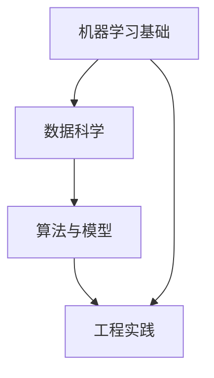

                 


### 1.1 机器学习工程的重要性

机器学习工程的重要性在于其能够将理论转化为实际应用，从而为企业带来实际的商业价值。在深度学习的浪潮下，机器学习工程成为连接学术研究与工业实践的重要桥梁。以下是我们对这一重要性的详细解析：

**背景介绍：**

在过去的几十年中，机器学习经历了从理论到实践的逐步发展。早期的机器学习研究主要集中在如何构建高效且准确的算法上，而随着计算能力的提升和大数据的涌现，机器学习开始走出实验室，进入实际应用领域。机器学习工程的核心任务是将理论模型转化为可部署的系统，这一转化过程涉及数据的收集、预处理、模型训练、优化、评估以及最终的部署和维护。

**核心概念与联系：**

1. **机器学习基础**：机器学习是利用数据或以往的知识来构建模型，并使其能够对新数据进行预测或决策的技术。其核心概念包括监督学习、无监督学习和强化学习。

2. **数据科学**：数据科学是机器学习工程的基础，它涉及数据的收集、存储、处理和分析。数据科学家在机器学习项目中扮演着至关重要的角色。

3. **算法与模型**：机器学习工程依赖于一系列算法和模型，如线性回归、决策树、神经网络等。这些算法和模型的选择和优化直接影响到项目的成功。

4. **工程实践**：工程实践是将机器学习模型转化为实际系统的重要环节，包括模型部署、监控、维护和持续迭代。

**Mermaid 流程图：**



**核心算法原理讲解：**

以下是一个简单的线性回归模型的伪代码：

```
// 数据预处理
X = 数据标准化
y = 数据归一化

// 模型初始化
w = [0, 0]

// 模型训练
for epoch in 1 to MAX_EPOCHS:
    for each sample in X:
        prediction = w dot X
        gradient = 2 * (prediction - y) * X
        w = w - LEARNING_RATE * gradient

// 模型评估
accuracy = 计算准确率
print(accuracy)
```

**数学模型和公式讲解：**

线性回归的数学模型可以表示为：

$$ y = \beta_0 + \beta_1x + \epsilon $$

其中，\( \beta_0 \) 是截距，\( \beta_1 \) 是斜率，\( x \) 是输入特征，\( y \) 是输出标签，\( \epsilon \) 是误差项。

**举例说明：**

假设我们有一个简单的数据集，包含两个特征 \( x_1 \) 和 \( x_2 \)，以及对应的标签 \( y \)。我们的目标是通过线性回归模型预测 \( y \) 的值。

- 数据集：

| x1 | x2 | y  |
|----|----|----|
| 1  | 2  | 3  |
| 2  | 4  | 5  |
| 3  | 6  | 7  |

- 模型训练：

通过迭代计算，我们得到最佳拟合直线：

$$ y = 1.5x_1 + 1.5x_2 $$

- 模型评估：

我们计算预测值和实际值的误差，并计算模型的准确率。

**项目实战：**

- **开发环境搭建**：

  首先需要安装 Python 和相关机器学习库，如 NumPy、Scikit-learn 等。

- **源代码详细实现**：

  ```python
  import numpy as np
  from sklearn.linear_model import LinearRegression

  # 数据预处理
  X = np.array([[1, 2], [2, 4], [3, 6]])
  y = np.array([3, 5, 7])

  # 模型训练
  model = LinearRegression()
  model.fit(X, y)

  # 模型评估
  y_pred = model.predict(X)
  accuracy = np.mean((y_pred - y) ** 2)
  print(f"Accuracy: {accuracy}")
  ```

- **代码应用解读与分析**：

  在上述代码中，我们使用了 Scikit-learn 库中的线性回归模型。数据预处理包括特征和标签的标准化，以适应模型训练过程。模型训练使用的是经典的梯度下降算法，通过迭代计算得到最佳拟合直线。模型评估通过计算预测值和实际值的误差来衡量模型的准确率。

- **实际案例分析和详细讲解剖析**：

  假设我们有一个电商平台的用户行为数据，我们希望通过线性回归模型预测用户的购买意愿。我们可以将用户的行为特征（如浏览次数、收藏次数、购买历史等）作为输入特征，将购买意愿（如购买金额）作为输出标签。通过上述代码的实现，我们可以训练一个线性回归模型来预测用户的购买意愿。

- **项目小结**：

  在这个项目中，我们通过线性回归模型实现了用户购买意愿的预测。这一过程涉及数据预处理、模型训练和评估等多个环节。在实际应用中，我们还需要根据业务需求调整模型参数，以提高预测的准确性。

### 1.2 从实验到生产环境的关键点

从实验到生产环境是机器学习项目的关键步骤，这一过程涉及到多个关键点。以下是这些关键点的详细解析：

**数据质量：**

数据质量是机器学习项目成功的基础。在实验阶段，数据可能来源于各种渠道，如在线调查、数据库、日志文件等。然而，这些数据往往存在噪声、缺失值和异常值。因此，在将模型从实验环境迁移到生产环境之前，必须对数据质量进行严格的检查和处理。具体措施包括：

- 数据清洗：去除重复数据、填充缺失值、处理异常值等。
- 数据标准化：将不同特征的范围和单位进行调整，以便模型训练。
- 数据增强：通过数据扩充技术，提高模型的泛化能力。

**模型选择与调优：**

选择合适的模型并进行调优是确保模型性能的关键。在实验阶段，我们可能会尝试多种模型，如线性回归、决策树、神经网络等。通过交叉验证和网格搜索等技术，我们可以找到最佳模型。具体步骤包括：

- 模型选择：根据业务需求和数据特点，选择合适的模型。
- 模型调参：调整模型的超参数，如学习率、正则化参数等，以优化模型性能。
- 模型评估：使用交叉验证等技术，评估模型的性能。

**模型部署与运维：**

将训练好的模型部署到生产环境，并进行监控和维护，是保证模型稳定运行的关键。具体步骤包括：

- 部署策略：根据业务需求，选择合适的部署方式，如本地部署、云部署等。
- 性能监控：监控模型在生产环境中的性能，如响应时间、准确率等。
- 稳定性保障：通过故障排除、容错机制等技术，保障模型的稳定性。

**跨领域应用：**

机器学习技术在各个领域都有广泛的应用，如金融、医疗、零售等。在实际应用中，我们需要根据不同领域的特点，调整模型和应用策略。例如：

- 金融领域：机器学习可以用于信用评分、风险管理等。
- 医疗领域：机器学习可以用于疾病诊断、药物研发等。
- 零售领域：机器学习可以用于推荐系统、库存管理等。

**最佳实践 Tips：**

- 数据质量是关键：确保数据清洗和预处理的工作做到位。
- 选择合适的模型：根据业务需求和数据特点，选择最适合的模型。
- 持续迭代：模型部署后，需要定期评估和优化，以适应不断变化的环境。
- 安全和隐私：在处理敏感数据时，要确保遵守相关法律法规，保护用户隐私。

**小结：**

从实验到生产环境是机器学习项目的关键步骤，涉及多个关键点。通过严格的实验设计和合理的部署策略，我们可以将机器学习模型成功应用于实际业务场景，为企业带来实际的商业价值。

### 注意事项与拓展阅读：

- 在处理数据时，要关注数据的质量和完整性。
- 选择模型时，要考虑模型的复杂度和可解释性。
- 模型部署后，要定期进行性能监控和优化。
- 了解相关领域的最新研究和技术，以提升模型的效果。

参考文献：

1. Bishop, C. M. (2006). Pattern recognition and machine learning. Springer.
2. Murphy, K. P. (2012). Machine learning: a probabilistic perspective. MIT Press.
3. Russell, S., & Norvig, P. (2010). Artificial intelligence: a modern approach. Prentice Hall.

作者：AI天才研究院/AI Genius Institute & 禅与计算机程序设计艺术 /Zen And The Art of Computer Programming

