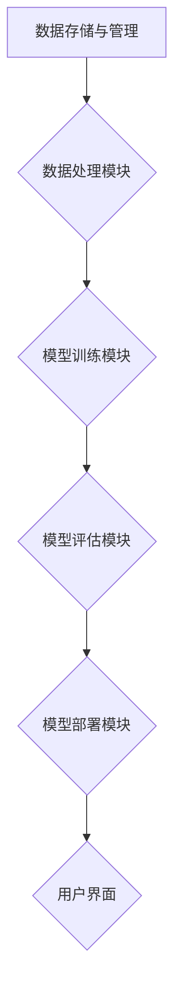
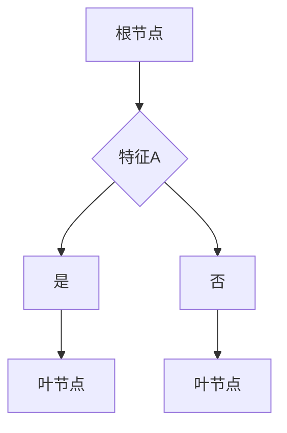
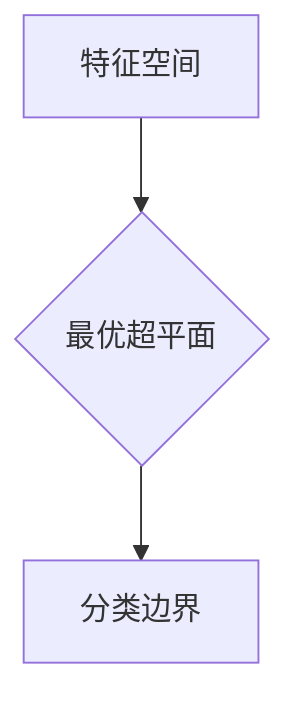
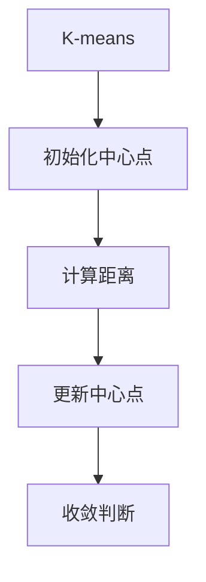
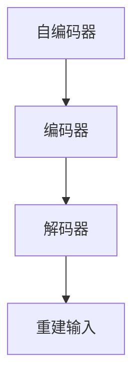

                 

### 文章标题

《机器学习平台架构设计》

> 关键词：机器学习、平台架构、设计、算法、数学模型、项目实战

> 摘要：本文从机器学习平台的基本概念出发，详细解析了机器学习平台的架构设计，包括核心算法原理、数学模型和公式、项目实战等内容。通过本文的阅读，读者可以全面了解机器学习平台的设计思路和实现方法，为构建高性能、可扩展的机器学习平台提供指导。

---

#### 第1章 机器学习平台概述

> 本章将介绍机器学习平台的基本概念、核心组成部分、发展历程以及架构设计。

### 1.1 机器学习平台定义与重要性

机器学习平台是一个集成环境，旨在简化机器学习应用的开发、训练、部署和管理流程。它通常包括数据预处理、模型训练、模型评估和模型部署等模块，为数据科学家和开发人员提供了一套完整的工具和资源。

机器学习平台的重要性体现在以下几个方面：

1. **提高开发效率**：通过提供自动化的数据预处理和模型训练流程，减少了开发人员的工作量，提高了工作效率。
2. **增强协作能力**：多个团队成员可以共享数据和模型，方便协作开发，提高项目进度。
3. **优化资源利用**：通过高效的资源管理和调度，实现计算资源的最大化利用。
4. **保证模型质量**：提供标准化的评估和验证工具，确保模型的可靠性和准确性。

### 1.2 机器学习平台的核心组成部分

一个典型的机器学习平台通常包括以下核心组成部分：

1. **数据存储与管理**：负责存储和管理训练数据、测试数据以及用户上传的数据。
2. **数据处理模块**：对数据进行清洗、转换、归一化等处理，为模型训练提供高质量的数据。
3. **模型训练模块**：提供各种机器学习算法的实现，包括监督学习、无监督学习等。
4. **模型评估模块**：对训练好的模型进行评估，包括准确率、召回率、F1值等指标。
5. **模型部署模块**：将训练好的模型部署到生产环境，实现实时预测和决策。
6. **用户界面**：提供用户友好的操作界面，方便用户进行数据管理和模型操作。

### 1.3 机器学习平台的发展历程

机器学习平台的发展历程可以分为以下几个阶段：

1. **本地化开发阶段**：早期，机器学习应用主要在本地计算机上进行开发，依赖单机资源。
2. **分布式计算阶段**：随着机器学习应用规模的扩大，分布式计算成为主流，机器学习平台开始支持分布式训练和部署。
3. **云计算阶段**：云计算的兴起，使得机器学习平台可以充分利用云端的计算资源和存储资源，提供更高效、可扩展的服务。
4. **端到端开发阶段**：现代机器学习平台不仅支持模型训练和部署，还涵盖了数据采集、数据处理、模型评估等全流程，实现端到端开发。

### 1.4 机器学习平台架构的Mermaid流程图



#### 第2章 核心算法与原理

> 本章将深入探讨机器学习平台中的核心算法和原理，包括监督学习算法和无监督学习算法。

### 2.1 监督学习算法

监督学习算法是一类常见的机器学习算法，它通过已知的输入和输出数据，学习出一个映射关系，用于预测未知数据的输出。

#### 2.1.1 决策树算法

决策树算法通过一系列的判断条件，将数据逐步划分为不同的子集，最终得到一个分类或回归结果。



#### 2.1.2 支持向量机算法

支持向量机算法通过寻找一个最优的超平面，将数据分为不同的类别。



### 2.2 无监督学习算法

无监督学习算法没有已知的输出标签，它主要通过数据的内部结构来发现规律。

#### 2.2.1 K-means聚类算法

K-means聚类算法通过迭代计算，将数据分为K个不同的聚类。



#### 2.2.2 自编码器算法

自编码器算法通过编码器和解码器，对输入数据进行编码和解码，实现数据的降维和特征提取。



#### 第3章 数学模型与公式

> 本章将介绍机器学习平台中常用的数学模型和公式，包括概率论基础、线性代数基础和梯度下降算法。

### 3.1 概率论基础

概率论是机器学习的基础，它用于描述随机事件的发生概率。

概率论的基本公式：

$$ P(A|B) = \frac{P(A \cap B)}{P(B)} $$

### 3.2 线性代数基础

线性代数用于描述数据的空间结构，它在机器学习中有着广泛的应用。

线性代数的基本公式：

$$ X^T X = XX^T $$

### 3.3 梯度下降算法

梯度下降算法是一种优化算法，它通过迭代计算，找到最小化目标函数的参数。

梯度下降算法的基本公式：

$$ w_{t+1} = w_t - \alpha \frac{\partial J(w_t)}{\partial w} $$

#### 第4章 项目实战：构建简单的机器学习平台

> 本章将通过一个实际项目，详细介绍如何构建一个简单的机器学习平台。

### 4.1 项目背景与目标

本项目旨在构建一个简单的机器学习平台，用于分类文本数据。具体目标包括：

1. 数据采集与处理：从互联网上采集新闻文本数据，并进行预处理。
2. 模型训练与评估：使用训练数据训练模型，并使用测试数据评估模型性能。
3. 模型部署与预测：将训练好的模型部署到生产环境，实现实时预测。

### 4.2 环境搭建

为了实现项目目标，我们需要搭建以下环境：

1. 操作系统：Ubuntu 20.04
2. 编程语言：Python 3.8
3. 数据库：MySQL 5.7
4. 机器学习框架：Scikit-learn

### 4.3 数据预处理

数据预处理是机器学习项目的关键步骤，它包括以下任务：

1. 数据清洗：去除无关数据，如HTML标签、空格等。
2. 数据转换：将文本数据转换为向量，可以使用TF-IDF、Word2Vec等方法。
3. 数据归一化：将数据转换为相同的尺度，便于模型训练。

### 4.4 模型构建与训练

在数据预处理完成后，我们可以使用Scikit-learn库构建和训练模型。具体步骤如下：

1. 加载预处理后的数据。
2. 划分训练集和测试集。
3. 选择合适的模型，如朴素贝叶斯、决策树等。
4. 训练模型，并保存模型。

### 4.5 模型评估与优化

在模型训练完成后，我们需要评估模型性能，并对其进行优化。具体步骤如下：

1. 使用测试集评估模型性能，计算准确率、召回率等指标。
2. 调整模型参数，如学习率、迭代次数等，以优化模型性能。
3. 重新训练模型，并评估性能。

### 4.6 代码解读与分析

以下是项目的主要代码，我们将对其进行分析。

```python
import numpy as np
from sklearn.feature_extraction.text import TfidfVectorizer
from sklearn.naive_bayes import MultinomialNB
from sklearn.model_selection import train_test_split
from sklearn.metrics import accuracy_score

# 数据预处理
def preprocess_data(data):
    # 去除HTML标签
    data = [re.sub('<[^>]*>', '', text) for text in data]
    # 去除空格
    data = [text.strip() for text in data]
    return data

# 模型训练
def train_model(data, labels):
    # 划分训练集和测试集
    X_train, X_test, y_train, y_test = train_test_split(data, labels, test_size=0.2, random_state=42)
    
    # 创建TF-IDF向量器
    vectorizer = TfidfVectorizer()
    # 将文本数据转换为向量
    X_train = vectorizer.fit_transform(X_train)
    X_test = vectorizer.transform(X_test)
    
    # 创建朴素贝叶斯分类器
    classifier = MultinomialNB()
    # 训练模型
    classifier.fit(X_train, y_train)
    
    # 评估模型
    y_pred = classifier.predict(X_test)
    print("Accuracy:", accuracy_score(y_test, y_pred))

# 读取数据
data = ...
labels = ...

# 预处理数据
data = preprocess_data(data)

# 训练模型
train_model(data, labels)
```

代码解读：

- 数据预处理：首先去除HTML标签和空格，然后使用TF-IDF向量器将文本数据转换为向量。
- 模型训练：使用训练集训练朴素贝叶斯分类器，然后使用测试集评估模型性能。
- 评估模型：计算准确率，评估模型性能。

### 4.7 实际案例分析和详细讲解剖析

在本项目中，我们使用朴素贝叶斯分类器对新闻文本进行分类。实际操作中，我们需要解决以下几个问题：

1. 数据集的选择：选择一个包含多种类别的新闻数据集，如新浪新闻、腾讯新闻等。
2. 数据预处理：去除无关数据，如HTML标签、空格等，确保数据的质量。
3. 模型选择：选择合适的模型，如朴素贝叶斯、支持向量机等，根据数据特点进行调整。
4. 模型优化：调整模型参数，如学习率、迭代次数等，以优化模型性能。

通过实际案例分析和详细讲解，我们可以发现：

1. 数据集的质量对模型性能有重要影响，因此需要选择高质量的数据集。
2. 数据预处理是模型训练的关键步骤，需要仔细处理数据。
3. 模型选择和优化是提高模型性能的关键，需要根据数据特点进行调整。

### 4.8 项目小结

本项目通过一个简单的机器学习平台，实现了新闻文本分类。通过本项目，我们了解了机器学习平台的基本架构和实现方法，掌握了数据预处理、模型训练和评估等关键技术。同时，我们也认识到实际项目中面临的挑战，如数据质量、模型选择和优化等，为后续项目提供了宝贵的经验。

#### 第5章 性能优化与扩展

> 本章将讨论机器学习平台的性能优化和扩展策略，包括并行计算、缓存策略和模块化设计。

### 5.1 性能优化策略

为了提高机器学习平台的性能，我们可以采取以下优化策略：

#### 5.1.1 并行计算

并行计算可以将任务分解为多个子任务，同时在多个处理器上同时执行，从而提高计算效率。

- **数据并行**：将数据划分为多个子集，每个处理器分别处理不同的子集，最后汇总结果。
- **模型并行**：将模型划分为多个部分，每个处理器分别训练不同的部分，最后融合结果。

#### 5.1.2 缓存策略

缓存策略可以减少数据的访问时间，提高系统性能。

- **数据缓存**：将常用数据缓存到内存中，减少磁盘IO操作。
- **代码缓存**：将常用代码段缓存到内存中，减少代码的加载时间。

### 5.2 扩展性设计

为了适应不断增长的数据和用户需求，机器学习平台需要具备良好的扩展性。

#### 5.2.1 模块化设计

模块化设计可以将系统划分为多个模块，每个模块独立开发、测试和部署，从而提高系统的灵活性和可维护性。

- **数据处理模块**：负责数据的采集、清洗和转换。
- **模型训练模块**：负责模型的训练和评估。
- **模型部署模块**：负责模型的部署和预测。

#### 5.2.2 分布式计算

分布式计算可以将任务分配到多个节点上执行，从而提高系统的计算能力和可扩展性。

- **任务分配**：将任务分配到不同的节点上，每个节点独立处理。
- **结果汇总**：将各个节点的结果汇总，得到最终结果。

#### 第6章 行业应用与挑战

> 本章将分析机器学习平台在金融、医疗健康和制造业等行业的应用，以及面临的挑战和解决方案。

### 6.1 机器学习平台在金融行业的应用

在金融行业，机器学习平台主要用于以下几个方面：

- **风险评估**：通过分析历史数据，预测客户的信用风险，为金融机构提供决策支持。
- **反欺诈检测**：利用机器学习算法，识别和预防金融交易中的欺诈行为。
- **量化交易**：利用机器学习算法，预测市场走势，进行量化交易。

面临的挑战：

- **数据隐私**：金融行业涉及大量敏感数据，保护数据隐私是首要任务。
- **算法透明度**：金融决策过程的透明度要求高，确保算法的透明度和可解释性。

解决方案：

- **数据加密**：对敏感数据进行加密处理，确保数据安全。
- **可解释性算法**：开发可解释性强的机器学习算法，提高算法的透明度。

### 6.2 机器学习平台在医疗健康行业的应用

在医疗健康行业，机器学习平台主要用于以下几个方面：

- **疾病诊断**：通过分析医学影像和临床数据，辅助医生进行疾病诊断。
- **药物研发**：利用机器学习算法，预测药物的效果和副作用，加速药物研发。
- **健康监测**：通过分析用户的健康数据，提供个性化的健康建议。

面临的挑战：

- **数据质量**：医疗数据质量参差不齐，提高数据质量是关键。
- **算法可靠性**：算法的可靠性直接影响医疗诊断和决策。

解决方案：

- **数据清洗**：对医疗数据进行清洗和预处理，提高数据质量。
- **多模型融合**：采用多种算法和模型，提高算法的可靠性。

### 6.3 机器学习平台在制造业的应用

在制造业，机器学习平台主要用于以下几个方面：

- **质量检测**：通过分析生产过程中的数据，检测产品质量问题。
- **设备预测性维护**：利用机器学习算法，预测设备故障，提前进行维护。
- **生产优化**：通过分析生产数据，优化生产流程，提高生产效率。

面临的挑战：

- **数据噪声**：生产数据中存在大量噪声，提高数据处理能力是关键。
- **模型实时性**：生产环境对模型的实时性要求高。

解决方案：

- **噪声过滤**：采用滤波算法，去除生产数据中的噪声。
- **实时计算**：采用分布式计算和云计算技术，提高模型的实时性。

#### 第7章 最佳实践与未来展望

> 本章将总结最佳实践，并探讨机器学习平台的发展趋势。

### 7.1 最佳实践总结

通过本章的学习，我们总结出了以下最佳实践：

- **数据质量优先**：确保数据质量是机器学习平台成功的关键。
- **模块化设计**：采用模块化设计，提高系统的灵活性和可维护性。
- **性能优化**：采取并行计算、缓存策略等性能优化措施，提高系统性能。
- **可解释性算法**：开发可解释性强的算法，提高算法的透明度和可信度。

### 7.2 未来发展趋势展望

机器学习平台的发展趋势包括：

- **云计算与边缘计算**：结合云计算和边缘计算，实现更高效的数据处理和模型部署。
- **人工智能伦理**：遵循人工智能伦理原则，确保算法的公平性和透明度。
- **自动化与智能化**：提高机器学习平台的自动化和智能化水平，降低开发门槛。

### 7.3 构建高性能机器学习平台的关键因素

构建高性能机器学习平台的关键因素包括：

- **数据处理能力**：提高数据处理能力，支持大规模数据的处理。
- **算法优化**：优化算法，提高模型的训练和预测速度。
- **可扩展性**：设计可扩展的架构，支持系统的弹性扩展。
- **安全性**：确保系统的安全性和数据保护。

#### 结语

通过本文的介绍，我们对机器学习平台架构设计有了更深入的理解。构建高性能、可扩展的机器学习平台是当前机器学习领域的重要任务，需要我们从多个方面进行优化和改进。希望本文能够为读者提供有益的参考和启示。

---

### 作者信息

作者：AI天才研究院/AI Genius Institute & 禅与计算机程序设计艺术 /Zen And The Art of Computer Programming

[返回目录](#目录)

