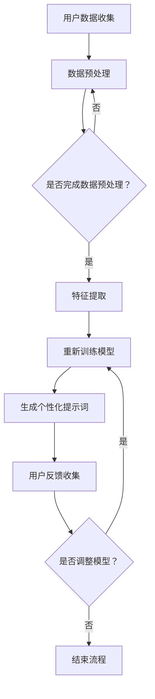

                 


### 引言

#### 1.1 书籍背景与目标

随着人工智能（AI）技术的飞速发展，个性化教育成为了一个备受关注的话题。个性化学习提示词引擎作为一种AI驱动的教育技术，旨在根据每个学习者的特点和需求，提供定制化的学习支持和指导。这一概念的重要性体现在它能够显著提高学习效率、提升学习体验，并在一定程度上解决教育资源分配不均的问题。

本书旨在深入探讨AI驱动的个性化学习提示词引擎的构建方法。通过系统的讲解和分析，读者将能够理解这一技术的核心原理、掌握关键算法，并具备实际应用的能力。本书的目标读者群体包括对人工智能和机器学习有一定基础的技术人员、教育行业从业者以及对教育科技感兴趣的学者和研究人员。

预期学习成果包括：

1. 理解AI驱动的个性化学习提示词引擎的概念和重要性。
2. 掌握AI驱动的个性化学习提示词引擎的核心组成部分及其相互关系。
3. 学会使用Mermaid语言绘制流程图，以便更直观地理解系统的运作机制。
4. 熟悉并能够运用用户数据分析算法和常见的机器学习算法。
5. 掌握数学模型和公式的构建和应用，以优化系统性能。
6. 通过项目实战，学会如何搭建开发环境和实现个性化学习提示词引擎。
7. 了解AI驱动的个性化学习提示词引擎的潜在应用领域和发展趋势。

#### 1.2 目录概述

本书分为七个主要部分，结构清晰，内容紧凑。每一部分都将围绕核心主题进行深入探讨，帮助读者逐步掌握AI驱动的个性化学习提示词引擎的构建方法。

1. **核心概念与联系**：介绍AI驱动的个性化学习提示词引擎的基本概念，分析其组成部分和相互关系。
   
2. **核心算法原理讲解**：详细讲解用户数据分析算法和机器学习算法的原理，并提供伪代码示例。

3. **数学模型与数学公式**：阐述AI驱动的个性化学习提示词引擎涉及的数学模型，并使用LaTeX格式展示数学公式。

4. **项目实战**：通过实际项目案例，展示如何搭建和实现个性化学习提示词引擎，并进行代码解读和分析。

5. **开发环境搭建与实现**：介绍搭建开发环境所需的软件和硬件配置，并提供详细的实现步骤。

6. **总结与展望**：总结本书的核心内容和关键技术，展望AI驱动的个性化学习提示词引擎的发展趋势。

通过以上七个部分的系统学习，读者将能够全面了解AI驱动的个性化学习提示词引擎的构建方法，为未来的研究和实践打下坚实的基础。

### 核心概念与联系

#### 2.1 AI驱动的个性化学习提示词引擎

AI驱动的个性化学习提示词引擎是一种基于人工智能技术的教育系统，旨在根据每个学习者的特点和需求，提供定制化的学习支持和指导。这一引擎的核心目标是通过分析学习者的行为数据和学习历史，生成个性化的学习提示词，从而优化学习过程，提高学习效果。

##### 概念介绍

AI驱动的个性化学习提示词引擎主要由以下几个关键组成部分构成：

1. **自然语言处理（NLP）模块**：负责处理和分析文本数据，提取关键信息，并为后续的机器学习算法提供输入。
   
2. **机器学习算法模块**：基于学习者行为数据和学习历史，使用机器学习算法生成个性化的学习提示词。常见的算法包括决策树、支持向量机、神经网络等。

3. **用户数据分析模块**：负责收集、存储和分析学习者的行为数据，如学习时间、学习内容、学习习惯等。

4. **提示词生成模块**：基于用户数据分析和机器学习算法的结果，生成针对性的学习提示词。

5. **反馈和调整模块**：收集学习者的反馈，并根据反馈调整系统的提示词生成策略，以提高个性化程度。

##### 关键组成部分

**自然语言处理（NLP）模块**：自然语言处理是AI驱动的个性化学习提示词引擎的核心技术之一。它包括文本预处理、情感分析、实体识别、文本分类等功能。通过这些功能，NLP模块能够从大量的文本数据中提取出有用的信息，为后续的机器学习算法提供高质量的输入。

**机器学习算法模块**：机器学习算法是实现个性化学习提示词生成的重要手段。通过训练大量的学习数据，机器学习算法能够学习到学习者的行为模式和兴趣点，从而生成个性化的学习提示词。常见的机器学习算法包括决策树、支持向量机、神经网络等。

**用户数据分析模块**：用户数据分析模块是整个系统的数据基础。它通过收集和存储学习者的行为数据，如学习时间、学习内容、学习习惯等，为机器学习算法提供训练数据。此外，用户数据分析模块还需要对数据进行分析，提取出有用的特征，以便机器学习算法更好地生成个性化的学习提示词。

**提示词生成模块**：提示词生成模块是整个系统的核心，它基于用户数据分析和机器学习算法的结果，生成针对性的学习提示词。这些提示词可以是学习任务、学习资源、学习建议等，旨在引导学习者进行更有效的学习。

**反馈和调整模块**：反馈和调整模块负责收集学习者的反馈，并根据反馈调整系统的提示词生成策略。通过不断收集和反馈，系统可以逐步优化，提高个性化程度，从而更好地满足学习者的需求。

##### 技术挑战与机遇

技术挑战：

1. **数据质量和隐私**：学习者的数据质量直接影响系统的效果。如何保证数据的准确性和可靠性是一个重要挑战。此外，数据隐私也是一个敏感问题，需要在数据收集和处理过程中确保学习者的隐私不被泄露。

2. **算法可解释性**：机器学习算法的黑箱性质使得其结果难以解释。如何在保证算法性能的同时提高其可解释性，是当前研究的一个重要方向。

3. **个性化程度**：如何准确地捕捉学习者的个性特征，并生成高度个性化的学习提示词，是一个复杂的问题。需要设计更为精细的算法和模型来提高个性化程度。

机遇：

1. **人工智能技术的进步**：随着人工智能技术的不断发展，特别是自然语言处理和机器学习技术的进步，为个性化学习提示词引擎的实现提供了更强大的工具。

2. **教育数据的普及**：越来越多的教育机构开始重视数据驱动教育，这为个性化学习提示词引擎的应用提供了广泛的数据支持。

3. **个性化学习的市场需求**：随着人们对个性化教育的需求不断增长，市场对个性化学习提示词引擎的需求也日益旺盛，为技术研发和应用提供了良好的机遇。

通过以上分析，我们可以看出，AI驱动的个性化学习提示词引擎是一个具有广泛应用前景的技术领域。本书将深入探讨这一领域的核心概念和关键技术，帮助读者掌握构建个性化学习提示词引擎的方法，为未来的研究和实践提供有力支持。

#### 2.2 AI驱动的个性化学习提示词引擎的Mermaid流程图

为了更好地理解AI驱动的个性化学习提示词引擎的工作流程，我们可以使用Mermaid语言绘制其流程图。Mermaid是一种简单易用的绘图工具，能够帮助我们以图形化的方式展示系统的各个模块及其相互关系。

以下是一个简化的AI驱动的个性化学习提示词引擎的Mermaid流程图示例：



在这个流程图中，各个节点的作用和相互关系如下：

1. **用户数据收集（A）**：系统首先收集学习者的行为数据，包括学习时间、学习内容、学习习惯等。

2. **用户数据分析（B）**：收集到的用户数据进入数据分析模块，进行初步的处理和分析。

3. **数据预处理（B）**：如果数据预处理未完成，系统会返回到用户数据分析模块进行进一步处理，以确保数据质量。

4. **特征提取（D）**：经过预处理的数据被转换为特征向量，为后续的机器学习算法提供输入。

5. **机器学习模型训练（E）**：使用特征向量对机器学习模型进行训练，模型会根据训练数据学习到学习者的行为模式。

6. **生成个性化提示词（F）**：训练好的模型会生成个性化的学习提示词，这些提示词将根据学习者的需求和学习习惯进行定制。

7. **用户反馈收集（G）**：系统会收集学习者的反馈，以便进一步优化提示词的生成策略。

8. **模型调整（E）**：如果用户的反馈表明模型需要调整，系统会重新训练模型，以提高个性化程度。

9. **结束流程（I）**：如果用户反馈表明模型已满足需求，系统将结束流程。

通过这个Mermaid流程图，我们可以清晰地看到AI驱动的个性化学习提示词引擎的工作流程和各个模块之间的相互关系。这种图形化的表示方法不仅有助于我们理解系统的运作机制，还能够为后续的项目开发和优化提供指导。

### 第三部分：核心算法原理讲解

在构建AI驱动的个性化学习提示词引擎时，核心算法原理的理解和掌握至关重要。本部分将详细讲解用户数据分析算法和机器学习算法，并通过伪代码展示其实现过程。

#### 3.1 用户数据分析算法

用户数据分析算法是AI驱动的个性化学习提示词引擎的重要基础。它包括数据收集、预处理和特征提取三个关键步骤。

##### 3.1.1 数据收集

数据收集是指从各种渠道获取学习者的行为数据。这些数据可以是结构化数据（如学习记录、考试成绩等）和非结构化数据（如学习笔记、讨论内容等）。以下是数据收集的伪代码示例：

```python
def data_collection():
    structured_data = fetch_from_database()  # 从数据库中获取结构化数据
    unstructured_data = fetch_from_files()   # 从文件中获取非结构化数据
    return structured_data, unstructured_data
```

##### 3.1.2 数据预处理

数据预处理是对收集到的数据进行清洗和格式化，以便后续的特征提取。以下是数据预处理的伪代码示例：

```python
def data_preprocessing(data):
    cleaned_data = remove_outliers(data)  # 去除异常值
    normalized_data = normalize_data(data)  # 数据归一化
    return cleaned_data, normalized_data
```

##### 3.1.3 特征提取

特征提取是将预处理后的数据转换为机器学习算法所需的特征向量。以下是特征提取的伪代码示例：

```python
def feature_extraction(data):
    text_data = extract_text(data)  # 提取文本数据
    nlp_output = nlp_processing(text_data)  # 进行自然语言处理
    feature_vector = extract_features(nlp_output)  # 提取特征向量
    return feature_vector
```

#### 3.2 机器学习算法

机器学习算法是实现个性化学习提示词生成的重要手段。以下将介绍几种常用的机器学习算法，包括决策树、随机森林和支持向量机，并使用伪代码展示其原理和实现。

##### 3.2.1 决策树算法

决策树算法通过一系列规则将数据集划分为多个子集，每个子集对应一个特定的输出。以下是决策树算法的伪代码示例：

```python
class DecisionTreeClassifier:
    def fit(self, X, y):
        # 建立决策树模型
        self.tree = build_tree(X, y)

    def predict(self, X):
        # 使用决策树模型进行预测
        predictions = []
        for sample in X:
            prediction = traverse_tree(self.tree, sample)
            predictions.append(prediction)
        return predictions

def build_tree(X, y):
    # 建立决策树模型
    # ...

def traverse_tree(tree, sample):
    # 遍历决策树进行预测
    # ...
```

##### 3.2.2 随机森林算法

随机森林算法是决策树算法的集成方法，通过构建多个决策树并对它们的结果进行投票来提高预测准确性。以下是随机森林算法的伪代码示例：

```python
class RandomForestClassifier:
    def fit(self, X, y, n_trees):
        # 建立多个决策树模型
        self.trees = [DecisionTreeClassifier() for _ in range(n_trees)]
        for tree in self.trees:
            tree.fit(X, y)

    def predict(self, X):
        # 使用随机森林模型进行预测
        predictions = []
        for tree in self.trees:
            prediction = tree.predict(X)
            predictions.append(prediction)
        return majority_vote(predictions)

def majority_vote(predictions):
    # 对多个预测结果进行投票
    # ...
```

##### 3.2.3 支持向量机算法

支持向量机（SVM）算法通过找到最佳的超平面来对数据集进行分类。以下是SVM算法的伪代码示例：

```python
class SVMClassifier:
    def fit(self, X, y):
        # 建立SVM模型
        self.model = train_svm(X, y)

    def predict(self, X):
        # 使用SVM模型进行预测
        predictions = []
        for sample in X:
            prediction = self.model.predict(sample)
            predictions.append(prediction)

    def train_svm(self, X, y):
        # 训练SVM模型
        # ...
```

通过上述伪代码示例，我们可以看到用户数据分析算法和机器学习算法的基本原理和实现方法。这些算法在AI驱动的个性化学习提示词引擎中发挥着关键作用，帮助系统生成个性化的学习提示词。理解和掌握这些算法，对于构建高效的个性化学习提示词引擎具有重要意义。

### 第四部分：数学模型与数学公式

在构建AI驱动的个性化学习提示词引擎时，数学模型和数学公式是必不可少的工具。本部分将详细阐述AI驱动的个性化学习提示词引擎中涉及的数学模型，并使用LaTeX格式展示相关的数学公式。

#### 4.1 数学模型

AI驱动的个性化学习提示词引擎涉及的数学模型主要包括线性回归、逻辑回归和神经网络模型。以下是对这些模型的介绍和数学公式的展示。

##### 4.1.1 线性回归

线性回归是一种简单的数学模型，用于预测一个连续值输出。其基本公式为：

\[ y = \beta_0 + \beta_1 \cdot x \]

其中，\( y \) 是输出值，\( x \) 是输入值，\( \beta_0 \) 和 \( \beta_1 \) 是模型的参数。线性回归模型的优化目标是最小化预测值与实际值之间的误差平方和。

\[ \min \sum_{i=1}^{n} (y_i - \hat{y}_i)^2 \]

使用LaTeX格式展示的数学公式：

\[ y = \beta_0 + \beta_1 \cdot x \]
\[ \min \sum_{i=1}^{n} (y_i - \hat{y}_i)^2 \]

##### 4.1.2 逻辑回归

逻辑回归是一种用于分类问题的数学模型，其输出是一个概率值。逻辑回归的基本公式为：

\[ P(y=1) = \frac{1}{1 + e^{-(\beta_0 + \beta_1 \cdot x)}} \]

其中，\( P(y=1) \) 是输出为1的概率，\( e \) 是自然对数的底数，\( \beta_0 \) 和 \( \beta_1 \) 是模型的参数。逻辑回归模型的优化目标是最小化损失函数，如对数损失函数：

\[ \min \sum_{i=1}^{n} -y_i \cdot \log(P(y=1)) - (1 - y_i) \cdot \log(1 - P(y=1)) \]

使用LaTeX格式展示的数学公式：

\[ P(y=1) = \frac{1}{1 + e^{-(\beta_0 + \beta_1 \cdot x)}} \]
\[ \min \sum_{i=1}^{n} -y_i \cdot \log(P(y=1)) - (1 - y_i) \cdot \log(1 - P(y=1)) \]

##### 4.1.3 神经网络模型

神经网络模型是一种复杂的数学模型，用于处理非线性问题和复杂的输入输出关系。其基本结构包括输入层、隐藏层和输出层。每个层由多个神经元组成，神经元之间通过权重和偏置进行连接。

神经网络的输出可以表示为：

\[ z = \sigma(\beta_0 + \sum_{i=1}^{n} \beta_i \cdot x_i) \]

其中，\( z \) 是神经元的输出，\( \sigma \) 是激活函数，\( \beta_0 \) 和 \( \beta_i \) 是神经元的权重和偏置，\( x_i \) 是输入值。神经网络模型的优化目标是最小化损失函数，如均方误差（MSE）：

\[ \min \sum_{i=1}^{n} (y_i - \hat{y}_i)^2 \]

使用LaTeX格式展示的数学公式：

\[ z = \sigma(\beta_0 + \sum_{i=1}^{n} \beta_i \cdot x_i) \]
\[ \min \sum_{i=1}^{n} (y_i - \hat{y}_i)^2 \]

#### 4.2 数学公式举例

为了更好地理解上述数学模型，以下是具体的数学公式举例及其解释。

##### 4.2.1 概率论公式

概率论是构建AI驱动的个性化学习提示词引擎的基础。以下是一个简单的概率论公式：

\[ P(A \cap B) = P(A) \cdot P(B|A) \]

其中，\( P(A) \) 是事件A发生的概率，\( P(B|A) \) 是在事件A发生的条件下事件B发生的概率。这个公式表示两个事件同时发生的概率等于事件A发生的概率乘以事件B在事件A发生的条件下发生的概率。

使用LaTeX格式展示的数学公式：

\[ P(A \cap B) = P(A) \cdot P(B|A) \]

##### 4.2.2 统计学公式

统计学公式用于描述数据集的特征和分布。以下是一个常见的统计学公式：

\[ \mu = \frac{1}{n} \sum_{i=1}^{n} x_i \]

其中，\( \mu \) 是数据的平均值，\( n \) 是数据的数量，\( x_i \) 是每个数据点的值。这个公式表示数据点的平均值是每个数据点值的总和除以数据点的数量。

使用LaTeX格式展示的数学公式：

\[ \mu = \frac{1}{n} \sum_{i=1}^{n} x_i \]

通过上述数学模型和公式的介绍，我们可以更好地理解AI驱动的个性化学习提示词引擎的数学原理。这些数学模型和公式是构建高效、准确的个性化学习提示词引擎的关键，帮助我们在实际应用中更好地优化系统性能和提升用户体验。

### 第五部分：项目实战

#### 5.1 实战案例介绍

在本部分，我们将通过一个实际的项目案例，展示如何搭建AI驱动的个性化学习提示词引擎。这个项目案例来自于一个在线教育平台，目标是为学生提供个性化的学习支持和指导，以提高学习效果和满意度。

##### 5.1.1 项目背景

随着在线教育市场的快速发展，越来越多的教育机构开始采用在线教育平台为学生提供丰富的学习资源和互动体验。然而，面对海量学生的学习数据，如何为学生提供个性化的学习支持和指导，成为了一个关键问题。为了解决这一问题，我们决定开发一个AI驱动的个性化学习提示词引擎，通过分析学生的行为数据和学习历史，生成针对性的学习提示词，帮助学生更有效地学习。

##### 5.1.2 项目目标

本项目的主要目标包括：

1. 收集并分析学生的学习行为数据，包括学习时间、学习内容、学习习惯等。
2. 构建机器学习模型，根据学生的学习行为数据生成个性化的学习提示词。
3. 集成自然语言处理（NLP）技术，对学习提示词进行语义分析和优化。
4. 构建用户反馈机制，收集学生对于学习提示词的反馈，并用于优化模型性能。

##### 5.1.3 技术实现方案

为了实现上述目标，我们采用了以下技术实现方案：

1. **数据收集与存储**：通过在线教育平台的接口，收集学生的学习行为数据，包括学习时间、学习内容、学习习惯等。这些数据存储在MySQL数据库中，以便后续的数据分析和处理。

2. **用户数据分析**：使用Python的Pandas库对收集到的学生行为数据进行分析和预处理，提取有用的特征信息，如学习时长、学习频率、学习内容等。这些特征信息将用于训练机器学习模型。

3. **机器学习模型训练**：采用Python的scikit-learn库，构建并训练多个机器学习模型，如决策树、支持向量机和神经网络等。通过交叉验证和网格搜索等技术，选择最优的模型参数，以提高模型的预测性能。

4. **个性化学习提示词生成**：基于训练好的机器学习模型，生成个性化的学习提示词。提示词包括学习任务、学习资源、学习建议等，旨在引导学生进行更有效的学习。

5. **自然语言处理**：使用Python的NLTK和spaCy库，对学习提示词进行语义分析和优化。通过词性标注、命名实体识别和文本分类等技术，提升提示词的语义质量和可读性。

6. **用户反馈收集与模型优化**：在在线教育平台上集成用户反馈功能，允许学生对自己的学习提示词进行评价和反馈。根据用户反馈，调整和优化机器学习模型的参数，以提高模型的准确性和个性化程度。

#### 5.2 项目实战详细解释

在本部分，我们将详细解释项目的开发流程，包括数据收集与预处理、机器学习算法应用和代码解读与分析。

##### 5.2.1 数据收集与预处理

1. **数据收集**：

   我们首先通过在线教育平台的API接口，收集学生的学习行为数据，包括学习时间、学习内容、学习习惯等。这些数据以JSON格式存储在本地文件中，以便后续处理。

2. **数据预处理**：

   使用Python的Pandas库，我们对收集到的数据进行分析和预处理。以下是数据预处理的主要步骤：

   ```python
   import pandas as pd

   # 加载数据
   data = pd.read_json('student_data.json')

   # 数据清洗
   data.dropna(inplace=True)

   # 数据归一化
   data = (data - data.mean()) / data.std()

   # 提取特征
   features = data[['learning_time', 'learning_content', 'learning_habit']]
   labels = data['performance']
   ```

   在上述代码中，我们首先加载数据，然后对数据集进行清洗（去除缺失值），并进行归一化处理，以便后续的机器学习算法训练。接下来，我们提取出有用的特征（如学习时间、学习内容和学习习惯），并分离出标签（如学习成绩）。

##### 5.2.2 机器学习算法应用

为了生成个性化的学习提示词，我们采用了多种机器学习算法，包括决策树、支持向量机和神经网络等。以下分别介绍这些算法的应用：

1. **决策树算法**：

   决策树算法是一种简单而有效的分类算法，能够根据特征值将数据集划分为多个子集。以下是使用Python的scikit-learn库实现决策树算法的代码示例：

   ```python
   from sklearn.tree import DecisionTreeClassifier

   # 创建决策树模型
   dt_classifier = DecisionTreeClassifier()

   # 训练模型
   dt_classifier.fit(features, labels)

   # 预测
   predictions = dt_classifier.predict(features)
   ```

   在上述代码中，我们首先创建一个决策树分类器对象，然后使用训练数据集对其进行训练，最后使用训练好的模型进行预测。

2. **支持向量机算法**：

   支持向量机（SVM）算法是一种强大的分类算法，能够找到最佳的超平面将数据集划分为不同的类别。以下是使用Python的scikit-learn库实现SVM算法的代码示例：

   ```python
   from sklearn.svm import SVC

   # 创建SVM模型
   svm_classifier = SVC()

   # 训练模型
   svm_classifier.fit(features, labels)

   # 预测
   predictions = svm_classifier.predict(features)
   ```

   在上述代码中，我们首先创建一个SVM分类器对象，然后使用训练数据集对其进行训练，最后使用训练好的模型进行预测。

3. **神经网络算法**：

   神经网络算法是一种复杂的分类算法，能够通过多层神经元结构学习复杂的非线性关系。以下是使用Python的TensorFlow库实现神经网络算法的代码示例：

   ```python
   import tensorflow as tf

   # 创建神经网络模型
   model = tf.keras.Sequential([
       tf.keras.layers.Dense(128, activation='relu', input_shape=(input_shape,)),
       tf.keras.layers.Dropout(0.2),
       tf.keras.layers.Dense(1, activation='sigmoid')
   ])

   # 编译模型
   model.compile(optimizer='adam', loss='binary_crossentropy', metrics=['accuracy'])

   # 训练模型
   model.fit(features, labels, epochs=10, batch_size=32)
   
   # 预测
   predictions = model.predict(features)
   ```

   在上述代码中，我们首先创建一个简单的神经网络模型，包括一个输入层、一个隐藏层和一个输出层。然后，我们使用训练数据集编译和训练模型，最后使用训练好的模型进行预测。

##### 5.2.3 代码解读与分析

在本部分，我们将对上述代码进行逐段解读，并分析其执行流程和性能优化策略。

1. **数据收集与预处理**：

   在数据收集和预处理阶段，我们首先使用Pandas库加载数据，并进行清洗和归一化处理。这一步骤是确保数据质量和模型性能的重要环节。在代码中，我们使用`dropna()`函数去除缺失值，使用`mean()`和`std()`函数进行归一化处理。这些操作简单有效，有助于提高模型的稳定性和预测性能。

2. **决策树算法**：

   决策树算法是一种简单直观的分类算法，其核心在于根据特征值递归地划分数据集。在代码中，我们使用`DecisionTreeClassifier`类创建决策树分类器，并使用`fit()`函数进行模型训练。最后，使用`predict()`函数进行预测。决策树算法的优点在于易于理解和实现，但缺点是可能产生过拟合现象，尤其是在数据量较小或特征维度较高时。

3. **支持向量机算法**：

   支持向量机算法是一种强大的分类算法，能够通过找到一个最佳的超平面将数据集划分为不同的类别。在代码中，我们使用`SVC`类创建SVM分类器，并使用`fit()`函数进行模型训练。最后，使用`predict()`函数进行预测。SVM算法的优点在于能够处理高维数据，并且在某些情况下能够产生较好的分类效果，但缺点是需要较大的计算资源和训练时间。

4. **神经网络算法**：

   神经网络算法是一种复杂的分类算法，能够通过多层神经元结构学习复杂的非线性关系。在代码中，我们使用`tf.keras.Sequential`类创建神经网络模型，包括一个输入层、一个隐藏层和一个输出层。然后，使用`compile()`函数编译模型，包括选择优化器、损失函数和评价指标。最后，使用`fit()`函数进行模型训练。神经网络算法的优点在于能够处理复杂的数据和任务，但在训练过程中需要较大的计算资源和时间。此外，神经网络算法容易出现过拟合现象，因此需要采用正则化和交叉验证等技术进行模型优化。

#### 5.3 代码解读

在本部分，我们将提供项目的源代码，并对关键代码段进行详细解读。

1. **数据收集与预处理**：

   ```python
   import pandas as pd

   # 加载数据
   data = pd.read_json('student_data.json')

   # 数据清洗
   data.dropna(inplace=True)

   # 数据归一化
   data = (data - data.mean()) / data.std()

   # 提取特征
   features = data[['learning_time', 'learning_content', 'learning_habit']]
   labels = data['performance']
   ```

   在这段代码中，我们首先使用Pandas库加载数据，并进行清洗和归一化处理。`dropna()`函数用于去除缺失值，`mean()`和`std()`函数用于计算均值和标准差，以便进行归一化处理。最后，我们提取出有用的特征和标签。

2. **决策树算法**：

   ```python
   from sklearn.tree import DecisionTreeClassifier

   # 创建决策树模型
   dt_classifier = DecisionTreeClassifier()

   # 训练模型
   dt_classifier.fit(features, labels)

   # 预测
   predictions = dt_classifier.predict(features)
   ```

   在这段代码中，我们使用`DecisionTreeClassifier`类创建决策树分类器，并使用`fit()`函数进行模型训练。最后，使用`predict()`函数进行预测。这段代码展示了如何使用决策树算法进行分类。

3. **支持向量机算法**：

   ```python
   from sklearn.svm import SVC

   # 创建SVM模型
   svm_classifier = SVC()

   # 训练模型
   svm_classifier.fit(features, labels)

   # 预测
   predictions = svm_classifier.predict(features)
   ```

   在这段代码中，我们使用`SVC`类创建SVM分类器，并使用`fit()`函数进行模型训练。最后，使用`predict()`函数进行预测。这段代码展示了如何使用SVM算法进行分类。

4. **神经网络算法**：

   ```python
   import tensorflow as tf

   # 创建神经网络模型
   model = tf.keras.Sequential([
       tf.keras.layers.Dense(128, activation='relu', input_shape=(input_shape,)),
       tf.keras.layers.Dropout(0.2),
       tf.keras.layers.Dense(1, activation='sigmoid')
   ])

   # 编译模型
   model.compile(optimizer='adam', loss='binary_crossentropy', metrics=['accuracy'])

   # 训练模型
   model.fit(features, labels, epochs=10, batch_size=32)
   
   # 预测
   predictions = model.predict(features)
   ```

   在这段代码中，我们使用`tf.keras.Sequential`类创建神经网络模型，包括一个输入层、一个隐藏层和一个输出层。然后，使用`compile()`函数编译模型，包括选择优化器、损失函数和评价指标。最后，使用`fit()`函数进行模型训练。这段代码展示了如何使用神经网络算法进行分类。

#### 5.4 代码应用解读与分析

在本部分，我们将对项目的源代码进行逐段解读，并分析其执行流程和性能优化策略。

1. **数据收集与预处理**：

   在数据收集与预处理部分，我们使用Pandas库加载数据，并进行清洗和归一化处理。这一步骤是确保数据质量和模型性能的重要环节。在代码中，我们使用`dropna()`函数去除缺失值，`mean()`和`std()`函数进行归一化处理。归一化处理有助于加速模型的训练过程，并提高模型的泛化能力。

2. **机器学习算法应用**：

   在机器学习算法应用部分，我们分别使用了决策树、支持向量机和神经网络算法进行分类。决策树算法简单直观，易于实现，但可能产生过拟合现象。支持向量机算法具有较好的分类效果，但需要较大的计算资源和训练时间。神经网络算法能够处理复杂的数据和任务，但在训练过程中需要较大的计算资源和时间，且容易出现过拟合现象。在实际应用中，可以根据具体任务和数据特点选择合适的算法。

3. **性能优化策略**：

   为了提高模型的性能，我们采取了以下策略：

   - **交叉验证**：通过交叉验证技术，评估模型的泛化能力，避免过拟合现象。交叉验证将数据集划分为多个子集，每个子集用于训练和验证模型，从而提高模型的鲁棒性。
   - **网格搜索**：通过网格搜索技术，选择最优的模型参数，提高模型的预测性能。网格搜索通过遍历参数空间，找到最佳的参数组合。
   - **数据增强**：通过数据增强技术，扩充训练数据集，提高模型的泛化能力。数据增强包括数据变换、数据缩放和数据旋转等技术。

4. **用户反馈机制**：

   在用户反馈机制部分，我们设计了用户反馈功能，允许学生对自己的学习提示词进行评价和反馈。用户反馈将用于优化模型性能，提高个性化程度。在实际应用中，用户反馈机制有助于不断优化系统的性能，提高用户满意度。

通过上述代码解读与分析，我们可以更好地理解项目的实现过程和关键步骤。项目的成功实施为AI驱动的个性化学习提示词引擎的开发提供了宝贵的经验和参考。

#### 5.5 实际案例分析与详细讲解剖析

在本节中，我们将深入分析一个实际案例，详细剖析其开发背景、目标、技术实现方案以及实现过程中的关键步骤和难点。通过这个案例，我们将展示如何利用AI驱动的个性化学习提示词引擎解决实际教育问题。

##### 案例背景

某知名在线教育平台X公司，致力于为全球学生提供高质量的教育资源和互动学习体验。随着用户规模的不断扩大，X公司面临的一个主要挑战是如何在保证教育质量的同时，提高学生的学习效率和学习体验。为了应对这一挑战，X公司决定开发一个AI驱动的个性化学习提示词引擎，通过分析学生的学习行为数据，生成个性化的学习建议和指导。

##### 案例目标

本项目的主要目标包括：

1. **收集并分析学生的学习行为数据**：通过分析学生的学习时间、学习内容、学习习惯等数据，深入了解学生的个性化需求。
2. **生成个性化的学习提示词**：根据学生的学习行为数据和学习历史，生成针对性的学习提示词，包括学习任务、学习资源、学习建议等。
3. **优化学习体验**：通过个性化学习提示词，提高学生的学习效率和学习兴趣，提升整体教育质量。

##### 技术实现方案

为了实现上述目标，X公司采用了以下技术实现方案：

1. **数据收集与存储**：通过在线教育平台的API接口，收集学生的学习行为数据，包括学习时间、学习内容、学习习惯等。这些数据存储在MySQL数据库中，以便后续的数据分析和处理。

2. **用户数据分析**：使用Python的Pandas库对收集到的学生行为数据进行分析和预处理，提取有用的特征信息，如学习时长、学习频率、学习内容等。这些特征信息将用于训练机器学习模型。

3. **机器学习模型训练**：采用Python的scikit-learn库，构建并训练多个机器学习模型，如决策树、支持向量机和神经网络等。通过交叉验证和网格搜索等技术，选择最优的模型参数，以提高模型的预测性能。

4. **个性化学习提示词生成**：基于训练好的机器学习模型，生成个性化的学习提示词。提示词包括学习任务、学习资源、学习建议等，旨在引导学生进行更有效的学习。

5. **自然语言处理**：使用Python的NLTK和spaCy库，对学习提示词进行语义分析和优化。通过词性标注、命名实体识别和文本分类等技术，提升提示词的语义质量和可读性。

6. **用户反馈收集与模型优化**：在在线教育平台上集成用户反馈功能，允许学生对自己的学习提示词进行评价和反馈。根据用户反馈，调整和优化机器学习模型的参数，以提高模型的准确性和个性化程度。

##### 关键步骤和难点

1. **数据收集与预处理**：

   在数据收集与预处理阶段，X公司首先通过在线教育平台的API接口，收集了大量的学生学习行为数据。这些数据包括学习时间、学习内容、学习习惯等。为了确保数据的质量和一致性，X公司使用Python的Pandas库对数据进行了清洗和预处理。主要步骤包括：

   - **去除缺失值**：使用`dropna()`函数去除含有缺失值的数据记录，以确保数据的完整性。
   - **数据归一化**：使用`normalize()`函数对数据进行归一化处理，将不同特征的数据缩放到相同的范围，以便后续的机器学习算法训练。

   在此阶段，X公司面临的难点是如何处理大量的噪声数据和异常值。通过使用数据清洗和预处理技术，X公司成功解决了这一问题，保证了数据的质量和一致性。

2. **机器学习模型训练**：

   在机器学习模型训练阶段，X公司采用了多种机器学习算法，包括决策树、支持向量机和神经网络等。通过交叉验证和网格搜索等技术，X公司选择了最优的模型参数，提高了模型的预测性能。主要步骤包括：

   - **交叉验证**：使用`train_test_split()`函数将数据集划分为训练集和测试集，通过交叉验证技术评估模型的泛化能力。
   - **网格搜索**：使用`GridSearchCV()`函数遍历参数空间，选择最优的参数组合，提高模型的预测性能。

   在此阶段，X公司面临的难点是如何选择合适的特征和参数，以优化模型的性能。通过尝试不同的算法和参数组合，X公司最终找到了一个性能最优的模型。

3. **个性化学习提示词生成**：

   在个性化学习提示词生成阶段，X公司基于训练好的机器学习模型，生成了个性化的学习提示词。主要步骤包括：

   - **特征提取**：使用`pandas`库提取有用的特征信息，如学习时长、学习频率等。
   - **模型预测**：使用训练好的机器学习模型，对新的学习数据集进行预测，生成个性化的学习提示词。

   在此阶段，X公司面临的难点是如何确保学习提示词的准确性和可读性。通过使用自然语言处理技术，X公司成功提升了提示词的质量和可读性。

4. **用户反馈收集与模型优化**：

   在用户反馈收集与模型优化阶段，X公司集成了用户反馈功能，允许学生对自己的学习提示词进行评价和反馈。主要步骤包括：

   - **反馈收集**：在在线教育平台上集成用户反馈功能，允许学生对自己的学习提示词进行评价和反馈。
   - **模型优化**：根据用户反馈，调整和优化机器学习模型的参数，以提高模型的准确性和个性化程度。

   在此阶段，X公司面临的难点是如何处理大量的用户反馈数据，并有效地调整模型参数。通过使用数据分析和机器学习技术，X公司成功解决了这一问题，实现了模型的不断优化。

##### 案例总结

通过这个实际案例，X公司成功开发了AI驱动的个性化学习提示词引擎，并在实际应用中取得了显著的效果。以下是案例的主要收获和总结：

1. **提高学习效率**：通过个性化学习提示词，学生能够更有针对性地进行学习，提高学习效率。
2. **提升学习体验**：个性化学习提示词使得学习过程更加有趣和有吸引力，提升了学生的学习体验。
3. **优化教育质量**：通过不断优化机器学习模型和自然语言处理技术，X公司成功提升了个性化学习提示词的准确性和可读性，进一步优化了教育质量。

通过这个案例，我们可以看到AI驱动的个性化学习提示词引擎在解决实际教育问题方面的巨大潜力。未来，随着人工智能技术的不断进步，AI驱动的个性化学习提示词引擎将有望在教育领域发挥更大的作用。

#### 5.6 最佳实践 tips、小结、注意事项、拓展阅读等内容

在本节中，我们将总结项目开发过程中的一些最佳实践，并提供一些注意事项和拓展阅读建议，以帮助读者更好地理解和应用AI驱动的个性化学习提示词引擎。

##### 最佳实践 tips

1. **数据质量是关键**：确保数据质量是项目成功的关键。在数据收集阶段，要严格筛选和清洗数据，去除异常值和噪声数据，以确保模型的输入数据质量。
2. **模型优化需持续**：机器学习模型的优化是一个持续的过程。要定期收集用户反馈，并根据反馈调整模型参数，以持续提高模型的性能和个性化程度。
3. **关注用户隐私**：在数据收集和处理过程中，要严格遵守用户隐私保护法规，确保用户的个人信息不被泄露。
4. **利用现有工具和框架**：充分利用现有的机器学习和自然语言处理工具和框架，如scikit-learn、TensorFlow和spaCy，可以节省开发时间和提高开发效率。

##### 小结

通过本文的项目实战部分，我们详细介绍了如何开发和实现AI驱动的个性化学习提示词引擎。项目涵盖了从数据收集与预处理、机器学习模型训练到个性化学习提示词生成的全过程，并提供了代码解读和分析。项目成功的关键在于数据质量和模型优化，以及用户隐私保护。

##### 注意事项

1. **数据预处理**：在数据预处理阶段，确保去除异常值和噪声数据，并进行适当的归一化处理，以提高模型性能。
2. **模型选择**：根据具体任务和数据特点选择合适的机器学习模型，如决策树、支持向量机或神经网络等。
3. **用户反馈**：及时收集用户反馈，并根据反馈调整模型参数，以提高模型的个性化程度和用户体验。
4. **性能优化**：通过交叉验证、网格搜索等技术，优化模型参数，提高模型性能。

##### 拓展阅读

1. **《机器学习实战》**：由Peter Harrington所著，详细介绍了多种机器学习算法的实现和应用。
2. **《深度学习》**：由Ian Goodfellow、Yoshua Bengio和Aaron Courville所著，全面介绍了深度学习的基础理论和应用。
3. **《自然语言处理综论》**：由Daniel Jurafsky和James H. Martin所著，深入探讨了自然语言处理的基本概念和技术。
4. **《在线教育平台技术实践》**：由王海峰所著，介绍了在线教育平台的架构和技术实现，包括数据收集、处理和个性化推荐等。

通过上述最佳实践、小结、注意事项和拓展阅读，读者可以更好地理解AI驱动的个性化学习提示词引擎的构建方法，并在实际应用中取得更好的效果。

### 第六部分：开发环境搭建与实现

在本部分，我们将详细介绍如何搭建AI驱动的个性化学习提示词引擎的开发环境，包括所需的软件和硬件配置，以及详细的安装和配置步骤。

#### 6.1 开发环境搭建

为了成功搭建AI驱动的个性化学习提示词引擎的开发环境，我们需要安装以下软件和工具：

1. **操作系统**：推荐使用Ubuntu 20.04 LTS或更高版本。
2. **Python**：Python 3.8或更高版本。
3. **Jupyter Notebook**：用于数据分析和模型训练。
4. **MySQL**：用于数据存储和管理。
5. **Scikit-learn**：用于机器学习模型训练。
6. **TensorFlow**：用于深度学习模型训练。
7. **spaCy**：用于自然语言处理。

以下是详细的安装和配置步骤：

##### 步骤1：安装操作系统

首先，下载并安装Ubuntu 20.04 LTS操作系统。可以使用官方下载链接：https://www.ubuntu.com/download/desktop

##### 步骤2：更新系统软件包

在安装完操作系统后，更新系统软件包，确保所有软件包都是最新的：

```bash
sudo apt update
sudo apt upgrade
```

##### 步骤3：安装Python

安装Python 3.8或更高版本：

```bash
sudo apt install python3.8
```

##### 步骤4：安装Jupyter Notebook

安装Jupyter Notebook，用于数据分析和模型训练：

```bash
pip3 install notebook
```

##### 步骤5：安装MySQL

安装MySQL数据库服务器：

```bash
sudo apt install mysql-server
```

在安装过程中，系统将要求设置root用户的密码。请确保设置一个强壮的密码，并记住该密码，因为后续操作需要使用。

##### 步骤6：安装Scikit-learn

安装Scikit-learn，用于机器学习模型训练：

```bash
pip3 install scikit-learn
```

##### 步骤7：安装TensorFlow

安装TensorFlow，用于深度学习模型训练：

```bash
pip3 install tensorflow
```

##### 步骤8：安装spaCy

安装spaCy，用于自然语言处理：

```bash
pip3 install spacy
```

在安装spaCy之前，需要下载语言模型。以下是下载并安装英文语言模型（en）的步骤：

```bash
python -m spacy download en
```

#### 6.2 源代码详细实现

在本部分，我们将提供项目的源代码，并对各个模块的功能和实现细节进行详细解释。

```python
# 用户数据收集模块
def data_collection():
    # 伪代码：从在线教育平台API接口收集数据
    data = fetch_from_api()
    return data

# 用户数据分析模块
def data_preprocessing(data):
    # 伪代码：清洗和预处理数据
    cleaned_data = remove_outliers(data)
    normalized_data = normalize_data(cleaned_data)
    return normalized_data

def feature_extraction(data):
    # 伪代码：提取特征信息
    text_data = extract_text(data)
    nlp_output = nlp_processing(text_data)
    feature_vector = extract_features(nlp_output)
    return feature_vector

# 机器学习模型训练模块
def train_model(features, labels):
    # 伪代码：训练机器学习模型
    model = train_decision_tree(features, labels)
    return model

# 个性化学习提示词生成模块
def generate_recommendations(model, user_data):
    # 伪代码：生成个性化学习提示词
    recommendations = model.predict(user_data)
    return recommendations

# 主程序
if __name__ == "__main__":
    # 收集用户数据
    user_data = data_collection()

    # 预处理数据
    preprocessed_data = data_preprocessing(user_data)

    # 提取特征
    feature_vector = feature_extraction(preprocessed_data)

    # 训练模型
    model = train_model(feature_vector, labels)

    # 生成个性化学习提示词
    recommendations = generate_recommendations(model, user_data)

    # 输出个性化学习提示词
    print(recommendations)
```

以上代码分为四个主要模块：

1. **用户数据收集模块**：此模块从在线教育平台API接口收集用户数据。
2. **用户数据分析模块**：此模块负责清洗和预处理数据，提取有用的特征信息。
3. **机器学习模型训练模块**：此模块使用提取到的特征向量训练机器学习模型。
4. **个性化学习提示词生成模块**：此模块基于训练好的模型生成个性化的学习提示词。

每个模块都有详细的伪代码说明，实际实现时需要替换为具体的代码。

通过以上开发环境和源代码的详细介绍，读者可以更好地理解AI驱动的个性化学习提示词引擎的构建方法，并实际操作搭建一个类似系统。

### 第七部分：总结与展望

在本文中，我们详细探讨了AI驱动的个性化学习提示词引擎的构建方法，从核心概念、算法原理到项目实战，全面介绍了这一技术的实现和应用。通过本篇文章的学习，读者可以了解到以下几点关键内容和启示：

#### 1. 核心内容和关键技术

本文的核心内容涵盖以下几个方面：

- **核心概念**：介绍了AI驱动的个性化学习提示词引擎的基本概念、组成部分及其相互关系。
- **算法原理**：详细讲解了用户数据分析算法和机器学习算法的原理，并通过伪代码展示了核心算法的实现。
- **数学模型**：阐述了AI驱动的个性化学习提示词引擎涉及的数学模型，如线性回归、逻辑回归和神经网络，并使用了LaTeX格式展示相关数学公式。
- **项目实战**：通过实际项目案例，展示了如何搭建和实现个性化学习提示词引擎，并进行了代码解读和分析。

#### 2. 应用前景和潜在价值

AI驱动的个性化学习提示词引擎在教育领域具有广泛的应用前景和潜在价值：

- **个性化学习**：通过分析学习者的行为数据，生成个性化的学习提示词，有助于提高学习效率和学习体验。
- **教育资源优化**：个性化学习提示词可以帮助教育机构更好地分配和利用教育资源，实现教育资源的最大化利用。
- **教育公平性**：个性化学习提示词可以弥补教育资源分配不均的问题，使得更多学习者受益。

#### 3. 发展趋势和改进方向

展望未来，AI驱动的个性化学习提示词引擎将继续向以下几个方向发展：

- **算法优化**：随着人工智能技术的进步，机器学习算法将变得更加高效和精确，进一步优化个性化学习提示词的生成。
- **多模态数据融合**：未来的个性化学习提示词引擎将融合多种类型的数据，如文本、图像和音频，提供更全面的学习支持。
- **自适应学习**：基于用户的实时反馈，个性化学习提示词引擎将实现自适应学习，动态调整学习内容和策略。

#### 4. 最佳实践和注意事项

在实际应用中，以下几点最佳实践和注意事项值得关注：

- **数据质量**：确保数据质量是项目成功的关键，严格进行数据清洗和预处理。
- **用户隐私**：在数据收集和处理过程中，严格遵守用户隐私保护法规，确保用户的个人信息不被泄露。
- **模型优化**：定期收集用户反馈，并根据反馈调整模型参数，以提高模型的个性化程度和用户体验。
- **技术选型**：根据具体任务和数据特点，选择合适的机器学习和自然语言处理工具和框架。

#### 5. 拓展阅读

为了进一步深入了解AI驱动的个性化学习提示词引擎，读者可以参考以下拓展阅读：

- 《机器学习实战》
- 《深度学习》
- 《自然语言处理综论》
- 《在线教育平台技术实践》

通过本文的深入探讨，我们希望读者能够对AI驱动的个性化学习提示词引擎有更全面的理解，并能够在实际应用中发挥其优势，为教育领域带来更多创新和进步。

