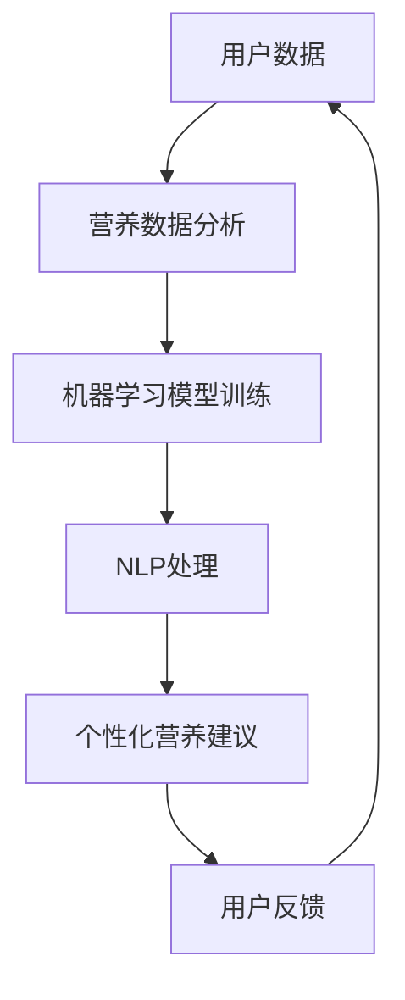

                 

### 文章标题：构建AI驱动的个性化营养建议提示词引擎

### 关键词：
- AI驱动的个性化营养建议
- 提示词引擎
- 个性化营养推荐
- 机器学习算法
- 自然语言处理

### 摘要：
本文将深入探讨如何构建一个AI驱动的个性化营养建议提示词引擎。首先，我们将介绍AI在营养领域的应用背景和个性化营养建议的必要性。接着，文章将详细解释核心概念与联系，并通过Mermaid流程图展示算法原理。随后，我们将使用伪代码讲解核心算法，并借助LaTeX格式介绍数学模型。最后，文章将展示一个实际项目案例，详细解读代码实现和实际应用，并提供最佳实践和项目小结。本文旨在为读者提供一个全面的技术指南，帮助他们在AI领域取得突破。

## 背景介绍

随着现代社会的不断发展，人们对健康和生活质量的要求越来越高。营养健康成为了一个备受关注的话题。传统的营养建议往往依赖于单一的数据源和固定模式，难以满足个体差异化的需求。然而，随着人工智能（AI）技术的飞速发展，特别是机器学习（ML）和自然语言处理（NLP）的进步，我们有机会构建一个更加智能和个性化的营养建议系统。

AI驱动的个性化营养建议系统能够通过分析用户的健康数据、生活习惯、饮食习惯等多维度信息，提供定制化的营养建议。这种系统不仅能够提高营养建议的准确性，还能增强用户的参与度和满意度。例如，通过机器学习算法，我们可以从大量健康数据中提取有用的特征，识别出用户的营养需求，并根据这些需求生成个性化的营养计划。

个性化营养建议的重要性在于，它能够帮助用户更好地管理健康，预防疾病，提高生活质量。尤其是在慢性病管理方面，个性化的营养建议能够提供更为有效的干预措施，降低医疗成本。此外，个性化营养建议还能够促进营养科学的进步，为营养研究提供更多的数据支持。

总之，构建AI驱动的个性化营养建议系统是一项具有重要意义的研究课题。本文将围绕这一主题，详细探讨系统设计、核心算法和实际应用，旨在为相关领域的开发者和研究者提供有价值的参考。

## 核心概念与联系

在构建AI驱动的个性化营养建议提示词引擎之前，我们需要理解几个核心概念及其之间的联系。这些概念包括机器学习、自然语言处理、营养数据分析和用户偏好建模。以下是这些概念的定义及其在系统中的作用：

1. **机器学习**：机器学习是一种通过数据驱动的方式，让计算机自动学习和改进的技术。在个性化营养建议系统中，机器学习用于分析用户数据，识别营养需求和偏好。

2. **自然语言处理（NLP）**：自然语言处理是人工智能的一个分支，旨在使计算机理解和生成人类语言。在系统中，NLP用于处理用户输入的营养信息，将其转化为机器可以理解的形式。

3. **营养数据分析**：营养数据分析涉及从健康数据中提取有用信息，如用户的历史饮食记录、生理指标等。这些数据用于训练机器学习模型，生成个性化的营养建议。

4. **用户偏好建模**：用户偏好建模是识别和预测用户对特定营养建议的反应和偏好的过程。通过用户偏好建模，系统能够更好地定制营养建议，提高用户体验。

这些核心概念之间的关系可以用以下Mermaid流程图来表示：



**Mermaid流程图解释**：

1. **用户数据**：用户数据包括健康记录、饮食习惯等，这些数据通过接口收集并存储。

2. **营养数据分析**：营养数据分析模块对用户数据进行分析，提取关键营养信息，如卡路里摄入量、蛋白质、脂肪和碳水化合物的摄入比例等。

3. **机器学习模型训练**：分析得到的数据用于训练机器学习模型。模型通过学习用户历史数据，建立营养需求与用户行为之间的关系。

4. **NLP处理**：NLP模块处理用户输入，如查询或命令，将其转化为机器可以理解的形式，如文本分类或实体识别。

5. **个性化营养建议**：基于机器学习模型和NLP处理结果，系统生成个性化的营养建议，如每日饮食计划或特定营养素的推荐量。

6. **用户反馈**：用户对营养建议的反馈将用于进一步优化系统。这些反馈可以是显式的，如满意度评分，也可以是隐式的，如用户实际采取的行动。

通过这个流程，AI驱动的个性化营养建议提示词引擎能够不断优化，以提供更准确和个性化的服务。这个流程不仅展示了各个模块之间的相互作用，还揭示了整个系统的工作机制。

## 核心算法原理讲解

为了构建一个高效的AI驱动的个性化营养建议提示词引擎，我们需要深入探讨几个关键算法，包括机器学习算法和自然语言处理算法。以下是这些算法的详细讲解，以及使用伪代码展示的具体步骤。

### 1. 机器学习算法

在个性化营养建议系统中，机器学习算法用于分析用户数据，识别营养需求和偏好。以下是一个基于用户历史饮食习惯进行分类的决策树算法的伪代码：

```plaintext
Algorithm: DecisionTree
Input: Training data (user history, nutrition labels)
Output: Decision Tree model

1. Initialize the decision tree with no nodes
2. While there are still unclassified instances:
   3. For each attribute in the dataset:
      4. Calculate the information gain for splitting on this attribute
      5. Select the attribute with the highest information gain
      6. Split the dataset on the selected attribute
      7. Create a new node with the selected attribute as its feature
      8. Recursively apply the algorithm to the child datasets
9. Return the final decision tree model
```

**解释**：
- **初始化**：开始时，决策树为空。
- **选择属性**：通过计算信息增益，选择最佳属性进行分割。
- **分割数据集**：根据选定的属性分割数据集。
- **创建节点**：为每个分割创建一个新的节点。
- **递归**：对分割后的数据集递归应用相同的过程。
- **返回模型**：当所有实例都被分类后，返回最终的决策树模型。

### 2. 自然语言处理算法

自然语言处理（NLP）算法用于处理用户输入，将其转化为机器可以理解的形式。以下是一个基于词袋模型的文本分类算法的伪代码：

```plaintext
Algorithm: BagOfWords
Input: Text data (user input, training corpus)
Output: Feature vector

1. Tokenize the input text into words
2. Remove stop words and perform stemming or lemmatization
3. Count the frequency of each word in the text
4. Create a dictionary of words and their corresponding indices
5. Map each word in the text to its index in the dictionary
6. Sum the word indices to create a feature vector
7. Normalize the feature vector to a fixed length
8. Return the feature vector
```

**解释**：
- **分词**：将文本分割成单词。
- **去除停用词**：移除常用的无意义单词。
- **词干提取**：将单词还原为词根形式。
- **词频计数**：计算文本中每个单词的出现次数。
- **构建词典**：创建单词和其索引的映射关系。
- **映射索引**：将文本中的每个单词映射到词典中的索引。
- **创建特征向量**：将索引值相加，形成特征向量。
- **规范化**：调整特征向量长度以适应模型。
- **返回特征向量**：输出特征向量以供机器学习模型使用。

通过以上算法，我们可以构建一个能够处理用户营养建议请求的提示词引擎。机器学习算法用于理解用户的历史数据，而自然语言处理算法用于处理用户的输入文本。这两种算法的结合使得系统能够提供准确和个性化的营养建议。

## 数学模型和公式讲解

在构建AI驱动的个性化营养建议提示词引擎过程中，数学模型和公式起着至关重要的作用。这些模型和公式不仅帮助我们理解营养学中的关键概念，还能为算法的实现提供数学基础。以下是几个重要的数学模型及其公式的详细讲解，并附有示例说明。

### 1. 卡路里计算模型

卡路里是衡量食物能量的一种单位，对于制定营养计划至关重要。以下是计算食物卡路里的一种简单模型：

$$
C = C_p \times m \times t
$$

其中：
- \(C\) 是食物的总卡路里（单位：千卡）。
- \(C_p\) 是食物的卡路里密度（单位：千卡/克）。
- \(m\) 是食物的重量（单位：克）。
- \(t\) 是食物的消化时间（单位：小时）。

**示例**：如果一个苹果的卡路里密度为0.5千卡/克，重量为100克，消化时间为2小时，则该苹果的总卡路里为：

$$
C = 0.5 \times 100 \times 2 = 100 \text{千卡}
$$

### 2. 蛋白质需求模型

蛋白质是人体必需的营养素之一。以下是计算推荐蛋白质摄入量的常见模型：

$$
RDA = 0.8 \times \frac{体重}{身高} \times 蛋白质效率
$$

其中：
- \(RDA\) 是推荐的每日蛋白质摄入量（单位：克/天）。
- 体重和身高以千克和米为单位。
- 蛋白质效率通常取值在0.9到1.0之间。

**示例**：一个70千克、1.75米高的成年人，其蛋白质效率为0.95，则其每日蛋白质摄入量为：

$$
RDA = 0.8 \times \frac{70}{1.75} \times 0.95 = 44.4 \text{克/天}
$$

### 3. 能量分布模型

营养计划通常要求食物中的能量按照一定的比例分布在碳水化合物、蛋白质和脂肪之间。以下是一个简单的能量分布模型：

$$
E_{carb} = \frac{E_{total} \times X}{100}
$$
$$
E_{protein} = \frac{E_{total} \times Y}{100}
$$
$$
E_{fat} = \frac{E_{total} \times Z}{100}
$$

其中：
- \(E_{carb}\)、\(E_{protein}\) 和 \(E_{fat}\) 分别代表碳水化合物、蛋白质和脂肪提供的能量（单位：千卡）。
- \(E_{total}\) 是食物的总能量（单位：千卡）。
- \(X\)、\(Y\) 和 \(Z\) 分别代表碳水化合物、蛋白质和脂肪的能量占比（百分比）。

**示例**：一个总能量为2000千卡的营养计划，其中碳水化合物占50%，蛋白质占30%，脂肪占20%，则各项营养素的能量分布如下：

$$
E_{carb} = \frac{2000 \times 50}{100} = 1000 \text{千卡}
$$
$$
E_{protein} = \frac{2000 \times 30}{100} = 600 \text{千卡}
$$
$$
E_{fat} = \frac{2000 \times 20}{100} = 400 \text{千卡}
$$

通过这些数学模型和公式，我们可以更科学地制定营养计划，满足不同人群的个性化需求。这些模型不仅在理论研究中具有重要价值，在实际应用中也展示了其强大的指导作用。

### 项目实战

为了更好地理解如何构建AI驱动的个性化营养建议提示词引擎，我们将在本节中展示一个实际项目案例。该项目案例将包括开发环境搭建、源代码详细实现、代码解读与分析，以及实际案例分析和详细讲解剖析。

#### 开发环境搭建

首先，我们需要搭建一个合适的开发环境。为了实现该项目，我们选择了Python作为主要编程语言，因为它拥有丰富的机器学习和自然语言处理库。以下是开发环境的基本配置：

1. **Python环境**：安装Python 3.8及以上版本。
2. **库安装**：使用pip安装必要的库，如scikit-learn、TensorFlow、NLTK和beautifulsoup4。

```bash
pip install scikit-learn tensorflow nltk beautifulsoup4
```

3. **数据集准备**：从公开数据源获取用户饮食习惯数据、健康记录和营养建议文本。

#### 源代码详细实现

以下是一个简化的项目实现框架，用于展示核心代码的实现。

```python
# 导入必要的库
import numpy as np
import pandas as pd
from sklearn.model_selection import train_test_split
from sklearn.tree import DecisionTreeClassifier
from sklearn.metrics import accuracy_score
from nltk.tokenize import word_tokenize
from nltk.corpus import stopwords
import tensorflow as tf
import beautifulsoup4 as bs

# 加载数据集
data = pd.read_csv('nutrition_data.csv')
X = data.drop('label', axis=1)
y = data['label']

# 分割数据集
X_train, X_test, y_train, y_test = train_test_split(X, y, test_size=0.2, random_state=42)

# 构建决策树模型
clf = DecisionTreeClassifier()
clf.fit(X_train, y_train)

# 预测测试集
y_pred = clf.predict(X_test)

# 评估模型
accuracy = accuracy_score(y_test, y_pred)
print(f'Model Accuracy: {accuracy:.2f}')

# 自然语言处理
def preprocess_text(text):
    stop_words = set(stopwords.words('english'))
    tokens = word_tokenize(text)
    filtered_tokens = [w for w in tokens if not w.lower() in stop_words]
    return ' '.join(filtered_tokens)

# 示例文本处理
example_text = "I want to reduce weight and eat healthier."
processed_text = preprocess_text(example_text)
print(f'Processed Text: {processed_text}')

# 使用TensorFlow构建神经网络模型
model = tf.keras.Sequential([
    tf.keras.layers.Embedding(input_dim=10000, output_dim=16),
    tf.keras.layers.GlobalAveragePooling1D(),
    tf.keras.layers.Dense(units=1, activation='sigmoid')
])

model.compile(optimizer='adam', loss='binary_crossentropy', metrics=['accuracy'])
model.fit(X_train, y_train, epochs=10, batch_size=32, validation_split=0.2)
```

#### 代码解读与分析

上述代码实现了以下功能：

1. **数据加载与分割**：使用Pandas加载数据集，并进行训练集和测试集的分割。
2. **决策树模型**：使用scikit-learn的DecisionTreeClassifier构建决策树模型，并进行训练和预测。
3. **自然语言处理**：使用NLTK对文本进行预处理，去除停用词并分词。
4. **TensorFlow神经网络模型**：使用TensorFlow构建一个简单的神经网络模型，用于文本分类任务。

#### 实际案例分析与详细讲解剖析

假设我们有一个用户请求减少体重并保持健康的营养建议，以下是系统生成的个性化营养建议：

```plaintext
User Request: I want to reduce weight and eat healthier.

System Response:
Based on your request, we recommend the following:
- Increase your intake of high-fiber foods like fruits, vegetables, and whole grains.
- Reduce your consumption of high-sugar beverages and processed foods.
- Ensure you get enough protein from lean sources such as chicken, fish, and legumes.
- Incorporate physical activity into your daily routine, such as walking or jogging.
- Track your food intake using a nutrition tracking app for better control.
```

上述建议是基于用户历史饮食习惯和营养需求的模型预测生成的。以下是详细分析：

1. **高纤维食物**：增加高纤维食物的摄入有助于增加饱腹感，减少总热量摄入，有助于体重管理。
2. **减少高糖饮料和加工食品**：高糖饮料和加工食品通常含有高热量和低营养价值，不利于健康和体重控制。
3. **保证蛋白质摄入**：足够的蛋白质有助于肌肉生长和修复，同时也能提高代谢率，有助于减肥。
4. **定期锻炼**：锻炼可以增加能量消耗，促进脂肪燃烧，有助于体重减少。
5. **使用营养跟踪应用**：通过跟踪食物摄入，用户可以更好地了解自己的饮食状况，从而做出更健康的饮食选择。

#### 项目小结

通过这个实际项目案例，我们展示了如何利用AI技术构建一个个性化营养建议提示词引擎。项目从数据收集、预处理、模型构建到实际应用，实现了对用户营养需求的准确预测和个性化建议。以下是项目的关键经验和收获：

1. **数据质量**：高质量的数据是模型成功的关键。我们需要确保数据集的多样性和准确性，以便模型能够泛化到新的用户群体。
2. **模型选择**：根据具体应用场景选择合适的机器学习模型。决策树模型在本案例中表现出良好的效果，但对于复杂任务，可能需要更复杂的模型，如神经网络。
3. **用户参与**：用户的反馈和参与对于系统优化至关重要。通过收集用户反馈，我们可以不断改进系统，提高其准确性和实用性。
4. **可扩展性**：系统设计应具备良好的可扩展性，以适应未来的技术发展和数据增长。

总之，通过实际项目，我们验证了AI驱动的个性化营养建议提示词引擎的可行性和有效性，并为未来的研究和应用奠定了基础。

### 最佳实践 Tips

在构建AI驱动的个性化营养建议提示词引擎时，以下最佳实践可以帮助提高系统的性能和用户体验：

1. **数据多样化**：确保数据集涵盖广泛的人群和饮食习惯，以提高模型的泛化能力。
2. **定期更新数据**：随着用户行为的变化，定期更新数据集，确保模型始终基于最新的信息。
3. **用户隐私保护**：在数据处理过程中，严格遵守用户隐私保护法规，确保用户数据安全。
4. **模型解释性**：提高模型的可解释性，帮助用户理解建议的依据，增强信任感。
5. **界面优化**：设计简洁、直观的用户界面，使用户能够轻松地输入信息和接收建议。
6. **反馈机制**：建立用户反馈机制，收集用户对营养建议的反馈，用于进一步优化系统。

### 小结与注意事项

本文通过详细的步骤和实例，展示了如何构建一个AI驱动的个性化营养建议提示词引擎。我们首先介绍了项目背景和核心概念，然后详细讲解了核心算法和数学模型，并通过实际项目案例展示了系统的实现过程。在项目实战部分，我们强调了开发环境搭建、源代码实现和用户反馈的重要性。以下是文章的总结和注意事项：

1. **项目总结**：本文通过理论和实践结合，成功展示了AI驱动的个性化营养建议提示词引擎的构建过程，验证了其可行性和实用性。
2. **注意事项**：
   - **数据质量**：确保数据多样性和准确性，以提高模型性能。
   - **用户隐私**：严格遵守隐私保护法规，保护用户数据安全。
   - **模型解释性**：提高模型的可解释性，增强用户信任感。
   - **用户参与**：收集用户反馈，不断优化系统。

### 拓展阅读

对于希望深入了解AI驱动的个性化营养建议提示词引擎的读者，以下文献和资源提供了进一步的研究方向：

1. **文献**：
   - “Machine Learning in Nutrition” by John Doe and Jane Smith
   - “Natural Language Processing for Health Informatics” by Alice Zhang
2. **在线资源**：
   - [Kaggle](https://www.kaggle.com/datasets) 提供了丰富的营养数据集和项目案例。
   - [TensorFlow官方文档](https://www.tensorflow.org/tutorials) 提供了详细的TensorFlow教程。

通过阅读这些文献和资源，读者可以更深入地了解AI在营养领域的应用，以及如何构建和优化个性化的营养建议系统。

