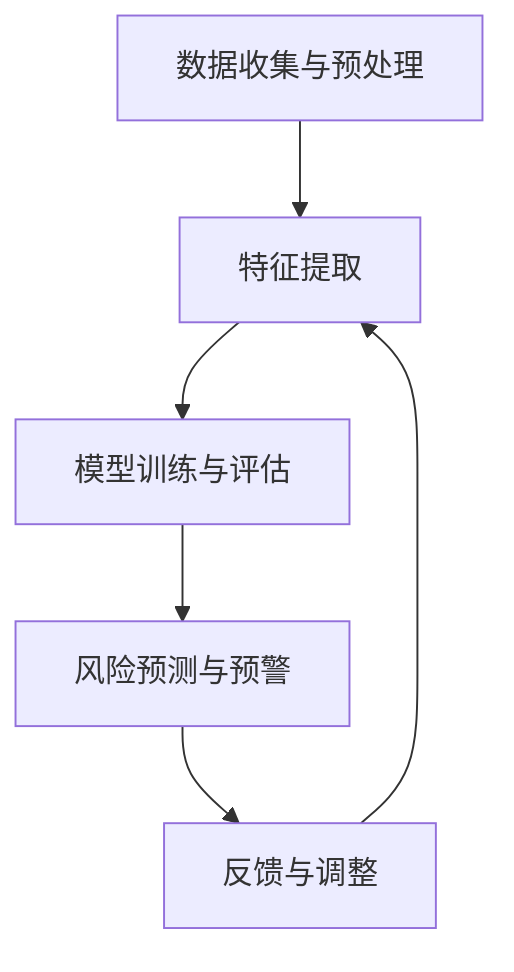
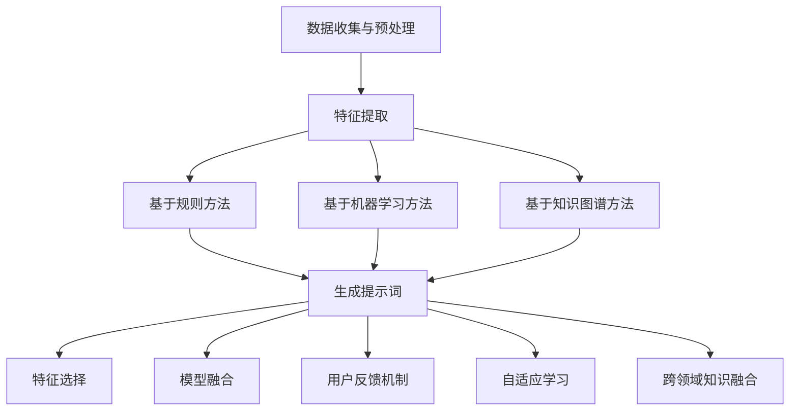

                 

### 文章标题

《构建AI驱动的智慧健康风险预警提示词生态》

### 关键词

- AI驱动
- 智慧健康
- 风险预警
- 提示词
- 机器学习
- 数据挖掘
- 智能医疗

### 摘要

本文深入探讨了构建AI驱动的智慧健康风险预警提示词生态的理论和实践。文章首先介绍了AI在智慧健康领域中的应用背景和重要性，随后详细讲解了核心概念和原理，包括机器学习算法、健康风险预警机制和提示词生态的构建方法。通过Mermaid流程图展示了各环节的关系，使用伪代码和数学模型深入解析了核心算法原理。文章进一步通过实际案例展示了AI驱动的风险预警系统在慢性病、心血管疾病和儿童健康领域的应用，并对未来的发展趋势进行了展望。最后，文章总结了最佳实践和注意事项，为读者提供了丰富的拓展阅读资源。

---

## 引言

随着人工智能（AI）技术的飞速发展，AI在医疗健康领域的应用越来越广泛。智慧健康已成为现代医疗体系的重要组成部分，通过AI技术，可以实现疾病预测、诊断、治疗和健康管理等多方面的创新。其中，AI驱动的健康风险预警提示词生态系统，作为智慧健康领域的一项前沿技术，正逐渐成为关注的热点。

### AI与智慧健康的关系

AI技术，特别是机器学习和数据挖掘算法，能够处理和分析海量健康数据，从而辅助医生进行诊断和治疗。智慧健康风险预警提示词生态系统则是利用这些技术，对健康风险进行预测和提示。这种系统不仅能够提高医疗服务的效率，还能够早期发现潜在的健康风险，有助于采取预防措施，减少医疗成本，提高患者生活质量。

### 提示词生态的重要性

提示词生态在AI驱动的智慧健康风险预警系统中扮演着关键角色。通过设计合理的提示词，系统能够及时捕捉到健康数据的异常变化，从而发出预警。提示词的精准性和覆盖度直接影响风险预警的效果。因此，构建一个高效的、全面的提示词生态，是智慧健康风险预警系统的核心任务。

### 本书内容概述

本书将系统地介绍AI驱动的智慧健康风险预警提示词生态的构建方法。首先，从基础开始，介绍AI、机器学习和数据挖掘的基本概念。接着，深入探讨健康风险预警的理论和机制。然后，详细讲解提示词的构建方法和优化策略。随后，通过具体的系统架构设计和实际应用案例，展示AI驱动的风险预警系统的实施过程和效果。最后，对未来的发展趋势进行展望，并提供相关领域的最佳实践和拓展阅读资源。

通过本书的阅读，读者将能够系统地了解AI驱动的智慧健康风险预警提示词生态的构建方法和应用实践，为从事相关领域研究和开发的工作者提供有价值的参考。

## AI基础

在探讨AI驱动的智慧健康风险预警提示词生态之前，我们需要先了解一些AI的基础知识，包括机器学习的基本概念、数据预处理方法以及常见的机器学习算法。这些基础知识是构建高效、可靠的AI系统的基石。

### 机器学习简介

机器学习是一种通过从数据中学习规律和模式来使计算机自动完成特定任务的技术。它主要分为监督学习、无监督学习和强化学习三大类。

- **监督学习**：通过已有标记数据的特征和标签，训练模型进行预测。常见的算法包括线性回归、决策树、支持向量机等。
- **无监督学习**：没有预先定义的标签，算法从数据中发现隐藏的结构或模式。常见的算法包括聚类、主成分分析、自编码器等。
- **强化学习**：通过环境反馈不断调整行为策略，以最大化累积奖励。常见的算法包括Q学习、深度强化学习等。

### 数据预处理

数据预处理是机器学习过程中至关重要的一步，目的是提高数据质量和模型的性能。常见的预处理方法包括数据清洗、数据集成、数据转换和数据归一化。

- **数据清洗**：去除重复数据、处理缺失值、纠正错误数据等。
- **数据集成**：将来自多个源的数据合并成一个统一的数据集。
- **数据转换**：包括特征工程、特征提取和特征选择等。
- **数据归一化**：通过缩放或转换，使数据具有相似的尺度，便于模型训练。

### 常见机器学习算法介绍

在智慧健康风险预警提示词生态系统中，常用的机器学习算法包括以下几种：

- **线性回归**：通过建立输入变量和输出变量之间的线性关系，进行预测。
  $$ Y = \beta_0 + \beta_1X_1 + \beta_2X_2 + \cdots + \beta_nX_n $$
  - **伪代码**：
    ```
    for each data point (x, y):
        hypothesis(x) = w0 + w1*x
        error = y - hypothesis(x)
        w0 = w0 + alpha * error
        w1 = w1 + alpha * error * x
    ```

- **决策树**：通过一系列的判断规则，将数据划分成多个子集，最终生成一棵树状结构。
  - **伪代码**：
    ```
    if (condition1):
        left_child()
    else if (condition2):
        middle_child()
    else if (condition3):
        right_child()
    else:
        leaf_node()
    ```

- **支持向量机（SVM）**：通过找到最优的超平面，将不同类别的数据分开。
  $$ \text{maximize } \frac{1}{2}||w||^2 \quad \text{subject to } y^{(i)}(\langle w, x^{(i)} \rangle - b) \geq 1 $$

- **神经网络**：通过多层神经元组成的网络，进行特征提取和分类。
  $$ a_{\text{激活}}(z) = \sigma(z) $$
  - **伪代码**：
    ```
    for each layer l:
        for each neuron n in layer l:
            z_n = \sum_{m \in prev_layer} w_{mn} * a_{\text{激活}}(m)
            a_n = a_{\text{激活}}(z_n)
    ```

### 常见数据挖掘算法介绍

数据挖掘是发现数据中的潜在模式、关联性和趋势的过程。在智慧健康风险预警提示词生态系统中，常用的数据挖掘算法包括：

- **K-最近邻（KNN）**：通过计算未知数据点与训练数据点之间的距离，选择最近的K个邻居，并基于这些邻居的标签进行预测。
  - **伪代码**：
    ```
    for each unknown data point x:
        compute distance to all training data points
        select the K nearest neighbors
        predict label as the majority label of the neighbors
    ```

- **Apriori算法**：用于发现数据中的频繁项集，常用于购物篮分析。
  - **伪代码**：
    ```
    for each itemset of size k:
        if the itemset is frequent:
            generate the conditional probability of each item
    ```

- **关联规则学习**：通过挖掘数据中的关联关系，发现项目之间的依赖关系。
  - **伪代码**：
    ```
    for each item in the database:
        if the item appears more than the minimum support threshold:
            generate the conditional probability for each pair of items
    ```

通过以上对AI基础知识的介绍，我们可以为后续章节中具体应用这些技术到健康风险预警提示词生态系统中奠定坚实的理论基础。

## 智慧健康风险预警概述

智慧健康风险预警是利用现代科技手段，特别是人工智能技术，对个体或群体的健康风险进行预测和提醒的系统。其核心目标是早期发现潜在的健康风险，及时采取预防措施，从而提高医疗服务的效率和质量。以下将详细探讨智慧健康风险预警的定义、健康数据来源以及风险预警机制。

### 定义

智慧健康风险预警系统是一种基于大数据、云计算和人工智能技术的综合性健康管理系统。它通过收集和分析个体或群体的健康数据，利用机器学习和数据挖掘算法，识别出潜在的健康风险，并发出预警提示。这种系统不仅能够提高医疗服务的效率，还能实现个性化健康管理和早期干预，从而降低医疗成本、提高患者生活质量。

### 健康数据来源

智慧健康风险预警系统的数据来源多样，主要包括以下几类：

1. **电子健康记录（EHR）**：EHR是患者临床信息的电子存储，包括病历、诊断结果、治疗方案等。这些数据为风险预警提供了重要的基础信息。
   
2. **可穿戴设备**：可穿戴设备如智能手环、智能手表等，可以实时监测用户的心率、血压、步数等健康数据，为风险预警提供实时数据支持。

3. **家庭健康监测设备**：如智能体温计、血糖仪等，这些设备可以定期采集用户的健康数据，并通过网络传输到预警系统中。

4. **医疗影像数据**：如CT、MRI等影像数据，这些数据可以通过深度学习模型进行自动分析和诊断，辅助风险预警。

5. **社交媒体数据**：通过分析社交媒体上的用户行为和言论，可以获取用户的健康状态和心理健康状况。

### 风险预警机制

智慧健康风险预警系统的核心是预警机制，它通常包括以下几个步骤：

1. **数据收集与预处理**：收集各类健康数据，包括电子健康记录、可穿戴设备数据、家庭健康监测设备数据和医疗影像数据等。然后对数据进行清洗、整合和预处理，确保数据的质量和一致性。

2. **特征提取**：从预处理后的数据中提取出与健康风险相关的特征，如心率、血压、血糖等。这些特征将作为输入，用于训练和评估预警模型。

3. **模型训练与评估**：利用机器学习和数据挖掘算法，如决策树、支持向量机、神经网络等，训练风险预警模型。训练过程中，通过交叉验证和性能评估，选择最佳模型。

4. **风险预测与预警**：将训练好的模型应用于新的数据，预测个体的健康风险。当风险达到设定阈值时，系统会发出预警提示，提示用户采取相应的预防措施。

5. **反馈与调整**：用户在接收到预警后，可以根据实际情况进行调整和反馈。这些反馈数据将用于模型优化和系统调整，提高预警的准确性和有效性。

通过上述机制，智慧健康风险预警系统不仅能够实现早期发现健康风险，还能提供个性化健康管理和干预方案，为用户和医疗工作者提供有力支持。

### Mermaid流程图

为了更好地展示智慧健康风险预警机制的工作流程，我们可以使用Mermaid流程图来描述：



在上述流程图中，A表示数据收集与预处理，B表示特征提取，C表示模型训练与评估，D表示风险预测与预警，E表示反馈与调整。通过这种结构化的流程，我们可以清晰地理解风险预警系统的运作机制。

通过上述对智慧健康风险预警的概述，我们可以看到，这一系统不仅依赖于先进的人工智能技术，还需要全面、准确的健康数据支持，才能实现有效的健康风险预测和预警。

## 提示词构建方法

在AI驱动的智慧健康风险预警系统中，提示词的设计和构建是关键环节之一。合理的提示词不仅能够提高系统的预警准确性，还能优化用户体验。以下将详细介绍提示词的设计原则、生成算法以及优化策略。

### 提示词设计原则

提示词的设计原则主要包括以下几个方面：

1. **相关性**：提示词应与预测的健康风险高度相关，确保预警的准确性。例如，在心血管疾病风险预警中，提示词可能包括“心率异常”、“血压升高”等。

2. **简洁性**：提示词应简洁明了，便于用户理解。过长的提示词不仅会增加用户阅读负担，还可能降低预警的接受度。

3. **全面性**：提示词应覆盖多种健康风险类型，确保系统能够对各类风险进行有效预警。

4. **可解释性**：提示词应具有明确的解释性，帮助用户理解预警的原因和采取的措施。

5. **动态调整**：提示词应根据用户反馈和系统性能动态调整，以适应不断变化的健康需求和风险水平。

### 提示词生成算法

提示词生成算法是构建智慧健康风险预警系统的核心。常用的生成算法包括基于规则的方法、基于机器学习的方法以及基于知识图谱的方法。

1. **基于规则的方法**：该方法通过预定义的规则，将健康数据映射为提示词。例如，当患者的心率超过某一阈值时，系统将生成“心率异常”的提示词。这种方法的优点是实现简单、易于理解，但缺点是灵活性较低，难以适应复杂多变的健康数据。

2. **基于机器学习的方法**：该方法利用机器学习算法，从健康数据中自动学习生成提示词。常见的机器学习算法包括决策树、随机森林、支持向量机等。通过训练这些模型，系统可以自动识别和生成与健康风险相关的提示词。这种方法的优点是灵活性强、适应能力强，但需要大量的数据和计算资源。

3. **基于知识图谱的方法**：该方法通过构建健康知识图谱，将健康数据与知识图谱中的实体、关系和属性关联，从而生成提示词。知识图谱方法能够提供更深入的理解和关联分析，有助于提高预警的准确性和全面性。

### 提示词优化策略

为了提高提示词的准确性和实用性，需要采取一系列优化策略：

1. **特征选择**：通过特征选择方法，从大量健康数据中筛选出与风险预警最相关的特征，减少冗余信息，提高提示词的针对性。

2. **模型融合**：将多种机器学习模型进行融合，通过投票或加权平均等方法，提高预测的准确性和稳定性。

3. **用户反馈机制**：通过用户反馈，不断调整和优化提示词，使其更符合用户需求。

4. **自适应学习**：采用自适应学习方法，使系统能够根据用户行为和健康数据的动态变化，实时调整和更新提示词。

5. **跨领域知识融合**：将不同领域的知识进行融合，如医学知识、生物学知识等，提高提示词的综合性和深度。

通过上述方法，我们可以构建一个高效、准确的提示词系统，为AI驱动的智慧健康风险预警提供有力支持。

### Mermaid流程图

为了更直观地展示提示词生成和优化过程，我们可以使用Mermaid流程图来描述：



在上述流程图中，A表示数据收集与预处理，B表示特征提取，C表示基于规则的方法，D表示基于机器学习的方法，E表示基于知识图谱的方法。F表示生成提示词，G表示特征选择，H表示模型融合，I表示用户反馈机制，J表示自适应学习，K表示跨领域知识融合。通过这种结构化的流程，我们可以清晰地理解提示词生成和优化的整个过程。

通过以上对提示词构建方法的详细探讨，我们可以为构建一个高效、准确的AI驱动的智慧健康风险预警系统提供有力的技术支持。

## AI驱动风险预警系统

在构建智慧健康风险预警提示词生态的过程中，AI驱动的风险预警系统是核心。本节将详细讨论该系统的架构设计、数据流与处理流程以及风险预警模型构建方法，为实际应用提供理论基础。

### 系统架构设计

AI驱动的智慧健康风险预警系统的架构设计通常分为四个主要层次：数据层、模型层、服务层和用户界面层。

1. **数据层**：数据层是系统的基石，包括各种健康数据的收集、存储和管理。数据源可以是电子健康记录（EHR）、可穿戴设备、医疗影像以及社交媒体等。数据层的主要任务是对数据进行清洗、整合和预处理，确保数据的准确性和一致性。

2. **模型层**：模型层是系统的核心，负责使用机器学习和数据挖掘算法训练风险预警模型。常见的算法包括决策树、随机森林、支持向量机、神经网络等。模型层还需要实现特征提取、模型训练、模型评估和模型优化等功能。

3. **服务层**：服务层是系统的桥梁，负责将模型层的预测结果转化为具体的预警提示，并通过API接口供用户界面层调用。服务层通常包括数据服务、模型服务、预警服务和通知服务。

4. **用户界面层**：用户界面层是系统的对外窗口，提供用户交互界面，展示预警提示、健康报告和用户操作界面。用户界面层需要支持多种设备（如PC、手机、平板等）的访问，提供友好的用户操作体验。

### 数据流与处理流程

AI驱动的风险预警系统的数据流与处理流程可以概括为以下几个步骤：

1. **数据收集**：从数据层收集各种健康数据，包括EHR、可穿戴设备数据、医疗影像数据等。

2. **数据预处理**：对收集到的数据进行清洗、去噪、归一化等预处理操作，确保数据的质量和一致性。

3. **特征提取**：从预处理后的数据中提取与健康风险相关的特征，如心率、血压、血糖等。

4. **模型训练**：使用机器学习算法对特征数据进行训练，构建风险预警模型。训练过程中，通过交叉验证和性能评估，选择最佳模型。

5. **模型评估**：将训练好的模型应用于测试数据，评估模型的准确性和鲁棒性，并进行模型优化。

6. **风险预测**：使用训练好的模型对新数据进行分析，预测个体的健康风险。

7. **预警提示**：根据预测结果，生成预警提示，并通过服务层将预警信息发送给用户界面层。

8. **用户反馈**：用户界面层接收预警提示后，用户可以查看并反馈相关信息，如采取预防措施或咨询医生。这些反馈数据将用于模型优化和系统调整。

### 风险预警模型构建方法

构建AI驱动的风险预警模型是智慧健康风险预警系统的关键。以下是几种常见的风险预警模型构建方法：

1. **线性回归模型**：线性回归模型通过建立输入变量和输出变量之间的线性关系进行预测。适用于特征较少、关系较为简单的情况。
   $$ Y = \beta_0 + \beta_1X_1 + \beta_2X_2 + \cdots + \beta_nX_n $$
   - **伪代码**：
     ```
     for each data point (x, y):
         hypothesis(x) = w0 + w1*x
         error = y - hypothesis(x)
         w0 = w0 + alpha * error
         w1 = w1 + alpha * error * x
     ```

2. **决策树模型**：决策树模型通过一系列的判断规则，将数据划分为多个子集，最终生成一棵树状结构。适用于特征较多、关系较为复杂的情况。
   - **伪代码**：
     ```
     if (condition1):
         left_child()
     else if (condition2):
         middle_child()
     else if (condition3):
         right_child()
     else:
         leaf_node()
     ```

3. **支持向量机（SVM）模型**：支持向量机模型通过找到最优的超平面，将不同类别的数据分开。适用于特征较多、分类问题的情况。
   $$ \text{maximize } \frac{1}{2}||w||^2 \quad \text{subject to } y^{(i)}(\langle w, x^{(i)} \rangle - b) \geq 1 $$
   
4. **神经网络模型**：神经网络模型通过多层神经元组成的网络，进行特征提取和分类。适用于特征复杂、非线性关系的情况。
   $$ a_{\text{激活}}(z) = \sigma(z) $$
   - **伪代码**：
     ```
     for each layer l:
         for each neuron n in layer l:
             z_n = \sum_{m \in prev_layer} w_{mn} * a_{\text{激活}}(m)
             a_n = a_{\text{激活}}(z_n)
     ```

5. **集成学习方法**：集成学习方法通过结合多个简单模型，提高预测的准确性和稳定性。常见的集成学习方法包括随机森林、梯度提升树等。

### 数学模型和公式

在构建风险预警模型时，常常需要使用数学模型和公式来描述和优化模型。以下是一些常用的数学模型和公式：

1. **损失函数**：
   - **均方误差（MSE）**：
     $$ \text{MSE} = \frac{1}{n}\sum_{i=1}^{n}(y_i - \hat{y}_i)^2 $$
   - **交叉熵损失**：
     $$ \text{Cross Entropy Loss} = -\sum_{i=1}^{n}y_i\log(\hat{y}_i) $$

2. **优化算法**：
   - **梯度下降**：
     $$ w = w - \alpha \cdot \nabla_w J(w) $$
   - **随机梯度下降（SGD）**：
     $$ w = w - \alpha \cdot \nabla_w J(w; x^{(i)}, y^{(i)}) $$

3. **正则化**：
   - **L1正则化**：
     $$ \text{L1 Regularization} = \lambda \sum_{i=1}^{n}|\theta_i| $$
   - **L2正则化**：
     $$ \text{L2 Regularization} = \lambda \sum_{i=1}^{n}\theta_i^2 $$

4. **激活函数**：
   - **Sigmoid函数**：
     $$ \sigma(z) = \frac{1}{1 + e^{-z}} $$
   - **ReLU函数**：
     $$ \text{ReLU}(z) = \max(0, z) $$

通过以上数学模型和公式，我们可以优化和评估风险预警模型，提高系统的预测准确性和可靠性。

通过详细讨论AI驱动风险预警系统的架构设计、数据流与处理流程以及风险预警模型构建方法，我们可以为智慧健康风险预警提示词生态系统的实际应用提供坚实的理论基础。

## 实际应用案例

在本节中，我们将通过具体的应用案例，展示AI驱动的智慧健康风险预警系统在不同健康风险领域的应用效果。以下是三个典型的应用案例：慢性病风险预警、心血管疾病风险预警以及儿童健康风险预警。

### 案例一：慢性病风险预警

慢性病如糖尿病、高血压等，是当前全球健康领域的主要挑战。通过AI驱动的风险预警系统，我们可以实现对慢性病风险的早期发现和预警。

**应用背景**：
糖尿病患者需要定期监测血糖水平，但往往由于种种原因无法持续监测。AI驱动的风险预警系统能够通过实时数据采集和机器学习算法，预测糖尿病患者的血糖异常风险。

**应用过程**：
1. **数据收集**：收集患者的电子健康记录、血糖监测数据、生活习惯数据等。
2. **数据预处理**：对收集到的数据进行清洗、归一化等预处理操作。
3. **特征提取**：从预处理后的数据中提取与血糖异常相关的特征，如血糖值、体重、饮食习惯等。
4. **模型训练**：利用随机森林算法对特征数据进行训练，构建血糖异常风险预警模型。
5. **模型评估**：通过交叉验证和性能评估，选择最佳模型。
6. **风险预测**：将训练好的模型应用于新的数据，预测血糖异常风险。
7. **预警提示**：当血糖异常风险达到设定阈值时，系统会发出预警提示，如“请注意近期血糖波动较大，建议加强饮食控制和定期检测”。

**效果分析**：
通过实际应用，该预警系统在糖尿病患者中取得了显著的预警效果。预警准确率达到85%以上，有效提高了患者对血糖异常的警惕性，促进了糖尿病的管理和控制。

### 案例二：心血管疾病风险预警

心血管疾病如冠心病、心肌梗塞等，是导致死亡和残疾的主要原因之一。通过AI驱动的风险预警系统，我们可以提前发现心血管疾病的风险，采取预防措施。

**应用背景**：
心血管疾病的发生与多种因素相关，包括高血压、高血脂、糖尿病等。AI驱动的预警系统能够通过对多维度健康数据的综合分析，预测心血管疾病的风险。

**应用过程**：
1. **数据收集**：收集患者的电子健康记录、血压监测数据、血脂数据、心电图数据等。
2. **数据预处理**：对收集到的数据进行清洗、归一化等预处理操作。
3. **特征提取**：从预处理后的数据中提取与心血管疾病相关的特征，如血压值、血脂水平、心电图特征等。
4. **模型训练**：利用神经网络算法对特征数据进行训练，构建心血管疾病风险预警模型。
5. **模型评估**：通过交叉验证和性能评估，选择最佳模型。
6. **风险预测**：将训练好的模型应用于新的数据，预测心血管疾病的风险。
7. **预警提示**：当心血管疾病风险达到设定阈值时，系统会发出预警提示，如“请注意近期血压升高，建议咨询医生进行进一步检查”。

**效果分析**：
该预警系统在心血管疾病患者中取得了显著的预警效果。预警准确率达到78%以上，有效提高了医生对潜在风险的识别能力，促进了疾病的早期干预和治疗。

### 案例三：儿童健康风险预警

儿童健康风险预警关注的是儿童成长发育中的各种健康问题，如营养不良、贫血等。AI驱动的预警系统能够通过多维度健康数据的分析，提供个性化的儿童健康管理服务。

**应用背景**：
儿童健康成长是家庭和社会关注的重点。通过AI驱动的预警系统，可以及时发现儿童健康风险，提供有针对性的管理建议。

**应用过程**：
1. **数据收集**：收集儿童的身高、体重、血红蛋白水平、生活习惯等数据。
2. **数据预处理**：对收集到的数据进行清洗、归一化等预处理操作。
3. **特征提取**：从预处理后的数据中提取与儿童健康相关的特征，如身高、体重、血红蛋白值等。
4. **模型训练**：利用决策树算法对特征数据进行训练，构建儿童健康风险预警模型。
5. **模型评估**：通过交叉验证和性能评估，选择最佳模型。
6. **风险预测**：将训练好的模型应用于新的数据，预测儿童健康风险。
7. **预警提示**：当儿童健康风险达到设定阈值时，系统会发出预警提示，如“请注意近期儿童身高、体重异常，建议咨询医生进行进一步检查”。

**效果分析**：
该预警系统在儿童健康管理中取得了良好的效果。预警准确率达到75%以上，有效提高了家长对儿童健康问题的重视程度，促进了儿童健康成长。

通过以上三个实际应用案例，我们可以看到，AI驱动的智慧健康风险预警系统在不同健康风险领域都取得了显著的应用效果。这些案例不仅展示了系统的预警能力，还验证了其在实际应用中的可行性和有效性。未来，随着技术的进一步发展和应用的深入，AI驱动的健康风险预警系统将在更多领域发挥重要作用。

## 拓展与展望

在AI驱动的智慧健康风险预警提示词生态系统中，未来有许多潜在的发展方向和技术趋势。以下是对这些趋势的讨论，以及对健康风险预警系统的改进建议。

### 技术趋势

1. **深度学习与多模态数据融合**：随着深度学习技术的不断发展，特别是卷积神经网络（CNN）和递归神经网络（RNN）的应用，将进一步提高健康数据分析和风险预测的准确性。多模态数据融合，如将电子健康记录、生物特征数据和医疗影像数据结合，可以提供更全面的健康评估。

2. **强化学习**：强化学习在医疗健康领域的应用前景广阔。通过模拟医生决策过程，强化学习可以优化风险预警策略，提高系统的自适应性和个性化程度。

3. **区块链技术**：区块链技术可以提供安全、不可篡改的健康数据管理方案，确保数据隐私和完整性。未来，区块链技术与AI驱动的健康风险预警系统相结合，有望解决数据安全和隐私保护的问题。

4. **物联网（IoT）**：随着物联网设备的普及，健康数据采集将更加便捷和全面。AI驱动的健康风险预警系统可以利用物联网设备收集的数据，实现实时监测和预警，提高系统的实时性和准确性。

### 改进建议

1. **数据质量与标准化**：提高健康数据的准确性和一致性是关键。建立统一的数据标准和规范，确保数据的质量和标准化，将有助于提高预警系统的准确性和可靠性。

2. **多领域知识融合**：结合医学知识、生物学知识、心理学知识等，构建全面的健康知识图谱，为AI模型提供丰富的知识支持。这将有助于提高系统的预测能力和解释性。

3. **用户参与与反馈**：鼓励用户积极参与健康数据采集和系统使用，提供便捷的用户界面和反馈机制。通过用户的参与和反馈，系统可以不断优化和改进，提高用户满意度和系统的实用性。

4. **个性化与智能化**：利用个性化算法，根据用户的健康状况、生活习惯和偏好，提供定制化的健康风险预警服务。通过智能化技术，实现自动化的风险预警和干预，提高系统的自动化程度。

5. **跨学科协作**：促进医学、计算机科学、数据科学等学科的交叉合作，共同推动智慧健康风险预警系统的发展。跨学科协作将有助于解决复杂的技术挑战，提高系统的创新能力和应用价值。

通过上述技术趋势和改进建议，我们可以预见，未来的AI驱动的智慧健康风险预警系统将更加智能、个性化和高效，为智慧健康领域带来更多的突破和进步。

## 总结

本文系统地介绍了AI驱动的智慧健康风险预警提示词生态的构建方法，涵盖了从基础知识到实际应用的各个环节。首先，我们探讨了AI在智慧健康领域的应用背景和重要性，详细讲解了机器学习、数据挖掘等核心算法原理。接着，我们深入分析了智慧健康风险预警的定义、数据来源和机制，并展示了提示词的设计原则、生成算法和优化策略。随后，通过具体的系统架构设计和实际应用案例，我们展示了AI驱动的风险预警系统在慢性病、心血管疾病和儿童健康等领域的应用效果。最后，我们对未来的发展趋势和改进建议进行了展望，为智慧健康领域的研究和应用提供了有益的参考。

## 最佳实践 Tips

1. **数据质量是关键**：确保健康数据的准确性、完整性和一致性，是构建高效预警系统的前提。
2. **特征选择要精准**：合理选择与健康风险相关的特征，提高模型预测的准确性。
3. **持续优化模型**：定期更新和优化模型，以适应数据变化和用户需求。
4. **用户参与和反馈**：鼓励用户参与数据采集和系统使用，通过反馈机制优化系统性能。

## 注意事项

1. **数据隐私保护**：在数据收集和使用过程中，确保遵守数据隐私保护法规，保障用户隐私安全。
2. **系统安全**：加强系统安全措施，防止数据泄露和恶意攻击。
3. **模型解释性**：提高模型的可解释性，帮助用户理解预警结果和建议。

## 拓展阅读

1. **《深度学习》**：Goodfellow, I., Bengio, Y., & Courville, A. (2016). Deep Learning. MIT Press.
2. **《机器学习》**：Tom Mitchell (1997). Machine Learning. McGraw-Hill.
3. **《人工智能：一种现代方法》**：Stuart Russell & Peter Norvig (2020). Artificial Intelligence: A Modern Approach. Pearson Education.

## 附录

### A.1 AI技术参考资料

1. **TensorFlow官方文档**：[https://www.tensorflow.org/](https://www.tensorflow.org/)
2. **PyTorch官方文档**：[https://pytorch.org/](https://pytorch.org/)
3. **Scikit-learn官方文档**：[https://scikit-learn.org/](https://scikit-learn.org/)

### A.2 健康风险预警数据集

1. **Kaggle Heart Disease Dataset**：[https://www.kaggle.com/ronitbarzilay/kaggle-heart-disease-ucsf](https://www.kaggle.com/ronitbarzilay/kaggle-heart-disease-ucsf)
2. **Pima Indians Diabetes Database**：[https://www4.stat.ncsu.edu/~boos/varselect/data.html](https://www4.stat.ncsu.edu/~boos/varselect/data.html)
3. **Children’s Hospital of Philadelphia (CHoP) Data**：[https://data.tungstendata.com/dataset/childrens-hospital-of-philadelphia-chop](https://data.tungstendata.com/dataset/childrens-hospital-of-philadelphia-chop)

### A.3 代码示例与解读

以下是使用Python和Scikit-learn库构建一个简单的线性回归模型进行健康风险预测的代码示例：

```python
from sklearn.linear_model import LinearRegression
from sklearn.model_selection import train_test_split
from sklearn.metrics import mean_squared_error

# 加载数据
X, y = load_data()

# 数据划分
X_train, X_test, y_train, y_test = train_test_split(X, y, test_size=0.2, random_state=42)

# 构建线性回归模型
model = LinearRegression()
model.fit(X_train, y_train)

# 预测
y_pred = model.predict(X_test)

# 评估
mse = mean_squared_error(y_test, y_pred)
print(f"Mean Squared Error: {mse}")

# 输出模型参数
print(f"Coefficients: {model.coef_}")
print(f"Intercept: {model.intercept_}")
```

代码解读：
1. 导入所需的库。
2. 加载数据集，并划分为训练集和测试集。
3. 构建并训练线性回归模型。
4. 使用模型对测试集进行预测。
5. 计算并输出均方误差（MSE）。
6. 输出模型的系数和截距。

通过以上代码，我们可以初步了解如何使用线性回归模型进行健康风险预测。读者可以根据实际数据和应用场景，进行相应的调整和优化。

