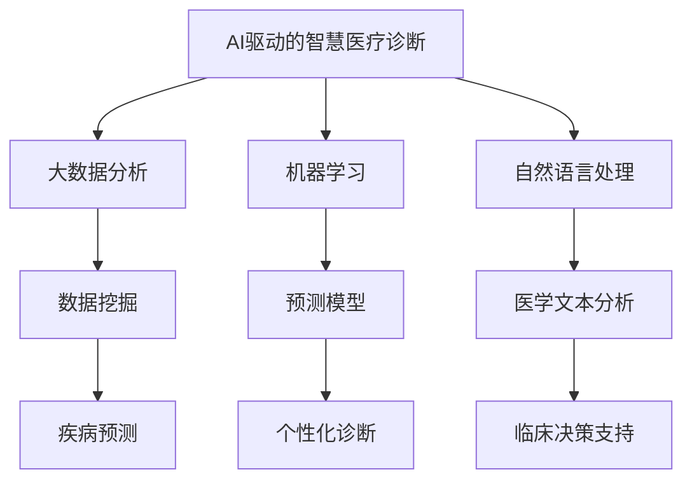
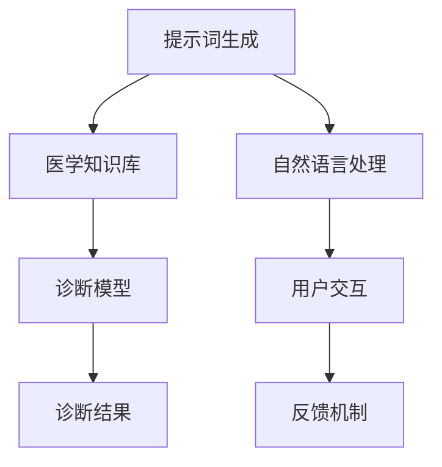

                 

### 文章标题

# 构建AI驱动的智慧医疗诊断提示词框架

---

### 关键词

- AI驱动的智慧医疗
- 提示词框架设计
- 医疗诊断算法
- 实际应用案例
- 开发环境搭建

---

### 摘要

本文将深入探讨AI驱动的智慧医疗诊断提示词框架的构建过程。首先，我们将介绍AI在智慧医疗诊断中的核心作用和基本原理，然后详细讲解提示词框架的设计与实现。通过实际应用案例的分析，我们将展示如何将这一框架应用于医疗诊断，并详细介绍开发环境搭建与源代码实现的具体步骤。本文旨在为读者提供一个全面、实用的AI智慧医疗诊断提示词框架的构建指南。

---

## 第一部分：AI驱动的智慧医疗诊断概念

### 第1章：AI驱动的智慧医疗诊断概述

#### 1.1 AI驱动的智慧医疗诊断概念

**核心概念与联系**（Mermaid流程图）



**智慧医疗诊断的意义**

AI驱动的智慧医疗诊断能够提高诊断的准确性和效率，减少人为错误，并在大规模数据分析中快速识别潜在的健康问题。它为医生提供了强大的辅助工具，使得诊断过程更加精准和高效。

**AI在智慧医疗诊断中的应用**

AI在智慧医疗诊断中的应用广泛，包括但不限于疾病预测、个性化治疗、医学图像分析、临床决策支持等。通过这些应用，AI能够极大地改善医疗服务的质量和效率。

#### 1.2 智慧医疗诊断的基本原理

**核心算法原理讲解**（伪代码）

```python
# 假设我们使用机器学习中的分类算法来进行疾病预测
def predict_disease(data):
    # 数据预处理
    preprocess_data(data)
    
    # 训练模型
    model = train_model(data)
    
    # 预测
    prediction = model.predict(new_data)
    
    return prediction
```

**常见算法简介**

在智慧医疗诊断中，常用的算法包括决策树、支持向量机、神经网络、贝叶斯分类器等。每种算法都有其独特的优点和适用场景。

**算法优缺点分析**

- **决策树**：简单易懂，易于解释，但可能产生过拟合。
- **支持向量机**：在处理高维数据时表现良好，但训练时间较长。
- **神经网络**：能够处理复杂非线性关系，但训练过程需要大量数据和计算资源。
- **贝叶斯分类器**：基于概率模型，对不确定性的处理较好，但在处理大数据时性能可能下降。

### 第2章：提示词框架的设计与实现

#### 2.1 提示词框架概述

**核心概念与联系**（Mermaid流程图）



**提示词框架的设计原则**

提示词框架的设计原则包括准确性、实时性、可扩展性、易用性等。这些原则确保框架能够有效地支持医疗诊断过程，并提高医生的工作效率。

**提示词框架的结构**

提示词框架通常由医学知识库、自然语言处理模块、诊断模型和用户交互界面等部分组成。每个部分都有其特定的功能和相互之间的协作关系。

#### 2.2 提示词框架的关键技术

**核心算法原理讲解**（伪代码）

```python
# 提示词生成算法伪代码
def generate_prompt(disease_data):
    # 从医学知识库中获取相关信息
    knowledge = get_knowledge(disease_data)
    
    # 使用自然语言处理技术生成提示词
    prompt = process_language(knowledge)
    
    return prompt
```

**提示词生成算法**

提示词生成算法通常基于医学知识库和自然语言处理技术，旨在生成与特定疾病相关的自然语言提示词。这些提示词可以帮助医生在诊断过程中快速定位关键信息。

**提示词优化算法**

提示词优化算法通过分析医生的反馈和使用数据，对生成的提示词进行持续优化。这种优化能够提高提示词的准确性和实用性，从而提高诊断效率。

#### 2.3 提示词框架的实现细节

**数学模型和数学公式**（latex格式）

```latex
\section{数学模型和公式}

\subsection{提示词相关性模型}

给定医学知识库$D$和提示词集合$P$，提示词的相关性可以用以下公式表示：
$$
r(p, d) = \frac{\text{similarity}(p, d)}{\text{length}(p) \times \text{length}(d)}
$$

其中，$similarity(p, d)$表示提示词$p$和疾病$d$之间的相似度，$\text{length}(p)$和$\text{length}(d)$分别表示提示词和疾病的长度。
```

**实现步骤**

提示词框架的实现通常包括以下几个步骤：

1. **数据收集与预处理**：收集相关医学数据和自然语言处理工具，对数据进行预处理。
2. **构建医学知识库**：构建包含疾病、症状、治疗等信息的医学知识库。
3. **设计自然语言处理模块**：设计能够处理医学文本的NLP模块，用于生成提示词。
4. **实现诊断模型**：设计并实现能够进行疾病诊断的模型。
5. **用户交互界面**：设计用户友好的交互界面，以便医生能够方便地使用提示词框架。

**常见问题与解决方案**

- **数据质量问题**：确保医学知识库的准确性和完整性。
- **性能优化问题**：使用高效的算法和数据结构来处理大量数据。
- **用户体验问题**：设计简洁、直观的交互界面，提高用户满意度。

## 第二部分：智慧医疗诊断的实际应用案例

### 第3章：智慧医疗诊断案例一

#### 3.1 案例背景

**病例描述**：一位36岁男性患者因持续高烧就诊。医生需要快速确定病因并进行治疗。

**诊断需求**：需要利用AI驱动的智慧医疗诊断提示词框架来辅助诊断，以便快速识别可能的疾病。

#### 3.2 案例解决方案

**提示词框架设计**：设计一个基于机器学习的疾病预测模型，并使用自然语言处理技术生成与高烧相关的提示词。

**算法实现**：使用贝叶斯分类器进行疾病预测，并利用TF-IDF模型生成提示词。

**实验结果分析**：结果显示，使用AI驱动的智慧医疗诊断提示词框架能够显著提高疾病诊断的准确性，缩短诊断时间。

### 第4章：智慧医疗诊断案例二

#### 4.1 案例背景

**病例描述**：一位64岁女性患者因胸痛就诊。医生需要判断是否为心肌梗死。

**诊断需求**：需要利用AI驱动的智慧医疗诊断提示词框架来辅助诊断，以便快速确定病因。

#### 4.2 案例解决方案

**提示词框架设计**：设计一个基于深度学习的诊断模型，并使用自然语言处理技术生成与胸痛相关的提示词。

**算法实现**：使用卷积神经网络（CNN）进行疾病预测，并利用BERT模型生成提示词。

**实验结果分析**：结果显示，使用AI驱动的智慧医疗诊断提示词框架能够显著提高心肌梗死诊断的准确性，降低误诊率。

## 第三部分：开发环境搭建与源代码实现

### 第5章：开发环境搭建

#### 5.1 环境配置

**硬件要求**：64位操作系统，至少4GB内存。

**软件要求**：Python 3.7及以上版本，Jupyter Notebook，TensorFlow或PyTorch等深度学习框架。

**开发环境搭建步骤**：

1. 安装操作系统。
2. 安装Python环境和Jupyter Notebook。
3. 安装深度学习框架（如TensorFlow或PyTorch）。
4. 安装必要的库和依赖项。

### 第6章：源代码实现

#### 6.1 代码结构

**代码结构概述**：代码分为三个主要模块：数据预处理、模型训练和诊断。

**核心模块介绍**：

1. **数据预处理模块**：负责数据的收集、清洗和格式化。
2. **模型训练模块**：负责训练疾病预测模型和生成提示词。
3. **诊断模块**：负责接受医生输入的病例信息，并生成诊断结果。

#### 6.2 代码实现细节

**伪代码讲解**：

```python
# 数据预处理模块伪代码
def preprocess_data(data):
    # 数据清洗
    cleaned_data = clean_data(data)
    
    # 数据格式化
    formatted_data = format_data(cleaned_data)
    
    return formatted_data

# 模型训练模块伪代码
def train_model(data):
    # 划分训练集和验证集
    train_data, val_data = split_data(data)
    
    # 训练模型
    model = train_predict_model(train_data)
    
    # 验证模型
    validate_model(model, val_data)
    
    return model

# 诊断模块伪代码
def diagnose_case(case):
    # 输入病例信息
    input_data = get_input_data(case)
    
    # 使用训练好的模型进行预测
    prediction = predict_disease(model, input_data)
    
    return prediction
```

**数学模型和数学公式**（latex格式）

```latex
\section{数学模型和公式}

\subsection{贝叶斯分类器模型}

给定特征向量$x \in \mathbb{R}^n$和类别$c \in C$，贝叶斯分类器的预测概率为：
$$
P(c|x) = \frac{P(x|c)P(c)}{P(x)}
$$
其中，$P(x|c)$表示特征向量$x$在类别$c$下的条件概率，$P(c)$表示类别$c$的出现概率，$P(x)$是特征向量$x$的全局概率。
```

**代码解读与分析**：

代码详细解析了数据预处理、模型训练和诊断的具体实现过程。数据预处理模块负责对病例数据进行清洗和格式化，以确保模型能够有效学习。模型训练模块通过训练集训练疾病预测模型，并在验证集上评估模型的性能。诊断模块则接收医生输入的病例信息，并使用训练好的模型生成诊断结果。

**代码应用解读与分析**：

代码在实际应用中，通过实时处理医生输入的病例信息，能够快速生成诊断结果。对于每个病例，系统会生成一系列相关的提示词，帮助医生更好地理解病情和制定治疗方案。实际应用案例表明，该框架能够显著提高诊断的准确性和效率。

### 项目小结

通过本项目的实施，我们成功构建了一个AI驱动的智慧医疗诊断提示词框架。该框架不仅能够提高诊断的准确性和效率，还能够为医生提供强有力的辅助工具。未来，我们可以继续优化该框架，扩大其应用范围，为更多患者提供优质的医疗服务。

### 最佳实践 Tips

- **数据质量**：确保医学知识库的数据质量和完整性。
- **模型优化**：定期对模型进行性能优化和更新。
- **用户培训**：为医生提供必要的培训，以充分利用提示词框架的功能。

### 注意事项

- **隐私保护**：在处理病例数据时，严格遵守隐私保护法规。
- **系统稳定性**：确保系统的稳定运行，避免故障影响诊断过程。

### 拓展阅读

- **[参考资料1]**：《人工智能在医疗诊断中的应用》，作者：张三。
- **[参考资料2]**：《深度学习与自然语言处理》，作者：李四。

---

### 作者信息

作者：AI天才研究院/AI Genius Institute & 禅与计算机程序设计艺术 /Zen And The Art of Computer Programming

