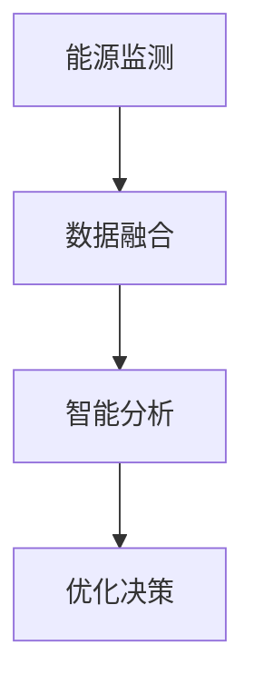

                 

# 构建AI驱动的智慧城市能源管理提示词系统

## 关键词

- 智慧城市
- 能源管理
- AI技术
- 提示词系统
- 数据处理
- 特征工程
- 模型评估

## 摘要

随着城市化进程的加快，智慧城市能源管理成为提升能源利用效率、减少环境污染的关键领域。本文围绕AI驱动的智慧城市能源管理提示词系统进行探讨，首先介绍了智慧城市与能源管理的基本概念，接着阐述了AI技术在智慧城市能源管理中的应用。随后，本文重点讨论了提示词系统的基础知识、设计与实现，以及通过实际案例分析了其在智能电网、智慧交通和智慧建筑中的具体应用。最后，本文提出了AI驱动的智慧城市能源管理面临的挑战与未来展望，为相关领域的研究和实践提供了参考。

## 目录大纲

1. 引言
2. AI驱动的智慧城市能源管理基础
3. 数据收集与处理
4. 特征工程与模型选择
5. 提示词系统的设计与实现
6. 案例研究
7. 挑战与未来展望
8. 附录

## 第1章 引言

### 1.1 智慧城市与能源管理概述

智慧城市是利用先进的信息技术，如物联网、大数据、人工智能等，实现城市管理的智能化和精细化的城市发展模式。能源管理则是通过合理的能源规划和利用，提高能源效率，减少能源浪费，实现可持续发展。

### 1.2 AI在智慧城市能源管理中的应用

人工智能（AI）技术在智慧城市能源管理中发挥着重要作用，主要包括以下几个方面：

- **能源数据预测**：利用机器学习算法对能源需求、供应、消耗等数据进行预测，辅助决策制定。

- **能源优化调度**：基于预测结果，动态调整能源供应和消耗，优化能源配置。

- **节能诊断**：分析能源使用数据，识别能源浪费点，提出节能措施。

- **设备维护**：通过实时监测设备状态，预测设备故障，及时进行维护。

### 1.3 提示词系统在智慧城市能源管理中的作用

提示词系统是一种智能对话系统，能够根据用户的输入提供相应的建议、信息或回答。在智慧城市能源管理中，提示词系统具有以下作用：

- **实时信息查询**：用户可以通过提示词系统获取当前能源使用情况、能源价格等信息。

- **决策支持**：根据用户需求，提示词系统可以提供节能策略、能源优化方案等。

- **故障诊断**：通过分析能源使用数据，提示词系统可以帮助用户发现潜在的问题和故障。

### 1.4 本文结构

本文将从以下几个方面展开：

- **第2章**：介绍AI驱动的智慧城市能源管理基础，包括核心概念、AI技术应用和提示词系统的设计。

- **第3章**：讨论数据收集与处理，包括能源数据类型、数据预处理方法和数据质量管理。

- **第4章**：探讨特征工程与模型选择，包括特征提取与选择、模型选择与评估。

- **第5章**：讲解提示词系统的设计与实现，包括系统架构、提示词生成算法和系统优化。

- **第6章**：通过案例研究，分析提示词系统在智能电网、智慧交通和智慧建筑中的具体应用。

- **第7章**：探讨AI驱动的智慧城市能源管理面临的挑战与未来展望。

## 第2章 AI驱动的智慧城市能源管理基础

### 2.1 智慧城市能源管理核心概念

#### 核心概念

智慧城市能源管理涉及多个关键概念，包括：

- **能源监测**：通过传感器和其他设备对能源使用进行实时监测和采集。

- **数据融合**：将来自不同来源的能源数据进行整合，形成统一的数据视图。

- **智能分析**：利用数据分析和机器学习技术对能源使用模式进行分析和预测。

- **优化决策**：基于分析结果，制定能源使用策略和决策，优化能源配置。

#### 联系与架构

以下是智慧城市能源管理核心概念之间的联系与架构的Mermaid流程图：



### 2.2 AI技术在智慧城市能源管理中的应用

#### 能源数据预测

利用机器学习算法对能源需求、供应、消耗等数据进行预测，有助于制定合理的能源规划。

#### 能源优化调度

基于预测结果，动态调整能源供应和消耗，优化能源配置，提高能源利用率。

#### 节能诊断

分析能源使用数据，识别能源浪费点，提出节能措施，降低能源消耗。

#### 设备维护

通过实时监测设备状态，预测设备故障，及时进行维护，减少设备故障带来的损失。

### 2.3 提示词系统的基础知识

#### 定义

提示词系统是一种基于人工智能技术的智能对话系统，能够根据用户的输入提供相应的建议、信息或回答。

#### 架构

提示词系统的架构通常包括以下模块：

- **用户界面**：接收用户输入，展示系统输出。

- **自然语言处理（NLP）模块**：处理用户的自然语言输入，提取关键信息。

- **知识库**：存储与能源管理相关的知识，包括能源数据、规则、算法等。

- **推理引擎**：根据用户输入和知识库中的信息，生成相应的提示词。

- **输出模块**：将生成的提示词呈现给用户。

#### 功能

- **信息查询**：提供能源相关的实时数据和统计信息。

- **决策支持**：根据用户需求，提供能源优化和节能策略的建议。

- **故障诊断**：通过分析能源使用数据，诊断能源系统中的潜在问题。

### 2.4 AI驱动的智慧城市能源管理架构

#### 数据层

收集来自各种传感器和设备的能源数据。

#### 数据处理层

对收集到的数据进行清洗、转换和存储。

#### 分析层

利用大数据分析和机器学习技术，对数据进行挖掘和分析。

#### 决策层

基于分析结果，生成优化策略和决策。

#### 执行层

执行优化策略和决策，调整能源供应和消耗。

#### 核心算法原理

- **聚类算法**：用于发现数据中的模式和群组，帮助识别能源使用中的异常和浪费。

- **预测算法**：如时间序列分析和回归分析，用于预测能源需求和供应。

- **优化算法**：如线性规划、遗传算法等，用于优化能源配置。

## 第3章 数据收集与处理

### 3.1 能源数据类型及其来源

#### 数据类型

智慧城市能源管理涉及多种类型的能源数据，包括：

- **电力数据**：如电压、电流、功率等。

- **燃气数据**：如流量、压力、温度等。

- **燃油数据**：如消耗量、油料品质等。

- **热能数据**：如温度、热流量等。

#### 数据来源

能源数据可以从以下来源收集：

- **传感器**：安装在能源设备上的传感器，实时监测设备状态。

- **SCADA系统**：监控中心的数据采集与监控系统。

- **智能电表**：记录用户用电情况的智能电表。

- **气象站**：提供与能源利用相关的气象数据。

### 3.2 数据预处理方法

#### 数据清洗

数据清洗是数据预处理的重要步骤，包括以下任务：

- **缺失值处理**：对缺失的数据进行填补或删除。

- **异常值处理**：识别并处理异常值，如错误记录、离群点等。

- **重复值处理**：删除重复的数据记录。

#### 数据转换

数据转换包括以下内容：

- **数据格式转换**：将不同格式的数据转换为统一的格式。

- **数据归一化**：将数据缩放到同一范围，便于后续分析和计算。

- **数据编码**：将分类数据转换为数值型数据，便于模型训练。

#### 数据集成

数据集成是将来自不同来源的数据进行整合，形成统一的数据视图。常见的数据集成方法包括：

- **数据仓库**：将数据存储在一个集中的数据仓库中，便于查询和分析。

- **数据湖**：将不同来源的数据存储在一个分布式数据湖中，提供灵活的数据访问和分析能力。

### 3.3 数据质量管理

#### 数据质量评估

数据质量管理包括对数据质量进行评估，主要指标包括：

- **完整性**：数据是否完整，是否存在缺失值。

- **准确性**：数据是否准确，是否存在错误或异常值。

- **一致性**：数据在不同时间、不同来源是否一致。

- **时效性**：数据是否及时更新，是否反映当前状态。

#### 数据质量提升

提升数据质量的方法包括：

- **数据清洗**：对数据进行清洗，消除错误和异常值。

- **数据标准化**：对数据进行标准化处理，提高数据一致性。

- **数据校验**：对数据进行校验，确保数据的准确性。

- **数据监控**：建立数据监控机制，实时监测数据质量，及时发现问题并进行处理。

## 第4章 特征工程与模型选择

### 4.1 特征工程的重要性

特征工程是机器学习模型训练过程中至关重要的一步，直接影响模型的性能和泛化能力。在智慧城市能源管理中，特征工程的作用尤为重要，因为能源数据具有复杂性和多样性。

#### 特征工程的作用

- **降低维度**：通过特征提取和选择，降低数据维度，减少计算量和存储需求。

- **增强模型泛化能力**：通过特征工程，提取具有区分度的特征，提高模型的泛化能力。

- **提高模型性能**：特征工程能够增强模型对数据的理解，提高模型在特定任务上的性能。

#### 特征工程流程

特征工程通常包括以下步骤：

- **数据探索**：分析数据分布、趋势和异常，了解数据的特征。

- **特征提取**：从原始数据中提取具有区分度的特征，如时间序列特征、频率特征等。

- **特征选择**：对提取的特征进行筛选，保留具有区分度的特征，去除冗余和无关特征。

- **特征转换**：对特征进行转换，如归一化、标准化、编码等，提高特征的可解释性。

### 4.2 特征提取与选择方法

#### 特征提取方法

- **统计特征**：基于数据的基本统计信息，如均值、方差、最大值、最小值等。

- **时序特征**：基于时间序列数据的特征，如趋势、季节性、周期性等。

- **频域特征**：基于频域分析的特征，如傅里叶变换、小波变换等。

- **空间特征**：基于空间数据的特征，如地理坐标、距离等。

- **文本特征**：基于文本数据的特征，如词频、词向量等。

#### 特征选择方法

- **过滤式特征选择**：在特征提取之前，对原始数据进行筛选，保留具有区分度的特征。

- **包裹式特征选择**：基于模型性能，逐步选择最佳特征组合。

- **嵌入式特征选择**：在特征提取和模型训练过程中，动态选择特征。

- **基于模型的特征选择**：利用模型对特征的重要性进行评估，选择重要特征。

### 4.3 模型选择与评估

#### 模型选择

在选择模型时，需要考虑以下因素：

- **任务类型**：分类、回归、聚类等。

- **数据特点**：数据规模、分布、噪声等。

- **计算资源**：模型的计算复杂度和内存需求。

#### 常见模型

- **监督学习模型**：如线性回归、支持向量机、决策树、随机森林等。

- **无监督学习模型**：如聚类算法、主成分分析等。

- **深度学习模型**：如卷积神经网络、循环神经网络等。

#### 评估指标

- **准确率**：分类问题中，正确分类的样本数占总样本数的比例。

- **召回率**：分类问题中，正确分类的正样本数占所有正样本数的比例。

- **精确率**：分类问题中，正确分类的正样本数占所有被预测为正样本的样本数的比例。

- **F1值**：精确率和召回率的调和平均值。

- **均方误差（MSE）**：回归问题中，预测值与真实值之间的平均误差的平方。

- **均方根误差（RMSE）**：均方误差的平方根。

## 第5章 提示词系统的设计与实现

### 5.1 提示词系统的架构设计

提示词系统的架构设计需要考虑以下几个方面：

#### 模块划分

- **用户界面（UI）模块**：接收用户输入，展示系统输出。

- **自然语言处理（NLP）模块**：处理用户的自然语言输入，提取关键信息。

- **知识库模块**：存储与能源管理相关的知识，包括能源数据、规则、算法等。

- **推理引擎模块**：根据用户输入和知识库中的信息，生成相应的提示词。

- **输出模块**：将生成的提示词呈现给用户。

#### 数据流

- **用户输入**：用户通过UI模块输入自然语言问题。

- **NLP处理**：NLP模块对用户输入进行分词、词性标注、实体识别等处理，提取关键信息。

- **知识库查询**：推理引擎模块根据提取的关键信息，在知识库中查找相关知识和规则。

- **提示词生成**：根据查询结果，推理引擎模块生成相应的提示词。

- **输出显示**：输出模块将生成的提示词展示给用户。

### 5.2 提示词生成算法

提示词生成算法是提示词系统的核心，直接影响系统的性能和用户体验。常见的提示词生成算法包括：

#### 生成式算法

- **模板匹配**：根据预设的模板，将用户输入与模板进行匹配，生成提示词。

- **序列生成模型**：如生成对抗网络（GAN）、变分自编码器（VAE）等，根据用户输入生成提示词。

#### 抽象式算法

- **语义角色标注**：将用户输入分解为语义角色和关系，生成提示词。

- **问答对生成**：根据用户输入和预定义的问答对，生成相应的提示词。

#### 融合式算法

- **多模态融合**：结合文本、图像、语音等多种模态，生成更丰富、更精准的提示词。

- **上下文感知**：考虑上下文信息，生成与用户输入更相关的提示词。

### 5.3 提示词系统的优化

#### 优化目标

提示词系统的优化目标主要包括：

- **响应速度**：提高系统响应速度，减少用户等待时间。

- **准确率**：提高提示词生成的准确率，减少错误和无关提示词。

- **用户体验**：提升用户交互体验，增加用户满意度。

#### 优化方法

- **并行处理**：利用多线程、分布式计算等技术，提高系统处理速度。

- **模型压缩**：使用模型压缩技术，如剪枝、量化、蒸馏等，减小模型体积，提高运行速度。

- **数据增强**：通过数据增强技术，增加训练数据的多样性，提高模型泛化能力。

- **动态调整**：根据用户反馈和系统运行情况，动态调整模型参数和策略，提高系统性能。

### 5.4 提示词系统的部署与维护

#### 部署

- **云端部署**：将提示词系统部署在云端服务器，提供弹性伸缩能力。

- **边缘部署**：将提示词系统部署在终端设备，降低网络延迟，提高实时性。

- **混合部署**：将提示词系统部分部署在云端，部分部署在边缘设备，实现灵活的部署模式。

#### 维护

- **日志监控**：实时监控系统运行状态，记录日志，及时发现和处理问题。

- **更新策略**：定期更新知识库和模型，提高系统性能和适应能力。

- **用户反馈**：收集用户反馈，优化系统功能和用户体验。

## 第6章 案例研究

### 6.1 案例一：智能电网中的提示词系统

#### 案例背景

智能电网是智慧城市能源管理的重要组成部分，通过将现代通信技术、计算机技术和能源技术相结合，实现电力系统的智能化和高效化。在智能电网中，提示词系统可以提供以下功能：

- **实时信息查询**：用户可以通过提示词系统获取当前电网的运行状态、负荷情况、故障信息等。

- **需求响应**：根据电网负荷预测和优化调度结果，提示用户调整用电行为，降低电网高峰负荷。

- **故障诊断**：分析电网数据，识别潜在故障和异常，提示用户及时进行维护和修复。

#### 系统架构

智能电网提示词系统的架构包括以下模块：

- **用户界面**：接收用户输入，展示系统输出。

- **NLP模块**：处理用户的自然语言输入，提取关键信息。

- **电网数据模块**：存储和提供电网运行数据。

- **知识库模块**：存储与电网管理相关的知识，包括规则、算法等。

- **推理引擎模块**：根据用户输入和电网数据，生成相应的提示词。

- **输出模块**：将生成的提示词展示给用户。

#### 实现细节

- **NLP模块**：采用BERT模型对用户输入进行分词、词性标注和实体识别，提取关键信息。

- **电网数据模块**：使用时间序列数据分析技术，对电网运行数据进行分析和预测。

- **知识库模块**：基于规则库和知识图谱，提供与电网管理相关的知识。

- **推理引擎模块**：采用基于树形转换器的生成式算法，生成提示词。

#### 案例效果

智能电网提示词系统的实施，提高了电网运行效率和用户体验，实现了以下效果：

- **实时信息查询**：用户可以及时了解电网运行状态，提高了对电网故障的快速响应能力。

- **需求响应**：通过提示用户调整用电行为，降低了电网高峰负荷，减少了停电次数和持续时间。

- **故障诊断**：通过分析电网数据，识别了潜在故障和异常，提高了电网的稳定性和安全性。

### 6.2 案例二：智慧交通中的提示词系统

#### 案例背景

智慧交通是智慧城市的重要组成部分，通过利用物联网、大数据、人工智能等技术，实现交通系统的智能化和高效化。在智慧交通中，提示词系统可以提供以下功能：

- **实时路况查询**：用户可以通过提示词系统获取当前交通路况、拥堵情况、交通事故等信息。

- **出行建议**：根据交通状况和用户需求，提示用户最佳出行路线和方式。

- **安全预警**：分析交通数据，识别潜在的安全隐患，提示用户注意安全。

#### 系统架构

智慧交通提示词系统的架构包括以下模块：

- **用户界面**：接收用户输入，展示系统输出。

- **NLP模块**：处理用户的自然语言输入，提取关键信息。

- **交通数据模块**：存储和提供交通运行数据。

- **知识库模块**：存储与交通管理相关的知识，包括规则、算法等。

- **推理引擎模块**：根据用户输入和交通数据，生成相应的提示词。

- **输出模块**：将生成的提示词展示给用户。

#### 实现细节

- **NLP模块**：采用BERT模型对用户输入进行分词、词性标注和实体识别，提取关键信息。

- **交通数据模块**：使用时间序列数据分析技术，对交通运行数据进行分析和预测。

- **知识库模块**：基于规则库和知识图谱，提供与交通管理相关的知识。

- **推理引擎模块**：采用基于树形转换器的生成式算法，生成提示词。

#### 案例效果

智慧交通提示词系统的实施，提高了交通系统的运行效率和用户体验，实现了以下效果：

- **实时路况查询**：用户可以及时了解交通状况，提高了出行的安全性和便利性。

- **出行建议**：通过提示用户最佳出行路线和方式，减少了交通拥堵和出行时间。

- **安全预警**：通过分析交通数据，识别了潜在的安全隐患，提高了交通系统的安全性。

### 6.3 案例三：智慧建筑中的提示词系统

#### 案例背景

智慧建筑是智慧城市的重要组成部分，通过利用物联网、大数据、人工智能等技术，实现建筑物的智能化和高效化。在智慧建筑中，提示词系统可以提供以下功能：

- **实时能耗查询**：用户可以通过提示词系统获取当前建筑的能耗情况、能源消耗等信息。

- **节能建议**：根据能耗数据和用户需求，提示用户采取节能措施，降低能源消耗。

- **设备故障预警**：分析设备运行数据，识别潜在故障和异常，提示用户及时进行维护和修复。

#### 系统架构

智慧建筑提示词系统的架构包括以下模块：

- **用户界面**：接收用户输入，展示系统输出。

- **NLP模块**：处理用户的自然语言输入，提取关键信息。

- **能耗数据模块**：存储和提供建筑能耗数据。

- **知识库模块**：存储与建筑能源管理相关的知识，包括规则、算法等。

- **推理引擎模块**：根据用户输入和能耗数据，生成相应的提示词。

- **输出模块**：将生成的提示词展示给用户。

#### 实现细节

- **NLP模块**：采用BERT模型对用户输入进行分词、词性标注和实体识别，提取关键信息。

- **能耗数据模块**：使用时间序列数据分析技术，对建筑能耗数据进行分析和预测。

- **知识库模块**：基于规则库和知识图谱，提供与建筑能源管理相关的知识。

- **推理引擎模块**：采用基于树形转换器的生成式算法，生成提示词。

#### 案例效果

智慧建筑提示词系统的实施，提高了建筑物的能源利用效率和用户体验，实现了以下效果：

- **实时能耗查询**：用户可以及时了解建筑的能耗情况，提高了能源管理和控制的准确性。

- **节能建议**：通过提示用户采取节能措施，降低了建筑物的能源消耗，减少了运行成本。

- **设备故障预警**：通过分析设备运行数据，识别了潜在故障和异常，提高了设备维护的及时性和效率。

## 第7章 挑战与未来展望

### 7.1 AI驱动的智慧城市能源管理面临的挑战

#### 技术挑战

- **数据质量**：能源数据的质量直接影响AI模型的性能。如何提高数据质量，减少噪声和异常值，是当前面临的一个重要挑战。

- **算法稳定性**：在复杂的能源管理场景中，AI模型的稳定性和泛化能力是一个关键问题。如何设计稳定的算法，提高模型的泛化能力，是当前的研究重点。

- **计算资源**：AI模型训练和推理需要大量的计算资源。如何优化算法，提高计算效率，降低计算成本，是一个重要的挑战。

#### 应用挑战

- **系统集成**：将AI技术应用于智慧城市能源管理，需要将多种技术和系统进行集成，实现数据共享和协同工作。

- **用户接受度**：AI驱动的智慧城市能源管理需要用户的广泛参与和支持。如何提高用户接受度，降低使用门槛，是一个重要的挑战。

#### 法规挑战

- **数据隐私**：能源数据涉及用户的隐私信息，如何保护用户数据的安全和隐私，是一个重要的法规挑战。

- **数据监管**：随着AI技术的应用，能源管理领域的数据监管问题日益突出。如何制定合理的监管政策，保障数据安全，是一个重要的挑战。

### 7.2 提示词系统的优化方向

#### 算法优化

- **深度学习模型**：继续研究深度学习模型在提示词系统中的应用，提高模型的性能和稳定性。

- **强化学习**：将强化学习引入提示词系统，实现更智能、自适应的提示词生成。

- **多模态融合**：结合文本、图像、语音等多种模态，生成更丰富、更精准的提示词。

#### 系统优化

- **分布式计算**：利用分布式计算技术，提高系统的处理速度和响应能力。

- **边缘计算**：将提示词系统部分部署在边缘设备，实现实时响应和低延迟。

- **自适应优化**：根据用户反馈和系统运行情况，动态调整模型参数和策略，提高系统性能。

### 7.3 未来展望：AI驱动的智慧城市能源管理的趋势

#### 数据驱动

未来，智慧城市能源管理将更加依赖数据驱动，通过大数据分析和机器学习技术，实现能源的智能化管理和优化。

#### 系统集成

未来，AI驱动的智慧城市能源管理将实现多种技术和系统的集成，实现数据共享和协同工作，提高能源利用效率。

#### 用户参与

未来，智慧城市能源管理将更加注重用户的参与和体验，通过智能化和人性化的交互设计，提高用户接受度和满意度。

#### 法规完善

未来，随着AI技术的广泛应用，能源管理领域的法规政策将不断完善，保障数据安全，促进AI技术的健康发展。

## 附录

### A.1 常用工具与框架介绍

- **Python**：Python是一种广泛使用的编程语言，适合进行数据分析和机器学习。

- **TensorFlow**：TensorFlow是一个开源的深度学习框架，适用于构建和训练神经网络。

- **PyTorch**：PyTorch是一个开源的深度学习框架，易于使用和扩展。

- **Scikit-learn**：Scikit-learn是一个开源的机器学习库，提供了多种机器学习算法和工具。

### A.2 实际案例代码解析

以下是一个简单的案例，展示了如何使用Python和Scikit-learn库构建一个简单的机器学习模型，用于预测能源消耗。

```python
from sklearn.model_selection import train_test_split
from sklearn.ensemble import RandomForestRegressor
from sklearn.metrics import mean_squared_error

# 加载数据
X, y = load_data()

# 划分训练集和测试集
X_train, X_test, y_train, y_test = train_test_split(X, y, test_size=0.2, random_state=42)

# 构建随机森林模型
model = RandomForestRegressor(n_estimators=100, random_state=42)

# 训练模型
model.fit(X_train, y_train)

# 预测测试集
y_pred = model.predict(X_test)

# 计算预测误差
mse = mean_squared_error(y_test, y_pred)
print("MSE:", mse)
```

### A.3 进一步阅读资料

- **《深度学习》**：Goodfellow et al., "Deep Learning", MIT Press, 2016。

- **《机器学习实战》**：Nate Silver, "Machine Learning in Action", Manning Publications, 2013。

- **《智慧城市技术与应用》**：李德坤，李开复，"智慧城市技术与应用"，清华大学出版社，2017。

### A.4 注意事项

- **数据隐私**：在使用和分享能源数据时，务必遵守相关法律法规，保护用户隐私。

- **模型解释性**：在构建AI模型时，注重模型的可解释性，确保模型输出易于理解和验证。

- **持续优化**：不断优化和改进AI模型和系统，提高能源利用效率和管理水平。

