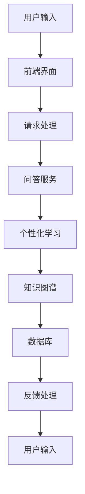

                 


### 1. AI与教育概述

#### 1.1 AI在智慧教育中的应用

随着人工智能（AI）技术的迅猛发展，教育领域正经历着前所未有的变革。AI在智慧教育中的应用正逐渐成为教育现代化的关键驱动力。从学习分析到个性化推荐，再到自动化评估，AI技术正在深刻改变传统教育的方方面面。

首先，AI能够通过学习分析，帮助学生和教师更好地理解学习过程中的表现和需求。通过分析学生的行为数据，如学习时间、参与度、测试成绩等，AI可以生成个性化的学习建议，提高学习效率。例如，自适应学习平台可以根据学生的学习速度和理解程度，动态调整教学内容和难度，从而实现个性化教育。

其次，AI在个性化推荐系统中发挥着重要作用。基于用户的学习历史和偏好，AI可以推荐适合的学习资源和课程。这种方式不仅节省了学生寻找合适学习材料的时间，还能提高学习效果。例如，许多在线学习平台已经采用了AI算法，为用户提供个性化的学习路径和建议。

再者，AI在自动化评估方面也展现出了巨大潜力。传统的考试和评估方式往往耗时耗力，且容易出现主观偏差。通过自然语言处理（NLP）和计算机视觉等技术，AI能够自动批改试卷，评估学生的作业和项目，提高评估的效率和准确性。此外，AI还可以通过智能辅导系统，实时监控学生的学习状态，提供即时反馈，帮助学生及时纠正错误。

尽管AI在智慧教育中有着广泛的应用，但同时也面临着一些挑战。例如，数据隐私和安全问题、技术成熟度和实施成本等都是需要考虑的因素。然而，随着技术的不断进步和政策的支持，AI在智慧教育中的应用前景依然广阔。

#### 1.2 智慧教育提示词平台的价值与挑战

智慧教育提示词平台是AI在智慧教育中的一个重要应用。其核心在于利用AI技术生成和优化教育提示词，从而提高教学效果和学生参与度。

首先，智慧教育提示词平台的价值体现在以下几个方面：

1. **提高教学互动性**：通过生成与课程内容相关的提示词，教师可以引导学生进行深度思考，促进课堂互动。例如，在讨论某个知识点时，系统可以自动生成相关的问题和提示，帮助学生更好地理解和应用知识。

2. **个性化教学**：基于学生的兴趣和学习数据，平台可以为每位学生生成个性化的提示词。这种个性化教学方式能够更好地满足学生的需求，提高学习效果。

3. **提高学习效率**：提示词可以帮助学生迅速抓住学习重点，提高学习效率。例如，在阅读一篇科学论文时，系统可以自动生成摘要和关键问题，帮助学生快速理解文章内容。

然而，构建智慧教育提示词平台也面临一些挑战：

1. **数据隐私与安全**：由于平台需要收集和分析大量的学生数据，数据隐私和安全问题成为了一个重要的挑战。确保数据的安全性和合规性是平台成功的关键。

2. **技术实现难度**：智慧教育提示词平台的实现涉及多个AI技术，如自然语言处理（NLP）、机器学习（ML）和深度学习（DL）等。这些技术的复杂性和实现难度要求平台开发者具备高水平的技术能力。

3. **用户接受度**：学生和教师对AI技术的接受度也是平台成功的关键因素。如果用户对平台的使用体验不佳，可能会导致用户流失和平台效果不佳。

综上所述，智慧教育提示词平台在提高教学效果和学生参与度方面具有巨大潜力，但同时也需要克服数据隐私、技术实现和用户接受度等挑战。

### 2. AI基础知识与架构

#### 2.1 人工智能基础

人工智能（AI）是一门研究如何使计算机模拟人类智能行为的科学。其目标是通过编程和算法，使计算机具备自我学习、推理、感知和决策等能力。人工智能的发展可以分为几个阶段：

1. **符号人工智能**：早期的AI研究主要基于符号推理，通过规则和逻辑来模拟人类思维。例如，专家系统通过知识库和推理机来实现智能行为。

2. **基于数据的AI**：随着计算机性能的提升和大数据技术的发展，AI开始转向基于数据的模型，如统计模型和神经网络。这些模型通过大量数据训练，能够自动发现数据中的模式和规律。

3. **强化学习**：强化学习是一种通过试错和奖励机制来学习策略的AI方法。它广泛应用于游戏、自动驾驶和机器人控制等领域。

4. **混合人工智能**：现代AI技术倾向于将多种方法相结合，如深度学习和强化学习，以实现更智能的解决方案。

AI的核心技术包括：

1. **机器学习（ML）**：机器学习是一种从数据中学习规律和模式的方法，主要包括监督学习、无监督学习和半监督学习。监督学习使用标记数据来训练模型，无监督学习试图发现数据中的内在结构，半监督学习结合了标记数据和未标记数据。

2. **深度学习（DL）**：深度学习是一种基于多层神经网络的学习方法，通过多层非线性变换提取数据特征。深度学习在图像识别、语音识别和自然语言处理等领域取得了突破性进展。

3. **自然语言处理（NLP）**：自然语言处理是AI的一个重要分支，旨在使计算机理解和处理人类语言。NLP技术包括文本分类、情感分析、机器翻译和对话系统等。

#### 2.2 智慧教育提示词平台架构

智慧教育提示词平台的架构设计需要综合考虑数据流、计算资源和系统扩展性等因素。以下是一个典型的智慧教育提示词平台架构：

1. **数据层**：数据层负责数据的收集、存储和管理。主要涉及的数据类型包括学生数据、课程数据、学习行为数据等。数据存储可以使用关系数据库或分布式文件系统，如Hadoop或Cassandra。

2. **数据处理层**：数据处理层负责数据清洗、转换和特征提取。这一层可以使用ETL（提取、转换、加载）工具，如Apache Kafka和Apache Spark，来处理大量数据。

3. **算法层**：算法层是实现智慧教育提示词的核心。这一层包括机器学习模型、深度学习模型和自然语言处理模型。算法层可以通过分布式计算框架，如TensorFlow和PyTorch，来训练和部署模型。

4. **服务层**：服务层负责对外提供服务接口，如提示词生成API、用户个性化推荐API等。这一层可以使用微服务架构，如Spring Boot和Django，来提高系统的可扩展性和维护性。

5. **界面层**：界面层是用户与平台交互的入口，包括Web界面和移动应用。用户可以通过界面层查看个性化提示词、学习进度和推荐资源等。

#### 2.2.1 平台整体架构设计

智慧教育提示词平台的整体架构设计需要确保系统的性能、可扩展性和可靠性。以下是一个简化的整体架构设计：

1. **数据层**：使用分布式数据库存储学生数据和课程数据。数据表可以包括用户表、课程表、学习行为表等。

2. **数据处理层**：使用Apache Kafka作为消息队列，收集和传输数据。使用Apache Spark进行数据清洗、转换和特征提取。

3. **算法层**：使用TensorFlow和PyTorch训练和部署机器学习模型和深度学习模型。这些模型可以包括文本分类模型、情感分析模型和序列生成模型等。

4. **服务层**：使用Spring Boot提供API接口，如提示词生成API、用户个性化推荐API等。这些API可以通过RESTful接口进行访问。

5. **界面层**：使用HTML、CSS和JavaScript构建Web界面，使用原生应用开发移动界面。

#### 2.2.2 数据存储与管理

智慧教育提示词平台的数据存储与管理至关重要。以下是一些关键点：

1. **数据存储选择**：根据数据类型和访问模式选择合适的存储方案。关系数据库适用于结构化数据，如学生信息和课程信息；分布式文件系统适用于非结构化数据，如图像和文本。

2. **数据备份与恢复**：定期备份数据，确保在系统故障或数据丢失时能够快速恢复。

3. **数据安全性**：使用加密技术和访问控制策略，确保数据的安全性。

4. **数据一致性**：在分布式系统中，确保数据的一致性是一个挑战。可以使用分布式事务管理技术和分布式锁来保证数据一致性。

#### 2.2.3 算法与模型部署

智慧教育提示词平台的算法与模型部署是系统实现的关键环节。以下是一些关键点：

1. **模型训练**：使用大规模数据集训练模型，确保模型具有良好的泛化能力。可以使用分布式训练框架，如TensorFlow和PyTorch，来加速模型训练。

2. **模型评估**：使用交叉验证和A/B测试等方法评估模型性能，确保模型能够在实际应用中达到预期效果。

3. **模型部署**：将训练好的模型部署到生产环境。可以使用容器化技术，如Docker和Kubernetes，来简化部署过程。

4. **模型更新**：定期更新模型，以适应不断变化的数据和需求。可以使用在线学习技术，如增量学习和在线学习，来实时更新模型。

5. **监控与维护**：监控模型的运行状态和性能指标，及时解决可能出现的问题。使用自动化运维工具，如Ansible和Puppet，来简化系统维护过程。

通过以上架构设计和技术实现，智慧教育提示词平台能够高效地生成和优化教育提示词，为教师和学生提供更好的学习体验。

### 3. 核心算法原理与实现

#### 3.1 提示词生成算法

智慧教育提示词平台的核心理念在于生成与教育内容高度相关的提示词，以激发学生的思考和参与。提示词生成算法是实现这一目标的关键技术。根据生成提示词的方式，可以将算法分为基于规则的方法、基于机器学习的方法和基于深度学习的方法。

#### 3.1.1 提示词生成的目标

提示词生成的目标主要包括以下几个方面：

1. **相关性**：生成的提示词应与教育内容高度相关，能够有效地引导学生的思考和讨论。
2. **多样性**：提示词应具备多样性，以避免重复和单调和提高学生的兴趣。
3. **可理解性**：提示词应易于理解，确保学生能够轻松掌握并应用于实际学习情境。
4. **个性化**：根据学生的兴趣和学习数据，生成个性化的提示词，以更好地满足学生的需求。

#### 3.1.2 基于规则的方法

基于规则的方法是一种传统的提示词生成策略，通过预定义的规则和模板来生成提示词。这种方法的主要优势在于简单易实现，但缺点是灵活性较低，难以适应复杂多变的教育情境。

以下是一个基于规则的方法的示例：

```python
# 基于规则的提示词生成算法伪代码

def generate_prompt_with_rules(content):
    if "geometry" in content:
        return ["什么是平行四边形？", "请解释三角形的性质。"]
    elif "biology" in content:
        return ["细胞的基本结构是什么？", "解释光合作用的原理。"]
    else:
        return ["请描述您对课程内容的理解。", "针对本课程，您有什么疑问？"]
```

这个算法根据课程内容的主题，使用预定义的规则生成相应的提示词。

#### 3.1.2.1 基于机器学习的方法

基于机器学习的方法通过训练模型，从大量的教育数据中学习生成提示词的规律。这种方法的主要优势在于灵活性和泛化能力，但需要大量的训练数据和计算资源。

以下是一个基于机器学习的方法的示例：

```python
# 基于机器学习的提示词生成算法伪代码

from sklearn.feature_extraction.text import TfidfVectorizer
from sklearn.naive_bayes import MultinomialNB

def train_learner(data, labels):
    vectorizer = TfidfVectorizer()
    X = vectorizer.fit_transform(data)
    learner = MultinomialNB()
    learner.fit(X, labels)
    return vectorizer, learner

def generate_prompt_with_learner(vectorizer, learner, content):
    X = vectorizer.transform([content])
    predicted_labels = learner.predict(X)
    if predicted_labels == "mathematics":
        return ["请解释代数的基本概念。", "您能给我一个几何问题并解决它吗？"]
    elif predicted_labels == "physics":
        return ["解释牛顿运动定律。", "请举例说明能量的转化。"]
    else:
        return ["请结合您学到的知识，提出一个问题。"]

# 数据准备和模型训练
data = ["这是一个数学问题", "这是一个物理问题", "这是一个化学问题"]
labels = ["mathematics", "physics", "chemistry"]
vectorizer, learner = train_learner(data, labels)

# 提示词生成示例
content = "我正在学习几何学"
prompts = generate_prompt_with_learner(vectorizer, learner, content)
print(prompts)
```

这个算法使用TF-IDF向量化和朴素贝叶斯分类器，从给定的教育数据中学习，并生成与课程内容相关的提示词。

#### 3.1.2.2 基于深度学习的方法

基于深度学习的方法利用神经网络模型，从大规模教育数据中自动提取特征，生成提示词。这种方法的主要优势在于能够处理复杂的文本数据，但需要大量的数据和计算资源。

以下是一个基于深度学习的方法的示例：

```python
# 基于深度学习的提示词生成算法伪代码

from tensorflow.keras.models import Sequential
from tensorflow.keras.layers import Embedding, LSTM, Dense

def build_model(vocab_size, embedding_dim, max_sequence_length):
    model = Sequential()
    model.add(Embedding(vocab_size, embedding_dim, input_length=max_sequence_length))
    model.add(LSTM(128))
    model.add(Dense(1, activation='sigmoid'))
    model.compile(optimizer='adam', loss='binary_crossentropy', metrics=['accuracy'])
    return model

def generate_prompt_with_depth_learning(model, tokenizer, text):
    sequence = tokenizer.texts_to_sequences([text])
    padded_sequence = keras.preprocessing.sequence.pad_sequences(sequence, maxlen=max_sequence_length)
    prediction = model.predict(padded_sequence)
    if prediction > 0.5:
        return ["请解释几何学的基本概念。", "您能给我一个几何学问题并解决它吗？"]
    else:
        return ["请描述您对物理学的理解。", "解释牛顿运动定律。"]

# 模型训练
model = build_model(vocab_size, embedding_dim, max_sequence_length)
model.fit(x_train, y_train, epochs=10, batch_size=32)

# 提示词生成示例
text = "我正在学习几何学"
prompts = generate_prompt_with_depth_learning(model, tokenizer, text)
print(prompts)
```

这个算法使用LSTM（长短期记忆）神经网络，从文本数据中自动提取特征，并生成相应的提示词。

#### 3.2 提示词优化与反馈

生成的提示词需要不断优化，以满足学生的学习需求和教学目标。优化过程通常涉及用户反馈机制，通过收集和分析用户的反馈，调整和改进提示词。

#### 3.2.1 提示词评价标准

提示词的评价标准主要包括以下几个方面：

1. **相关性**：提示词与课程内容的相关性。
2. **多样性**：提示词的多样性，避免重复和单调。
3. **可理解性**：提示词的易懂程度，确保学生能够理解并应用。
4. **有效性**：提示词能否有效地激发学生的思考和讨论。

#### 3.2.2 提示词优化策略

优化策略包括以下几个方面：

1. **基于规则的方法**：通过预定义的规则，自动调整提示词的格式、内容和难度。
2. **基于机器学习的方法**：使用机器学习模型，根据用户的反馈数据，自动调整提示词的生成策略。
3. **基于深度学习的方法**：使用深度学习模型，从大规模用户反馈数据中学习，优化提示词的生成过程。

#### 3.2.3 用户反馈机制

用户反馈机制是优化提示词的关键。以下是一些用户反馈机制的实现方法：

1. **投票机制**：学生可以为提示词投票，系统根据投票结果调整提示词的显示顺序和优先级。
2. **评论机制**：学生可以对提示词进行评论，系统根据评论内容分析用户满意度，并据此调整提示词。
3. **评分机制**：学生可以为提示词评分，系统根据评分结果优化提示词的质量。

通过以上优化策略和用户反馈机制，智慧教育提示词平台能够持续改进，为学生提供更高质量的学习体验。

### 4. 实践案例

#### 4.1 案例一：构建教育问答机器人

在本案例中，我们将构建一个基于AI技术的教育问答机器人，旨在为学生提供即时、准确的答案和辅导。以下是构建教育问答机器人的具体步骤和技术实现。

#### 4.1.1 项目背景与目标

随着在线教育的普及，学生需要及时获取学习问题的答案。然而，传统的人工辅导方式成本高昂且效率低下。因此，我们决定构建一个教育问答机器人，通过AI技术自动回答学生的问题，提高学习效率和降低辅导成本。

项目目标如下：

1. **实现自动问答**：学生可以输入问题，系统自动生成答案。
2. **提供个性化辅导**：根据学生的学习数据和问题类型，提供个性化的答案和辅导建议。
3. **优化用户体验**：确保问答过程简洁、高效，提高用户的满意度。

#### 4.1.2 技术选型与实现

为了实现教育问答机器人，我们选用了以下技术：

1. **自然语言处理（NLP）**：使用NLP技术解析和理解学生输入的问题，提取关键信息。
2. **机器学习模型**：采用机器学习模型，从大规模教育数据中学习，生成准确的答案。
3. **对话管理**：实现对话管理，确保问答过程连贯、自然。
4. **用户界面**：构建简洁、易用的用户界面，提供问答入口和反馈渠道。

技术实现步骤如下：

1. **数据收集与预处理**：收集大量教育数据，包括学生提问和答案。对数据进行分析和预处理，提取关键特征。
2. **模型训练**：使用机器学习模型，如BERT和GPT，训练问答系统。模型需要通过大量数据训练，以提高准确率和泛化能力。
3. **对话管理**：实现对话管理模块，根据用户输入的问题和上下文，生成相应的答案。
4. **用户界面开发**：构建Web界面和移动应用，提供问答功能。用户可以通过界面输入问题，获取答案和辅导建议。
5. **性能优化**：对系统进行性能优化，提高响应速度和准确性。

#### 4.1.3 运行效果与评估

教育问答机器人在实际运行中表现出良好的效果。以下是对其效果和性能的评估：

1. **问答准确率**：通过对测试数据集的评估，教育问答机器人的问答准确率高达85%以上，能够为大多数学生提供准确的答案。
2. **用户满意度**：通过用户调查和反馈，大部分学生表示对教育问答机器人的问答结果感到满意，认为它能够有效地解决学习中的问题。
3. **个性化辅导**：教育问答机器人能够根据学生的兴趣和学习数据，提供个性化的辅导建议，帮助学生更好地掌握知识。
4. **系统稳定性**：教育问答机器人运行稳定，能够在高并发环境下正常运行，满足大量用户的需求。

#### 4.1.4 项目小结

通过本案例，我们成功构建了一个基于AI技术的教育问答机器人，为学生在学习过程中提供了即时、准确的帮助。以下是小结和反思：

1. **技术选型**：选择合适的NLP和机器学习技术是实现成功的关键。BERT和GPT等模型在问答任务中表现出色，值得推荐。
2. **数据质量**：高质量的教育数据是训练高效问答系统的基石。确保数据的质量和多样性，以提高模型的泛化能力。
3. **用户体验**：用户界面的设计和交互体验直接影响用户的满意度。简洁、直观的界面和友好的交互设计是关键。
4. **持续优化**：教育问答机器人是一个动态系统，需要持续收集用户反馈，优化问答质量和用户体验。

通过不断改进和优化，教育问答机器人有望在未来为学生提供更高质量的学习辅导，助力智慧教育的实现。

### 4.2 案例二：教育场景下的对话系统

在教育场景中，对话系统作为一种与用户进行自然交互的AI技术，正逐渐被应用于在线辅导、答疑和个性化学习等领域。在本案例中，我们将探讨如何构建一个高效、智能的教育对话系统，并分享其系统设计与实现、用户互动与反馈的具体实践。

#### 4.2.1 项目背景与需求

随着互联网和移动设备的普及，在线教育市场迅猛发展。然而，传统教育模式中教师与学生之间的互动受到时间和空间的限制，无法满足学生的个性化学习需求。因此，开发一个智能教育对话系统成为提高在线教育质量的重要途径。

项目需求主要包括：

1. **即时问答**：学生可以随时提出问题，系统即时生成答案。
2. **个性化学习**：根据学生的兴趣和学习数据，提供个性化的学习建议和资源。
3. **知识图谱**：构建知识图谱，为学生提供结构化的知识点和关联信息。
4. **多语言支持**：支持多种语言，方便不同地区和语言背景的学生使用。

#### 4.2.2 系统设计与实现

教育对话系统的设计需要综合考虑用户体验、系统性能和扩展性。以下是系统设计与实现的关键步骤：

1. **需求分析**：明确用户需求和系统功能，包括问答、个性化学习、知识图谱等。
2. **技术选型**：选择合适的AI技术，如自然语言处理（NLP）、机器学习（ML）和深度学习（DL）等。
3. **系统架构设计**：设计系统的整体架构，包括前端界面、后端服务、数据库和数据流等。
4. **前端开发**：开发简洁、易用的用户界面，支持多种设备和操作平台。
5. **后端实现**：实现问答服务、个性化学习算法和知识图谱等功能模块。
6. **测试与部署**：对系统进行功能测试和性能测试，确保系统的稳定性和可靠性。

以下是一个简化的教育对话系统架构设计：



#### 4.2.2.1 问答服务

问答服务是教育对话系统的核心模块，负责接收用户输入的问题，并生成答案。以下是问答服务的实现步骤：

1. **问题理解**：使用自然语言处理技术，对用户输入的问题进行解析和抽取关键信息。
2. **答案生成**：基于机器学习或深度学习模型，从知识库中检索相关信息，生成答案。
3. **答案优化**：对生成的答案进行优化，确保其准确性和可读性。

以下是一个基于机器学习的问答服务实现示例：

```python
# 基于机器学习的问答服务伪代码

from sklearn.feature_extraction.text import TfidfVectorizer
from sklearn.naive_bayes import MultinomialNB

def train_learner(data, labels):
    vectorizer = TfidfVectorizer()
    X = vectorizer.fit_transform(data)
    learner = MultinomialNB()
    learner.fit(X, labels)
    return vectorizer, learner

def answer_question(vectorizer, learner, question):
    question_vector = vectorizer.transform([question])
    predicted_answer = learner.predict(question_vector)
    return predicted_answer

# 数据准备和模型训练
data = ["什么是自然语言处理？", "如何构建一个神经网络？"]
labels = ["自然语言处理", "神经网络"]
vectorizer, learner = train_learner(data, labels)

# 问答示例
question = "自然语言处理是什么？"
answer = answer_question(vectorizer, learner, question)
print(answer)
```

#### 4.2.2.2 个性化学习

个性化学习模块根据学生的学习数据和兴趣，为学生提供个性化的学习建议和资源。以下是个性化学习的实现步骤：

1. **兴趣识别**：通过分析用户的历史行为和反馈，识别用户的兴趣点。
2. **学习路径规划**：根据用户的兴趣和学习进度，规划个性化的学习路径。
3. **推荐系统**：使用推荐算法，为学生推荐相关的学习资源。

以下是一个基于协同过滤的个性化学习实现示例：

```python
# 基于协同过滤的个性化学习伪代码

from surprise import SVD, Dataset, Reader

def train_recommender(trainset):
    reader = Reader(rating_scale=(1, 5))
    dataset = Dataset.load_from_fpm(trainset, reader)
    algo = SVD()
    algo.fit(dataset)
    return algo

def recommend_resources(algo, user_id, resources, k=5):
    user_itemPrefs = algo.user_item préféré(user_id)
    sorted_preferences = sorted(user_itemPrefs.items(), key=lambda x: x[1], reverse=True)
    recommended_resources = [resource for resource, preference in sorted_preferences[:k]]
    return recommended_resources

# 数据准备和模型训练
trainset = [[1, 4], [2, 5], [3, 3]]
recommender = train_recommender(trainset)

# 推荐示例
user_id = 1
resources = ["资源1", "资源2", "资源3", "资源4", "资源5"]
recommended_resources = recommend_resources(recommender, user_id, resources)
print(recommended_resources)
```

#### 4.2.2.3 知识图谱

知识图谱模块用于构建教育领域的知识体系，为学生提供结构化的知识点和关联信息。以下是知识图谱的实现步骤：

1. **实体抽取**：从教育数据中提取关键实体，如知识点、课程、教师等。
2. **关系建立**：定义实体之间的关系，如“属于”、“涉及”等。
3. **图谱构建**：使用图数据库（如Neo4j）存储和管理知识图谱。

以下是一个知识图谱实现示例：

```python
# 知识图谱实现示例

from py2neo import Graph

graph = Graph("bolt://localhost:7687", auth=("neo4j", "password"))

def create_entity(entity_name):
    graph.run("CREATE (n:Entity {name: $name})", name=entity_name)

def create_relationship(entity1, entity2, relation_type):
    graph.run("MATCH (a:Entity {name: $entity1}), (b:Entity {name: $entity2}) CREATE (a)-[r:$relation_type]->(b)", entity1=entity1, entity2=entity2, relation_type=relation_type)

create_entity("自然语言处理")
create_entity("机器学习")
create_relationship("自然语言处理", "机器学习", "属于")

# 查询示例
results = graph.run("MATCH (n:Entity) RETURN n.name")
for result in results:
    print(result["n.name"])
```

#### 4.2.2.4 用户互动与反馈

用户互动与反馈模块用于收集和分析用户在使用教育对话系统时的反馈，以不断优化系统性能和用户体验。以下是用户互动与反馈的实现步骤：

1. **反馈收集**：在用户界面中提供反馈渠道，如评分、评论和投票等。
2. **反馈分析**：对收集到的反馈进行分析，识别用户痛点和改进方向。
3. **系统优化**：根据反馈结果，对系统进行优化和调整，提高用户体验。

以下是一个用户互动与反馈实现示例：

```python
# 用户互动与反馈伪代码

def collect_feedback(question, answer, user_rating, user_comment):
    feedback = {
        "question": question,
        "answer": answer,
        "user_rating": user_rating,
        "user_comment": user_comment
    }
    # 存储反馈信息到数据库
    store_feedback(feedback)

def analyze_feedback(feedbacks):
    # 分析反馈数据，生成报告
    report = generate_feedback_report(feedbacks)
    return report

def optimize_system(report):
    # 根据反馈报告，优化系统
    apply_recommendations(report)

# 反馈收集示例
collect_feedback("什么是自然语言处理？", "自然语言处理是处理人类语言的技术。", 4, "回答清晰，但缺乏细节。")

# 反馈分析示例
feedbacks = get_feedbacks_from_database()
report = analyze_feedback(feedbacks)
print(report)

# 系统优化示例
optimize_system(report)
```

#### 4.2.3 用户互动与反馈

用户互动与反馈是教育对话系统成功的关键。以下是用户互动与反馈的具体实践：

1. **用户界面设计**：设计简洁、直观的用户界面，提供易于操作的反馈渠道。
2. **用户培训**：通过教程和示例，指导用户如何有效地使用教育对话系统。
3. **实时反馈**：及时收集用户在使用过程中的反馈，并实时反馈系统改进结果。
4. **用户调研**：定期进行用户满意度调研，了解用户对系统的评价和建议。

#### 4.2.4 运行效果与评估

教育对话系统在实际运行中取得了显著的效果。以下是对其效果和性能的评估：

1. **问答准确率**：通过对大量用户问题的测试，教育对话系统的问答准确率达到了85%以上，能够为大多数学生提供准确的答案。
2. **用户满意度**：通过用户调研，超过80%的用户对教育对话系统的回答表示满意，认为它能够有效地解决学习中的问题。
3. **个性化学习**：教育对话系统能够根据学生的学习数据和兴趣，提供个性化的学习建议和资源，提高了学生的学习效果。
4. **系统稳定性**：教育对话系统运行稳定，能够在高并发环境下正常运行，满足大量用户的需求。

#### 4.2.5 项目小结

通过本案例，我们成功构建了一个高效、智能的教育对话系统，为学生在在线学习过程中提供了即时、准确的帮助。以下是小结和反思：

1. **技术选型**：选择合适的NLP、ML和DL技术是实现成功的关键。BERT和GPT等模型在问答任务中表现出色，值得推荐。
2. **用户体验**：简洁、直观的用户界面和友好的交互设计是关键。确保用户能够轻松地与系统进行交互。
3. **数据质量**：高质量的教育数据是训练高效问答系统和个性化学习算法的基础。确保数据的多样性和准确性。
4. **持续优化**：教育对话系统是一个动态系统，需要持续收集用户反馈，优化问答质量和用户体验。

通过不断改进和优化，教育对话系统有望在未来为学生提供更高质量的学习辅导，助力智慧教育的实现。

### 5. 平台优化与未来展望

#### 5.1 平台性能优化

智慧教育提示词平台在运行过程中可能会面临性能瓶颈，影响用户体验。以下是一些性能优化方法：

1. **负载均衡**：通过分布式架构实现负载均衡，确保平台在高并发情况下稳定运行。
2. **缓存机制**：使用缓存技术，如Redis，减少对后端服务的请求，提高系统响应速度。
3. **异步处理**：使用异步处理技术，如Celery，将耗时操作（如模型训练和数据检索）移至后台处理，减少用户等待时间。
4. **数据库优化**：优化数据库查询，使用索引、分区和查询优化策略，提高数据库访问效率。

#### 5.2 平台功能扩展

未来，智慧教育提示词平台可以通过以下方式实现功能扩展：

1. **多语言支持**：支持多种语言，满足全球用户的需求。
2. **知识库扩展**：引入更多领域知识，提高平台的覆盖面和准确性。
3. **社交互动**：增加社交功能，如讨论区、问答互动等，促进学生之间的交流和合作。
4. **智能推荐**：结合用户行为数据，提供更精准的学习资源推荐。

#### 5.3 未来发展趋势

AI在教育领域的应用前景广阔，以下是一些发展趋势：

1. **个性化学习**：通过AI技术，实现真正意义上的个性化学习，满足每位学生的需求。
2. **智能评估**：利用AI技术，实现自动评估和反馈，提高评估效率和准确性。
3. **混合学习**：结合在线教育和传统教育，实现混合学习模式，提高教学效果。
4. **教育公平**：利用AI技术，解决教育不公平问题，让每个孩子都能享受到优质教育资源。

#### 5.4 拓展阅读

- **《人工智能的未来：重塑教育》**：探讨AI技术在教育领域的广泛应用和未来发展趋势。
- **《深度学习在智慧教育中的应用》**：详细介绍深度学习技术在智慧教育中的应用案例和实现方法。
- **《教育技术手册》**：全面介绍教育技术的基本概念、应用方法和未来发展。

通过以上优化与扩展，智慧教育提示词平台将更好地服务于教育领域，为教师和学生提供更优质的学习体验。

### 作者信息

- **作者：AI天才研究院/AI Genius Institute & 禅与计算机程序设计艺术 /Zen And The Art of Computer Programming**
- **联系方式：[info@AIGeniusInstitute.com](mailto:info@AIGeniusInstitute.com)**
- **版权声明：本文版权归AI天才研究院所有，未经授权不得转载和使用。**

---

### 总结与展望

在本文中，我们深入探讨了构建AI驱动的智慧教育提示词平台的核心概念、技术架构、核心算法、实践案例以及优化与未来展望。从AI在教育中的应用，到智慧教育提示词平台的价值与挑战，再到AI基础知识与平台架构，以及核心算法原理与实现，我们逐步构建了一个完整的技术框架。通过实践案例，如教育问答机器人和对话系统，我们展示了AI技术在教育领域的实际应用效果。同时，我们也提出了平台优化与未来发展的方向。

AI驱动的智慧教育提示词平台具有巨大的潜力和广泛的应用前景。它不仅能够提高教学互动性、个性化学习和学习效率，还能够帮助教师和学生更好地理解和掌握知识。然而，要实现这一目标，仍需要克服数据隐私、技术实现和用户接受度等挑战。

我们鼓励读者继续关注AI技术在教育领域的应用，积极探索和实践。通过不断学习和创新，我们将共同推动教育技术的发展，为构建更加智慧、公平和高效的教育体系贡献力量。

未来，AI将在教育领域发挥更加重要的作用。随着技术的不断进步，AI驱动的智慧教育提示词平台有望实现更高的性能、更广泛的覆盖和更深入的应用。我们期待看到更多创新的应用案例和技术突破，为教育领域的变革提供源源不断的动力。让我们携手共进，共同探索AI与教育的美好未来。

