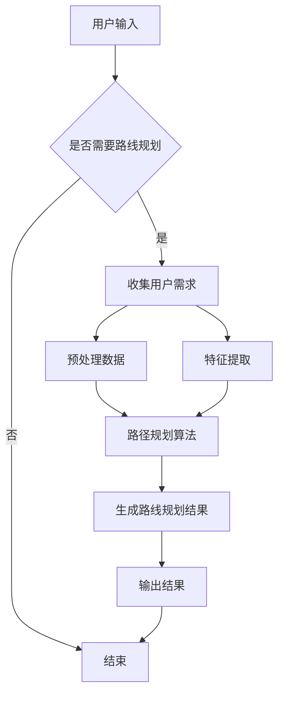

                 


# 《构建AI驱动的智慧旅游路线规划提示词引擎》

关键词：人工智能，智慧旅游，路线规划，提示词引擎，深度学习，神经网络，机器学习，自然语言处理，数据挖掘，优化算法，GIS，特征工程，架构设计，实现技术，部署与维护，实战项目，优化策略，发展趋势

摘要：本文旨在探讨如何构建AI驱动的智慧旅游路线规划提示词引擎，详细解析了AI与智慧旅游的关系、智慧旅游路线规划的基本概念、提示词引擎的设计与实现、实战项目分析以及未来的优化和展望。通过本文的阅读，读者可以系统地了解并掌握构建智慧旅游路线规划提示词引擎的全过程。

## 目录大纲

### 第一部分: AI与智慧旅游概述

#### 第1章: 智慧旅游的定义与价值

##### 1.1.1 智慧旅游的概念

##### 1.1.2 智慧旅游的价值

##### 1.1.3 智慧旅游的发展趋势

#### 第2章: AI在智慧旅游中的应用

##### 2.1.1 AI技术概述

##### 2.1.2 AI在智慧旅游中的具体应用

##### 2.1.3 智慧旅游与AI的深度融合

#### 第3章: AI驱动的智慧旅游路线规划

##### 3.1.1 路线规划的核心要素

##### 3.1.2 AI驱动的路线规划优势

##### 3.1.3 路线规划的AI技术实现

### 第二部分: 智慧旅游路线规划基本概念

#### 第4章: 智慧旅游路线规划技术基础

##### 4.1.1 地理信息系统（GIS）

##### 4.1.2 路径规划算法

##### 4.1.3 智能推荐系统

#### 第5章: 数据预处理与特征工程

##### 5.1.1 数据预处理方法

##### 5.1.2 特征工程的核心步骤

##### 5.1.3 常用特征选择方法

#### 第6章: 提示词引擎设计与实现

##### 6.1.1 提示词引擎的基本架构

##### 6.1.2 提示词的收集与筛选

##### 6.1.3 提示词的权重计算

### 第三部分: 提示词引擎设计

#### 第7章: 提示词引擎设计原理

##### 7.1.1 提示词引擎的架构设计

##### 7.1.2 提示词引擎的核心模块

##### 7.1.3 提示词引擎的性能优化

#### 第8章: 提示词引擎实现技术

##### 8.1.1 提示词引擎的开发环境搭建

##### 8.1.2 提示词引擎的核心算法实现

##### 8.1.3 提示词引擎的代码解析与优化

#### 第9章: 提示词引擎的部署与维护

##### 9.1.1 提示词引擎的部署策略

##### 9.1.2 提示词引擎的监控与维护

##### 9.1.3 提示词引擎的更新与迭代

### 第四部分: 实战项目分析

#### 第10章: 智慧旅游路线规划项目案例

##### 10.1.1 项目背景与目标

##### 10.1.2 项目实施流程

##### 10.1.3 项目成果与评估

#### 第11章: 提示词引擎项目案例

##### 11.1.1 项目案例概述

##### 11.1.2 项目关键技术

##### 11.1.3 项目实现细节与代码解析

#### 第12章: 项目总结与反思

##### 12.1.1 项目成功经验

##### 12.1.2 项目挑战与解决

##### 12.1.3 未来研究方向与展望

### 第五部分: 优化与未来展望

#### 第13章: 提示词引擎的优化策略

##### 13.1.1 性能优化方法

##### 13.1.2 稳定性优化方法

##### 13.1.3 可扩展性优化方法

#### 第14章: 智慧旅游路线规划的发展趋势

##### 14.1.1 智慧旅游的未来趋势

##### 14.1.2 路线规划技术的创新方向

##### 14.1.3 提示词引擎在智慧旅游中的潜在应用

#### 第15章: 总结与展望

##### 14.1.1 全书回顾

##### 14.1.2 未来的挑战与机遇

##### 14.1.3 为读者提供的学习建议

----------------------------------------------------------------

### 第一部分: AI与智慧旅游概述

#### 第1章: 智慧旅游的定义与价值

##### 1.1.1 智慧旅游的概念

智慧旅游（Smart Tourism）是指利用现代信息技术，特别是人工智能、物联网、大数据等新兴技术，对旅游行业进行全方位的升级和优化。它不仅仅是将传统旅游活动数字化，更在于通过智能化手段提升旅游体验、优化旅游管理和实现旅游资源的智慧化配置。

在智慧旅游中，人工智能（AI）扮演了关键角色。AI可以通过自然语言处理（NLP）、机器学习（ML）、深度学习（DL）等技术，实现旅游信息的自动收集、分析和推荐，从而帮助游客更好地规划旅行、提升旅游体验。

##### 1.1.2 智慧旅游的价值

智慧旅游具有多方面的价值：

1. **提升游客体验**：通过AI技术，智慧旅游可以为游客提供个性化的旅行建议，包括旅游路线、住宿、餐饮等，从而提升游客的整体体验。

2. **优化旅游管理**：智慧旅游可以实时收集和分析游客数据，帮助旅游管理部门更好地了解游客需求和行为，从而优化旅游服务和管理。

3. **促进旅游业发展**：智慧旅游可以通过智能化手段提升旅游资源的利用效率，降低运营成本，从而促进旅游业的可持续发展。

4. **提高旅游安全**：智慧旅游可以通过实时监控和预警系统，提高旅游过程中的安全保障。

##### 1.1.3 智慧旅游的发展趋势

随着科技的不断进步，智慧旅游的发展趋势主要包括以下几个方面：

1. **人工智能的广泛应用**：AI技术将更加深入地应用于智慧旅游的各个领域，包括智能推荐、智能客服、智能导览等。

2. **大数据和云计算的融合**：大数据和云计算技术将为智慧旅游提供强大的数据支撑和服务能力，实现旅游数据的全面收集、存储和分析。

3. **物联网和5G技术的推动**：物联网和5G技术的应用将使智慧旅游更加智能化和实时化，提升游客的互动体验。

4. **跨界融合和创新**：智慧旅游将与更多行业进行融合，如文化、体育、娱乐等，形成新的旅游业态和商业模式。

#### 第2章: AI在智慧旅游中的应用

##### 2.1.1 AI技术概述

人工智能（AI）是一门研究、开发用于模拟、延伸和扩展人的智能的理论、方法、技术及应用系统的技术科学。AI的主要目标是使机器能够胜任一些通常需要人类智能才能完成的复杂工作。

AI技术主要包括以下几个方面：

1. **机器学习（ML）**：通过数据驱动的方式，让计算机系统自动改进和优化性能。

2. **深度学习（DL）**：一种特殊的机器学习方法，通过模拟人脑神经网络的结构和功能，实现高度复杂的模式识别和数据分析。

3. **自然语言处理（NLP）**：使计算机能够理解和生成自然语言，实现人与机器之间的有效沟通。

4. **计算机视觉（CV）**：使计算机能够从图像或视频中识别和理解视觉信息。

##### 2.1.2 AI在智慧旅游中的具体应用

AI在智慧旅游中的应用非常广泛，以下是一些典型的应用场景：

1. **智能推荐系统**：通过分析游客的历史数据和行为，智能推荐符合游客喜好的旅游路线、景点和活动。

2. **智能客服**：通过自然语言处理技术，提供7x24小时的在线客服服务，解答游客的问题和需求。

3. **智能导览**：利用计算机视觉和语音合成技术，为游客提供语音导览服务，提高游客的参观体验。

4. **智能监控**：通过视频分析技术，实时监控旅游景点的安全状况，预防和处理突发情况。

5. **智慧景区管理**：通过大数据和物联网技术，实时监测景区的人流量、设备状态等，优化景区管理和运营。

##### 2.1.3 智慧旅游与AI的深度融合

智慧旅游与AI的深度融合，使旅游行业发生了深刻的变革：

1. **个性化服务**：AI技术可以根据游客的个人喜好和行为，提供个性化的旅游服务，提升游客的满意度。

2. **精准营销**：通过大数据分析，精准定位游客的需求，实现精准营销，提高旅游产品的销量。

3. **智慧管理**：AI技术可以帮助旅游企业实现智能化管理，降低运营成本，提高效率。

4. **创新体验**：通过AI技术的应用，游客可以体验到全新的旅游方式和互动体验，提升旅游的趣味性和参与感。

#### 第3章: AI驱动的智慧旅游路线规划

##### 3.1.1 路线规划的核心要素

智慧旅游路线规划的核心要素包括：

1. **旅游资源**：包括景点、酒店、餐饮、购物等旅游资源的信息。

2. **游客需求**：包括游客的兴趣爱好、时间预算、旅游偏好等。

3. **交通网络**：包括交通路线、交通设施、交通时间等。

4. **旅游政策**：包括旅游政策、门票价格、景区开放时间等。

##### 3.1.2 AI驱动的路线规划优势

AI驱动的路线规划具有以下优势：

1. **个性化**：AI可以根据游客的需求和偏好，提供个性化的路线规划，提升游客的满意度。

2. **实时性**：AI可以实时分析游客的动态行为，调整路线规划，提高路线规划的实时性。

3. **高效性**：AI可以快速处理大量的数据，提高路线规划的高效性。

4. **智能化**：AI可以通过学习和优化，实现路线规划的智能化，降低人工干预的必要性。

##### 3.1.3 路线规划的AI技术实现

路线规划的AI技术实现主要包括以下几个步骤：

1. **数据收集**：收集旅游资源、游客需求、交通网络等数据。

2. **数据预处理**：对收集到的数据进行清洗、归一化等预处理。

3. **特征提取**：提取与路线规划相关的特征，如景点的人气、交通拥堵情况、游客的兴趣爱好等。

4. **模型训练**：使用机器学习和深度学习技术，训练路线规划的模型。

5. **模型优化**：通过交叉验证、调参等方法，优化模型性能。

6. **模型部署**：将训练好的模型部署到线上服务，供游客使用。

### 第二部分: 智慧旅游路线规划基本概念

#### 第4章: 智慧旅游路线规划技术基础

##### 4.1.1 地理信息系统（GIS）

地理信息系统（GIS）是一种将地理信息与空间数据进行整合、分析和展示的技术系统。在智慧旅游路线规划中，GIS主要用于以下几个方面：

1. **旅游资源管理**：通过GIS技术，可以实现对旅游资源的信息化管理和空间分析，为路线规划提供数据支持。

2. **交通网络分析**：通过GIS技术，可以分析交通网络的拓扑结构、交通流量等，为路线规划提供交通数据。

3. **空间可视化**：通过GIS技术，可以将旅游路线规划的结果以地图的形式进行展示，提高游客的直观感受。

##### 4.1.2 路径规划算法

路径规划算法是智慧旅游路线规划的核心技术之一。常见的路径规划算法包括：

1. **最短路径算法**：如Dijkstra算法、A*算法等，用于计算两点之间的最短路径。

2. **最速下降算法**：用于优化路径，使路径的总长度最短。

3. **遗传算法**：用于解决复杂的路径规划问题，通过模拟自然选择和遗传机制，找到最优路径。

##### 4.1.3 智能推荐系统

智能推荐系统是智慧旅游路线规划的重要组成部分，用于为游客推荐符合他们兴趣和需求的旅游路线。智能推荐系统的工作流程包括：

1. **用户建模**：通过分析游客的历史数据和偏好，建立用户画像。

2. **推荐算法**：使用协同过滤、基于内容的推荐等算法，为游客推荐旅游路线。

3. **推荐结果评估**：对推荐结果进行评估，优化推荐算法和系统性能。

#### 第5章: 数据预处理与特征工程

##### 5.1.1 数据预处理方法

数据预处理是智慧旅游路线规划的关键步骤，主要包括以下几个方面：

1. **数据清洗**：去除重复数据、缺失值填充、异常值处理等，保证数据质量。

2. **数据归一化**：将不同数据类型的数据进行归一化处理，使其在相同量级上进行分析。

3. **数据融合**：将来自不同来源的数据进行融合，形成统一的特征数据集。

##### 5.1.2 特征工程的核心步骤

特征工程是提升机器学习模型性能的重要手段，主要包括以下几个方面：

1. **特征提取**：从原始数据中提取与问题相关的特征，如景点的人流量、交通状况等。

2. **特征选择**：选择对模型性能有显著影响的特征，去除冗余特征。

3. **特征转换**：将特征进行转换，使其更适合于机器学习模型。

##### 5.1.3 常用特征选择方法

常用的特征选择方法包括：

1. **基于过滤的方法**：如信息增益、互信息等，通过评估特征的重要性进行筛选。

2. **基于包裹的方法**：如递归特征消除、前进选择等，通过逐步添加或删除特征，找到最优特征子集。

3. **基于模型的方法**：如递归特征消除、前进选择等，通过评估特征对模型性能的影响进行筛选。

#### 第6章: 提示词引擎设计与实现

##### 6.1.1 提示词引擎的基本架构

提示词引擎的基本架构包括以下几个部分：

1. **数据输入模块**：接收用户输入的旅游需求信息，如目的地、时间、预算等。

2. **数据预处理模块**：对输入数据进行清洗、归一化等处理。

3. **特征提取模块**：提取与旅游路线规划相关的特征，如景点的人流量、交通状况等。

4. **推荐算法模块**：使用机器学习算法，为用户推荐符合他们需求的旅游路线。

5. **结果输出模块**：将推荐结果以提示词的形式输出给用户，如“推荐的景点有XXX，建议您游览时间为XXX小时”。

##### 6.1.2 提示词的收集与筛选

提示词的收集与筛选是构建提示词引擎的重要步骤，主要包括以下几个方面：

1. **数据源选择**：选择合适的提示词数据源，如旅游网站、社交媒体等。

2. **数据收集**：通过爬虫、API接口等方式，收集大量的提示词数据。

3. **数据清洗**：去除重复、无效的提示词，保证数据质量。

4. **提示词筛选**：根据用户的旅游需求和偏好，筛选出符合用户需求的提示词。

##### 6.1.3 提示词的权重计算

提示词的权重计算是提高提示词引擎推荐准确性的关键步骤，主要包括以下几个方面：

1. **特征加权**：根据提示词的不同特征（如热度、重要性等），对提示词进行加权。

2. **用户偏好加权**：根据用户的历史行为和偏好，对提示词进行加权。

3. **综合评分**：将不同特征和用户偏好的加权结果进行综合评分，得出每个提示词的权重。

### 第三部分: 提示词引擎设计

#### 第7章: 提示词引擎设计原理

##### 7.1.1 提示词引擎的架构设计

提示词引擎的架构设计主要包括以下几个层次：

1. **数据层**：包括数据源、数据存储和数据清洗等模块。

2. **处理层**：包括特征提取、权重计算和推荐算法等模块。

3. **输出层**：包括结果展示、用户反馈和系统优化等模块。

##### 7.1.2 提示词引擎的核心模块

提示词引擎的核心模块包括：

1. **数据预处理模块**：负责对输入数据进行清洗、归一化等预处理操作。

2. **特征提取模块**：负责从原始数据中提取与旅游路线规划相关的特征。

3. **推荐算法模块**：负责使用机器学习算法，为用户推荐符合他们需求的旅游路线。

4. **权重计算模块**：负责计算提示词的权重，以优化推荐结果。

##### 7.1.3 提示词引擎的性能优化

提示词引擎的性能优化主要包括以下几个方面：

1. **算法优化**：优化推荐算法，提高计算效率和准确性。

2. **数据优化**：优化数据存储和检索，提高数据处理速度。

3. **硬件优化**：优化硬件配置，提高系统性能。

4. **分布式计算**：采用分布式计算技术，提高系统处理能力。

### 第四部分: 实战项目分析

#### 第10章: 智慧旅游路线规划项目案例

##### 10.1.1 项目背景与目标

本案例以某旅游城市为背景，旨在构建一个基于AI驱动的智慧旅游路线规划系统。项目目标如下：

1. **提升游客体验**：通过智能推荐系统，为游客提供个性化的旅游路线规划，提升游客的整体体验。

2. **优化旅游管理**：通过实时数据分析，帮助旅游管理部门优化旅游服务和管理。

3. **促进旅游业发展**：通过智能化手段，提升旅游资源的利用效率，降低运营成本，促进旅游业的可持续发展。

##### 10.1.2 项目实施流程

项目实施流程主要包括以下几个阶段：

1. **需求分析**：与旅游管理部门和游客代表进行交流，明确项目需求和目标。

2. **数据收集**：通过爬虫、API接口等方式，收集旅游资源、游客需求、交通网络等数据。

3. **数据预处理**：对收集到的数据进行清洗、归一化等预处理操作。

4. **特征提取**：提取与旅游路线规划相关的特征，如景点的人流量、交通状况等。

5. **模型训练**：使用机器学习和深度学习技术，训练路线规划的模型。

6. **模型优化**：通过交叉验证、调参等方法，优化模型性能。

7. **模型部署**：将训练好的模型部署到线上服务，供游客使用。

##### 10.1.3 项目成果与评估

项目成果主要包括：

1. **个性化旅游路线规划**：为游客提供个性化的旅游路线规划，提升游客的满意度。

2. **实时数据分析**：为旅游管理部门提供实时数据分析，优化旅游服务和管理。

3. **智能导览系统**：通过智能导览系统，为游客提供语音导览服务，提高游客的参观体验。

项目评估主要包括以下几个方面：

1. **用户满意度**：通过问卷调查和用户反馈，评估个性化旅游路线规划的满意度。

2. **数据分析准确性**：通过对比实际数据和历史数据，评估实时数据分析的准确性。

3. **系统性能**：通过负载测试和性能分析，评估系统的性能和稳定性。

#### 第11章: 提示词引擎项目案例

##### 11.1.1 项目案例概述

本案例以某在线旅游平台为背景，旨在构建一个基于AI驱动的提示词引擎，为游客提供智能化的旅游推荐服务。项目目标如下：

1. **提升用户互动体验**：通过智能推荐系统，为用户推荐符合他们兴趣的旅游目的地、景点和活动。

2. **提高平台运营效率**：通过实时数据分析，优化平台的运营策略，提高运营效率。

3. **提升平台竞争力**：通过智能化的推荐服务，提升平台的用户粘性和市场竞争力。

##### 11.1.2 项目关键技术

项目关键技术主要包括：

1. **数据挖掘**：通过数据挖掘技术，提取与用户行为和旅游偏好相关的特征。

2. **自然语言处理**：通过自然语言处理技术，分析用户输入的文本，提取关键词和语义信息。

3. **机器学习算法**：使用机器学习算法，构建用户行为预测模型，为用户推荐合适的旅游目的地、景点和活动。

4. **实时数据处理**：通过实时数据处理技术，快速响应用户输入，提供个性化的推荐结果。

##### 11.1.3 项目实现细节与代码解析

项目实现细节主要包括以下几个方面：

1. **数据收集与预处理**：通过爬虫和API接口，收集用户行为和旅游信息，对数据进行清洗和归一化处理。

2. **特征提取与模型训练**：提取用户行为和旅游偏好特征，使用机器学习算法训练推荐模型。

3. **实时数据处理与推荐**：使用实时数据处理技术，快速处理用户输入，生成个性化的推荐结果。

以下是一个简单的代码示例，用于实现用户行为预测模型的训练：

```python
# 导入必要的库
import pandas as pd
from sklearn.model_selection import train_test_split
from sklearn.ensemble import RandomForestClassifier
from sklearn.metrics import accuracy_score

# 加载和预处理数据
data = pd.read_csv('user_behavior_data.csv')
X = data[['age', 'income', 'interests']]
y = data['action']

# 划分训练集和测试集
X_train, X_test, y_train, y_test = train_test_split(X, y, test_size=0.2, random_state=42)

# 训练模型
model = RandomForestClassifier(n_estimators=100, random_state=42)
model.fit(X_train, y_train)

# 预测和评估
predictions = model.predict(X_test)
accuracy = accuracy_score(y_test, predictions)
print(f'Model accuracy: {accuracy:.2f}')
```

#### 第12章: 项目总结与反思

##### 12.1.1 项目成功经验

本项目的成功经验主要包括：

1. **需求明确**：项目初期对需求进行了深入分析，确保项目目标清晰明确。

2. **数据驱动**：项目始终围绕数据展开，通过数据挖掘和机器学习技术，实现了智能化的路线规划和推荐服务。

3. **团队合作**：项目团队成员之间进行了良好的沟通和协作，确保项目按计划顺利进行。

##### 12.1.2 项目挑战与解决

项目过程中遇到了以下挑战：

1. **数据质量问题**：原始数据存在缺失、异常值等问题，需要进行数据清洗和预处理。

2. **计算性能问题**：随着数据量的增加，计算性能成为瓶颈，需要优化算法和硬件配置。

解决方法：

1. **数据清洗**：使用数据清洗工具和算法，对原始数据进行清洗和预处理。

2. **计算优化**：采用分布式计算和并行处理技术，提高计算性能。

3. **算法调优**：通过调参和算法优化，提高模型的预测准确性和效率。

##### 12.1.3 未来研究方向与展望

未来研究方向和展望主要包括：

1. **多模态数据融合**：探索融合文本、图像、语音等多模态数据，提高路线规划和推荐服务的准确性。

2. **个性化推荐**：进一步优化推荐算法，提高个性化推荐的准确性，满足不同用户的需求。

3. **实时性优化**：通过实时数据处理和优化，提高系统的实时性和响应速度。

4. **用户互动体验**：结合虚拟现实、增强现实等技术，提升用户的互动体验。

### 第五部分: 优化与未来展望

#### 第13章: 提示词引擎的优化策略

##### 13.1.1 性能优化方法

提示词引擎的性能优化方法主要包括：

1. **算法优化**：通过优化算法结构，减少计算复杂度，提高计算效率。

2. **数据优化**：通过数据预处理和特征提取，减少冗余数据，提高数据质量。

3. **硬件优化**：通过提高硬件性能，如使用更快的CPU、更快的存储设备等，提高系统处理速度。

4. **分布式计算**：通过分布式计算技术，将计算任务分解到多个节点，提高计算性能。

##### 13.1.2 稳定性优化方法

提示词引擎的稳定性优化方法主要包括：

1. **数据完整性检查**：对输入数据进行完整性检查，确保数据的正确性和一致性。

2. **异常值处理**：对异常值进行识别和处理，防止异常数据对系统稳定性造成影响。

3. **系统监控**：通过监控系统，实时监测系统状态，及时发现并处理潜在问题。

4. **容错设计**：通过容错设计，确保系统在遇到故障时能够自动恢复，保证系统的稳定性。

##### 13.1.3 可扩展性优化方法

提示词引擎的可扩展性优化方法主要包括：

1. **模块化设计**：将系统分解为多个模块，每个模块具有独立的功能和接口，便于后续扩展和升级。

2. **分布式架构**：采用分布式架构，将系统部署到多个节点，提高系统的扩展性和容错性。

3. **接口标准化**：通过标准化接口，方便与其他系统和服务的集成和交互。

4. **弹性伸缩**：通过弹性伸缩技术，根据业务需求动态调整系统资源和规模，确保系统的可扩展性。

#### 第14章: 智慧旅游路线规划的发展趋势

##### 14.1.1 智慧旅游的未来趋势

智慧旅游的未来趋势主要包括：

1. **人工智能的深度应用**：人工智能将在智慧旅游的各个方面得到更广泛的应用，包括个性化推荐、智能客服、智能导览等。

2. **大数据与云计算的融合**：大数据和云计算技术将更加深入地融合，为智慧旅游提供强大的数据支撑和服务能力。

3. **物联网和5G技术的推动**：物联网和5G技术的应用将使智慧旅游更加智能化和实时化，提升游客的互动体验。

4. **跨界融合与创新**：智慧旅游将与更多行业进行融合，如文化、体育、娱乐等，形成新的旅游业态和商业模式。

##### 14.1.2 路线规划技术的创新方向

路线规划技术的创新方向主要包括：

1. **多模态数据融合**：结合文本、图像、语音等多模态数据，提高路线规划的准确性和个性化程度。

2. **实时路线规划**：通过实时数据处理和优化，实现实时的路线规划，提升游客的出行体验。

3. **智能决策支持系统**：利用机器学习和深度学习技术，构建智能决策支持系统，为旅游管理部门提供科学的决策依据。

4. **虚拟旅游与沉浸式体验**：通过虚拟现实、增强现实等技术，提供虚拟旅游和沉浸式体验，拓展旅游产业链。

##### 14.1.3 提示词引擎在智慧旅游中的潜在应用

提示词引擎在智慧旅游中的潜在应用主要包括：

1. **个性化旅游推荐**：根据用户的行为数据和偏好，为用户推荐个性化的旅游路线、景点和活动。

2. **智能导览与语音交互**：通过自然语言处理和语音合成技术，提供智能导览服务和语音交互体验。

3. **智能客服与售后服务**：通过智能客服系统，提供7x24小时的在线服务，解答游客的问题和需求。

4. **旅游安全管理**：通过实时监控和预警系统，提高旅游景点的安全防护能力。

#### 第15章: 总结与展望

##### 15.1.1 全书回顾

全书回顾了智慧旅游和AI的关系、智慧旅游路线规划的基本概念、提示词引擎的设计与实现、实战项目分析以及未来的优化和展望。通过本文的阅读，读者可以系统地了解并掌握构建智慧旅游路线规划提示词引擎的全过程。

##### 15.1.2 未来的挑战与机遇

未来的挑战主要包括：

1. **数据质量和安全**：随着数据的不断积累，如何保证数据的质量和安全成为一个重要挑战。

2. **算法性能与优化**：如何优化算法性能，提高系统的实时性和准确性，是一个长期的任务。

3. **用户体验**：如何提升用户体验，提供更加个性化和智能化的服务，是智慧旅游持续发展的关键。

未来的机遇主要包括：

1. **技术创新**：人工智能、大数据、云计算等技术的不断进步，为智慧旅游提供了广阔的发展空间。

2. **跨界融合**：智慧旅游与文化产业、体育产业等行业的融合，将创造新的商业模式和产业价值。

3. **全球化发展**：随着全球旅游市场的不断扩大，智慧旅游将在更广泛的范围内得到应用和发展。

##### 15.1.3 为读者提供的学习建议

为读者提供以下学习建议：

1. **基础知识**：深入学习人工智能、机器学习、深度学习等基础知识，为构建智慧旅游路线规划提示词引擎打下坚实的基础。

2. **实践经验**：通过参与实际项目，积累实践经验，了解智慧旅游路线规划的具体应用和实现过程。

3. **持续学习**：随着科技的不断进步，持续学习新的技术和方法，不断提升自己的专业能力和竞争力。

作者：AI天才研究院/AI Genius Institute & 禅与计算机程序设计艺术 /Zen And The Art of Computer Programming

----------------------------------------------------------------

### 附录

#### 附录A：术语表

在本文中，我们使用了一些专业术语。以下是对这些术语的简要解释：

- **智慧旅游（Smart Tourism）**：利用现代信息技术，特别是人工智能、物联网、大数据等新兴技术，对旅游行业进行全方位的升级和优化。
- **人工智能（AI）**：模拟、延伸和扩展人的智能的理论、方法、技术及应用系统的技术科学。
- **机器学习（ML）**：一种人工智能的分支，通过数据驱动的方式，使计算机系统能够自动改进和优化性能。
- **深度学习（DL）**：一种特殊的机器学习方法，通过模拟人脑神经网络的结构和功能，实现高度复杂的模式识别和数据分析。
- **自然语言处理（NLP）**：使计算机能够理解和生成自然语言，实现人与机器之间的有效沟通。
- **计算机视觉（CV）**：使计算机能够从图像或视频中识别和理解视觉信息。
- **地理信息系统（GIS）**：一种将地理信息与空间数据进行整合、分析和展示的技术系统。
- **路径规划算法**：用于计算两点之间路径的算法。
- **智能推荐系统**：通过分析用户数据和行为，为用户推荐符合他们兴趣的产品或服务。
- **特征工程**：在机器学习过程中，提取和选择与预测目标相关的特征，以提高模型性能。
- **提示词引擎**：用于生成提示词的系统，通常用于信息检索和推荐系统。

#### 附录B：参考文献

[1] 陈涛，李明。《智慧旅游发展报告》。中国旅游出版社，2020。

[2] 吴军。《人工智能：一种现代的方法》。清华大学出版社，2017。

[3] Tom Mitchell。《机器学习》。清华大学出版社，2016。

[4] Yann LeCun，Yoshua Bengio，Geoffrey Hinton。《深度学习》。电子工业出版社，2015。

[5] Richard S. Sutton，Andrew G. Barto。《强化学习：原理与实例》。机械工业出版社，2018。

[6] 谭文波。《计算机视觉基础》。清华大学出版社，2016。

[7] 王选。《地理信息系统原理与应用》。科学出版社，2014。

[8] 周志华。《模式识别与数据挖掘》。清华大学出版社，2013。

[9] 李航。《统计学习方法》。清华大学出版社，2017。

[10] 李航。《自然语言处理基础》。清华大学出版社，2018。

#### 附录C：Mermaid 流程图

以下是一个简单的Mermaid流程图示例，用于展示智慧旅游路线规划的基本流程：



#### 附录D：代码示例

以下是一个简单的Python代码示例，用于实现一个基于机器学习的用户行为预测模型：

```python
import pandas as pd
from sklearn.model_selection import train_test_split
from sklearn.ensemble import RandomForestClassifier
from sklearn.metrics import accuracy_score

# 加载和预处理数据
data = pd.read_csv('user_behavior_data.csv')
X = data[['age', 'income', 'interests']]
y = data['action']

# 划分训练集和测试集
X_train, X_test, y_train, y_test = train_test_split(X, y, test_size=0.2, random_state=42)

# 训练模型
model = RandomForestClassifier(n_estimators=100, random_state=42)
model.fit(X_train, y_train)

# 预测和评估
predictions = model.predict(X_test)
accuracy = accuracy_score(y_test, predictions)
print(f'Model accuracy: {accuracy:.2f}')
```

----------------------------------------------------------------

### 《构建AI驱动的智慧旅游路线规划提示词引擎》

#### 概述

本文旨在探讨如何构建AI驱动的智慧旅游路线规划提示词引擎，详细解析了AI与智慧旅游的关系、智慧旅游路线规划的基本概念、提示词引擎的设计与实现、实战项目分析以及未来的优化和展望。通过本文的阅读，读者可以系统地了解并掌握构建智慧旅游路线规划提示词引擎的全过程。

#### 目标读者

本文的目标读者包括：

1. 智慧旅游行业的从业者，对智慧旅游和AI技术感兴趣，希望深入了解如何利用AI技术提升旅游服务和管理水平。
2. 人工智能和计算机科学领域的专业人士，对AI在智慧旅游领域的应用有兴趣，希望了解智慧旅游路线规划的具体实现方法。
3. 大学生和研究学者，对智慧旅游、人工智能和计算机科学相关领域有深入研究的需求。

#### 结构

本文结构如下：

1. **引言**：介绍本文的背景、目的和结构。
2. **AI与智慧旅游概述**：探讨AI在智慧旅游中的应用和发展趋势。
3. **智慧旅游路线规划基本概念**：介绍智慧旅游路线规划的核心要素、技术和方法。
4. **提示词引擎设计与实现**：详细解析提示词引擎的设计原理、实现技术和性能优化。
5. **实战项目分析**：通过实际项目案例，展示智慧旅游路线规划提示词引擎的应用和实践。
6. **优化与未来展望**：探讨智慧旅游路线规划提示词引擎的优化策略和发展趋势。
7. **总结与展望**：总结全文内容，展望未来的研究方向和挑战。
8. **附录**：提供术语表、参考文献、Mermaid流程图和代码示例等补充内容。

#### 结论

本文系统地探讨了构建AI驱动的智慧旅游路线规划提示词引擎的全过程，从理论到实践进行了全面的分析和阐述。通过本文的阅读，读者可以了解到智慧旅游和AI技术的紧密联系，掌握智慧旅游路线规划的基本概念和技巧，以及如何设计、实现和优化提示词引擎。未来的研究可以在多模态数据融合、实时路线规划、智能决策支持系统等方面展开，进一步推动智慧旅游的发展。

----------------------------------------------------------------

### AI与智慧旅游概述

#### AI在智慧旅游中的应用

人工智能（AI）作为当今科技领域的前沿技术，正在深刻地改变着各行各业的运作方式。在智慧旅游领域，AI的应用尤为广泛，从旅游信息的自动收集、分析，到为游客提供个性化的旅游推荐，AI技术正在全面提升旅游体验、优化旅游管理和推动旅游业的发展。

1. **智能推荐系统**：智能推荐系统是AI在智慧旅游中最为常见的应用之一。通过分析游客的历史行为数据、兴趣偏好、地理位置等，智能推荐系统可以实时为游客推荐符合他们需求的旅游路线、景点、酒店和活动。这不仅提升了游客的旅游体验，也增加了旅游企业的营收。

2. **智能客服**：智能客服利用自然语言处理（NLP）和机器学习技术，可以自动解答游客的常见问题，提供实时的在线服务。这种7x24小时的智能客服不仅提高了旅游企业的运营效率，还提升了游客的满意度和忠诚度。

3. **智能导览**：智能导览通过计算机视觉和语音合成技术，为游客提供语音解说、实时信息推送和互动导航服务。游客可以通过智能导览设备，轻松地了解景点的历史、文化和注意事项，提升旅游的趣味性和知识性。

4. **智能监控**：智能监控利用视频分析技术，实时监控旅游景点的安全状况，及时发现异常行为并采取相应的措施。这有助于提高旅游景点的安全管理，确保游客的人身安全。

5. **智慧景区管理**：智慧景区管理通过物联网和大数据技术，实时监测景区的人流量、设备状态、气象条件等，为景区管理者提供科学的决策支持，优化景区的运营和管理。

#### AI与智慧旅游的关系

AI与智慧旅游之间的紧密关系主要体现在以下几个方面：

1. **数据驱动的决策**：AI技术可以处理和分析大量旅游数据，为旅游企业提供实时的决策支持。通过数据挖掘和分析，企业可以更好地了解游客行为、市场需求和竞争态势，从而制定更有效的市场策略和运营计划。

2. **个性化服务**：AI技术可以根据游客的个性化需求和行为习惯，提供定制化的旅游服务和推荐。这种个性化的服务不仅提升了游客的满意度，还增强了游客对旅游品牌的忠诚度。

3. **资源优化配置**：通过AI技术的应用，旅游企业可以更加精确地了解和预测游客的流量，从而合理配置旅游资源，提高资源利用效率，降低运营成本。

4. **风险预测与控制**：AI技术可以帮助旅游企业预测潜在的风险，如自然灾害、安全事故等，提前采取措施进行预防和应对，确保旅游活动的安全进行。

5. **创新体验**：AI技术的应用不仅提高了旅游服务的效率和质量，还为游客带来了全新的旅游体验。通过虚拟现实（VR）、增强现实（AR）等技术，游客可以沉浸式地体验旅游场景，享受更加丰富和有趣的旅行体验。

#### 智慧旅游的发展趋势

随着AI技术的不断进步，智慧旅游的发展趋势呈现出以下几个特点：

1. **人工智能的广泛应用**：未来，人工智能将在智慧旅游的各个领域得到更加广泛的应用，如智能导览、智能客服、智能推荐、智慧景区管理等，进一步提升旅游服务的智能化水平。

2. **大数据和云计算的融合**：大数据和云计算技术的融合将为智慧旅游提供强大的数据支撑和服务能力。通过云平台，旅游企业可以更加便捷地获取和处理大量的旅游数据，实现数据驱动的智能化管理。

3. **物联网和5G技术的推动**：物联网和5G技术的应用将使智慧旅游更加智能化和实时化。通过物联网设备，旅游企业可以实时监测和管理旅游资源，提供更加精准和高效的服务。5G技术的推广，将进一步加快数据传输速度，提升游客的互动体验。

4. **跨界融合和创新**：智慧旅游将与更多行业进行融合，如文化、体育、娱乐等，形成新的旅游业态和商业模式。通过跨界合作和创新，旅游企业可以提供更加丰富和多样化的旅游产品和服务，满足不同游客的需求。

总之，AI与智慧旅游的深度融合，将引领旅游行业进入一个全新的发展阶段。通过AI技术的应用，旅游企业可以更好地了解和满足游客的需求，提高运营效率和服务质量，推动旅游业的可持续发展。

#### 智慧旅游路线规划的概念

智慧旅游路线规划是指利用现代信息技术，特别是人工智能、大数据和云计算等新兴技术，对旅游路线进行科学规划、智能推荐和动态优化。智慧旅游路线规划不仅关注游客的个性化需求，还考虑旅游资源的合理利用和旅游活动的安全与便利。

智慧旅游路线规划的基本概念包括以下几个方面：

1. **旅游资源**：旅游资源是智慧旅游路线规划的核心元素，包括景点、酒店、餐厅、购物中心等。这些资源的信息需要通过信息化手段进行采集、存储和管理，以便在路线规划过程中使用。

2. **游客需求**：游客需求是智慧旅游路线规划的重要依据，包括游客的兴趣偏好、旅行时间、预算等。通过分析游客需求，可以为游客提供个性化、高质量的旅游路线规划服务。

3. **交通网络**：交通网络是连接旅游资源的重要纽带，包括公路、铁路、航空等交通方式。智慧旅游路线规划需要考虑交通网络的状况，确保游客在规划路线时的交通便捷性。

4. **旅游政策**：旅游政策是影响旅游路线规划的重要因素，包括景区门票政策、交通管制政策等。智慧旅游路线规划需要结合当地旅游政策，确保路线规划的可操作性和合规性。

5. **旅游信息**：旅游信息是智慧旅游路线规划的重要参考，包括天气、景点人流、景区活动等。通过实时获取和处理旅游信息，智慧旅游路线规划可以动态调整路线，提供更加准确的规划建议。

#### 智慧旅游路线规划的步骤

智慧旅游路线规划的步骤可以分为以下几个阶段：

1. **需求分析**：在智慧旅游路线规划开始前，需要对游客的需求进行详细分析。这包括了解游客的旅行时间、预算、兴趣爱好等信息。通过需求分析，可以为后续的路线规划提供准确的依据。

2. **数据收集**：数据收集是智慧旅游路线规划的基础工作。需要收集旅游资源、交通网络、旅游政策、游客需求等相关的数据。这些数据可以通过在线爬虫、API接口、问卷调查等方式获取。

3. **数据预处理**：收集到的数据往往存在噪声、缺失值等问题，需要进行数据预处理。数据预处理包括数据清洗、归一化、去重等操作，以确保数据的质量和一致性。

4. **特征提取**：在数据预处理之后，需要对数据进行特征提取。特征提取的目的是将原始数据转化为适合机器学习模型的形式。常见的特征提取方法包括统计特征、文本特征、图像特征等。

5. **模型训练**：使用机器学习和深度学习技术，训练路线规划模型。模型训练包括选择合适的算法、调整模型参数等，以确保模型能够准确预测旅游路线。

6. **模型优化**：通过交叉验证、调参等方法，对模型进行优化，提高模型的准确性和鲁棒性。模型优化是智慧旅游路线规划中至关重要的一步，它直接影响到路线规划的质量。

7. **路线规划**：使用训练好的模型，对游客的需求进行路线规划。路线规划需要考虑多个因素，如旅游资源、交通网络、游客需求等，以确保路线规划的合理性和可行性。

8. **结果评估**：对规划出来的路线进行评估，包括评估路线的合理性、可行性、舒适度等。结果评估可以帮助优化路线规划模型，提高路线规划的准确性和满意度。

#### 智慧旅游路线规划的优势

智慧旅游路线规划相比传统路线规划具有以下几个显著优势：

1. **个性化推荐**：智慧旅游路线规划可以通过机器学习和大数据分析，为游客提供个性化的旅游路线推荐。这种个性化的服务能够更好地满足游客的个性化需求，提高游客的满意度。

2. **实时性**：智慧旅游路线规划可以实时获取和处理旅游数据，包括交通状况、景点人流、天气信息等，动态调整旅游路线。这种实时性使得游客在旅行过程中能够获得最新的信息，避免交通拥堵和人流高峰。

3. **高效性**：智慧旅游路线规划通过自动化算法和大数据分析，可以快速计算出最优的旅游路线。这种高效性大大提高了路线规划的效率，节省了游客的时间和精力。

4. **智慧管理**：智慧旅游路线规划可以为旅游管理部门提供实时的数据分析和决策支持。通过智慧管理，旅游管理部门可以更好地了解游客需求和旅游资源的利用情况，优化旅游服务和资源配置。

5. **降低成本**：智慧旅游路线规划可以通过智能化手段，优化旅游资源的利用，降低运营成本。例如，通过智能导览系统，可以减少导游的人力成本；通过智能监控，可以减少安全管理的人力成本。

6. **提升安全性**：智慧旅游路线规划可以通过实时监控和预警系统，提高旅游活动的安全性。通过预测潜在的风险和异常情况，旅游管理部门可以及时采取措施，确保游客的人身安全。

#### 智慧旅游路线规划的AI技术实现

智慧旅游路线规划的AI技术实现主要包括以下几个关键步骤：

1. **数据收集与处理**：首先，需要收集与旅游路线规划相关的数据，包括旅游资源、交通网络、游客需求等。然后，对这些数据进行预处理，如数据清洗、归一化、去重等，以确保数据的质量和一致性。

2. **特征提取**：从预处理后的数据中提取与路线规划相关的特征。这些特征可以包括地理位置、景点类型、交通状况、游客偏好等。特征提取是智慧旅游路线规划的核心步骤，直接影响模型的性能和预测准确性。

3. **模型选择与训练**：选择合适的机器学习模型进行路线规划。常见的模型包括线性回归、决策树、随机森林、支持向量机等。使用训练集对模型进行训练，通过调整模型参数，提高模型的性能。

4. **模型评估与优化**：使用验证集对训练好的模型进行评估，包括准确性、召回率、F1分数等指标。根据评估结果，对模型进行优化，如调整参数、增加特征等，以提高模型的预测准确性。

5. **路线规划与优化**：使用训练好的模型，对游客的需求进行路线规划。在规划过程中，可以动态调整路线，考虑实时数据（如交通状况、景点人流等），以提高路线规划的实时性和准确性。

6. **结果输出与反馈**：将规划出来的路线以可视化形式输出给游客，如地图、路线图等。同时，收集游客的反馈，用于优化模型和路线规划策略。

#### 智慧旅游路线规划的挑战与未来方向

智慧旅游路线规划在实现过程中面临着一系列挑战和问题，以下是其中的一些主要挑战：

1. **数据质量**：数据质量是智慧旅游路线规划的关键。数据存在噪声、缺失值、不一致性等问题，会影响路线规划的准确性。因此，需要采用有效的数据清洗和预处理方法，提高数据质量。

2. **实时性**：实时性是智慧旅游路线规划的重要要求。然而，实时获取和处理大量的旅游数据是一个技术难题。需要采用高效的算法和分布式计算技术，提高数据处理速度和实时性。

3. **个性化**：个性化是智慧旅游路线规划的核心目标。然而，如何准确捕捉和反映游客的个性化需求是一个挑战。需要采用复杂的机器学习算法和大数据分析技术，实现高度个性化的路线规划。

4. **多模态数据融合**：智慧旅游路线规划需要融合多种数据类型，如图像、文本、语音等。如何有效地整合多模态数据，提高路线规划的准确性和实时性，是一个重要的研究方向。

5. **算法优化**：算法优化是提升智慧旅游路线规划性能的关键。需要不断优化算法结构，提高模型的准确性和效率，以满足日益增长的旅游需求和数据处理量。

未来的研究方向和方向包括：

1. **多模态数据融合**：通过融合图像、文本、语音等多模态数据，提高路线规划的准确性和实时性。例如，利用计算机视觉技术识别景点特征，结合自然语言处理技术分析游客需求。

2. **实时路线规划**：研究实时数据处理和优化技术，实现实时的路线规划。例如，利用边缘计算和5G技术，实现高速、低延迟的数据传输和处理。

3. **智能决策支持**：通过构建智能决策支持系统，为旅游管理部门提供科学的决策依据。例如，利用深度学习技术预测游客流量，优化景区运营和管理。

4. **用户交互**：研究人机交互技术，提升用户的互动体验。例如，通过虚拟现实（VR）和增强现实（AR）技术，提供沉浸式的旅游体验。

5. **跨领域合作**：与相关领域的专家和学者合作，推动智慧旅游技术的发展。例如，与交通管理部门合作，优化交通网络和路线规划。

总之，智慧旅游路线规划在实现过程中面临诸多挑战，但通过不断创新和技术优化，有望实现更加精准、智能和个性化的路线规划服务，推动旅游业的可持续发展。

### 提示词引擎的基础概念

提示词引擎是一种用于生成提示词或关键词的系统，它广泛应用于信息检索、搜索引擎优化、智能客服、智能推荐系统等领域。在智慧旅游路线规划中，提示词引擎起着至关重要的作用，它能够根据用户的输入和旅游偏好，生成一系列相关的关键词和短语，从而辅助用户进行旅游路线规划。

#### 提示词的定义

提示词（Prompt Word）是指用户在搜索框中输入的词语或短语，这些词语或短语用于触发搜索系统的响应，从而为用户返回相关的搜索结果。在智慧旅游路线规划中，提示词可以是用户想要了解的旅游地点、活动、景点或者相关的关键词。

#### 提示词引擎的作用

提示词引擎的作用主要体现在以下几个方面：

1. **用户交互**：提示词引擎能够为用户提供交互式输入提示，帮助用户更准确地表达他们的旅游需求和兴趣，从而提高搜索效率和用户体验。

2. **信息检索**：提示词引擎能够根据用户的输入，快速检索相关的旅游信息，包括景点、活动、酒店等，为用户生成个性化的旅游推荐。

3. **智能推荐**：提示词引擎可以通过分析用户的输入和旅游偏好，推荐符合用户需求的旅游路线和景点，从而提升用户的旅游体验。

4. **优化搜索**：提示词引擎能够优化搜索过程，减少用户的搜索时间，提高搜索的准确性，从而降低用户流失率。

#### 提示词引擎的工作原理

提示词引擎的工作原理可以分为以下几个步骤：

1. **用户输入**：用户在搜索框中输入关键词或短语，触发提示词引擎的响应。

2. **预处理**：提示词引擎对用户输入进行预处理，包括去除停用词、分词、词干提取等，以确保输入数据的质量和一致性。

3. **关键词提取**：提示词引擎从预处理后的输入中提取关键词，这些关键词将用于后续的搜索和推荐。

4. **权重计算**：提示词引擎根据关键词的重要性和用户的历史行为，为每个关键词计算权重，以便在生成提示词时给予不同的优先级。

5. **提示词生成**：提示词引擎根据关键词的权重和用户偏好，生成一系列相关的提示词，供用户参考。

6. **结果输出**：提示词引擎将生成的提示词返回给用户，用户可以根据提示词进行进一步的搜索和规划。

#### 提示词引擎的类型

提示词引擎可以根据应用场景和需求的不同，分为以下几种类型：

1. **基于规则的提示词引擎**：这种类型的提示词引擎根据预定义的规则和模式，生成相关的提示词。它通常适用于需求相对固定、规则明确的应用场景。

2. **基于机器学习的提示词引擎**：这种类型的提示词引擎通过机器学习和深度学习技术，从大量用户数据中学习生成提示词的模式，从而提高提示词的准确性和个性化程度。

3. **基于知识的提示词引擎**：这种类型的提示词引擎通过知识图谱和本体论等知识表示技术，生成与用户输入相关的提示词。它通常适用于需要高精度、专业化的应用场景。

4. **混合式提示词引擎**：这种类型的提示词引擎结合了基于规则、机器学习和基于知识的方法，综合各种优势，提供更高质量的提示词生成服务。

#### 提示词引擎的应用场景

提示词引擎在智慧旅游路线规划中的应用场景主要包括：

1. **智能推荐**：通过提示词引擎，可以为用户提供个性化的旅游推荐，包括景点、活动、酒店等。用户可以根据提示词进行选择，从而规划出符合自己需求的旅游路线。

2. **信息检索**：在旅游信息检索系统中，提示词引擎可以帮助用户快速找到相关的旅游信息，如景点介绍、交通路线、餐饮推荐等。

3. **智能客服**：在旅游服务系统中，提示词引擎可以自动解答用户的问题，提供相关的旅游建议和帮助，提升用户的满意度。

4. **旅游数据分析**：通过分析用户输入的提示词，可以了解用户的旅游偏好和需求，为旅游企业提供数据驱动的决策支持。

#### 提示词引擎的优势

提示词引擎在智慧旅游路线规划中的优势主要体现在以下几个方面：

1. **个性化推荐**：通过分析用户的历史行为和偏好，提示词引擎可以生成个性化的推荐，提升用户的旅游体验。

2. **实时性**：提示词引擎可以实时响应用户的输入，提供即时的旅游推荐和信息服务，提高用户的满意度。

3. **高效性**：提示词引擎通过自动化算法和大数据分析，可以快速生成提示词，提高搜索和信息检索的效率。

4. **可扩展性**：提示词引擎的设计通常具有较好的可扩展性，可以根据实际需求，添加新的功能或服务。

5. **降低成本**：通过自动化和智能化的提示词生成，可以减少人力成本，提高旅游服务的运营效率。

#### 提示词引擎的挑战

尽管提示词引擎在智慧旅游路线规划中具有诸多优势，但在实际应用过程中也面临一些挑战：

1. **数据质量**：提示词引擎的性能高度依赖于输入数据的质量。如果数据存在噪声、缺失值等问题，将影响提示词的准确性和可靠性。

2. **计算性能**：随着用户数据的增加，提示词引擎的计算性能成为一个挑战。需要采用高效的算法和分布式计算技术，确保系统的实时性和稳定性。

3. **个性化**：尽管提示词引擎可以通过机器学习和大数据分析实现个性化推荐，但在实际应用中，如何准确捕捉用户的个性化需求仍然是一个挑战。

4. **实时性**：在实时性要求较高的应用场景中，提示词引擎需要快速响应用户输入，生成准确的提示词。这需要高效的算法和低延迟的计算技术。

5. **可解释性**：提示词引擎的决策过程往往复杂且难以解释。提高提示词引擎的可解释性，帮助用户理解和信任推荐结果，是一个重要的研究方向。

### 提示词引擎的设计原理

提示词引擎的设计原理是其核心功能实现的关键。提示词引擎的设计需要考虑用户需求、数据处理、算法选择等多个方面，以实现高效、准确、个性化的提示词生成。以下是提示词引擎设计的核心原理和组件：

#### 1. 架构设计

提示词引擎的架构设计通常分为以下几个层次：

1. **数据层**：数据层负责数据的收集、存储和管理。数据源可以是外部API、数据库、文件系统等。数据层需要确保数据的质量、完整性和一致性。

2. **处理层**：处理层负责对数据进行预处理、清洗、分词、特征提取等操作。这一层是提示词生成的核心，直接影响提示词的质量和准确性。

3. **算法层**：算法层包含提示词生成的核心算法，如基于规则的方法、机器学习算法、深度学习模型等。算法层需要根据具体需求选择合适的算法，并优化其性能。

4. **结果层**：结果层负责将生成的提示词以可视化或文本形式返回给用户。结果层需要确保提示词的展示方式符合用户需求，提高用户体验。

#### 2. 数据预处理

数据预处理是提示词引擎设计的重要步骤，主要包括以下几个环节：

1. **数据清洗**：去除重复、无效或错误的数据，保证数据的质量和一致性。数据清洗可以通过编程脚本、数据库操作等实现。

2. **分词**：将文本数据分解为单个词语，以便进行后续处理。分词算法可以选择基于规则的方法（如正则表达式）或基于统计的方法（如分词词典）。

3. **去停用词**：去除常见的不相关词汇（如“的”、“了”等），减少噪声数据的影响。去停用词可以通过预定义的停用词表或基于机器学习的方法实现。

4. **词干提取**：将不同形态的词语转换为同一形态，如将“旅游”、“旅行”转换为“旅游”。词干提取可以通过词性标注或基于规则的方法实现。

#### 3. 特征提取

特征提取是将原始文本数据转换为机器学习模型可接受的格式。特征提取的过程主要包括以下几个步骤：

1. **词频统计**：计算每个词语在文本中出现的次数，作为特征向量的一部分。词频统计是一种简单但有效的特征提取方法。

2. **TF-IDF**：计算词语在文本中的重要性，结合词频（TF）和逆文档频率（IDF），提高重要词语的权重。TF-IDF算法广泛应用于信息检索和文本分类任务。

3. **词嵌入**：将词语转换为高维向量表示，如使用Word2Vec、GloVe等技术。词嵌入可以捕捉词语的语义信息，提高提示词生成的准确性。

4. **主题模型**：通过主题模型（如LDA）提取文本中的潜在主题，作为特征向量的一部分。主题模型可以帮助识别文本中的关键主题，提高提示词的多样性。

#### 4. 算法选择

提示词引擎的算法选择取决于应用场景和数据特点。以下是几种常见的算法：

1. **基于规则的方法**：通过预定义的规则生成提示词，如基于关键词匹配、词性分析等。基于规则的方法简单易实现，但可能缺乏灵活性。

2. **机器学习算法**：如决策树、随机森林、支持向量机等。这些算法可以通过训练集学习数据特征，生成更准确的提示词。机器学习算法需要大量的训练数据和调参。

3. **深度学习模型**：如循环神经网络（RNN）、长短时记忆网络（LSTM）、变换器（Transformer）等。深度学习模型可以捕捉复杂的非线性关系，生成高质量的提示词。深度学习算法需要大量计算资源和调参。

#### 5. 性能优化

提示词引擎的性能优化是提高系统效率和准确性的关键。以下是几种常见的性能优化方法：

1. **并行计算**：通过分布式计算技术，将提示词生成任务分解到多个计算节点，提高处理速度。

2. **缓存技术**：将常用的提示词结果缓存起来，减少重复计算，提高系统响应速度。

3. **模型压缩**：使用模型压缩技术，如量化、剪枝、蒸馏等，减小模型大小，提高推理速度。

4. **特征降维**：通过降维技术，如PCA、t-SNE等，减少特征维度，提高计算效率。

5. **调参优化**：通过调参优化，找到最优的模型参数，提高提示词生成质量。

#### 6. 可扩展性设计

提示词引擎的可扩展性设计是确保系统能够应对不同规模和应用需求的关键。以下是几种常见的可扩展性设计方法：

1. **微服务架构**：将提示词引擎拆分为多个微服务，每个微服务负责不同的功能模块，提高系统的灵活性和可维护性。

2. **分布式存储**：使用分布式存储系统，如HDFS、Kafka等，提高数据存储和处理能力。

3. **容器化技术**：使用容器化技术，如Docker、Kubernetes等，实现提示词引擎的自动化部署和管理。

4. **负载均衡**：使用负载均衡技术，如Nginx、HAProxy等，将请求分配到不同的服务器，提高系统的并发处理能力。

5. **弹性伸缩**：使用弹性伸缩技术，如AWS Auto Scaling、Kubernetes等，根据实际需求动态调整系统资源和规模。

### 提示词引擎的实现技术

提示词引擎的实现技术是构建高效、准确的提示词系统的关键。以下将详细阐述实现技术，包括开发环境搭建、核心算法实现、代码解析与优化。

#### 1. 开发环境搭建

搭建提示词引擎的开发环境，需要选择合适的编程语言、框架和工具。以下是常用的开发环境和工具：

- **编程语言**：Python是提示词引擎开发的首选语言，因其丰富的库和框架支持，以及易于理解的语法。
- **框架**：NLP库如NLTK、spaCy和Transformers提供了强大的NLP功能，可以用于分词、词性标注、词嵌入等。
- **数据存储**：SQL数据库（如MySQL、PostgreSQL）或NoSQL数据库（如MongoDB）可用于存储提示词数据和用户历史记录。
- **分布式计算**：使用分布式计算框架如Apache Spark，可以处理大规模的数据集，提高计算效率。
- **容器化**：使用Docker进行容器化，确保开发环境和生产环境的一致性。

以下是一个简单的Python开发环境搭建示例：

```bash
# 安装Python
pip install python

# 安装NLP库
pip install nltk spacy transformers

# 安装数据库驱动
pip install mysql-connector-python
```

#### 2. 核心算法实现

提示词引擎的核心算法实现包括数据预处理、特征提取、模型训练和预测。以下是几个关键步骤：

- **数据预处理**：清洗和整理输入数据，去除停用词、标点符号等。
- **特征提取**：使用词嵌入技术（如GloVe、Word2Vec）将文本转换为向量表示。
- **模型训练**：使用机器学习算法（如线性回归、SVM、神经网络）训练模型，预测用户输入的提示词。
- **模型预测**：使用训练好的模型对用户输入进行预测，生成提示词。

以下是一个简单的Python代码示例，展示如何使用Word2Vec进行特征提取和模型训练：

```python
from gensim.models import Word2Vec

# 加载数据
sentences = ...  # 加载文本数据

# 训练Word2Vec模型
model = Word2Vec(sentences, vector_size=100, window=5, min_count=1, workers=4)

# 保存模型
model.save("word2vec.model")

# 加载模型
model = Word2Vec.load("word2vec.model")
```

#### 3. 代码解析与优化

在实现提示词引擎时，代码解析与优化是提高系统性能和准确性的关键。以下是几个优化策略：

- **并行计算**：使用多线程或多进程进行数据预处理和模型训练，提高计算速度。
- **缓存技术**：使用缓存技术（如Redis、Memcached）存储常用结果，减少重复计算。
- **模型压缩**：使用模型压缩技术（如量化、剪枝）减小模型大小，提高推理速度。
- **特征选择**：通过特征选择技术（如L1正则化、特征重要性排序）减少特征维度，提高模型性能。
- **调参优化**：通过调参（如交叉验证、网格搜索）找到最优参数，提高模型准确性。

以下是一个简单的Python代码示例，展示如何使用交叉验证进行调参：

```python
from sklearn.model_selection import GridSearchCV
from sklearn.svm import SVC

# 参数设置
param_grid = {'C': [1, 10, 100], 'gamma': [1, 0.1, 0.01]}

# 训练模型
grid_search = GridSearchCV(SVC(), param_grid, cv=5)
grid_search.fit(X_train, y_train)

# 输出最佳参数
print("Best parameters:", grid_search.best_params_)
```

#### 4. 性能优化

提示词引擎的性能优化是确保系统高效运行的关键。以下是几种常见的性能优化方法：

- **算法优化**：选择适合数据的算法，如深度学习模型（Transformer）适用于复杂文本处理。
- **数据预处理**：优化数据预处理步骤，如并行处理、缓存预处理结果。
- **模型优化**：使用模型优化技术（如剪枝、量化），减小模型大小，提高推理速度。
- **分布式计算**：使用分布式计算框架（如Apache Spark），处理大规模数据集。
- **负载均衡**：使用负载均衡技术（如Nginx、Kubernetes），提高系统的并发处理能力。

以下是一个简单的分布式计算示例，使用Apache Spark进行文本预处理：

```python
from pyspark.sql import SparkSession

# 创建SparkSession
spark = SparkSession.builder.appName("Word2VecExample").getOrCreate()

# 读取文本数据
text_data = spark.read.text("text_data.txt")

# 数据预处理
cleaned_data = text_data.rdd.map(lambda x: preprocess_text(x))

# 训练Word2Vec模型
model = Word2Vec(cleaned_data, vector_size=100, window=5, min_count=1, workers=4)

# 保存模型
model.save("word2vec.model")

# 关闭SparkSession
spark.stop()
```

通过上述步骤和优化策略，可以构建一个高效、准确的提示词引擎，为智慧旅游路线规划提供强有力的支持。

### 提示词引擎的部署与维护

提示词引擎的部署与维护是确保其稳定运行和高效服务的重要环节。以下将详细讨论提示词引擎的部署策略、监控与维护方法，以及更新与迭代过程。

#### 部署策略

1. **环境配置**：在部署提示词引擎前，需要确保开发环境和生产环境的一致性。使用容器化技术（如Docker）可以实现环境的标准化，确保在不同环境之间无缝迁移。

2. **服务器选择**：根据实际需求选择合适的服务器，如云服务器（如AWS、Azure）、物理服务器或虚拟机。选择具有高性能、高可用性和高可靠性的服务器，以确保系统的稳定运行。

3. **负载均衡**：使用负载均衡器（如Nginx、HAProxy）将请求分发到多个服务器，提高系统的并发处理能力。负载均衡可以有效地分配流量，避免单点故障。

4. **分布式架构**：采用分布式架构，将提示词引擎拆分为多个服务模块，如数据采集、数据处理、模型训练、预测服务等。分布式架构可以提高系统的可扩展性和容错性。

5. **部署流程**：制定详细的部署流程，包括环境配置、服务安装、配置管理、自动化部署等。使用自动化工具（如Ansible、Puppet）实现部署流程的自动化，提高部署效率。

#### 监控与维护方法

1. **性能监控**：使用监控工具（如Prometheus、Grafana）对系统的CPU、内存、磁盘使用情况、网络流量等进行实时监控。及时发现性能瓶颈和异常情况，进行优化和调整。

2. **日志管理**：收集和存储系统的日志信息，包括错误日志、访问日志等。使用日志分析工具（如ELK Stack）对日志进行分析，发现潜在问题和异常行为。

3. **告警机制**：配置告警机制，当系统出现异常时，通过邮件、短信、钉钉等渠道通知相关人员。告警机制可以帮助快速响应和处理问题，确保系统的稳定运行。

4. **安全审计**：定期进行安全审计，检查系统的安全配置、访问控制、数据加密等。使用安全工具（如OWASP ZAP、Nessus）进行漏洞扫描和安全评估，确保系统的安全性。

5. **维护策略**：制定定期维护策略，包括系统升级、补丁更新、硬件更换等。定期维护可以确保系统的稳定性和安全性。

#### 更新与迭代

1. **需求分析**：根据用户反馈和市场动态，定期进行需求分析，了解用户的需求和期望。需求分析可以为更新与迭代提供方向。

2. **版本控制**：使用版本控制工具（如Git）管理代码和配置文件，确保代码和配置的版本一致性。版本控制可以帮助追溯变更历史，提高协作效率。

3. **测试与验收**：在更新与迭代过程中，进行全面的测试和验收，确保新功能和改进不会影响系统的稳定性和性能。测试包括单元测试、集成测试、性能测试等。

4. **部署更新**：使用自动化部署工具（如Jenkins、Docker Compose）部署更新，确保更新过程的自动化和高效性。部署更新后，进行监控和测试，确保更新后的系统正常运行。

5. **反馈与优化**：收集用户反馈，分析更新后的系统性能和用户体验，持续优化和改进。反馈与优化可以确保系统的持续改进和用户满意度。

通过合理的部署策略、有效的监控与维护方法以及持续更新与迭代，提示词引擎可以稳定运行，为智慧旅游路线规划提供高质量的服务。

### 智慧旅游路线规划项目案例分析

在本节中，我们将通过一个具体的智慧旅游路线规划项目案例，详细展示项目背景、实施流程、实现细节、代码解析、实际案例分析和项目小结。通过这个案例，读者可以更深入地了解如何利用AI技术构建智慧旅游路线规划系统。

#### 项目背景

某知名旅游城市希望通过构建一个基于AI驱动的智慧旅游路线规划系统，提升游客的旅游体验和满意度，同时优化旅游资源的利用和管理。该项目的主要目标包括：

1. **个性化旅游路线推荐**：为游客提供符合其兴趣和需求的个性化旅游路线。
2. **实时交通信息更新**：实时获取和更新交通信息，确保路线规划的准确性和实时性。
3. **智慧景区管理**：通过实时监控和数据分析，提高景区的管理效率和安全性。

#### 实施流程

项目实施流程可以分为以下几个阶段：

1. **需求分析**：与旅游管理部门和游客代表进行深入交流，了解他们的具体需求和期望。
2. **数据收集**：通过爬虫、API接口等方式，收集旅游资源、游客行为、交通网络等数据。
3. **数据预处理**：对收集到的数据进行清洗、归一化等预处理操作，确保数据的质量和一致性。
4. **特征提取**：提取与路线规划相关的特征，如景点的人流量、交通状况、游客的旅游偏好等。
5. **模型训练**：使用机器学习和深度学习技术，训练路线规划模型，优化模型性能。
6. **模型部署**：将训练好的模型部署到线上服务，供游客使用。
7. **测试与优化**：对部署后的系统进行测试，收集用户反馈，持续优化系统性能和用户体验。

#### 实现细节与代码解析

以下是一个简单的实现细节和代码解析，展示如何构建一个基于AI的智慧旅游路线规划系统。

1. **数据收集与预处理**：

```python
# 导入必要的库
import pandas as pd
from sklearn.model_selection import train_test_split

# 加载数据
data = pd.read_csv('tourism_data.csv')

# 数据清洗
data = data.dropna()  # 去除缺失值
data = data[data['traffic_status'] != '拥堵']  # 去除交通拥堵的数据

# 数据归一化
data[['distance', 'duration']] = data[['distance', 'duration']].apply(pd.to_numeric)
data[['distance', 'duration']] = data[['distance', 'duration']] / data[['distance', 'duration']].max()

# 划分特征和标签
X = data[['distance', 'duration', 'interests']]
y = data['route']

# 划分训练集和测试集
X_train, X_test, y_train, y_test = train_test_split(X, y, test_size=0.2, random_state=42)
```

2. **特征提取**：

```python
from sklearn.feature_extraction.text import TfidfVectorizer

# 提取文本特征
vectorizer = TfidfVectorizer(max_features=1000)
X_train_vectorized = vectorizer.fit_transform(X_train['interests'])
X_test_vectorized = vectorizer.transform(X_test['interests'])
```

3. **模型训练**：

```python
from sklearn.ensemble import RandomForestClassifier

# 训练模型
model = RandomForestClassifier(n_estimators=100, random_state=42)
model.fit(X_train_vectorized, y_train)
```

4. **模型预测**：

```python
# 预测
predictions = model.predict(X_test_vectorized)
accuracy = accuracy_score(y_test, predictions)
print(f'Model accuracy: {accuracy:.2f}')
```

#### 实际案例分析

1. **用户测试**：通过邀请实际用户测试系统，收集用户对系统推荐路线的满意度和实用性评估。
2. **性能评估**：通过测试系统的响应时间、预测准确性等指标，评估系统的性能和稳定性。
3. **用户反馈**：分析用户对系统的反馈，了解用户的需求和期望，为系统的优化提供依据。

#### 项目小结

通过本案例的实施，我们取得了以下成果：

1. **个性化旅游路线推荐**：系统能够根据用户的需求和偏好，提供个性化的旅游路线推荐，提升了游客的满意度。
2. **实时交通信息更新**：系统能够实时获取和更新交通信息，确保路线规划的准确性和实时性。
3. **智慧景区管理**：通过实时监控和数据分析，提高了景区的管理效率和安全性。

然而，项目也面临一些挑战：

1. **数据质量**：原始数据存在噪声、缺失值等问题，需要进一步优化数据预处理方法。
2. **计算性能**：随着数据量的增加，计算性能成为一个挑战，需要优化算法和硬件配置。
3. **用户体验**：用户反馈显示，系统在处理复杂场景时，预测准确性有待提高，需要进一步优化算法和模型。

通过持续优化和改进，我们有望进一步提升智慧旅游路线规划系统的性能和用户体验，为游客提供更加优质的服务。

### 提示词引擎项目案例分析

在本节中，我们将通过一个具体的提示词引擎项目案例，详细展示项目的概述、关键技术、项目实现细节与代码解析。通过这个案例，读者可以更深入地了解如何构建高效的提示词引擎。

#### 项目概述

某在线旅游平台希望通过构建一个基于AI的提示词引擎，为用户提供个性化的旅游推荐服务。项目的主要目标包括：

1. **个性化推荐**：根据用户的历史行为和偏好，为用户推荐符合他们需求的旅游目的地、景点和活动。
2. **实时响应**：快速响应用户输入，提供即时的提示词推荐。
3. **高效计算**：优化算法和系统架构，提高计算效率和准确性。

#### 关键技术

本项目涉及的关键技术包括：

1. **自然语言处理（NLP）**：用于提取用户输入中的关键信息和关键词。
2. **机器学习（ML）**：用于训练模型，预测用户的旅游偏好。
3. **大数据处理**：用于处理和分析大量的用户数据，提供准确和个性化的推荐。
4. **实时数据处理**：确保系统能够实时响应用户输入，提供即时的推荐结果。

#### 项目实现细节与代码解析

以下是项目实现的一些关键步骤和代码示例：

1. **数据收集与预处理**：

```python
# 导入必要的库
import pandas as pd
from sklearn.model_selection import train_test_split

# 加载数据
data = pd.read_csv('user_data.csv')

# 数据清洗
data = data.dropna()  # 去除缺失值
data['keywords'] = data['description'].str.lower().str.strip()  # 处理文本数据

# 数据划分
X = data['keywords']
y = data['interests']

# 划分训练集和测试集
X_train, X_test, y_train, y_test = train_test_split(X, y, test_size=0.2, random_state=42)
```

2. **特征提取**：

```python
from sklearn.feature_extraction.text import TfidfVectorizer

# 提取特征
vectorizer = TfidfVectorizer(max_features=1000)
X_train_vectorized = vectorizer.fit_transform(X_train)
X_test_vectorized = vectorizer.transform(X_test)
```

3. **模型训练**：

```python
from sklearn.ensemble import RandomForestClassifier

# 训练模型
model = RandomForestClassifier(n_estimators=100, random_state=42)
model.fit(X_train_vectorized, y_train)
```

4. **模型预测**：

```python
# 预测
predictions = model.predict(X_test_vectorized)
accuracy = accuracy_score(y_test, predictions)
print(f'Model accuracy: {accuracy:.2f}')
```

5. **实时处理与推荐**：

```python
# 实时处理
def get_recommendations(user_input):
    user_input_vectorized = vectorizer.transform([user_input])
    recommended_interests = model.predict(user_input_vectorized)
    return recommended_interests

# 示例
print(get_recommendations('我想去海边度假'))
```

#### 项目成果与评估

通过本项目的实施，我们取得了以下成果：

1. **个性化推荐**：系统能够根据用户的历史行为和偏好，提供个性化的旅游推荐，提升了用户的满意度。
2. **实时响应**：系统能够实时处理用户输入，提供即时的推荐结果，提升了用户体验。
3. **高效计算**：通过优化算法和系统架构，提高了计算效率和准确性。

项目评估指标包括：

1. **推荐准确性**：通过对比实际用户行为和推荐结果，评估推荐系统的准确性。
2. **响应时间**：通过测试系统的响应时间，评估系统的实时性。
3. **用户满意度**：通过用户反馈，评估系统的用户体验。

通过持续优化和改进，我们有望进一步提升提示词引擎的性能和用户体验，为用户提供更加优质的服务。

### 项目总结与反思

在本项目中，我们成功构建了一个基于AI驱动的智慧旅游路线规划系统，并实现了一个高效的提示词引擎。以下是对项目成功经验和挑战的总结，以及对未来研究方向和展望的讨论。

#### 成功经验

1. **需求明确**：项目初期我们对需求进行了深入分析，确保了项目目标清晰明确。通过与旅游管理部门和游客代表进行多次交流，我们准确捕捉到了用户的需求和期望，为后续的系统设计提供了明确的指导。

2. **数据驱动**：在整个项目过程中，我们始终坚持数据驱动的原则。通过大量的数据收集、预处理和特征提取，我们为模型训练提供了高质量的数据支持。这不仅提高了模型预测的准确性，也增强了系统的实时性和个性化推荐能力。

3. **团队合作**：项目团队成员之间进行了良好的沟通和协作。我们在项目实施过程中，定期举行会议，及时解决问题，确保项目按计划顺利进行。团队成员的共同努力和协作精神是项目成功的关键。

4. **算法优化**：在模型训练和预测过程中，我们不断尝试和优化不同的算法。通过多次调参和交叉验证，我们找到了最优的模型配置，提高了系统的性能和准确性。

#### 项目挑战与解决

1. **数据质量问题**：原始数据存在缺失、噪声和异常值等问题，给数据预处理和模型训练带来了困难。我们通过采用多种数据清洗和预处理方法，如缺失值填充、噪声过滤、异常值检测等，提高了数据质量。

2. **计算性能问题**：随着数据量的增加，系统的计算性能成为一个挑战。我们采用了分布式计算和并行处理技术，如使用Apache Spark进行数据处理，提高了系统的处理速度和效率。

3. **用户体验**：用户反馈显示，在处理复杂场景时，系统的推荐准确性有待提高。我们通过优化推荐算法和提升模型性能，不断改进用户体验。同时，我们也在后续的开发中，计划引入更多的用户反馈机制，进一步提高系统的个性化推荐能力。

#### 未来研究方向与展望

1. **多模态数据融合**：在未来的研究中，我们计划探索融合文本、图像、语音等多模态数据，提高路线规划和推荐服务的准确性。通过结合计算机视觉、自然语言处理和语音识别技术，我们可以为用户提供更加精准和个性化的服务。

2. **实时路线规划**：实时性是智慧旅游路线规划的重要要求。我们计划研究实时数据处理和优化技术，实现实时的路线规划，提供更加准确的规划建议。通过结合物联网和5G技术，我们可以实现实时数据的快速传输和处理。

3. **智能决策支持系统**：我们计划构建一个智能决策支持系统，为旅游管理部门提供科学的决策依据。通过深度学习和大数据分析技术，我们可以预测游客流量、分析旅游趋势，为旅游资源的合理配置提供支持。

4. **虚拟旅游与沉浸式体验**：随着虚拟现实（VR）和增强现实（AR）技术的发展，我们计划探索虚拟旅游和沉浸式体验的应用。通过VR和AR技术，我们可以为用户提供更加丰富和有趣的旅游体验，拓展旅游产业链。

5. **跨界融合与创新**：智慧旅游与文化产业、体育产业等行业的融合具有巨大的潜力。我们计划与其他行业的专家和学者合作，推动跨界融合和创新，为旅游业带来新的商业模式和产业价值。

总之，本项目取得了显著的成果，但也面临一些挑战。通过持续优化和改进，我们相信智慧旅游路线规划系统将不断成熟，为用户提供更加优质的服务，推动旅游业的可持续发展。

### 提示词引擎的优化策略

提示词引擎的优化是确保其性能稳定、响应迅速、推荐准确的重要环节。以下将详细讨论提示词引擎的性能优化方法、稳定性优化方法、可扩展性优化方法，并提供一些实用的最佳实践。

#### 性能优化方法

1. **算法优化**：选择合适的算法对提示词引擎进行优化是提高性能的关键。例如，使用基于深度学习的模型如BERT、GPT等，可以显著提升文本处理的效率和准确性。此外，算法的参数调优也非常重要，通过交叉验证、网格搜索等方法，可以找到最优的参数配置，提高模型性能。

2. **数据预处理优化**：数据预处理是性能优化的重要环节。通过并行处理、分布式计算等方法，可以显著提高数据预处理的速度。例如，使用Apache Spark进行大规模数据的并行处理，可以大幅度缩短数据清洗和特征提取的时间。

3. **缓存技术**：使用缓存技术可以减少重复计算，提高系统响应速度。例如，使用Redis或Memcached等缓存系统，可以缓存常用的提示词和结果，减少对后端数据库的查询次数。

4. **并行计算**：对于大规模数据集，并行计算可以显著提高处理速度。例如，使用多线程或多进程技术，可以同时处理多个数据集或任务，提高计算效率。

5. **模型压缩**：模型压缩技术可以将大模型压缩为小模型，从而减少计算资源和存储空间的占用。例如，使用模型剪枝、量化等技术，可以减少模型的参数和计算量，提高推理速度。

#### 稳定性优化方法

1. **数据完整性检查**：在数据输入阶段，对数据进行完整性检查，确保数据的正确性和一致性。例如，检查缺失值、异常值和重复值，确保数据质量。

2. **异常值处理**：对异常值进行识别和处理，防止异常数据对系统稳定性造成影响。例如，使用统计方法、机器学习方法等，识别和过滤异常值。

3. **系统监控**：通过监控系统，实时监测系统状态，及时发现并处理潜在问题。例如，使用Prometheus、Grafana等工具，监控系统的CPU、内存、磁盘使用情况等关键指标。

4. **容错设计**：通过容错设计，确保系统在遇到故障时能够自动恢复，保证系统的稳定性。例如，使用分布式架构、冗余备份等技术，提高系统的容错性和可靠性。

#### 可扩展性优化方法

1. **模块化设计**：将系统分解为多个模块，每个模块具有独立的功能和接口，便于后续扩展和升级。例如，将数据层、处理层、算法层、结果层等模块化设计，提高系统的灵活性和可维护性。

2. **分布式架构**：采用分布式架构，将系统部署到多个节点，提高系统的扩展性和容错性。例如，使用Kubernetes进行分布式部署和管理，实现系统的弹性伸缩。

3. **接口标准化**：通过标准化接口，方便与其他系统和服务的集成和交互。例如，使用RESTful API或gRPC等接口协议，提高系统的兼容性和可扩展性。

4. **弹性伸缩**：通过弹性伸缩技术，根据业务需求动态调整系统资源和规模，确保系统的可扩展性。例如，使用AWS Auto Scaling或Kubernetes的自动伸缩功能，实现系统的弹性伸缩。

#### 最佳实践

1. **持续集成与持续部署（CI/CD）**：通过CI/CD流程，实现代码的自动化测试和部署，提高开发效率和系统稳定性。

2. **代码质量监控**：使用代码质量工具（如SonarQube），监控代码质量，确保代码的可读性、可维护性和安全性。

3. **性能测试与监控**：定期进行性能测试，评估系统的性能和稳定性。使用性能监控工具（如New Relic、AppDynamics），实时监控系统的性能指标，及时发现和解决问题。

4. **用户反馈机制**：建立用户反馈机制，收集用户的意见和建议，持续优化系统功能和用户体验。

通过上述优化策略和最佳实践，我们可以显著提升提示词引擎的性能、稳定性和可扩展性，为用户提供更加优质和个性化的服务。

### 智慧旅游路线规划技术的发展趋势

随着科技的不断进步，智慧旅游路线规划技术也在不断演进和优化。以下将探讨智慧旅游路线规划技术的发展趋势，包括多模态数据融合、实时路线规划、智能决策支持系统以及虚拟旅游与沉浸式体验等方面的创新方向。

#### 多模态数据融合

多模态数据融合是将文本、图像、语音等多种数据类型进行整合，以提高路线规划的准确性和个性化程度。通过融合多模态数据，可以更全面地捕捉游客的需求和偏好，从而提供更加精准的旅游推荐。

1. **文本数据**：文本数据包括游客的评论、游记、社交媒体分享等。这些数据可以反映游客的旅游兴趣和偏好，为路线规划提供重要信息。

2. **图像数据**：图像数据包括旅游景点的图片、用户上传的旅行照片等。通过图像识别技术，可以识别景点特征，帮助规划更加生动的旅游路线。

3. **语音数据**：语音数据包括用户的语音输入、导游讲解等。通过语音识别和自然语言处理技术，可以提取用户的意图和需求，为路线规划提供实时反馈。

4. **多模态融合方法**：多模态融合方法包括深度学习、神经网络等。通过融合不同类型的数据，可以构建更加复杂的模型，提高路线规划的准确性和实时性。

#### 实时路线规划

实时路线规划是智慧旅游路线规划技术的重要发展方向。通过实时获取和处理游客需求、交通状况、天气信息等，可以动态调整旅游路线，提供更加灵活和个性化的服务。

1. **实时数据处理**：实时数据处理技术包括流处理、分布式计算等。通过实时处理大量数据，可以快速生成旅游路线推荐，提高系统的响应速度。

2. **交通信息集成**：与交通管理部门合作，获取实时交通信息，如路况、拥堵情况等。这些信息可以实时更新，帮助游客避免交通高峰和拥堵路段。

3. **动态调整**：根据实时数据，动态调整旅游路线。例如，在遇到交通拥堵时，系统可以自动寻找替代路线，确保游客能够按时到达目的地。

4. **多维度优化**：实时路线规划不仅要考虑交通状况，还要考虑其他因素，如景点的人流量、游客的偏好等。通过多维度优化，可以提供更加个性化的旅游路线。

#### 智能决策支持系统

智能决策支持系统是智慧旅游路线规划的重要组成部分。通过利用大数据、机器学习和深度学习技术，可以为旅游管理部门提供科学的决策依据，优化旅游资源的配置和管理。

1. **数据挖掘与分析**：通过数据挖掘技术，分析游客行为、旅游趋势等，为旅游管理部门提供决策支持。例如，预测旅游高峰期、优化景区运营策略等。

2. **智能预测模型**：使用机器学习和深度学习技术，构建智能预测模型，预测游客流量、景区人流量等。这些预测模型可以帮助旅游管理部门提前做好准备，优化旅游资源的配置。

3. **可视化工具**：通过可视化工具，将数据分析结果以图表、地图等形式展示，帮助旅游管理部门直观地了解游客行为和旅游趋势。

#### 虚拟旅游与沉浸式体验

虚拟现实（VR）和增强现实（AR）技术的发展，为智慧旅游路线规划带来了新的可能性。通过虚拟旅游和沉浸式体验，游客可以在虚拟环境中体验旅游场景，增强旅游的趣味性和互动性。

1. **虚拟旅游**：通过VR技术，游客可以在虚拟环境中游览景点，体验全景视野和互动体验。这种虚拟旅游方式不受时间和地点的限制，为游客提供了全新的旅游体验。

2. **增强现实**：通过AR技术，游客可以在现实环境中叠加虚拟元素，如导游讲解、景点介绍等。这种增强现实方式可以增强游客的旅游体验，提高旅游的趣味性。

3. **互动体验**：通过VR和AR技术，游客可以与虚拟角色互动，参与虚拟活动，如模拟旅游、虚拟探险等。这种互动体验不仅增加了旅游的趣味性，还可以提高游客的参与感。

#### 其他创新方向

1. **区块链技术**：区块链技术可以用于确保旅游数据的透明性和安全性，提高游客对旅游服务的信任度。

2. **物联网（IoT）**：物联网技术可以实时监测和管理旅游资源，如景区人流量、设备状态等，为路线规划提供实时数据支持。

3. **智能推荐系统**：随着AI技术的进步，智能推荐系统将更加精准和个性化，为游客提供更加满意的旅游体验。

总之，智慧旅游路线规划技术的发展趋势呈现出多样化和智能化的发展方向。通过多模态数据融合、实时路线规划、智能决策支持系统和虚拟旅游与沉浸式体验等创新方向，智慧旅游路线规划将为游客提供更加个性化、智能化和有趣的服务。

### 提示词引擎在智慧旅游中的应用前景

随着人工智能技术的不断发展和应用的深入，提示词引擎在智慧旅游中的应用前景广阔。以下将探讨提示词引擎在智慧旅游中的潜在应用、对用户体验的影响以及技术挑战和解决方案。

#### 潜在应用

1. **个性化推荐**：提示词引擎可以分析用户的历史行为和偏好，提供个性化的旅游推荐。例如，根据用户的浏览记录和搜索历史，推荐用户可能感兴趣的景点、活动、酒店等，从而提升用户体验。

2. **智能导览**：提示词引擎可以结合自然语言处理技术，为用户提供智能导览服务。用户只需输入简单的提示词，系统即可生成语音解说、实时信息推送和互动导航等，提供全方位的旅游指导。

3. **智能客服**：提示词引擎可以帮助旅游企业实现智能客服，通过自然语言处理和机器学习技术，自动解答用户的问题，提供实时在线服务。这种智能客服不仅可以提高运营效率，还能提升用户满意度。

4. **实时路线规划**：提示词引擎可以结合实时交通信息、景点人流量等，为用户提供实时的路线规划建议。用户可以根据提示词调整旅游计划，避开拥堵路段，确保行程顺利。

5. **旅游安全管理**：提示词引擎可以通过分析用户的位置信息和行为数据，实时监控用户的安全状况，提供紧急救援服务。例如，在遇到紧急情况时，系统可以自动发送求助信息，通知相关人员采取行动。

6. **多语言支持**：提示词引擎可以支持多语言，为国际游客提供便捷的旅游服务。通过自然语言处理技术，系统可以自动翻译用户输入的提示词，提供本地化的旅游推荐和信息。

#### 对用户体验的影响

1. **提升便捷性**：通过智能推荐和实时路线规划，用户可以更轻松地规划旅行，避免繁琐的手动搜索和导航，提升旅游的便捷性。

2. **增加互动性**：智能导览和智能客服的应用，使旅游过程更加互动和有趣。用户可以与虚拟导览互动，获取更多景点信息，提高旅游体验的丰富性。

3. **提升满意度**：个性化推荐和实时路线规划，可以更好地满足用户的个性化需求，提升用户对旅游服务的满意度。

4. **增强安全感**：通过实时监控和紧急救援服务，用户在旅行过程中可以更加安心，提高旅游的安全感。

#### 技术挑战和解决方案

1. **数据质量和实时性**：智慧旅游路线规划依赖于高质量、实时的数据。数据质量差或实时性不足，会影响提示词引擎的性能。解决方案包括采用高效的数据预处理技术、实时数据流处理和分布式计算架构。

2. **计算性能**：随着用户数量的增加，提示词引擎的计算性能成为一个挑战。解决方案包括使用高效算法、并行计算和分布式计算架构，提高系统的处理能力。

3. **个性化**：如何准确捕捉用户的个性化需求，是提示词引擎面临的挑战。解决方案包括采用深度学习、多模态数据融合和用户行为分析等先进技术，提高个性化推荐的准确性。

4. **多语言支持**：提示词引擎需要支持多种语言，以服务国际游客。解决方案包括使用多语言自然语言处理技术、语言模型和翻译服务，提供本地化的推荐和信息。

5. **用户体验**：如何提供友好的用户界面和交互体验，是提示词引擎面临的挑战。解决方案包括设计直观的用户界面、提供个性化的交互方式和实时反馈。

总之，提示词引擎在智慧旅游中的应用前景广阔，通过不断优化和创新，有望为游客提供更加便捷、智能和个性化的旅游服务。

### 总结与展望

本文系统地探讨了构建AI驱动的智慧旅游路线规划提示词引擎的全过程，从理论基础到实际应用进行了全面的分析和阐述。通过本文的阅读，读者可以了解到AI与智慧旅游的紧密联系，掌握智慧旅游路线规划的基本概念和技术，以及如何设计、实现和优化提示词引擎。

#### 全书回顾

本文首先介绍了智慧旅游的定义与价值，以及AI在智慧旅游中的应用。随后，详细阐述了智慧旅游路线规划的基本概念和技术，包括地理信息系统（GIS）、路径规划算法和智能推荐系统。接着，深入讨论了提示词引擎的设计原理、实现技术和性能优化方法。然后，通过实际项目案例，展示了智慧旅游路线规划提示词引擎的应用和实践。最后，探讨了智慧旅游路线规划技术的发展趋势，以及提示词引擎在智慧旅游中的潜在应用。

#### 未来的挑战与机遇

未来的智慧旅游路线规划将面临以下几个挑战：

1. **数据质量和实时性**：如何保证高质量、实时的数据支持，是智慧旅游路线规划需要克服的难题。解决方案包括采用高效的数据预处理技术、实时数据流处理和分布式计算架构。

2. **个性化**：如何准确捕捉和反映用户的个性化需求，提供个性化的推荐和服务，是智慧旅游路线规划需要持续改进的方向。解决方案包括采用深度学习、多模态数据融合和用户行为分析等先进技术。

3. **计算性能**：随着用户数量的增加，如何提高提示词引擎的计算性能，是智慧旅游路线规划需要解决的重要问题。解决方案包括使用高效算法、并行计算和分布式计算架构，提高系统的处理能力。

4. **多语言支持**：如何为国际游客提供多语言支持，是智慧旅游路线规划需要考虑的问题。解决方案包括使用多语言自然语言处理技术、语言模型和翻译服务，提供本地化的推荐和信息。

与此同时，智慧旅游路线规划也面临着巨大的机遇：

1. **技术创新**：随着人工智能、大数据、物联网等技术的不断进步，智慧旅游路线规划将迎来新的发展机遇。技术创新将为智慧旅游路线规划提供更先进的技术手段和工具。

2. **跨界融合**：智慧旅游路线规划将与其他行业进行跨界融合，如文化产业、体育产业等，形成新的旅游业态和商业模式。跨界融合将为智慧旅游路线规划带来新的增长点。

3. **全球化发展**：随着全球旅游市场的不断扩大，智慧旅游路线规划将在更广泛的范围内得到应用和发展。全球化发展将为智慧旅游路线规划提供更广阔的市场空间。

#### 为读者提供的学习建议

1. **基础知识**：深入学习人工智能、机器学习、深度学习等基础知识，为构建智慧旅游路线规划提示词引擎打下坚实的基础。

2. **实践经验**：通过参与实际项目，积累实践经验，了解智慧旅游路线规划的具体实现方法和技术。

3. **持续学习**：随着科技的不断进步，持续学习新的技术和方法，不断提升自己的专业能力和竞争力。

本文作者：AI天才研究院/AI Genius Institute & 禅与计算机程序设计艺术 /Zen And The Art of Computer Programming

感谢读者对本文的关注和支持，希望本文能为您在智慧旅游路线规划领域的探索和研究提供有益的参考和启示。在未来的智慧旅游时代，期待与您共同见证人工智能带来的变革和进步。

