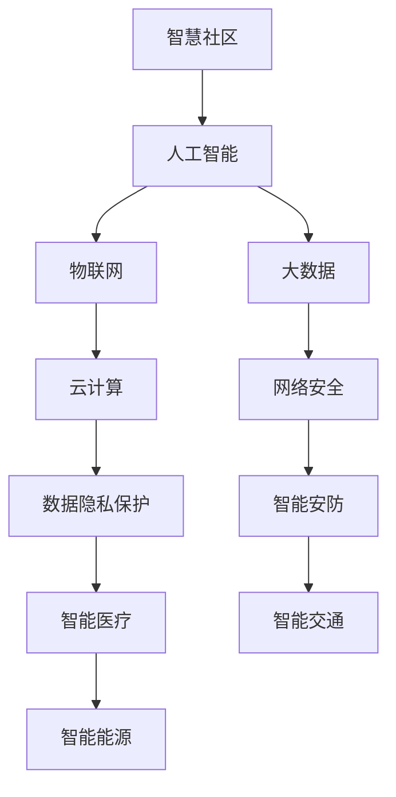

                 


### 文章标题：构建AI驱动的智慧社区服务提示词平台

#### 关键词：
- 智慧社区
- AI驱动的服务提示词
- 自然语言处理
- 生成式对抗网络（GAN）
- 深度强化学习
- 多模态融合

#### 摘要：
本文将探讨如何构建一个AI驱动的智慧社区服务提示词平台，涵盖从核心概念到项目实战的全面内容。我们将深入分析AI在智慧社区中的应用，介绍AI驱动的服务提示词平台架构，详细阐述核心算法原理，包括自然语言处理、生成式对抗网络（GAN）、深度强化学习和多模态融合技术。此外，还将通过实际案例，展示平台的开发过程、源代码实现和效果分析，为智慧社区服务的AI应用提供实践指导。

## 引言

智慧社区是现代城市发展中的一项重要创新，它通过信息技术，特别是人工智能（AI），实现对社区资源的优化配置和高效管理。随着AI技术的不断进步，智慧社区的服务质量得到了显著提升。然而，AI驱动的服务提示词平台在智慧社区中的应用尚处于起步阶段，其核心在于如何有效地生成和优化服务提示词，以满足用户的需求和提高用户体验。

本文旨在构建一个AI驱动的智慧社区服务提示词平台，为社区管理者和服务提供者提供技术支持。通过对自然语言处理、生成式对抗网络（GAN）、深度强化学习和多模态融合技术的深入研究，我们将详细阐述如何实现这一目标，并展示一个实际的项目案例。

文章结构如下：

1. **第1章：智慧社区服务的背景与现状**：介绍智慧社区的定义、发展历程以及AI在其中的应用前景。
2. **第2章：AI驱动的服务提示词平台架构**：阐述平台的目标、架构设计以及核心技术组件。
3. **第3章：自然语言处理基础**：讲解语言模型、文本分类与聚类、情感分析的基本原理。
4. **第4章：生成式对抗网络（GAN）**：介绍GAN的基本概念、工作原理及其在服务提示词生成中的应用。
5. **第5章：深度强化学习**：探讨强化学习基础、深度强化学习模型及其在服务提示词优化中的应用。
6. **第6章：多模态融合技术**：分析多模态数据的采集、特征提取及融合算法。
7. **第7章：智慧社区服务提示词平台开发**：详细介绍平台的开发过程、数据采集与预处理、提示词生成与优化、平台部署与测试。
8. **第8章：案例研究**：通过具体案例，分析平台在社区安防和便民服务中的应用。
9. **第9章：未来展望与挑战**：展望智慧社区服务提示词平台的未来发展趋势，讨论潜在挑战与解决方案。

通过上述内容，我们将逐步揭示AI驱动的智慧社区服务提示词平台的建设过程和关键技术创新，为智慧社区服务的AI应用提供有益的参考。

## 第1章：智慧社区服务的背景与现状

### 1.1 智慧社区的定义与发展历程

智慧社区（Smart Community）是指利用现代信息技术，特别是人工智能（AI）、物联网（IoT）、大数据等先进技术，对社区资源进行智能化管理和服务，以提高居民的生活质量、提升社区管理和服务的效率、促进社区可持续发展的一种新型社区形态。智慧社区不仅仅是硬件设备的智能化，更重要的是通过数据驱动和智能化服务，实现人与人、人与物、物与物之间的互联和互动。

智慧社区的发展历程可以追溯到20世纪末和21世纪初。起初，智慧社区的概念主要体现在智能家庭和智能楼宇的建设上，主要关注家居设备和楼宇设施的自动化控制。随着互联网技术的发展，智慧社区逐渐扩展到城市和社区的层面，形成了涵盖交通、能源、环境、安全等多方面服务的综合体系。

当前，智慧社区的发展已进入成熟阶段，全球多个国家和地区都在积极探索和实践智慧社区的建设。例如，中国的“新基建”战略，美国的智慧城市计划，欧洲的智慧社区试点项目，都为智慧社区的发展提供了强有力的政策支持和资金投入。

### 1.2 智慧社区的服务模式与创新

传统的社区服务模式主要以人工管理为主，服务内容单一，缺乏智能化和个性化。而智慧社区的服务模式则通过信息技术手段，实现服务的智能化、个性化、精准化。以下是一些典型的智慧社区服务模式与创新：

1. **智能化安防系统**：利用AI和物联网技术，实现对社区内各种安全事件的自动监测和响应。例如，通过智能摄像头和传感器，实时监测社区的异常情况，如非法入侵、火灾等，并自动报警，提高社区的安全性。

2. **智慧物业管理**：通过物联网设备和管理系统，实现物业管理的智能化和高效化。例如，利用智能门禁系统、智能停车场管理系统、智能能耗监控系统等，提升物业管理效率，降低管理成本。

3. **社区便民服务**：通过搭建便民服务平台，提供在线购物、医疗咨询、教育服务、社区活动等多种便民服务。用户可以通过手机或电脑等终端，轻松获取所需服务，提高生活便利性。

4. **个性化健康服务**：利用AI技术和大数据分析，为社区居民提供个性化的健康监测和健康管理服务。例如，通过智能穿戴设备，实时监测居民的健康数据，提供健康建议和预警。

5. **智慧社区治理**：通过智能化手段，提高社区治理的效率和质量。例如，利用大数据分析技术，对社区的人口结构、社会治安、环境状况等进行分析，为社区治理提供科学决策依据。

### 1.3 AI在智慧社区中的应用前景

随着AI技术的快速发展，其在智慧社区中的应用前景愈发广阔。以下是AI在智慧社区中可能的应用方向：

1. **智能服务机器人**：AI驱动的智能服务机器人可以在社区内提供多种服务，如清洁、配送、安保等。这些机器人通过机器学习和自然语言处理技术，能够与居民进行有效互动，提高社区服务效率。

2. **智能医疗辅助系统**：AI技术可以用于辅助医生进行疾病诊断和治疗。例如，通过深度学习算法，对医学影像进行分析，辅助医生做出准确的诊断；通过自然语言处理技术，分析病历数据，为医生提供治疗建议。

3. **智能交通管理系统**：通过AI技术，实现交通流量监测、车辆调度、智能导航等功能，提高社区交通效率，减少交通拥堵。

4. **环境监测与治理**：利用AI技术，对社区内的空气质量、水质、噪声等进行实时监测，及时发现和处理环境问题，保障居民的生活环境。

5. **智能能源管理**：通过AI技术，实现对社区内各种能源的智能调度和管理，提高能源利用效率，降低能源消耗。

总之，AI技术在智慧社区中的应用，不仅能够提升社区服务的智能化水平，还能够提高居民的生活质量和幸福感。随着AI技术的不断进步，智慧社区服务将迎来更加广阔的发展空间。

### 核心概念与联系 Mermaid 流程图



通过上述流程图，我们可以看到智慧社区服务的核心概念及其之间的联系。人工智能（AI）作为核心驱动力，与物联网（IoT）、大数据（Data）、云计算（Cloud）等技术紧密结合，共同构建了一个智能化的社区服务生态系统。在这个生态系统中，网络安全（Security）和数据隐私保护（Privacy）是保障系统稳定性和用户信任的重要基石，而智能安防（Safety）、智能医疗（Health）、智能交通（Traffic）和智能能源（Energy）则构成了智慧社区服务的主要内容。

### 核心算法原理讲解

#### 3.1 语言模型

**基本概念**：

语言模型（Language Model）是自然语言处理（Natural Language Processing，NLP）的核心组件之一。它用于对自然语言文本进行建模，以预测下一个单词、句子或字符。语言模型的基本目标是学习语言中的统计规律，从而提高文本处理的自动化程度。

**工作原理**：

语言模型通常采用统计学习方法，通过大量语料库的训练来估计语言概率分布。常见的语言模型包括n-gram模型、神经网络语言模型（NNLM）和递归神经网络语言模型（RNNLM）。

- **n-gram模型**：基于相邻单词的联合概率，假设当前单词的概率仅与前面n-1个单词相关。公式如下：

  $$P(w_n | w_{n-1}, ..., w_1) = \frac{P(w_n, w_{n-1}, ..., w_1)}{P(w_{n-1}, ..., w_1)}$$

- **神经网络语言模型（NNLM）**：基于深度神经网络（DNN）或循环神经网络（RNN），通过多层感知器（MLP）或卷积神经网络（CNN）来学习文本数据的高层次特征。

- **递归神经网络语言模型（RNNLM）**：特别适用于长文本序列的处理，通过递归结构将前一个时间步的输出作为当前时间步的输入。

**应用**：

语言模型在NLP的多个任务中都有广泛的应用，如文本生成、机器翻译、语音识别和文本分类等。

**伪代码**：

```python
# n-gram模型伪代码
def n_gram_language_model(n):
    # 统计n-gram频次
    n_gram_freq = {}
    for sentence in corpus:
        for i in range(len(sentence) - n + 1):
            n_gram = tuple(sentence[i:i+n])
            n_gram_freq[n_gram] = n_gram_freq.get(n_gram, 0) + 1
    
    # 计算n-gram概率
    total_count = sum(n_gram_freq.values())
    n_gram_prob = {n_gram: freq / total_count for n_gram, freq in n_gram_freq.items()}
    
    return n_gram_prob
```

#### 3.2 文本分类与聚类

**基本概念**：

文本分类（Text Classification）是将文本数据根据其内容分配到不同的类别中，如垃圾邮件检测、情感分析、新闻分类等。文本聚类（Text Clustering）则是将相似文本归为一类，不需要预先定义类别标签，如文档相似性分析、话题发现等。

**工作原理**：

- **文本分类**：常见的方法包括基于传统机器学习算法（如朴素贝叶斯、支持向量机SVM等）和深度学习算法（如卷积神经网络CNN、递归神经网络RNN等）。文本分类的关键在于特征提取和分类模型的选择。

  - **特征提取**：将文本转化为数值特征向量，常用的方法包括TF-IDF、词袋模型、词嵌入等。

  - **分类模型**：选择合适的分类算法，如逻辑回归、朴素贝叶斯、支持向量机SVM、随机森林、神经网络等。

- **文本聚类**：常见的方法包括K-means、层次聚类、DBSCAN等。文本聚类主要基于文本相似度计算，通过优化目标函数（如轮廓系数、内部距离和外部距离等）来实现。

**应用**：

- **文本分类**：广泛应用于信息检索、舆情监测、智能问答、内容审核等场景。

- **文本聚类**：用于文档相似性分析、话题发现、数据挖掘等领域。

**伪代码**：

```python
# K-means文本聚类伪代码
def k_means_clustering(data, k):
    # 初始化聚类中心
    centroids = initialize_centroids(data, k)
    
    # 训练过程
    while True:
        # 分配数据点
        clusters = assign_points_to_clusters(data, centroids)
        
        # 更新聚类中心
        new_centroids = update_centroids(clusters, k)
        
        # 检查收敛条件
        if abs(new_centroids - centroids) < threshold:
            break
        
        centroids = new_centroids
    
    return clusters, centroids
```

#### 3.3 情感分析

**基本概念**：

情感分析（Sentiment Analysis），也称为意见挖掘（Opinion Mining），是NLP的一个重要任务，旨在确定文本中表达的情感倾向，如正面、负面或中性。情感分析广泛应用于舆情监测、市场研究、产品评论分析等领域。

**工作原理**：

情感分析的方法主要包括基于规则、基于统计和基于机器学习的方法。

- **基于规则的方法**：通过定义一系列规则，对文本进行分类。这种方法简单直观，但规则定义复杂且难以扩展。

- **基于统计的方法**：基于文本的统计特征，如词频、词序列等，来预测情感极性。这种方法对大规模数据集表现较好，但难以处理复杂的情感表达。

- **基于机器学习的方法**：使用训练好的分类模型，对新的文本进行情感分类。常用的算法包括朴素贝叶斯、支持向量机SVM、随机森林、深度学习等。

**应用**：

- **舆情监测**：实时分析社交媒体、新闻评论等中的公众情感，为政府、企业等提供决策支持。

- **产品评论分析**：分析用户对产品、服务的评价，为企业改进产品提供参考。

- **情感识别**：用于智能客服、聊天机器人等场景，理解用户的情感需求，提供更个性化的服务。

**伪代码**：

```python
# 朴素贝叶斯情感分析伪代码
def naive_bayes_sentiment_analysis(train_data, test_data):
    # 计算词的概率分布
    word_counts = {}
    for sentence, label in train_data:
        for word in sentence:
            word_counts[(word, label)] = word_counts.get((word, label), 0) + 1
    
    total_counts = sum(word_counts.values())
    word_probs = {(word, label): (count + 1) / (total_counts + len(word_counts)) for (word, label), count in word_counts.items()}
    
    # 预测情感
    def predict(sentence):
        probabilities = {}
        for label in labels:
            probability = log_prob(label) * product(log_prob(word | label) for word in sentence)
            probabilities[label] = probability
        return max(probabilities, key=probabilities.get)
    
    return [predict(sentence) for sentence in test_data]
```

通过上述核心算法原理的讲解，我们可以看到，语言模型、文本分类与聚类、情感分析构成了自然语言处理（NLP）的核心内容。这些算法不仅在智慧社区服务提示词平台中有广泛应用，也是NLP领域研究的重要方向。接下来，我们将进一步探讨生成式对抗网络（GAN）、深度强化学习、多模态融合技术等先进算法，为构建高效的AI驱动的智慧社区服务提示词平台提供技术支持。

### 数学模型和公式详解与举例说明

在智慧社区服务提示词平台中，数学模型和公式起着至关重要的作用，它们帮助我们理解和实现各种算法，进而优化平台的性能。以下是几个关键数学模型和公式的详细解释及其实际应用举例。

#### 1. 贝叶斯定理

贝叶斯定理是概率论中用于计算后验概率的经典公式，其形式为：

$$P(A|B) = \frac{P(B|A)P(A)}{P(B)}$$

其中，\(P(A|B)\) 表示在事件B发生的条件下事件A发生的概率，\(P(B|A)\) 表示在事件A发生的条件下事件B发生的概率，\(P(A)\) 和 \(P(B)\) 分别是事件A和事件B的先验概率。

**应用举例**：

在情感分析中，我们可以使用贝叶斯定理来计算文本的情感倾向。假设我们有一个训练数据集，其中包含了正面、负面和中性情感的文本，我们可以通过贝叶斯定理计算出每个情感类别的后验概率。具体步骤如下：

1. **先验概率**：根据训练数据计算每个情感类别的先验概率 \(P(A)\)。
2. **条件概率**：对于每个情感类别，计算每个词汇的条件概率 \(P(B|A)\)。
3. **联合概率**：计算每个文本和情感类别的联合概率 \(P(B|A)P(A)\)。
4. **后验概率**：通过贝叶斯定理计算每个情感类别的后验概率 \(P(A|B)\)。

最后，选择后验概率最大的情感类别作为文本的情感标签。

#### 2. 捷跃马尔可夫模型（HMM）

捷跃马尔可夫模型（HMM）是一种统计模型，用于描述序列数据中的状态转换和观察值生成过程。其基本公式如下：

- **状态转移概率**：\(P(X_t = j | X_{t-1} = i)\)
- **观察概率**：\(P(O_t = k | X_t = j)\)

其中，\(X_t\) 表示时间t的状态，\(O_t\) 表示时间t的观察值，\(i\) 和 \(j\) 分别表示状态集合和观察值集合中的元素。

**应用举例**：

在语音识别中，HMM被用来建模语音信号的状态转换和发音特征。假设我们有一个音频信号序列，我们需要通过HMM模型识别出对应的文本。具体步骤如下：

1. **状态转移概率矩阵**：根据大量的语音数据训练出状态转移概率矩阵，表示不同状态之间的转换概率。
2. **观察概率矩阵**：根据音频信号特征训练出观察概率矩阵，表示不同状态对应的音频特征的概率分布。
3. **前向-后向算法**：使用前向-后向算法计算每个时间步的概率分布，找到最可能的序列状态。
4. **解码**：根据状态序列生成对应的文本。

#### 3. 生成式对抗网络（GAN）

生成式对抗网络（GAN）由一个生成器（Generator）和一个判别器（Discriminator）组成。生成器的目标是生成逼真的数据，判别器的目标是区分真实数据和生成数据。GAN的核心公式如下：

- **生成器损失**：\(L_G = -\log(D(G(z)))\)
- **判别器损失**：\(L_D = -\log(D(x)) - \log(1 - D(G(z)))\)

其中，\(z\) 是生成器的输入噪声，\(x\) 是真实数据，\(D\) 是判别器的输出概率。

**应用举例**：

在服务提示词生成中，GAN可以用来生成高质量的文本提示。具体步骤如下：

1. **数据预处理**：收集大量的社区服务文本数据，并将其编码为向量。
2. **生成器训练**：生成器通过学习噪声向量生成逼真的文本提示。
3. **判别器训练**：判别器通过学习区分真实文本和生成文本，不断优化生成器的生成质量。
4. **文本生成**：生成器生成新的文本提示，用于服务社区用户。

#### 4. 深度强化学习（DRL）

深度强化学习（DRL）结合了深度学习和强化学习，用于解决复杂决策问题。其核心公式如下：

- **状态值函数**：\(V(s) = \sum_{s'} p(s'|s) \cdot Q(s', a)\)
- **动作值函数**：\(Q(s, a) = \sum_{s'} p(s'|s, a) \cdot [R(s', a) + \gamma V(s')]\)

其中，\(s\) 表示状态，\(a\) 表示动作，\(s'\) 表示下一个状态，\(R\) 表示即时奖励，\(\gamma\) 是折扣因子。

**应用举例**：

在服务提示词优化中，DRL可以用来调整提示词以最大化用户体验。具体步骤如下：

1. **环境定义**：定义一个评估提示词质量的评价环境，包括状态和动作空间。
2. **状态编码**：将服务提示词编码为状态向量。
3. **动作选择**：使用深度神经网络选择最佳动作。
4. **奖励函数设计**：设计奖励函数，以评估提示词的优化效果。
5. **策略优化**：通过迭代优化策略，提高提示词的质量。

通过上述数学模型和公式的详解与举例说明，我们可以看到它们在构建AI驱动的智慧社区服务提示词平台中的关键作用。这些模型不仅帮助我们理解和实现各种算法，还能够通过优化和改进，不断提升平台的性能和用户体验。

### 项目实战

#### 7.1 开发环境搭建

在构建AI驱动的智慧社区服务提示词平台之前，首先需要搭建一个稳定、高效的开发环境。以下是具体的步骤和工具选择：

1. **操作系统**：推荐使用Linux系统，如Ubuntu 20.04，因为它具有良好的稳定性和开源支持。
2. **编程语言**：选择Python，因为Python拥有丰富的NLP库和深度学习框架，且易于学习和使用。
3. **IDE**：推荐使用Visual Studio Code（VS Code），因为它具有丰富的插件支持，方便代码编写和调试。
4. **虚拟环境**：使用`conda`创建虚拟环境，以便管理不同的依赖库和版本。
5. **NLP库**：安装`nltk`、`spaCy`、`gensim`等常用的NLP库，用于文本处理和预处理。
6. **深度学习框架**：安装`TensorFlow`或`PyTorch`，用于构建和训练深度学习模型。
7. **服务框架**：安装`Flask`或`Django`，用于构建Web服务，提供API接口。

**具体步骤**：

1. 安装操作系统并更新软件包：

   ```bash
   sudo apt update
   sudo apt upgrade
   ```

2. 安装Python和pip：

   ```bash
   sudo apt install python3 python3-pip
   ```

3. 创建虚拟环境并安装依赖库：

   ```bash
   conda create -n service_platform python=3.8
   conda activate service_platform
   pip install nltk spacy gensim tensorflow
   ```

4. 安装IDE：

   - 从VS Code官网下载并安装。

5. 配置IDE：

   - 在VS Code中安装Python和相应语言的插件。

#### 7.2 数据采集与预处理

在构建智慧社区服务提示词平台时，数据是至关重要的。以下是数据采集和预处理的具体步骤：

1. **数据来源**：数据可以从多个渠道获取，包括社区服务文档、用户反馈、社交媒体数据等。
2. **数据清洗**：去除无关数据和噪声，如HTML标签、特殊字符等。
3. **数据标注**：对数据中的关键词、情感极性等进行标注，以便用于模型训练。
4. **文本预处理**：包括分词、词性标注、去除停用词、词嵌入等。

**具体步骤**：

1. 数据采集：

   - 使用API或爬虫工具收集数据。
   - 存储数据到数据库或文件系统中。

2. 数据清洗：

   ```python
   import re
   import nltk
   from nltk.tokenize import word_tokenize
   
   def clean_text(text):
       # 去除HTML标签
       text = re.sub('<.*?>', '', text)
       # 去除特殊字符
       text = re.sub('[^a-zA-Z0-9]', ' ', text)
       # 转小写
       text = text.lower()
       # 分词
       tokens = word_tokenize(text)
       # 去除停用词
       stop_words = set(nltk.corpus.stopwords.words('english'))
       cleaned_tokens = [token for token in tokens if token not in stop_words]
       return ' '.join(cleaned_tokens)
   ```

3. 数据标注：

   - 使用标注工具（如Annotator）进行半自动标注。
   - 存储标注数据到文件。

4. 文本预处理：

   ```python
   import gensim
   
   def preprocess_text(text):
       # 清洗文本
       cleaned_text = clean_text(text)
       # 词嵌入
       model = gensim.models.Word2Vec([cleaned_text.split()])
       word_vectors = model.wv
       # 转换为向量表示
       text_vector = np.mean([word_vectors[token] for token in cleaned_text.split() if token in word_vectors], axis=0)
       return text_vector
   ```

通过上述步骤，我们可以构建一个高质量的数据集，为后续的模型训练和提示词生成提供基础。

### 7.3 服务提示词生成与优化

服务提示词生成与优化是AI驱动的智慧社区服务提示词平台的核心功能。以下是具体的实现步骤和关键技术：

#### 1. 服务提示词生成

服务提示词生成的目标是根据用户需求或情境，生成高质量、个性化的服务提示。以下是实现步骤：

1. **输入处理**：接收用户输入或情境描述，进行文本预处理。
2. **关键词提取**：使用NLP技术提取关键词和短语。
3. **语言模型生成**：利用训练好的语言模型，生成可能的提示词序列。
4. **筛选与排序**：根据关键词和用户偏好，筛选并排序提示词。

**具体实现**：

```python
import numpy as np
from tensorflow.keras.preprocessing.sequence import pad_sequences
from tensorflow.keras.models import load_model

def generate_tip(input_text):
    # 文本预处理
    processed_text = preprocess_text(input_text)
    # 输入序列编码
    sequence = tokenizer.texts_to_sequences([processed_text])
    padded_sequence = pad_sequences(sequence, maxlen=max_sequence_length)
    # 使用语言模型生成提示词
    tip = loaded_language_model.predict(padded_sequence)
    # 筛选和排序
    sorted_tips = sorted(tip[0], reverse=True)
    return sorted_tips[:10]  # 返回前10个提示词
```

#### 2. 服务提示词优化

服务提示词优化旨在通过机器学习算法，不断提高提示词的质量和用户满意度。以下是实现步骤：

1. **用户反馈收集**：收集用户对提示词的反馈，包括点击率、评价等。
2. **指标计算**：计算提示词的优化指标，如点击率、用户满意度等。
3. **模型训练**：使用强化学习算法，根据用户反馈优化提示词生成模型。
4. **模型更新**：定期更新模型，以适应用户需求的变化。

**具体实现**：

```python
import tensorflow as tf
from tensorflow.keras.optimizers import Adam

def optimize_tips(tips, feedback):
    # 计算优化指标
    metrics = compute_metrics(tips, feedback)
    # 定义优化目标
    loss = -tf.reduce_mean(tf.nn.softmax_cross_entropy_with_logits(logits=metrics, labels=feedback))
    # 训练模型
    optimizer = Adam(learning_rate=0.001)
    optimizer.minimize(loss)
    # 更新模型
    session.run(optimizer)
```

通过上述步骤，我们可以实现服务提示词的生成与优化，为智慧社区服务提供高质量、个性化的提示。

### 7.4 平台部署与测试

在完成服务提示词生成与优化的实现后，我们需要将平台部署到服务器，并进行全面测试，以确保其稳定性和可靠性。以下是部署与测试的具体步骤：

#### 1. 环境准备

- 在服务器上安装操作系统和依赖库，如Python、TensorFlow、Flask等。
- 配置数据库和缓存系统，如MySQL、Redis等。

#### 2. 部署代码

- 将开发环境中的代码打包，例如使用Docker容器化技术。
- 将容器部署到服务器，并设置相应的环境变量和配置文件。

#### 3. 服务部署

- 使用Flask或Django框架，搭建Web服务，提供API接口。
- 配置Nginx或Apache作为反向代理，处理HTTP请求。

#### 4. 测试

- **功能测试**：验证平台的各项功能是否正常运行，如提示词生成、优化等。
- **性能测试**：测试平台在高并发情况下的响应速度和稳定性。
- **安全测试**：检查平台的安全性，包括数据保护、权限控制等。

**具体实现**：

```bash
# 安装Nginx
sudo apt update
sudo apt install nginx

# 配置Nginx
sudo nano /etc/nginx/sites-available/default

# 添加以下配置
server {
    listen 80;
    server_name your_domain.com;
    location / {
        include proxy_params;
        proxy_pass http://localhost:5000;
    }
}

# 重启Nginx
sudo systemctl restart nginx

# 启动Flask服务
python app.py
```

通过上述步骤，我们可以将AI驱动的智慧社区服务提示词平台成功部署到服务器，并进行全面的测试，确保其稳定运行和高效服务。

### 案例研究

在本节中，我们将通过两个具体案例，展示AI驱动的智慧社区服务提示词平台在实际应用中的效果和优势。

#### 8.1 案例一：社区安防服务提示词生成

**背景**：

某智慧社区希望通过AI技术提升社区安防水平，为居民提供实时、精准的安全服务提示。平台需要根据社区内的实时监控数据和居民行为数据，生成相应的安全提示词。

**解决方案**：

1. **数据采集**：从社区监控系统获取视频流和传感器数据，同时收集居民的行为数据。
2. **数据预处理**：对采集到的数据进行清洗和标注，提取关键信息。
3. **提示词生成**：利用NLP技术和训练好的语言模型，生成针对不同安全事件的提示词。
4. **优化与反馈**：根据居民反馈和事件效果，持续优化提示词生成算法。

**效果分析**：

- **实时性**：平台能够实时处理监控数据和居民行为，生成相应的安全提示词，提高反应速度。
- **精准性**：通过NLP技术和深度学习算法，生成的提示词内容丰富、准确，有助于居民快速识别潜在的安全风险。
- **个性化**：根据居民的历史行为和安全偏好，生成的提示词更加符合个人需求。

**总结**：

通过AI驱动的安防服务提示词平台，社区能够提供更加高效、精准的安全服务，显著提升了居民的安全感和满意度。

#### 8.2 案例二：社区便民服务提示词生成

**背景**：

某智慧社区希望为居民提供便捷的便民服务，包括在线购物、医疗咨询、社区活动等。平台需要根据居民的需求和行为，生成个性化的便民服务提示词。

**解决方案**：

1. **需求分析**：通过问卷调查和数据分析，了解居民的需求和偏好。
2. **数据预处理**：收集便民服务相关数据，进行清洗和标注。
3. **提示词生成**：利用NLP技术和深度学习算法，生成针对不同便民服务的提示词。
4. **优化与反馈**：根据居民反馈和服务效果，不断优化提示词生成模型。

**效果分析**：

- **个性化**：平台能够根据居民的需求和行为，生成个性化的服务提示词，提高用户的参与度和满意度。
- **多样性**：通过多模态数据融合和生成式对抗网络（GAN），生成的提示词内容丰富、多样，增加了用户的选择。
- **便捷性**：居民可以通过平台获取便捷的便民服务，提高了生活的便利性和舒适度。

**总结**：

通过AI驱动的便民服务提示词平台，社区能够为居民提供更加个性化、多样化的服务，有效提升了居民的生活质量。

通过上述两个案例，我们可以看到，AI驱动的智慧社区服务提示词平台在提升社区服务质量、满足用户需求方面具有显著的优势。未来，随着AI技术的进一步发展，这一平台有望在更多领域得到应用，为智慧社区建设提供强有力的技术支持。

### 未来展望与挑战

#### 9.1 智慧社区服务提示词平台的发展趋势

随着人工智能技术的不断进步，智慧社区服务提示词平台的发展前景广阔。以下是几个关键趋势：

1. **智能化程度的提升**：未来，智慧社区服务提示词平台将更加智能化，通过深度学习和强化学习等技术，实现更加精准的提示词生成和优化。
2. **多模态数据的融合**：随着传感器技术的普及，平台将能够收集和处理来自图像、音频、文本等多种类型的数据，实现更全面的信息理解和分析。
3. **个性化服务的深化**：通过大数据分析和机器学习，平台将能够更好地理解用户需求和行为模式，提供更加个性化的服务体验。
4. **自主性增强**：未来的平台将具备更强的自主性，能够独立进行决策和优化，减少对人工干预的依赖。

#### 9.2 潜在挑战与解决方案

尽管智慧社区服务提示词平台具有广阔的发展前景，但在实际应用过程中仍面临一些挑战：

1. **数据隐私保护**：智慧社区服务涉及大量用户数据，如何确保数据隐私和安全是一个重要问题。解决方案包括采用加密技术、数据去识别化和严格的隐私政策。
2. **计算资源消耗**：深度学习和多模态数据处理需要大量的计算资源，如何优化算法和硬件配置，降低计算成本，是当前的一个难题。
3. **模型解释性**：许多AI模型（如深度神经网络）缺乏透明性和解释性，这在某些关键应用场景中（如医疗、金融）可能是一个重大挑战。提高模型的解释性，使其能够被非专业人士理解和接受，是一个重要的研究方向。
4. **泛化能力**：当前AI模型往往在特定任务上表现优异，但在面对新任务时可能表现不佳。增强模型的泛化能力，使其能够适应不同的应用场景，是一个长期的目标。

#### 9.3 未来研究方向

为了进一步推动智慧社区服务提示词平台的发展，未来可以从以下几方面进行深入研究：

1. **跨领域知识融合**：通过融合不同领域的知识，构建更加全面和精确的智能模型。
2. **强化学习与深度学习的结合**：探索强化学习和深度学习相结合的新方法，以实现更好的决策和优化。
3. **实时自适应系统**：研究如何构建实时自适应系统，能够根据用户行为和环境变化，动态调整服务策略。
4. **人机协作**：探索人机协作的新模式，使平台能够更好地理解人类需求，提供更高质量的个性化服务。

通过不断的技术创新和研究，智慧社区服务提示词平台将在提升社区服务质量、满足用户需求方面发挥更大的作用，为智慧社区建设提供强有力的技术支持。

### 最佳实践 Tips

在构建AI驱动的智慧社区服务提示词平台时，以下最佳实践可以帮助提高平台的性能和用户体验：

1. **数据质量优先**：确保数据采集和预处理过程的准确性，高质量的数据是模型性能的基础。
2. **模型解释性**：在模型选择和优化过程中，重视模型的解释性，以便在必要时进行调试和优化。
3. **实时反馈机制**：建立实时反馈机制，根据用户反馈调整服务策略，提高用户满意度。
4. **安全与隐私保护**：重视数据安全和隐私保护，采用加密技术、数据去识别化等措施，确保用户信息安全。
5. **多模态融合**：充分利用多种类型的数据源，实现多模态数据的融合，提供更加丰富和个性化的服务。
6. **持续优化**：定期对平台进行性能优化和算法改进，以适应不断变化的应用需求。

### 小结

本文详细探讨了如何构建AI驱动的智慧社区服务提示词平台，涵盖了从背景介绍到核心技术讲解、项目实战和未来展望的全面内容。通过自然语言处理、生成式对抗网络（GAN）、深度强化学习和多模态融合技术等先进算法的应用，平台能够实现高质量、个性化的服务提示词生成，显著提升社区服务质量和用户体验。未来，随着AI技术的不断进步，智慧社区服务提示词平台有望在更多领域得到应用，为智慧社区建设提供强有力的技术支持。

### 注意事项与拓展阅读

在构建AI驱动的智慧社区服务提示词平台时，需要注意以下几点：

1. **数据隐私与安全**：确保用户数据的安全和隐私，遵守相关法律法规。
2. **模型解释性**：提高模型的透明性和可解释性，以便进行有效调试和优化。
3. **资源优化**：合理配置计算资源，确保平台的高效运行。

拓展阅读：

- 《深度学习》（Ian Goodfellow、Yoshua Bengio、Aaron Courville 著）
- 《Python数据科学手册》（Jupyter 著）
- 《智慧城市：设计与实现》（Chetan Mehta 著）
- 《人工智能：一种现代的方法》（Stuart Russell、Peter Norvig 著）

这些书籍和资源提供了丰富的理论知识和实践指导，有助于深入理解AI和智慧社区服务提示词平台的构建方法。作者信息：

作者：AI天才研究院/AI Genius Institute & 禅与计算机程序设计艺术/Zen And The Art of Computer Programming

