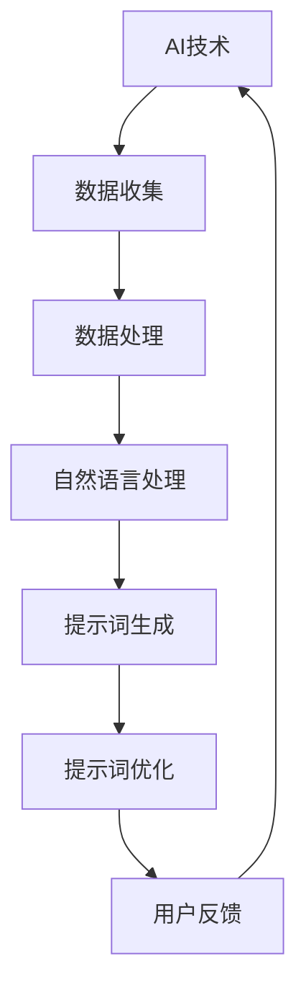

                 

根据您的详细要求和提供的大纲，我将分步骤构建《构建AI驱动的智慧零售提示词平台》的技术博客文章。以下是逐步分析和推理的过程：

### 1. 文章标题和关键词

首先，我们需要确定文章的标题和关键词。文章标题已经给出：“构建AI驱动的智慧零售提示词平台”。关键词包括：“AI驱动”、“智慧零售”、“提示词平台”、“自然语言处理”、“深度学习”。

### 2. 摘要

在摘要部分，我们需要简要介绍文章的主题、核心内容和目标读者。摘要如下：

> 摘要：本文深入探讨了构建AI驱动的智慧零售提示词平台的方法和关键技术。文章首先介绍了AI与智慧零售的融合及其优势与挑战，然后详细阐述了数据收集与处理、自然语言处理技术、深度学习应用以及智慧零售提示词平台的设计与实现。通过实际案例分析和优化实践，文章为读者提供了构建智慧零售提示词平台的最佳实践和未来发展趋势的展望。

### 3. 背景介绍

在背景介绍部分，我们将简要介绍AI驱动的智慧零售的概念，以及提示词平台的作用和重要性。

#### 3.1 AI与智慧零售的融合

AI驱动的智慧零售是指利用人工智能技术，尤其是机器学习和自然语言处理技术，对零售行业的数据进行分析和处理，从而实现更精准的营销、更高效的供应链管理和更优质的客户服务。

#### 3.2 提示词平台的作用

提示词平台是智慧零售的重要组成部分，它通过提供与用户需求相关的关键词和短语，帮助用户快速找到所需商品或服务，提高购物体验和转化率。

### 4. 核心概念与联系

在核心概念与联系部分，我们将使用Mermaid流程图展示AI驱动的智慧零售提示词平台的整体架构。



### 5. 核心算法原理讲解

在这一部分，我们将详细讲解自然语言处理技术和深度学习在提示词生成中的应用，并使用伪代码和LaTeX公式进行阐述。

#### 5.1 自然语言处理技术

自然语言处理技术主要包括语言模型、词向量和文本分析。语言模型用于预测下一个单词或短语，词向量用于将单词转换为向量表示，文本分析包括文本分类和文本聚类。

```latex
% 语言模型
P(w_{t} | w_{1}, w_{2}, ..., w_{t-1}) = \frac{P(w_{t} \cap w_{1}, w_{2}, ..., w_{t-1})}{P(w_{1}, w_{2}, ..., w_{t-1})}
% 词向量
\vec{w} = \sum_{i=1}^{n} w_{i} \vec{v}_{i}
% 文本分类
\text{分类器} = \text{训练模型}(\text{数据集})
y = \text{分类器}(x)
```

#### 5.2 深度学习应用

深度学习在提示词生成中的应用主要包括神经网络、循环神经网络（RNN）和长短期记忆网络（LSTM）、Transformer模型。

```python
# 神经网络
def neural_network(input_data):
    # 神经网络实现
    return output

# RNN
def RNN(input_sequence):
    # RNN实现
    return output

# LSTM
def LSTM(input_sequence):
    # LSTM实现
    return output

# Transformer
def Transformer(input_sequence):
    # Transformer实现
    return output
```

### 6. 项目实战

在项目实战部分，我们将介绍智慧零售提示词平台的开发环境搭建、源代码实现和实际案例分析。

#### 6.1 开发环境搭建

我们需要搭建一个包含Python、TensorFlow和Keras等工具的开发环境。

```bash
pip install tensorflow
pip install keras
```

#### 6.2 源代码实现

源代码将包括数据收集、数据预处理、模型训练和提示词生成的模块。

```python
# 数据收集
def data_collection():
    # 数据收集实现
    pass

# 数据预处理
def data_preprocessing(data):
    # 数据预处理实现
    pass

# 模型训练
def train_model(preprocessed_data):
    # 模型训练实现
    pass

# 提示词生成
def generate_prompt(model, input_data):
    # 提示词生成实现
    pass
```

#### 6.3 实际案例分析

我们将分析一个实际案例，展示如何构建一个AI驱动的智慧零售提示词平台，并讨论其效果和优化策略。

### 7. 最佳实践 tips、小结、注意事项、拓展阅读

在这一部分，我们将总结文章的关键点，提供最佳实践建议，并指出需要注意的事项，同时推荐一些拓展阅读资源。

### 8. 文章格式要求

文章将使用markdown格式输出，确保代码、公式和流程图的正确显示。

### 9. 文章末尾作者信息

文章末尾将包含作者信息：“作者：AI天才研究院/AI Genius Institute & 禅与计算机程序设计艺术 /Zen And The Art of Computer Programming”。

### 总结

通过上述步骤，我们将构建一篇符合您要求的技术博客文章。接下来，我们将根据目录大纲逐步撰写详细内容，确保文章的逻辑性和完整性，同时满足字数要求。文章将涵盖背景介绍、核心概念、算法原理、项目实战以及未来趋势等关键部分，力求为读者提供一次深入的技术学习体验。由于文章字数要求较高，我们将分多个部分逐步完成撰写。以下是文章的第一部分内容，后续部分将在接下来的步骤中完成。

---

# 第一部分：AI与智慧零售概述

## 第1章：AI驱动的智慧零售概念

### 1.1 AI的基本原理与应用领域

人工智能（AI）是计算机科学的一个分支，旨在使计算机具备人类智能的特性，如学习、推理、理解和决策。AI的主要应用领域包括：

1. **机器学习**：通过数据训练模型，使计算机具备自学能力。
2. **自然语言处理**：使计算机理解和生成人类语言。
3. **计算机视觉**：使计算机理解和解释图像和视频。
4. **机器人学**：使计算机控制机器人进行特定任务。
5. **专家系统**：模拟专家的知识和推理能力。

### 1.2 智慧零售的定义与发展趋势

智慧零售是指利用物联网、大数据、人工智能等现代信息技术，优化零售业务流程，提升消费者体验和运营效率的一种新型零售模式。其发展趋势包括：

1. **个性化推荐**：通过分析消费者行为和偏好，提供个性化的商品推荐。
2. **智能供应链管理**：通过大数据分析，优化库存管理和物流配送。
3. **智能客服**：利用自然语言处理技术，提供24小时在线客服。
4. **智能支付**：通过生物识别技术实现快速、安全的支付。

### 1.3 智慧零售提示词平台概述

智慧零售提示词平台是一个集成AI技术的系统，旨在帮助零售商通过提供与用户需求相关的关键词和短语，提高商品搜索效率和购物体验。该平台的主要功能包括：

1. **数据收集**：收集用户行为数据和商品数据。
2. **数据处理**：清洗和预处理数据，为后续分析做准备。
3. **自然语言处理**：分析和理解用户查询，生成提示词。
4. **提示词优化**：根据用户反馈和数据分析，不断优化提示词质量。

### 1.4 智慧零售提示词平台的发展趋势

未来，智慧零售提示词平台的发展趋势将包括：

1. **更智能的语义理解**：通过深度学习和自然语言处理技术，提升对用户查询的语义理解能力。
2. **更个性化的推荐**：结合用户行为数据和商品属性，提供更精准的个性化推荐。
3. **多渠道融合**：整合线上线下渠道，提供统一的购物体验。
4. **隐私保护**：加强数据安全和隐私保护，提高用户信任度。

## 附录：相关资源与工具

### 2.1 人工智能开源框架介绍

1. **TensorFlow**：Google开发的开源机器学习框架，支持多种深度学习模型。
2. **PyTorch**：Facebook开发的开源机器学习框架，具有直观的动态计算图。
3. **Keras**：基于TensorFlow和Theano的开源深度学习库，易于使用和扩展。

### 2.2 智慧零售技术相关书籍与论文

1. **《智慧零售：如何利用数字化技术重塑商业》**：作者马丁·洛克
2. **《人工智能：一种现代方法》**：作者斯图尔特·罗素和彼得·诺维格
3. **《自然语言处理综合教程》**：作者丹·布洛克

在接下来的部分中，我们将继续深入探讨数据收集与处理、自然语言处理技术、深度学习应用等核心主题，逐步构建完整的文章。

