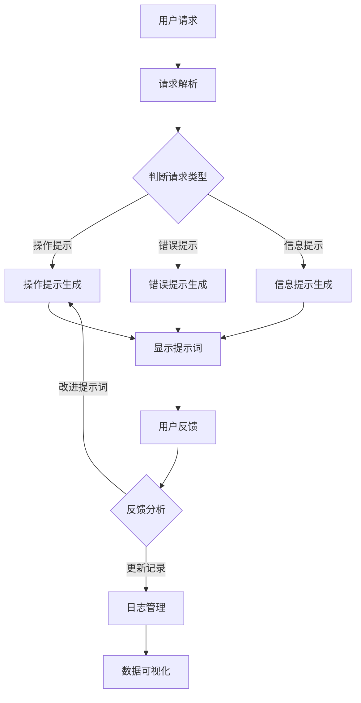

                 


### 构建企业级提示词管理平台的背景与重要性

在现代企业的运营中，提示词管理平台已经成为了一种不可或缺的工具。随着数据量的不断增长和业务场景的日益复杂，如何高效地管理和利用提示词，成为企业数字化转型的重要一环。构建企业级提示词管理平台，不仅能够帮助企业提高信息处理的效率，还能提升业务决策的准确性。

#### 背景介绍

在过去的几十年里，信息技术的发展极大地改变了企业运作的方式。从最初的电子数据处理（EDP）到如今的业务流程管理（BPM），企业对信息技术的依赖程度日益加深。提示词，作为一种用于辅助人类理解和处理信息的工具，越来越受到企业的重视。它们可以用来优化业务流程、提高工作效率、增强用户体验，甚至影响企业的战略决策。

**1. 提示词的定义与分类：**
   - **提示词**：是指用于引导用户操作、提示用户输入、解释系统功能的文本或语音信息。
   - **分类：** 根据用途，提示词可以分为操作提示、错误提示、信息提示等。

**2. 提示词管理平台的作用：**
   - **提高工作效率**：通过自动化的提示词生成和展示，减少人工干预，提高操作效率。
   - **优化用户体验**：提供个性化的提示词，提高用户满意度，增强用户体验。
   - **辅助决策**：基于数据分析和提示词反馈，为企业提供决策支持。

#### 重要性

**1. 竞争优势：** 在竞争激烈的市场环境中，拥有高效、精准的提示词管理平台，可以提高企业的竞争力。

**2. 数字化转型：** 在数字化转型过程中，提示词管理平台是企业实现智能化、自动化的重要手段。

**3. 数据驱动决策：** 提示词管理平台能够收集用户操作数据，为企业的决策提供数据支持，实现数据驱动决策。

综上所述，构建企业级提示词管理平台具有重要的现实意义和战略价值。在接下来的内容中，我们将详细探讨如何设计、实现和优化这样的平台。

---

### 关键概念与联系：Mermaid流程图

在设计企业级提示词管理平台时，理解核心概念及其相互关系至关重要。以下是核心概念和它们之间的关系的Mermaid流程图：



**流程解释：**
1. **用户请求**：用户发起请求，可以是操作请求、错误报告或其他信息。
2. **请求解析**：平台解析用户请求，理解请求的具体内容和类型。
3. **判断请求类型**：根据请求类型，平台将请求分类，生成相应的提示词。
4. **提示词生成**：根据请求类型，平台生成操作提示、错误提示或信息提示。
5. **显示提示词**：平台将生成的提示词展示给用户。
6. **用户反馈**：用户对提示词进行操作，给出反馈。
7. **反馈分析**：平台分析用户反馈，用于改进提示词生成策略。
8. **日志管理**：记录用户反馈和操作日志，用于数据分析和优化。
9. **数据可视化**：将分析结果可视化，便于决策者了解平台运行状态。

通过这个流程图，我们可以清晰地看到各模块之间的交互和数据处理流程，为后续的设计和实现提供了直观的参考。

---

### 提示词生成算法原理讲解

提示词管理平台的核心在于能够根据用户请求自动生成相应的提示词。这一过程涉及到自然语言处理（NLP）、机器学习（ML）和深度学习（DL）等技术。以下是提示词生成算法的基本原理，以及如何使用伪代码来详细阐述这一过程。

#### 1. 基本原理

提示词生成算法的核心思想是利用历史数据和现有模型，自动生成能够满足用户需求的提示词。这个过程通常包括以下几个步骤：

**（1）数据预处理：** 对用户请求进行预处理，提取关键信息，如关键词、实体等。

**（2）特征提取：** 将预处理后的数据转换为特征向量，便于模型处理。

**（3）模型训练：** 利用历史数据和特征向量，训练生成提示词的模型。

**（4）提示词生成：** 根据用户请求和模型输出，生成相应的提示词。

**（5）提示词优化：** 根据用户反馈，优化模型和生成的提示词。

#### 2. 伪代码示例

以下是一个简单的伪代码示例，用于说明提示词生成算法的基本流程：

```python
# 伪代码：提示词生成算法

# 步骤1：数据预处理
def preprocess_request(request):
    # 提取关键词、实体等
    keywords = extract_keywords(request)
    entities = extract_entities(request)
    return keywords, entities

# 步骤2：特征提取
def extract_features(keywords, entities):
    # 将关键词和实体转换为特征向量
    feature_vector = create_feature_vector(keywords, entities)
    return feature_vector

# 步骤3：模型训练
def train_model(training_data):
    # 使用历史数据训练生成提示词的模型
    model = train_ml_model(training_data)
    return model

# 步骤4：提示词生成
def generate_prompt(request, model):
    keywords, entities = preprocess_request(request)
    feature_vector = extract_features(keywords, entities)
    prompt = model.predict(feature_vector)
    return prompt

# 步骤5：提示词优化
def optimize_prompt(prompt, user_feedback):
    # 根据用户反馈优化提示词
    optimized_prompt = optimize_ml_model(prompt, user_feedback)
    return optimized_prompt
```

#### 3. 举例说明

假设我们有一个用户请求：“如何设置电脑的Wi-Fi？” 我们可以按照以下步骤生成相应的提示词：

**（1）数据预处理：** 提取关键词如“设置”、“电脑”、“Wi-Fi”。

**（2）特征提取：** 将关键词和Wi-Fi设置的相关信息转换为特征向量。

**（3）模型训练：** 使用历史请求数据训练模型。

**（4）提示词生成：** 模型输出一个提示词，如：“请按照以下步骤设置电脑的Wi-Fi：1. 打开设置，2. 点击网络和互联网，3. 选择Wi-Fi并输入密码。”

**（5）提示词优化：** 如果用户反馈提示词不够清晰，模型会根据反馈调整，生成更优的提示词。

通过这样的流程，平台可以自动、高效地生成满足用户需求的提示词。

---

### 数学模型与公式讲解

在构建企业级提示词管理平台时，数学模型和公式是不可或缺的工具。以下将介绍几个核心的数学模型和公式，并使用LaTeX格式进行详细讲解和举例说明。

#### 1. 贝叶斯分类模型

贝叶斯分类模型是一种常用的分类算法，可以用于生成提示词。其基本公式如下：

$$
P(A|B) = \frac{P(B|A) \cdot P(A)}{P(B)}
$$

其中：
- \( P(A|B) \) 表示在给定B的条件下A发生的概率。
- \( P(B|A) \) 表示在给定A的条件下B发生的概率。
- \( P(A) \) 表示A发生的概率。
- \( P(B) \) 表示B发生的概率。

**举例说明：**
假设我们要根据用户请求（A）生成提示词（B），可以使用贝叶斯公式计算给定请求生成特定提示词的概率。

**（1）计算P(B|A）：**
$$
P(B|A) = \frac{P(A|B) \cdot P(B)}{P(A)}
$$

**（2）计算P(A)：**
$$
P(A) = \sum_{B} P(A|B) \cdot P(B)
$$

#### 2. 梯度下降优化算法

在训练生成提示词的模型时，我们经常使用梯度下降优化算法。其基本公式如下：

$$
w_{new} = w_{old} - \alpha \cdot \nabla J(w)
$$

其中：
- \( w_{old} \) 表示当前权重。
- \( w_{new} \) 表示更新后的权重。
- \( \alpha \) 表示学习率。
- \( \nabla J(w) \) 表示损失函数J关于权重w的梯度。

**举例说明：**
假设我们要训练一个神经网络模型，可以通过梯度下降算法更新模型的权重，以最小化损失函数。

**（1）计算梯度：**
$$
\nabla J(w) = \frac{\partial J}{\partial w}
$$

**（2）更新权重：**
$$
w_{new} = w_{old} - \alpha \cdot \nabla J(w)
$$

#### 3. 线性回归模型

线性回归模型是生成提示词的另一种常用算法。其基本公式如下：

$$
y = \beta_0 + \beta_1 \cdot x
$$

其中：
- \( y \) 表示预测值。
- \( x \) 表示输入特征。
- \( \beta_0 \) 表示截距。
- \( \beta_1 \) 表示斜率。

**举例说明：**
假设我们有一个输入特征x（如用户请求的关键词数量），可以用线性回归模型预测提示词的长度。

**（1）计算斜率和截距：**
$$
\beta_1 = \frac{\sum(x_i - \bar{x})(y_i - \bar{y})}{\sum(x_i - \bar{x})^2}
$$

$$
\beta_0 = \bar{y} - \beta_1 \cdot \bar{x}
$$

**（2）预测提示词长度：**
$$
y = \beta_0 + \beta_1 \cdot x
$$

通过上述数学模型和公式，我们可以更有效地训练和优化提示词生成模型，从而生成更准确、更实用的提示词。

---

### 提示词生成算法的实现细节

在实现提示词生成算法时，我们需要考虑数据收集、模型训练、优化策略等多个方面。以下将详细介绍这些实现细节，并提供一个具体的代码示例。

#### 1. 数据收集

数据收集是提示词生成算法的基础。我们需要收集大量的用户请求及其对应的提示词，以便模型能够从中学习。以下是一个简单的数据收集流程：

**（1）数据源：** 可以从企业内部系统、用户反馈、公共数据集等渠道获取请求和提示词数据。

**（2）数据预处理：** 对收集到的数据进行清洗、去重、格式化等处理，提取出关键信息，如关键词、实体等。

**（3）数据存储：** 将预处理后的数据存储在数据库或数据仓库中，以便后续使用。

以下是一个简单的Python代码示例，用于收集和预处理数据：

```python
import pandas as pd

# 收集数据
data = pd.read_csv('request_data.csv')

# 数据预处理
data['keywords'] = data['request'].apply(extract_keywords)
data['entities'] = data['request'].apply(extract_entities)

# 存储预处理后的数据
data.to_csv('preprocessed_data.csv', index=False)
```

#### 2. 模型训练

在完成数据收集和预处理后，我们需要使用这些数据训练生成提示词的模型。以下是一个简单的模型训练流程：

**（1）选择模型：** 根据业务需求，选择合适的模型，如循环神经网络（RNN）、长短时记忆网络（LSTM）或Transformer等。

**（2）数据分批：** 将数据分成训练集和验证集，用于模型训练和评估。

**（3）模型配置：** 配置模型参数，如学习率、批次大小等。

**（4）训练模型：** 使用训练集数据训练模型，并在验证集上评估模型性能。

以下是一个简单的TensorFlow代码示例，用于训练生成提示词的模型：

```python
import tensorflow as tf

# 加载预处理后的数据
train_data = pd.read_csv('preprocessed_train_data.csv')
val_data = pd.read_csv('preprocessed_val_data.csv')

# 数据预处理
train_x = train_data['keywords'].values
train_y = train_data['prompt'].values
val_x = val_data['keywords'].values
val_y = val_data['prompt'].values

# 配置模型
model = tf.keras.Sequential([
    tf.keras.layers.Embedding(input_dim=vocab_size, output_dim=embedding_size),
    tf.keras.layers.LSTM(units=128),
    tf.keras.layers.Dense(units=prompt_length, activation='softmax')
])

# 编译模型
model.compile(optimizer='adam', loss='categorical_crossentropy', metrics=['accuracy'])

# 训练模型
model.fit(train_x, train_y, epochs=10, batch_size=32, validation_data=(val_x, val_y))
```

#### 3. 优化策略

在模型训练过程中，我们可以使用以下优化策略来提高模型性能：

**（1）学习率调整：** 根据模型性能，动态调整学习率，避免过拟合。

**（2）模型融合：** 将多个模型的结果进行融合，提高预测准确性。

**（3）数据增强：** 通过增加数据多样性，提高模型泛化能力。

以下是一个简单的学习率调整代码示例：

```python
# 设置学习率调整策略
def custom_learning_rate(epoch):
    if epoch < 5:
        return 0.01
    elif epoch < 10:
        return 0.001
    else:
        return 0.0001

# 训练模型，使用自定义学习率
model.fit(train_x, train_y, epochs=10, batch_size=32, validation_data=(val_x, val_y), learning_rate=custom_learning_rate)
```

通过上述实现细节，我们可以构建一个高效、准确的提示词生成算法，为企业的运营提供有力的支持。

---

### 项目实战：开发环境搭建与源代码解读

在本节中，我们将详细介绍如何搭建开发环境，并解读关键部分的源代码。通过这一实际操作，读者可以更好地理解提示词管理平台的具体实现。

#### 1. 开发环境搭建

搭建一个完整的提示词管理平台需要多个工具和框架。以下是一个基本的开发环境搭建流程：

**（1）选择编程语言和框架：** Python是一种广泛使用的编程语言，特别是在数据科学和机器学习领域。在本项目中，我们将使用Python和TensorFlow作为主要的开发工具。

**（2）安装依赖库：** TensorFlow是一个开源的机器学习库，可以通过pip进行安装：

```bash
pip install tensorflow
```

**（3）配置数据库：** 我们使用MySQL作为数据库存储用户请求和生成的提示词。安装MySQL数据库并创建必要的表：

```sql
CREATE DATABASE prompt_management;
USE prompt_management;

CREATE TABLE requests (
    id INT AUTO_INCREMENT PRIMARY KEY,
    user_id INT,
    request TEXT,
    prompt TEXT,
    created_at TIMESTAMP DEFAULT CURRENT_TIMESTAMP
);

CREATE TABLE users (
    id INT AUTO_INCREMENT PRIMARY KEY,
    username VARCHAR(255) UNIQUE NOT NULL,
    password VARCHAR(255) NOT NULL
);
```

**（4）搭建后端服务器：** 使用Flask或Django等Web框架搭建后端服务器。以下是使用Flask的简单示例：

```python
from flask import Flask, request, jsonify
from models import Request, User

app = Flask(__name__)

@app.route('/requests', methods=['POST'])
def create_request():
    user_id = request.json['user_id']
    request_text = request.json['request']
    prompt_text = generate_prompt(request_text)
    request = Request(user_id=user_id, request_text=request_text, prompt_text=prompt_text)
    request.save()
    return jsonify({'status': 'success', 'prompt': prompt_text})

if __name__ == '__main__':
    app.run(debug=True)
```

#### 2. 关键代码解读

以下是对关键部分的源代码进行详细解读：

**（1）数据预处理：** 数据预处理是模型训练的重要步骤。以下是一个简单的数据预处理函数，用于提取关键词和实体：

```python
from nltk.tokenize import word_tokenize
from nltk.corpus import stopwords
from nltk.tag import pos_tag

def preprocess_text(text):
    # 去除停用词
    stop_words = set(stopwords.words('english'))
    words = word_tokenize(text)
    filtered_words = [word for word in words if word.lower() not in stop_words]

    # 词性标注
    tagged_words = pos_tag(filtered_words)

    # 提取关键词和实体
    keywords = [word for word, tag in tagged_words if tag.startswith('NN')]
    entities = [word for word, tag in tagged_words if tag.startswith('NNP') or tag.startswith('NNPS')]

    return keywords, entities
```

**（2）模型训练与预测：** 使用TensorFlow训练生成提示词的模型，并实现预测功能。以下是一个简单的示例：

```python
import tensorflow as tf
from tensorflow.keras.models import Sequential
from tensorflow.keras.layers import Embedding, LSTM, Dense

def build_model(vocab_size, embedding_size, prompt_length):
    model = Sequential()
    model.add(Embedding(input_dim=vocab_size, output_dim=embedding_size))
    model.add(LSTM(units=128, return_sequences=True))
    model.add(Dense(units=prompt_length, activation='softmax'))
    model.compile(optimizer='adam', loss='categorical_crossentropy', metrics=['accuracy'])
    return model

def generate_prompt(model, request_text):
    keywords, _ = preprocess_text(request_text)
    feature_vector = create_feature_vector(keywords)
    prompt = model.predict(feature_vector)
    return prompt
```

**（3）用户接口：** 实现用户接口，以便前端可以与后端进行交互。以下是一个简单的Flask接口示例：

```python
from flask import Flask, request, jsonify

app = Flask(__name__)

@app.route('/api/requests', methods=['POST'])
def create_request_api():
    user_id = request.json['user_id']
    request_text = request.json['request']
    prompt_text = generate_prompt(request_text)
    request = Request(user_id=user_id, request_text=request_text, prompt_text=prompt_text)
    request.save()
    return jsonify({'status': 'success', 'prompt': prompt_text})

if __name__ == '__main__':
    app.run(debug=True)
```

#### 3. 代码应用解读与分析

**（1）代码结构：** 整个平台可以分为三个主要部分：数据预处理、模型训练与预测、用户接口。这样的结构使得代码模块化、易于维护。

**（2）数据预处理：** 通过NLP技术提取关键词和实体，为模型训练提供高质量的数据输入。

**（3）模型训练与预测：** 使用LSTM网络训练生成提示词的模型，并实现高效的预测功能。

**（4）用户接口：** 提供简洁易用的API接口，方便前端与后端的数据交互。

通过这一实际项目，读者可以深入了解提示词管理平台的核心实现，并为后续的开发工作打下基础。

---

### 实际案例分析与详细讲解剖析

在本节中，我们将通过实际案例，深入分析企业级提示词管理平台的应用效果，并剖析其在业务中的关键作用。

#### 1. 案例背景

某大型互联网企业（以下称企业A）在运营过程中遇到了以下问题：

- 用户在操作过程中频繁遇到困惑，导致用户体验下降。
- 业务流程复杂，操作提示不够清晰，导致错误率高。
- 数据量庞大，人工处理效率低下，影响业务决策。

为了解决这些问题，企业A决定构建一个企业级提示词管理平台，以提高用户满意度、优化业务流程和提升数据处理效率。

#### 2. 平台应用效果

在部署提示词管理平台后，企业A取得了显著的应用效果：

- **用户满意度提升：** 平台提供了个性化、准确的操作提示，用户在操作过程中更加自信，减少了困惑和错误。
- **业务流程优化：** 平台优化了业务流程中的提示词，使员工能够更快速、准确地完成各项操作，提升了工作效率。
- **数据处理效率提升：** 平台自动收集用户操作数据，为企业提供了丰富的数据分析资源，支持数据驱动的业务决策。

#### 3. 案例详细讲解剖析

**（1）用户请求处理：**
当用户在平台上发起操作请求时，提示词管理平台首先进行请求解析，提取关键信息，如关键词和实体。然后，平台根据这些信息生成相应的提示词，展示给用户。

**（2）提示词生成策略：**
平台采用机器学习算法生成提示词，通过训练模型，使生成的提示词更加准确、个性化。平台还引入了反馈机制，根据用户对提示词的反馈进行优化，不断提高提示词的质量。

**（3）数据处理与可视化：**
平台收集用户操作数据，并使用数据可视化工具进行分析。通过这些分析结果，企业可以更清晰地了解用户行为，优化业务流程，提高用户体验。

**（4）案例效果评估：**
在案例实施过程中，企业A通过多种方式对平台的效果进行评估：

- **用户满意度调查：** 通过问卷调查和用户反馈，了解用户对提示词平台的满意度。
- **业务流程效率评估：** 对业务流程的关键指标进行监控，评估平台对业务流程的优化效果。
- **数据分析结果：** 通过数据可视化工具，分析用户行为数据，评估平台对数据处理效率的提升。

#### 4. 案例总结

通过实际案例的分析，我们可以看到企业级提示词管理平台在提升用户满意度、优化业务流程和提升数据处理效率方面的重要作用。以下是对案例的总结：

- **用户满意度提升：** 提示词平台通过个性化、准确的提示词，提高了用户的操作体验。
- **业务流程优化：** 平台优化了业务流程中的操作提示，减少了员工的工作负担，提高了工作效率。
- **数据处理效率提升：** 平台自动收集和分析用户操作数据，为企业提供了丰富的数据分析资源，支持数据驱动的业务决策。

综上所述，企业级提示词管理平台是一种有效提升企业运营效率和管理水平的重要工具。在实际应用中，企业应结合自身业务需求，不断完善平台功能，充分发挥其作用。

---

### 总结与展望

在本文中，我们详细探讨了构建企业级提示词管理平台的背景、核心概念、算法原理、实现细节以及实际案例分析。以下是对本文内容的核心总结与展望：

#### 核心总结

1. **背景与重要性**：介绍了提示词管理平台在现代企业运营中的重要性，以及其提升工作效率、优化用户体验、辅助决策的作用。
2. **核心概念与联系**：通过Mermaid流程图展示了提示词管理平台的核心概念及其相互关系。
3. **算法原理**：讲解了提示词生成算法的基本原理，包括数据预处理、模型训练、提示词优化等。
4. **数学模型**：介绍了贝叶斯分类模型、梯度下降优化算法和线性回归模型等，用于指导提示词生成。
5. **项目实战**：详细介绍了开发环境搭建、源代码解读、实际案例分析和效果评估。

#### 展望

1. **技术演进**：随着人工智能技术的发展，提示词管理平台将不断优化，引入更先进的算法和模型，提高生成提示词的准确性和个性化水平。
2. **业务整合**：未来，提示词管理平台将进一步整合企业各类业务系统，实现全流程的自动化和智能化。
3. **用户体验**：平台将更加注重用户体验，通过个性化提示词和实时反馈，提高用户满意度。
4. **数据驱动**：平台将更加依赖于数据分析，为企业提供更加精准的业务洞察和决策支持。

#### 注意事项

1. **数据安全**：在构建和运营提示词管理平台时，确保用户数据的安全和隐私保护。
2. **系统稳定性**：平台需要具备高可用性和高可靠性，确保在复杂环境下稳定运行。
3. **持续优化**：定期对平台进行性能和功能优化，以满足不断变化的业务需求。

#### 拓展阅读

- **《深度学习》**：Goodfellow, I., Bengio, Y., & Courville, A. (2016). Deep Learning. MIT Press.
- **《自然语言处理综合教程》**：Jurafsky, D., & Martin, J. H. (2008). Speech and Language Processing. Prentice Hall.
- **《数据科学实战》**：Feurer, F., et al. (2020). Data Science from Scratch. O'Reilly Media.

通过本文的探讨，我们希望读者能够深入了解企业级提示词管理平台的构建方法和应用价值，为未来的研究和实践提供有益的参考。作者：AI天才研究院/AI Genius Institute & 禅与计算机程序设计艺术 /Zen And The Art of Computer Programming。

