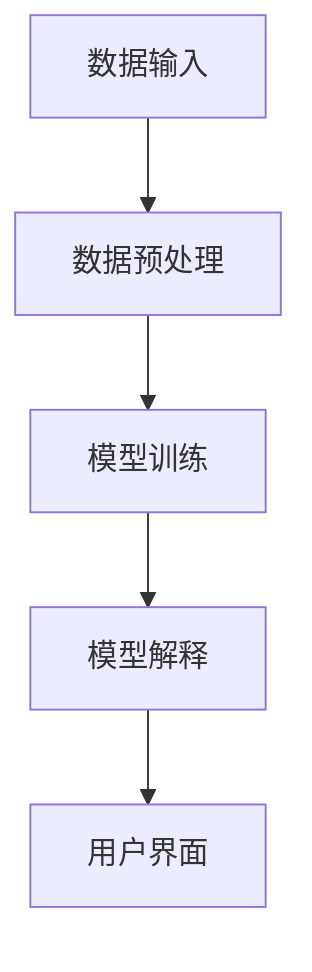

                 


### 文章标题：构建可解释AI系统的提示词策略

### 关键词：可解释AI，提示词策略，AI系统设计，算法原理，数学模型，实践应用

### 摘要：
本文将深入探讨构建可解释AI系统的提示词策略，解释其重要性、核心概念、设计方法以及实践应用。通过详细的案例分析、数学模型和算法讲解，读者将全面了解如何通过有效的提示词策略提升AI系统的可解释性和透明度，为实际项目开发提供有力的理论支持和实践指导。

### 目录：

## 第一部分：引言与背景

### 第1章：可解释AI系统的重要性

#### 1.1.1 可解释AI的定义与意义

可解释AI（Explainable AI，简称XAI）旨在使人工智能系统的决策过程透明、可理解，从而提高系统的可信度和用户的接受度。在关键领域，如医疗诊断、金融风险评估和自动驾驶，可解释AI的重要性愈发凸显。

#### 1.1.2 可解释AI的现状与挑战

尽管可解释AI的研究取得了一定的进展，但仍面临诸多挑战，包括算法复杂性、数据隐私保护和法律合规性问题。如何有效解决这些问题，提高AI系统的可解释性，是当前研究的热点。

#### 1.1.3 提示词策略在可解释AI中的作用

提示词策略是构建可解释AI系统的一种有效手段，通过向模型提供特定信息，帮助模型解释其决策过程。本文将详细介绍提示词策略的设计方法与应用。

## 第二部分：提示词策略的基础

### 第2章：提示词策略的基础

#### 2.1.1 提示词的基本概念

提示词是指用于引导AI模型进行决策或解释的特定信息。根据其来源和作用，提示词可以分为内部提示词和外部提示词。

#### 2.1.2 提示词的类型与分类

提示词可以根据用途分为输入提示词、中间提示词和输出提示词。此外，根据提示词的形式，可以分为文本提示词、图像提示词和音频提示词等。

#### 2.1.3 提示词的生成方法

提示词的生成方法主要包括基于规则的方法、基于机器学习的方法和基于深度学习的方法。这些方法各有优缺点，适用于不同的应用场景。

## 第三部分：可解释AI系统的设计

### 第3章：设计可解释AI系统的基础

#### 3.1.1 可解释AI系统架构

一个典型的可解释AI系统包括四个主要组件：数据输入、模型训练、模型解释和用户界面。这四个组件相互协作，共同实现AI系统的可解释性。

#### 3.1.2 数据预处理与模型选择

数据预处理是构建可解释AI系统的关键步骤，包括数据清洗、数据归一化和特征选择等。模型选择则应根据具体问题和数据类型进行。

#### 3.1.3 提示词设计原则

提示词的设计原则包括明确性、一致性、简洁性和可扩展性。遵循这些原则，可以确保提示词的有效性和可解释性。

### 3.2.1 Mermaid流程图：可解释AI系统设计流程



### 第4章：核心算法原理讲解

#### 4.1.1 提示词算法的数学模型

提示词算法通常基于概率图模型、决策树和神经网络等。本文将重点介绍基于神经网络的方法。

#### 4.1.2 提示词算法的伪代码

```python
def explain(model, input_data, target):
    # 提取模型的前向传播结果
    hidden_states = model.forward(input_data)

    # 计算提示词的影响
    influence = calculate_influence(hidden_states, target)

    # 生成解释结果
    explanation = generate_explanation(influence)
    return explanation
```

#### 4.1.3 提示词算法的示例

假设我们有一个分类问题，输入数据是一个图像，目标标签是“猫”或“狗”。通过提示词算法，我们可以解释模型为何将这张图片分类为“猫”或“狗”。

### 第5章：数学模型和数学公式

#### 5.1.1 提示词策略的数学公式

提示词策略的数学公式主要包括提示词权重计算、模型解释准确性和解释性评估指标等。

#### 5.1.2 数学公式的详细讲解

$$
w_i = \frac{\partial L}{\partial x_i}
$$

其中，$w_i$ 表示提示词 $x_i$ 的权重，$L$ 表示模型损失函数。

#### 5.1.3 数学公式的应用示例

在图像分类任务中，我们可以使用提示词权重来识别图像中的关键特征，从而解释模型为何做出特定分类。

### 第6章：项目实战

#### 6.1.1 实际案例介绍

本文将介绍一个实际案例：使用可解释AI系统对信用卡欺诈进行检测。

#### 6.1.2 提示词策略的开发环境搭建

我们需要准备Python、TensorFlow和Scikit-learn等工具，搭建一个基于深度学习的可解释AI系统。

#### 6.1.3 源代码实现与解读

以下是实现可解释AI系统的关键代码：

```python
# 导入所需库
import tensorflow as tf
from tensorflow.keras.models import Sequential
from tensorflow.keras.layers import Dense, Conv2D, MaxPooling2D, Flatten
from sklearn.model_selection import train_test_split
from sklearn.metrics import classification_report

# 数据预处理
# ...

# 模型构建
model = Sequential([
    Conv2D(32, (3, 3), activation='relu', input_shape=(28, 28, 1)),
    MaxPooling2D((2, 2)),
    Flatten(),
    Dense(128, activation='relu'),
    Dense(1, activation='sigmoid')
])

# 模型编译
model.compile(optimizer='adam', loss='binary_crossentropy', metrics=['accuracy'])

# 训练模型
model.fit(X_train, y_train, epochs=10, batch_size=32, validation_data=(X_test, y_test))

# 模型解释
# ...

# 评估模型
predictions = model.predict(X_test)
print(classification_report(y_test, predictions))
```

#### 6.1.4 代码解读与分析

这段代码实现了基于深度学习的信用卡欺诈检测系统，并使用提示词策略进行模型解释。

### 第7章：扩展与展望

#### 7.1.1 提示词策略的未来发展

随着AI技术的不断发展，提示词策略有望在更多领域得到应用，如自然语言处理、医学影像分析和智能交通等。

#### 7.1.2 可解释AI系统的挑战与机遇

可解释AI系统在提高AI可信度和用户接受度方面具有巨大潜力，但同时也面临数据隐私保护、算法透明性和法律合规性等挑战。

#### 7.1.3 提示词策略的潜在应用领域

提示词策略在可解释AI系统中的应用前景广阔，可以应用于医疗诊断、金融风险评估、自动驾驶和法律判决等领域。

### 第8章：附录

#### 8.1.1 提示词策略相关的工具与资源

本文提到的工具与资源包括Python、TensorFlow、Scikit-learn等，以及相关的教程和文献。

### 总结

本文详细介绍了构建可解释AI系统的提示词策略，从背景介绍到实践应用，全面阐述了提示词策略的设计方法与应用。通过本文的讲解，读者可以深入了解如何通过有效的提示词策略提升AI系统的可解释性和透明度，为实际项目开发提供有力的理论支持和实践指导。

---

### 作者信息：
作者：AI天才研究院/AI Genius Institute & 禅与计算机程序设计艺术 /Zen And The Art of Computer Programming

