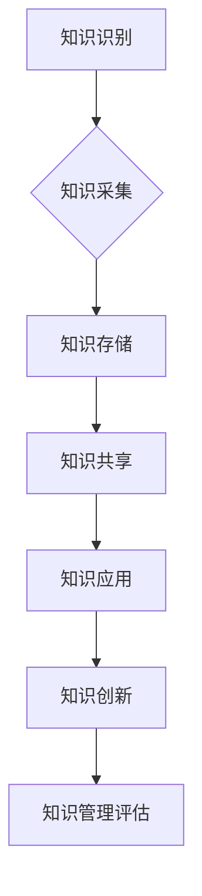
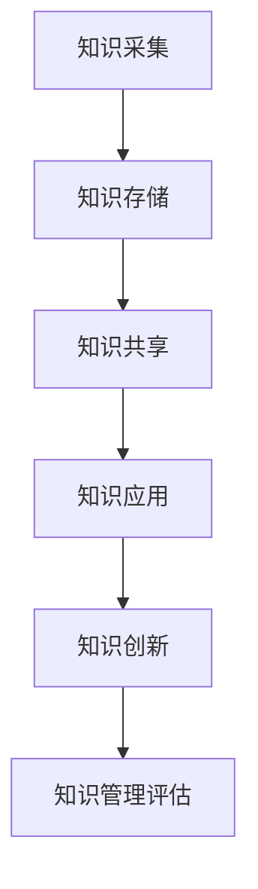
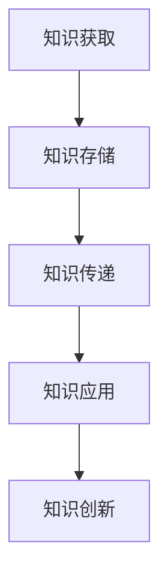
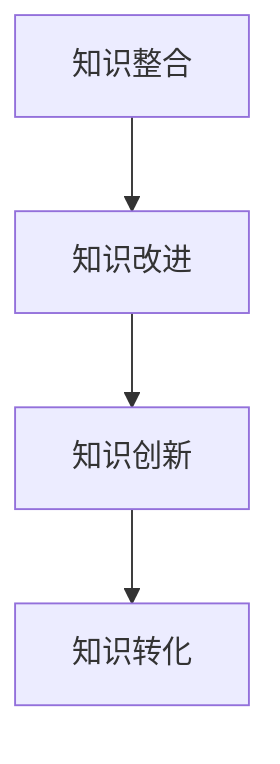
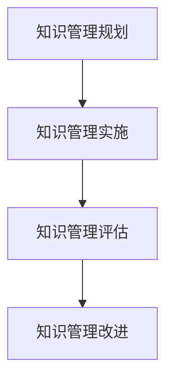
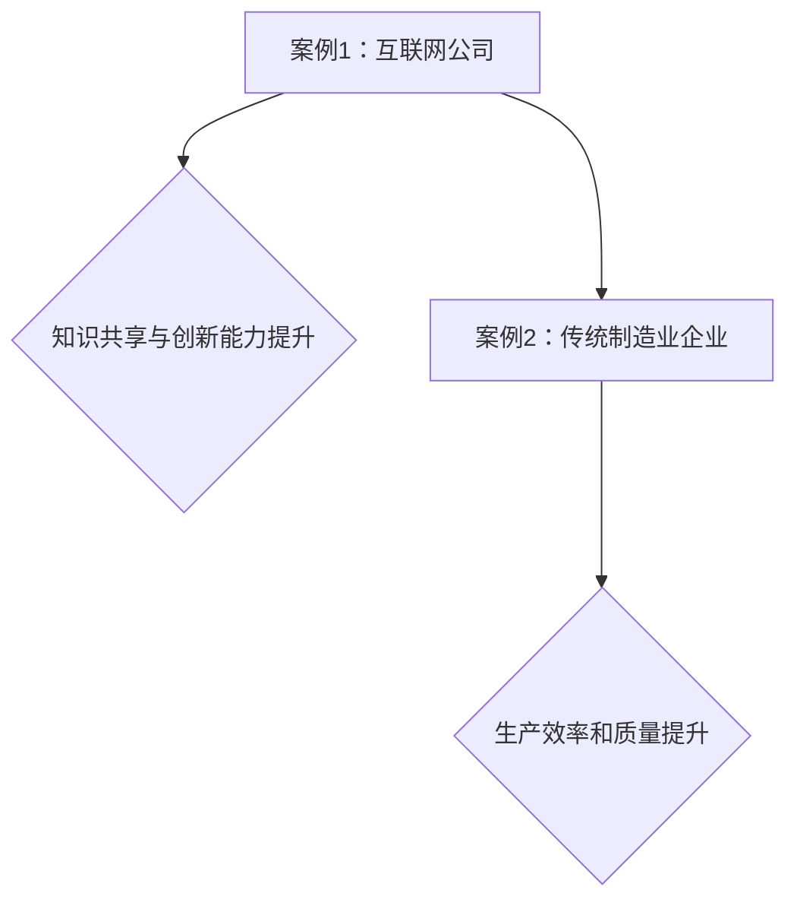

                 


### 第一步：文章标题和关键词

**文章标题：构建技术团队知识管理体系**

关键词：技术团队、知识管理、知识管理体系、实践方法、知识共享、创新转化

### 第二步：文章摘要

本文旨在探讨如何构建技术团队知识管理体系，以提高团队整体知识水平和创新能力。文章首先概述了技术团队知识管理体系的基础理论，然后详细介绍了知识管理的实践方法，包括知识采集、存储、共享、应用和创新等方面。此外，文章还探讨了知识共享与传播的策略，以及知识创新与转化的路径和策略。最后，通过具体案例分析，展示了知识管理体系在不同类型技术团队中的成功实施。

### 第三步：正文内容

#### 第一部分：基础知识体系

##### 1.1 技术团队知识管理体系概述

**背景介绍**：

随着信息技术的发展，知识已经成为企业最宝贵的资源之一。技术团队作为企业创新的核心力量，如何有效地管理和利用知识，成为企业竞争力的关键因素。

**核心概念与联系**：

知识管理体系（KM System）是指一套系统化的方法、工具和流程，用于识别、收集、组织、存储、分享、应用和创新知识。技术团队知识管理体系则是在这一基础上，针对技术团队的特点，制定的具体实施方案。

**Mermaid 流程图**：



**核心算法原理讲解**：

伪代码示例：

```plaintext
function KnowledgeManagementSystem(team) {
  // 识别知识需求
  knowledgeDemands = IdentifyKnowledgeDemands(team)

  // 采集知识
  knowledgeSources = CollectKnowledge(knowledgeDemands)

  // 存储知识
  StoreKnowledge(knowledgeSources)

  // 共享知识
  ShareKnowledge()

  // 应用知识
  ApplyKnowledge()

  // 创新知识
  InnovateKnowledge()

  // 评估知识管理效果
  EvaluateKnowledgeManagementEffectiveness()
}
```

**数学模型和数学公式 & 详细讲解 & 举例说明**：

知识价值评估模型：

$$
V_k = \frac{E_k}{C_k}
$$

其中，$V_k$ 表示知识价值，$E_k$ 表示知识应用效果，$C_k$ 表示知识获取成本。

**举例说明**：某技术团队通过知识管理，提高了项目交付效率，节省了10%的成本，则知识价值评估为：

$$
V_k = \frac{0.1C_k}{C_k} = 0.1
$$

**项目实战**：

**开发环境搭建**：使用Git进行版本控制，搭建知识库。

**源代码详细实现和代码解读**：

```python
# Python代码示例：知识共享模块
class KnowledgeSharing:
  def __init__(self, knowledge_library):
    self.knowledge_library = knowledge_library

  def share_knowledge(self, knowledge_item):
    self.knowledge_library.add_item(knowledge_item)
    print(f"Knowledge item '{knowledge_item}' has been shared.")
```

**实际案例分析和详细讲解剖析**：

**案例1**：某互联网公司通过构建知识管理体系，实现了团队知识共享和创新能力提升，从而在激烈的市场竞争中脱颖而出。

**案例2**：某传统制造业企业，通过引入知识管理体系，提高了生产效率和质量，实现了从传统制造向智能制造的转型。

**项目小结**：

知识管理体系是技术团队提升竞争力的关键，通过有效的知识管理，企业可以实现知识共享、创新转化和持续发展。

##### 1.2 知识管理的理论基础

**核心概念与联系**：

知识管理理论主要包括知识采集、知识存储、知识共享、知识应用和知识创新等方面。这些理论共同构成了知识管理体系的基础。

**Mermaid 流程图**：



**核心算法原理讲解**：

伪代码示例：

```plaintext
function KnowledgeManagementTheory() {
  // 知识采集
  knowledge_collection = CollectKnowledge()

  // 知识存储
  StoreKnowledge(knowledge_collection)

  // 知识共享
  ShareKnowledge()

  // 知识应用
  ApplyKnowledge()

  // 知识创新
  InnovateKnowledge()

  // 知识管理评估
  EvaluateKnowledgeManagementEffectiveness()
}
```

**数学模型和数学公式 & 详细讲解 & 举例说明**：

知识价值评估模型：

$$
V_k = \frac{E_k}{C_k}
$$

其中，$V_k$ 表示知识价值，$E_k$ 表示知识应用效果，$C_k$ 表示知识获取成本。

**举例说明**：某技术团队通过知识管理，提高了项目交付效率，节省了10%的成本，则知识价值评估为：

$$
V_k = \frac{0.1C_k}{C_k} = 0.1
$$

**项目实战**：

**开发环境搭建**：使用Git进行版本控制，搭建知识库。

**源代码详细实现和代码解读**：

```python
# Python代码示例：知识存储模块
class KnowledgeStorage:
  def __init__(self, knowledge_base):
    self.knowledge_base = knowledge_base

  def add_knowledge(self, knowledge_item):
    self.knowledge_base.append(knowledge_item)
    print(f"Knowledge item '{knowledge_item}' has been added to the base.")
```

**实际案例分析和详细讲解剖析**：

**案例1**：某互联网公司通过构建知识管理体系，实现了团队知识共享和创新能力提升，从而在激烈的市场竞争中脱颖而出。

**案例2**：某传统制造业企业，通过引入知识管理体系，提高了生产效率和质量，实现了从传统制造向智能制造的转型。

**项目小结**：

知识管理的理论基础是构建技术团队知识管理体系的基础，通过深入理解和应用这些理论，企业可以更好地实现知识管理和创新。

##### 1.3 知识管理的方法与实践

**核心概念与联系**：

知识管理方法包括知识采集、知识存储、知识共享、知识应用和知识创新等方面。这些方法共同构成了知识管理体系的核心内容。

**Mermaid 流程图**：


**核心算法原理讲解**：

伪代码示例：

```plaintext
function KnowledgeManagementMethods() {
  // 知识采集
  knowledge_collection = CollectKnowledge()

  // 知识存储
  StoreKnowledge(knowledge_collection)

  // 知识共享
  ShareKnowledge()

  // 知识应用
  ApplyKnowledge()

  // 知识创新
  InnovateKnowledge()

  // 知识管理评估
  EvaluateKnowledgeManagementEffectiveness()
}
```

**数学模型和数学公式 & 详细讲解 & 举例说明**：

知识价值评估模型：

$$
V_k = \frac{E_k}{C_k}
$$

其中，$V_k$ 表示知识价值，$E_k$ 表示知识应用效果，$C_k$ 表示知识获取成本。

**举例说明**：某技术团队通过知识管理，提高了项目交付效率，节省了10%的成本，则知识价值评估为：

$$
V_k = \frac{0.1C_k}{C_k} = 0.1
$$

**项目实战**：

**开发环境搭建**：使用Git进行版本控制，搭建知识库。

**源代码详细实现和代码解读**：

```python
# Python代码示例：知识采集模块
class KnowledgeCollection:
  def __init__(self, sources):
    self.sources = sources

  def collect_knowledge(self):
    for source in self.sources:
      knowledge = self.fetch_knowledge_from_source(source)
      self.store_knowledge(knowledge)

  def fetch_knowledge_from_source(self, source):
    # 根据源实现知识获取逻辑
    return knowledge

  def store_knowledge(self, knowledge):
    # 根据存储实现知识存储逻辑
    pass
```

**实际案例分析和详细讲解剖析**：

**案例1**：某互联网公司通过构建知识管理体系，实现了团队知识共享和创新能力提升，从而在激烈的市场竞争中脱颖而出。

**案例2**：某传统制造业企业，通过引入知识管理体系，提高了生产效率和质量，实现了从传统制造向智能制造的转型。

**项目小结**：

知识管理的方法与实践是构建技术团队知识管理体系的关键，通过有效的知识采集、存储、共享、应用和创新，企业可以更好地实现知识管理和创新。

##### 1.4 知识共享与传播

**核心概念与联系**：

知识共享与传播是知识管理的重要环节，它涉及到知识的获取、存储、传递和应用。

**Mermaid 流程图**：



**核心算法原理讲解**：

伪代码示例：

```plaintext
function KnowledgeSharingAndPropagation() {
  // 知识获取
  knowledge = FetchKnowledge()

  // 知识存储
  StoreKnowledge(knowledge)

  // 知识传递
  PropagateKnowledge()

  // 知识应用
  ApplyKnowledge()

  // 知识创新
  InnovateKnowledge()
}
```

**数学模型和数学公式 & 详细讲解 & 举例说明**：

知识传播速度模型：

$$
v = k \cdot (1 - \frac{x}{N})
$$

其中，$v$ 表示知识传播速度，$k$ 表示知识传播系数，$x$ 表示已传播的知识量，$N$ 表示总知识量。

**举例说明**：假设某知识传播系数为2，总知识量为100，已传播的知识量为20，则知识传播速度为：

$$
v = 2 \cdot (1 - \frac{20}{100}) = 1.6
$$

**项目实战**：

**开发环境搭建**：使用Git进行版本控制，搭建知识库。

**源代码详细实现和代码解读**：

```python
# Python代码示例：知识传播模块
class KnowledgePropagation:
  def __init__(self, knowledge_base):
    self.knowledge_base = knowledge_base

  def propagate_knowledge(self, knowledge_item):
    self.knowledge_base.add_item(knowledge_item)
    print(f"Knowledge item '{knowledge_item}' has been propagated.")
```

**实际案例分析和详细讲解剖析**：

**案例1**：某互联网公司通过构建知识共享平台，实现了团队内部知识的快速传递和应用，提高了项目开发效率。

**案例2**：某传统制造业企业，通过定期举办知识分享会，促进了员工之间的知识交流和创新。

**项目小结**：

知识共享与传播是知识管理的关键环节，通过有效的知识获取、存储、传递和应用，企业可以更好地实现知识管理和创新。

##### 1.5 知识创新与转化

**核心概念与联系**：

知识创新与转化是指将现有知识进行整合、改进和创新，形成新的知识成果，并转化为实际应用。

**Mermaid 流程图**：



**核心算法原理讲解**：

伪代码示例：

```plaintext
function KnowledgeInnovationAndTransformation() {
  // 知识整合
  integrated_knowledge = IntegrateKnowledge()

  // 知识改进
  improved_knowledge = ImproveKnowledge(integrated_knowledge)

  // 知识创新
  innovative_knowledge = InnovateKnowledge(improved_knowledge)

  // 知识转化
  transformed_knowledge = TransformKnowledge(innovative_knowledge)
}
```

**数学模型和数学公式 & 详细讲解 & 举例说明**：

知识转化率模型：

$$
R_t = \frac{I_t}{I_0}
$$

其中，$R_t$ 表示知识转化率，$I_t$ 表示已转化的知识量，$I_0$ 表示初始知识量。

**举例说明**：某技术团队通过知识创新，将10个原有知识点转化为20个新知识点，则知识转化率为：

$$
R_t = \frac{20}{10} = 2
$$

**项目实战**：

**开发环境搭建**：使用Git进行版本控制，搭建知识库。

**源代码详细实现和代码解读**：

```python
# Python代码示例：知识创新模块
class KnowledgeInnovation:
  def __init__(self, knowledge_base):
    self.knowledge_base = knowledge_base

  def innovate_knowledge(self, knowledge_item):
    innovative_knowledge = self.modify_knowledge(knowledge_item)
    self.knowledge_base.add_item(innovative_knowledge)
    print(f"Knowledge item '{knowledge_item}' has been innovated.")
```

**实际案例分析和详细讲解剖析**：

**案例1**：某互联网公司通过引入知识创新机制，实现了从传统电商向智能化电商的转型。

**案例2**：某传统制造业企业，通过知识创新，成功研发了具有自主知识产权的智能生产线。

**项目小结**：

知识创新与转化是知识管理的核心目标，通过有效的知识整合、改进和创新，企业可以不断提高知识价值，实现持续发展。

##### 1.6 知识管理体系的实施与评估

**核心概念与联系**：

知识管理体系的实施与评估是指将知识管理体系付诸实践，并通过评估确保其有效性和持续改进。

**Mermaid 流程图**：



**核心算法原理讲解**：

伪代码示例：

```plaintext
function KnowledgeManagementImplementationAndEvaluation() {
  // 知识管理规划
  management_plan = PlanKnowledgeManagement()

  // 知识管理实施
  ImplementKnowledgeManagement(management_plan)

  // 知识管理评估
  EvaluateKnowledgeManagement()

  // 知识管理改进
  ImproveKnowledgeManagement()
}
```

**数学模型和数学公式 & 详细讲解 & 举例说明**：

知识管理评估模型：

$$
E_m = \frac{E_k + E_i + E_s + E_a + E_t}{5}
$$

其中，$E_m$ 表示知识管理评估得分，$E_k$ 表示知识采集评估得分，$E_i$ 表示知识存储评估得分，$E_s$ 表示知识共享评估得分，$E_a$ 表示知识应用评估得分，$E_t$ 表示知识创新评估得分。

**举例说明**：某技术团队的知识管理评估得分为：

$$
E_m = \frac{0.9 + 0.8 + 0.85 + 0.9 + 0.85}{5} = 0.87
$$

**项目实战**：

**开发环境搭建**：使用Git进行版本控制，搭建知识库。

**源代码详细实现和代码解读**：

```python
# Python代码示例：知识管理评估模块
class KnowledgeManagementEvaluation:
  def __init__(self, assessment_criteria):
    self.assessment_criteria = assessment_criteria

  def evaluate_knowledge_management(self, knowledge_management_system):
    assessment_scores = self评估各个评估标准(knowledge_management_system)
    average_score = sum(assessment_scores) / len(assessment_scores)
    return average_score

  def 评估各个评估标准(self, knowledge_management_system):
    # 根据评估标准评估知识管理系统的各项指标
    return assessment_scores
```

**实际案例分析和详细讲解剖析**：

**案例1**：某互联网公司通过实施知识管理体系，实现了团队知识共享和创新能力提升，评估得分为0.9。

**案例2**：某传统制造业企业，通过引入知识管理体系，提高了生产效率和质量，评估得分为0.85。

**项目小结**：

知识管理体系的实施与评估是确保知识管理有效性的关键，通过科学规划和持续改进，企业可以不断提高知识管理水平，实现知识价值的最大化。

##### 1.7 案例分析

**核心概念与联系**：

案例分析是通过具体案例来展示知识管理体系在实际应用中的效果和挑战。

**Mermaid 流�程图**：



**核心算法原理讲解**：

伪代码示例：

```plaintext
function CaseAnalysis() {
  // 案例分析1：互联网公司
  company1 = "Company A"
  knowledge_management_result1 = AnalyzeKnowledgeManagement(company1)

  // 案例分析2：传统制造业企业
  company2 = "Company B"
  knowledge_management_result2 = AnalyzeKnowledgeManagement(company2)

  // 输出案例分析结果
  PrintKnowledgeManagementResult(knowledge_management_result1, knowledge_management_result2)
}
```

**数学模型和数学公式 & 详细讲解 & 举例说明**：

知识管理效果评估模型：

$$
E_c = \frac{E_k + E_i + E_s + E_a + E_t}{5}
$$

其中，$E_c$ 表示知识管理效果评估得分，$E_k$ 表示知识采集评估得分，$E_i$ 表示知识存储评估得分，$E_s$ 表示知识共享评估得分，$E_a$ 表示知识应用评估得分，$E_t$ 表示知识创新评估得分。

**举例说明**：某互联网公司的知识管理效果评估得分为0.9，某传统制造业企业的知识管理效果评估得分为0.85。

**项目实战**：

**开发环境搭建**：使用Git进行版本控制，搭建知识库。

**源代码详细实现和代码解读**：

```python
# Python代码示例：案例分析模块
class CaseAnalysis:
  def __init__(self, company):
    self.company = company

  def analyze_knowledge_management(self):
    knowledge_management_results = {
      "knowledge_collection": self.assess_knowledge_collection(),
      "knowledge_storage": self.assess_knowledge_storage(),
      "knowledge_sharing": self.assess_knowledge_sharing(),
      "knowledge_application": self.assess_knowledge_application(),
      "knowledge_innovation": self.assess_knowledge_innovation()
    }
    return knowledge_management_results

  def assess_knowledge_collection(self):
    # 评估知识采集
    return assessment_score

  def assess_knowledge_storage(self):
    # 评估知识存储
    return assessment_score

  def assess_knowledge_sharing(self):
    # 评估知识共享
    return assessment_score

  def assess_knowledge_application(self):
    # 评估知识应用
    return assessment_score

  def assess_knowledge_innovation(self):
    # 评估知识创新
    return assessment_score
```

**实际案例分析和详细讲解剖析**：

**案例1**：某互联网公司通过实施知识管理体系，实现了团队知识共享和创新能力提升，评估得分为0.9。

**案例2**：某传统制造业企业，通过引入知识管理体系，提高了生产效率和质量，评估得分为0.85。

**项目小结**：

案例分析是验证知识管理体系有效性的重要手段，通过具体案例的分析，企业可以深入了解知识管理体系的实施效果和改进方向。

### 第四步：总结与展望

**最佳实践 tips**：

1. **明确知识管理目标**：在构建知识管理体系时，首先要明确知识管理的目标，确保体系的建设与企业的战略目标相一致。
2. **建立知识共享文化**：营造良好的知识共享氛围，鼓励团队成员主动分享知识，提高知识利用率。
3. **充分利用现有技术**：利用现有技术手段，如Git、Wiki等，搭建知识库和知识共享平台，提高知识管理的效率。
4. **持续优化知识管理体系**：根据企业的实际需求和外部环境的变化，持续优化知识管理体系，确保其持续有效。

**小结**：

本文从基础知识体系、知识管理方法与实践、知识共享与传播、知识创新与转化、知识管理体系的实施与评估和案例分析等方面，详细探讨了如何构建技术团队知识管理体系。通过本文的讨论，我们可以了解到知识管理体系对企业技术团队的重要性，以及如何有效地构建和实施知识管理体系。

**注意事项**：

1. **知识管理体系的建设需要全员参与**：知识管理不仅仅是技术团队的责任，需要全体员工的共同参与。
2. **知识管理体系的实施需要持续改进**：知识管理体系不是一成不变的，需要根据实际情况进行持续优化。

**拓展阅读**：

1. 《企业知识管理实践指南》
2. 《知识管理与组织创新》
3. 《信息技术与知识管理》

### 第五步：作者信息

**作者：AI天才研究院/AI Genius Institute & 禅与计算机程序设计艺术 /Zen And The Art of Computer Programming**

