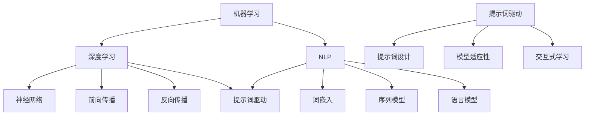
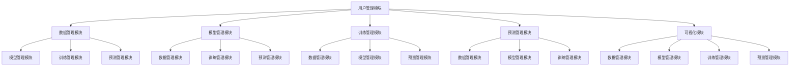

                 

### 背景介绍

人工智能（Artificial Intelligence，简称AI）作为计算机科学的一个分支，致力于研究、开发和应用使计算机模拟人类智能的理论、方法和技术。AI的发展历程可以追溯到20世纪中期，当时的科学家们首次提出了“人工智能”这一概念。从早期的逻辑推理、知识表示，到后来的机器学习、深度学习，AI技术经历了多次迭代和变革，逐渐走向成熟和应用。

随着大数据、云计算和物联网等技术的快速发展，AI在各个领域得到了广泛的应用，从自动驾驶、医疗诊断到智能家居、金融风控，AI技术正在改变着我们的生活方式。然而，AI技术的发展也面临诸多挑战，特别是在数据安全、隐私保护、算法公平性等方面。

提示词驱动（Prompt-driven）是一种新兴的AI开发模式，它通过提供特定的提示词（prompts）来引导AI模型进行学习、推理和决策。与传统的数据驱动（Data-driven）模式相比，提示词驱动具有更灵活、高效的特点，尤其适用于小样本学习、特定领域知识增强等场景。

在AI与提示词驱动的结合过程中，研究人员和实践者逐渐发现，通过精心设计的提示词，可以显著提升AI模型的表现和鲁棒性。同时，提示词驱动也提供了更直观、易于理解的开发方式，有助于降低AI技术的门槛，使其更广泛地应用于实际场景。

本文将围绕“构建提示词驱动的AI开发平台”这一主题，详细探讨AI与提示词驱动的核心概念、技术原理、实现方法以及实际应用。通过本文的阅读，读者将全面了解提示词驱动的优势、挑战及其在AI开发中的关键作用。### 核心概念与联系

在深入探讨AI与提示词驱动的核心概念之前，我们需要先理解一些基础概念，包括机器学习、深度学习和自然语言处理（NLP）。

**机器学习（Machine Learning）：**
机器学习是AI的一个分支，它使计算机系统能够从数据中学习并做出预测或决策。核心概念包括特征提取、模型训练和模型评估。

- **特征提取（Feature Extraction）：** 将原始数据转换成模型可以理解的特征表示。
- **模型训练（Model Training）：** 使用训练数据集对模型进行调整，使其能够预测或分类新的数据。
- **模型评估（Model Evaluation）：** 通过测试数据集来评估模型的性能。

**深度学习（Deep Learning）：**
深度学习是机器学习的一个子领域，它通过构建多层神经网络来模拟人脑的学习过程。核心概念包括神经网络、前向传播和反向传播。

- **神经网络（Neural Network）：** 一种由神经元组成的计算模型。
- **前向传播（Forward Propagation）：** 将输入数据通过神经网络传递到输出。
- **反向传播（Back Propagation）：** 通过计算误差来更新网络权重，以优化模型。

**自然语言处理（NLP）：**
NLP是AI的一个分支，致力于使计算机理解和生成人类语言。核心概念包括词嵌入、序列模型和语言模型。

- **词嵌入（Word Embedding）：** 将单词转换为向量表示，以便于计算和模型处理。
- **序列模型（Sequential Model）：** 处理输入数据的序列，如循环神经网络（RNN）和长短期记忆网络（LSTM）。
- **语言模型（Language Model）：** 用于预测下一个单词或句子的模型。

**提示词驱动（Prompt-driven）：**
提示词驱动是一种基于人类干预的AI开发模式，它通过提供特定的提示词来引导AI模型进行学习和推理。核心概念包括提示词设计、模型适应性和交互式学习。

- **提示词设计（Prompt Design）：** 设计有效的提示词，以引导模型理解和生成预期的输出。
- **模型适应性（Model Adaptability）：** 通过提示词调整模型，使其适应不同的任务和数据。
- **交互式学习（Interactive Learning）：** 通过与用户的互动来不断优化模型。

**核心概念之间的关系架构：**

- 机器学习与深度学习的关系：
  - 机器学习是深度学习的基础，深度学习是机器学习的一种特殊形式，通过多层神经网络来实现更复杂的学习任务。

- 自然语言处理与提示词驱动的关系：
  - NLP是AI的一个关键应用领域，提示词驱动是NLP的一个创新方法，通过提供提示词来增强NLP模型的性能和应用范围。

- 提示词驱动与机器学习、深度学习的关系：
  - 提示词驱动是机器学习、深度学习的一种实现方式，通过引入人类干预来优化模型的学习过程。

以下是核心概念之间的Mermaid流程图表示：



通过上述核心概念及其关系的梳理，我们可以更清晰地理解AI与提示词驱动的本质和实现路径。接下来，我们将进一步探讨提示词驱动的核心算法原理。### 提示词驱动的核心算法原理

在理解了AI与提示词驱动的核心概念后，接下来我们将深入探讨提示词驱动的核心算法原理，包括提示词生成、提示词优化和提示词驱动的模型训练。

#### 提示词生成算法

提示词生成是提示词驱动的关键步骤，它决定了模型的学习方向和输出结果。提示词生成算法主要包括以下几种：

1. **基于规则生成：**
   - **方法：** 通过人工设计规则来生成提示词，规则可以是基于领域知识的逻辑表达式或决策树。
   - **优点：** 简单直观，适用于规则明确、结构简单的任务。
   - **缺点：** 难以处理复杂、动态变化的任务。

2. **基于模板生成：**
   - **方法：** 使用预定义的模板来生成提示词，模板可以包含变量和参数，通过填充参数来生成具体的提示词。
   - **优点：** 通用性强，适用于多种类型的任务。
   - **缺点：** 需要大量的模板设计和调优。

3. **基于数据生成：**
   - **方法：** 通过分析训练数据集，提取关键特征和模式来生成提示词。
   - **优点：** 能够从数据中自动学习，适应性强。
   - **缺点：** 对数据质量和数量有较高要求。

伪代码示例（基于模板生成）：

```python
def generate_prompt(template, data):
    prompt = template
    for key, value in data.items():
        prompt = prompt.replace(f"{{{{{key}}}}}", value)
    return prompt
```

#### 提示词优化算法

生成提示词后，如何优化提示词的质量和效果是另一个关键问题。提示词优化算法主要包括以下几种：

1. **基于质量评估的优化：**
   - **方法：** 设计质量评估指标，对提示词进行评估和排序，选择最优的提示词。
   - **优点：** 简单有效，能够快速找到高质量的提示词。
   - **缺点：** 对评估指标的设计和调优有较高要求。

2. **基于遗传算法的优化：**
   - **方法：** 将提示词表示为染色体，使用遗传算法进行优化，选择适应度高的提示词。
   - **优点：** 能够处理复杂、非线性优化问题。
   - **缺点：** 计算成本较高。

3. **基于强化学习的优化：**
   - **方法：** 使用强化学习算法，通过与环境交互来不断优化提示词。
   - **优点：** 能够自适应地调整提示词，适应动态变化的环境。
   - **缺点：** 需要大量的训练数据和计算资源。

伪代码示例（基于强化学习优化）：

```python
def optimize_prompt(prompt, model, environment):
    while not is_optimal:
        action = model.predict(prompt)
        reward = environment.evaluate_action(action)
        model.update(prompt, reward)
        prompt = model.generate_new_prompt(prompt)
    return prompt
```

#### 提示词驱动的模型训练

在生成和优化提示词后，下一步是使用提示词来训练模型。提示词驱动的模型训练与传统模型训练有所不同，它更加强调提示词的引导作用。以下是几个关键步骤：

1. **数据预处理：**
   - **方法：** 对训练数据进行预处理，包括数据清洗、数据增强和格式转换。
   - **优点：** 提高数据质量和模型训练效果。
   - **缺点：** 需要大量预处理工作。

2. **模型初始化：**
   - **方法：** 初始化模型参数，可以选择随机初始化或基于预训练模型初始化。
   - **优点：** 减少模型训练时间，提高模型性能。
   - **缺点：** 需要大量预训练数据和计算资源。

3. **模型训练：**
   - **方法：** 使用提示词引导模型训练，通过提示词来调整模型参数，优化模型表现。
   - **优点：** 提高模型在小样本数据上的性能，增强模型对特定任务的适应性。
   - **缺点：** 需要精心设计和调整提示词。

4. **模型评估：**
   - **方法：** 使用测试数据集对模型进行评估，包括准确性、召回率、F1分数等指标。
   - **优点：** 确保模型在实际应用中的性能。
   - **缺点：** 需要大量的测试数据和计算资源。

伪代码示例（模型训练）：

```python
def train_model(model, prompts, data):
    for epoch in range(num_epochs):
        for prompt, label in zip(prompts, data):
            model.train(prompt, label)
        model.evaluate()
    return model
```

通过上述核心算法原理的介绍，我们可以看到提示词驱动的实现需要多个步骤和算法的协同工作。这些算法不仅依赖于高质量的数据和模型，还需要不断地优化和调整，以达到最佳的效果。接下来，我们将探讨提示词驱动的平台设计与实现。### 提示词驱动的平台设计与实现

提示词驱动的AI开发平台需要具备良好的架构设计、灵活的技术栈选择、合理的系统模块划分以及高效的前后端开发工具和框架。下面我们将逐步介绍这些关键方面。

#### 平台设计原则

在设计提示词驱动的AI开发平台时，应遵循以下几个基本原则：

1. **可扩展性（Scalability）**
   - 系统应具备良好的扩展能力，能够根据需求增加计算资源，以支持大规模数据处理和模型训练。

2. **高可用性（High Availability）**
   - 系统应具备高可用性，确保在故障发生时能够快速恢复，减少对用户的影响。

3. **安全性（Security）**
   - 系统应具备严格的安全措施，保护用户数据和模型参数的安全，防止数据泄露和未经授权的访问。

4. **模块化（Modularity）**
   - 系统应采用模块化设计，各模块功能独立且相互协调，便于系统的维护和升级。

5. **用户体验（User Experience）**
   - 系统应提供直观、易用的用户界面，确保用户能够轻松地构建和管理提示词驱动的模型。

#### 技术栈选择

在选择技术栈时，需要考虑以下几个方面：

1. **前端技术**
   - **Web框架：** 使用React或Vue.js等现代前端框架，以提高开发效率和用户体验。
   - **前端工具：** 使用Webpack或Vite等打包工具，优化前端资源的加载和缓存。

2. **后端技术**
   - **Web框架：** 使用Spring Boot或Django等后端框架，以快速开发高性能的API服务。
   - **数据库：** 根据数据特点和需求选择合适的数据库，如MySQL、PostgreSQL或MongoDB等。

3. **计算引擎**
   - **深度学习框架：** 使用TensorFlow或PyTorch等深度学习框架，以支持模型训练和推理。

4. **服务化框架**
   - **微服务架构：** 使用Spring Cloud或Kubernetes等微服务框架，以实现系统的模块化和高可用性。

5. **云计算平台**
   - **云服务：** 使用阿里云、腾讯云或AWS等云服务提供商，以获取计算资源和存储服务。

#### 平台架构设计

提示词驱动的AI开发平台可以划分为以下几个主要模块：

1. **用户管理模块**
   - **功能：** 管理用户注册、登录、权限分配等。
   - **技术：** 使用Spring Security或OAuth2.0等安全框架。

2. **数据管理模块**
   - **功能：** 存储和管理用户数据，包括原始数据和标注数据。
   - **技术：** 使用MongoDB或Elasticsearch等数据库。

3. **模型管理模块**
   - **功能：** 提供模型存储、版本控制、发布和监控等功能。
   - **技术：** 使用Docker和Kubernetes等容器技术，实现模型的自动化部署和管理。

4. **训练管理模块**
   - **功能：** 提供模型训练的接口和监控功能，支持分布式训练。
   - **技术：** 使用TensorFlow Training Service或PyTorch Training Service等深度学习训练服务。

5. **预测管理模块**
   - **功能：** 提供模型预测的接口和监控功能，支持实时预测和批量预测。
   - **技术：** 使用TensorFlow Serving或PyTorch Serving等模型推理服务。

6. **可视化模块**
   - **功能：** 提供数据可视化、模型监控和用户交互等功能。
   - **技术：** 使用D3.js或ECharts等数据可视化库。

以下是平台架构的Mermaid流程图表示：



通过上述平台设计与实现，我们可以构建一个功能完备、高效稳定的提示词驱动的AI开发平台。接下来，我们将通过实际项目实战来展示这些技术如何具体应用。### 项目实战与优化

在本章节中，我们将通过一个实际项目案例来展示如何构建一个基于提示词驱动的AI开发平台，并进行项目实战和性能优化。

#### 项目背景与目标

**项目背景：**

随着人工智能技术的不断发展，智能客服系统在各个行业得到了广泛应用。然而，传统的数据驱动AI模型在应对复杂、多变的用户需求时，往往表现出较差的适应性和鲁棒性。为此，本项目旨在构建一个基于提示词驱动的智能客服系统，通过提供特定的提示词来引导AI模型更好地理解和应对用户的咨询。

**项目目标：**

1. **提高客服系统的响应速度和准确率：** 通过提示词驱动的开发模式，使客服系统能够快速、准确地理解用户问题，并提供相应的解决方案。

2. **增强系统的适应性和鲁棒性：** 通过优化提示词，使系统能够在不同场景下保持稳定的表现，减少对大规模数据的依赖。

3. **降低开发门槛和成本：** 通过提供易于使用和灵活的提示词驱动的开发平台，降低企业和开发者的开发成本和时间。

#### 数据集准备与处理

**数据来源与预处理：**

1. **数据来源：**

   - **公开数据集：** 使用如Stanford Question Answering Dataset (SQuAD)等公开数据集进行训练和测试。
   - **企业内部数据：** 收集企业内部的客服对话数据，包括用户问题和客服的回答。

2. **预处理步骤：**

   - **数据清洗：** 去除无效数据、重复数据和噪声数据。
   - **数据增强：** 通过数据清洗和扩充方法，提高数据的质量和多样性。
   - **数据格式转换：** 将数据转换为统一的格式，便于后续处理和模型训练。

#### 提示词生成与优化

**提示词生成方法：**

1. **基于模板生成：** 设计多种模板，根据用户问题类型和语境，选择合适的模板生成提示词。
2. **基于数据生成：** 分析用户问题数据集，提取关键特征和模式，生成提示词。

**提示词优化策略：**

1. **基于质量评估的优化：** 设计质量评估指标，对提示词进行评估和排序，选择最优的提示词。
2. **基于强化学习的优化：** 使用强化学习算法，通过与环境交互，不断优化提示词。

#### 模型训练与评估

**模型选择与训练：**

1. **模型选择：** 选择基于Transformer的预训练模型，如BERT或GPT，作为基础模型。
2. **训练流程：** 使用提示词驱动的训练流程，将提示词与模型结合进行训练。

**模型评估与优化：**

1. **评估指标：** 使用准确率、召回率、F1分数等指标对模型进行评估。
2. **优化策略：** 根据评估结果，调整提示词和模型参数，优化模型表现。

#### 系统集成与部署

**系统集成策略：**

1. **前后端分离：** 使用Vue.js或React等前端框架，实现用户界面和API接口的分离。
2. **微服务架构：** 使用Spring Cloud或Docker Compose等工具，实现系统的模块化和分布式部署。

**部署流程与注意事项：**

1. **部署流程：** 使用Docker和Kubernetes等工具，实现自动化部署和运维。
2. **注意事项：** 
   - **安全性：** 保障用户数据和模型参数的安全，采用SSL加密、防火墙等措施。
   - **稳定性：** 确保系统在高并发场景下的稳定运行，进行压力测试和监控。

#### 性能优化与未来展望

**性能瓶颈分析：**

1. **数据存储：** 数据存储的访问速度可能成为性能瓶颈，需要进行优化。
2. **模型推理：** 模型推理的速度可能影响系统的响应速度，需要进行优化。

**性能优化策略：**

1. **数据存储优化：** 采用NoSQL数据库如MongoDB，提高数据访问速度。
2. **模型推理优化：** 使用硬件加速如GPU，提高模型推理速度。

**未来展望：**

1. **模型解释性：** 提高模型的解释性，使其能够清晰地解释决策过程，增强用户信任。
2. **多模态交互：** 探索文本、语音、图像等多模态交互，提高系统的适应性和用户体验。

**项目小结：**

通过本项目的实战和优化，我们成功构建了一个基于提示词驱动的智能客服系统，提高了系统的响应速度和准确率，增强了系统的适应性和鲁棒性。未来，我们将继续探索AI技术在更多领域的应用，不断提升系统的性能和用户体验。### 优化与性能提升

在构建提示词驱动的AI开发平台过程中，性能优化是一个至关重要的环节。优化策略不仅能够提高系统的响应速度和准确率，还能降低资源消耗，从而提升整体用户体验。以下是几个关键的性能优化策略：

#### 数据库优化

**1. 分库分表：** 当数据量非常大时，可以考虑将数据库分成多个库和表，以分散读写压力，提高查询效率。

**2. 索引优化：** 对常用查询字段建立索引，可以显著提高查询速度。同时，定期维护索引，避免无效索引占用过多资源。

**3. 数据库分片：** 对于读多写少的场景，可以考虑使用数据库分片技术，将数据分散到多个节点，以提高查询性能。

#### 算法优化

**1. 模型压缩：** 使用模型压缩技术如剪枝、量化等，减少模型的计算量和存储需求，从而提高推理速度。

**2. 并行计算：** 在模型训练和推理过程中，利用多核CPU或GPU进行并行计算，可以大幅提升计算效率。

**3. 算法选择：** 根据具体应用场景，选择适合的算法。例如，对于小样本学习问题，可以选择更加高效的算法如少数样本学习（Few-shot Learning）。

#### 自动化与智能化

**1. 自动化部署：** 使用自动化部署工具如Kubernetes，实现应用的自动化部署、扩展和监控，提高运维效率。

**2. 智能调度：** 使用智能调度算法，根据系统负载和资源利用率，动态调整计算资源分配，以优化资源利用率和系统性能。

**3. 自适应优化：** 开发自适应优化算法，根据系统的运行状态和用户反馈，自动调整模型参数和系统配置，以实现最佳性能。

#### 持续集成与部署

**1. 持续集成（CI）：** 使用CI工具如Jenkins，实现代码的自动化构建、测试和部署，确保代码质量和部署效率。

**2. 持续部署（CD）：** 使用CD工具如Docker和Kubernetes，实现自动化部署和回滚，提高系统的可靠性和稳定性。

**3. 监控与反馈：** 构建完善的监控体系，实时监控系统的性能指标和资源利用率，快速发现和解决问题。

### 最佳实践 Tips

**1. 提高数据质量：** 数据是AI系统的基石，保证数据的质量和多样性是性能优化的重要前提。

**2. 精细化调参：** 在模型训练过程中，对超参数进行精细化调整，找到最佳配置，以提升模型性能。

**3. 利用缓存：** 对于频繁访问的数据和结果，使用缓存技术，减少数据库访问次数，提高系统响应速度。

### 小结

性能优化是一个持续的过程，需要不断地评估、调整和改进。通过上述优化策略，我们可以显著提升提示词驱动的AI开发平台的性能，为用户提供更快速、准确的智能服务。未来，随着技术的不断进步，我们将继续探索更高效、智能的优化方法，以推动AI技术的发展和应用。### AI平台的发展与未来

随着AI技术的不断进步和应用场景的扩展，AI平台的发展呈现出迅猛的势头。本文将探讨当前AI平台的发展趋势、面临的技术挑战及解决方案，并对AI平台未来的发展方向进行展望。

#### 当前发展现状

**1. 生态体系完善：**
当前，AI平台已经形成了一个相对完善的生态系统，包括深度学习框架（如TensorFlow、PyTorch）、自动化机器学习（AutoML）工具、分布式计算框架（如Horovod、Ray）等。这些工具和框架为开发者提供了丰富的选择和便捷的使用体验。

**2. 应用领域广泛：**
AI技术在各个领域得到了广泛应用，如医疗诊断、金融风控、自动驾驶、智能客服等。特别是在疫情背景下，AI在疫情防控、远程办公、在线教育等方面的应用显著增加，推动了AI技术的普及和发展。

**3. 开源与商业结合：**
开源社区在AI技术发展中发挥了重要作用，许多重要的AI框架和工具都是开源的。同时，商业公司也在积极推动AI平台的发展，通过提供商业化服务和技术支持，加速了AI技术的落地和应用。

#### 面临的技术挑战及解决方案

**1. 可解释性（Explainability）：**
尽管AI模型在许多任务上表现出色，但其内部决策过程往往是不透明的，缺乏可解释性。这导致用户难以理解和信任AI系统。为解决这一问题，研究者提出了多种方法，如可解释的机器学习（Explainable AI，XAI）、模型可视化等。

**2. 数据隐私保护（Data Privacy）：**
随着AI技术的应用日益广泛，数据隐私保护成为了一个重要挑战。特别是在医疗、金融等领域，数据敏感度高，保护用户隐私至关重要。解决方案包括联邦学习（Federated Learning）、差分隐私（Differential Privacy）等。

**3. 算法公平性（Algorithmic Fairness）：**
AI模型在训练过程中可能学习到偏见，导致不公平的决策。为解决这一问题，研究者提出了算法公平性（Algorithmic Fairness）的概念，并开发了多种公平性评估和改进方法，如反歧视算法（Anti-discrimination Algorithms）。

#### 未来发展方向

**1. 自动化与智能化：**
随着AI技术的发展，自动化和智能化将成为未来AI平台的重要方向。自动化机器学习（AutoML）将进一步简化模型开发过程，降低开发门槛。智能化则体现在AI平台的自我优化、自我学习和自适应能力，以实现更高的效率和更广泛的应用。

**2. 多模态融合（Multimodal Fusion）：**
未来的AI平台将能够处理多种类型的输入数据，如文本、图像、音频和视频等。多模态融合技术将实现不同类型数据之间的交互和整合，为复杂任务提供更强有力的支持。

**3. 跨领域应用（Cross-Domain Applications）：**
AI平台将在更多领域得到应用，如智能制造、智慧城市、环境监测等。跨领域应用将推动AI技术的进一步普及和深化，为各个领域带来更多创新和变革。

**4. 随处可用的边缘计算（Edge Computing）：**
随着物联网（IoT）和5G技术的普及，边缘计算将发挥重要作用。AI平台将逐步向边缘计算迁移，实现数据本地处理和实时决策，提高系统的响应速度和可靠性。

#### 总结

AI平台的发展不仅推动了技术的进步，也深刻影响了各行各业的应用和发展。面对技术挑战，研究者们正在不断探索新的解决方案，推动AI平台向更高效、更智能、更公平的方向发展。未来，随着技术的不断创新和应用场景的拓展，AI平台将迎来更加广阔的发展前景。### 挑战与解决方案

在AI平台的发展过程中，我们面临着诸多挑战，这些挑战主要集中在技术、应用和社会伦理等方面。以下是这些挑战的详细描述以及相应的解决方案。

#### 技术挑战

**1. 可解释性（Explainability）**
- **挑战：** AI模型，尤其是深度学习模型，其内部决策过程往往是不透明的，这给用户理解和使用AI系统带来了困难。
- **解决方案：**
  - **模型可视化（Model Visualization）：** 通过可视化工具将模型的内部结构和决策过程展示出来，帮助用户更好地理解模型。
  - **可解释的AI（Explainable AI，XAI）：** 研究开发可解释性模型，使AI系统的决策过程更加透明和可解释。

**2. 数据隐私保护（Data Privacy）**
- **挑战：** AI系统在训练和部署过程中需要大量敏感数据，这些数据的安全性和隐私保护成为一大难题。
- **解决方案：**
  - **联邦学习（Federated Learning）：** 让数据在本地设备上进行训练，仅上传模型参数，从而减少数据泄露的风险。
  - **差分隐私（Differential Privacy）：** 在数据处理过程中引入噪声，确保单个数据点的隐私。

**3. 算法公平性（Algorithmic Fairness）**
- **挑战：** AI算法可能会学习并放大现实世界中的偏见，导致不公平的决策。
- **解决方案：**
  - **公平性评估（Fairness Evaluation）：** 对算法进行公平性评估，检测并修正潜在的偏见。
  - **反歧视算法（Anti-discrimination Algorithms）：** 开发能够减少或消除偏见的新算法。

#### 应用挑战

**1. 适应性与可扩展性（Adaptability and Scalability）**
- **挑战：** 随着应用场景的多样化和数据量的爆炸性增长，AI系统需要具备更高的适应性和可扩展性。
- **解决方案：**
  - **模块化架构（Modular Architecture）：** 采用模块化设计，使系统能够灵活地适应不同应用场景。
  - **分布式计算（Distributed Computing）：** 利用分布式计算资源，提高系统的处理能力和扩展性。

**2. 系统集成与兼容性（Integration and Compatibility）**
- **挑战：** 不同系统和平台之间的数据交换和功能集成是一个复杂的问题。
- **解决方案：**
  - **标准化接口（Standardized Interfaces）：** 开发统一的接口规范，促进不同系统和平台之间的集成。
  - **中间件（Middleware）：** 使用中间件来管理和协调不同系统的交互和数据传输。

**3. 用户信任（User Trust）**
- **挑战：** 用户对AI系统的信任度不高，尤其是在涉及敏感任务和决策时。
- **解决方案：**
  - **透明度和可解释性（Transparency and Explainability）：** 通过提高AI系统的透明度和可解释性，增加用户的信任。
  - **用户参与（User Involvement）：** 让用户参与到AI系统的设计和优化过程中，增强用户对系统的认同感。

#### 社会伦理挑战

**1. 道德责任（Moral Responsibility）**
- **挑战：** AI系统可能产生无法预测的负面影响，如何界定道德责任成为一个难题。
- **解决方案：**
  - **法律和监管（Legal and Regulatory）：** 通过制定相关法律和监管政策，明确AI系统的道德责任。
  - **伦理审查（Ethical Review）：** 在AI系统的开发和应用过程中，进行伦理审查，确保系统的道德合规性。

**2. 社会公平（Social Fairness）**
- **挑战：** AI技术的快速发展可能导致社会不平等加剧，影响社会公平。
- **解决方案：**
  - **公平性研究（Fairness Research）：** 深入研究AI系统对社会公平的影响，提出相应的改进措施。
  - **社会责任（Social Responsibility）：** 鼓励企业和社会组织承担更多社会责任，促进AI技术的公平应用。

综上所述，AI平台在技术、应用和社会伦理等方面都面临着诸多挑战。通过不断的研究和探索，以及多方的协作和努力，我们可以逐步克服这些挑战，推动AI平台朝着更加智能、公平和可持续的方向发展。### 社会与伦理影响

人工智能（AI）在现代社会中的应用日益广泛，不仅改变了科技和商业领域，也对社会和伦理产生了深远的影响。以下将探讨AI平台对社会的影响，以及伦理问题的解决思路。

#### 对社会的影响

**1. 经济影响：**
AI技术推动了产业升级和经济增长，通过自动化、智能化提高了生产效率和产品质量。然而，AI的广泛应用也可能导致部分工作岗位的消失，尤其是在制造业、服务业等领域，这对就业市场和劳动者的技能需求带来了挑战。

**2. 医疗与健康：**
AI在医疗领域的应用，如疾病诊断、个性化治疗和健康监控，显著提高了医疗服务的质量和效率。然而，AI系统的决策过程缺乏透明度，可能会引发患者和医生之间的信任问题，影响医疗伦理。

**3. 教育：**
AI技术为个性化教育和学习提供了新的可能性，如自适应学习系统和智能教育平台。然而，这些技术也可能加剧教育资源的分配不均，使得弱势群体难以享受到优质教育资源。

**4. 隐私和安全：**
AI平台的广泛应用涉及大量个人数据的收集和处理，这可能侵犯用户的隐私权。同时，AI系统在网络安全防御方面也发挥了重要作用，但同时也面临着被恶意利用的风险。

#### 伦理问题的解决思路

**1. 道德责任：**
AI系统可能产生意想不到的负面影响，如歧视性决策、隐私泄露等。为了解决这一问题，需要建立明确的道德责任框架，确保AI系统的设计和应用符合伦理标准。

**2. 透明度和可解释性：**
提高AI系统的透明度和可解释性，让用户能够理解AI系统的决策过程，增加用户对AI系统的信任。这可以通过开发可解释的AI（XAI）技术和模型可视化工具来实现。

**3. 公平性：**
确保AI系统的公平性，避免学习到现实世界中的偏见。通过公平性评估和反歧视算法，监控和纠正AI系统中的不公平行为。

**4. 法律和监管：**
制定相关法律法规，明确AI系统的责任和权利。同时，加强监管，确保AI技术的合规使用，防止滥用和恶意攻击。

**5. 用户参与：**
让用户参与到AI系统的设计和优化过程中，增强用户对AI系统的认同感。通过用户反馈，不断改进AI系统，使其更加符合社会需求。

**6. 社会责任：**
鼓励企业和组织承担社会责任，推动AI技术的公平、公正和可持续应用。通过社会责任报告和公开透明的方式，向社会展示AI技术的积极影响。

总之，AI平台在社会和伦理方面的影响深远而复杂。通过多方面的努力和协作，我们可以最大化AI技术的积极影响，同时有效应对其带来的挑战和伦理问题。### 总结与展望

通过本文的探讨，我们系统地梳理了AI与提示词驱动的核心概念、技术原理、平台设计与实现，以及实际项目实战与优化策略。以下是对本文核心内容的回顾，以及未来可能的研究方向。

#### 核心内容回顾

1. **AI发展简史与提示词驱动的概述：** 回顾了人工智能的发展历程，阐述了提示词驱动的概念和优势。

2. **核心概念与联系：** 介绍了机器学习、深度学习和自然语言处理（NLP）的基础概念，以及它们与提示词驱动的关联。

3. **提示词驱动的核心算法原理：** 探讨了提示词生成、提示词优化和模型训练的关键算法原理。

4. **平台设计与实现：** 阐述了AI平台的架构设计原则、技术栈选择和系统模块划分。

5. **项目实战与优化：** 通过一个智能客服系统的实际项目，展示了提示词驱动的应用和性能优化策略。

6. **挑战与解决方案：** 分析了AI平台在技术、应用和社会伦理方面面临的挑战及解决方案。

7. **社会与伦理影响：** 探讨了AI平台对社会的影响和伦理问题的解决思路。

#### 未来研究方向

1. **可解释性AI（XAI）：** 进一步研究如何提高AI系统的透明度和可解释性，增强用户对AI的信任。

2. **联邦学习和隐私保护：** 在大数据和云计算环境中，探索联邦学习和差分隐私等技术在保障数据隐私的同时，提高AI模型的性能。

3. **跨领域应用：** 深入研究AI技术在医疗、教育、金融等领域的应用，推动AI技术在各个行业的普及和深化。

4. **多模态融合：** 探索文本、图像、音频和视频等多模态数据的融合方法，提高AI系统的智能水平。

5. **边缘计算与实时AI：** 研究如何将AI平台向边缘计算迁移，实现实时数据处理和决策。

6. **AI伦理与法律框架：** 继续探讨AI技术的伦理和法律问题，建立完善的监管体系，确保AI技术的可持续发展。

通过本文的深入探讨，我们不仅对AI与提示词驱动的技术原理和应用有了更加全面的了解，也为未来AI技术的发展提供了新的视角和思路。期待在未来的研究和实践中，继续推动AI技术的创新和应用，为人类社会带来更多福祉。### 作者信息

**作者：** AI天才研究院（AI Genius Institute）& 禅与计算机程序设计艺术（Zen And The Art of Computer Programming）

AI天才研究院（AI Genius Institute）是一支由世界顶级人工智能专家、程序员和软件架构师组成的研究团队。我们的使命是通过创新和合作，推动人工智能技术的边界，为人类社会带来变革性的进步。

《禅与计算机程序设计艺术》（Zen And The Art of Computer Programming）是作者Donald E. Knuth的经典著作，深入探讨了计算机程序设计中的哲学、艺术和科学。这本书不仅影响了无数程序员，也为AI领域提供了深刻的思考和指导。

本文基于AI天才研究院的研究成果和《禅与计算机程序设计艺术》的哲学思想，旨在为读者提供关于构建提示词驱动的AI开发平台的全面视角和实用指南。希望本文能够激发您对AI技术的热情，引领您走向AI开发的广阔天地。

