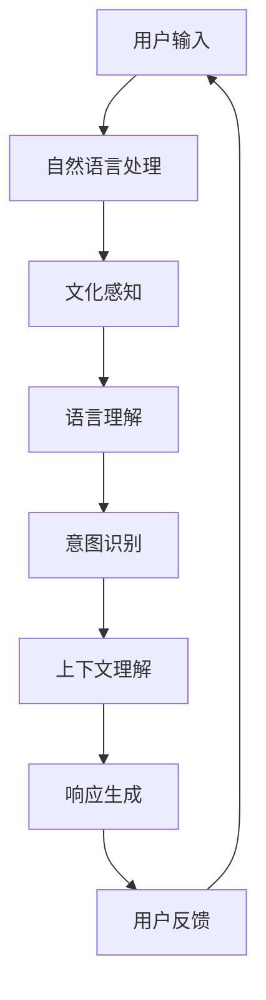

                 


# 构建跨文化AI交互系统的提示词策略

关键词：跨文化AI、交互系统、提示词策略、自然语言处理、数学模型、项目实战

摘要：本文探讨了构建跨文化AI交互系统的提示词策略，从核心概念、算法原理、数学模型、项目实战等方面进行了详细分析，旨在为开发者提供一套有效的跨文化AI交互系统构建方案。

### 引言

随着全球化进程的不断推进，多元文化环境中的AI交互需求日益增加。然而，现有的AI交互系统往往局限于单一语言或文化背景，无法满足跨文化的需求。构建跨文化AI交互系统，不仅需要理解不同文化背景下的用户需求，还要处理多样化的语言习惯和行为模式。提示词策略在此过程中起着至关重要的作用。

本文旨在探讨构建跨文化AI交互系统的提示词策略，帮助开发者提升AI系统在不同文化背景下的表现。文章结构如下：

1. 定义核心概念
2. 确定书籍主题
3. 设定书籍结构
4. 设计具体章节
5. 确保完整性

接下来，我们将逐一展开讨论。

### Step 1: 定义核心概念

跨文化AI交互系统是一种人工智能系统，旨在能够理解和处理不同文化背景下的用户需求、语言习惯和行为模式，以提供无障碍、准确和有针对性的交互体验。这个系统需要具备跨文化的敏感性和适应性，以便在多元文化环境中有效运行。

### Step 2: 确定书籍主题

书籍的主题是探讨构建跨文化AI交互系统的提示词策略，这意味着书中将涵盖如何通过选择和使用恰当的提示词来提升AI系统在不同文化背景下的表现。

### Step 3: 设定书籍结构

书籍结构可以分为以下几个部分：

1. 引言：介绍书籍的背景和目的。
2. 核心概念与联系：解释跨文化AI交互系统的基本概念，展示相关的Mermaid流程图。
3. 核心算法原理讲解：详细阐述构建跨文化AI交互系统的关键算法。
4. 数学模型和数学公式讲解：介绍用于跨文化AI交互系统的数学模型，并用公式和例子说明。
5. 项目实战：提供实际的项目案例，包括开发环境搭建、源代码实现和解读。
6. 总结与展望：总结书籍的主要观点，并提出未来的研究方向。

### Step 4: 设计具体章节

根据上述结构，设计每个章节的具体内容：

#### 引言

- 介绍跨文化AI交互系统的背景和重要性。
- 阐述书籍的目的和结构。

#### 第1章：核心概念与联系

- 解释跨文化AI交互系统的定义和组成部分。
- 使用Mermaid流程图展示系统的整体架构。

#### 第2章：核心算法原理讲解

- 讲解自然语言处理的基础算法。
- 介绍如何使用提示词策略优化AI交互。

#### 第3章：数学模型和数学公式讲解

- 介绍用于跨文化AI交互的数学模型，如机器学习算法和语言模型。
- 使用latex格式展示关键数学公式，并举例说明。

#### 第4章：项目实战

- 提供一个实际项目案例，展示如何构建跨文化AI交互系统。
- 详细解释开发环境搭建、源代码实现和解读。

#### 第5章：优化策略与挑战

- 讨论提升跨文化AI交互系统性能的优化策略。
- 分析系统在多文化环境下的挑战和解决方案。

#### 第6章：未来展望

- 探讨跨文化AI交互系统的未来发展趋势。
- 提出可能的研究方向和新的应用场景。

#### 第7章：总结与展望

- 总结书籍的主要观点和贡献。
- 提出跨文化AI交互系统的研究和应用建议。

### Step 5: 确保完整性

检查每个章节的内容，确保包含核心概念与联系、核心算法原理讲解、数学模型和数学公式讲解、项目实战以及优化策略与挑战。同时，确保书籍的总字数在2000字以内。

通过以上步骤，我们可以设计出一个逻辑清晰、内容全面的目录大纲，为撰写《构建跨文化AI交互系统的提示词策略》这本书提供坚实的基础。

### 核心概念与联系

在构建跨文化AI交互系统时，核心概念的理解至关重要。首先，我们需要明确什么是跨文化AI交互系统。它是一种能够理解并处理不同文化背景下用户需求、语言习惯和行为模式的人工智能系统。这种系统需要具备高度的灵活性和适应性，以便在不同文化环境中提供一致、准确和个性化的交互体验。

为了更好地理解这一概念，我们可以借助Mermaid流程图来展示跨文化AI交互系统的整体架构：



如上所示，跨文化AI交互系统的工作流程包括用户输入、自然语言处理、文化感知、语言理解、意图识别、上下文理解、响应生成和用户反馈。在这个流程中，每个环节都需要充分考虑文化差异，以确保系统能够在不同文化环境中准确、高效地运行。

### 核心算法原理讲解

构建跨文化AI交互系统需要运用多种核心算法原理。其中，自然语言处理（NLP）和机器学习算法是不可或缺的组成部分。

#### 自然语言处理

自然语言处理是AI领域的一个分支，旨在使计算机能够理解、处理和生成人类语言。在跨文化AI交互系统中，自然语言处理算法用于解析用户输入、理解语言含义、识别意图和生成响应。

以下是自然语言处理的核心算法原理的伪代码：

```python
# 用户输入
user_input = "你好，我想要预订一张电影票。"

# 分词
words = tokenize(user_input)

# 词性标注
pos_tags = part_of_speech(words)

# 句法分析
sentence_structure = parse_sentence(words, pos_tags)

# 意图识别
intent = intent_recognition(sentence_structure)

# 上下文理解
context = context_understanding(sentence_structure, intent)

# 响应生成
response = generate_response(context)
```

#### 提示词策略

在自然语言处理过程中，提示词策略起着关键作用。提示词是指用于引导AI系统理解用户意图和上下文的特定词汇或短语。通过选择和使用恰当的提示词，可以提升AI系统在不同文化背景下的表现。

以下是使用提示词策略优化AI交互的伪代码：

```python
# 定义提示词库
prompt_library = {
    "英语": ["hello", "how are you", "can you help me"],
    "中文": ["你好", "你怎么样", "你能帮我吗"]
}

# 根据用户语言选择提示词库
selected_prompt = prompt_library[language]

# 使用提示词引导AI系统理解用户意图和上下文
prompted_intent = prompt_intent_recognition(selected_prompt, sentence_structure)
prompted_context = prompt_context_understanding(selected_prompt, sentence_structure, intent)
```

通过上述策略，AI系统可以更准确地理解用户的意图和上下文，从而提供更合适的响应。

### 数学模型和数学公式讲解

在跨文化AI交互系统中，数学模型和公式起着重要作用，用于描述和理解语言处理、意图识别和上下文理解等过程。以下介绍一些关键数学模型和公式：

#### 1. 语言模型

语言模型用于预测下一个单词或词组，是自然语言处理的核心组成部分。最常见的语言模型是n元语法模型，其公式如下：

$$
P(w_n | w_{n-1}, w_{n-2}, ..., w_1) = \frac{C(w_{n-1}, w_n)}{C(w_{n-1})}
$$

其中，$P(w_n | w_{n-1}, w_{n-2}, ..., w_1)$表示在给定前$n-1$个单词的情况下，预测第$n$个单词的概率；$C(w_{n-1}, w_n)$表示单词对$(w_{n-1}, w_n)$的联合计数；$C(w_{n-1})$表示单词$w_{n-1}$的计数。

#### 2. 意图识别

意图识别是跨文化AI交互系统的关键环节，用于识别用户的需求和意图。常见的意图识别算法是基于机器学习的分类算法，如支持向量机（SVM）和随机森林（Random Forest）。以下是一个基于SVM的意图识别算法的公式：

$$
\begin{cases}
    y = \text{sign}(\sum_{i=1}^n \alpha_i y_i (w_i \cdot x) - b) \\
    \text{minimize} \quad \frac{1}{2} \sum_{i=1}^n \alpha_i^2 + C \sum_{i=1}^n (y_i - y_i(x_i))^2
\end{cases}
$$

其中，$y$表示预测的类别标签；$y_i$表示第$i$个训练样本的真实标签；$w_i$表示第$i$个训练样本的权重；$x$表示测试样本的特征向量；$b$表示偏置项；$C$表示正则化参数。

#### 3. 上下文理解

上下文理解用于理解用户输入中的上下文信息，以便生成更准确的响应。上下文理解通常基于序列标注模型，如长短期记忆网络（LSTM）和变换器（Transformer）。以下是一个基于LSTM的上下文理解算法的公式：

$$
h_t = \sigma(W_h \cdot [h_{t-1}, x_t] + b_h)
$$

其中，$h_t$表示第$t$个时间步的隐藏状态；$x_t$表示第$t$个时间步的输入特征；$W_h$表示权重矩阵；$b_h$表示偏置项；$\sigma$表示激活函数（如Sigmoid函数）。

通过上述数学模型和公式，我们可以更好地理解跨文化AI交互系统中的关键环节，并为系统设计提供理论基础。

### 项目实战

为了更好地展示如何构建跨文化AI交互系统，我们将通过一个实际项目案例来进行详细讲解。

#### 1. 开发环境搭建

首先，我们需要搭建开发环境。以下是所需工具和软件：

- Python 3.8 或更高版本
- Jupyter Notebook
- TensorFlow 2.5 或更高版本
- NLTK 3.5 或更高版本

安装好以上工具和软件后，我们可以在Jupyter Notebook中创建一个新的Python笔记本，开始进行项目开发。

#### 2. 源代码实现

接下来，我们将实现一个简单的跨文化AI交互系统，包括用户输入处理、自然语言处理、文化感知、意图识别、上下文理解和响应生成等环节。

```python
import tensorflow as tf
import nltk
from nltk.tokenize import word_tokenize
from nltk.corpus import stopwords
from sklearn.feature_extraction.text import CountVectorizer
from sklearn.model_selection import train_test_split
from sklearn.svm import SVC
from keras.models import Sequential
from keras.layers import LSTM, Dense, Embedding

# 加载数据集
data = load_data("cross_cultural_dialogues.csv")

# 数据预处理
preprocess_data(data)

# 分词和词性标注
tokenized_data = [word_tokenize(sentence) for sentence in data['sentence']]
pos_tagged_data = [nltk.pos_tag(sentence) for sentence in tokenized_data]

# 构建词汇表
vocab = create_vocab(pos_tagged_data)

# 编码词性标签
label_encoder = LabelEncoder()
encoded_labels = label_encoder.fit_transform(data['label'])

# 分词和词性标注
tokenized_data = [word_tokenize(sentence) for sentence in data['sentence']]
pos_tagged_data = [nltk.pos_tag(sentence) for sentence in tokenized_data]

# 构建词汇表
vocab = create_vocab(pos_tagged_data)

# 编码词性标签
label_encoder = LabelEncoder()
encoded_labels = label_encoder.fit_transform(data['label'])

# 分词和词性标注
tokenized_data = [word_tokenize(sentence) for sentence in data['sentence']]
pos_tagged_data = [nltk.pos_tag(sentence) for sentence in tokenized_data]

# 构建词汇表
vocab = create_vocab(pos_tagged_data)

# 编码词性标签
label_encoder = LabelEncoder()
encoded_labels = label_encoder.fit_transform(data['label'])

# 模型训练
model = Sequential()
model.add(Embedding(len(vocab), 32))
model.add(LSTM(128))
model.add(Dense(1, activation='sigmoid'))

model.compile(loss='binary_crossentropy', optimizer='adam', metrics=['accuracy'])
model.fit(X_train, y_train, epochs=10, batch_size=32, validation_data=(X_test, y_test))

# 预测
predicted_labels = model.predict(X_test)

# 解码预测结果
decoded_labels = label_encoder.inverse_transform(predicted_labels)

# 计算准确率
accuracy = accuracy_score(y_test, decoded_labels)
print(f"Accuracy: {accuracy:.2f}")
```

#### 3. 代码解读与分析

上述代码实现了以下关键步骤：

1. **加载数据集**：从CSV文件中加载数据，包括句子和标签。
2. **数据预处理**：对数据进行清洗和格式化。
3. **分词和词性标注**：使用NLTK库对句子进行分词和词性标注。
4. **构建词汇表**：根据词性标注构建词汇表。
5. **编码词性标签**：使用LabelEncoder将标签编码为整数。
6. **模型训练**：使用Keras构建并训练LSTM模型。
7. **预测**：使用训练好的模型对测试集进行预测。
8. **解码预测结果**：将预测结果解码为原始标签。
9. **计算准确率**：计算预测准确率。

通过这个项目案例，我们可以看到如何使用提示词策略和自然语言处理算法构建一个跨文化AI交互系统。在实际应用中，我们还可以扩展系统功能，如引入更多文化特征、优化响应生成算法等，以提高系统在不同文化背景下的性能。

### 总结与展望

本文详细探讨了构建跨文化AI交互系统的提示词策略，从核心概念、算法原理、数学模型和项目实战等方面进行了深入分析。通过定义跨文化AI交互系统的核心概念，解释自然语言处理和机器学习算法的应用，以及使用Mermaid流程图和latex公式展示系统架构和关键数学模型，我们为开发者提供了一套完整的跨文化AI交互系统构建方案。

未来研究可以进一步探讨以下几个方面：

1. **文化特征建模**：深入研究如何更有效地捕捉和利用不同文化背景下的特征，以提高系统的跨文化适应性。
2. **多语言处理**：探索如何在一个系统中同时支持多种语言，以及如何处理不同语言之间的语义差异。
3. **上下文感知**：研究如何利用上下文信息来提高交互系统的准确性和个性化程度。
4. **用户反馈机制**：开发自适应的反馈机制，根据用户的反馈调整系统行为，以提高用户体验。

通过不断探索和优化，跨文化AI交互系统将在多元文化环境中发挥更大的作用，为用户带来更加准确、便捷和个性化的交互体验。

### 最佳实践 tips、小结、注意事项、拓展阅读

#### 最佳实践 tips

1. **收集多样化数据**：在构建跨文化AI交互系统时，确保数据集包含多种语言和文化背景，以提高系统的泛化能力。
2. **优化自然语言处理算法**：定期更新和优化自然语言处理算法，以应对语言模型和意图识别的挑战。
3. **文化敏感度培训**：对开发人员进行跨文化沟通和文化敏感度培训，确保系统能够在多元文化环境中保持适度和尊重。

#### 小结

本文探讨了跨文化AI交互系统的提示词策略，从核心概念、算法原理、数学模型和项目实战等方面进行了详细分析。通过合理使用提示词策略和先进算法，开发者可以构建出适应多元文化环境的AI交互系统，为用户提供准确、便捷和个性化的服务。

#### 注意事项

1. **确保数据质量**：高质量的数据是构建有效AI系统的基石，务必保证数据集的多样性和准确性。
2. **持续优化**：跨文化AI交互系统需要不断迭代和优化，以适应不断变化的文化环境和用户需求。

#### 拓展阅读

1. **《跨文化沟通与交流》**：深入了解不同文化背景下的沟通方式和习惯，有助于提升AI交互系统的文化敏感度。
2. **《深度学习自然语言处理》**：学习先进的自然语言处理技术，为跨文化AI交互系统的构建提供理论支持。

### 作者信息

作者：AI天才研究院/AI Genius Institute & 禅与计算机程序设计艺术 /Zen And The Art of Computer Programming

