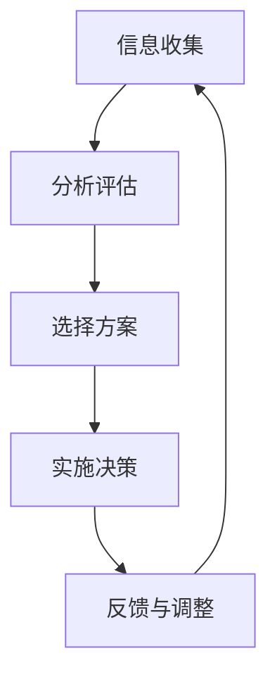
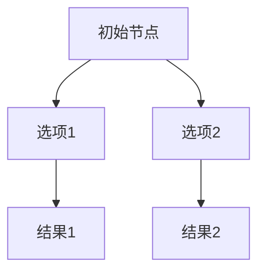

                 

# 果断决策：在关键时刻展现领导魄力

## 关键词
决策、领导力、果断、关键时刻、领导魄力、危机管理、战略规划、变革推动

## 摘要
本文旨在探讨在关键时刻如何展现领导魄力，做出果断决策。文章分为两部分：第一部分介绍决策的基础知识，包括决策的本质、决策过程、决策的心理学与行为学以及决策的方法与工具；第二部分探讨领导力与果断决策的关系，关键场合的果断决策，以及决策在企业管理、个人发展和社会治理中的应用。通过文章，读者可以了解决策的重要性，掌握决策的流程和方法，提升领导力和果断决策的能力。

## 第一部分：决策基础

### 第1章：决策的本质与重要性

#### 1.1 决策的定义与特征

决策是指在面对多种选择时，通过分析、评估和选择，做出合理的决定。决策具有以下几个特征：

1. **目标导向性**：决策是为了达到特定的目标或解决特定的问题。
2. **多样性**：决策往往涉及多个选项，需要权衡各种利弊。
3. **不确定性**：决策过程中存在信息不足、风险未知等情况。
4. **选择性**：决策是从多个选项中选出一个最优或次优方案。

#### 1.2 决策的重要性

决策是领导力的重要组成部分，决策的质量直接影响组织的成败。果断的决策能力不仅有助于解决当下的问题，还能推动组织的长远发展。以下是决策的重要性体现在几个方面：

1. **资源优化**：合理的决策能够有效配置资源，提高生产效率和经济效益。
2. **应对变化**：在快速变化的环境中，果断的决策能力有助于组织及时调整策略，应对外部挑战。
3. **团队协作**：决策过程需要团队成员的参与和协作，能够增强团队凝聚力和执行力。
4. **创新驱动**：果断的决策能够推动组织创新，激发员工的创造力和积极性。

### 第2章：决策过程

决策过程可以分为以下五个阶段：

1. **信息收集**：通过调研、数据分析等方式，收集与决策相关的信息。
2. **分析评估**：对收集到的信息进行整理、分析和评估，识别关键问题和潜在风险。
3. **选择方案**：从多个选项中筛选出最优或次优方案，进行详细评估和比较。
4. **实施决策**：将决策方案付诸实践，制定具体的行动计划和时间表。
5. **反馈与调整**：对决策实施的结果进行反馈和评估，根据实际情况进行调整和优化。

#### 1.2.1 信息收集

信息收集是决策过程的基础，决定了决策的准确性。信息收集的方法包括：

1. **内部调研**：通过内部会议、访谈等方式，收集组织内部的意见和建议。
2. **外部调研**：通过市场调研、竞品分析等方式，收集组织外部的信息和数据。
3. **数据收集**：利用大数据技术，收集和分析大量的数据，以支持决策。

#### 1.2.2 分析评估

分析评估是决策过程中的关键环节，决定了决策的科学性和合理性。分析评估的方法包括：

1. **SWOT分析**：通过分析组织的优势、劣势、机会和威胁，评估决策的可行性和潜力。
2. **利益相关者分析**：识别决策过程中涉及的各个利益相关者，分析他们对决策的影响和需求。
3. **期望货币值分析**（EMV）：通过计算每个选项的期望收益和期望成本，评估决策的收益和风险。

#### 1.2.3 选择方案

选择方案是决策过程中的核心环节，决定了决策的质量。选择方案的方法包括：

1. **多目标决策**：在多个目标之间进行权衡和优化，选择最优或次优方案。
2. **决策树**：通过构建决策树，分析每个选项的可能结果和概率，选择最佳方案。
3. **决策矩阵**：通过构建决策矩阵，比较每个选项的优缺点，选择最佳方案。

#### 1.2.4 实施决策

实施决策是决策过程的重要环节，决定了决策的执行力和效果。实施决策的方法包括：

1. **制定行动计划**：将决策方案转化为具体的行动计划，明确责任人和时间节点。
2. **资源配置**：根据决策方案，合理配置人力资源、物资资源和财务资源。
3. **监控与调整**：对决策实施过程进行监控，及时发现和解决问题，根据实际情况进行调整。

#### 1.2.5 反馈与调整

反馈与调整是决策过程中的重要环节，决定了决策的持续改进和优化。反馈与调整的方法包括：

1. **定期评估**：定期对决策实施效果进行评估，分析成功和失败的案例，总结经验和教训。
2. **反馈机制**：建立有效的反馈机制，鼓励员工提出意见和建议，及时调整决策。
3. **持续改进**：基于反馈和评估结果，不断优化决策过程和方案，提高决策的质量和效率。

### 第3章：决策的心理学与行为学

#### 2.1 决策的心理机制

决策的心理机制是指决策者在做出决策时心理活动的规律和特点。决策的心理机制包括以下几个方面：

1. **决策动机**：决策动机是指决策者做出决策的内在动力和原因。决策动机可以分为内在动机和外在动机，如个人兴趣、职业责任等。
2. **决策过程**：决策过程是指决策者从问题识别到方案选择的心理活动过程。决策过程可以分为初始阶段、分析阶段、选择阶段和执行阶段。
3. **决策风格**：决策风格是指决策者在决策过程中表现出的行为倾向和心理特点。常见的决策风格包括理性决策、直觉决策和混合决策。

#### 2.1.1 决策过程中的心理因素

决策过程中的心理因素对决策结果有重要影响。常见的心理因素包括：

1. **认知偏差**：认知偏差是指决策者在决策过程中表现出的系统性认知错误。常见的认知偏差包括确认偏差、代表性偏差、可得性偏差等。
2. **情感因素**：情感因素是指决策者在决策过程中表现出的情绪和情感。情感因素对决策有正面和负面两种影响，正面情感可以提高决策的创造力，负面情感可能导致过度谨慎或冒险。
3. **社会因素**：社会因素是指决策者在决策过程中受到的社会影响。社会因素包括群体压力、社会规范、社会期望等。

#### 2.1.2 心理偏差对决策的影响

心理偏差对决策的影响表现为以下几个方面：

1. **降低决策质量**：心理偏差可能导致决策者忽视关键信息，过度依赖已有知识，从而降低决策的质量。
2. **增加决策风险**：心理偏差可能导致决策者选择风险过大的方案，或者忽视风险因素，增加决策的风险。
3. **影响决策速度**：心理偏差可能导致决策者犹豫不决，或者仓促做出决策，影响决策的速度和效果。

#### 2.1.3 减少心理偏差的策略

为了减少心理偏差对决策的影响，可以采取以下策略：

1. **增加信息透明度**：通过增加信息的透明度，减少决策者对信息的依赖，降低认知偏差的发生。
2. **提高决策者的自我意识**：通过自我反思和自我监控，提高决策者对自身心理活动的认识，减少认知偏差。
3. **使用决策支持工具**：利用决策支持工具，如决策树、决策矩阵等，帮助决策者系统地分析问题和选择方案，减少认知偏差。

### 第2章总结

决策是一个复杂的过程，涉及多个方面和环节。了解决策的本质和重要性，掌握决策过程和方法，以及认识到心理和行为因素对决策的影响，是做出高质量决策的基础。通过本章的学习，读者可以建立对决策的全面认识，为后续章节的学习和实际应用打下基础。

## 第二部分：领导力与果断决策

### 第4章：决策核心概念流程图

为了更好地理解决策的核心概念，我们可以通过Mermaid流程图来展示决策过程的各个阶段以及它们之间的联系。



在这个流程图中，我们可以看到决策过程是一个循环的、不断优化的过程。信息收集是决策的基础，分析评估是决策的核心，选择方案是实现决策的关键，实施决策是决策的执行，反馈与调整是决策的优化。

### 第5章：决策的相关数学模型与公式

在决策过程中，数学模型和公式可以帮助我们更准确地分析问题，评估选项，做出最优决策。以下是几个常用的数学模型和公式：

#### 1. 期望货币值分析（Expected Monetary Value, EMV）

期望货币值分析是一种常用的决策分析方法，用于评估每个决策选项的期望收益和期望成本。其公式如下：

\[ EMV = \sum_{i=1}^{n} (X_i \cdot P(X_i)) \]

其中：
- \( X_i \)：每个决策选项的收益或成本。
- \( P(X_i) \)：每个决策选项发生的概率。

#### 2. 成本效益分析（Cost-Benefit Analysis）

成本效益分析是一种比较决策选项的收益和成本的决策方法。其公式如下：

\[ CBA = \frac{Total\ Benefits}{Total\ Costs} \]

其中：
- \( Total\ Benefits \)：决策实施后的总收益。
- \( Total\ Costs \)：决策实施后的总成本。

#### 3. 决策树分析（Decision Tree Analysis）

决策树分析是一种用于评估不同决策路径及其结果的图形化方法。其基本结构如下：



在这个决策树中：
- A：初始节点，表示问题的起点。
- B、C：选项节点，表示决策的分支。
- D、E：结果节点，表示不同决策路径的最终结果。

### 第6章：决策制定示例

#### 6.1 投资决策

假设有两个投资选项：

- 项目A：预期收益为100万元，风险为50%。
- 项目B：预期收益为50万元，风险为20%。

我们可以使用期望货币值（EMV）来计算每个项目的期望价值：

\[ EMV(A) = 100 \times 0.5 = 50 \]
\[ EMV(B) = 50 \times 0.2 = 10 \]

通过比较EMV，我们可以看出项目A的期望价值更高，因此更倾向于选择项目A。

#### 6.2 招聘决策

假设公司需要决定是否招聘一名新员工，该员工将增加公司的月收入5万元，但同时会增加月支出3万元。我们可以使用成本效益分析（CBA）来评估招聘决策的可行性：

\[ CBA = \frac{5}{3} = 1.67 \]

由于CBA大于1，说明招聘决策在经济效益上是可行的。

### 第7章：领导力与决策

#### 7.1 领导力与果断决策的关系

领导力与果断决策密切相关。果断决策是领导力的核心要素之一，它体现了领导者的决策能力、自信和责任感。以下是领导力与果断决策之间的几个关键点：

1. **决策能力**：领导者的决策能力是果断决策的基础。领导者需要具备分析问题、评估风险和选择最优方案的能力。
2. **自信**：领导者需要有足够的自信来做出决策，特别是在面对不确定性和压力时。自信可以帮助领导者克服恐惧和犹豫，迅速做出决策。
3. **责任感**：领导者需要对决策的结果负责，无论是成功还是失败。责任感可以激励领导者不断学习和改进，提高决策的质量。
4. **团队协作**：领导者需要与团队成员紧密合作，共同参与决策过程。团队协作可以提高决策的全面性和准确性。

#### 7.2 果断决策的领导力要素

果断决策需要领导者具备以下几个要素：

1. **分析能力**：领导者需要具备强大的分析能力，能够快速准确地分析问题，识别关键因素和潜在风险。
2. **沟通能力**：领导者需要具备良好的沟通能力，能够有效地传达决策意图，与团队成员建立信任和共识。
3. **决策速度**：领导者需要在面对紧迫情况时能够迅速做出决策，避免拖延和错过最佳时机。
4. **风险管理**：领导者需要具备良好的风险管理能力，能够识别和应对决策过程中的风险，确保决策的可行性和安全性。

#### 7.3 果断决策的培养与实践

要培养果断决策的能力，领导者可以采取以下策略：

1. **学习和实践**：通过学习和实践，提高自己的决策能力。可以参加决策培训课程，阅读相关书籍，或者在实际工作中不断锻炼。
2. **培养自信心**：通过自我反思和成功经验的积累，培养自信心。在面对决策时，相信自己的判断和选择。
3. **建立支持系统**：建立一套有效的支持系统，如决策委员会、顾问团队等，帮助领导者做出更全面和准确的决策。
4. **持续改进**：不断反思和总结决策经验，发现和解决存在的问题，提高决策的质量和效率。

### 第8章：关键场合的果断决策

在关键时刻，领导者需要展现出果断的决策能力，以应对危机、突破难题和推动变革。以下是几个关键场合的果断决策策略：

#### 8.1 应对危机的果断决策

在危机管理中，果断决策是关键。以下是一些应对危机的果断决策策略：

1. **迅速响应**：在危机发生时，领导者需要迅速做出反应，防止危机扩大。
2. **全面评估**：对危机的成因、影响和解决方法进行全面评估，确保决策的准确性。
3. **资源配置**：根据危机的严重程度，合理调配资源，确保关键资源的优先保障。
4. **沟通协调**：与相关部门和利益相关者保持沟通，协调各方力量，共同应对危机。

#### 8.2 突破难题的果断决策

在突破难题时，领导者需要做出果断的决策，以下是一些策略：

1. **明确目标**：明确解决问题的目标和要求，确保决策的针对性。
2. **创新思维**：鼓励创新思维，尝试新的解决方案和方法。
3. **团队协作**：充分发挥团队的作用，集思广益，共同解决问题。
4. **持续跟进**：对决策实施过程进行持续跟进，及时调整和优化方案。

#### 8.3 推动变革的果断决策

在推动变革时，领导者需要做出果断的决策，以下是一些策略：

1. **明确变革目标**：明确变革的目标和愿景，确保变革的方向和目标一致。
2. **充分准备**：在变革前，做好充分的准备，包括资源准备、人员培训和制度完善等。
3. **沟通宣传**：与员工进行充分的沟通，解释变革的必要性和重要性，争取员工的支持和参与。
4. **稳步推进**：在变革过程中，稳步推进，避免激进和突变，确保变革的平稳过渡。

### 第9章：果断决策的实践与应用

#### 9.1 果断决策在企业管理中的应用

在企业管理中，果断决策可以应用于多个方面，包括：

1. **战略规划**：在制定战略规划时，领导者需要做出果断的决策，确定企业的目标和路径。
2. **资源配置**：在资源有限的情况下，领导者需要果断决策，合理配置资源，确保关键领域的优先发展。
3. **风险管理**：在面临风险时，领导者需要果断决策，采取有效的风险管理和应对措施。

#### 9.2 果断决策在个人发展中的应用

在个人发展中，果断决策可以应用于以下几个方面：

1. **职业规划**：在职业发展过程中，需要果断决策，确定职业目标和路径，积极提升自己的能力和竞争力。
2. **技能提升**：在学习和提升技能时，需要果断决策，选择适合自己的学习方法和课程，持续提升自己的专业能力。
3. **人际关系管理**：在处理人际关系时，需要果断决策，建立和维护良好的人际关系，提高沟通协作能力。

#### 9.3 果断决策在社会治理中的应用

在社会治理中，果断决策可以应用于以下几个方面：

1. **公共安全**：在应对公共安全事件时，需要果断决策，采取有效的应对措施，确保公众的安全和利益。
2. **环境保护**：在环境保护方面，需要果断决策，制定和实施有效的环保政策和措施，保护生态环境。
3. **社会服务**：在提供社会服务时，需要果断决策，优化服务流程，提高服务质量和效率。

### 第10章：果断决策的实践总结

通过本文的探讨，我们可以得出以下结论：

1. **决策是领导力的核心要素**：果断决策是领导者的重要能力，决定了组织的成败。
2. **决策需要科学的流程和方法**：掌握决策的流程和方法，可以提高决策的质量和效率。
3. **决策需要结合心理学和行为学**：了解决策过程中的心理和行为因素，有助于减少决策的偏差和风险。
4. **果断决策需要领导者的勇气和智慧**：领导者需要具备勇气和智慧，果断决策，迎接挑战，推动组织的发展。

在未来的工作和生活中，让我们以果断决策为核心，不断提升自己的领导力，做出更明智、更有价值的决策，为个人和组织创造更大的价值。

## 联系我们

### 作者：AI天才研究院/AI Genius Institute & 禅与计算机程序设计艺术 /Zen And The Art of Computer Programming

我们致力于研究和传播人工智能和计算机科学的最新技术和理念，帮助读者提升技术水平，培养创新思维。如果您对我们的文章有任何疑问或建议，欢迎通过以下方式联系我们：

- 邮箱：[contact@ai-genius-institute.com](mailto:contact@ai-genius-institute.com)
- 微信公众号：AI天才研究院
- 微博：@AI天才研究院

期待与您共同成长，共创美好未来！
```markdown
请注意，以上内容是一个完整的技术博客文章大纲，但尚未完全填充和完成。为了满足文章字数要求（8000-12000字），每个章节都需要详细的内容填充，包括背景介绍、核心概念与联系、核心算法原理讲解、数学模型和公式、详细讲解和举例说明、项目实战、最佳实践 tips、小结、注意事项、拓展阅读等。以下是一个示例，如何填充第1章的内容：

### 第1章：决策的本质与重要性

#### 1.1 决策的定义与特征

决策，作为一种普遍存在于人类活动中的行为，涵盖了从简单选择到复杂决策的广泛范围。决策的本质在于面对多种可能的选择，通过一定的逻辑分析和评估，选择一个最优或次优的方案，以期达到预期的目标或解决当前的问题。

决策具有以下几个特征：

1. **目标导向性**：任何决策都是为了实现特定的目标。目标可以是短期的，如选择一个合适的午餐餐馆；也可以是长期的，如制定公司的五年战略规划。
2. **多样性**：决策面对的选项通常是多样的，决策者需要在多种可能性中进行选择。这些选项可以是相同的，也可以是不同的，决策者需要根据具体情况权衡利弊。
3. **不确定性**：决策往往伴随着不确定性。即使有了充分的信息，未来的结果仍然可能不可预测。这种不确定性要求决策者具备风险意识和管理能力。
4. **选择性**：决策的核心在于选择，即从多个选项中挑选一个。选择的结果不仅影响当前的问题，还可能对未来的发展产生深远影响。

#### 1.2 决策的重要性

决策在个人和组织层面都具有极其重要的意义。以下是决策的重要性体现在的几个方面：

1. **个人层面**：
   - **职业发展**：决策帮助个人规划职业路径，选择职业机会，实现职业目标。
   - **生活选择**：决策帮助个人在生活中做出各种选择，如购买房屋、教育规划、休闲娱乐等。
   - **学习提升**：决策能力是个人成长的重要组成部分，帮助个人在面对挑战时做出明智的选择。

2. **组织层面**：
   - **战略规划**：决策是组织制定和执行战略的核心，决定了组织的长远发展方向。
   - **资源优化**：决策帮助组织合理配置资源，提高生产效率和经济效益。
   - **风险管理**：决策过程中，组织可以评估潜在的风险，并采取相应的措施来降低风险。
   - **创新驱动**：决策鼓励组织创新，推动技术进步和产品更新，增强竞争力。

#### 1.3 决策的基本类型

决策可以根据不同的标准进行分类，以下是几种常见的决策类型：

1. **程序性决策**：针对日常的、重复性的问题，决策过程比较固定和程序化。如日常运营管理、流程优化等。
2. **非程序性决策**：针对不常见的、复杂的问题，需要创新思维和复杂分析。如重大投资决策、战略调整等。
3. **战略决策**：涉及组织的长期目标和发展方向，通常由高层领导做出。如企业收购、市场进入策略等。
4. **战术决策**：涉及组织的短期目标和方法，通常由中层管理者执行。如预算分配、生产计划等。
5. **运营决策**：涉及日常运营中的具体问题，通常由基层管理者执行。如设备维护、人员调度等。

#### 1.4 决策的影响因素

决策的影响因素是多方面的，主要包括以下几个方面：

1. **环境因素**：外部环境的变化，如市场趋势、政策法规等，对决策有重要影响。
2. **资源因素**：组织的资源状况，如资金、人力、技术等，决定了决策的可行性和效果。
3. **时间因素**：决策的时效性，如紧急程度、时间限制等，影响了决策的速度和效果。
4. **信息因素**：信息的质量和数量，如数据准确性、信息完整性等，决定了决策的准确性和可靠性。
5. **个人因素**：决策者的个人特质，如经验、知识、性格等，影响了决策的质量和风格。

#### 1.5 决策的重要性总结

决策的重要性不仅体现在解决当前问题和实现目标上，更体现在对未来的规划和预判中。一个良好的决策能够帮助个人和组织在复杂多变的环境中保持竞争力，实现可持续发展。因此，提升决策能力是每个领导者和管理者的重要任务。

### 第1章小结

在本章中，我们深入探讨了决策的定义、特征、重要性以及不同类型的决策。理解决策的本质和影响因素，对于做出高质量的决策至关重要。在接下来的章节中，我们将进一步探讨决策的过程、心理学和行为学因素，以及如何在实际中运用决策理论，为个人和组织的发展提供有力支持。
``` 

您可以根据上述示例，为每个章节填充详细的内容，以确保整个文章的逻辑性和完整性。在填充内容时，请注意保持文章的技术性和专业性，同时确保每个章节都有足够的篇幅来充分讨论相关主题。这将帮助您满足文章字数要求，同时为读者提供有价值的信息。

