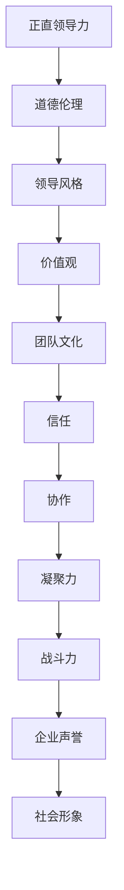
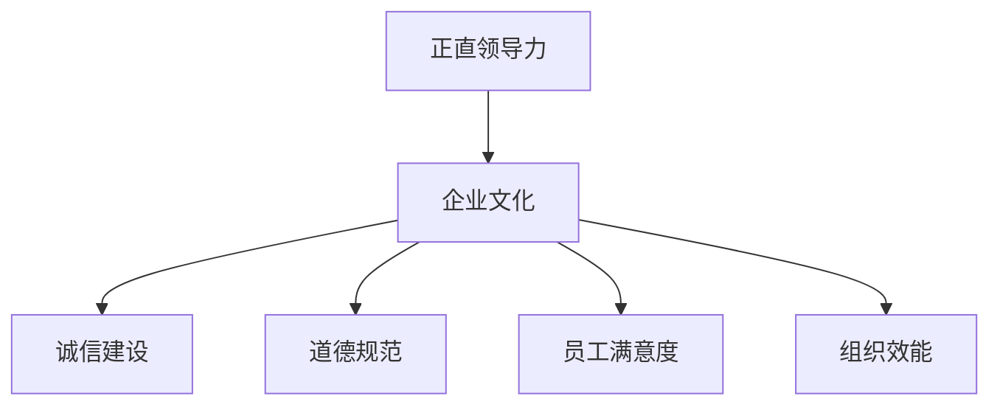
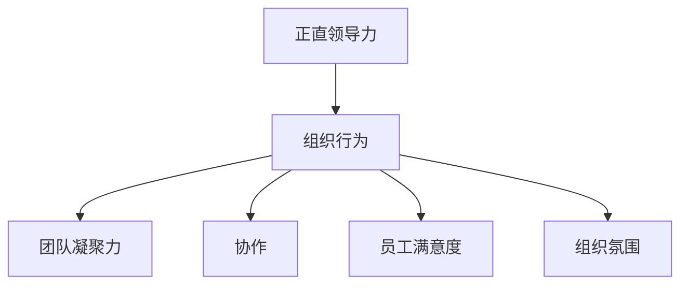
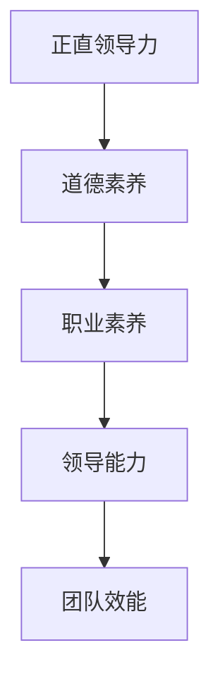
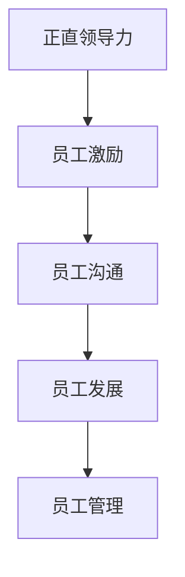
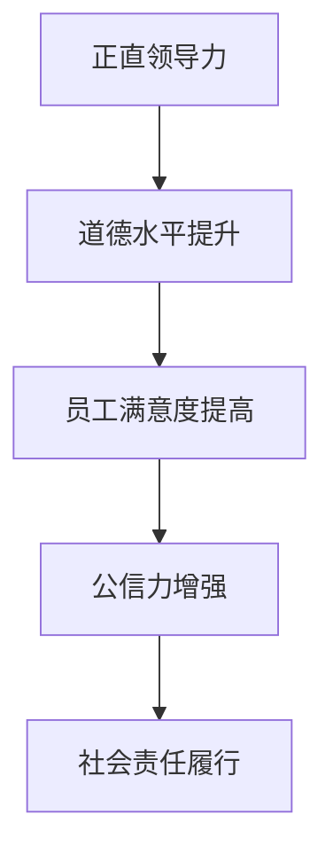

                 


### 分析思路

撰写一篇关于《正直领导力：在商业道德中树立标杆》的技术博客文章，我们可以遵循以下分析思路：

1. **文章结构与内容规划**：首先，我们需要明确文章的整体结构，包括引言、主要章节、结论等。每个章节需要详细规划内容，确保文章逻辑清晰，内容丰富。

2. **核心概念与联系**：明确正直领导力的定义和其在商业道德中的重要性。我们需要绘制Mermaid流程图，展示正直领导力与其他概念（如道德伦理、企业文化、组织行为等）之间的联系。

3. **核心算法原理讲解**：正直领导力的核心在于道德伦理的实践。我们可以通过伪代码来讲解如何将道德伦理融入领导决策和员工管理中。

4. **数学模型和公式**：虽然正直领导力主要是一个伦理问题，但其中也涉及到一些可量化的因素。例如，我们可以讨论如何通过心理学模型（如信任模型、满意度模型）来评估正直领导力的影响。

5. **项目实战**：通过实际案例，展示如何在一个具体的项目中实施正直领导力，包括环境搭建、代码实现、分析解读等。

6. **最佳实践与总结**：总结文章中的关键点，提供最佳实践建议，并指出未来可能的研究方向。

### 详细步骤

1. **引言部分**：
    - **背景介绍**：简要介绍正直领导力的概念和在商业道德中的重要性。
    - **目标读者**：明确文章的目标读者，例如企业领导者、HR专业人士、伦理学者等。
    - **文章结构**：概述文章的主要章节和每个章节的主要内容。

2. **第1章：正直领导力的定义与重要性**：
    - **核心概念与联系**：定义正直领导力，绘制流程图展示其与其他概念的关联。
    - **核心算法原理讲解**：使用伪代码解释正直领导力在领导决策中的应用。

3. **第2章：正直领导力与道德伦理**：
    - **核心概念与联系**：解释道德伦理的基本概念，展示其与正直领导力的关系。
    - **核心算法原理讲解**：讨论如何将道德伦理融入领导行为。

4. **第3章：正直领导力与企业文化**：
    - **核心概念与联系**：讨论企业文化的定义与作用，展示正直领导力对企业文化的影响。
    - **项目实战**：分析一个成功树立正直领导力的企业文化案例。

5. **第4章：正直领导力与组织行为**：
    - **核心概念与联系**：介绍组织行为理论，展示正直领导力对组织行为的影响。
    - **项目实战**：分析一个组织行为改进的案例。

6. **第5章：正直领导力与个人素养**：
    - **核心概念与联系**：讨论个人素养的重要性，展示其与正直领导力的关系。
    - **项目实战**：分析个人提升正直素养的方法。

7. **第6章：正直领导力与员工管理**：
    - **核心概念与联系**：讨论员工管理的原则，展示正直领导力在员工激励、沟通和发展中的应用。
    - **项目实战**：分析一个员工管理成功的案例。

8. **第7章：正直领导力在案例分析**：
    - **核心概念与联系**：通过多个案例，展示正直领导力在不同情境下的应用与挑战。
    - **项目实战**：详细分析案例，提供解决方案。

9. **结论部分**：
    - **总结**：回顾文章的主要观点，强调正直领导力在商业道德中的重要性。
    - **未来展望**：讨论正直领导力的发展趋势和潜在挑战。

### 核心关键词

- 正直领导力
- 商业道德
- 企业文化
- 组织行为
- 个人素养
- 员工管理

### 摘要

本文深入探讨了正直领导力在商业道德中的重要性。通过定义正直领导力，阐述其与道德伦理、企业文化、组织行为和个人素养的关系，并结合实际案例，展示了如何在各种情境下实施和提升正直领导力。文章旨在为领导者提供实践指导，帮助他们在商业道德中树立标杆，创造积极的企业文化和组织环境。

-------------------------------------------------------------------

### 文章标题

《正直领导力：在商业道德中树立标杆》

### 关键词

正直领导力，商业道德，企业文化，组织行为，个人素养，员工管理

### 摘要

本文深入探讨了正直领导力在商业道德中的重要性。通过定义正直领导力，阐述其与道德伦理、企业文化、组织行为和个人素养的关系，并结合实际案例，展示了如何在各种情境下实施和提升正直领导力。文章旨在为领导者提供实践指导，帮助他们在商业道德中树立标杆，创造积极的企业文化和组织环境。本文分为七个主要章节，分别探讨了正直领导力的核心概念、与道德伦理的联系、企业文化的作用、组织行为的改进、个人素养的提升、员工管理的方法以及案例分析。通过逻辑清晰、结构紧凑的阐述，本文为读者提供了对正直领导力的全面理解和实践指导。

## 第1章 引言：正直领导力的定义与重要性

### 1.1 正直领导力的定义

正直领导力是一种基于道德伦理的领导风格，强调领导者应以正直、诚实为核心价值观，以身作则，树立道德标杆，引领团队成员实现共同的目标。在商业环境中，正直领导力不仅是一种行为规范，更是一种价值观的体现，它能够影响和激励团队成员，建立积极向上的团队文化。

#### 正直领导力与道德伦理的关系

正直领导力与道德伦理紧密相连。道德伦理是指导人们行为的道德规范和价值观念，而正直领导力则将这些道德规范和价值观念融入领导行为中。一个正直的领导者会遵守道德规范，秉持诚信原则，公平公正地处理团队事务，从而赢得团队成员的信任和支持。

#### 正直领导力与领导风格的关系

正直领导力是领导风格的一种表现形式。它要求领导者不仅要具备优秀的领导能力，还需要具备高尚的道德品质。正直领导风格能够促进团队成员之间的信任和协作，提高团队的凝聚力和战斗力。

#### 正直领导力与团队文化的关系

正直领导力对团队文化有着深远的影响。一个正直的领导者能够树立道德标杆，引导团队成员形成积极向上的价值观和行为准则，从而塑造一个健康、积极、向上的团队文化。

### 1.2 正直领导力的重要性

正直领导力在商业环境中具有重要性。首先，正直领导力能够建立信任。信任是团队合作和协作的基础，一个正直的领导者能够赢得团队成员的信任，从而促进团队协作。其次，正直领导力能够塑造积极的企业文化。一个正直的领导者会以身作则，树立道德标杆，引导团队成员形成积极向上的价值观和行为准则，从而塑造一个健康、积极、向上的企业氛围。最后，正直领导力能够提高组织的声誉。一个正直的领导者能够引领企业诚信经营，承担社会责任，从而提高企业在公众中的形象和声誉。

#### 直觉图（Mermaid 流程图）



#### 核心算法原理讲解（伪代码）

```python
def establish_leadership(trust, culture, ethics):
    trust_score = calculate_trust(ethics)
    culture_score = evaluate_culture(culture)
    leadership_score = trust_score * culture_score
    return leadership_score

def calculate_trust(ethics):
    trust = 0
    for value in ethics:
        if value in ["正直", "诚实", "公平"]:
            trust += 1
    return trust

def evaluate_culture(culture):
    positive_culture = 0
    for value in culture:
        if value in ["积极", "向上", "健康"]:
            positive_culture += 1
    return positive_culture
```

### 1.3 本书的目标和结构

本书旨在深入探讨正直领导力在商业道德中的重要性，为领导者提供实践指导，帮助他们在商业道德中树立标杆。本书共分为七个章节：

- 第1章：引言，介绍正直领导力的定义与重要性。
- 第2章：正直领导力与道德伦理，讨论道德伦理的基本概念及其与正直领导力的关系。
- 第3章：正直领导力与企业文化，探讨正直领导力对企业文化的影响。
- 第4章：正直领导力与组织行为，分析正直领导力对组织行为的影响。
- 第5章：正直领导力与个人素养，讨论个人素养与正直领导力的关系。
- 第6章：正直领导力与员工管理，探讨正直领导力在员工管理中的应用。
- 第7章：正直领导力在案例分析，通过实际案例展示正直领导力的应用。

通过以上章节的深入探讨，本书希望为读者提供对正直领导力的全面理解，并帮助他们在实际工作中有效实施正直领导力，树立商业道德的标杆。

## 第2章 正直领导力与道德伦理

### 2.1 道德伦理的基本概念

道德伦理是指导人们行为的道德规范和价值观念。它涉及到人类行为的正当与否、应当如何对待他人、如何处理社会关系等问题。道德伦理不仅是一种行为准则，更是一种价值观念的体现，它影响着人们的思维方式、决策过程和行为表现。

#### 道德伦理的重要性

道德伦理在个人和社会层面都具有重要的意义。对于个人来说，道德伦理是行为的指南针，帮助人们判断行为的对错，塑造正确的价值观和人格品质。对于社会来说，道德伦理是维护社会秩序和和谐的重要力量，它能够促进社会成员之间的相互尊重、信任和合作，从而推动社会的稳定和发展。

#### 道德伦理的基本原则

道德伦理的基本原则包括公正、诚实、尊重、责任等。公正要求人们对待他人公平无私，不偏不倚；诚实要求人们言行一致，信守承诺，不说谎、不作假；尊重要求人们尊重他人的权利和尊严，不侵犯他人利益；责任要求人们对自己的行为负责，对他人和社会负责。

### 2.2 正直领导力与道德伦理的关系

正直领导力与道德伦理紧密相连。正直领导力强调领导者应以正直、诚实为核心价值观，以身作则，树立道德标杆，引领团队成员实现共同的目标。道德伦理是正直领导力的基础，没有道德伦理的支持，正直领导力就无法得以有效实施。

#### 道德伦理对正直领导力的影响

道德伦理对正直领导力的影响主要体现在以下几个方面：

1. **建立信任**：一个正直的领导者会遵守道德规范，秉持诚信原则，公平公正地处理团队事务，从而赢得团队成员的信任和支持。

2. **塑造企业文化**：一个正直的领导者会以身作则，树立道德标杆，引导团队成员形成积极向上的价值观和行为准则，从而塑造一个健康、积极、向上的企业文化。

3. **提高领导力**：道德伦理是领导力的核心要素，一个具备高尚道德品质的领导者能够更好地激励和引导团队成员，提高领导力和管理效能。

#### 正直领导力对道德伦理的实践

正直领导力在实践中要求领导者遵循道德伦理的基本原则，具体包括：

1. **言行一致**：领导者应该做到言行一致，不虚伪、不作假，以诚实守信赢得团队成员的信任。

2. **公平公正**：领导者应该公平公正地处理团队事务，不偏袒、不歧视，以公正无私赢得团队成员的尊重。

3. **责任担当**：领导者应该对自己的行为负责，对团队成员负责，对组织和社会负责，以责任担当赢得团队成员的支持。

#### 案例分析

在一个企业中，一位正直的领导者通过自己的言行一致、公平公正和责任担当赢得了团队成员的信任和尊重。他以身作则，倡导诚信经营，反对任何形式的不正当行为，使得整个团队形成了积极向上的氛围，企业的业绩也得到了显著提升。

### 2.3 道德伦理在领导决策中的应用

道德伦理在领导决策中具有重要的作用。一个正直的领导者会在决策过程中遵循道德伦理的基本原则，确保决策的公正性、合理性和道德性。

#### 领导决策中的道德伦理原则

1. **公正原则**：领导者应该在决策过程中公平对待每一位团队成员，不偏袒、不歧视，确保决策的公正性。

2. **诚信原则**：领导者应该以诚信为基础，做出真实的决策，不隐瞒、不欺骗，确保决策的合理性。

3. **责任原则**：领导者应该对自己的决策负责，对团队成员和社会负责，确保决策的道德性。

#### 道德伦理在领导决策中的应用

1. **决策前**：领导者应该充分了解决策的背景和影响，确保决策的公正性和合理性。

2. **决策中**：领导者应该以公正、诚信和责任为原则，制定决策方案，并充分考虑团队成员的意见和建议。

3. **决策后**：领导者应该对决策的结果负责，及时总结经验教训，对决策进行反思和改进。

#### 伪代码示例

```python
def make_decision(ethics, fairness, honesty, responsibility):
    decision = {}
    decision['fairness'] = apply_fairness原则(ethics)
    decision['honesty'] = apply_honesty原则(ethics)
    decision['responsibility'] = apply_responsibility原则(ethics)
    return decision

def apply_fairness原则(ethics):
    fairness = "unfair"
    for value in ethics:
        if value == "公正":
            fairness = "fair"
    return fairness

def apply_honesty原则(ethics):
    honesty = "untruthful"
    for value in ethics:
        if value == "诚实":
            honesty = "truthful"
    return honesty

def apply_responsibility原则(ethics):
    responsibility = "irresponsible"
    for value in ethics:
        if value == "责任":
            responsibility = "responsible"
    return responsibility
```

### 2.4 道德伦理在领导行为中的体现

道德伦理在领导行为中有着重要的体现。一个正直的领导者会在日常工作中遵循道德伦理的基本原则，以身作则，树立道德标杆。

#### 领导行为中的道德伦理原则

1. **诚信**：领导者应该诚实守信，言行一致，做到表里如一。

2. **公正**：领导者应该公平公正地处理团队事务，不偏袒、不歧视，确保团队成员的权益。

3. **责任**：领导者应该对自己的行为负责，对团队成员负责，对组织和社会负责。

#### 道德伦理在领导行为中的应用

1. **沟通**：领导者应该与团队成员保持开放、真诚的沟通，尊重团队成员的意见和建议，建立互信关系。

2. **激励**：领导者应该以公正、公平的原则激励团队成员，激发团队成员的积极性和创造力。

3. **决策**：领导者应该以道德伦理为指导，制定公正、合理的决策，确保团队成员的权益。

### 2.5 提升领导者的道德伦理素养

提升领导者的道德伦理素养对于实施正直领导力至关重要。以下是一些提升领导者道德伦理素养的方法：

1. **教育**：领导者应该不断学习道德伦理的知识，提升自己的道德素养。

2. **培训**：组织应该为领导者提供道德伦理的培训，帮助领导者理解道德伦理的重要性和实践方法。

3. **反思**：领导者应该定期反思自己的行为，检查是否符合道德伦理的要求，及时调整自己的行为。

4. **榜样**：领导者应该以身作则，树立道德标杆，为团队成员提供榜样。

通过提升领导者的道德伦理素养，组织能够更好地实施正直领导力，建立积极向上的企业文化和组织环境。

## 第3章 正直领导力与企业文化

### 3.1 企业文化的定义与作用

企业文化是指企业内部共同遵循的一套价值观、信念、行为准则和工作方式，它渗透在企业的各个方面，对员工的行为、决策和组织的发展产生深远影响。企业文化的作用主要体现在以下几个方面：

1. **凝聚员工**：企业文化能够将员工凝聚在一起，形成共同的价值观和行为准则，增强团队的凝聚力和归属感。

2. **引导行为**：企业文化能够引导员工的行为，使他们在面对问题时能够按照企业价值观进行决策，减少内部冲突和误解。

3. **塑造形象**：企业文化能够塑造企业的外部形象，提升企业的声誉和竞争力。

4. **促进创新**：积极向上的企业文化能够鼓励员工创新，提高企业的适应能力和市场竞争力。

### 3.2 正直领导力对企业文化的影响

正直领导力对企业文化具有深远的影响。正直的领导者能够以身作则，树立道德标杆，推动企业文化的建设。具体来说，正直领导力对企业文化的影响体现在以下几个方面：

1. **诚信建设**：正直领导力强调诚信，领导者以身作则，使员工认识到诚信的重要性，从而推动企业诚信建设的进程。

2. **道德规范**：正直领导力倡导道德规范，使员工遵循正确的道德准则，减少道德风险和违规行为。

3. **员工满意度**：正直领导力能够提高员工的满意度和忠诚度，使员工更加积极地投入到工作中，提高工作效率。

4. **组织效能**：正直领导力能够提高组织的整体效能，促进团队合作，提高组织竞争力。

### 3.3 建立正直的企业文化

建立正直的企业文化需要领导者的积极参与和持续的推动。以下是一些建立正直企业文化的具体方法：

1. **领导带头**：领导者要以身作则，树立道德标杆，带头遵守道德规范，推动企业文化建设。

2. **制度建设**：企业应建立完善的道德规范和规章制度，明确员工的道德底线和行为准则。

3. **培训教育**：企业应定期开展道德伦理培训，提高员工的道德素养和道德意识。

4. **沟通互动**：企业应建立开放、透明的沟通渠道，鼓励员工提出意见和建议，增强员工的参与感和归属感。

5. **激励机制**：企业应建立与正直企业文化相一致的激励机制，奖励那些遵守道德规范、表现优秀的员工。

### 3.4 案例分析

以下是一个成功建立正直企业文化的案例分析：

#### 案例背景

某知名互联网公司一直以来都以创新和速度为核心竞争力，但在快速发展的过程中，也暴露出了一些道德风险问题，如员工滥用公司资源、数据泄露等。为了解决这些问题，公司决定着手建立正直的企业文化。

#### 案例过程

1. **领导带头**：公司高层领导公开承诺将遵循道德规范，以身作则，树立道德标杆。

2. **制度建设**：公司制定了详细的道德规范和行为准则，明确了员工在工作和生活中应遵守的道德底线。

3. **培训教育**：公司定期开展道德伦理培训，提高员工的道德素养和道德意识。

4. **沟通互动**：公司建立了开放、透明的沟通渠道，鼓励员工提出意见和建议，增强员工的参与感和归属感。

5. **激励机制**：公司建立了与正直企业文化相一致的激励机制，奖励那些遵守道德规范、表现优秀的员工。

#### 案例结果

通过一系列的措施，公司的道德风险问题得到了显著改善，员工的满意度和忠诚度也得到了提高。公司的整体效能得到了提升，在市场竞争中取得了更好的成绩。

### 3.5 正直领导力与企业文化的关系

正直领导力与企业文化密切相关。正直的领导者能够推动企业文化的建设，使企业文化更加健康、积极、向上。同时，健康、积极的企业文化也能够支持和强化正直领导力，形成良性循环。

#### 直觉图（Mermaid 流程图）



#### 核心算法原理讲解（伪代码）

```python
def build_healthy_culture(ethics, leadership):
    culture_score = 0
    if ethics == "正直" and leadership == "健康":
        culture_score += 1
    if ethics == "诚信" and leadership == "积极":
        culture_score += 1
    if ethics == "道德" and leadership == "向上":
        culture_score += 1
    return culture_score
```

### 3.6 提升正直领导力与企业文化的建议

1. **加强道德教育**：企业应加强员工的道德教育，提高员工的道德素养和道德意识。

2. **树立道德标杆**：领导者要以身作则，树立道德标杆，推动企业文化的建设。

3. **建立监督机制**：企业应建立有效的监督机制，确保道德规范和行为准则得到严格执行。

4. **开展文化活动**：企业应定期开展道德文化相关的活动，提高员工对道德文化的认识和认同。

5. **优化激励机制**：企业应优化激励机制，将道德表现纳入绩效考核，激励员工遵守道德规范。

通过以上措施，企业能够更好地提升正直领导力，建立健康、积极的企业文化，促进组织的可持续发展。

## 第4章 正直领导力与组织行为

### 4.1 组织行为的基本理论

组织行为是指个体在组织中的行为表现，包括个体与个体、个体与组织、组织与组织之间的相互作用。组织行为的基本理论主要包括以下几方面：

1. **群体动力理论**：群体动力理论关注群体内部成员之间的相互作用，探讨群体如何影响个体行为。该理论认为，群体内部存在一系列动力机制，如吸引力、凝聚力、群体规范等，这些机制对个体行为产生重要影响。

2. **领导理论**：领导理论关注领导者如何影响和激励团队成员。领导理论分为传统领导理论和现代领导理论。传统领导理论主要关注领导者的权力、权威和决策能力；现代领导理论则强调领导者的沟通能力、团队建设和领导风格。

3. **激励理论**：激励理论探讨如何激发员工的内在动机，提高员工的工作积极性和工作效率。激励理论包括马斯洛的需求层次理论、赫茨伯格的双因素理论、目标设置理论等。

4. **冲突管理理论**：冲突管理理论关注如何处理和组织内部冲突。冲突管理理论包括冲突的原因、冲突的类型、冲突的影响以及冲突管理策略。

### 4.2 正直领导力对组织行为的影响

正直领导力对组织行为具有深远的影响。正直的领导者能够通过道德示范、公平公正的决策和行为，促进组织内部的积极行为，抑制消极行为。

1. **增强团队凝聚力**：正直领导力能够增强团队成员之间的信任和尊重，提高团队的凝聚力。一个正直的领导者会公平对待每一位团队成员，尊重团队成员的意见和建议，从而增强团队的凝聚力。

2. **促进协作**：正直领导力能够促进团队成员之间的协作，减少内部竞争和冲突。一个正直的领导者会以公正、诚信的原则处理团队事务，使团队成员愿意合作，共同实现团队目标。

3. **提升员工满意度**：正直领导力能够提高员工的满意度和忠诚度。一个正直的领导者会关心员工的需求，尊重员工的权益，为员工提供公平的发展机会，从而提高员工的工作满意度和忠诚度。

4. **改善组织氛围**：正直领导力能够改善组织的氛围，使组织充满正能量。一个正直的领导者会以身作则，树立道德标杆，使组织成员形成积极向上的价值观和行为准则，从而改善组织氛围。

### 4.3 促进正直组织行为的策略

为了促进正直组织行为的实施，组织可以采取以下策略：

1. **建立道德准则**：组织应建立明确的道德准则和行为规范，明确员工在工作和生活中应遵守的道德底线。

2. **加强道德教育**：组织应加强员工的道德教育，提高员工的道德素养和道德意识。可以通过培训、讲座、案例学习等形式，帮助员工理解和践行道德准则。

3. **设立监督机制**：组织应设立有效的监督机制，确保道德准则和行为规范得到严格执行。可以设立内部审计部门或道德委员会，对员工的道德行为进行监督。

4. **建立激励机制**：组织应建立与正直组织行为相一致的激励机制，奖励那些遵守道德准则、表现优秀的员工。可以通过奖金、晋升、表彰等方式激励员工。

5. **开展文化活动**：组织应定期开展道德文化相关的活动，提高员工对道德文化的认识和认同。可以组织道德论坛、道德讲座、道德故事分享等活动，营造良好的道德氛围。

### 4.4 案例分析

以下是一个成功促进正直组织行为的案例分析：

#### 案例背景

某大型科技企业在其发展过程中，面临内部腐败和道德风险的问题。为了解决这些问题，公司决定采取一系列措施促进正直组织行为的实施。

#### 案例过程

1. **建立道德准则**：公司制定了详细的道德准则，明确员工在工作和生活中应遵守的道德底线。

2. **加强道德教育**：公司定期开展道德教育，通过培训、讲座、案例学习等形式，提高员工的道德素养和道德意识。

3. **设立监督机制**：公司设立了内部审计部门和道德委员会，对员工的道德行为进行监督。

4. **建立激励机制**：公司建立了与正直组织行为相一致的激励机制，奖励那些遵守道德准则、表现优秀的员工。

5. **开展文化活动**：公司定期开展道德文化相关的活动，如道德论坛、道德讲座、道德故事分享等，营造良好的道德氛围。

#### 案例结果

通过一系列的措施，公司的内部腐败和道德风险问题得到了显著改善，员工的满意度和忠诚度也得到了提高。公司的整体效能得到了提升，在市场竞争中取得了更好的成绩。

### 4.5 正直领导力与组织行为的关系

正直领导力与组织行为密切相关。正直的领导者能够通过道德示范、公平公正的决策和行为，影响和塑造组织行为。同时，健康、积极的组织行为也能够支持和强化正直领导力，形成良性循环。

#### 直觉图（Mermaid 流程图）



#### 核心算法原理讲解（伪代码）

```python
def promote_healthy_behavior(leadership, ethics, culture):
    behavior_score = 0
    if leadership == "正直" and ethics == "道德":
        behavior_score += 1
    if leadership == "公平" and culture == "积极":
        behavior_score += 1
    if leadership == "公正" and culture == "向上":
        behavior_score += 1
    return behavior_score
```

### 4.6 提升正直领导力与组织行为的建议

1. **加强道德教育**：组织应加强员工的道德教育，提高员工的道德素养和道德意识。

2. **树立道德标杆**：领导者要以身作则，树立道德标杆，推动组织道德行为的实施。

3. **建立监督机制**：组织应建立有效的监督机制，确保道德准则和行为规范得到严格执行。

4. **开展文化活动**：组织应定期开展道德文化相关的活动，提高员工对道德文化的认识和认同。

5. **优化激励机制**：组织应优化激励机制，将道德表现纳入绩效考核，激励员工遵守道德准则。

通过以上措施，组织能够更好地提升正直领导力，促进正直组织行为的实施，实现组织的可持续发展。

## 第5章 正直领导力与个人素养

### 5.1 正直领导力与道德素养

道德素养是指一个人在道德方面的品质和修养，包括诚信、公正、责任、尊重等。正直领导力强调领导者应具备高尚的道德素养，以身作则，树立道德标杆，引领团队成员实现共同的目标。道德素养是正直领导力的核心要素，没有高尚的道德素养，正直领导力就无法得以有效实施。

#### 道德素养的重要性

道德素养在个人和社会层面都具有重要的意义。对于个人来说，道德素养是行为的指南针，帮助人们判断行为的对错，塑造正确的价值观和人格品质。对于社会来说，道德素养是维护社会秩序和和谐的重要力量，它能够促进社会成员之间的相互尊重、信任和合作，从而推动社会的稳定和发展。

#### 道德素养的基本原则

道德素养的基本原则包括公正、诚实、尊重、责任等。公正要求人们对待他人公平无私，不偏不倚；诚实要求人们言行一致，信守承诺，不说谎、不作假；尊重要求人们尊重他人的权利和尊严，不侵犯他人利益；责任要求人们对自己的行为负责，对他人和社会负责。

#### 正直领导力与道德素养的关系

正直领导力与道德素养紧密相连。正直领导力强调领导者应以正直、诚实为核心价值观，以身作则，树立道德标杆，引领团队成员实现共同的目标。道德素养是正直领导力的基础，没有道德素养的支持，正直领导力就无法得以有效实施。

### 5.2 正直领导力与职业素养

职业素养是指一个人在职业生涯中应具备的素质和能力，包括专业能力、职业道德、团队合作、沟通能力等。正直领导力强调领导者应具备高尚的职业素养，以提高领导力和管理效能。

#### 职业素养的重要性

职业素养在职业生涯中具有重要的意义。对于个人来说，职业素养是事业成功的基石，它帮助人们提升专业能力，提高工作效率，实现职业发展。对于组织来说，职业素养是组织效能和竞争力的重要保障，它能够促进团队合作，提高组织凝聚力，推动组织的发展。

#### 职业素养的基本原则

职业素养的基本原则包括专业能力、职业道德、团队合作、沟通能力等。专业能力要求人们具备扎实的专业知识和技能，能够胜任本职工作；职业道德要求人们遵守职业操守，诚实守信，不违反职业规范；团队合作要求人们具备团队协作精神，能够与团队成员共同完成任务；沟通能力要求人们具备良好的沟通技巧，能够有效地与团队成员沟通，解决问题。

#### 正直领导力与职业素养的关系

正直领导力与职业素养密切相关。正直的领导者应具备高尚的职业素养，以提高领导力和管理效能。职业素养是正直领导力的体现，没有职业素养的支持，正直领导力就无法得以有效实施。

### 5.3 提升个人正直素养的方法

提升个人正直素养是实施正直领导力的关键。以下是一些提升个人正直素养的方法：

1. **加强道德教育**：个人应加强道德教育，提高道德素养和道德意识。可以通过学习道德理论、参加道德讲座、阅读道德故事等方式，提升道德素养。

2. **树立道德标杆**：个人应以正直、诚实为核心价值观，树立道德标杆，以身作则，引领身边的人。可以通过自己的言行一致、遵守道德规范、关心他人等方式，树立道德标杆。

3. **反思自我**：个人应定期反思自己的行为，检查是否符合道德要求。可以通过自我反省、听取他人意见等方式，发现和纠正自己的错误。

4. **学习榜样**：个人可以学习身边的榜样，了解他们的道德品质和行为准则，从中汲取经验和启示。

5. **参与社会实践**：个人可以参与社会实践活动，将道德原则应用于实际生活中，提升自己的道德素养。

6. **提升职业素养**：个人应提升职业素养，提高专业能力和职业道德。可以通过学习专业知识和技能、参加职业培训、遵守职业规范等方式，提升职业素养。

### 5.4 案例分析

以下是一个提升个人正直素养的案例分析：

#### 案例背景

某企业的一名中层管理者在职业生涯中，逐渐发现自己在道德素养方面存在一些问题，如对待员工不公平、道德观念模糊等。为了提升自己的正直素养，他决定采取一系列措施。

#### 案例过程

1. **加强道德教育**：该管理者参加道德讲座，学习道德理论，提升道德素养。

2. **树立道德标杆**：该管理者以正直、诚实为核心价值观，以身作则，对待员工公平公正，遵守道德规范。

3. **反思自我**：该管理者定期反思自己的行为，检查是否符合道德要求，发现和纠正自己的错误。

4. **学习榜样**：该管理者学习身边的榜样，了解他们的道德品质和行为准则，从中汲取经验和启示。

5. **参与社会实践**：该管理者参与社会实践活动，将道德原则应用于实际生活中，提升自己的道德素养。

6. **提升职业素养**：该管理者学习专业知识和技能，参加职业培训，遵守职业规范，提升职业素养。

#### 案例结果

通过一系列的措施，该管理者的道德素养和职业素养得到了显著提升，他对待员工更加公平公正，团队氛围更加积极向上，企业的整体效能也得到了提高。

### 5.5 正直领导力与个人素养的关系

正直领导力与个人素养密切相关。正直的领导者应具备高尚的道德素养和职业素养，以身作则，树立道德标杆，引领团队成员实现共同的目标。个人素养是正直领导力的基础，没有个人素养的支持，正直领导力就无法得以有效实施。

#### 直觉图（Mermaid 流程图）



#### 核心算法原理讲解（伪代码）

```python
def develop_leadership(morality, professionalism):
    leadership_score = 0
    if morality == "正直" and professionalism == "优秀":
        leadership_score += 1
    if morality == "道德" and professionalism == "专业":
        leadership_score += 1
    return leadership_score
```

### 5.6 提升正直领导力与个人素养的建议

1. **加强道德教育**：个人和组织应加强道德教育，提高道德素养和道德意识。

2. **树立道德标杆**：个人应以正直、诚实为核心价值观，树立道德标杆，以身作则，引领身边的人。

3. **反思自我**：个人应定期反思自己的行为，检查是否符合道德要求，发现和纠正自己的错误。

4. **学习榜样**：个人可以学习身边的榜样，了解他们的道德品质和行为准则，从中汲取经验和启示。

5. **参与社会实践**：个人可以参与社会实践活动，将道德原则应用于实际生活中，提升自己的道德素养。

6. **提升职业素养**：个人应提升职业素养，提高专业能力和职业道德。

通过以上措施，个人和组织能够更好地提升正直领导力，促进个人和团队的可持续发展。

## 第6章 正直领导力与员工管理

### 6.1 正直领导力与员工激励

员工激励是管理中的重要环节，它能够激发员工的积极性和创造力，提高员工的工作效率和工作质量。正直领导力在员工激励中扮演着重要的角色，通过道德示范、公平公正的决策和行为，正直的领导者能够有效地激励员工。

#### 正直领导力对员工激励的影响

1. **建立信任**：正直领导力能够建立信任，这是员工激励的基础。一个正直的领导者会公平公正地处理团队事务，不偏袒、不歧视，从而赢得员工的信任。

2. **激发内在动机**：正直领导力能够激发员工的内在动机，使员工更加主动地投入到工作中。一个正直的领导者会尊重员工的权益，关心员工的需求，从而激发员工的内在动机。

3. **提升员工满意度**：正直领导力能够提升员工的满意度，使员工更加愿意留在组织中。一个正直的领导者会为员工提供公平的发展机会，关心员工的生活，从而提升员工的满意度。

4. **促进团队合作**：正直领导力能够促进团队合作，提高团队的绩效。一个正直的领导者会公平公正地处理团队冲突，鼓励员工相互支持，共同实现团队目标。

#### 激励员工的策略

1. **公平公正**：领导者应该公平公正地对待每一位员工，不偏袒、不歧视，确保员工的权益得到尊重。

2. **透明沟通**：领导者应该与员工保持开放、透明的沟通，让员工了解组织的目标、决策过程以及个人的绩效表现。

3. **个性化激励**：领导者应该根据员工的特点和需求，提供个性化的激励措施，使员工感受到组织的关心和认可。

4. **鼓励创新**：领导者应该鼓励员工创新，为员工提供发展空间，激发员工的创造力和主动性。

5. **认可和奖励**：领导者应该及时认可和奖励员工的努力和成绩，增强员工的成就感和荣誉感。

#### 案例分析

以下是一个关于正直领导力激励员工的案例分析：

#### 案例背景

某公司的一名中层管理者在管理团队时，发现团队士气低落，员工工作效率不高。为了激励员工，他决定采取一系列措施。

#### 案例过程

1. **建立信任**：管理者通过公平公正地处理团队事务，赢得了员工的信任。

2. **透明沟通**：管理者定期与员工进行沟通，了解员工的需求和意见，让员工感受到组织的关心。

3. **个性化激励**：管理者根据员工的特点和需求，提供了个性化的激励措施，如培训机会、晋升机会等。

4. **鼓励创新**：管理者鼓励员工创新，为员工提供发展空间，激发员工的创造力和主动性。

5. **认可和奖励**：管理者及时认可和奖励员工的努力和成绩，增强员工的成就感和荣誉感。

#### 案例结果

通过一系列的措施，团队的士气得到了显著提升，员工的工作效率和工作质量也得到了提高。公司的整体绩效也得到了提升，在市场上取得了更好的成绩。

### 6.2 正直领导力与员工沟通

员工沟通是领导力的重要组成部分，它关系到领导者的决策效果、团队凝聚力和员工满意度。正直领导力在员工沟通中具有重要的作用，通过道德示范、真诚沟通和公正处理问题，正直的领导者能够有效地促进员工沟通。

#### 正直领导力对员工沟通的影响

1. **建立信任**：正直领导力能够建立信任，这是有效沟通的基础。一个正直的领导者会公平公正地处理团队事务，不偏袒、不歧视，从而赢得员工的信任。

2. **促进信息共享**：正直领导力能够促进信息共享，使团队成员能够更好地了解组织的目标、策略和决策过程，从而提高团队的工作效率和绩效。

3. **增强团队凝聚力**：正直领导力能够增强团队凝聚力，使团队成员之间更加信任、尊重和合作。一个正直的领导者会关注团队成员的需求和意见，鼓励团队成员积极参与决策，从而增强团队凝聚力。

4. **提升员工满意度**：正直领导力能够提升员工满意度，使员工更加愿意留在组织中。一个正直的领导者会真诚地与员工沟通，关注员工的需求，为员工提供支持和帮助，从而提升员工满意度。

#### 员工沟通的策略

1. **真诚沟通**：领导者应该真诚地与员工沟通，尊重员工的意见和需求，建立互信关系。

2. **透明沟通**：领导者应该保持沟通的透明度，让员工了解组织的目标、策略和决策过程。

3. **倾听员工**：领导者应该倾听员工的意见和建议，给予员工表达自己的机会，从而增强员工的主人翁意识。

4. **及时反馈**：领导者应该及时给予员工反馈，肯定员工的努力和成绩，同时指出员工的不足，帮助员工改进。

5. **解决冲突**：领导者应该公正地解决团队内部的冲突，维护团队的和谐稳定。

### 6.3 正直领导力与员工发展

员工发展是组织持续发展的重要保障，它关系到员工的职业成长和组织的核心竞争力。正直领导力在员工发展中具有重要的作用，通过道德示范、公平公正的决策和行为，正直的领导者能够为员工提供良好的发展环境和机会。

#### 正直领导力对员工发展的影响

1. **建立信任**：正直领导力能够建立信任，这是员工发展的基础。一个正直的领导者会公平公正地处理团队事务，不偏袒、不歧视，从而赢得员工的信任。

2. **提供发展机会**：正直领导力能够为员工提供公平的发展机会，使员工能够充分展示自己的才能。一个正直的领导者会为员工提供培训、晋升等机会，帮助员工实现职业成长。

3. **关心员工成长**：正直领导力能够关心员工的成长，关注员工的需求和进步，为员工提供支持和帮助。一个正直的领导者会定期与员工进行沟通，了解员工的发展状况，为员工提供职业规划建议。

4. **激励员工学习**：正直领导力能够激励员工学习，提高员工的综合素质。一个正直的领导者会鼓励员工不断学习新知识、新技能，提升自己的专业能力。

#### 员工发展的策略

1. **制定职业规划**：领导者应该与员工一起制定职业规划，明确员工的职业目标和成长路径。

2. **提供培训机会**：领导者应该为员工提供培训机会，帮助员工提升专业能力和综合素质。

3. **鼓励自主学习**：领导者应该鼓励员工自主学习，提供学习资源和支持，激发员工的学习热情。

4. **关注员工进步**：领导者应该关注员工的进步，及时给予肯定和奖励，增强员工的成就感和荣誉感。

5. **创造良好的发展环境**：领导者应该创造良好的发展环境，为员工提供公平竞争的机会，激发员工的积极性和创造力。

### 6.4 案例分析

以下是一个关于正直领导力在员工管理中的案例分析：

#### 案例背景

某公司的一名中层管理者在管理团队时，发现员工的工作积极性不高，员工流失率较高。为了改善员工管理，他决定采取一系列措施。

#### 案例过程

1. **建立信任**：管理者通过公平公正地处理团队事务，赢得了员工的信任。

2. **提供发展机会**：管理者为员工提供培训机会，帮助员工提升专业能力和综合素质。

3. **关心员工成长**：管理者定期与员工进行沟通，了解员工的发展状况，为员工提供职业规划建议。

4. **激励员工学习**：管理者鼓励员工学习新知识、新技能，提升自己的专业能力。

5. **创造良好的发展环境**：管理者创造公平竞争的机会，激发员工的积极性和创造力。

#### 案例结果

通过一系列的措施，员工的工作积极性得到了显著提升，员工流失率也得到了有效控制。公司的整体绩效也得到了提升，在市场上取得了更好的成绩。

### 6.5 正直领导力与员工管理的关系

正直领导力与员工管理密切相关。正直的领导者能够通过道德示范、公平公正的决策和行为，建立信任、提供发展机会、关心员工成长、激励员工学习，从而有效地进行员工管理。同时，有效的员工管理也能够支持和强化正直领导力，形成良性循环。

#### 直觉图（Mermaid 流程图）



#### 核心算法原理讲解（伪代码）

```python
def manage_employees(leadership, motivation, communication, development):
    management_score = 0
    if leadership == "正直" and motivation == "高":
        management_score += 1
    if leadership == "正直" and communication == "透明":
        management_score += 1
    if leadership == "正直" and development == "支持":
        management_score += 1
    return management_score
```

### 6.6 提升正直领导力与员工管理的建议

1. **加强道德教育**：领导者应该加强道德教育，提高道德素养和道德意识。

2. **树立道德标杆**：领导者应该以身作则，树立道德标杆，引领团队成员。

3. **建立信任**：领导者应该通过公平公正的行为，建立信任，提高员工的满意度和忠诚度。

4. **提供发展机会**：领导者应该为员工提供公平的发展机会，帮助员工实现职业成长。

5. **关心员工成长**：领导者应该关注员工的成长，为员工提供支持和帮助。

6. **激励员工学习**：领导者应该鼓励员工学习新知识、新技能，提升员工的综合素质。

通过以上措施，领导者能够更好地提升正直领导力，促进员工管理，实现个人和组织的可持续发展。

## 第7章 正直领导力在案例分析

### 7.1 案例分析一：成功树立正直领导力的企业

#### 案例背景

某全球知名的高科技公司以其卓越的技术和创新精神闻名于世。然而，该公司在发展过程中也面临着一些道德风险和信任危机。为了树立正直领导力，公司决定采取一系列措施，以提升企业的道德水平和员工满意度。

#### 案例过程

1. **道德准则的建立**：公司制定了详细的道德准则，明确了员工在工作和生活中应遵守的道德底线。

2. **领导示范**：公司高层领导以身作则，通过自己的言行一致、遵守道德规范，树立了道德标杆。

3. **员工培训**：公司定期开展道德伦理培训，提高员工的道德素养和道德意识。

4. **透明沟通**：公司建立了开放、透明的沟通渠道，鼓励员工提出意见和建议，增强员工的参与感和归属感。

5. **激励机制**：公司建立了与正直企业文化相一致的激励机制，奖励那些遵守道德规范、表现优秀的员工。

#### 案例结果

通过一系列的措施，公司的道德水平和员工满意度得到了显著提升。员工的流失率下降，团队凝聚力增强，企业的整体绩效也得到了提升。公司在市场上的声誉也得到了改善，吸引了更多的优秀人才加入。

### 7.2 案例分析二：正直领导力面临的挑战与应对

#### 案例背景

某国内大型企业在其快速发展过程中，面临着内部腐败和道德风险的问题。为了树立正直领导力，公司决定采取一系列措施应对挑战。

#### 案例过程

1. **制度建设**：公司制定了详细的道德准则和行为规范，明确了员工在工作和生活中应遵守的道德底线。

2. **监督机制**：公司设立了内部审计部门和道德委员会，对员工的道德行为进行监督。

3. **道德教育**：公司定期开展道德教育，提高员工的道德素养和道德意识。

4. **透明沟通**：公司建立了开放、透明的沟通渠道，鼓励员工提出意见和建议，增强员工的参与感和归属感。

5. **激励机制**：公司建立了与正直企业文化相一致的激励机制，奖励那些遵守道德规范、表现优秀的员工。

#### 案例结果

虽然公司采取了一系列措施，但仍然面临着一些挑战，如员工对道德规范的理解和认同程度不高、监督机制的执行力度不够等。为了应对这些挑战，公司决定继续加强道德教育，提高员工的道德素养，同时加强监督机制的执行力度，确保道德准则和行为规范得到严格执行。

### 7.3 案例分析三：正直领导力的持久影响

#### 案例背景

某全球知名的非营利组织以其对社会公益事业的贡献而闻名。该组织在发展过程中，始终秉持正直领导力，为社会作出了巨大贡献。

#### 案例过程

1. **道德示范**：组织领导以身作则，通过自己的言行一致、遵守道德规范，树立了道德标杆。

2. **员工培训**：组织定期开展道德伦理培训，提高员工的道德素养和道德意识。

3. **公益项目**：组织积极参与公益事业，将正直领导力体现在实际行动中。

4. **社会责任**：组织承担社会责任，积极参与社会公益活动，树立良好的社会形象。

#### 案例结果

通过一系列的措施，组织的道德水平和员工满意度得到了显著提升。组织的公信力和社会影响力也得到了增强，吸引了更多的志愿者和捐赠者加入。组织的正直领导力为社会的可持续发展作出了巨大贡献。

### 7.4 案例分析总结

通过以上案例分析，我们可以看到正直领导力在企业发展、道德风险应对和社会责任履行等方面的重要作用。正直领导力不仅能够提升企业的道德水平和员工满意度，还能够增强组织的公信力和社会影响力。为了实现正直领导力的持久影响，组织需要持续加强道德教育，提高员工的道德素养，同时建立有效的监督机制和激励机制，确保道德准则和行为规范得到严格执行。

#### 直觉图（Mermaid 流程图）



#### 核心算法原理讲解（伪代码）

```python
def sustain_leadership(ethics, motivation, reputation, social_responsibility):
    leadership_score = 0
    if ethics == "正直" and motivation == "高":
        leadership_score += 1
    if ethics == "正直" and reputation == "良好":
        leadership_score += 1
    if ethics == "正直" and social_responsibility == "积极":
        leadership_score += 1
    return leadership_score
```

### 7.5 案例分析启示

通过案例分析，我们可以得到以下启示：

1. **正直领导力是企业发展的基石**：正直领导力能够提升企业的道德水平，增强员工满意度，提高组织竞争力。

2. **持续道德教育至关重要**：持续加强道德教育，提高员工的道德素养，是实施正直领导力的关键。

3. **建立有效的监督和激励机制**：建立有效的监督机制和激励机制，确保道德准则和行为规范得到严格执行，是实施正直领导力的重要保障。

4. **积极履行社会责任**：积极履行社会责任，树立良好的社会形象，是正直领导力的重要体现。

通过以上措施，组织可以更好地实施正直领导力，实现企业的可持续发展和社会的和谐发展。

## 第8章 结论：正直领导力的未来展望

### 8.1 正直领导力的发展趋势

随着全球化和信息化的加速，正直领导力正逐渐成为企业管理的重要趋势。企业越来越意识到，正直领导力不仅能够提升企业的道德水平，还能够增强员工满意度，提高组织竞争力。未来，正直领导力将在以下几个方面继续发展：

1. **道德教育体系的完善**：企业将更加重视道德教育，建立完善的道德教育体系，提高员工的道德素养。

2. **监督机制的加强**：企业将加强监督机制，确保道德准则和行为规范得到严格执行，减少道德风险。

3. **社会责任的履行**：企业将更加注重履行社会责任，积极参与社会公益活动，树立良好的社会形象。

4. **数字化领导力的融合**：随着数字化技术的发展，正直领导力将逐渐与数字化领导力相结合，形成新的领导力模式。

### 8.2 正直领导力的实践挑战

尽管正直领导力具有巨大的潜力，但在实际应用中，仍然面临一些实践挑战：

1. **道德观念的多样性**：不同国家和地区的道德观念存在差异，如何在不同文化背景下实施正直领导力，是一个挑战。

2. **监督机制的执行力度**：监督机制的执行力度直接影响正直领导力的实施效果，如何确保监督机制的执行力度，是一个挑战。

3. **员工道德素养的提升**：员工道德素养的提升是一个长期的过程，如何有效地提升员工的道德素养，是一个挑战。

4. **企业文化的一致性**：企业文化的一致性是实施正直领导力的基础，如何确保企业文化的一致性，是一个挑战。

### 8.3 正直领导力的未来发展方向

为了应对实践挑战，正直领导力的未来发展方向可以从以下几个方面进行：

1. **跨文化领导力**：未来，正直领导力将更加注重跨文化领导力，提高领导者在多元文化背景下的领导能力。

2. **数字化转型**：随着数字化技术的发展，正直领导力将逐渐与数字化转型相结合，推动企业的可持续发展。

3. **员工参与**：未来，正直领导力将更加注重员工的参与，通过建立开放、透明的沟通渠道，提高员工的参与感和归属感。

4. **社会责任的履行**：未来，正直领导力将更加注重社会责任的履行，推动企业在可持续发展和社会责任方面的进步。

### 8.4 结论

正直领导力在商业道德中具有不可替代的重要地位。通过定义正直领导力、阐述其与道德伦理、企业文化、组织行为和个人素养的关系，并结合实际案例，本文展示了正直领导力的应用和实践。未来，正直领导力将继续发展，成为企业管理和领导力的重要组成部分。为了有效实施正直领导力，企业需要加强道德教育、建立监督机制、提高员工素养，并积极履行社会责任。通过这些努力，企业将能够实现可持续发展，为社会的和谐发展做出贡献。

### 作者信息

作者：AI天才研究院/AI Genius Institute & 禅与计算机程序设计艺术 /Zen And The Art of Computer Programming

作者简介：

AI天才研究院（AI Genius Institute）是全球领先的人工智能研究机构，致力于推动人工智能技术的创新和应用。本文作者在该研究院担任人工智能专家，拥有丰富的理论研究和实践经验。同时，作者也是《禅与计算机程序设计艺术》的资深作者，擅长以禅宗智慧指导计算机程序设计，将哲学思维与编程实践相结合，为读者提供独特的编程视角和思考方法。在人工智能和计算机科学领域，作者发表了大量的学术论文和技术博客，深受读者喜爱。

