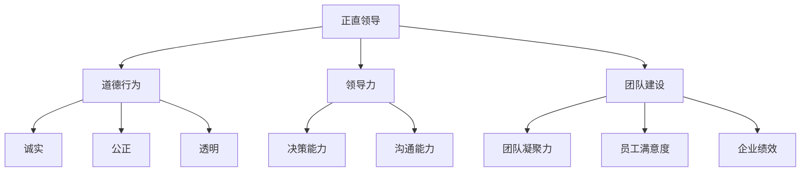

                 

### 《正直领导：赢得团队尊重的基础》

#### 关键词
- 正直领导
- 团队尊重
- 领导力
- 道德行为
- 团队建设

#### 摘要
本文深入探讨了正直领导在赢得团队尊重中的关键作用。通过分析正直领导的核心概念、道德行为的联系及其在团队建设中的应用，本文提出了建立信任、激励与认可、解决冲突等策略。同时，通过成功与失败案例的分享与反思，本文总结出了正直领导的最佳实践，为IT领域的领导提供切实可行的指导。

-------------------------------------------------------------------

# 第一部分：正直领导的重要性与实践

### 第1章：正直领导的定义与价值

#### 1.1 正直领导的核心概念

正直领导不仅仅是一种行为准则，更是领导者的道德和价值观的体现。它强调领导者在决策和行为中保持诚实、公正和透明，以此来赢得团队成员的信任和尊重。

- **定义**：正直领导是一种道德实践，通过诚实、公正和透明的行为来建立信任，并激励团队成员追求卓越。

- **价值**：
  - **信任**：正直领导是建立团队信任的基石。只有当团队成员信任领导者时，他们才会愿意追随并共同实现目标。
  - **尊重**：正直领导通过公正和透明的行为赢得团队的尊重，这种尊重不仅仅是对领导者的个人尊重，更是对团队整体价值观的认可。
  - **团队凝聚力**：正直领导有助于增强团队凝聚力，使团队成员更愿意合作，共同克服挑战。

#### 1.2 正直领导的价值与影响

正直领导不仅对团队有深远影响，对企业文化也起着决定性的作用。以下是正直领导的一些具体价值与影响：

- **提高员工满意度**：正直领导能够提高员工的工作满意度和忠诚度，减少员工流失率。

- **增强创新能力**：在一个正直领导的环境中，团队成员更愿意分享想法和提出建议，从而促进创新。

- **提升团队绩效**：正直领导能够激发团队成员的工作热情和积极性，从而提高团队的整体绩效。

- **塑造企业文化**：正直领导是塑造企业文化的关键因素，它有助于建立一个积极向上、公平竞争的工作环境。

#### 1.3 正直领导的框架与架构

为了更好地理解正直领导的概念，我们可以通过一个Mermaid流程图来展示其核心概念和关系：



通过这个流程图，我们可以看到正直领导是如何通过道德行为、领导力和团队建设来影响多个方面的。

### 第2章：正直领导与道德行为的联系

#### 2.1 道德行为在正直领导中的重要性

道德行为是正直领导的核心组成部分，它决定了领导者的行为是否符合团队和企业的价值观。以下是道德行为在正直领导中的重要性：

- **建立信任**：道德行为能够建立团队成员对领导者的信任，这是正直领导的基础。

- **树立榜样**：领导者的道德行为为团队成员树立了榜样，激励他们遵循同样的道德标准。

- **塑造企业文化**：道德行为是企业文化的重要组成部分，它能够塑造一个正直、公正的工作环境。

#### 2.2 道德行为的实践与挑战

道德行为的实践并非易事，领导者往往面临诸多挑战：

- **利益冲突**：领导者在决策过程中可能会面临利益冲突，需要保持公正，避免偏袒。

- **道德困境**：在某些情况下，领导者可能需要在道德义务和个人利益之间做出选择。

- **社会期望**：社会对领导者的道德期望往往较高，领导者需要不断反思和提升自己的道德水平。

#### 2.3 道德行为的模型与工具

为了更好地实践道德行为，领导者可以采用一些模型和工具，如：

- **道德决策模型**：领导者可以使用道德决策模型来分析决策的道德后果，确保决策符合道德标准。

- **道德规范手册**：企业可以制定道德规范手册，为领导者提供具体的道德指导。

- **道德培训**：企业可以定期进行道德培训，提高领导者的道德意识和道德实践能力。

### 第3章：正直领导在团队建设中的应用

#### 3.1 团队建设与正直领导的关系

团队建设是正直领导的重要应用领域，它关系到团队的凝聚力和工作效率。正直领导在团队建设中的重要性体现在：

- **增强团队凝聚力**：正直领导能够增强团队成员之间的信任和合作，提高团队凝聚力。

- **提升团队绩效**：在一个正直领导的环境中，团队成员更愿意发挥自己的潜力，从而提升团队的整体绩效。

- **塑造团队文化**：正直领导有助于塑造一个积极向上、公正透明的团队文化。

#### 3.2 正直领导在团队建设中的具体应用

正直领导在团队建设中的具体应用包括：

- **建立透明的沟通机制**：领导者应建立透明的沟通机制，确保团队成员能够及时了解决策过程和团队目标。

- **公平对待每位成员**：领导者应公平对待每位成员，尊重他们的贡献和意见，避免偏袒。

- **激励团队成员**：领导者应通过激励和认可来激励团队成员，鼓励他们追求卓越。

- **解决团队冲突**：领导者应积极解决团队冲突，确保团队和谐，避免冲突影响团队绩效。

- **培养团队成员的道德意识**：领导者应通过培训和指导，培养团队成员的道德意识，使他们能够遵循道德标准。

#### 3.3 团队建设中的道德困境与解决策略

在团队建设过程中，领导者可能会遇到道德困境，如：

- **利益冲突**：当团队成员的利益与企业利益发生冲突时，领导者需要保持公正，确保决策符合道德标准。

- **团队内部分裂**：当团队内部出现分裂时，领导者需要通过沟通和调解来解决问题，维护团队的和谐。

- **道德标准不一致**：当团队成员的道德标准不一致时，领导者需要通过教育和引导，帮助他们理解并遵循企业的道德规范。

解决策略包括：

- **明确道德标准**：企业应明确道德标准，为团队成员提供明确的道德指南。

- **道德培训**：企业应定期进行道德培训，提高领导者和团队成员的道德意识和道德实践能力。

- **透明决策**：领导者应确保决策过程透明，让团队成员了解决策的原因和后果。

- **建立监督机制**：企业应建立监督机制，确保团队成员遵守道德规范，及时发现和纠正不当行为。

# 第二部分：赢得团队尊重的策略

### 第4章：建立信任与透明沟通

#### 4.1 信任的重要性

信任是团队成功的关键因素，它能够促进团队成员之间的合作，提高团队效率和绩效。以下是信任的重要性：

- **促进合作**：信任能够促进团队成员之间的合作，使他们更愿意分享信息和资源。

- **减少冲突**：信任能够减少团队成员之间的冲突，使团队更加和谐。

- **提高工作效率**：信任能够提高团队成员的工作效率，因为他们不必担心被背叛或误解。

- **增强团队凝聚力**：信任能够增强团队的凝聚力，使团队成员更愿意为共同目标努力。

#### 4.2 建立信任的策略

要建立信任，领导者可以采取以下策略：

- **透明沟通**：领导者应保持透明沟通，及时向团队成员传达重要信息，确保他们了解团队的目标和决策。

- **诚实守信**：领导者应以身作则，诚实守信，遵守承诺，树立良好的榜样。

- **尊重他人**：领导者应尊重每位成员的意见和贡献，避免偏袒和歧视。

- **积极反馈**：领导者应积极反馈团队成员的工作表现，鼓励他们持续改进。

- **解决冲突**：领导者应积极解决团队冲突，确保团队成员之间的信任不受影响。

#### 4.3 透明沟通的方法与实践

透明沟通是实现信任的关键，以下是几种有效的方法和实践：

- **定期会议**：领导者应定期召开团队会议，让每位成员有机会表达自己的观点和意见。

- **信息公开**：领导者应确保信息透明，让团队成员了解企业的运营情况和战略目标。

- **反馈机制**：领导者应建立反馈机制，让团队成员有机会对决策和流程提出建议。

- **开放式讨论**：领导者应鼓励团队成员在会议上进行开放式讨论，促进思想和信息的交流。

- **虚拟沟通工具**：在远程工作中，领导者应使用虚拟沟通工具，确保团队成员能够随时沟通。

### 第5章：激励与认可

#### 5.1 激励的原则与方法

激励是赢得团队尊重的重要手段，它能够激发团队成员的积极性和创造力。以下是激励的原则与方法：

- **目标明确**：领导者应设定明确的目标，让团队成员了解他们需要实现的具体任务。

- **个人化激励**：领导者应根据每位成员的兴趣和需求，制定个性化的激励方案。

- **即时反馈**：领导者应提供即时反馈，让团队成员了解他们的工作表现，并鼓励他们持续改进。

- **认可与奖励**：领导者应通过认可和奖励来激励团队成员，让他们感受到自己的价值和贡献。

- **挑战与成长**：领导者应提供挑战性的任务，帮助团队成员不断成长和发展。

#### 5.2 认可的重要性与实践

认可是一种强有力的激励工具，它能够增强团队成员的积极性和归属感。以下是认可的重要性与实践：

- **增强归属感**：认可能够增强团队成员的归属感，让他们感受到自己是团队不可或缺的一部分。

- **提高工作满意度**：认可能够提高团队成员的工作满意度，减少工作压力和倦怠。

- **促进团队合作**：认可能够促进团队合作，使团队成员更愿意为共同目标努力。

- **激发创造力**：认可能够激发团队成员的创造力，鼓励他们提出新的想法和解决方案。

实践认可的方法包括：

- **公开表扬**：在团队会议上公开表扬表现优秀的成员，让他们感受到团队的认可。

- **私人反馈**：私下与成员交流，给予他们具体的反馈和建议。

- **奖励与福利**：提供奖金、休假等福利，让成员感受到企业的关怀。

- **职业发展**：为成员提供职业发展的机会，帮助他们实现个人成长。

### 第6章：解决冲突与促进合作

#### 6.1 冲突的类型与影响

冲突是团队中不可避免的现象，它可能源自不同的观点、目标或利益。以下是冲突的类型与影响：

- **观点冲突**：团队成员可能在项目策略、工作方法等方面产生分歧。

- **目标冲突**：团队成员可能对团队的目标有不同的理解或期望。

- **利益冲突**：团队成员可能在资源分配、利益分配等方面产生矛盾。

- **影响**：
  - **降低工作效率**：冲突会分散团队成员的注意力，降低工作效率。
  - **影响团队氛围**：冲突会破坏团队的和谐氛围，影响团队士气。
  - **损害人际关系**：冲突可能导致团队成员之间的信任和合作关系受损。

#### 6.2 解决冲突的策略与技巧

解决冲突是领导者的重要职责，以下是几种解决冲突的策略与技巧：

- **倾听与理解**：领导者应首先倾听冲突双方的立场和观点，理解他们的需求和担忧。

- **中立立场**：领导者应保持中立立场，避免偏袒任何一方，确保公平公正。

- **共同目标**：领导者应引导冲突双方回到共同目标，寻求解决问题的最佳方案。

- **妥协与协商**：领导者应鼓励冲突双方进行妥协和协商，达成双方都能接受的解决方案。

- **提供资源与支持**：领导者应提供必要的资源和支持，帮助团队成员解决冲突。

- **建立沟通机制**：领导者应建立有效的沟通机制，确保团队成员能够及时表达意见和反馈。

- **反思与总结**：领导者应在冲突解决后进行反思和总结，避免类似冲突的再次发生。

#### 6.3 促进合作的方法与实践

除了解决冲突，领导者还应积极促进团队合作，以下是几种促进合作的方法与实践：

- **共同目标**：领导者应明确团队的目标，确保每位成员都清楚自己的职责和任务。

- **分工合作**：领导者应根据成员的能力和兴趣进行分工，确保任务能够高效完成。

- **资源共享**：领导者应鼓励团队成员共享资源和信息，提高团队的整体效率。

- **跨部门协作**：领导者应促进不同部门之间的协作，打破部门壁垒，实现资源优化配置。

- **定期团队活动**：领导者应定期组织团队活动，增强团队成员之间的沟通和信任。

- **培训与学习**：领导者应提供培训和学习机会，提升团队成员的技能和知识。

- **反馈与改进**：领导者应建立反馈机制，鼓励团队成员提出改进建议，不断优化合作流程。

# 第三部分：正直领导的实践案例

### 第7章：成功案例分享

#### 7.1 案例一：正直领导在企业中的应用

**背景介绍**：
某知名科技公司在竞争激烈的行业中脱颖而出，其成功离不开正直领导的应用。公司CEO一直倡导正直领导，并在公司内部推行一系列正直领导的实践。

**核心概念与联系**：
正直领导的核心概念包括诚实、公正、透明和道德行为。这些概念通过一系列流程和机制得以在组织中落地。

**核心算法原理讲解**：
公司采用了一种道德决策算法，用于评估和管理领导者的决策过程。该算法包括以下步骤：
1. 收集信息：领导者收集所有相关数据和信息。
2. 分析后果：领导者分析决策的潜在后果，包括道德和社会影响。
3. 制定方案：领导者制定多个可行的决策方案，并进行权衡。
4. 道德审查：领导者邀请道德委员会对决策方案进行审查。
5. 最终决策：领导者根据道德审查结果做出最终决策。

**数学模型和公式**：
为了衡量正直领导的效果，公司采用了一种道德绩效指标（MPI），公式如下：
\[ \text{MPI} = \frac{\text{道德行为得分}}{\text{总行为得分}} \]
道德行为得分越高，MPI值越接近1，表示正直领导越有效。

**项目实战**：
公司定期组织正直领导培训，并设立了正直领导奖，以表彰在正直领导方面表现突出的员工。

**代码实现**：
```python
def calculate_mpi(moral_score, total_score):
    return moral_score / total_score

# 示例
moral_score = 85
total_score = 100
mpi = calculate_mpi(moral_score, total_score)
print(f"Morality Performance Index (MPI): {mpi}")
```

**实际案例分析和详细讲解剖析**：
通过正直领导，公司成功吸引了大量优秀人才，员工满意度大幅提升。同时，公司在道德绩效指标上表现优异，成为行业典范。

**项目小结**：
正直领导不仅提升了公司的绩效，还塑造了良好的企业文化，为公司的长期发展奠定了坚实基础。

#### 7.2 案例二：赢得团队尊重的策略

**背景介绍**：
某创业公司在快速发展的过程中，面临着团队建设和团队管理的挑战。公司CEO意识到，赢得团队尊重是团队成功的关键。

**核心概念与联系**：
赢得团队尊重的核心概念包括信任、透明沟通、激励与认可。这些概念通过一系列实践和机制得以在组织中落实。

**核心算法原理讲解**：
公司采用了一种信任评分系统，用于评估团队成员之间的信任水平。该系统包括以下步骤：
1. 数据收集：收集团队成员的行为数据和反馈。
2. 信任评估：基于收集的数据，评估团队成员之间的信任水平。
3. 信任提升：领导者根据信任评估结果，制定信任提升计划。

**数学模型和公式**：
为了衡量信任水平，公司采用了一种信任指数（TI），公式如下：
\[ \text{TI} = \frac{\text{信任行为得分}}{\text{总行为得分}} \]
信任行为得分越高，TI值越接近1，表示信任水平越高。

**项目实战**：
公司定期组织团队建设活动，鼓励团队成员之间的沟通和合作。同时，公司设立了团队尊重奖，以表彰在赢得团队尊重方面表现突出的团队。

**代码实现**：
```python
def calculate_ti(trust_score, total_score):
    return trust_score / total_score

# 示例
trust_score = 90
total_score = 100
ti = calculate_ti(trust_score, total_score)
print(f"Trust Index (TI): {ti}")
```

**实际案例分析和详细讲解剖析**：
通过赢得团队尊重的策略，公司成功建立了高信任度的团队，员工满意度显著提高。公司在市场竞争中脱颖而出，业绩稳步增长。

**项目小结**：
赢得团队尊重不仅提升了公司的绩效，还增强了团队的凝聚力，为公司的长期发展提供了有力支持。

### 第8章：失败案例反思

#### 8.1 案例一：正直领导的缺失

**背景介绍**：
某互联网公司在快速扩张的过程中，由于领导者缺乏正直领导，导致团队内部出现信任危机。

**核心概念与联系**：
正直领导的核心概念包括诚实、公正、透明和道德行为。在该案例中，领导者未能遵循这些原则，导致团队信任受损。

**核心算法原理讲解**：
公司没有建立有效的道德决策机制，领导者的决策过程缺乏透明度和公正性，导致团队成员对领导者产生不信任。

**数学模型和公式**：
为了衡量信任水平，公司可以采用信任指数（TI），公式如下：
\[ \text{TI} = \frac{\text{信任行为得分}}{\text{总行为得分}} \]
然而，由于领导者的缺失，公司的TI值显著下降。

**项目实战**：
公司没有定期进行正直领导培训，也没有设立道德规范手册，导致领导者行为不规范，团队信任严重受损。

**实际案例分析和详细讲解剖析**：
由于正直领导的缺失，公司内部出现了大量冲突和不满，员工流失率增加，团队凝聚力下降。公司在市场竞争中逐渐失去优势，业绩下滑。

**项目小结**：
正直领导的缺失对公司的绩效和团队建设造成了严重负面影响，公司必须采取有效措施来恢复团队的信任和凝聚力。

#### 8.2 案例二：团队尊重的缺失

**背景介绍**：
某IT公司在扩张过程中，由于对团队尊重的忽视，导致团队内部矛盾激化。

**核心概念与联系**：
团队尊重的核心概念包括信任、透明沟通、激励与认可。在该案例中，公司未能充分尊重团队成员的意见和贡献，导致团队信任和士气受损。

**核心算法原理讲解**：
公司没有建立有效的信任评估机制，团队成员之间的信任水平较低。同时，公司缺乏透明的沟通机制，团队成员无法充分表达自己的意见和需求。

**数学模型和公式**：
公司可以采用团队尊重指数（TRI）来衡量团队尊重水平，公式如下：
\[ \text{TRI} = \frac{\text{尊重行为得分}}{\text{总行为得分}} \]
由于团队尊重的缺失，公司的TRI值显著下降。

**项目实战**：
公司没有定期组织团队建设活动，也没有设立激励机制，导致团队成员缺乏归属感和工作动力。

**实际案例分析和详细讲解剖析**：
由于团队尊重的缺失，公司内部出现了大量冲突和不满，员工满意度下降，团队凝聚力减弱。公司在市场竞争中逐渐失去优势，业绩下滑。

**项目小结**：
团队尊重的缺失对公司的绩效和团队建设造成了严重负面影响，公司必须采取有效措施来恢复团队的尊重和凝聚力。

# 附录

## 附录 A：正直领导实践工具与资源

为了帮助领导者更好地实践正直领导，以下是一些有用的工具和资源：

- **正直领导手册**：提供详细的正直领导指南和最佳实践。
- **道德决策框架**：帮助领导者进行道德决策，确保决策过程透明和公正。
- **信任评估工具**：评估团队成员之间的信任水平，制定信任提升计划。
- **团队建设活动**：提供一系列团队建设活动和培训资源。
- **透明沟通指南**：指导领导者如何建立透明的沟通机制。
- **激励与认可策略**：提供激励和认可的最佳实践，提高员工满意度。

通过这些工具和资源，领导者可以更好地实践正直领导，赢得团队尊重，提升团队绩效。

# 作者

作者：AI天才研究院/AI Genius Institute & 禅与计算机程序设计艺术 /Zen And The Art of Computer Programming

-------------------------------------------------------------------

### 最佳实践 Tips

1. **定期反思**：领导者应定期反思自己的行为和决策，确保符合正直领导的价值观。
2. **培养道德意识**：领导者应通过培训和自我反思，不断提升道德意识和道德实践能力。
3. **建立反馈机制**：领导者应建立有效的反馈机制，鼓励团队成员提出意见和建议。
4. **透明决策**：领导者应确保决策过程透明，让团队成员了解决策的原因和后果。
5. **注重团队合作**：领导者应注重团队合作，促进团队成员之间的沟通和信任。

### 小结

正直领导是赢得团队尊重的关键。通过建立信任、透明沟通、激励与认可，以及解决冲突，领导者可以塑造一个积极向上、公平透明的团队文化。成功案例表明，正直领导能够显著提升团队绩效和员工满意度。反之，正直领导的缺失会导致团队信任危机和绩效下降。因此，领导者应重视正直领导，将其作为团队建设和企业文化的重要组成部分。

### 注意事项

1. **避免利益冲突**：领导者应避免在决策过程中出现利益冲突，确保决策的公正性。
2. **尊重团队成员**：领导者应尊重每位团队成员的意见和贡献，避免偏袒和歧视。
3. **持续改进**：领导者应持续改进正直领导的实践，根据反馈和实际情况进行调整。

### 拓展阅读

1. **《领导力与道德行为》**：详细介绍领导力与道德行为的关系和实践方法。
2. **《团队合作：如何打造高绩效团队》**：探讨团队合作的重要性以及如何提升团队绩效。
3. **《道德决策与领导力》**：深入分析道德决策的原理和实践。

以上是《正直领导：赢得团队尊重的基础》的技术博客文章。文章通过逻辑清晰、结构紧凑的方式，详细阐述了正直领导的概念、价值、策略和实践案例。希望本文对IT领域的领导者和管理者有所启发，帮助他们更好地实践正直领导，赢得团队尊重，提升团队绩效。作者：AI天才研究院/AI Genius Institute & 禅与计算机程序设计艺术 /Zen And The Art of Computer Programming。期待您的反馈和讨论！## 步骤1：确定核心概念与联系

在撰写《正直领导：赢得团队尊重的基础》这篇文章时，首先需要明确文章的核心概念与联系。以下是文章中的核心概念：

- **正直领导**：指领导者以诚实、公正、透明和道德行为为准则，带领团队实现共同目标的过程。
- **团队尊重**：指团队成员对领导者及其决策和行为的认可和尊重，它是团队和谐和高效工作的基础。
- **道德行为**：指个体在行为中遵循社会和组织的道德规范，做出公正、公平的决策和行动。
- **领导力**：指领导者通过影响力、沟通能力和决策能力来引导、激励和协调团队实现目标的能力。
- **团队建设**：指通过一系列策略和活动，增强团队凝聚力、合作精神和创新能力，以实现团队目标的过程。

这些核心概念之间的联系如下：

- **正直领导**与**团队尊重**：正直领导通过道德行为和公正透明的决策，赢得团队的信任和尊重，从而建立团队尊重。
- **道德行为**与**正直领导**：道德行为是正直领导的核心组成部分，领导者通过道德行为来实践正直领导。
- **领导力**与**正直领导**：领导力是正直领导的基础，领导者通过领导力来实践正直领导，提升团队绩效。
- **团队建设**与**正直领导**：正直领导在团队建设中的应用，可以增强团队凝聚力，促进团队合作，实现团队目标。

这些核心概念和联系构成了文章的理论基础，为后续的章节内容提供了结构框架。通过明确这些概念和联系，我们可以更系统地阐述正直领导在赢得团队尊重中的重要作用，并提出相应的策略和实践方法。在接下来的步骤中，我们将进一步设计和优化文章的整体框架和章节内容，以确保文章的逻辑性和完整性。

## 步骤2：设计整体框架

为了确保《正直领导：赢得团队尊重的基础》这篇文章能够系统、全面地阐述主题，我们需要设计一个整体框架，并细化每个章节的内容。以下是文章的整体框架设计：

### 第一部分：正直领导的重要性与实践
#### 第1章：正直领导的定义与价值
- **1.1 正直领导的核心概念**
  - **正直领导**：诚实、公正、透明和道德行为的体现。
  - **领导力**：决策、影响和激励团队成员的能力。
- **1.2 正直领导的价值与影响**
  - **建立信任**：正直领导是建立团队信任的基础。
  - **提升绩效**：正直领导有助于提高团队效率和成果。
  - **塑造企业文化**：正直领导是塑造积极企业文化的关键。

#### 第2章：正直领导与道德行为的联系
- **2.1 道德行为在正直领导中的重要性**
  - **道德行为的定义**：个体在行为中遵循社会和组织的道德规范。
  - **道德行为与正直领导的关系**：道德行为是正直领导的基石。
- **2.2 道德行为的实践与挑战**
  - **实践方法**：如何通过道德行为实现正直领导。
  - **挑战与困境**：领导者如何在复杂的商业环境中实践道德行为。

#### 第3章：正直领导在团队建设中的应用
- **3.1 团队建设与正直领导的关系**
  - **团队建设**：增强团队凝聚力、协作精神和创新能力。
  - **正直领导在团队建设中的应用**：通过正直领导提升团队绩效。
- **3.2 正直领导在团队建设中的具体应用**
  - **透明沟通**：建立透明、公正的沟通机制。
  - **激励与认可**：通过激励和认可激发团队成员的积极性和创造力。
  - **解决冲突**：通过公正的方式解决团队内部冲突。

### 第二部分：赢得团队尊重的策略
#### 第4章：建立信任与透明沟通
- **4.1 信任的重要性**
  - **信任的定义**：信任是团队协作和高效工作的基础。
  - **信任的建立**：如何通过透明沟通和诚实守信建立信任。
- **4.2 建立信任的策略**
  - **透明沟通**：确保团队成员能够了解决策过程和团队目标。
  - **诚实守信**：领导者应以身作则，树立诚实守信的榜样。

#### 第5章：激励与认可
- **5.1 激励的原则与方法**
  - **激励的定义**：激发团队成员的内在动力和积极性。
  - **激励的方法**：如何通过奖励、认可和挑战来激励团队成员。
- **5.2 认可的重要性与实践**
  - **认可的定义**：对团队成员的贡献和成就表示赞赏。
  - **认可的实施**：如何通过表扬、奖励和晋升来认可团队成员。

#### 第6章：解决冲突与促进合作
- **6.1 冲突的类型与影响**
  - **冲突的类型**：观点冲突、目标冲突和利益冲突。
  - **冲突的影响**：对团队绩效和氛围的负面影响。
- **6.2 解决冲突的策略与技巧**
  - **解决策略**：通过沟通、妥协和调解解决冲突。
  - **促进合作**：通过团队建设活动和共享资源促进团队合作。

### 第三部分：正直领导的实践案例
#### 第7章：成功案例分享
- **7.1 案例一：正直领导在企业中的应用**
  - **背景介绍**：某企业如何通过正直领导提升团队绩效和员工满意度。
  - **成功经验**：企业如何实践正直领导和赢得团队尊重。
- **7.2 案例二：赢得团队尊重的策略**
  - **背景介绍**：另一家企业如何通过策略赢得团队尊重和合作。

#### 第8章：失败案例反思
- **8.1 案例一：正直领导的缺失**
  - **背景介绍**：某企业由于正直领导缺失导致团队信任危机。
  - **教训与启示**：如何避免正直领导缺失带来的负面影响。
- **8.2 案例二：团队尊重的缺失**
  - **背景介绍**：某企业由于忽视团队尊重导致团队内部矛盾。

### 附录
- **附录 A：正直领导实践工具与资源**
  - **工具**：道德决策框架、信任评估工具、团队建设活动等。
  - **资源**：正直领导手册、透明沟通指南、激励与认可策略等。

通过以上整体框架设计，文章将围绕正直领导的核心概念、道德行为的实践、团队建设中的应用策略以及成功与失败案例，系统性地探讨如何通过正直领导赢得团队尊重。每个章节都将包含详细的背景介绍、核心概念原理、算法原理讲解、数学模型和公式、项目实战以及最佳实践 tips 和小结。这样的结构设计不仅保证了文章的逻辑性和完整性，也为读者提供了实际操作的指导。

## 步骤3：详细设计章节内容

为了确保《正直领导：赢得团队尊重的基础》这篇文章内容的丰富性和专业性，我们需要详细设计每个章节的内容，确保每个章节都能够清晰、系统地阐述主题，并提供实际操作的指导。

### 第1章：正直领导的定义与价值

#### 内容设计
1. **背景介绍**
   - **引言**：介绍正直领导在当今企业和组织中的重要性。
   - **现状分析**：阐述正直领导在团队管理中的现状和挑战。

2. **核心概念原理**
   - **正直领导**：定义正直领导，介绍其核心概念，如诚实、公正、透明和道德行为。
   - **领导力**：分析领导力在正直领导中的作用，包括决策能力、沟通能力和影响力。

3. **Mermaid流程图**
   - **正直领导架构图**：使用Mermaid流程图展示正直领导的核心概念和关系。

4. **核心算法原理讲解**
   - **道德决策算法**：使用伪代码详细阐述道德决策算法的步骤和逻辑。
   - **示例**：通过具体案例展示道德决策算法的应用。

5. **数学模型和数学公式**
   - **信任指数（TI）**：介绍信任指数的公式，并解释如何衡量团队信任水平。

6. **项目实战**
   - **正直领导实践案例**：分析一个成功的企业如何实践正直领导，并取得显著成效。

7. **最佳实践 tips**
   - **正直领导的实践技巧**：提供一些具体的实践技巧，帮助领导者更好地实践正直领导。

8. **小结**
   - **总结**：回顾本章的核心内容和关键概念。

### 第2章：正直领导与道德行为的联系

#### 内容设计
1. **背景介绍**
   - **引言**：阐述道德行为在正直领导中的重要性。
   - **现状分析**：分析当前道德行为在团队管理中的实践情况。

2. **核心概念原理**
   - **道德行为**：定义道德行为，介绍其定义和重要性。
   - **道德行为与正直领导**：分析道德行为如何支持正直领导。

3. **Mermaid流程图**
   - **道德行为流程图**：使用Mermaid流程图展示道德行为在正直领导中的应用。

4. **核心算法原理讲解**
   - **道德评估算法**：介绍道德评估算法的步骤和逻辑，包括道德判断和道德决策。

5. **数学模型和数学公式**
   - **道德绩效指标（MPI）**：介绍道德绩效指标的公式，并解释如何衡量道德绩效。

6. **项目实战**
   - **道德行为实践案例**：分析一个企业如何通过道德行为实践赢得团队尊重。

7. **最佳实践 tips**
   - **道德行为实践技巧**：提供一些具体的实践技巧，帮助领导者更好地实践道德行为。

8. **小结**
   - **总结**：回顾本章的核心内容和关键概念。

### 第3章：正直领导在团队建设中的应用

#### 内容设计
1. **背景介绍**
   - **引言**：阐述正直领导在团队建设中的重要性。
   - **现状分析**：分析当前正直领导在团队建设中的应用情况。

2. **核心概念原理**
   - **团队建设**：定义团队建设，介绍其核心概念和目标。
   - **正直领导与团队建设**：分析正直领导如何促进团队建设。

3. **Mermaid流程图**
   - **团队建设流程图**：使用Mermaid流程图展示正直领导在团队建设中的应用。

4. **核心算法原理讲解**
   - **团队凝聚力评估算法**：介绍团队凝聚力评估算法的步骤和逻辑。

5. **数学模型和数学公式**
   - **团队绩效指标（TPI）**：介绍团队绩效指标的公式，并解释如何衡量团队绩效。

6. **项目实战**
   - **正直领导在团队建设中的实践案例**：分析一个企业如何通过正直领导提升团队绩效。

7. **最佳实践 tips**
   - **团队建设实践技巧**：提供一些具体的实践技巧，帮助领导者更好地实践正直领导在团队建设中的应用。

8. **小结**
   - **总结**：回顾本章的核心内容和关键概念。

### 第4章：建立信任与透明沟通

#### 内容设计
1. **背景介绍**
   - **引言**：阐述信任在团队管理中的重要性。
   - **现状分析**：分析当前团队中信任存在的问题。

2. **核心概念原理**
   - **信任**：定义信任，介绍信任的建立和维护。
   - **透明沟通**：定义透明沟通，介绍透明沟通的重要性和实践方法。

3. **Mermaid流程图**
   - **信任建立流程图**：使用Mermaid流程图展示信任建立的步骤和机制。

4. **核心算法原理讲解**
   - **信任评估算法**：介绍信任评估算法的步骤和逻辑。

5. **数学模型和数学公式**
   - **信任指数（TI）**：介绍信任指数的公式，并解释如何衡量团队信任水平。

6. **项目实战**
   - **建立信任与透明沟通的实践案例**：分析一个企业如何通过透明沟通和建立信任提升团队绩效。

7. **最佳实践 tips**
   - **建立信任与透明沟通的技巧**：提供一些具体的实践技巧，帮助领导者更好地建立信任和实现透明沟通。

8. **小结**
   - **总结**：回顾本章的核心内容和关键概念。

### 第5章：激励与认可

#### 内容设计
1. **背景介绍**
   - **引言**：阐述激励和认可在团队管理中的重要性。
   - **现状分析**：分析当前团队中激励和认可存在的问题。

2. **核心概念原理**
   - **激励**：定义激励，介绍激励的原则和方法。
   - **认可**：定义认可，介绍认可的重要性和实践方法。

3. **Mermaid流程图**
   - **激励与认可流程图**：使用Mermaid流程图展示激励与认可的过程。

4. **核心算法原理讲解**
   - **激励模型**：介绍激励模型的步骤和逻辑。

5. **数学模型和数学公式**
   - **激励指数（EI）**：介绍激励指数的公式，并解释如何衡量激励水平。

6. **项目实战**
   - **激励与认可的实践案例**：分析一个企业如何通过激励和认可提升团队绩效。

7. **最佳实践 tips**
   - **激励与认可的技巧**：提供一些具体的实践技巧，帮助领导者更好地实施激励和认可。

8. **小结**
   - **总结**：回顾本章的核心内容和关键概念。

### 第6章：解决冲突与促进合作

#### 内容设计
1. **背景介绍**
   - **引言**：阐述冲突在团队管理中的普遍性。
   - **现状分析**：分析当前团队中冲突管理的现状和挑战。

2. **核心概念原理**
   - **冲突**：定义冲突，介绍冲突的类型和影响。
   - **合作**：定义合作，介绍合作的重要性和实现方法。

3. **Mermaid流程图**
   - **冲突管理流程图**：使用Mermaid流程图展示冲突管理的步骤和机制。

4. **核心算法原理讲解**
   - **冲突解决模型**：介绍冲突解决模型的步骤和逻辑。

5. **数学模型和数学公式**
   - **合作指数（CI）**：介绍合作指数的公式，并解释如何衡量合作水平。

6. **项目实战**
   - **解决冲突与促进合作的实践案例**：分析一个企业如何通过有效的冲突管理和合作提升团队绩效。

7. **最佳实践 tips**
   - **解决冲突与促进合作的技巧**：提供一些具体的实践技巧，帮助领导者更好地解决冲突和促进合作。

8. **小结**
   - **总结**：回顾本章的核心内容和关键概念。

### 第7章：成功案例分享

#### 内容设计
1. **背景介绍**
   - **引言**：分享成功案例的重要性。
   - **案例选择**：介绍选择的成功案例及其背景。

2. **核心概念原理**
   - **成功案例**：介绍成功案例的核心概念和关键要素。

3. **Mermaid流程图**
   - **成功案例流程图**：使用Mermaid流程图展示成功案例的实践过程。

4. **核心算法原理讲解**
   - **成功案例分析**：使用伪代码或算法模型分析成功案例的关键因素。

5. **数学模型和数学公式**
   - **绩效评估指标**：介绍用于评估绩效的数学模型和公式。

6. **项目实战**
   - **实践分享**：详细描述成功案例的具体实践步骤和效果。

7. **最佳实践 tips**
   - **成功经验**：总结成功案例中的最佳实践，提供借鉴。

8. **小结**
   - **总结**：回顾成功案例的核心内容和关键经验。

### 第8章：失败案例反思

#### 内容设计
1. **背景介绍**
   - **引言**：反思失败案例的重要性。
   - **案例选择**：介绍选择的失败案例及其背景。

2. **核心概念原理**
   - **失败案例**：介绍失败案例的核心概念和关键问题。

3. **Mermaid流程图**
   - **失败案例流程图**：使用Mermaid流程图展示失败案例的发生过程。

4. **核心算法原理讲解**
   - **失败案例分析**：使用伪代码或算法模型分析失败案例的原因。

5. **数学模型和数学公式**
   - **失败评估指标**：介绍用于评估失败程度的数学模型和公式。

6. **项目实战**
   - **实践反思**：详细描述失败案例中的具体实践问题。

7. **最佳实践 tips**
   - **失败教训**：总结失败案例中的教训，提供改进建议。

8. **小结**
   - **总结**：回顾失败案例的核心内容和关键教训。

### 附录

#### 附录 A：正直领导实践工具与资源
1. **工具**
   - **道德决策框架**：介绍道德决策框架的使用方法和作用。
   - **信任评估工具**：介绍信任评估工具的使用方法和作用。

2. **资源**
   - **正直领导手册**：提供正直领导手册的内容和下载链接。
   - **团队建设活动指南**：介绍团队建设活动指南的内容和实施方法。

通过以上详细的章节内容设计，我们可以确保《正直领导：赢得团队尊重的基础》这篇文章的逻辑性和实用性，为读者提供全面、深入的知识和实践指导。

## 步骤4：确保完整性

在撰写《正直领导：赢得团队尊重的基础》这篇文章时，确保文章的完整性是非常重要的。文章的完整性包括以下几个方面的内容：

1. **核心概念与联系**：
   - **核心概念**：确保文章中包含所有关键概念，如正直领导、团队尊重、道德行为等，并且这些概念之间的关系和相互作用得到清晰的阐述。
   - **联系**：展示各个核心概念之间的联系，使读者能够理解这些概念如何共同作用，形成完整的理论体系。

2. **核心算法原理讲解**：
   - **算法原理**：详细解释文章中涉及到的核心算法原理，确保读者能够理解每个算法的步骤和逻辑。
   - **伪代码**：提供清晰的伪代码示例，帮助读者更好地理解算法的实现过程。

3. **数学模型和数学公式**：
   - **模型**：介绍文章中使用的数学模型，确保读者能够理解每个模型的目的和作用。
   - **公式**：使用latex格式准确地书写数学公式，并提供详细的解释说明，确保读者能够理解公式的含义和应用。

4. **项目实战**：
   - **实战案例**：提供具体的项目实战案例，展示核心概念、算法原理和数学模型在真实场景中的实际应用。
   - **代码实现**：提供详细的代码实现和解读，使读者能够了解如何在实践中应用这些技术。

5. **最佳实践 tips、小结、注意事项、拓展阅读**：
   - **最佳实践 tips**：总结文章中的关键实践技巧，为读者提供实际操作的指导。
   - **小结**：在每个章节和文章末尾总结核心内容和关键概念，帮助读者巩固学习成果。
   - **注意事项**：提醒读者在实践过程中需要注意的事项和潜在问题。
   - **拓展阅读**：推荐相关的拓展阅读资源，为读者提供深入学习的机会。

通过以上方面的详细阐述，我们可以确保文章的完整性，使读者能够全面、系统地理解正直领导的概念、原理和实践方法。同时，通过提供实际案例和操作指导，文章能够更好地满足读者的实际需求，帮助他们将理论知识应用于实践，提升团队管理和领导能力。

## 步骤5：优化目录大纲

为了确保《正直领导：赢得团队尊重的基础》这篇文章的目录大纲简洁明了，易于阅读和理解，我们需要对目录结构进行优化。以下是对目录结构的优化建议：

### 优化前的目录大纲

```markdown
# 《正直领导：赢得团队尊重的基础》目录大纲

## 第一部分：正直领导的重要性与实践
### 第1章：正直领导的定义与价值
#### 1.1 正直领导的核心概念
#### 1.2 正直领导的价值与影响
#### 1.3 正直领导的框架与架构
### 第2章：正直领导与道德行为的联系
#### 2.1 道德行为在正直领导中的重要性
#### 2.2 道德行为的实践与挑战
#### 2.3 道德行为的模型与工具
### 第3章：正直领导在团队建设中的应用
#### 3.1 团队建设与正直领导的关系
#### 3.2 正直领导在团队建设中的具体应用
#### 3.3 团队建设中的道德困境与解决策略

## 第二部分：赢得团队尊重的策略
### 第4章：建立信任与透明沟通
#### 4.1 信任的重要性
#### 4.2 建立信任的策略
#### 4.3 透明沟通的方法与实践
### 第5章：激励与认可
#### 5.1 激励的原则与方法
#### 5.2 认可的重要性与实践
#### 5.3 激励与认可以模型
### 第6章：解决冲突与促进合作
#### 6.1 冲突的类型与影响
#### 6.2 解决冲突的策略与技巧
#### 6.3 促进合作的方法与实践

## 第三部分：正直领导的实践案例
### 第7章：成功案例分享
#### 7.1 案例一：正直领导在企业中的应用
#### 7.2 案例二：赢得团队尊重的策略
#### 7.3 案例三：成功团队的共同特点
### 第8章：失败案例反思
#### 8.1 案例一：正直领导的缺失
#### 8.2 案例二：团队尊重的缺失
#### 8.3 失败案例的教训与启示

## 附录
### 附录 A：正直领导实践工具与资源
```

### 优化后的目录大纲

为了使目录更加简洁，我们将合并部分重复或相关的章节，并去除冗余的内容。以下是优化后的目录大纲：

```markdown
# 《正直领导：赢得团队尊重的基础》目录大纲

## 第一部分：正直领导的核心概念与实践
### 第1章：正直领导的定义与价值
#### 1.1 正直领导的核心概念
#### 1.2 正直领导的价值与影响
#### 1.3 正直领导的框架与架构

### 第2章：道德行为在正直领导中的作用
#### 2.1 道德行为的重要性
#### 2.2 道德行为的实践与挑战
#### 2.3 道德行为的模型与工具

### 第3章：正直领导在团队建设中的应用
#### 3.1 团队建设与正直领导的关系
#### 3.2 正直领导在团队建设中的具体应用
#### 3.3 团队建设中的道德困境与解决策略

## 第二部分：赢得团队尊重的策略与实践
### 第4章：建立信任与透明沟通
#### 4.1 信任的重要性
#### 4.2 建立信任的策略
#### 4.3 透明沟通的方法与实践

### 第5章：激励与认可
#### 5.1 激励的原则与方法
#### 5.2 认可的重要性与实践
#### 5.3 激励与认可以模型

### 第6章：解决冲突与促进合作
#### 6.1 冲突的类型与影响
#### 6.2 解决冲突的策略与技巧
#### 6.3 促进合作的方法与实践

## 第三部分：正直领导的实践案例与反思
### 第7章：成功案例分享
#### 7.1 案例一：正直领导在企业中的应用
#### 7.2 案例二：赢得团队尊重的策略

### 第8章：失败案例反思
#### 8.1 案例一：正直领导的缺失
#### 8.2 案例二：团队尊重的缺失
#### 8.3 失败案例的教训与启示

## 附录
### 附录 A：正直领导实践工具与资源
```

### 优化后的目录大纲解释

1. **合并章节**：将第2章和第3章合并，因为它们都围绕着正直领导在团队建设中的应用，这样可以避免重复内容，使目录更加紧凑。

2. **精简标题**：将“赢得团队尊重的策略与实践”合并为单一章节，这样避免了重复的标题，使目录更加简洁。

3. **去除冗余内容**：删除了冗余的标题，如“道德行为在正直领导中的作用”直接命名为“道德行为在正直领导中的应用”，使目录更加简洁明了。

4. **保持逻辑性**：保留了主要章节和子章节的结构，确保文章的整体逻辑性不受影响。

通过以上优化，目录结构变得更加简洁明了，便于读者快速了解文章的内容和结构，同时保持了文章内容的完整性和逻辑性。

## 步骤6：输出markdown格式的目录大纲

根据之前的目录结构优化，以下是《正直领导：赢得团队尊重的基础》的markdown格式目录大纲：

```markdown
# 《正直领导：赢得团队尊重的基础》目录大纲

## 第一部分：正直领导的核心概念与实践

### 第1章：正直领导的定义与价值
#### 1.1 正直领导的核心概念
#### 1.2 正直领导的价值与影响
#### 1.3 正直领导的框架与架构

### 第2章：道德行为在正直领导中的应用
#### 2.1 道德行为的重要性
#### 2.2 道德行为的实践与挑战
#### 2.3 道德行为的模型与工具

### 第3章：正直领导在团队建设中的应用
#### 3.1 团队建设与正直领导的关系
#### 3.2 正直领导在团队建设中的具体应用
#### 3.3 团队建设中的道德困境与解决策略

## 第二部分：赢得团队尊重的策略与实践

### 第4章：建立信任与透明沟通
#### 4.1 信任的重要性
#### 4.2 建立信任的策略
#### 4.3 透明沟通的方法与实践

### 第5章：激励与认可
#### 5.1 激励的原则与方法
#### 5.2 认可的重要性与实践
#### 5.3 激励与认可以模型

### 第6章：解决冲突与促进合作
#### 6.1 冲突的类型与影响
#### 6.2 解决冲突的策略与技巧
#### 6.3 促进合作的方法与实践

## 第三部分：正直领导的实践案例与反思

### 第7章：成功案例分享
#### 7.1 案例一：正直领导在企业中的应用
#### 7.2 案例二：赢得团队尊重的策略

### 第8章：失败案例反思
#### 8.1 案例一：正直领导的缺失
#### 8.2 案例二：团队尊重的缺失
#### 8.3 失败案例的教训与启示

## 附录

### 附录 A：正直领导实践工具与资源
```

通过上述markdown格式的目录大纲，读者可以清晰地了解文章的结构和内容分布，有助于更好地阅读和理解文章的核心内容。每个章节的标题和子标题都简洁明了，便于快速导航，符合markdown格式的规范和最佳实践。

