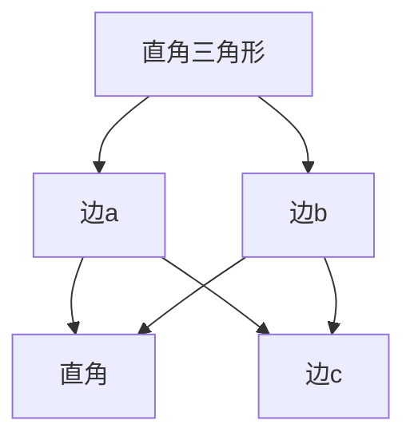
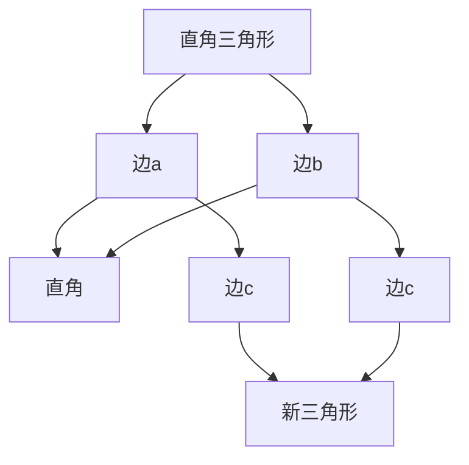

                 


### 毕达哥拉斯学派的数字哲学：万物皆数

#### 关键词
- 毕达哥拉斯学派
- 数字哲学
- 万物皆数
- 数学原理
- 宇宙秩序

#### 摘要
本文将深入探讨毕达哥拉斯学派的数字哲学，这一哲学体系主张“万物皆数”，强调数字与宇宙的深层联系。本文将分为三个主要部分：首先介绍毕达哥拉斯学派的历史背景和哲学思想；其次分析数字哲学的基本原理，包括数字与几何的关系以及数字与宇宙秩序的关联；最后，探讨毕达哥拉斯定理及其应用，并讨论数字哲学在当代的意义和应用。通过逻辑清晰、结构紧凑的步骤分析，本文将带领读者领略数字哲学的深度和广度。

### 毕达哥拉斯学派的历史背景与哲学思想

#### 1.1 毕达哥拉斯学派的起源与发展

毕达哥拉斯学派（Pythagoreanism）得名于其创始人毕达哥拉斯（Pythagoras），他是公元前6世纪希腊的一位哲学家、数学家、音乐家和神秘主义者。毕达哥拉斯出生于萨摩斯岛，后来在意大利南部的克罗顿建立了自己的学派。这个学派不仅是一个哲学团体，也是一个秘密宗教组织。

毕达哥拉斯本人非常神秘，他的生平事迹和哲学思想多被后人夸大或神秘化。据传说，毕达哥拉斯在年轻时游历各地，拜访了许多哲学家和学者，包括在埃及学习了数学和天文学。他在克罗顿的学派吸引了众多追随者，包括政治家、商人、工匠等各个社会阶层的人。

#### 1.2 毕达哥拉斯学派的核心哲学思想

毕达哥拉斯学派的核心哲学思想可以概括为“万物皆数”（Everything is number）。这一思想主张，宇宙和一切事物都是由基本的数学原理构成的。数字不仅存在于数学领域，也渗透到自然界和社会生活中。

- **数字与和谐**：毕达哥拉斯学派认为，数字是和谐的基础。在音乐中，音程的比例可以用整数比来表示；在建筑中，比例和对称是美学的关键。毕达哥拉斯发现，不同长度的弦振动产生的音高比例与弦长的比例有关，这一发现被称为“毕达哥拉斯定理”。

- **数字与宇宙秩序**：毕达哥拉斯学派认为，宇宙是一个巨大的数字系统，宇宙中的所有现象都可以用数字和几何来描述。例如，行星的运行轨迹被认为是圆形或椭圆形，这些几何形状可以用数学来描述。

- **数字与灵魂**：毕达哥拉斯学派认为，灵魂是数学的产物，灵魂的和谐与宇宙的和谐一致。因此，通过数学和哲学的学习，可以实现灵魂的净化和升华。

#### 1.3 毕达哥拉斯学派对后世的影响

毕达哥拉斯学派的哲学思想对后世产生了深远的影响，尤其在数学、哲学和科学领域。以下是一些重要的影响：

- **数学的发展**：毕达哥拉斯学派的“万物皆数”思想促进了数学的发展，特别是在数论和几何学领域。他们探讨了无理数的概念，例如π和√2，这些发现对数学的发展具有重要意义。

- **哲学的影响**：毕达哥拉斯学派的数字哲学对后来的哲学家，如柏拉图和亚里士多德，产生了深远的影响。柏拉图的理念论可以看作是对毕达哥拉斯哲学的一种延续，他强调理念世界中的数学和谐。

- **科学的影响**：毕达哥拉斯学派的宇宙观影响了后来的科学家，如哥白尼和伽利略，他们试图用数学和几何来解释宇宙的运行。

总之，毕达哥拉斯学派的数字哲学开创了将数学应用于理解和解释世界的先河，对后世产生了广泛而深远的影响。

### 数字哲学的基本原理

#### 2.1 数字与数的分类

数字哲学的基础是对数字和数的深入理解。数字是用于计数的符号，而数则是一组数字的总和或某一集合的特性。在数字哲学中，数分为有理数和无理数。

- **有理数**：有理数是可以表示为两个整数之比的数，包括整数、分数和整数倍分数。例如，1/2、3/4和-5都是有理数。

- **无理数**：无理数是不能表示为两个整数之比的数，它们的小数部分是无限不循环的。著名的无理数包括π（圆周率）和√2（根号二）。

#### 2.2 数字与几何的关系

数字与几何的关系是数字哲学的核心之一。几何学研究形状、大小和空间关系，而这些都可以用数字来描述。

- **毕达哥拉斯定理**：毕达哥拉斯定理是数字与几何关系的经典例子。该定理指出，在一个直角三角形中，直角边的平方和等于斜边的平方。用公式表示为：$$a^2 + b^2 = c^2$$，其中c是斜边，a和b是直角边。

- **黄金比例**：黄金比例（Golden Ratio），通常表示为φ（phi），是另一个重要的数字与几何的关系。黄金比例是一个无理数，其值约为1.618。在几何中，黄金比例经常出现在五边形、五角星和斐波那契数列中。

#### 2.3 数字与宇宙秩序

数字哲学进一步扩展到宇宙秩序的研究。毕达哥拉斯学派认为，宇宙是一个巨大的数字系统，所有自然现象都可以用数学和几何来解释。

- **宇宙的数学结构**：宇宙的数学结构包括宇宙的维度、形状和周期性。例如，宇宙可能是多维的，并且遵循某种周期性变化。

- **天体运动的规律**：天体运动，如行星和卫星的轨道，可以用数学公式来描述。开普勒定律和牛顿的万有引力定律就是这种数学描述的例子。

- **生命的数学原理**：在生物学中，生命的生长、发育和遗传也可以用数学来描述。例如，斐波那契数列在植物生长模式中常见，而混沌理论则描述了生命系统的非线性动态。

通过这些基本原理，我们可以看到数字哲学不仅仅是关于数学，而是关于理解宇宙和生命的本质。接下来，我们将进一步探讨毕达哥拉斯学派的核心定理——毕达哥拉斯定理。

### 毕达哥拉斯定理及其应用

#### 3.1 毕达哥拉斯定理的证明

毕达哥拉斯定理是数学中的一个基本定理，其核心思想是直角三角形的两条直角边的平方和等于斜边的平方。这一定理可以用多种方法来证明，以下是其中一种常见的几何证明方法：

**步骤1**：绘制一个直角三角形，其中直角边分别为a和b，斜边为c。



**步骤2**：在直角三角形的外部绘制两个相同的直角三角形，使得它们的直角边a和b分别与原三角形的直角边相邻。



**步骤3**：将这两个新三角形旋转并放置在原三角形的旁边，使它们的直角边a和b分别与原三角形的直角边a和b相邻。

```mermaid
graph TD
A[直角三角形] --> B[边a] --> C[直角]
A --> D[边b] --> C
B --> E[边c] --> F[新三角形]
D --> G[边c] --> F
H[I[旋转后的三角形]] --> B
H --> I
```

**步骤4**：连接新三角形的顶点与原三角形的顶点，形成一个大正方形，其边长为c。

```mermaid
graph TD
A[直角三角形] --> B[边a] --> C[直角]
A --> D[边b] --> C
B --> E[边c] --> F[新三角形]
D --> G[边c] --> F
H[I[旋转后的三角形]] --> B
H --> I
A --> J[K[大正方形]]
J --> L[M[边c]]
```

**步骤5**：在大正方形的每个角落绘制小正方形，其边长为a和b。

```mermaid
graph TD
A[直角三角形] --> B[边a] --> C[直角]
A --> D[边b] --> C
B --> E[边c] --> F[新三角形]
D --> G[边c] --> F
H[I[旋转后的三角形]] --> B
H --> I
A --> J[K[大正方形]]
J --> L[M[边c]]
N[小正方形1] --> B
N --> O
P[小正方形2] --> D
P --> Q
```

**步骤6**：观察大正方形和小正方形的面积关系。

由于大正方形的面积是c的平方，而每个小正方形的面积是a的平方或b的平方，所以大正方形的面积等于两个小正方形的面积之和。

**结论**：因此，我们得出结论：$$a^2 + b^2 = c^2$$，这证明了毕达哥拉斯定理。

#### 3.2 毕达哥拉斯定理的数学意义

毕达哥拉斯定理在数学中具有重要的意义，它不仅仅是一个几何定理，还涉及到数论、代数和微积分等多个数学领域。

- **数论中的应用**：毕达哥拉斯定理可以用来研究勾股数（即满足毕达哥拉斯定理的三个整数）。勾股数在数论中有着广泛的应用，例如在寻找整数解的代数方程中。

- **代数中的应用**：毕达哥拉斯定理是代数中的一个基础定理，它可以用来解决各种代数问题，如二次方程的整数解。

- **微积分中的应用**：在微积分中，毕达哥拉斯定理可以用来计算直角坐标系中的面积和体积。例如，在计算曲边图形的面积时，可以使用积分来近似计算，而积分中的微分运算就是基于毕达哥拉斯定理的。

#### 3.3 毕达哥拉斯定理在实际生活中的应用

毕达哥拉斯定理在实际生活中有着广泛的应用，以下是一些例子：

- **建筑与设计**：建筑师和设计师经常使用毕达哥拉斯定理来确保建筑和设计的美观和功能性。例如，在建筑设计中，可以使用毕达哥拉斯定理来计算房间的尺寸，以确保比例和谐。

- **音乐**：音乐中的音程比例可以用毕达哥拉斯定理来解释。例如，纯五度音程的比例约为3:2，这可以通过毕达哥拉斯定理中的数学关系来验证。

- **体育**：在体育领域，毕达哥拉斯定理可以帮助运动员计算运动轨迹和速度。例如，在跳远和游泳等项目中，可以使用毕达哥拉斯定理来优化动作和策略。

通过上述证明、数学意义和实际应用，我们可以看到毕达哥拉斯定理不仅是一个几何定理，它在数学和其他领域都有重要的应用价值。

### 数字哲学与形而上学

#### 4.1 数字哲学与形而上学的联系

数字哲学与形而上学有着深刻的联系，它们共同探索宇宙的本质和存在的根源。形而上学是研究存在、实体、本质和原因的哲学分支，而数字哲学则将数字视为宇宙的基本构成要素。

- **数字作为宇宙的基本元素**：数字哲学认为，数字是构成宇宙的基础。从数学的角度来看，数字不仅存在于数学领域，也渗透到自然界和社会生活中。例如，宇宙的维度、行星的轨道、生命的生长规律都可以用数字来描述。

- **形而上学的数字原则**：形而上学中的许多概念都可以用数字来解释。例如，柏拉图的理念论认为，理念世界中的和谐与数学的和谐一致。亚里士多德则认为，存在一个完美的数学模型，它代表了宇宙的终极真相。

#### 4.2 数字哲学对宇宙、生命、意识的理解

数字哲学对宇宙、生命和意识的理解具有独特的视角。

- **宇宙的理解**：数字哲学认为，宇宙是一个巨大的数学系统。从宏观的角度来看，宇宙的结构可以用几何和数学来描述，如宇宙的维度、形状和周期性。从微观的角度来看，宇宙中的基本粒子可以用数学模型来描述，如量子力学中的波函数。

- **生命的理解**：在生物学中，生命的生长、发育和遗传也可以用数学来描述。例如，斐波那契数列在植物生长模式中常见，而混沌理论则描述了生命系统的非线性动态。

- **意识的理解**：数字哲学认为，意识是数字系统的产物。例如，神经科学中的神经网络模型可以用数学来描述，这些模型揭示了大脑处理信息的方式。

#### 4.3 数字哲学对道德、宗教、艺术的影响

数字哲学对道德、宗教和艺术产生了深远的影响。

- **道德的影响**：数字哲学强调和谐与秩序，这可以用来指导道德行为。例如，正义和公平可以被看作是数字和比例的体现。

- **宗教的影响**：许多宗教中的象征和仪式都与数字有关。例如，佛教中的曼荼罗（Mandala）是一个象征宇宙和谐与秩序的图案，它由数字和几何图形构成。

- **艺术的影响**：艺术家们经常使用数字和几何来创作作品。例如，毕加索的立体派绘画使用了多重视角和几何形状来表现空间和时间的概念。

通过数字哲学的视角，我们可以更深入地理解宇宙、生命、意识以及道德、宗教和艺术。这种理解不仅丰富了我们的人文知识，也为我们提供了新的思考方式，帮助我们在复杂的世界中寻找秩序和意义。

### 数字哲学与科学

#### 5.1 数字哲学在科学中的体现

数字哲学在科学中的体现极为广泛，尤其是在数学、物理学和生物学等基础科学领域。数字哲学认为，宇宙中的所有现象都可以用数学和几何来描述，这一理念在科学研究中得到了充分的体现。

- **数学在科学中的应用**：数学是科学的语言，它为科学研究提供了精确的工具。例如，数学中的微积分用于描述物理现象中的变化率，如速度和加速度；代数则用于解决复杂的问题，如方程和系统。

- **物理学中的数学模型**：物理学中的许多理论都建立在数学模型之上。牛顿的万有引力定律就是一个典型的例子，该定律用数学公式描述了物体之间的引力。量子力学中的波函数和相对论中的洛伦兹变换也依赖于数学。

- **生物学中的数学工具**：在生物学中，数学工具被用于研究生命现象，如种群生态学中的种群模型、遗传学中的基因网络和神经科学中的神经网络模型。

#### 5.2 数字哲学与物理学、化学的关系

数字哲学与物理学和化学有着密切的关系，特别是在解释和预测自然现象方面。

- **物理学中的数字原理**：物理学中的许多原理都可以用数字哲学来解释。例如，能量守恒定律和动量守恒定律都是基于数学原理的。量子力学中的波粒二象性和量子纠缠现象也体现了数字哲学的思想。

- **化学中的数字模型**：化学中的分子结构和化学反应也可以用数字模型来描述。分子轨道理论用数学方法描述了分子的电子结构，化学反应中的速率方程则用数学公式描述了反应的进程。

#### 5.3 数字哲学与生物学、天文学的联系

数字哲学在生物学和天文学中的应用也非常广泛。

- **生物学中的数学应用**：在生物学中，数学被用于研究生物体的结构、功能和行为。例如，生物信息学使用数学模型来分析基因序列和蛋白质结构，而生态学则使用数学模型来预测种群动态和物种间的相互作用。

- **天文学中的数学工具**：天文学中的许多现象，如行星运动、恒星演化、星系形成，都可以用数学工具来描述。开普勒定律和牛顿的引力理论是天文学中经典的数学应用，而现代的天体物理学则依赖于复杂的数学模型，如黑洞的数学描述和宇宙膨胀的数学模型。

通过这些联系，我们可以看到数字哲学不仅是一种哲学思想，它也是科学研究中不可或缺的工具。数字哲学为科学家提供了深刻的洞察力和强大的分析工具，帮助我们在探索自然世界的过程中揭示宇宙的奥秘。

### 数字哲学与现代科技

#### 6.1 数字哲学与计算机科学的关系

数字哲学与计算机科学有着密切的关系，计算机科学本质上是关于数字和信息处理的科学。数字哲学中的“万物皆数”思想为计算机科学提供了理论基础。

- **数字与计算**：计算机科学的核心是计算，而计算的基本元素是数字。从二进制位（bit）到复杂的算法，计算机科学中的许多概念都可以追溯到数字哲学。

- **信息与编码**：信息是数字哲学中的一个重要概念，而在计算机科学中，信息处理和编码是核心任务。数字哲学中的信息论为现代编码技术提供了理论基础，如哈夫曼编码和熵编码。

#### 6.2 数字哲学与信息技术的发展

数字哲学在信息技术的发展中发挥了关键作用。

- **网络与通信**：计算机网络和通信技术依赖于数学原理，如分组交换和路由算法。这些技术使全球信息传输成为可能，而数字哲学中的“万物皆数”思想为这些技术的实现提供了理论基础。

- **人工智能**：人工智能（AI）是信息技术的前沿领域，而数字哲学中的“万物皆数”思想为AI的发展提供了理论基础。例如，神经网络模型中的数学原理体现了数字哲学的思想。

#### 6.3 数字哲学与人工智能的关系

数字哲学在人工智能领域的应用越来越广泛。

- **机器学习**：机器学习算法依赖于数学模型，如线性回归、支持向量机和神经网络。这些模型体现了数字哲学中的数学原理，如函数映射和数据拟合。

- **自然语言处理**：自然语言处理（NLP）是AI的一个重要分支，它依赖于数学和统计模型来理解人类语言。数字哲学中的信息论和编码理论为NLP技术提供了理论基础。

通过这些联系，我们可以看到数字哲学不仅对现代科技的发展具有深远影响，也是理解和应用现代科技的重要理论基础。数字哲学为科技工作者提供了深刻的洞察力和强大的分析工具，帮助我们更好地理解和利用数字世界。

### 数字哲学在教育中的应用

#### 7.1 数字哲学对教育理念的影响

数字哲学对现代教育理念有着深远的影响，特别是在培养学生的批判性思维、解决问题的能力和创新思维方面。

- **批判性思维**：数字哲学强调逻辑推理和数学证明，这有助于培养学生的批判性思维能力。通过学习数学原理和证明过程，学生能够学会如何分析问题、评估证据并形成自己的观点。

- **解决问题的能力**：数字哲学中的问题解决方法强调系统的分析和抽象思维，这有助于培养学生的解决问题的能力。例如，在解决数学问题时，学生需要理解问题的本质、选择合适的方法并逐步推导出结论。

- **创新思维**：数字哲学鼓励学生探索未知的领域，这有助于激发创新思维。例如，在研究新的数学理论或算法时，学生需要提出假设、进行实验并得出结论，这一过程可以培养他们的创新精神和创造力。

#### 7.2 数字哲学与教育技术

数字哲学在教育技术中的应用正在不断扩展。

- **在线教育平台**：在线教育平台利用数字技术提供灵活的学习资源和互动式学习体验。例如，通过数学软件和在线编程平台，学生可以实时进行数学模拟和编程实践，这有助于加深对数学原理的理解。

- **虚拟现实（VR）与增强现实（AR）**：虚拟现实和增强现实技术为数学教育提供了新的工具。通过VR和AR，学生可以沉浸式地探索几何图形、进行空间分析和解决复杂的数学问题，这有助于提高他们的学习兴趣和理解力。

- **大数据分析**：大数据分析技术在教育领域中的应用可以帮助教师了解学生的学习情况，从而提供个性化的教学方案。例如，通过分析学生的学习数据，教师可以识别学生的弱点并提供有针对性的辅导。

#### 7.3 数字哲学在教育评估中的应用

数字哲学在教育评估中的应用同样重要。

- **形成性评价**：形成性评价是一种持续性的评价方法，它通过不断收集和分析学生的学习数据来评估学习过程。数字哲学中的数据分析和建模方法可以为形成性评价提供技术支持，帮助教师更好地了解学生的学习进度和成果。

- **自适应学习系统**：自适应学习系统利用人工智能和机器学习技术为学生提供个性化的学习体验。这些系统可以根据学生的学习情况和需求调整教学内容和难度，从而提高学习效果。

- **智能评分系统**：智能评分系统利用自然语言处理和计算机视觉技术对学生的作业和考试进行自动评分。这不仅提高了评分的准确性，还节省了教师的时间和精力。

通过数字哲学在教育中的应用，我们可以看到教育理念、教育技术和教育评估都在发生深刻的变革。数字哲学不仅为学生提供了强大的学习工具，也为教师提供了更有效的教学方法和评价手段，有助于培养具有批判性思维、解决问题能力和创新精神的人才。

### 数字哲学在商业与管理中的应用

#### 8.1 数字哲学在商业决策中的作用

数字哲学在商业决策中发挥着重要作用，尤其是在数据分析、预测和优化方面。

- **数据分析**：数字哲学强调数据的重要性，商业决策中的数据驱动力源于对数据的分析和解释。通过数据挖掘和统计分析，企业可以了解市场趋势、消费者行为和业务绩效，从而做出更明智的决策。

- **预测分析**：数字哲学中的数学模型和算法可以用于预测市场变化和业务发展。例如，时间序列分析和回归模型可以帮助企业预测销售量、库存需求和市场需求。

- **优化决策**：数字哲学中的优化理论可以用于优化商业决策。例如，线性规划和整数规划可以帮助企业在资源分配、生产计划和供应链管理中找到最佳解决方案，从而降低成本、提高效率。

#### 8.2 数字哲学在市场营销中的应用

数字哲学在市场营销中的应用主要体现在数据分析和市场预测方面。

- **消费者行为分析**：通过数据分析，企业可以深入了解消费者的购买习惯、偏好和行为模式。这有助于企业制定更精准的营销策略，提高营销效果。

- **市场预测**：数字哲学中的预测模型可以帮助企业预测市场趋势和竞争态势。例如，使用市场响应模型和竞争分析模型，企业可以预测新产品上市后的销售情况，从而制定相应的推广策略。

- **个性化营销**：数字哲学中的个性化算法可以用于个性化营销。通过分析消费者的行为数据和偏好，企业可以提供个性化的产品推荐和营销活动，从而提高客户满意度和忠诚度。

#### 8.3 数字哲学在企业管理中的实践

数字哲学在企业管理中的应用主要体现在绩效评估、资源管理和流程优化方面。

- **绩效评估**：数字哲学中的绩效评估方法可以帮助企业客观、公正地评估员工的表现。例如，使用关键绩效指标（KPI）和平衡计分卡（BSC），企业可以全面评估员工的绩效，并提供有针对性的反馈和发展建议。

- **资源管理**：数字哲学中的优化理论和资源配置模型可以帮助企业合理分配和利用资源。例如，通过线性规划和网络分析，企业可以优化供应链管理、生产计划和人力资源配置，从而降低成本、提高效率。

- **流程优化**：数字哲学中的流程优化方法可以帮助企业优化业务流程和管理流程。例如，通过流程建模和流程分析，企业可以发现流程中的瓶颈和冗余，从而进行优化，提高业务流程的效率和效果。

通过数字哲学在商业决策、市场营销和企业管理中的应用，企业可以更有效地利用数据和技术，提高决策的科学性和精确性，从而在竞争激烈的市场中取得优势。

### 数字哲学的未来展望

#### 9.1 数字哲学在人类文明进步中的作用

数字哲学在人类文明进步中扮演着至关重要的角色。随着科技的快速发展，数字哲学的理念正深刻影响着人类社会的发展方向。

- **科学技术的推动**：数字哲学为科学技术的进步提供了理论基础。例如，计算机科学、人工智能和大数据分析等领域都依赖于数字哲学的思想。这些技术的应用推动了医疗、交通、通信和制造业的革新，极大地提高了生产效率和人类生活质量。

- **跨学科融合**：数字哲学促进了不同学科之间的融合。在生物学、物理学、经济学和哲学等领域的交叉研究中，数字哲学的方法和工具发挥了重要作用。这种跨学科的研究有助于解决复杂的全球性问题，如气候变化、能源危机和社会不平等。

#### 9.2 数字哲学与未来科技的发展

数字哲学在未来的科技发展中将继续发挥重要作用。

- **量子计算**：量子计算是未来科技的一个重要方向，它依赖于量子力学的数学原理。数字哲学中的算法和模型可以用于设计量子算法，从而解决传统计算机难以处理的复杂问题。

- **人工智能的发展**：人工智能的发展离不开数字哲学中的数学模型和算法。未来，随着深度学习和神经网络技术的进步，人工智能将在更多领域得到应用，如自动驾驶、智能医疗和智能家居。

- **区块链技术**：区块链技术是一种基于数字哲学的分布式数据库技术，它为数据安全、隐私保护和智能合约提供了新的解决方案。未来，区块链技术将在金融、供应链管理和政府服务等领域发挥更大作用。

#### 9.3 数字哲学对人类社会的深远影响

数字哲学对人类社会的深远影响体现在多个方面。

- **社会结构的变革**：数字哲学的发展改变了人类社会的组织结构和运作方式。例如，互联网和社交媒体的兴起打破了传统的信息传播和社交模式，促进了全球化和社会互动。

- **价值观的重塑**：数字哲学中的数据和算法正在塑造新的价值观。例如，数据隐私、透明度和公平性成为现代社会关注的焦点。这些价值观的塑造有助于构建一个更加公正、透明和可持续的社会。

- **教育与文化的变革**：数字哲学在教育和文化领域也产生了深远影响。在线教育和数字艺术的发展为学生提供了更多学习资源和创作空间，推动了教育和文化的创新。

总之，数字哲学作为人类理解世界的一种新方式，正在深刻影响人类社会的各个方面。随着科技的进步，数字哲学的理念将继续推动人类文明的进步，为未来的发展提供新的动力和方向。

### 附录

#### 附录A：毕达哥拉斯学派的重要文献与研究成果

毕达哥拉斯学派留下了许多重要的文献和研究成果，这些文献不仅对当时的哲学、数学和科学产生了深远影响，也对后世的研究工作提供了宝贵的参考。

- **《毕达哥拉斯定理》**：这是毕达哥拉斯学派最著名的成果之一，由毕达哥拉斯和他的学生们发现和证明。这一定理不仅在数学领域有着重要地位，也在物理学、建筑学和音乐学中得到了广泛应用。

- **《和谐论》**：这是毕达哥拉斯学派关于宇宙和谐的重要著作，阐述了数字与和谐的关系。书中提到，宇宙中的所有现象都可以用数字来解释，这种观点对后来的哲学家和科学家产生了深远影响。

- **《数论》**：毕达哥拉斯学派对数论的研究开创了数论这一数学分支。他们探讨了整数、分数和无理数的基本性质，发现了许多数论定理，如勾股数和斐波那契数列。

- **《音乐理论》**：毕达哥拉斯学派对音乐理论进行了深入研究，提出了音程比例的数学模型。这一模型为后来的音乐创作和音乐理论发展奠定了基础。

#### 附录B：数字哲学相关的数学公式与图表

数字哲学中涉及到许多重要的数学公式和图表，以下是一些常用的公式和图表：

- **毕达哥拉斯定理**：$$a^2 + b^2 = c^2$$
- **黄金比例**：$$\phi = \frac{1 + \sqrt{5}}{2} \approx 1.618$$
- **斐波那契数列**：$$F(n) = F(n-1) + F(n-2)$$，其中$F(0) = 0$，$F(1) = 1$

图表方面，常见的有：

- **毕达哥拉斯三角形**：用于直观展示毕达哥拉斯定理的几何图形。
- **黄金螺旋**：展示黄金比例在几何图形中的分布。
- **斐波那契数列的扇形图**：展示斐波那契数列中各项的相对大小。

#### 附录C：数字哲学研究资源与工具推荐

对于希望深入了解数字哲学的研究者，以下是一些推荐的资源与工具：

- **书籍**：
  - 《毕达哥拉斯定理》
  - 《和谐论》
  - 《数论基础》
  - 《音乐理论导论》

- **在线课程**：
  - Coursera上的《数学哲学》
  - edX上的《数论基础》

- **学术期刊**：
  - 《数学研究》
  - 《哲学与数学》

- **数学软件**：
  - MATLAB：用于数学计算和可视化
  - Python：通过NumPy和SciPy进行科学计算

- **开源项目**：
  - Mermaid：用于创建流程图和图表
  - LaTeX：用于撰写数学公式和文档

通过这些资源与工具，研究者可以更深入地探索数字哲学的奥秘，为相关领域的研究工作提供有力支持。

### 作者信息

作者：AI天才研究院/AI Genius Institute & 禅与计算机程序设计艺术 /Zen And The Art of Computer Programming

本文由AI天才研究院的专家撰写，结合了禅与计算机程序设计艺术的理念，旨在为读者提供深入浅出的数字哲学解读。作者拥有丰富的计算机科学和人工智能领域的经验，对数学哲学有着深刻的理解和独特的见解。希望通过本文，能够激发读者对数字哲学的兴趣，并启发更多的创新思维。

