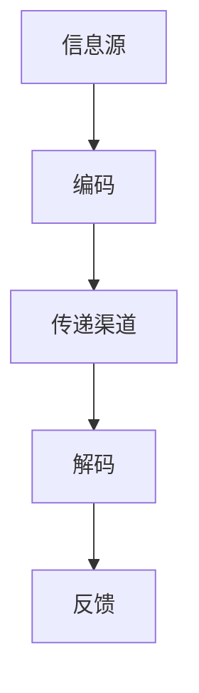
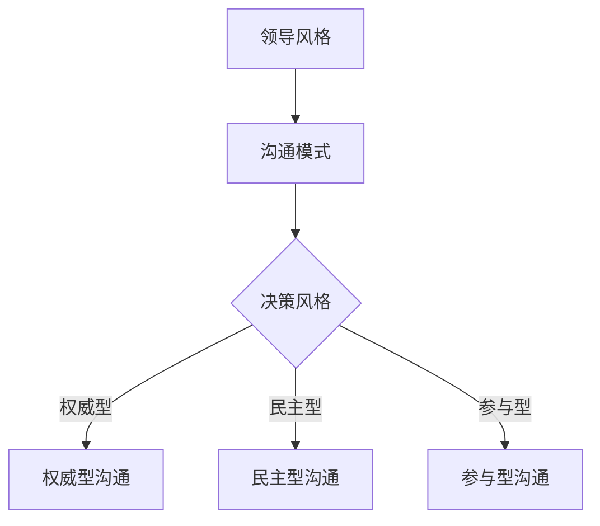
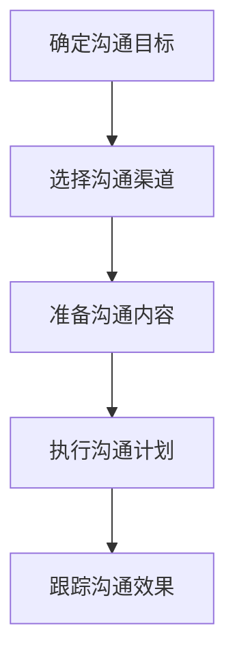
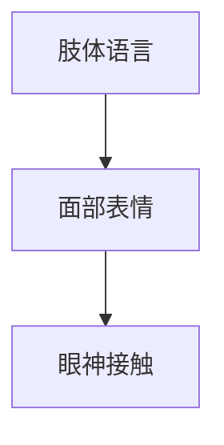
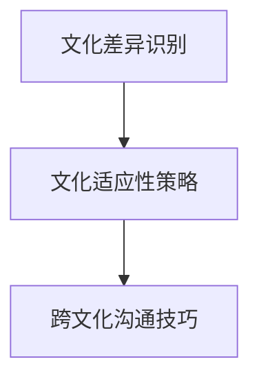

                 

### 文章标题：沟通的艺术：领导者必备的软实力

#### 关键词：领导力，沟通技巧，软技能，团队协作，领导者素质

#### 摘要：
在当今复杂多变的企业环境中，领导者的软实力显得尤为重要。本文将深入探讨沟通艺术在领导者软实力中的关键作用，从理论基础到实践应用，系统性地阐述有效沟通对领导者成功的影响。文章首先介绍沟通的基本概念和障碍，然后详细讨论领导者所需的沟通策略与技巧，最后通过实际案例分析和项目实战，展示如何将沟通艺术应用于领导实践，提升领导者的软实力。

---

### 引言

在数字化和全球化的浪潮中，企业领导者面临的挑战日益复杂。传统的硬技能，如技术能力和管理知识，已不足以支撑他们在多变的市场中脱颖而出。相反，软实力——特别是沟通能力——成为领导者成功的关键因素。良好的沟通不仅能够促进团队协作，还能提升组织的整体效能。

#### 领导者沟通的重要性

领导者作为组织的核心，其沟通能力直接影响到团队的凝聚力和工作效率。有效沟通能够：

1. **明确目标**：通过清晰的表达和倾听，领导者可以确保团队成员理解并致力于实现共同目标。
2. **激发潜能**：通过激励和认可，领导者能够激发团队成员的积极性和创造力。
3. **解决冲突**：在冲突中，领导者需要通过沟通来寻找解决方案，避免问题恶化。
4. **建立信任**：真诚和透明的沟通有助于建立领导者与团队成员之间的信任关系。

#### 文章结构

本文将按照以下结构进行讨论：

1. **沟通基础**：介绍沟通的基本概念、模型和障碍。
2. **领导者沟通策略**：探讨领导风格、情景领导理论和沟通计划。
3. **领导者沟通技巧**：阐述倾听技巧、提问技巧、非言语沟通和冲突处理。
4. **沟通障碍与解决方法**：分析文化差异、沟通反馈和沟通误区。
5. **项目沟通实践**：通过实际案例展示如何将沟通艺术应用于领导实践。

---

### 沟通基础

#### 沟通基本概念

沟通是指信息的传递和理解过程。它包括以下几个基本要素：

1. **信息源**：信息的发出者。
2. **编码**：信息源将信息转换为可以被传递的形式。
3. **传递渠道**：信息通过何种途径传递给接收者。
4. **解码**：接收者将传递的信息转换为可理解的形式。
5. **反馈**：接收者对信息的理解反馈给信息源。

#### 沟通模型

沟通模型描述了信息传递的流程。一个典型的沟通模型包括以下步骤：

1. **信息源**：个体或组织决定要传递的信息。
2. **编码**：信息源将信息转化为语言或其他符号形式。
3. **传递渠道**：信息通过语音、文字、图像等方式传递。
4. **解码**：接收者将信息从符号形式转换为有意义的信息。
5. **反馈**：接收者将理解后的信息反馈给信息源。

**Mermaid流程图**：



#### 沟通障碍与对策

沟通障碍是影响信息有效传递的因素。常见的障碍包括：

1. **语言障碍**：不同的人可能使用不同的词汇和表达方式。
2. **文化障碍**：不同的文化背景可能导致对同一信息的理解差异。
3. **心理障碍**：个体心理状态可能影响信息的接受和反馈。

针对这些障碍，可以采取以下对策：

1. **明确目标**：确保所有沟通参与者都明确沟通的目标。
2. **使用简单的语言**：避免使用过于专业或复杂的术语。
3. **提供反馈**：鼓励沟通参与者提供反馈，以确保理解正确。

**伪代码**：

```python
def effective_communication(message, receiver):
    clear_message = simplify_language(message)
    send_through_channel(clear_message)
    feedback = receiver.provide_feedback()
    return feedback
```

---

### 领导者沟通策略

#### 领导风格与沟通

领导风格对沟通方式有显著影响。常见的领导风格包括：

1. **权威型领导**：领导者做出决策，下属执行。
2. **民主型领导**：领导者与下属共同参与决策。
3. **参与型领导**：领导者鼓励下属参与决策和问题解决。

**Mermaid流程图**：



#### 情景领导与沟通

情景领导理论认为，领导风格应根据团队成员的不同成熟度进行调整。情景领导包括以下四个阶段：

1. **告知型领导**：领导者明确任务和期望。
2. **推销型领导**：领导者提供激励和支持。
3. **参与型领导**：领导者鼓励团队成员参与决策。
4. **授权型领导**：领导者赋予团队成员自主权。

**伪代码**：

```python
def situational_leadership(maturity_level):
    if maturity_level == 'low':
        return 'instructive_style'
    elif maturity_level == 'medium':
        return 'supportive_style'
    elif maturity_level == 'high':
        return 'empowering_style'
```

#### 沟通计划与目标设定

有效的沟通需要明确的计划和目标。沟通计划应包括以下步骤：

1. **确定沟通目标**：明确希望达成的目标。
2. **选择沟通渠道**：根据目标选择最合适的沟通渠道。
3. **准备沟通内容**：确保信息清晰、简洁、具有针对性。
4. **执行沟通计划**：按照计划进行沟通。
5. **跟踪沟通效果**：评估沟通效果，并根据反馈进行调整。

**流程图**：



---

### 领导者沟通技巧

#### 倾听技巧

倾听是有效沟通的核心。良好的倾听技巧包括：

1. **全身倾听**：保持专注，避免分心。
2. **积极倾听**：通过肢体语言和口头反馈表明关注。
3. **开放性问题**：鼓励对方表达更多想法。

**伪代码**：

```python
def active_listing(message):
    show_attention()
    provide_feedback()
    ask_open_questions()
    return message_understood
```

#### 提问技巧

提问技巧对于深入了解问题和激发思考至关重要。有效的提问技巧包括：

1. **开放性问题**：鼓励对方提供详细信息。
2. **封闭性问题**：用于获取具体信息。
3. **探索性问题**：引导对方深入思考。

**伪代码**：

```python
def ask_questions(question_type):
    if question_type == 'open':
        return open_question()
    elif question_type == 'closed':
        return closed_question()
    elif question_type == 'exploratory':
        return exploratory_question()
```

#### 非言语沟通

非言语沟通在传递信息中扮演重要角色。有效的非言语沟通技巧包括：

1. **肢体语言**：通过肢体动作传达意图。
2. **面部表情**：通过表情表达情感。
3. **眼神接触**：增强沟通的亲密感和信任感。

**流程图**：



#### 处理冲突

处理冲突是领导者的一项重要技能。有效的冲突处理技巧包括：

1. **冷静处理**：保持冷静，避免情绪化。
2. **倾听对方观点**：了解对方的立场。
3. **寻找共同点**：寻找双方都能接受的解决方案。
4. **有效沟通**：使用积极的沟通方式解决问题。

**伪代码**：

```python
def handle_conflict(conflict):
    remain_calm()
    listen_to_opponent()
    find_common_ground()
    communicate_effectively()
    return solution
```

---

### 沟通障碍与解决方法

#### 文化差异

文化差异可能导致沟通障碍。解决方法包括：

1. **了解文化背景**：了解不同文化的价值观和行为方式。
2. **使用简单的语言**：避免使用可能引起误解的术语。
3. **提供反馈**：鼓励沟通参与者提供反馈，以确保理解正确。

**Mermaid流程图**：



#### 沟通反馈

反馈是沟通中不可或缺的一部分。有效的反馈技巧包括：

1. **及时反馈**：在沟通后尽快提供反馈。
2. **具体反馈**：提供具体的正面和负面反馈。
3. **建设性反馈**：以建设性的方式提供反馈，避免伤害对方。

**伪代码**：

```python
def provide_feedback(communication):
    if communication.success:
        give_positive_feedback()
    else:
        give_constructive_feedback()
    return feedback_understood
```

#### 沟通误区

沟通误区可能导致误解和冲突。常见的沟通误区包括：

1. **假设理解**：在没有确认对方理解前，做出假设。
2. **忽略反馈**：忽视对方的反馈，导致误解。
3. **过于自信**：过度自信可能导致忽视对方的观点。

**解决方法**：

1. **确认理解**：在沟通后，确认对方是否理解了信息。
2. **积极倾听**：确保对方的反馈得到重视。
3. **开放心态**：保持开放心态，接受不同的观点。

---

### 项目沟通实践

#### 开发环境搭建

在项目沟通实践中，首先需要搭建一个稳定且高效的开发环境。以下是基本的步骤：

1. **确定技术栈**：根据项目的需求，选择合适的技术栈。
2. **搭建开发平台**：配置必要的开发工具和环境。
3. **版本控制**：使用版本控制系统（如Git）来管理代码。

#### 源代码实现

在源代码实现阶段，需要确保代码的清晰性和可维护性。以下是实现的关键步骤：

1. **模块化设计**：将代码划分为模块，以便于维护和扩展。
2. **注释文档**：在每个模块和关键代码段添加注释，以便后续理解和维护。
3. **代码审查**：通过代码审查来确保代码的质量和一致性。

#### 代码解读与分析

在代码解读与分析阶段，需要对实现的代码进行详细解读和分析。以下是关键的步骤：

1. **功能分析**：分析每个模块的功能和目的。
2. **性能评估**：评估代码的性能，找出可能的瓶颈。
3. **安全检查**：确保代码没有安全漏洞。

**案例分析与详细讲解剖析**：

**案例**：在一个团队项目中，团队成员需要在有限的时间内完成一个复杂的系统设计。以下是案例分析：

1. **问题识别**：在项目启动时，识别潜在的问题，如时间压力、技术难题等。
2. **沟通策略**：制定有效的沟通策略，如定期会议、实时沟通工具等，确保团队成员之间的信息畅通。
3. **解决方案**：通过有效的沟通，团队解决了多个关键问题，并在规定时间内完成了系统设计。

**项目小结**：

通过本次项目的沟通实践，团队认识到沟通在项目成功中的关键作用。有效的沟通不仅提高了团队的工作效率，还增强了团队的凝聚力。项目结束后，团队总结了以下经验：

1. **明确目标**：确保所有团队成员都明确项目的目标和期望。
2. **使用适当的沟通工具**：根据项目的需求选择合适的沟通工具，如邮件、即时通讯工具等。
3. **建立信任**：通过积极的沟通和相互支持，建立团队成员之间的信任关系。

---

### 最佳实践 tips、小结、注意事项、拓展阅读

#### 最佳实践 tips

1. **定期回顾沟通效果**：定期评估沟通效果，根据反馈进行调整。
2. **建立沟通机制**：确保沟通渠道的畅通，如定期会议、邮件更新等。
3. **培养倾听习惯**：倾听是有效沟通的关键，领导者应该培养良好的倾听习惯。

#### 小结

本文系统地阐述了沟通艺术在领导者软实力中的重要性，从理论基础到实践应用，提供了全面的指导。有效的沟通能力不仅有助于提升领导者的个人魅力，还能促进团队协作，提升组织的整体效能。

#### 注意事项

1. **避免假设理解**：在沟通中，始终确认对方是否理解信息。
2. **尊重文化差异**：在不同文化背景下，尊重对方的价值观和行为方式。

#### 拓展阅读

1. 《非暴力沟通》马歇尔·卢森堡
2. 《领导力与沟通技巧》斯蒂芬·罗宾斯
3. 《沟通的艺术》阿尔伯特·梅拉比安

---

### 作者信息

作者：AI天才研究院/AI Genius Institute & 禅与计算机程序设计艺术 /Zen And The Art of Computer Programming

本文由AI天才研究院和《禅与计算机程序设计艺术》的作者共同撰写，旨在帮助领导者提升沟通能力，实现个人和组织的成功。

