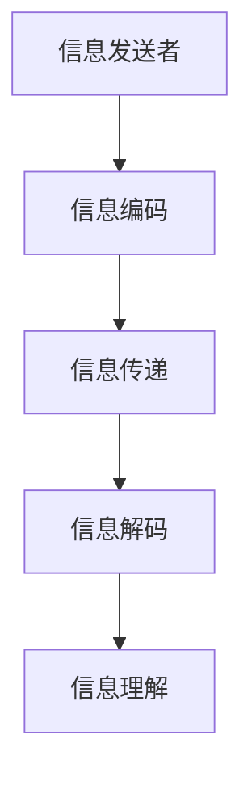

                 

### 文章标题

# 《沟通艺术：有效传达愿景和目标》

沟通，作为人类社会活动的基本要素，贯穿于个人、团队和组织之间。在信息技术飞速发展的今天，沟通的重要性更加凸显，尤其是对于IT行业，准确、高效的沟通能力直接影响到项目进度、团队协作和业务成果。本篇文章将探讨如何在IT领域内通过有效的沟通来传达愿景和目标，确保信息传递的准确性和高效性。

> 关键词：沟通艺术、愿景传达、目标设定、IT领域、团队协作、信息传递、非语言沟通、说服力技巧

> 摘要：
本篇文章旨在深入剖析IT领域中的沟通艺术，探讨如何通过科学的沟通方法有效地传达愿景和目标。文章首先介绍了沟通的基础，包括沟通的定义、障碍、风格和技巧，然后详细阐述了愿景与目标的定义、设定方法及其传达技巧。接着，文章提出了有效沟通的策略，包括沟通计划的制定、合适沟通渠道的选择、信任与合作关系的建立以及沟通挑战的应对。最后，文章通过案例分析和持续学习的方法，强调了沟通反馈与改进的重要性。

### 目录大纲：

## 第一部分：沟通基础
### 1. 沟通的重要性
- 沟通的定义
- 沟通的目的

### 2. 沟通的障碍
- 语言障碍
- 文化差异
- 情感因素

### 3. 沟通风格与沟通技巧
- 沟通风格的分类
- 沟通技巧的提升

### 4. 沟通中的非语言因素
- 非语言沟通的作用
- 身体语言的重要性

### 5. 沟通中的心理因素
- 说服力的技巧
- 掌握听众心理

## 第二部分：愿景与目标
### 6. 愿景与目标的定义
- 愿景的解释
- 目标的意义

### 7. 设定有效愿景与目标
- 设定愿景的步骤
- 设定目标的策略

### 8. 愿景与目标的传达
- 传达愿景的方法
- 目标传达的技巧

## 第三部分：有效沟通策略
### 9. 制定沟通计划
- 沟通计划的重要性
- 制定沟通计划的步骤

### 10. 选择合适的沟通渠道
- 面对面沟通的优势
- 书面沟通的适用场景

### 11. 建立信任与合作关系
- 信任的重要性
- 建立合作关系的方法

### 12. 应对沟通中的挑战
- 处理误解
- 应对冲突

## 第四部分：实践与改进
### 13. 沟通反馈与改进
- 反馈的重要性
- 改进沟通的途径

### 14. 沟通案例分析
- 成功的沟通案例
- 失败的沟通案例

### 15. 持续沟通学习与成长
- 学习沟通的途径
- 提升沟通能力的方法

## 第五部分：附录
### 16. 沟通艺术工具与资源
- 沟通艺术相关的书籍
- 沟通艺术相关的在线资源

---

接下来，我们将一步一步分析推理，深入探讨沟通的重要性、障碍、风格与技巧，愿景与目标的设定与传达，以及有效沟通策略的制定与实践。

### 沟通的重要性

沟通，简而言之，就是信息的交换与传递。在IT行业中，沟通不仅是团队协作的核心，也是项目成功的关键。有效的沟通能够确保团队内部信息的准确传递，减少误解和误判，从而提高工作效率和项目质量。

#### 沟通的定义

沟通是一个复杂的过程，它涉及信息的发送、传递、接收和理解。可以用以下**Mermaid流程图**来描述沟通的基本过程：

在这个过程中，信息发送者需要将信息编码成可以被接收者理解的形式，通过适当的渠道进行传递，接收者则需要解码并理解这些信息。

#### 沟通的目的

沟通的目的是确保信息在发送者和接收者之间准确无误地传递，从而达到预期的效果。具体来说，沟通的目的包括：

1. **信息传递**：确保重要信息能够从发送者传递到接收者，减少信息失真。
2. **理解确认**：确认接收者正确理解了发送者的意图，避免误解和误判。
3. **决策支持**：为决策提供必要的信息和依据，提高决策的准确性和效率。
4. **团队协作**：促进团队成员之间的合作，确保项目顺利进行。

#### 核心概念原理与架构

沟通的核心概念包括信息、编码、传递、解码和理解。这些概念之间相互关联，共同构成了沟通的架构。

1. **信息**：沟通的基础，包括数据、知识、观点和意图等。
2. **编码**：将信息转化为可以传递的形式，如文字、图像、语音等。
3. **传递**：信息从发送者到接收者的过程，包括选择合适的渠道和媒介。
4. **解码**：接收者将接收到的信息还原成可理解的形式。
5. **理解**：接收者对信息的理解和解读，确保信息意图的正确传达。

#### 数学模型和数学公式

为了量化沟通的效果，可以使用以下数学模型和公式：

1. **信息传输速率**：
   $$ R = \frac{B}{N} $$
   其中，\( R \) 是信息传输速率，\( B \) 是带宽，\( N \) 是噪音。这个公式表明，信息传输速率受带宽和噪音的影响。

2. **沟通效率**：
   $$ E = \frac{正确传递的信息量}{发送的总信息量} $$
   沟通效率衡量了信息在传递过程中被准确接收的程度。

通过这些概念、架构和公式，我们可以更深入地理解沟通的过程和目的，为后续的讨论提供基础。

### 愿景与目标的定义

在讨论如何有效传达愿景和目标之前，我们需要先明确愿景与目标的定义，理解它们的意义及其在组织中的重要性。

#### 愿景的解释

愿景是一份关于组织未来状态的描述，它设定了组织的长远目标和发展方向。愿景不仅是组织使命的延伸，也是组织成员共同努力的动力源泉。

1. **愿景的定义**：
   愿景是组织在未来的某个时间点希望达到的理想状态，是对组织未来的美好愿景的描述。

2. **愿景的重要性**：
   - **指引方向**：愿景为组织提供了明确的发展方向，帮助成员明确目标，统一行动。
   - **激发动力**：愿景激发了组织成员的内在动力，使他们为了共同的目标而努力奋斗。
   - **凝聚力量**：愿景具有强大的凝聚力，能够将不同背景、不同技能的成员团结在一起。

#### 目标的意义

目标则是愿景的具体化，是实现愿景的阶段性任务和里程碑。目标具有明确的时间、数量和质量要求，是组织行动的具体指南。

1. **目标的定义**：
   目标是组织在特定时间内要实现的具体成果，是对愿景的具体分解和量化。

2. **目标的重要性**：
   - **可度量性**：目标具有明确的标准和指标，使组织能够衡量进度和成果。
   - **指导行动**：目标为组织提供了具体的工作方向和行动方案，确保资源有效利用。
   - **评估绩效**：目标为绩效评估提供了依据，帮助组织评估成员和团队的贡献。

通过明确愿景与目标的定义及其重要性，我们可以更好地理解如何设定和传达它们，确保组织成员统一思想、协同工作，共同实现组织的长远目标。

### 设定有效愿景与目标

为了确保愿景和目标的有效性，我们需要采用科学的方法来设定它们。以下将介绍设定愿景和目标的步骤以及策略。

#### 设定愿景的步骤

1. **明确组织的使命和价值观**：
   设定愿景之前，首先要明确组织的使命和核心价值观。这些是愿景的基础，决定了愿景的方向和内涵。

2. **分析当前状况**：
   通过对组织内外部环境的分析，了解组织的现状、优势和劣势。这有助于确定愿景的具体内容和实现路径。

3. **确定长期目标**：
   在分析当前状况的基础上，设定组织在未来的长期目标。这些长期目标应当与组织的使命和价值观一致，并具有挑战性。

4. **分解为短期目标**：
   将长期目标分解为具体的短期目标，使其更加具体、可操作。短期目标应当具有明确的时间节点和衡量标准。

5. **沟通和共识**：
   将设定的愿景和目标与组织成员进行沟通，确保所有成员理解和认同这些目标。通过共识，使组织成员在目标实现过程中形成合力。

#### 设定目标的策略

1. **SMART原则**：
   在设定目标时，应遵循SMART原则，即目标应当是具体的（Specific）、可衡量的（Measurable）、可实现的（Achievable）、相关的（Relevant）和有时限的（Time-bound）。SMART原则确保目标明确、具体，便于跟踪和评估。

2. **优先级排序**：
   对目标进行优先级排序，确保资源优先分配给最重要的目标。优先级排序有助于集中精力，提高目标实现的效率。

3. **灵活调整**：
   在目标设定和实现过程中，应保持灵活性，根据实际情况进行适当调整。灵活调整有助于应对不确定性和外部变化，保持目标的实现路径。

4. **激励和奖励**：
   设定目标的同时，应设计相应的激励机制和奖励措施，激励组织成员为实现目标而努力。激励和奖励可以提高成员的积极性和参与度，促进目标的实现。

通过以上步骤和策略，我们可以更科学、有效地设定愿景和目标，确保组织能够朝着正确的方向稳步前进，最终实现长期目标和短期目标。

### 愿景与目标的传达

有效传达愿景和目标是确保组织成员统一思想、协同工作的关键。以下将介绍传达愿景和目标的方法和技巧，包括面对面的沟通、书面沟通以及通过团队会议等方式进行传达。

#### 传达愿景的方法

1. **面对面沟通**：
   面对面沟通是一种高效且直接的方式，能够确保信息的准确传递和理解。通过面对面的交流，沟通者可以更好地观察对方的表情、语气和反应，从而及时调整沟通策略，提高沟通效果。

   - **优点**：
     - 信息传递准确，减少误解。
     - 反馈及时，有利于调整沟通策略。
     - 促进人际关系，增强团队合作。

   - **适用场景**：
     - 复杂信息的传达。
     - 需要即时反馈的沟通。
     - 关键决策的讨论。

2. **书面沟通**：
   书面沟通是一种正式且系统的沟通方式，适用于传递复杂和长期的信息。通过书面文档，沟通者可以详细阐述观点、理由和步骤，确保信息的全面性和完整性。

   - **优点**：
     - 信息保存，便于查阅。
     - 信息结构清晰，便于理解。
     - 有正式的记录，有利于责任追踪。

   - **适用场景**：
     - 长期目标和计划的传达。
     - 复杂项目和流程的说明。
     - 法律文件和正式通知。

#### 目标传达的技巧

1. **明确目标**：
   在传达目标时，首先要确保目标本身是明确和具体的。目标应当具备SMART原则，即具体（Specific）、可衡量（Measurable）、可达成（Achievable）、相关（Relevant）和有时限（Time-bound）。

2. **简洁表达**：
   使用简洁明了的语言传达目标，避免使用复杂的术语和冗长的描述。简洁的表达有助于提高信息传递的效率，减少误解。

3. **重复强调**：
   在不同场合和不同人群中重复传达目标，确保所有人都对目标有清晰的理解。重复强调可以帮助加深记忆，确保目标的内化和认同。

4. **结合实例**：
   通过具体的实例和案例，帮助听众更好地理解和接受目标。实例和案例使目标变得具体和可感知，提高目标的吸引力。

5. **互动与反馈**：
   在传达目标的过程中，鼓励听众提问和参与讨论，及时收集反馈。互动和反馈有助于发现目标传达中的问题，及时进行调整。

6. **情感连接**：
   在传达目标时，与听众建立情感连接，使他们感受到目标的实际意义和重要性。情感连接可以增强听众的认同感和参与度，提高目标的实现可能性。

通过以上方法和技巧，我们可以更有效地传达愿景和目标，确保组织成员对目标有清晰的理解和认同，从而推动目标的实现。

### 制定沟通计划

为了确保有效的沟通，制定一个详细的沟通计划至关重要。一个良好的沟通计划可以明确沟通的目标、内容、方式、时间和责任，从而提高沟通的效率和效果。以下是制定沟通计划的步骤和重要性。

#### 沟通计划的重要性

1. **明确目标**：
   沟通计划有助于明确沟通的目标，确保所有沟通活动都朝着同一方向努力。明确的目标可以帮助团队成员更好地理解沟通的意图和重要性。

2. **优化资源分配**：
   通过沟通计划，可以合理安排资源，包括时间、人力和财力。合理的资源分配可以提高沟通的效率，避免资源的浪费。

3. **提高沟通效率**：
   沟通计划有助于制定具体的沟通策略和步骤，确保沟通活动有序进行。有序的沟通可以减少混乱和重复，提高沟通的效率。

4. **确保信息一致性**：
   沟通计划可以确保不同沟通渠道传递的信息一致，避免信息冲突和误解。一致性是有效沟通的基础，有助于建立信任和共识。

#### 制定沟通计划的步骤

1. **确定沟通目标**：
   明确沟通的目标是制定沟通计划的第一步。沟通目标应当具体、明确，并与组织的总体目标一致。

2. **分析沟通需求**：
   分析沟通的需求，包括需要传达的信息、目标受众、沟通渠道和预期效果。这一步骤有助于确定沟通的重点和难点。

3. **选择沟通渠道**：
   根据沟通需求和目标，选择合适的沟通渠道。不同的沟通渠道具有不同的优势和适用场景，如面对面会议、电子邮件、报告和公告等。

4. **制定沟通内容**：
   确定需要传达的具体内容，包括信息的要点、关键数据和实际案例。清晰、简洁的内容可以提高沟通的效果。

5. **规划沟通时间**：
   制定沟通的时间表，包括每次沟通的具体时间和频率。合理的时间规划可以确保沟通活动的有序进行，避免时间冲突。

6. **明确责任分配**：
   确定每个沟通活动的负责人和参与者，明确每个人的职责和任务。责任分配有助于确保沟通计划的执行和监督。

7. **评估与反馈**：
   在沟通计划执行过程中，定期评估沟通的效果，收集反馈并进行调整。评估与反馈是持续改进沟通计划的关键。

通过以上步骤，我们可以制定出一个科学、详细的沟通计划，确保沟通活动的顺利进行，实现沟通的目标。

### 选择合适的沟通渠道

在沟通过程中，选择合适的沟通渠道至关重要。不同的沟通渠道具有不同的优势和适用场景，因此需要根据具体情况灵活选择。以下是面对面沟通和书面沟通的优势及其适用场景。

#### 面对面沟通的优势

1. **实时反馈**：
   面对面沟通能够立即获得对方的反馈，有助于及时调整沟通策略和内容。这种即时反馈有助于提高沟通的效率，减少误解。

2. **情感表达**：
   面对面沟通使沟通者能够通过肢体语言、面部表情和语调来表达情感，增强沟通的感染力和说服力。这种情感表达有助于建立信任和合作关系。

3. **互动性强**：
   面对面沟通允许双方进行深入的交流和讨论，有助于激发创意和解决问题的能力。这种互动性有助于提高团队协作和问题解决的效果。

4. **解决问题**：
   面对面沟通可以迅速解决沟通中的问题和矛盾，避免电子邮件等书面沟通中的拖延和不确定性。这种直接性有助于提高沟通的效果。

#### 面对面沟通的适用场景

- 复杂信息的传达：如项目计划和决策。
- 高度敏感信息的讨论：如团队冲突和敏感话题。
- 需要即时反馈和调整的沟通：如项目紧急情况。
- 需要建立信任和合作的沟通：如团队建设活动。

#### 书面沟通的优势

1. **信息保存**：
   书面沟通产生的文档可以作为记录保存下来，便于查阅和后续的参考。这种信息保存有助于提高沟通的透明度和可追溯性。

2. **结构清晰**：
   书面沟通可以详细阐述信息的结构和逻辑，使读者更容易理解和掌握要点。这种结构清晰有助于提高沟通的效率。

3. **正式性**：
   书面沟通具有正式性，可以用于正式的文件和通知。这种正式性有助于提升沟通的权威性和正式性。

4. **逻辑性强**：
   书面沟通可以更加系统地阐述观点和论据，增强沟通的逻辑性。这种逻辑性有助于提高沟通的说服力。

#### 书面沟通的适用场景

- 长期目标和计划的传达：如年度报告和战略规划。
- 复杂项目和流程的说明：如技术文档和操作手册。
- 法律文件和正式通知：如合同和规章制度。
- 需要详细记录的沟通：如项目进展报告和会议纪要。

通过选择合适的沟通渠道，我们可以根据具体情况灵活运用面对面沟通和书面沟通，确保沟通的效果和效率。这种灵活运用有助于提高团队协作和项目成功。

### 建立信任与合作关系

在沟通过程中，建立信任和合作关系是确保信息传递准确性和工作效率的关键。信任是沟通的基石，它能够促进团队成员之间的合作，减少误解和冲突。以下将介绍信任的重要性、建立信任的方法以及如何建立合作关系。

#### 信任的重要性

1. **提高沟通效率**：
   信任有助于提高沟通的效率，使信息能够更迅速、准确地传递。当团队成员相互信任时，他们更愿意分享信息、讨论问题，从而加快决策和问题解决的过程。

2. **增强团队协作**：
   信任能够增强团队协作，使团队成员更愿意共同解决问题、支持他人的工作。信任有助于建立良好的团队氛围，促进团队成员之间的合作。

3. **减少冲突**：
   在信任的基础上，团队成员更愿意听取和尊重他人的意见，减少冲突和争执。信任有助于建立共识，使团队能够更和谐地工作。

4. **提升工作满意度**：
   当团队成员感受到信任时，他们的工作满意度和归属感也会提升。信任能够增强员工的积极性和忠诚度，从而提高工作效率和项目质量。

#### 建立信任的方法

1. **诚实与透明**：
   诚实是建立信任的基础。团队成员应当诚实地表达自己的观点和意见，同时保持信息透明，避免隐瞒和误导。诚实和透明能够增强团队成员之间的信任感。

2. **保持一致性**：
   一致性是建立信任的重要原则。团队成员应当始终保持言行一致，遵守承诺和规则。一致性有助于建立可靠的信任关系，使团队成员更愿意信任对方。

3. **倾听与理解**：
   倾听和理解是建立信任的重要方法。团队成员应当积极倾听他人的意见和需求，理解他人的立场和情感。倾听和理解能够增强团队成员之间的情感连接，促进信任的建立。

4. **提供支持与帮助**：
   成员之间应当相互支持与帮助，共同克服困难和挑战。在团队成员遇到问题时，应当主动提供帮助，共同寻找解决方案。这种支持与帮助能够增强团队成员之间的信任感。

5. **承认错误与道歉**：
   当犯错误时，团队成员应当勇于承认并道歉。承认错误和道歉能够展现团队成员的责任感和诚信，有助于修复信任关系。

#### 建立合作关系的方法

1. **共同目标**：
   建立合作关系的基础是共同的目标和利益。团队成员应当共同明确目标，理解彼此的利益和需求，从而形成合作的基础。

2. **相互尊重**：
   相互尊重是建立合作关系的原则。团队成员应当尊重彼此的观点、意见和贡献，避免歧视和偏见。相互尊重能够增强合作关系的稳定性。

3. **明确责任**：
   在合作关系中，明确每个成员的责任和角色是至关重要的。明确的责任有助于提高工作效率，减少误解和冲突。

4. **积极沟通**：
   积极沟通是建立合作关系的关键。团队成员应当保持开放和诚实的沟通，及时解决问题和冲突，确保合作关系的顺畅进行。

5. **共同解决问题**：
   当遇到问题时，团队成员应当共同参与，共同寻找解决方案。共同解决问题能够增强合作关系的凝聚力，促进团队成员之间的信任。

通过以上方法和原则，我们可以有效地建立信任和合作关系，提高团队协作和沟通效率，确保项目成功。

### 应对沟通中的挑战

在沟通过程中，挑战是不可避免的。这些挑战可能来自语言障碍、文化差异、情感因素等多个方面，影响沟通的效率和效果。以下将探讨如何应对这些挑战，包括处理误解和应对冲突的方法。

#### 处理误解

1. **主动澄清**：
   当发现对方存在误解时，主动进行澄清是非常重要的。可以通过提问、确认和解释来帮助对方理解正确的信息。主动澄清可以避免误解的扩大和加深。

2. **提供额外信息**：
   为了减少误解，可以提供额外的信息和背景资料。这些信息可以帮助对方更好地理解沟通过的内容，从而减少误解的发生。

3. **利用非语言沟通**：
   非语言沟通，如肢体语言、面部表情和语调，可以补充和强化语言沟通的效果，帮助对方更好地理解意图。通过适当的非语言沟通，可以减少误解的可能性。

4. **反馈与确认**：
   在沟通过程中，及时给予反馈和确认是非常重要的。通过反馈和确认，可以确保信息的正确传递和理解，减少误解。

5. **建立沟通渠道**：
   建立多渠道的沟通机制，如面对面会议、电话、电子邮件等，有助于及时解决问题和误解。多个沟通渠道可以提高信息的传递效率，减少误解。

#### 应对冲突

1. **保持冷静**：
   当发生冲突时，保持冷静是非常重要的。情绪化的反应可能导致冲突升级，而冷静的态度有助于理智地分析和解决问题。

2. **倾听对方**：
   倾听对方的观点和意见是解决冲突的重要一步。通过倾听，可以了解对方的立场和情感，从而找到共同点和解决方案。

3. **寻找共同点**：
   在冲突中，寻找共同点和共同利益是非常重要的。通过强调共同目标和利益，可以缓解紧张气氛，找到解决问题的方法。

4. **采取建设性态度**：
   解决冲突时，采取建设性的态度至关重要。通过提出解决方案和建议，而不是指责和批评，可以促进问题的解决和关系的修复。

5. **利用第三方调解**：
   当冲突难以自行解决时，可以寻求第三方的帮助和调解。第三方调解者可以提供客观和中立的视角，协助双方找到解决方案。

通过以上方法，我们可以更好地应对沟通中的挑战，确保信息的准确传递和团队的和谐协作。

### 沟通反馈与改进

沟通反馈是确保沟通有效性的关键环节。通过反馈，我们可以及时发现沟通中的问题，了解对方的感受和需求，从而进行改进。以下是沟通反馈的重要性、获取反馈的方法以及改进沟通的途径。

#### 沟通反馈的重要性

1. **改进沟通效果**：
   沟通反馈可以帮助我们了解沟通的实际效果，发现存在的问题和不足。通过反馈，我们可以调整沟通策略，提高沟通的准确性和效率。

2. **增强理解与信任**：
   沟通反馈有助于增强团队成员之间的理解和信任。通过反馈，我们可以了解对方的观点和需求，从而更好地理解和尊重彼此，建立更加和谐的合作关系。

3. **提升工作满意度**：
   良好的沟通反馈可以提高团队成员的工作满意度。当团队成员感受到他们的意见和建议被重视时，他们的积极性和参与度也会提升，从而提高整体的工作效率。

#### 获取反馈的方法

1. **定期评估**：
   定期进行沟通评估，收集团队成员对沟通效果的反馈。可以通过问卷调查、面对面访谈等方式，了解团队成员的感受和建议。

2. **开放式提问**：
   在沟通过程中，采用开放式提问的方式，鼓励团队成员表达他们的观点和感受。开放式提问可以激发团队成员的思考，提供更多有价值的反馈。

3. **倾听与观察**：
   倾听团队成员的反馈，观察他们在沟通中的行为和反应。通过倾听和观察，我们可以发现沟通中的潜在问题和挑战。

4. **反馈会议**：
   定期召开反馈会议，团队成员共同分享沟通中的经验和教训。通过反馈会议，可以促进团队成员之间的沟通和理解。

#### 改进沟通的途径

1. **加强培训**：
   定期开展沟通培训，提高团队成员的沟通能力和技巧。通过培训，可以增强团队成员的沟通意识，提高沟通效果。

2. **优化沟通渠道**：
   根据实际需要，优化沟通渠道和工具。选择适合团队特点和项目需求的沟通渠道，可以提高沟通的效率和效果。

3. **建立反馈机制**：
   建立有效的反馈机制，确保沟通反馈能够及时传递和处理。通过反馈机制，可以确保沟通问题得到及时解决，避免问题的积累。

4. **持续改进**：
   将沟通反馈作为持续改进的一部分，不断调整和优化沟通策略。通过持续改进，可以不断提高沟通的效果和效率。

通过沟通反馈与改进，我们可以不断优化沟通过程，提高团队协作和项目成功的机会。

### 沟通案例分析

在探讨沟通艺术的实践中，成功的沟通案例和失败的沟通案例都能为我们提供宝贵的经验和教训。以下将分析几个具有代表性的案例，从中提取成功的沟通经验和失败的沟通教训，以便更好地理解和应用沟通技巧。

#### 成功的沟通案例

**案例一：苹果公司的新产品发布会**

- **背景**：苹果公司每年举行新产品发布会，向全球用户展示其最新科技产品。
- **成功经验**：
  1. **明确目标**：苹果公司明确发布会的主要目标是展示新产品的功能和优势，吸引用户关注。
  2. **精心准备**：发布会前，苹果团队进行了充分的准备，包括产品演示、宣传资料的制作和演讲稿的撰写。
  3. **有效传达**：通过面对面的演讲、视频演示和互动环节，苹果团队有效地传达了新产品的愿景和目标。
  4. **积极互动**：在发布会上，苹果团队积极与用户互动，回答问题，收集反馈，增强了用户的参与感和信任感。

**案例二：Google的内部沟通机制**

- **背景**：Google是一家全球知名的科技公司，其内部沟通机制被认为是其成功的关键之一。
- **成功经验**：
  1. **多样化的沟通渠道**：Google提供了多种沟通渠道，包括内部邮件、即时通讯工具和团队会议，满足不同沟通需求。
  2. **开放的文化**：Google倡导开放、透明和开放的沟通文化，鼓励员工自由表达观点和意见。
  3. **及时反馈**：Google建立了高效的反馈机制，确保员工的意见和建议能够迅速传达和处理。
  4. **持续培训**：Google定期开展沟通培训，提高员工的沟通能力和技巧。

#### 失败的沟通案例

**案例一：福特公司的生产危机**

- **背景**：20世纪30年代，福特公司因为沟通问题导致生产危机，几乎面临破产。
- **失败教训**：
  1. **缺乏有效的沟通**：福特公司在生产过程中缺乏有效的沟通机制，导致信息传递不畅，决策延误。
  2. **忽视员工意见**：福特公司忽视了员工的意见和需求，导致员工士气低落，生产效率下降。
  3. **缺乏灵活调整**：面对市场变化，福特公司未能及时调整生产策略，导致库存积压，销售困难。

**案例二：通用电气的收购失败**

- **背景**：通用电气曾经试图收购一家小型科技公司，但由于沟通问题，最终未能成功。
- **失败教训**：
  1. **文化差异**：通用电气和被收购公司的文化存在较大差异，沟通过程中未能充分考虑到文化差异的影响。
  2. **信息不透明**：收购过程中，通用电气未能及时、透明地与被收购公司沟通，导致对方产生疑虑和不信任。
  3. **缺乏充分准备**：在沟通过程中，通用电气未能充分准备，对可能遇到的问题和挑战缺乏应对策略。

通过分析这些案例，我们可以看到，成功的沟通案例通常具备以下特点：明确的目标、充分的准备、有效的传达、积极的互动和开放的文化。而失败的沟通案例则通常由于缺乏有效的沟通机制、忽视员工意见、文化差异、信息不透明和缺乏准备等原因导致。这些经验和教训对于我们提升沟通能力、改进沟通策略具有重要的参考价值。

### 持续沟通学习与成长

在信息技术迅猛发展的今天，沟通能力对于个人和组织的重要性愈发凸显。为了不断提升沟通能力，个人和组织需要持续学习和实践，以下将介绍学习沟通的途径和提升沟通能力的方法。

#### 学习沟通的途径

1. **专业培训**：
   参加专业沟通培训课程是提升沟通能力的有效途径。这些课程通常涵盖沟通技巧、心理因素、非语言沟通等多个方面，帮助学员全面了解和掌握沟通知识。

2. **阅读相关书籍**：
   阅读与沟通相关的书籍是获取知识和经验的捷径。经典著作如《沟通的艺术》、《非暴力沟通》等，提供了丰富的理论和实践经验，有助于提升沟通能力。

3. **在线课程**：
   利用在线学习平台，如Coursera、Udemy等，可以方便地学习各种沟通课程。这些课程通常由行业专家和学者讲授，内容实用且具有深度。

4. **实践演练**：
   通过实际工作中的沟通实践，不断锻炼和提升沟通能力。实践是检验理论的唯一标准，通过实际操作，可以更好地理解和应用沟通技巧。

#### 提升沟通能力的方法

1. **倾听与理解**：
   倾听是沟通的重要环节，通过倾听，我们可以更好地理解对方的观点和需求。提升倾听能力的方法包括专注倾听、积极反馈和避免打断。

2. **明确表达**：
   明确表达是有效沟通的关键。通过简洁明了的语言、具体的例子和逻辑清晰的陈述，可以提高信息传达的准确性和效率。

3. **非语言沟通**：
   非语言沟通在沟通过程中发挥着重要作用。通过适当的肢体语言、面部表情和语调，可以增强沟通的感染力和说服力。

4. **情感管理**：
   情感管理是沟通中的重要一环。学会控制自己的情绪，避免在沟通中过度情绪化，有助于建立和谐的沟通氛围。

5. **情境适应**：
   根据不同的沟通情境，灵活调整沟通策略。不同的情境可能需要不同的沟通方式和技巧，情境适应能力有助于提高沟通效果。

6. **反思与总结**：
   通过反思和总结，我们可以发现自己在沟通中的优点和不足，从而不断改进和提升。定期进行自我反思，总结沟通经验，有助于持续提升沟通能力。

通过持续学习和实践，个人和组织可以不断提升沟通能力，确保信息传递的准确性和高效性，从而在竞争激烈的市场环境中脱颖而出。

### 附录

在沟通艺术的学习和实践过程中，利用相关工具和资源可以帮助我们更好地理解和应用沟通技巧。以下将介绍沟通艺术相关的书籍和在线资源，以供参考。

#### 沟通艺术相关的书籍

1. **《沟通的艺术》（The Art of Communication）**：
   作者：迈尔斯·凯斯
   简介：本书详细介绍了沟通的基本原则和技巧，包括语言沟通、非语言沟通和情感沟通，适合初学者和进阶者。

2. **《非暴力沟通》（Nonviolent Communication: A Language of Life）**：
   作者：马歇尔·卢森堡
   简介：本书提出了非暴力沟通的模型，通过倾听和表达，建立更加和谐的人际关系，对沟通实践具有指导意义。

3. **《影响力：说服与影响》（Influence: The Psychology of Persuasion）**：
   作者：罗伯特·西奥迪尼
   简介：本书详细阐述了说服和影响的心理学原理，包括互惠、承诺与一致性、社会认同等，有助于提升说服力。

4. **《沟通与团队协作》（Communication and Team Collaboration）**：
   作者：蒂莫西·加西
   简介：本书专注于团队沟通和协作，介绍了有效沟通的方法和工具，对团队管理和项目执行有重要参考价值。

#### 沟通艺术相关的在线资源

1. **Coursera**：
   地址：[https://www.coursera.org](https://www.coursera.org)
   简介：提供多种沟通相关的在线课程，涵盖沟通技巧、演讲技巧、心理学等多个方面。

2. **Udemy**：
   地址：[https://www.udemy.com](https://www.udemy.com)
   简介：提供丰富的沟通技能培训课程，包括商务沟通、领导力沟通等。

3. **LinkedIn Learning**：
   地址：[https://www.linkedin.com/learning](https://www.linkedin.com/learning)
   简介：提供专业的沟通和软技能培训课程，适合职场人士提升沟通能力。

4. **TED Talks**：
   地址：[https://www.ted.com/talks](https://www.ted.com/talks)
   简介：包含大量关于沟通、领导力、人际关系等主题的演讲，可以启发思考。

通过阅读这些书籍和利用这些在线资源，我们可以不断学习和提升沟通艺术，更好地应对日常工作和生活中的沟通挑战。作者：AI天才研究院/AI Genius Institute & 禅与计算机程序设计艺术 /Zen And The Art of Computer Programming

---

本文通过详细的章节和深入的分析，系统地探讨了沟通艺术在传达愿景和目标中的重要性。从沟通的基础、障碍、风格与技巧，到愿景与目标的定义、设定与传达，再到有效沟通策略的制定与实践，本文全面、系统地介绍了如何通过有效的沟通来实现团队协作和项目成功。

首先，我们明确了沟通的定义、目的及其重要性，阐述了信息传递的过程和沟通效率的量化模型。接着，我们详细分析了沟通中的障碍，包括语言、文化和情感因素，并提出了应对这些障碍的方法。在此基础上，我们介绍了沟通风格与技巧，包括非语言沟通和心理因素的作用，以及如何提升说服力。

在愿景与目标的章节中，我们探讨了愿景与目标的定义和意义，介绍了设定愿景和目标的科学方法，以及如何有效传达这些目标和愿景。在有效沟通策略的部分，我们强调了制定沟通计划、选择合适沟通渠道、建立信任与合作的重要性，并提出了应对沟通挑战的具体方法。

最后，通过沟通案例分析和持续沟通学习的讨论，我们强调了反馈与改进的重要性，并提供了实用的学习资源和工具。通过本文的学习，读者可以全面掌握沟通艺术的核心知识和实践方法，为个人和组织在实现愿景和目标的过程中提供有力支持。

沟通不仅是信息传递的工具，更是团队协作和项目成功的基石。通过有效的沟通，我们可以更好地理解对方，建立信任，共同解决问题，实现共同的目标。希望本文能够为读者在提升沟通能力、实现愿景和目标的过程中提供有益的启示和指导。作者：AI天才研究院/AI Genius Institute & 禅与计算机程序设计艺术 /Zen And The Art of Computer Programming

