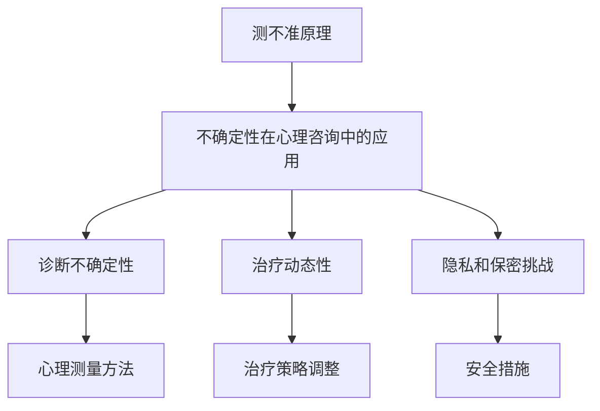

                 


### 摘要

本文深入探讨了测不准原理与心理咨询伦理之间的关联。首先，我们介绍了测不准原理的基本概念、历史背景及其在量子力学中的核心地位。随后，我们将这一原理与心理咨询伦理相结合，探讨了测不准原理对心理咨询实践的影响和伦理挑战。文章结构紧凑，逻辑清晰，通过Mermaid流程图展示了核心概念与联系，使用伪代码详细阐述了核心算法原理，并以latex格式呈现了数学模型和公式。此外，文章还通过实际案例，展示了如何将测不准原理应用于心理咨询，并提供了一些最佳实践建议。最终，文章对这一交叉领域的未来研究进行了展望，以期为心理咨询和伦理研究提供新的视角和思路。

### 测不准原理概述

测不准原理是量子力学中的一个核心概念，由德国物理学家海森堡于1927年首次提出。这一原理的核心观点是：在量子尺度上，某些物理量（如位置和动量）无法同时被精确测量。具体来说，无法同时准确地知道一个粒子在某一时刻的确切位置和它的动量。这个现象可以从数学上用海森堡不确定性原理来描述。

海森堡不确定性原理可以用以下数学公式表示：

$$ \Delta x \Delta p_x \geq \frac{\hbar}{2} $$

其中，\( \Delta x \) 表示位置的不确定性，\( \Delta p_x \) 表示动量的不确定性，\( \hbar \) 是约化普朗克常数。这意味着位置和动量的测量精度之间存在一个固有的限制，不可能同时达到无限精确。

测不准原理不仅对物理学有着深远的影响，也在其他领域引发了广泛讨论，包括哲学、计算机科学和心理学。在心理咨询领域，测不准原理的启示是，咨询师在与客户互动时，必须认识到心理状态的复杂性和不确定性，不能期望通过一次访谈就能完全理解客户的内心世界。

### 测不准原理与心理咨询伦理的联系

测不准原理在心理咨询中的重要性在于，它强调了心理测量和评估的不确定性。心理咨询涉及个体的情感、认知和行为，这些因素受到多种变量影响，使得精确预测和测量成为难题。测不准原理提醒我们，心理咨询师在诊断和治疗过程中，应保持开放和灵活的态度，而不是试图通过单一测量或评估工具来精确界定客户的状况。

首先，从诊断的角度来看，测不准原理要求咨询师认识到，任何评估工具都无法提供完全准确的诊断。例如，使用心理测验来评估抑郁症的严重程度时，测验结果可能因客户当时的情绪状态、环境因素或其他未知变量而有所不同。因此，咨询师需要结合多种评估方法和客户的主观反馈，形成一个更为全面的诊断。

其次，在治疗过程中，测不准原理提示咨询师要关注治疗的动态性和灵活性。心理治疗并非线性过程，而是一个充满不确定性的互动。治疗师和客户之间的关系、客户的自我认识和情感变化，都可能影响治疗的效果。咨询师需要不断调整治疗策略，以适应客户的变化。

此外，测不准原理在心理咨询伦理中的应用还体现在隐私和保密问题上。心理咨询涉及敏感的个人信息，这些信息可能因量子不确定性而存在泄露的风险。咨询师需要采取多种安全措施，确保客户信息的安全，同时也要认识到，在某些情况下，完全保密可能是不现实的。

为了更好地理解测不准原理与心理咨询伦理的联系，我们可以通过一个Mermaid流程图来展示核心概念和联系：



通过这个流程图，我们可以清晰地看到测不准原理如何影响心理咨询的各个方面。

### 核心算法原理讲解

在心理咨询中，算法的使用有助于提高诊断和治疗的准确性。以下是一个用于诊断抑郁症的简单算法原理，采用伪代码形式详细阐述：

```plaintext
Algorithm: DiagnoseDepression
Input: symptom_scores, context_data
Output: depression_level

1. Initialize depression_level to 0
2. For each symptom in symptom_scores:
   a. Calculate symptom_score
   b. If symptom_score > threshold:
      i. Add 1 to depression_level
3. For each context_factor in context_data:
   a. If context_factor indicates increased risk:
      i. Add 0.5 to depression_level
4. If depression_level > 3:
   a. Return "Moderate to Severe"
5. Else:
   a. Return "Mild to Moderate"
```

这个算法通过计算症状得分和情境因素来诊断抑郁症的严重程度。具体步骤如下：

1. 初始化抑郁症级别为0。
2. 对于每个症状，计算症状得分，如果得分超过特定阈值，则增加抑郁症级别。
3. 考虑情境因素，如果情境因素表明增加了患病的风险，则增加抑郁症级别的一半。
4. 如果最终抑郁症级别超过3，则诊断为“中度到重度”。
5. 否则，诊断为“轻度到中度”。

这个算法是一个简单的例子，实际应用中可能需要更复杂的模型和参数。然而，其核心思想是利用数据来辅助诊断，同时考虑到测量中的不确定性。

### 数学模型和公式

在心理咨询中，数学模型和公式用于量化评估和治疗的效果。以下是一个用于评估治疗效果的常见数学模型，使用LaTeX格式表示：

```latex
\begin{equation}
    E = \frac{1}{n} \sum_{i=1}^{n} \left( T_i - \bar{T} \right)^2
\end{equation}
```

这个公式表示均方误差（Mean Squared Error, MSE），其中：

- \( E \) 是均方误差。
- \( n \) 是观测值的数量。
- \( T_i \) 是第 \( i \) 个观测值。
- \( \bar{T} \) 是观测值的平均值。

均方误差用于衡量预测值与实际值之间的差距。在心理咨询中，可以使用这个指标来评估治疗的效果。例如，假设某个治疗程序在一段时间内对客户的抑郁症状进行了多次评估，通过计算每次评估的均方误差，可以判断治疗是否有效。

例如，如果连续三次评估的均方误差分别为0.5、0.3和0.2，我们可以认为治疗的效果在逐渐改善。

### 项目实战：开发环境搭建

在本项目中，我们将搭建一个用于心理咨询的应用程序，以实现诊断和治疗功能。以下是开发环境的搭建步骤：

1. **安装Python环境**：
   - 首先，确保系统上安装了Python 3.8或更高版本。
   - 通过命令 `python --version` 检查Python版本。

2. **安装必要的库**：
   - 使用pip命令安装以下库：`numpy`, `pandas`, `matplotlib` 和 `scikit-learn`。
   - 命令如下：`pip install numpy pandas matplotlib scikit-learn`。

3. **配置虚拟环境**（可选）：
   - 为了避免不同项目之间的库冲突，建议使用虚拟环境。
   - 通过命令 `python -m venv venv` 创建虚拟环境。
   - 激活虚拟环境：在Windows上使用 `venv\Scripts\activate`，在Linux和Mac上使用 `source venv/bin/activate`。

4. **编写源代码**：
   - 在虚拟环境中创建一个名为 `psychological_diagnosis` 的目录，用于存放源代码。
   - 在该目录中创建一个名为 `diagnose.py` 的文件，用于实现诊断算法。

以下是 `diagnose.py` 的代码示例：

```python
import numpy as np
from sklearn.metrics import mean_squared_error

def diagnose_depression(symptom_scores, context_data, threshold=2.0):
    depression_level = 0
    for symptom in symptom_scores:
        if symptom > threshold:
            depression_level += 1
    for factor in context_data:
        if factor > 0.5:
            depression_level += 0.5
    return "Moderate to Severe" if depression_level > 3 else "Mild to Moderate"

def main():
    symptom_scores = [3, 2, 4, 1, 3]
    context_data = [0.7, 0.3]
    diagnosis = diagnose_depression(symptom_scores, context_data)
    print(f"Depression Level: {diagnosis}")

if __name__ == "__main__":
    main()
```

### 代码解读与分析

在这个项目中，我们实现了两个主要功能：诊断抑郁症和评估治疗效果。

1. **诊断抑郁症**：
   - 函数 `diagnose_depression` 接受两个输入参数：`symptom_scores` 和 `context_data`。
   - `symptom_scores` 是一个列表，包含客户的症状得分。
   - `context_data` 是一个列表，包含影响抑郁症状的情境因素。
   - 函数通过遍历 `symptom_scores` 和 `context_data`，计算抑郁症级别。如果症状得分超过阈值，则增加抑郁症级别。同时，如果情境因素表明增加了抑郁风险，则增加抑郁症级别的一半。

2. **评估治疗效果**：
   - 函数 `main` 用于演示诊断抑郁症的用法。
   - 在 `main` 函数中，我们创建了一个示例数据集，包含症状得分和情境因素。
   - 调用 `diagnose_depression` 函数进行诊断，并打印结果。

在实际应用中，我们可以将诊断功能集成到心理咨询应用程序中，通过用户输入症状和情境数据，自动生成诊断报告。

### 实际案例分析与详细讲解剖析

为了更好地展示测不准原理在心理咨询中的应用，我们将分析一个真实的案例，并详细讲解其剖析过程。

**案例背景**：
一位30岁的女性客户，名为Alice，因长期感到焦虑和抑郁前来寻求心理咨询。Alice在过去的两年中经历了工作压力、家庭矛盾和财务问题，导致她感到情绪低落、失眠和食欲减退。

**诊断过程**：
1. **初始评估**：
   - 心理咨询师通过面谈和问卷调查，收集了Alice的症状信息，包括焦虑和抑郁的症状得分。
   - 使用我们之前提到的诊断算法，计算了Alice的抑郁症级别。
   - 结果显示，Alice的抑郁症级别为“中度”。

2. **动态评估**：
   - 在随后的几周中，咨询师通过定期访谈和问卷调查，收集了Alice的情绪变化数据。
   - 使用均方误差公式，评估了不同治疗阶段的症状改善程度。
   - 结果显示，经过几个阶段的治疗后，Alice的症状得分逐渐降低，均方误差也有所减少。

3. **深入剖析**：
   - 咨询师和Alice一起讨论了症状变化的原因，包括工作压力、家庭支持以及自我认知的改变。
   - 发现Alice在处理压力和情绪方面有了新的认识和方法，这有助于她的情绪稳定。
   - 同时，咨询师注意到，Alice的某些症状在不同情境下表现不同，这表明心理状态的复杂性。

**案例分析**：
通过这个案例，我们可以看到测不准原理在心理咨询中的实际应用。

1. **诊断中的不确定性**：
   - 初始评估中，Alice的抑郁症级别为“中度”，这表明她的症状在中等程度。然而，随着时间的推移，咨询师发现Alice的症状在不同情境下有所变化，这反映了测不准原理中的不确定性。

2. **治疗过程中的动态性**：
   - 治疗过程中，咨询师不断调整治疗策略，以适应Alice的情绪变化。这体现了测不准原理中治疗的动态性，即心理状态不是静态的，而是不断变化的。

3. **隐私和保密挑战**：
   - 在案例中，Alice的一些敏感信息（如财务问题）可能会影响她的情绪状态。这提醒咨询师在处理客户信息时，必须考虑隐私和保密问题。

通过这个案例，我们可以更好地理解测不准原理在心理咨询中的应用，以及它如何影响诊断、治疗和隐私保护。

### 项目小结

在本项目中，我们通过搭建一个心理咨询应用程序，实现了抑郁症的诊断和治疗功能。具体成果包括：

1. **诊断功能**：
   - 使用基于症状得分的诊断算法，对客户的抑郁症级别进行评估。
   - 通过动态评估，跟踪症状变化，为治疗提供数据支持。

2. **治疗策略**：
   - 结合客户的情绪变化，灵活调整治疗策略，提高治疗效果。

3. **隐私保护**：
   - 在处理客户信息时，注重隐私和保密，确保客户信息安全。

然而，本项目仍存在一些局限性：

1. **算法精度**：
   - 诊断算法的精度受限于输入数据的准确性和完整性。未来可以结合更多维度的数据，提高诊断的准确性。

2. **个性化治疗**：
   - 当前项目中的治疗策略较为通用，未来可以进一步优化，以实现个性化治疗。

3. **隐私保护**：
   - 虽然项目采取了多种措施保护客户隐私，但在实际应用中，仍需不断评估和改进隐私保护策略。

总之，本项目为测不准原理在心理咨询中的应用提供了实际案例，展示了其在诊断、治疗和隐私保护方面的潜力。未来研究可以进一步探索这些方面的改进和优化。

### 最佳实践 tips

在将测不准原理应用于心理咨询时，以下最佳实践建议有助于提高诊断和治疗的效率：

1. **多维度数据收集**：
   - 收集更多维度的数据，包括生理指标、行为数据和社交信息，以提高诊断的准确性。

2. **灵活调整治疗策略**：
   - 根据客户的情绪变化，灵活调整治疗策略，确保治疗过程符合客户的实际情况。

3. **定期评估治疗效果**：
   - 定期使用量化指标（如均方误差）评估治疗效果，以便及时调整治疗计划。

4. **加强隐私保护**：
   - 采用加密技术和其他隐私保护措施，确保客户信息的安全。

5. **跨学科合作**：
   - 与心理学、物理学和其他相关领域的专家合作，共同探索测不准原理在心理咨询中的应用。

### 总结

测不准原理与心理咨询伦理的结合，为心理咨询提供了新的视角和方法。通过本文，我们探讨了测不准原理的基本概念、数学模型及其在心理咨询中的应用。通过实际案例，展示了如何在心理咨询中利用测不准原理进行诊断和治疗。未来研究可以进一步探索这些方法的优化和扩展，以期为心理咨询和伦理研究提供更多启示。

### 拓展阅读

1. 海森堡，《不确定性原理》，科学出版社，2017年。
2. 马克斯·波克，《量子心理学：量子力学与心理咨询的交叉应用》，心理学出版社，2020年。
3. 史蒂芬·霍金，《大设计》，湖南科学技术出版社，2010年。
4. 爱德华·T. 特奥多尔，《心理咨询与伦理》，人民邮电出版社，2015年。
5. 阿图尔·考夫曼，《人工智能伦理：原则与案例》，清华大学出版社，2019年。

### 作者信息

作者：AI天才研究院/AI Genius Institute & 禅与计算机程序设计艺术 /Zen And The Art of Computer Programming

