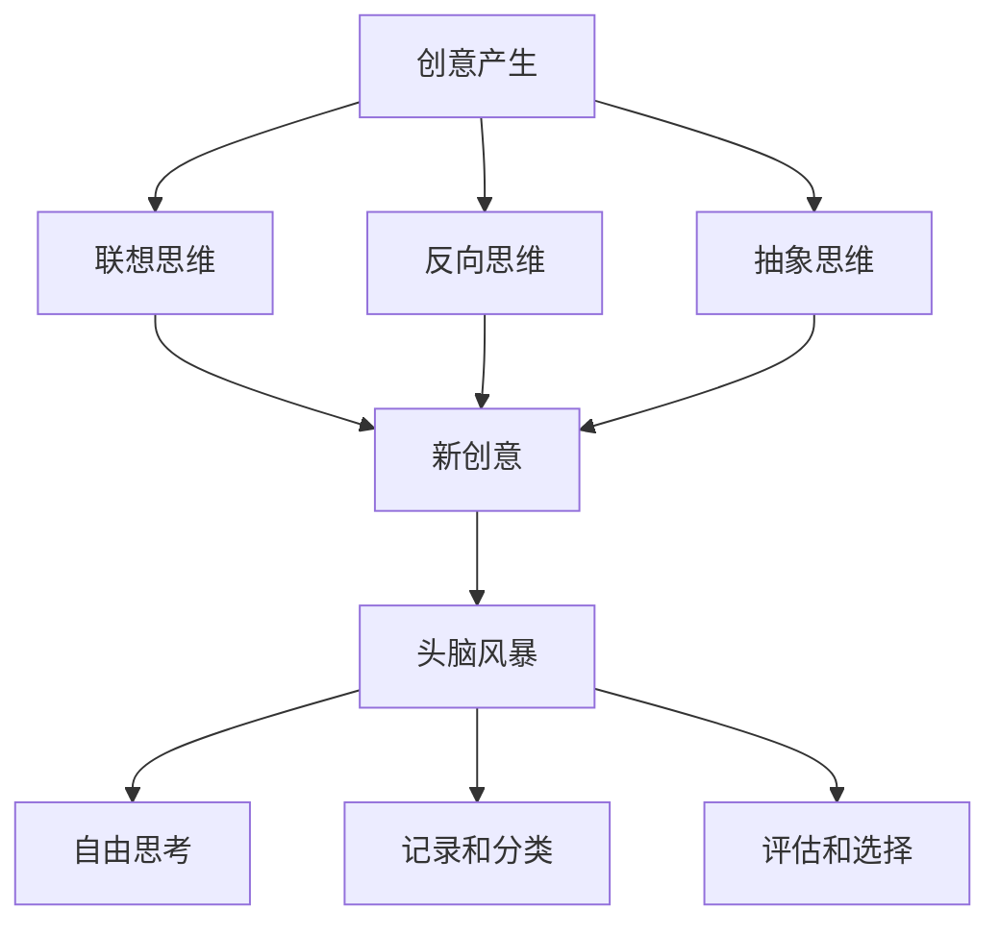

                 

# 激发创意：让头脑风暴更有效的技巧

## 关键词
创意，头脑风暴，技术技巧，心理学，团队协作，创新思维，方法与实践

## 摘要
本文旨在探讨如何通过有效的头脑风暴技巧来激发创意，提升团队创新能力和协作效率。文章首先介绍了创意和头脑风暴的定义及其重要性，随后深入分析了心理学在头脑风暴中的应用，探讨了个人与团队头脑风暴的差异。文章随后提出了一系列实用的头脑风暴技巧，包括创造一个支持性的环境、引导多样化的思考、记录和筛选有价值的信息等。此外，文章还介绍了多种头脑风暴工具和技术，以及如何评估和选择最佳创意。最后，通过实际案例研究和总结，提供了有效的头脑风暴实践指南，并提出了未来可能的研究方向。

---

## 引言
### 创意的定义与价值
创意，是指创造新的想法、概念或解决方案的能力。在当今快速变化的商业环境中，创意被视为企业持续发展和竞争力的关键。创意不仅仅是艺术家的专利，它在各行各业，尤其是科技创新、产品设计、市场营销等领域的应用尤为广泛。

创意的价值在于它能带来创新，而创新则是企业脱颖而出的关键。通过创意，企业可以开发出前所未有的产品或服务，解决现有问题，甚至创造全新的市场。创意不仅能提升企业的市场竞争力，还能增强员工的创造力和满足感。

### 头脑风暴的定义与历史
头脑风暴（Brainstorming）是一种旨在激发创造性思维的团队活动。它最早由美国广告人亚历克斯·奥斯本（Alex Osborn）于1930年代提出。奥斯本认为，通过集体讨论和自由交换想法，团队可以产生比单个成员单独思考更丰富的创意。

头脑风暴的历史可以追溯到古希腊的哲学对话和现代的研讨会。然而，作为一项系统化的创新工具，头脑风暴的普及主要得益于奥斯本的推广。他的著作《头脑风暴：激发创造力的方法》（`Your Creative Power`）成为许多企业和组织创新的指南。

### 头脑风暴的目的与优势
头脑风暴的主要目的是通过无限制的思考，产生大量想法，从而为问题解决和创新提供丰富的素材。具体来说，头脑风暴具有以下优势：

1. **增加创意的数量和质量**：通过集思广益，可以收集到更多的观点和想法，从而提高最终创意的质量。
2. **激发多样化的思维**：头脑风暴鼓励团队成员从不同的角度思考问题，促进多样化的思维。
3. **增强团队协作**：通过共同参与头脑风暴，团队成员能够更好地理解彼此的想法，增强团队凝聚力。
4. **快速问题解决**：头脑风暴能够快速地产生多种解决方案，有助于迅速解决棘手的问题。

### 头脑风暴的应用场景
头脑风暴广泛应用于以下场景：

1. **产品设计与开发**：用于开发新产品或改进现有产品。
2. **市场营销策略**：用于制定营销计划和推广策略。
3. **问题解决**：用于解决各种业务和运营问题。
4. **团队建设**：通过头脑风暴，团队可以更好地了解彼此的想法和观点。

## 创意与头脑风暴的联系
### 创意的本质
创意是一种将不同元素或想法重新组合或重新解释的能力。它涉及到创造性思维和认知过程。创意的产生通常需要以下几种思维技巧：

1. **联想思维**：通过将两个或更多看似不相关的元素联系起来，产生新的创意。
2. **反向思维**：从相反的角度思考问题，从而找到新颖的解决方案。
3. **抽象思维**：将复杂的问题简化为基本的概念或模型，从而更清晰地理解问题。

### 头脑风暴与创意
头脑风暴是激发创意的重要手段。通过无限制的自由讨论，团队成员可以自由地表达自己的观点，而不必担心批评或评判。这种开放的氛围有助于释放创造力，促进新想法的产生。

头脑风暴的过程通常包括以下几个步骤：

1. **提出问题**：明确要解决的问题或需要创新的领域。
2. **自由思考**：团队成员自由地提出各种想法，不论这些想法看起来是否可行。
3. **记录和分类**：将提出的所有想法记录下来，并进行分类或筛选。
4. **评估和选择**：对记录的想法进行评估，选择最有价值或最可行的创意。

### 头脑风暴中的核心概念与联系
为了更好地理解头脑风暴与创意之间的关系，我们可以用Mermaid流程图来表示核心概念和联系：



在这个流程图中，创意产生（A）通过不同的思维技巧（B、C、D）转化为新创意（E），然后通过头脑风暴（F）的过程，进一步发展和评估（G、H、I），最终得到具有实际应用价值的创意。

### 核心算法原理讲解
在头脑风暴中，核心算法原理可以通过以下伪代码来详细阐述：

```pseudo
function Brainstorming(Problem):
    Ideas = []
    for each Member in Team:
        MemberIdeas = GenerateIdeas(Member, Problem)
        Ideas.append(MemberIdeas)
    CombinedIdeas = CombineIdeas(Ideas)
    RankedIdeas = RankIdeas(CombinedIdeas)
    return RankedIdeas
```

在这个伪代码中，`Brainstorming`函数接受一个问题作为输入，通过每个团队成员的独立思考（`GenerateIdeas`），生成一系列想法。这些想法被组合和排名（`CombineIdeas`和`RankIdeas`），最终得到一个按价值排序的创意列表。

### 数学模型和公式
在评估和选择创意时，可以采用以下数学模型来量化创意的潜在价值：

$$
V = w_1 \times I_1 + w_2 \times I_2 + \ldots + w_n \times I_n
$$

其中，$V$表示创意的总价值，$w_i$表示第$i$个创意的权重，$I_i$表示第$i$个创意的创新程度。

### 项目实战
为了更好地理解头脑风暴的应用，我们可以通过一个实际案例来演示头脑风暴的过程。

#### 开发环境搭建
1. **安装头脑风暴工具**：选择一个支持在线头脑风暴的工具，如Miro或Mural。
2. **创建团队**：邀请团队成员加入。
3. **设定目标和规则**：明确头脑风暴的主题和规则，如“提出与绿色能源相关的创新想法”。

#### 源代码详细实现和代码解读
在这个案例中，我们不需要编写实际的代码，但可以使用Miro或Mural来模拟头脑风暴的过程。

1. **创建思维导图**：在Miro上创建一个思维导图，作为记录想法的框架。
2. **自由讨论**：团队成员在思维导图上自由地添加自己的想法，不论想法是否成熟。
3. **分类和筛选**：对收集到的想法进行分类和筛选，选择最有价值或最可行的创意。

#### 代码应用解读与分析
通过头脑风暴，团队可能收集到以下一些创意：

- **太阳能屋顶系统**：通过集成太阳能电池板，将屋顶变为能源生成设施。
- **智能电网管理**：利用人工智能优化电网管理，提高能源使用效率。
- **能源共享平台**：建立能源共享平台，允许家庭和企业共享剩余的能源。

通过评估这些创意，团队可以选择最具潜力的创意进行进一步开发。

#### 实际案例分析和详细讲解剖析
一个著名的实际案例是谷歌的“20%时间”政策，允许员工将20%的工作时间用于自己感兴趣的项目。这种政策激发了许多创新，如Gmail和AdSense。

通过分析这个案例，我们可以得出以下结论：

1. **自由和开放的氛围**：允许员工自由地表达和探索自己的想法。
2. **支持性的团队协作**：团队成员互相支持和鼓励，共同推动创意的发展。
3. **明确的评估和选择标准**：确保创意的价值得到评估，并选择最具潜力的项目进行开发。

#### 项目小结
通过这个案例，我们可以看到头脑风暴在激发创意和创新方面的作用。有效的头脑风暴不仅能够产生大量的创意，还能通过团队协作和评估，选择出最有价值的创意进行实施。

### 最佳实践 tips
1. **明确目标和规则**：在头脑风暴之前，明确目标和规则，确保所有参与者都清楚讨论的主题。
2. **创造一个无拘无束的环境**：鼓励团队成员自由地表达想法，不要担心批评或评判。
3. **多样化团队成员**：邀请来自不同背景和领域的团队成员参与，以获得多样化的观点和想法。
4. **记录和整理**：及时记录头脑风暴过程中的所有想法，并进行分类和筛选。
5. **评估和选择**：对创意进行评估，选择最具潜力的创意进行进一步开发。

### 小结
头脑风暴是一种有效的激发创意和创新的工具。通过理解其定义、历史和应用场景，以及掌握有效的技巧，团队可以更好地利用头脑风暴来解决问题和推动创新。未来的研究方向可以包括如何更好地利用人工智能和大数据技术来优化头脑风暴过程，以及如何将头脑风暴与其他创新方法相结合，以进一步提高创新效果。

### 注意事项
1. **避免过早评估和批评**：在头脑风暴过程中，避免过早地对想法进行评估或批评，以保护团队成员的创造性思维。
2. **保持参与度**：确保所有团队成员都积极参与，以获得最大限度的创意产出。
3. **定期进行头脑风暴**：定期进行头脑风暴，以保持团队的创造力和创新活力。

### 拓展阅读
- 《创意思考的乐趣》（`The Art of Thinking Clearly`）- Rolf Dobelli
- 《创新者的思考方式》（`The Innovator's Mindset`）- George Couros
- 《头脑风暴：激发创造力的方法》（`Your Creative Power`）- Alex Osborn
- 《设计思维：创新方法与工具》（`Design Thinking`）- Tim Brown

---

作者：AI天才研究院/AI Genius Institute & 禅与计算机程序设计艺术 /Zen And The Art of Computer Programming

