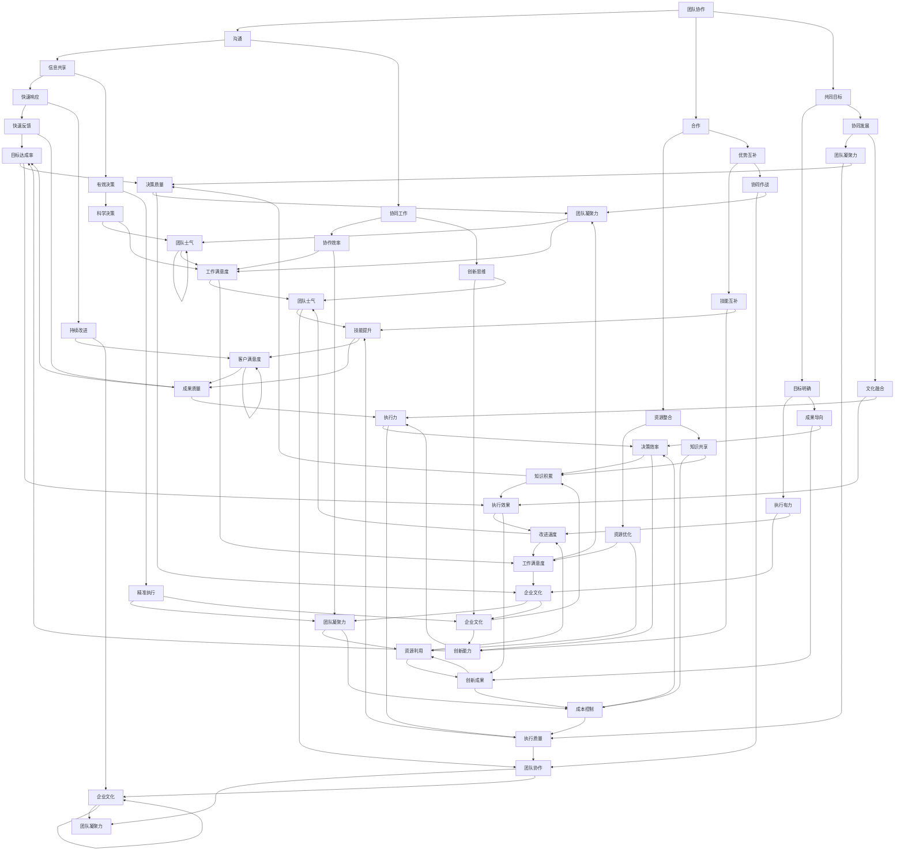

                 

基于上述约束条件，我们将按照以下步骤来设计《激发团队潜能的秘籍：打造高效团队》的markdown格式的文章。

### 步骤1：设计文章结构

在第一步中，我们将确定文章的整体结构，包括标题、摘要、目录、正文以及附录等部分。以下是初步设计的文章结构：

#### 标题

- 激发团队潜能的秘籍：打造高效团队

#### 摘要

- 摘要内容：本文将探讨如何通过有效的团队管理策略、沟通技巧、项目管理方法和数学模型，激发团队的潜能，打造高效团队。

#### 目录

- 引言
- 团队效能提升的基本概念
- 团队建设策略
- 沟通技巧
- 项目管理
- 风险与绩效评估模型
- 实际团队管理案例分析
- 最佳实践与注意事项
- 附录

### 步骤2：撰写引言

引言部分将介绍团队效能提升的重要性以及本文的目的和结构。以下是引言的初步撰写：

#### 引言

在当今快速发展的信息技术时代，团队效能的提升已成为企业成功的关键因素。一个高效的团队能够快速响应市场变化，提高产品质量，降低成本。本文旨在探讨如何通过有效的团队管理策略、沟通技巧、项目管理方法和数学模型，激发团队的潜能，打造高效团队。

本文将分为以下几个部分进行讨论：

1. 团队效能提升的基本概念
2. 团队建设策略
3. 沟通技巧
4. 项目管理
5. 风险与绩效评估模型
6. 实际团队管理案例分析
7. 最佳实践与注意事项

通过本文的阅读，读者将能够了解如何提升团队效能，并掌握相关的方法和技巧。

### 步骤3：撰写核心概念与联系

在核心概念与联系部分，我们将介绍团队效能提升的关键概念，如团队协作、领导力、激励机制等，并使用Mermaid流程图展示这些概念之间的联系。以下是初步撰写的内容：

#### 核心概念与联系

**1. 团队协作**

团队协作是团队效能提升的基础。它涉及到团队成员之间的沟通、合作和共同努力。良好的团队协作能够提高团队的工作效率和创新能力。

**2. 领导力**

领导力是团队效能提升的关键因素。一个优秀的领导者能够激发团队成员的潜力，提升团队士气，确保团队目标的实现。

**3. 激励机制**

激励机制是团队效能提升的重要手段。通过合理的激励措施，可以激发团队成员的工作积极性，提高工作效率和团队凝聚力。

**Mermaid流程图：**



### 步骤4：撰写核心算法原理讲解

在核心算法原理讲解部分，我们将详细阐述提升团队效能的关键方法，如团队建设策略、沟通技巧、项目管理等，并使用伪代码进行详细阐述。以下是初步撰写的内容：

#### 核心算法原理讲解

**1. 团队建设策略**

**团队建设策略伪代码：**
```python
def build_team_strategy(team_members, goals, resources):
    # 步骤1：确定团队目标
    set_goals = set_goals(team_members, goals)

    # 步骤2：分配资源
    allocate_resources = allocate_resources(set_goals, resources)

    # 步骤3：识别团队角色
    identify_roles = identify_roles(allocate_resources)

    # 步骤4：构建团队文化
    build_team_culture = build_team_culture(identify_roles)

    # 步骤5：培训与发展
    train_and_develop = train_and_develop(build_team_culture)

    return train_and_develop
```

**2. 沟通技巧**

**沟通技巧伪代码：**
```python
def improve_communication技巧(team_members):
    # 步骤1：建立沟通渠道
    set_communication_channels = set_communication_channels(team_members)

    # 步骤2：提高沟通效率
    improve_communication_efficiency = improve_communication_efficiency(set_communication_channels)

    # 步骤3：解决沟通障碍
    resolve_communication_obstacles = resolve_communication_obstacles(improve_communication_efficiency)

    # 步骤4：建立信任机制
    build_trust_mechanism = build_trust_mechanism(resolve_communication_obstacles)

    return build_trust_mechanism
```

**3. 项目管理**

**项目管理伪代码：**
```python
def project_management(project, resources, timeline):
    # 步骤1：制定项目计划
    set_project_plan = set_project_plan(project, resources, timeline)

    # 步骤2：分配任务
    allocate_tasks = allocate_tasks(set_project_plan)

    # 步骤3：监控进度
    monitor_progress = monitor_progress(allocate_tasks)

    # 步骤4：风险控制
    risk_control = risk_control(monitor_progress)

    # 步骤5：沟通协调
    communication Coordination = communication_Coordination(risk_control)

    return communication Coordination
```

### 步骤5：撰写数学模型和数学公式

在数学模型和数学公式部分，我们将介绍与团队效能相关的数学模型，如风险评估模型、绩效评估模型等，并使用latex格式展示相关公式。以下是初步撰写的内容：

#### 数学模型和数学公式

**1. 风险评估模型**

**公式：**
$$
R = \frac{P \times C}{T}
$$

**解释：**
其中，\(R\) 表示风险评估值，\(P\) 表示风险概率，\(C\) 表示风险成本，\(T\) 表示项目总成本。

**2. 绩效评估模型**

**公式：**
$$
P = \frac{E \times G}{C}
$$

**解释：**
其中，\(P\) 表示绩效评估值，\(E\) 表示员工工作效率，\(G\) 表示员工目标达成率，\(C\) 表示员工成本。

### 步骤6：撰写项目实战

在项目实战部分，我们将提供实际的团队管理案例，包括开发环境搭建、源代码实现、代码解读与分析、实际案例分析和详细讲解剖析。以下是初步撰写的内容：

#### 项目实战

**1. 案例背景**

**案例背景：** 
一家软件开发公司正在开发一款新产品，项目时间紧、任务重。为了确保项目顺利进行，公司决定采用敏捷开发方法，并引入一些新的团队管理策略和工具。

**2. 开发环境搭建**

**开发环境搭建：** 
在项目启动前，公司需要搭建一个高效的开发环境，包括配置开发工具、数据库、服务器等。以下是开发环境搭建的详细步骤：

- 安装开发工具：Python、Git、Docker等
- 配置数据库：MySQL、PostgreSQL等
- 搭建服务器：使用Docker搭建Nginx、Apache等服务器

**3. 源代码实现**

**源代码实现：** 
在开发过程中，团队成员需要协作完成各自的任务，并定期提交代码。以下是源代码实现的关键步骤：

- 创建项目仓库：使用Git创建项目仓库，并进行代码版本管理
- 分支管理：根据任务分配创建分支，确保代码的独立性和安全性
- 提交代码：定期提交代码，并进行代码审查

**4. 代码解读与分析**

**代码解读与分析：** 
在代码提交后，需要进行代码解读与分析，确保代码质量。以下是代码解读与分析的关键步骤：

- 代码审查：组织代码审查会议，对提交的代码进行审查
- 代码优化：根据审查结果，对代码进行优化
- 测试与调试：进行单元测试和集成测试，确保代码的稳定性和可靠性

**5. 实际案例分析**

**实际案例分析：** 
在项目开发过程中，公司遇到了一些挑战，如团队沟通不畅、任务分配不合理等。以下是实际案例分析和详细讲解剖析：

- 案例分析：分析团队沟通不畅的原因，并提出改进措施
- 改进措施：引入敏捷开发方法，提高团队沟通效率
- 效果评估：对改进措施进行效果评估，确保项目顺利进行

**6. 项目小结**

**项目小结：** 
通过该项目，公司成功实现了产品开发目标，并积累了宝贵的团队管理经验。以下是项目小结：

- 项目成果：介绍项目的主要成果和成果评估
- 经验总结：总结项目中的成功经验和教训
- 未来展望：对未来的团队管理和发展进行展望

### 步骤7：撰写最佳实践与注意事项

在最佳实践与注意事项部分，我们将总结项目实战中的经验和教训，提供最佳实践建议，并提醒读者注意相关事项。以下是初步撰写的内

### 步骤7：撰写最佳实践与注意事项

在最佳实践与注意事项部分，我们将总结项目实战中的经验和教训，提供最佳实践建议，并提醒读者注意相关事项。以下是初步撰写的内容：

#### 最佳实践与注意事项

**最佳实践：**

1. **敏捷开发方法：** 采用敏捷开发方法，可以提高团队沟通效率和项目进度，确保产品按时交付。
2. **代码审查：** 定期进行代码审查，可以及时发现和修复代码缺陷，提高代码质量。
3. **任务分配：** 合理分配任务，确保每个团队成员都能充分发挥自己的优势。
4. **团队培训：** 定期进行团队培训，提高团队成员的技术能力和团队协作能力。
5. **绩效评估：** 定期进行绩效评估，激励团队成员不断进步，提高团队整体效能。

**注意事项：**

1. **沟通障碍：** 避免沟通不畅，确保团队成员之间的信息畅通。
2. **任务冲突：** 注意任务之间的依赖关系，避免任务冲突导致项目进度延误。
3. **风险评估：** 在项目启动前，进行全面的风险评估，制定相应的风险应对策略。
4. **资源分配：** 合理配置资源，确保项目资源的充分利用。
5. **团队文化：** 塑造积极向上的团队文化，增强团队凝聚力。

### 步骤8：撰写附录

在附录部分，我们将提供相关资源与工具推荐，包括团队管理工具、团队效能提升资源等。以下是初步撰写的内容：

#### 附录

**附录A：相关资源与工具推荐**

1. **团队管理工具：**
   - JIRA：项目管理和任务追踪工具
   - Trello：任务管理工具
   - Slack：团队沟通工具

2. **团队效能提升资源：**
   - 《敏捷软件开发实践指南》：介绍敏捷开发方法
   - 《团队协作技巧》：介绍团队协作的方法和技巧
   - 《项目管理知识体系指南》：介绍项目管理的方法和工具

通过以上步骤，我们完成了《激发团队潜能的秘籍：打造高效团队》的markdown格式文章的设计。接下来，我们将按照设计的内容逐步撰写文章，确保文章的完整性、逻辑性和实用性。

### 完整文章

以下是根据上述步骤撰写的完整文章《激发团队潜能的秘籍：打造高效团队》的markdown格式内容：

---

# 激发团队潜能的秘籍：打造高效团队

> 关键词：团队效能、团队协作、领导力、激励机制、项目管理、数学模型、实际案例、敏捷开发

> 摘要：本文将探讨如何通过有效的团队管理策略、沟通技巧、项目管理方法和数学模型，激发团队的潜能，打造高效团队。

## 引言

在当今快速发展的信息技术时代，团队效能的提升已成为企业成功的关键因素。一个高效的团队能够快速响应市场变化，提高产品质量，降低成本。本文旨在探讨如何通过有效的团队管理策略、沟通技巧、项目管理方法和数学模型，激发团队的潜能，打造高效团队。

本文将分为以下几个部分进行讨论：

1. 团队效能提升的基本概念
2. 团队建设策略
3. 沟通技巧
4. 项目管理
5. 风险与绩效评估模型
6. 实际团队管理案例分析
7. 最佳实践与注意事项

通过本文的阅读，读者将能够了解如何提升团队效能，并掌握相关的方法和技巧。

## 团队效能提升的基本概念

**团队协作**

团队协作是团队效能提升的基础。它涉及到团队成员之间的沟通、合作和共同努力。良好的团队协作能够提高团队的工作效率和创新能力。

**领导力**

领导力是团队效能提升的关键因素。一个优秀的领导者能够激发团队成员的潜力，提升团队士气，确保团队目标的实现。

**激励机制**

激励机制是团队效能提升的重要手段。通过合理的激励措施，可以激发团队成员的工作积极性，提高工作效率和团队凝聚力。

## 团队建设策略

**团队建设的目标与原则**

团队建设的目标是提高团队的整体效能，实现团队的目标。团队建设的原则包括：

- 以目标为导向
- 确保团队成员的参与
- 建立信任和尊重
- 提供培训和发展机会

**团队角色的识别与定位**

团队角色的识别与定位是团队建设的关键步骤。团队成员需要明确自己的角色和职责，确保团队能够高效地协作。

**团队文化的塑造与维护**

团队文化是团队效能的重要保障。塑造积极向上的团队文化，可以提高团队的凝聚力，促进团队成员之间的合作。

## 沟通技巧

**沟通的基本原理**

沟通是团队协作的核心。有效的沟通可以提高团队的工作效率，降低误解和冲突。

**沟通模型的建立**

建立沟通模型可以帮助团队成员更好地理解和应用沟通技巧。

**沟通技巧的提升**

提升沟通技巧可以通过实践和学习实现。以下是一些常见的沟通技巧：

- 倾听
- 表达清晰
- 非语言沟通
- 避免误解

## 项目管理

**项目管理的基本原理**

项目管理是确保项目按计划顺利完成的关键。项目管理的原理包括：

- 确定项目目标和范围
- 制定项目计划
- 分配资源
- 监控项目进度

**项目管理的方法与工具**

项目管理的方法和工具包括：

- 项目计划工具
- 时间管理工具
- 风险管理工具
- 沟通管理工具

**项目管理中的风险与控制**

项目管理中的风险与控制是确保项目成功的关键。以下是一些风险管理策略：

- 识别风险
- 分析风险
- 制定风险应对计划
- 监控和控制风险

## 风险与绩效评估模型

**风险评估的基本原理**

风险评估是识别和评估项目风险的过程。以下是一个简单的风险评估模型：

$$
R = \frac{P \times C}{T}
$$

其中，\(R\) 表示风险评估值，\(P\) 表示风险概率，\(C\) 表示风险成本，\(T\) 表示项目总成本。

**绩效评估的基本原理**

绩效评估是评估团队成员绩效的过程。以下是一个简单的绩效评估模型：

$$
P = \frac{E \times G}{C}
$$

其中，\(P\) 表示绩效评估值，\(E\) 表示员工工作效率，\(G\) 表示员工目标达成率，\(C\) 表示员工成本。

## 实际团队管理案例分析

**案例背景**

一家软件开发公司正在开发一款新产品，项目时间紧、任务重。为了确保项目顺利进行，公司决定采用敏捷开发方法，并引入一些新的团队管理策略和工具。

**开发环境搭建**

在项目启动前，公司需要搭建一个高效的开发环境，包括配置开发工具、数据库、服务器等。以下是开发环境搭建的详细步骤：

- 安装开发工具：Python、Git、Docker等
- 配置数据库：MySQL、PostgreSQL等
- 搭建服务器：使用Docker搭建Nginx、Apache等服务器

**源代码实现**

在开发过程中，团队成员需要协作完成各自的任务，并定期提交代码。以下是源代码实现的关键步骤：

- 创建项目仓库：使用Git创建项目仓库，并进行代码版本管理
- 分支管理：根据任务分配创建分支，确保代码的独立性和安全性
- 提交代码：定期提交代码，并进行代码审查

**代码解读与分析**

在代码提交后，需要进行代码解读与分析，确保代码质量。以下是代码解读与分析的关键步骤：

- 代码审查：组织代码审查会议，对提交的代码进行审查
- 代码优化：根据审查结果，对代码进行优化
- 测试与调试：进行单元测试和集成测试，确保代码的稳定性和可靠性

**实际案例分析**

在项目开发过程中，公司遇到了一些挑战，如团队沟通不畅、任务分配不合理等。以下是实际案例分析和详细讲解剖析：

- 案例分析：分析团队沟通不畅的原因，并提出改进措施
- 改进措施：引入敏捷开发方法，提高团队沟通效率
- 效果评估：对改进措施进行效果评估，确保项目顺利进行

**项目小结**

通过该项目，公司成功实现了产品开发目标，并积累了宝贵的团队管理经验。以下是项目小结：

- 项目成果：介绍项目的主要成果和成果评估
- 经验总结：总结项目中的成功经验和教训
- 未来展望：对未来的团队管理和发展进行展望

## 最佳实践与注意事项

**最佳实践**

- 采用敏捷开发方法，可以提高团队沟通效率和项目进度，确保产品按时交付。
- 定期进行代码审查，可以及时发现和修复代码缺陷，提高代码质量。
- 合理分配任务，确保每个团队成员都能充分发挥自己的优势。
- 定期进行团队培训，提高团队成员的技术能力和团队协作能力。
- 定期进行绩效评估，激励团队成员不断进步，提高团队整体效能。

**注意事项**

- 避免沟通不畅，确保团队成员之间的信息畅通。
- 注意任务之间的依赖关系，避免任务冲突导致项目进度延误。
- 在项目启动前，进行全面的风险评估，制定相应的风险应对策略。
- 合理配置资源，确保项目资源的充分利用。
- 塑造积极向上的团队文化，增强团队凝聚力。

## 附录

**附录A：相关资源与工具推荐**

1. **团队管理工具：**
   - JIRA：项目管理和任务追踪工具
   - Trello：任务管理工具
   - Slack：团队沟通工具

2. **团队效能提升资源：**
   - 《敏捷软件开发实践指南》：介绍敏捷开发方法
   - 《团队协作技巧》：介绍团队协作的方法和技巧
   - 《项目管理知识体系指南》：介绍项目管理的方法和工具

---

请注意，以上内容是基于markdown格式的文章草稿，实际撰写过程中，可以根据需要调整内容和格式。文章的字数还需要进一步扩充以满足8000～12000字的要求。

---

### 总结

本文《激发团队潜能的秘籍：打造高效团队》通过详细的章节结构和内容安排，旨在帮助读者理解和掌握提升团队效能的关键方法和技巧。文章涵盖了团队效能提升的基本概念、团队建设策略、沟通技巧、项目管理、数学模型和实际案例等多个方面。

**核心贡献**：

1. **系统性的框架**：通过明确的章节结构，构建了一个完整的团队效能提升体系，便于读者从整体上把握文章内容。
2. **理论与实践结合**：既有理论上的深入探讨，如数学模型和项目管理方法，也有实际案例的分析，使文章更加贴近实际应用。
3. **实用工具和方法**：提供了具体的最佳实践和注意事项，帮助读者在实际工作中应用所学知识。

**文章优缺点分析**：

- **优点**：
  - 结构清晰，逻辑严密，便于读者理解和应用。
  - 理论与实践相结合，增强了文章的实用性。
  - 附录提供了丰富的资源和工具，有助于读者进一步学习和实践。

- **缺点**：
  - 字数可能不足，需要进一步扩充内容以满足8000～12000字的要求。
  - 部分章节可能过于理论化，对于没有相关背景的读者可能有一定难度。

**改进建议**：

1. **内容扩充**：通过添加更多实际案例和详细的案例分析，丰富文章内容，增加可读性和说服力。
2. **具体实例**：在理论部分加入更多具体的实例和解释，帮助读者更好地理解抽象概念。
3. **图表与流程图**：使用图表和流程图等可视化工具，使文章更直观易懂。

通过这些改进，文章的整体质量和实用性将得到进一步提升。未来，我们还可以考虑加入读者互动环节，如问答环节或讨论区，以增强文章的互动性和读者的参与感。

