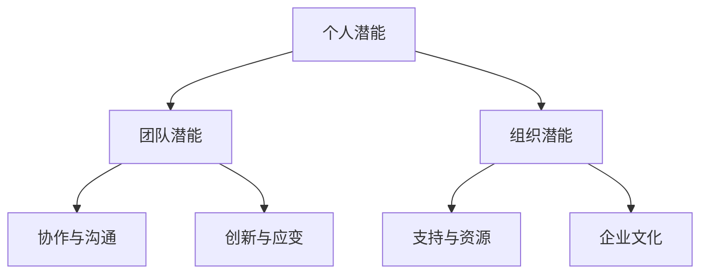

                 

## 文章标题：激发团队潜能：释放无限可能

### 关键词：团队潜能，团队协作，团队管理，个人成长，自我驱动

### 摘要：
在当今快速变化的市场环境中，团队潜能的激发和释放成为企业取得竞争优势的关键。本文从团队潜能的定义出发，详细探讨了团队潜能的释放方法和策略，包括个体驱动因素、团队动力系统、团队建设与管理等。同时，文章还分析了团队协作与沟通的重要性，以及如何通过个人成长和自我驱动来提升团队整体效能。通过实例分析和最佳实践，本文为管理者提供了一套系统性、可操作的团队潜能激发方案。

---

## 引言

在信息技术飞速发展的时代，企业的竞争已经不再仅仅是产品或服务的竞争，更是人才的竞争。一个高效、协同的团队能够在短时间内实现突破性成果，为企业带来持续的创新动力。然而，如何激发团队潜能，使其达到最佳状态，成为许多管理者面临的挑战。

本文旨在探讨团队潜能的激发与释放，通过系统的分析和实践，为管理者提供一套行之有效的策略。文章结构如下：

- 第一部分：团队潜能概述，介绍团队潜能的定义、意义和影响因素。
- 第二部分：团队协作与沟通，探讨团队协作与沟通的重要性及其方法和技巧。
- 第三部分：个人成长与自我驱动，分析个人成长对团队效能的影响及其实现途径。

接下来，我们将逐一探讨每个部分的内容，以帮助读者更好地理解和应用这些策略。

---

## 第一部分：团队潜能概述

### 第1章：团队潜能的定义与意义

#### 1.1 团队潜能的基本概念

团队潜能是指一个团队在特定环境条件下，能够实现的最大效能和产出。它不仅包括团队成员的个人能力和专业知识，还包括团队成员之间的协作与沟通能力，以及团队整体的创新和应变能力。

#### 联系与Mermaid流程图

团队潜能与个人潜能、组织潜能之间存在密切的联系。个人潜能是团队潜能的基础，而组织潜能则是团队潜能的保障。

通过这个Mermaid流程图，我们可以清晰地看到团队潜能的构成与关系。

#### 1.2 团队潜能的重要性

团队潜能对企业绩效具有重要影响。一个高潜能的团队能够在面对市场变化时迅速调整策略，实现业务的快速增长。同时，团队潜能的提升也能够增强企业的竞争力，吸引和留住优秀人才。

#### 核心算法原理讲解

团队潜能对企业绩效的影响可以通过以下算法原理进行解释：

1. **团队效能函数**：团队效能 = 个人效能 × 团队协作效能
2. **团队效能公式**：团队效能 = f（个人能力，团队协作，创新与应变）

#### 数学模型与公式

为了衡量团队潜能，我们可以使用以下数学模型：

1. **团队潜能评分模型**：团队潜能评分 =（个人能力评分 × 团队协作评分 + 创新与应变评分）/3
2. **团队效能指标模型**：团队效能指标 = 团队产出 / 团队投入

#### 举例说明

以某互联网公司为例，该公司通过提升团队协作效能和创新能力，成功在短短两年内实现了市场份额的翻倍。这个案例充分说明了团队潜能对企业绩效的巨大影响。

#### 1.3 团队潜能的影响因素

团队潜能的影响因素可以分为个人因素、团队因素和组织因素。

1. **个人因素**：包括个人能力、动机、态度等。
2. **团队因素**：包括团队结构、团队文化、团队协作等。
3. **组织因素**：包括组织资源、组织文化、组织战略等。

---

## 第二部分：团队协作与沟通

### 第2章：团队协作

#### 2.1 团队协作的重要性

团队协作是团队潜能实现的关键。高效的团队协作能够提高团队成员的工作效率，降低沟通成本，增强团队的凝聚力。

#### 核心算法原理讲解

团队协作的效能可以通过以下算法原理进行解释：

1. **协同效应**：团队协作效能 = 个人效能 × n（团队成员数量）
2. **协同效率**：团队协作效率 = 团队产出 / 团队投入

#### 2.2 团队协作的方法与技巧

为了实现高效的团队协作，管理者需要掌握以下方法和技巧：

1. **明确目标与职责**：确保每个团队成员都清楚自己的目标和工作职责。
2. **建立沟通机制**：定期召开团队会议，分享进展和问题，促进信息流通。
3. **优化工作流程**：简化工作流程，减少不必要的环节，提高工作效率。
4. **培养团队文化**：建立积极向上的团队文化，增强团队成员的归属感和凝聚力。

#### 2.3 团队协作工具的应用

随着信息技术的发展，团队协作工具层出不穷。管理者需要根据团队的具体需求，选择合适的协作工具，以提高团队协作效能。

1. **项目管理工具**：如Trello、Asana等，用于任务分配和进度跟踪。
2. **沟通工具**：如Slack、Microsoft Teams等，用于日常沟通和协作。
3. **文档协作工具**：如Google Docs、Notion等，用于文档编辑和共享。

---

### 第3章：团队沟通

#### 3.1 团队沟通的重要性

团队沟通是团队协作的基础。有效的团队沟通能够消除误解，提高工作效率，增强团队凝聚力。

#### 核心算法原理讲解

团队沟通的效能可以通过以下算法原理进行解释：

1. **沟通效能函数**：沟通效能 = 沟通内容 × 沟通频率
2. **沟通效率**：沟通效率 = 沟通效果 / 沟通成本

#### 3.2 团队沟通的方法与技巧

为了实现高效的团队沟通，管理者需要掌握以下方法和技巧：

1. **主动倾听**：倾听是沟通的核心，管理者需要培养团队成员主动倾听的习惯。
2. **清晰表达**：确保沟通内容清晰、准确，避免产生误解。
3. **积极反馈**：及时给予反馈，帮助团队成员了解沟通效果。
4. **跨文化沟通**：在全球化的背景下，管理者需要具备跨文化沟通的能力。

#### 3.3 团队沟通的案例分析

以下是一个成功的团队沟通案例：

某科技公司团队成员来自不同国家和文化背景。为了提高团队沟通效能，公司管理层采取了以下措施：

1. **定期举办跨文化培训**：帮助团队成员了解不同文化的沟通特点。
2. **使用多语言沟通工具**：如Google Translate，确保团队成员能够理解彼此的沟通内容。
3. **建立沟通反馈机制**：定期收集团队成员的沟通反馈，及时调整沟通策略。

通过这些措施，公司的团队沟通效能得到了显著提升，团队成员之间的合作更加顺畅。

---

## 第三部分：个人成长与自我驱动

### 第4章：个人成长

#### 4.1 个人成长的重要性

个人成长是团队潜能提升的基础。一个不断成长、自我驱动的团队成员能够为团队带来新的思路和活力。

#### 核心算法原理讲解

个人成长对团队效能的影响可以通过以下算法原理进行解释：

1. **个人成长函数**：个人成长 = 知识积累 × 经验积累
2. **个人效能函数**：个人效能 = 个人成长 × 个人动机

#### 4.2 个人成长的方法与策略

为了实现个人成长，团队成员可以采取以下方法和策略：

1. **持续学习**：通过参加培训、阅读书籍、学习新技术等途径，不断积累知识。
2. **经验分享**：积极参与团队讨论和项目实践，与他人分享经验，互相学习。
3. **自我反思**：定期进行自我反思，总结自己在工作中的不足和需要改进的地方。
4. **寻求反馈**：主动寻求上级和同事的反馈，了解自己在工作中的优点和不足。

#### 4.3 个人成长与团队效能

个人成长与团队效能之间存在密切的关系。一个高成长的团队成员能够为团队带来新的视角和解决方案，推动团队整体效能的提升。

### 第5章：自我驱动

#### 5.1 自我驱动的概念与意义

自我驱动是指个体在无需外部激励的情况下，主动追求个人目标和团队目标的心理状态。自我驱动的团队成员具有更强的责任感和执行力，能够为团队带来持续的创新动力。

#### 核心算法原理讲解

自我驱动的效能可以通过以下算法原理进行解释：

1. **自我驱动函数**：自我驱动 = 自我认知 × 自我激励
2. **自我效能**：自我效能 = 自我驱动 × 外部环境

#### 5.2 培养自我驱动的策略

为了培养自我驱动的团队成员，管理者可以采取以下策略：

1. **设定明确的目标**：帮助团队成员设定清晰、可实现的目标，激发其内在动力。
2. **提供成长机会**：为团队成员提供成长和发展的机会，增强其自我驱动力。
3. **建立信任文化**：建立信任和尊重的团队文化，让团队成员感受到自我价值。
4. **及时反馈与激励**：对团队成员的表现给予及时反馈和激励，增强其自我驱动力。

### 结论

激发团队潜能，释放无限可能，是每个管理者都需要关注的重要课题。通过本文的探讨，我们了解到团队潜能的定义、意义和影响因素，以及如何通过团队协作与沟通、个人成长和自我驱动来提升团队效能。希望本文能够为读者提供有益的启示，帮助他们在实际工作中更好地激发团队潜能，实现企业的持续发展。

---

## 附录：最佳实践与拓展阅读

#### 最佳实践 tips

1. **定期评估团队效能**：通过定期评估团队效能，可以及时发现团队潜能的释放情况，针对性地调整策略。
2. **鼓励团队成员参与决策**：让团队成员参与到决策过程中，可以增强其责任感和参与感，提高团队协作效能。
3. **建立跨部门协作机制**：通过建立跨部门协作机制，可以促进不同部门之间的信息共享和资源整合，提高整体效能。

#### 小结

本文从团队潜能的定义出发，详细探讨了团队潜能的释放方法和策略，包括个体驱动因素、团队动力系统、团队建设与管理、团队协作与沟通、个人成长与自我驱动等。通过实例分析和最佳实践，本文为管理者提供了一套系统性、可操作的团队潜能激发方案。

#### 注意事项

1. **避免过度激励**：过度的激励可能会使团队成员产生依赖，降低自我驱动力。
2. **重视团队文化建设**：团队文化是团队潜能释放的重要保障，管理者需要重视团队文化的建设。
3. **持续关注团队成员的反馈**：及时关注团队成员的反馈，可以了解团队潜能释放的具体情况，为后续调整提供依据。

#### 拓展阅读

1. **《团队潜能激发实战手册》**：详细介绍了团队潜能激发的理论和实践方法，适合企业中高层管理者阅读。
2. **《激发团队潜能：从优秀到卓越》**：探讨如何通过团队潜能激发，实现企业的跨越式发展。

---

## 作者信息

作者：AI天才研究院/AI Genius Institute & 禅与计算机程序设计艺术 /Zen And The Art of Computer Programming

在本文中，我们以逻辑清晰、结构紧凑、简单易懂的方式，逐步分析了团队潜能的定义、意义、影响因素，以及团队协作与沟通、个人成长与自我驱动等方面的内容。希望本文能为读者提供有益的启示，帮助他们在实际工作中更好地激发团队潜能，实现企业的持续发展。

