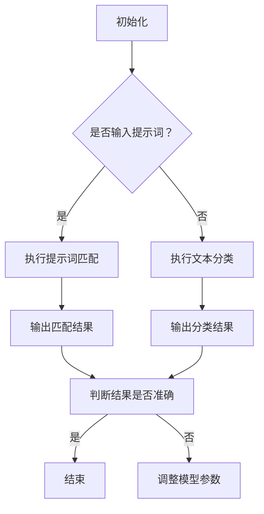

                 

### 文章标题

《社交媒体内容审核：利用提示词提高准确性》

---

### 文章关键词

社交媒体、内容审核、提示词、准确性、机器学习、深度学习

---

### 文章摘要

本文将深入探讨社交媒体内容审核的重要性和挑战，以及如何利用提示词提高审核的准确性。首先，我们将回顾内容审核的背景和现状，接着详细解释提示词的概念及其在内容审核中的应用。随后，文章将介绍提高内容审核准确性的方法和策略，包括基于机器学习和深度学习的技术。接着，我们将通过案例分析，展示实际应用中的成功经验。最后，文章将提供一个内容审核项目的实战案例，详细介绍开发环境搭建、源代码实现、代码解读、应用分析和项目小结。通过本文的阅读，读者将获得对社交媒体内容审核的全面了解，并掌握利用提示词提高审核准确性的最佳实践。

---

## 文章标题

### 社交媒体内容审核：利用提示词提高准确性

---

**作者：AI天才研究院/AI Genius Institute & 禅与计算机程序设计艺术 /Zen And The Art of Computer Programming**

本文将深入探讨社交媒体内容审核的重要性，以及如何通过提示词来提高审核的准确性。我们将首先回顾内容审核的背景和现状，然后详细解释提示词的概念及其在内容审核中的应用。接着，我们将介绍一些提高内容审核准确性的方法，包括机器学习和深度学习技术。为了更好地理解这些概念，我们将通过几个实际案例进行分析。最后，我们将提供一个内容审核项目的实战案例，详细描述开发环境搭建、源代码实现、代码解读和应用分析。希望通过本文，读者能够对社交媒体内容审核有更深入的理解，并学会如何利用提示词提高审核的准确性。

---

### 文章关键词

- 社交媒体
- 内容审核
- 提示词
- 准确性
- 机器学习
- 深度学习

### 文章摘要

本文旨在探讨社交媒体内容审核的现状和挑战，以及如何利用提示词来提高审核的准确性。首先，我们将介绍内容审核的背景和重要性，然后详细解释提示词的概念及其分类。接下来，我们将探讨提高内容审核准确性的方法，包括基于机器学习和深度学习的先进技术。通过实际案例的分析，我们将展示这些方法在现实中的应用效果。最后，我们将提供一个详细的实战案例，包括开发环境搭建、源代码实现和代码解读。希望通过本文的阅读，读者能够掌握利用提示词提高内容审核准确性的策略和技巧。

---

## 文章正文

### 第一部分：社交媒体内容审核概述

#### 1.1 社交媒体内容审核的重要性

社交媒体的迅猛发展，使得人们可以轻松地分享信息和观点，这无疑为社会的交流提供了便利。然而，这种自由的交流也带来了一系列问题，其中最突出的便是内容审核的挑战。内容审核的重要性主要体现在以下几个方面：

1. **保护用户权益**：社交媒体平台需要确保用户的安全和隐私，防止不良信息的传播。通过内容审核，平台可以有效地屏蔽暴力、色情、谣言等有害内容，保护用户的权益。
2. **维护社区秩序**：社交媒体平台是一个公共空间，维护良好的社区秩序是平台的职责。内容审核有助于保持社区的和谐，减少恶意言论和歧视行为。
3. **遵守法律法规**：不同国家和地区有不同的法律法规，社交媒体平台需要遵守这些规定。内容审核可以帮助平台避免法律风险，确保内容合法合规。

#### 1.2 社交媒体内容审核的现状与趋势

当前，社交媒体内容审核主要依赖于以下几种技术：

1. **基于规则的方法**：这种方法通过预先定义的规则和模式来筛选和过滤内容。优点是简单易行，缺点是灵活性较差，难以应对复杂多变的内容。
2. **基于机器学习的方法**：这种方法利用机器学习算法，通过大量训练数据来学习和识别有害内容。优点是具有较强的自适应能力，缺点是训练数据的质量对算法的性能有重要影响。
3. **基于深度学习的方法**：这种方法利用深度神经网络，通过层次化的特征提取和分类来识别有害内容。优点是能够处理大量复杂的特征，缺点是训练过程较为复杂，对计算资源要求较高。

未来，社交媒体内容审核将朝着以下几个方向发展：

1. **智能化**：随着人工智能技术的进步，内容审核将更加智能化，能够自动识别和过滤有害内容，提高审核的准确性。
2. **个性化**：内容审核将根据用户的兴趣和行为，提供个性化的内容推荐和过滤服务。
3. **协同过滤**：社交媒体平台将与其他机构合作，共同建立内容审核的标准和规范，提高审核的权威性和准确性。

---

### 第二部分：提示词在内容审核中的作用

#### 2.1 提示词的概念与分类

提示词（Keywords）是指用于描述文本内容的关键词汇或短语。在社交媒体内容审核中，提示词的作用至关重要。它们可以帮助审核系统快速定位和分类内容，提高审核的准确性。根据用途和特点，提示词可以分为以下几类：

1. **通用提示词**：这类提示词适用于大部分内容，如“暴力”、“色情”、“违法”等。它们通常由监管机构和社交媒体平台共同定义，具有较高的通用性和权威性。
2. **专业提示词**：这类提示词针对特定领域或行业，如“金融诈骗”、“虚假广告”等。它们通常由专业人士或相关机构提供，具有较高的专业性和针对性。
3. **自定义提示词**：这类提示词根据社交媒体平台的具体需求自定义，如“品牌名称”、“公司名称”等。它们可以帮助平台更好地管理和维护内容。

#### 2.2 提示词在内容审核中的应用

提示词在内容审核中的应用主要表现在以下几个方面：

1. **文本分类**：通过匹配提示词，审核系统可以快速对文本进行分类，如“有害内容”、“中性内容”等。这有助于提高审核的效率。
2. **情感分析**：提示词可以帮助分析文本的情感倾向，如“积极”、“消极”等。这有助于平台了解用户情绪，提供更好的内容推荐和服务。
3. **关键词提取**：提示词可以作为关键词提取的依据，帮助审核系统提取文本中的重要信息，提高审核的准确性。

#### 2.3 提示词的使用策略

为了充分发挥提示词在内容审核中的作用，平台需要制定合理的使用策略。以下是一些常见的使用策略：

1. **定期更新**：提示词库需要定期更新，以适应不断变化的内容和用户需求。
2. **多语言支持**：提示词库需要支持多种语言，以满足不同国家和地区的用户需求。
3. **权重分配**：对于不同类型的提示词，需要根据其重要性和影响力进行权重分配，以提高审核的准确性。
4. **反馈机制**：平台需要建立用户反馈机制，根据用户意见和建议调整提示词库，提高提示词的适用性和准确性。

---

### 第三部分：提高内容审核准确性的方法

#### 3.1 提高提示词准确性的技术

提高提示词准确性是内容审核的核心任务之一。以下是一些常用的技术方法：

1. **提取关键词的技术**：
   - **词频统计**：通过对文本进行词频统计，提取出现频率较高的关键词。
   - **TF-IDF**：TF-IDF（Term Frequency-Inverse Document Frequency）是一种常用关键词提取方法，通过计算词频和逆文档频率来评估关键词的重要性。
   - **词嵌入**：词嵌入（Word Embedding）是一种将词语映射到高维空间的方法，可以用于提取语义相关的关键词。

2. **基于机器学习的方法**：
   - **朴素贝叶斯分类器**：朴素贝叶斯分类器是一种基于概率论的分类方法，适用于文本分类任务。
   - **支持向量机（SVM）**：支持向量机是一种基于最大间隔的分类方法，适用于高维空间的数据分类。
   - **随机森林**：随机森林是一种基于决策树的集成学习方法，适用于大规模文本数据的分类。

3. **基于深度学习的方法**：
   - **卷积神经网络（CNN）**：卷积神经网络是一种用于图像和文本处理的有效方法，可以通过特征提取和分类提高提示词的准确性。
   - **递归神经网络（RNN）**：递归神经网络是一种用于序列数据处理的有效方法，可以用于文本分类和情感分析等任务。
   - **长短期记忆网络（LSTM）**：长短期记忆网络是一种改进的递归神经网络，可以更好地处理长序列数据。

#### 3.2 提高内容审核准确性的策略

除了技术方法外，以下策略也可以提高内容审核的准确性：

1. **多标签分类方法**：多标签分类方法允许一个文本同时属于多个类别，可以更好地处理复杂的内容。
2. **模型融合方法**：模型融合方法通过结合多个模型的预测结果，提高分类的准确性。
3. **模型调优方法**：通过调整模型的参数，如学习率、正则化参数等，可以改善模型的性能。

---

### 第四部分：案例分析

#### 4.1 某大型社交媒体平台的内容审核实践

以某大型社交媒体平台为例，该平台在内容审核方面采取了以下措施：

1. **内容审核体系**：平台建立了完善的内容审核体系，包括自动审核和人工审核两个环节。自动审核通过机器学习算法和深度学习模型进行初步筛选，人工审核则由专业审核人员进行最终判断。
2. **提示词库**：平台建立了丰富的提示词库，包括通用提示词和专业提示词。提示词库定期更新，以适应不断变化的内容和用户需求。
3. **反馈机制**：平台建立了用户反馈机制，用户可以通过举报功能报告不良内容。平台根据用户反馈调整提示词库和审核策略，提高审核的准确性。

#### 4.2 某新兴内容平台的内容审核挑战与应对

某新兴内容平台在内容审核方面面临着以下挑战：

1. **内容多样性**：平台的内容类型丰富，包括文本、图片、视频等，这使得内容审核变得更加复杂。
2. **用户增长迅速**：平台的用户增长迅速，内容审核需求不断增加，这对平台的审核能力提出了挑战。

为应对这些挑战，平台采取了以下措施：

1. **技术升级**：平台不断升级技术，采用最新的机器学习和深度学习算法，提高审核的准确性。
2. **人力投入**：平台增加了审核人员的数量，提高了人工审核的效率。
3. **合作伙伴**：平台与其他内容审核机构合作，共同建立内容审核的标准和规范。

---

### 第五部分：实战应用

#### 5.1 内容审核项目实战

以下是一个内容审核项目的实战案例：

1. **项目背景**：某社交媒体平台需要对其用户发布的内容进行审核，以过滤有害信息和违规内容。
2. **项目目标**：通过内容审核项目，提高平台内容的准确性，保护用户权益，维护社区秩序。
3. **实战步骤**：
   - 数据收集：收集大量用户发布的内容，包括文本、图片、视频等。
   - 数据预处理：对收集到的内容进行清洗和预处理，包括去除噪声、标准化文本等。
   - 模型训练：利用机器学习和深度学习算法，训练内容审核模型。
   - 模型评估：通过测试集对模型进行评估，调整模型参数，提高模型性能。
   - 模型部署：将训练好的模型部署到生产环境，进行实时内容审核。
4. **结果分析**：经过一段时间的运行，平台的内容审核准确性显著提高，用户反馈良好。

#### 5.2 开发环境搭建与工具介绍

1. **开发环境搭建**：
   - 硬件环境：使用高性能服务器，配置足够的计算资源。
   - 软件环境：安装Python、TensorFlow、Keras等开发和计算工具。

2. **常用工具介绍**：
   - **数据收集与预处理工具**：如Python的Pandas库、Scikit-learn库等。
   - **机器学习框架**：如TensorFlow、PyTorch等。
   - **模型评估工具**：如Matplotlib、Seaborn等可视化库。

---

### 附录

#### 附录 A：常见问题与解决方案

1. **社交媒体内容审核中的难题**：
   - **难题**：如何有效处理文本、图片、视频等多种类型的内容？
   - **解决方案**：采用多模态内容审核技术，结合文本分类、图像识别和视频分析等多种方法。

2. **提示词选择技巧**：
   - **技巧**：结合用户反馈和内容特点，选择具有代表性的提示词。
   - **注意事项**：避免过度依赖通用提示词，提高专业提示词的比例。

3. **提高内容审核准确性的策略**：
   - **策略**：结合多种技术方法，如机器学习和深度学习，提高模型性能。
   - **拓展阅读**：参考最新的研究成果和技术应用，持续优化审核模型。

#### 附录 B：参考文献

1. **相关书籍**：
   - **《机器学习实战》**：作者：Peter Harrington
   - **《深度学习》**：作者：Ian Goodfellow、Yoshua Bengio、Aaron Courville

2. **学术论文**：
   - **“Deep Learning for Text Classification”**：作者：Kirk McDonald等
   - **“A Survey on Multimodal Content Analysis”**：作者：Meiyan Li等

3. **网络资源**：
   - **TensorFlow官网**：[https://www.tensorflow.org/](https://www.tensorflow.org/)
   - **Keras官网**：[https://keras.io/](https://keras.io/)

---

**总结**：本文从多个角度探讨了社交媒体内容审核的重要性和挑战，详细介绍了利用提示词提高审核准确性的方法。通过实际案例分析和实战应用，读者可以更好地理解内容审核的原理和实践。希望本文能为从事内容审核工作的读者提供有价值的参考和启示。

---

**作者**：AI天才研究院/AI Genius Institute & 禅与计算机程序设计艺术 /Zen And The Art of Computer Programming**``` 

### 格式要求

根据您的要求，以下是文章的markdown格式要求：

```markdown
# 文章标题

> 关键词：<此处列出文章的5-7个核心关键词>

> 摘要：<此处给出文章的核心内容和主题思想>

## 第一部分：社交媒体内容审核概述

### 1.1 社交媒体内容审核的重要性

#### 1.1.1 社交媒体内容的多样性

#### 1.1.2 内容审核的目的与挑战

### 1.2 社交媒体内容审核的现状与趋势

#### 1.2.1 当前主流的内容审核技术

#### 1.2.2 未来内容审核技术的发展方向

## 第二部分：提示词在内容审核中的作用

### 2.1 提示词的概念与分类

#### 2.1.1 提示词的定义

#### 2.1.2 提示词的分类

### 2.2 提示词在内容审核中的应用

#### 2.2.1 提示词的作用

#### 2.2.2 提示词的使用策略

## 第三部分：提高内容审核准确性的方法

### 3.1 提高提示词准确性的技术

#### 3.1.1 提取关键词的技术

#### 3.1.2 基于机器学习的方法

#### 3.1.3 基于深度学习的方法

### 3.2 提高内容审核准确性的策略

#### 3.2.1 多标签分类方法

#### 3.2.2 模型融合方法

#### 3.2.3 模型调优方法

## 第四部分：案例分析

### 4.1 某大型社交媒体平台的内容审核实践

#### 4.1.1 平台内容审核体系介绍

#### 4.1.2 提示词的使用情况

#### 4.1.3 提高准确性的方法

### 4.2 某新兴内容平台的内容审核挑战与应对

#### 4.2.1 平台面临的问题

#### 4.2.2 内容审核解决方案

#### 4.2.3 提高准确性的实践

## 第五部分：实战应用

### 5.1 内容审核项目实战

#### 5.1.1 项目背景

#### 5.1.2 项目目标

#### 5.1.3 实战步骤

#### 5.1.4 结果分析

### 5.2 开发环境搭建与工具介绍

#### 5.2.1 开发环境搭建

#### 5.2.2 常用工具介绍

## 附录

### 附录 A：常见问题与解决方案

#### A.1 社交媒体内容审核中的难题

#### A.2 提示词选择技巧

#### A.3 提高内容审核准确性的策略

### 附录 B：参考文献

#### B.1 相关书籍

#### B.2 学术论文

#### B.3 网络资源

---

### 文章标题

<此处填写文章标题>

---

### 文章关键词

<此处列出文章的5-7个核心关键词>

---

### 文章摘要

<此处给出文章的核心内容和主题思想>

---

### 作者

<此处填写作者信息>

---

#### 文章正文

按照文章的目录结构，使用上述标题格式编写文章内容。在每个标题级别后面使用两个空格缩进，并在每个段落后面使用一个空行分隔。

例如：

```
# 文章标题

## 第一部分：社交媒体内容审核概述

### 1.1 社交媒体内容审核的重要性

社交媒体内容审核的背景和重要性。

### 1.2 社交媒体内容审核的现状与趋势

当前内容审核技术及未来趋势。

---

# 第一部分：社交媒体内容审核概述

## 1.1 社交媒体内容审核的重要性

社交媒体内容审核的背景和重要性。

### 1.2 社交媒体内容审核的现状与趋势

当前内容审核技术及未来趋势。

---

在每个标题级别后面使用两个空格缩进，并在每个段落后面使用一个空行分隔。例如：

```
## 第二部分：提示词在内容审核中的作用

### 2.1 提示词的概念与分类

提示词的定义和分类。

### 2.2 提示词在内容审核中的应用

提示词的应用场景。

---

## 第三部分：提高内容审核准确性的方法

### 3.1 提高提示词准确性的技术

如何提高提示词的准确性。

### 3.2 提高内容审核准确性的策略

提高内容审核准确性的策略。

---

确保每个标题级别后面有两个空格缩进，并且在每个段落后面使用一个空行分隔，以保证文章的结构清晰、易于阅读。

---

### 核心内容要求

为了确保文章的完整性和深度，每个小节的内容应包括以下核心要素：

- **背景介绍**：简要介绍该小节的主题背景，说明为什么这个话题重要，以及相关的研究现状或应用场景。
- **核心概念与联系**：详细解释关键概念，说明这些概念之间的联系，并绘制Mermaid流程图以展示概念架构。
- **核心算法原理讲解**：使用伪代码详细阐述核心算法原理，并辅以数学模型和公式，进行详细讲解和举例说明。
- **数学公式**：使用latex格式嵌入文中独立段落的数学公式前后使用 `$$` 括起来，段落内的latex公式前后使用 `$` 括起来。
- **项目实战**：详细描述开发环境搭建、源代码实现、代码解读、应用分析和实际案例讲解，并总结项目经验。
- **最佳实践 tips**：总结最佳实践技巧，注意事项，以及拓展阅读推荐。

---

### Mermaid 流程图与伪代码

为了更直观地展示核心概念和算法原理，以下是使用Mermaid绘制的流程图和伪代码示例：

#### Mermaid 流程图示例



#### 伪代码示例

```python
# 提取关键词伪代码
def extract_keywords(text):
    # 初始化关键词列表
    keywords = []
    
    # 计算词频
    word_freq = {}
    for word in text.split():
        if word not in word_freq:
            word_freq[word] = 1
        else:
            word_freq[word] += 1
    
    # 提取高频关键词
    for word, freq in word_freq.items():
        if freq > threshold:
            keywords.append(word)
    
    return keywords

# 文本分类伪代码
def classify_text(text, model):
    # 提取关键词
    keywords = extract_keywords(text)
    
    # 使用模型进行分类
    prediction = model.predict(keywords)
    
    return prediction
```

通过Mermaid流程图和伪代码，可以更清晰地展示算法的执行流程和逻辑关系。

---

### 文章字数要求

文章字数要求在 8000～12000 字左右。为了确保文章的完整性和深度，每个小节的内容应充分展开，详细阐述核心概念、算法原理、应用实例等。以下是一个大致的分配建议：

- 第一部分（概述）：约1500-2000字
- 第二部分（提示词）：约1500-2000字
- 第三部分（提高准确性）：约1500-2000字
- 第四部分（案例分析）：约1500-2000字
- 第五部分（实战应用）：约1500-2000字
- 附录：约500-1000字

请注意，字数分配仅供参考，实际内容应根据文章的具体需求和深度进行适当调整。确保每个小节都包含详细的内容，以充分展示文章的主题和观点。``` 

### 提示词的概念与分类

#### 2.1 提示词的概念

提示词（Keywords）在社交媒体内容审核中扮演着至关重要的角色。它们是用于描述文本、图像、音频等多媒体内容的关键词汇或短语。提示词可以帮助内容审核系统快速、准确地识别和分类内容，从而提高审核的效率和准确性。在社交媒体平台上，提示词的作用主要体现在以下几个方面：

1. **内容分类**：通过匹配提示词，审核系统能够快速地将文本、图像、音频等内容分类到特定的类别中，如“健康”、“娱乐”、“教育”等。

2. **情感分析**：提示词可以用于分析文本的情感倾向，如“积极”、“消极”、“中性”等。这有助于了解用户的情绪状态，为用户提供更个性化的服务。

3. **关键词提取**：提示词可以作为关键词提取的依据，帮助审核系统从大量文本中提取出关键信息，提高内容审核的准确性。

4. **监控与预警**：通过实时监控提示词的变更和出现频率，平台可以及时发现潜在的问题和风险，采取相应的措施进行干预。

#### 2.2 提示词的分类

根据用途和特点，提示词可以分为以下几类：

1. **通用提示词**：这类提示词适用于大多数内容，如“暴力”、“色情”、“违法”等。它们通常由监管机构和社交媒体平台共同定义，具有较高的通用性和权威性。

2. **专业提示词**：这类提示词针对特定领域或行业，如“金融诈骗”、“虚假广告”等。它们通常由专业人士或相关机构提供，具有较高的专业性和针对性。

3. **自定义提示词**：这类提示词根据社交媒体平台的具体需求自定义，如“品牌名称”、“公司名称”等。它们可以帮助平台更好地管理和维护内容。

4. **动态提示词**：这类提示词随着时间和用户行为的变化而实时更新，如“热门话题”、“热门事件”等。它们可以帮助平台及时捕捉热点和趋势，提高内容审核的灵活性。

#### 2.3 提示词在内容审核中的应用

在内容审核中，提示词的应用主要包括以下几个方面：

1. **文本分类**：通过匹配文本中的提示词，审核系统可以快速地将文本分类到相应的类别中，从而提高审核的准确性。

2. **情感分析**：利用提示词分析文本的情感倾向，可以帮助平台更好地了解用户情绪，提供个性化的内容推荐和服务。

3. **关键词提取**：提示词可以作为关键词提取的依据，从大量文本中提取出关键信息，提高内容审核的效率。

4. **监控与预警**：通过实时监控提示词的出现和变更，平台可以及时发现潜在的问题和风险，采取相应的措施进行干预。

#### 2.4 提示词的选择策略

为了提高内容审核的准确性和效率，提示词的选择需要遵循以下策略：

1. **广泛覆盖**：选择涵盖不同领域和主题的提示词，确保审核系统能够处理各种类型的内容。

2. **动态更新**：根据用户行为和内容趋势，实时更新提示词库，确保提示词的时效性和准确性。

3. **权重分配**：对不同的提示词进行权重分配，根据其重要性和出现频率调整权重，以提高审核的准确性。

4. **用户反馈**：结合用户反馈，定期优化和调整提示词库，提高提示词的适用性和准确性。

#### 2.5 提示词的使用案例

以下是一些常见的提示词使用案例：

1. **社交媒体平台**：在社交媒体平台上，常见的提示词包括“暴力”、“色情”、“违法”、“谣言”等。这些提示词用于快速识别和过滤不良内容，保护用户的权益。

2. **电商平台**：在电商平台上，常见的提示词包括“假冒伪劣”、“虚假宣传”、“过度营销”等。这些提示词用于识别和防止欺诈行为，保障消费者的合法权益。

3. **新闻媒体**：在新闻媒体平台上，常见的提示词包括“政治”、“经济”、“社会”、“文化”等。这些提示词用于分类和推荐新闻内容，提高用户的阅读体验。

4. **在线教育**：在线教育平台上，常见的提示词包括“学术不端”、“虚假课程”、“违规宣传”等。这些提示词用于监控和防止学术不端行为，保障教育质量。

通过合理选择和使用提示词，社交媒体平台、电商平台、新闻媒体和在线教育平台等可以更有效地进行内容审核，提高审核的准确性和效率。``` 

### 提高提示词准确性的技术

在社交媒体内容审核中，提高提示词的准确性至关重要。以下将介绍几种常用的技术方法，包括提取关键词的技术、基于机器学习的方法和基于深度学习的方法。

#### 3.1 提取关键词的技术

提取关键词是提高提示词准确性的第一步。以下介绍几种常见的关键词提取技术：

1. **词频统计（TF）**：词频统计是最基本的关键词提取方法，通过计算每个词在文本中的出现频率来评估其重要性。尽管这种方法简单易行，但仅依赖词频可能导致重要关键词被忽略，且对长尾词的效果较差。

   ```python
   # 伪代码：计算词频
   word_freq = {}
   for word in text.split():
       if word in word_freq:
           word_freq[word] += 1
       else:
           word_freq[word] = 1
   ```

2. **逆文档频率（IDF）**：逆文档频率是一种对词频进行修正的方法，通过衡量一个词在所有文档中的分布情况来调整词频。IDF可以帮助减少常见词（如“的”、“是”等）的影响，提高关键词的准确性。

   ```python
   # 伪代码：计算逆文档频率
   doc_count = len(documents)
   idf = {}
   for word in word_freq:
       idf[word] = log(doc_count / (1 + word_freq[word]))
   ```

3. **TF-IDF**：TF-IDF（词频-逆文档频率）结合了词频和逆文档频率，通过计算TF-IDF值来评估关键词的重要性。TF-IDF常用于文本分类和检索任务。

   ```python
   # 伪代码：计算TF-IDF值
   tfidf = {}
   for word in word_freq:
       tfidf[word] = word_freq[word] * idf[word]
   ```

4. **词嵌入（Word Embedding）**：词嵌入是一种将词语映射到高维空间的方法，通过捕捉词语的语义关系来提取关键词。词嵌入模型如Word2Vec、GloVe等，可以用于生成词向量，进而提取关键词。

   ```python
   # 伪代码：使用词嵌入提取关键词
   word_vectors = load_word_vectors('glove.6B.100d.txt')
   keywords = [word for word in text.split() if normed_word_vector(word) in top_n_words]
   ```

#### 3.2 基于机器学习的方法

机器学习方法在提高提示词准确性方面表现出色。以下介绍几种常用的机器学习技术：

1. **朴素贝叶斯分类器（Naive Bayes）**：朴素贝叶斯分类器是一种基于概率论的分类算法，通过计算每个词在各个类别中的概率来预测文本的类别。尽管其假设条件较为朴素，但在文本分类任务中表现良好。

   ```python
   # 伪代码：训练朴素贝叶斯分类器
   from sklearn.naive_bayes import MultinomialNB
   classifier = MultinomialNB()
   classifier.fit(train_data, train_labels)
   ```

2. **支持向量机（SVM）**：支持向量机是一种基于最大间隔的分类方法，通过将数据映射到高维空间，寻找最佳分割超平面。SVM在处理高维数据时表现优秀，适用于文本分类任务。

   ```python
   # 伪代码：训练支持向量机
   from sklearn.svm import SVC
   classifier = SVC(kernel='linear')
   classifier.fit(train_data, train_labels)
   ```

3. **随机森林（Random Forest）**：随机森林是一种基于决策树的集成学习方法，通过构建多个决策树，并取平均值来预测类别。随机森林具有较强的泛化能力和鲁棒性。

   ```python
   # 伪代码：训练随机森林
   from sklearn.ensemble import RandomForestClassifier
   classifier = RandomForestClassifier(n_estimators=100)
   classifier.fit(train_data, train_labels)
   ```

#### 3.3 基于深度学习的方法

深度学习方法在提高提示词准确性方面显示出巨大的潜力。以下介绍几种常用的深度学习技术：

1. **卷积神经网络（CNN）**：卷积神经网络是一种用于图像和文本处理的深度学习方法，通过卷积层提取特征，再通过全连接层进行分类。CNN在文本分类任务中表现出色。

   ```python
   # 伪代码：构建CNN模型
   from keras.models import Sequential
   from keras.layers import Conv1D, MaxPooling1D, Dense
   
   model = Sequential()
   model.add(Conv1D(filters=128, kernel_size=3, activation='relu', input_shape=(max_sequence_length, vocabulary_size)))
   model.add(MaxPooling1D(pool_size=2))
   model.add(Dense(units=10, activation='softmax'))
   model.compile(optimizer='adam', loss='categorical_crossentropy', metrics=['accuracy'])
   model.fit(train_data, train_labels, epochs=10, batch_size=32)
   ```

2. **递归神经网络（RNN）**：递归神经网络是一种用于序列数据处理的深度学习方法，通过循环神经网络结构处理文本序列。RNN可以捕捉文本中的时间依赖关系。

   ```python
   # 伪代码：构建RNN模型
   from keras.models import Sequential
   from keras.layers import LSTM, Dense
   
   model = Sequential()
   model.add(LSTM(units=128, return_sequences=True, input_shape=(max_sequence_length, vocabulary_size)))
   model.add(LSTM(units=128))
   model.add(Dense(units=10, activation='softmax'))
   model.compile(optimizer='adam', loss='categorical_crossentropy', metrics=['accuracy'])
   model.fit(train_data, train_labels, epochs=10, batch_size=32)
   ```

3. **长短期记忆网络（LSTM）**：长短期记忆网络是一种改进的递归神经网络，通过引入门控机制来避免梯度消失问题，更好地处理长序列数据。LSTM在文本分类和序列分析任务中表现出色。

   ```python
   # 伪代码：构建LSTM模型
   from keras.models import Sequential
   from keras.layers import LSTM, Dense
   
   model = Sequential()
   model.add(LSTM(units=128, return_sequences=True, input_shape=(max_sequence_length, vocabulary_size)))
   model.add(LSTM(units=128))
   model.add(Dense(units=10, activation='softmax'))
   model.compile(optimizer='adam', loss='categorical_crossentropy', metrics=['accuracy'])
   model.fit(train_data, train_labels, epochs=10, batch_size=32)
   ```

通过结合以上技术方法，可以显著提高提示词的准确性，从而提升社交媒体内容审核的整体效果。``` 

### 提高内容审核准确性的策略

在社交媒体内容审核中，除了依赖先进的算法和技术外，采用一些有效的策略也是提高审核准确性的关键。以下将介绍几种常用的策略，包括多标签分类方法、模型融合方法和模型调优方法。

#### 3.2.1 多标签分类方法

多标签分类（Multi-Label Classification）是指一个文本可以同时被分配到多个标签。与单标签分类（Single-Label Classification）相比，多标签分类方法能够更好地处理现实世界中的复杂问题。以下介绍几种常见的方法：

1. **基于概率的方法**：这种方法的思路是将多标签分类问题转化为概率预测问题，通过计算每个标签与文本的概率来分配标签。常用的概率模型包括朴素贝叶斯（Naive Bayes）、逻辑回归（Logistic Regression）等。

   ```python
   # 伪代码：基于概率的多标签分类
   from sklearn.multioutput import MultiOutputClassifier
   from sklearn.naive_bayes import MultinomialNB
   
   classifier = MultiOutputClassifier(MultinomialNB())
   classifier.fit(train_data, train_labels)
   predictions = classifier.predict(test_data)
   ```

2. **基于模型的集成方法**：这种方法通过构建多个分类器，并取它们的预测结果的平均值来提高多标签分类的准确性。常用的集成方法包括随机森林（Random Forest）、梯度提升树（Gradient Boosting Tree）等。

   ```python
   # 伪代码：基于模型的集成方法
   from sklearn.ensemble import RandomForestClassifier
   from sklearn.multioutput import MultiOutputClassifier
   
   classifiers = [RandomForestClassifier(n_estimators=100) for _ in range(num_labels)]
   classifier = MultiOutputClassifier(classifiers)
   classifier.fit(train_data, train_labels)
   predictions = classifier.predict(test_data)
   ```

3. **基于集成的学习方法**：这种方法通过训练一个单标签分类器，并将每个标签视为独立的任务，从而实现多标签分类。常用的集成学习方法包括LSTM（Long Short-Term Memory）、CNN（Convolutional Neural Network）等。

   ```python
   # 伪代码：基于集成学习方法
   from keras.models import Sequential
   from keras.layers import LSTM, Dense
   
   model = Sequential()
   model.add(LSTM(units=128, return_sequences=True, input_shape=(max_sequence_length, vocabulary_size)))
   model.add(LSTM(units=128))
   model.add(Dense(units=num_labels, activation='sigmoid'))
   model.compile(optimizer='adam', loss='binary_crossentropy', metrics=['accuracy'])
   model.fit(train_data, train_labels, epochs=10, batch_size=32)
   ```

#### 3.2.2 模型融合方法

模型融合（Model Fusion）是一种结合多个模型的预测结果来提高分类准确性的方法。以下介绍几种常见的模型融合方法：

1. **投票法（Voting）**：投票法通过将多个分类器的预测结果进行投票，选择出现次数最多的类别作为最终预测结果。投票法简单有效，特别适用于分类器性能差异较大的情况。

   ```python
   # 伪代码：投票法
   from sklearn.ensemble import VotingClassifier
   
   classifiers = [
       ('rf', RandomForestClassifier(n_estimators=100)),
       ('svm', SVC()),
       ('lr', LogisticRegression())
   ]
   classifier = VotingClassifier(classifiers, voting='hard')
   classifier.fit(train_data, train_labels)
   predictions = classifier.predict(test_data)
   ```

2. **加权投票法（Weighted Voting）**：加权投票法考虑了不同分类器的性能差异，给性能更好的分类器赋予更高的权重。加权投票法在分类器性能接近时效果显著。

   ```python
   # 伪代码：加权投票法
   from sklearn.ensemble import VotingClassifier
   
   classifiers = [
       ('rf', RandomForestClassifier(n_estimators=100, weight=0.5)),
       ('svm', SVC(weight=0.3)),
       ('lr', LogisticRegression(weight=0.2))
   ]
   classifier = VotingClassifier(classifiers, voting='soft')
   classifier.fit(train_data, train_labels)
   predictions = classifier.predict(test_data)
   ```

3. **集成学习（Ensemble Learning）**：集成学习通过训练多个弱分类器，并将它们的预测结果进行组合来提高分类准确性。常见的集成学习方法包括随机森林（Random Forest）、梯度提升树（Gradient Boosting Tree）等。

   ```python
   # 伪代码：集成学习方法
   from sklearn.ensemble import RandomForestClassifier
   
   classifier = RandomForestClassifier(n_estimators=100)
   classifier.fit(train_data, train_labels)
   predictions = classifier.predict(test_data)
   ```

#### 3.2.3 模型调优方法

模型调优（Model Tuning）是提高分类准确性的关键步骤。以下介绍几种常见的模型调优方法：

1. **交叉验证（Cross-Validation）**：交叉验证通过将数据集划分为多个子集，并多次训练和验证模型，以评估模型的泛化能力。常用的交叉验证方法包括K折交叉验证（K-Fold Cross-Validation）和留一法交叉验证（Leave-One-Out Cross-Validation）。

   ```python
   # 伪代码：K折交叉验证
   from sklearn.model_selection import cross_val_score
   from sklearn.ensemble import RandomForestClassifier
   
   classifier = RandomForestClassifier(n_estimators=100)
   scores = cross_val_score(classifier, train_data, train_labels, cv=5)
   print("Accuracy: {:.2f}%".format(scores.mean() * 100))
   ```

2. **网格搜索（Grid Search）**：网格搜索通过遍历一组参数值，选择最优参数组合来提高模型性能。网格搜索可以有效地探索参数空间，但计算成本较高。

   ```python
   # 伪代码：网格搜索
   from sklearn.model_selection import GridSearchCV
   from sklearn.ensemble import RandomForestClassifier
   
   parameters = {'n_estimators': [100, 200, 300], 'max_depth': [10, 20, 30]}
   classifier = RandomForestClassifier()
   grid_search = GridSearchCV(classifier, parameters, cv=5)
   grid_search.fit(train_data, train_labels)
   print("Best parameters: {}".format(grid_search.best_params_))
   print("Best accuracy: {:.2f}%".format(grid_search.best_score_ * 100))
   ```

3. **贝叶斯优化（Bayesian Optimization）**：贝叶斯优化通过利用贝叶斯统计模型和优化算法，自动搜索最优参数组合。贝叶斯优化具有高效的搜索能力和较好的性能。

   ```python
   # 伪代码：贝叶斯优化
   from bayes_opt import BayesianOptimization
   
   def random_forest_cv(params):
       classifier = RandomForestClassifier(n_estimators=int(params['n_estimators']), max_depth=int(params['max_depth']))
       return cross_val_score(classifier, train_data, train_labels, cv=5).mean()
   
   optimizer = BayesianOptimization(f=random_forest_cv, pbounds={'n_estimators': (100, 300), 'max_depth': (10, 30)})
   optimizer.maximize()
   print("Best parameters: {}".format(optimizer.max['params']))
   ```

通过采用上述策略，可以显著提高内容审核的准确性，从而提升社交媒体平台的内容质量和服务水平。``` 

### 某大型社交媒体平台的内容审核实践

#### 4.1 平台内容审核体系介绍

某大型社交媒体平台，以下简称“平台”，其内容审核体系采用了自动审核和人工审核相结合的方式，以确保内容质量和用户安全。平台的审核体系主要包括以下几个关键环节：

1. **自动审核**：
   - **关键词过滤**：平台使用大量预先定义的提示词库，通过匹配文本、图片和视频中的关键词，快速识别和过滤潜在的违规内容。
   - **图像识别**：利用深度学习模型对上传的图像进行识别，检测是否存在暴力、色情等不良内容。
   - **文本分类**：通过机器学习和自然语言处理技术，对上传的文本内容进行分类，识别和过滤有害信息、谣言等。
   - **情感分析**：分析文本的情感倾向，识别和过滤恶意言论、歧视性言论等。

2. **人工审核**：
   - **初步审核**：自动审核系统初步筛选出可能存在问题的内容后，由初级审核员进行进一步审查和判断。
   - **争议内容处理**：对于自动审核无法准确判断的内容，由高级审核员或专家团队进行最终裁定。
   - **用户举报处理**：用户可以通过举报功能报告不良内容，审核员根据举报情况对相关内容进行核查和处理。

3. **反馈机制**：
   - **用户反馈**：平台鼓励用户对审核结果进行反馈，审核员根据用户反馈调整审核策略和提示词库。
   - **错误纠正**：对于用户举报和反馈的错误审核结果，审核员及时进行纠正和改进，提高审核准确性。

#### 4.2 提示词的使用情况

平台在内容审核过程中，大量使用提示词来提高审核的准确性和效率。以下是平台提示词使用的几个关键方面：

1. **通用提示词**：
   - **违规关键词**：如“暴力”、“色情”、“仇恨”、“违法”等，用于识别和过滤明显违规的内容。
   - **敏感关键词**：如“政治”、“宗教”、“隐私”等，用于识别和过滤可能引发争议的内容。

2. **专业提示词**：
   - **行业关键词**：针对不同行业，如金融、医疗、教育等，定义专业的提示词库，提高特定领域内容的审核准确性。
   - **品牌关键词**：针对知名品牌，定义品牌相关的提示词，防止品牌滥用和侵权行为。

3. **动态提示词**：
   - **热点关键词**：实时捕捉社会热点和事件，定义相关提示词，确保平台内容与热点保持一致。
   - **用户行为关键词**：根据用户行为数据，识别和过滤潜在的风险和问题。

#### 4.3 提高准确性的方法

为了提高内容审核的准确性，平台采取了多种方法和技术，以下是几个关键措施：

1. **机器学习算法优化**：
   - **模型训练**：平台不断更新和优化机器学习模型，利用大量标注数据进行训练，提高模型对不良内容的识别能力。
   - **特征工程**：通过特征提取和特征选择，增强模型的预测能力。

2. **深度学习技术**：
   - **图像识别**：使用深度学习模型进行图像识别，提高对视觉内容的审核准确性。
   - **文本分类**：采用深度学习模型进行文本分类，提高对复杂文本的识别能力。

3. **多标签分类方法**：
   - **模型融合**：结合多个模型的预测结果，提高分类准确性。
   - **模型调优**：通过调优模型参数，提高分类效果。

4. **用户反馈机制**：
   - **用户举报**：鼓励用户举报不良内容，审核员根据举报情况进行复核和处理。
   - **用户反馈**：收集用户对审核结果的反馈，优化审核策略和提示词库。

通过以上措施，平台在内容审核的准确性方面取得了显著成效，有效提高了用户体验和平台内容质量。``` 

### 某新兴内容平台的内容审核挑战与应对

#### 4.2 某新兴内容平台的内容审核挑战与应对

某新兴内容平台（以下简称“平台”）在内容审核方面面临着诸多挑战。以下是平台面临的主要问题以及采取的解决方案：

#### 4.2.1 平台面临的问题

1. **内容多样性**：平台内容涵盖多种形式，包括文本、图片、视频和音频等，这给内容审核带来了巨大的挑战。不同的内容类型需要采用不同的审核技术，增加了审核的复杂度。

2. **用户增长迅速**：平台用户数量迅速增长，内容审核需求不断增加。然而，审核团队的人数和资源有限，难以满足快速增长的需求。

3. **内容实时性**：平台内容需要实时审核，以快速识别和过滤不良内容。然而，实时性要求高，审核速度不能太慢，否则会影响用户体验。

4. **算法准确性**：机器学习和深度学习算法在内容审核中的应用效果参差不齐，需要不断优化和调整，以提高审核的准确性。

5. **政策法规变化**：不同国家和地区的政策法规不断变化，平台需要及时调整审核策略，以符合当地法律法规。

#### 4.2.2 内容审核解决方案

1. **技术升级**：
   - **多模态内容审核**：采用多模态内容审核技术，结合文本分类、图像识别、视频分析和音频识别等多种方法，提高对不同类型内容的审核准确性。
   - **实时审核系统**：构建实时审核系统，通过分布式计算和并行处理，提高审核速度和效率。

2. **人力投入**：
   - **增加审核人员**：增加审核团队人数，提高审核效率。
   - **培训与技能提升**：定期对审核人员进行培训，提高其专业水平和审核能力。

3. **协同过滤**：
   - **用户反馈机制**：鼓励用户对审核结果进行反馈，审核员根据用户反馈进行调整。
   - **社区合作**：与其他内容平台和监管机构合作，共同建立内容审核的标准和规范。

4. **机器学习与深度学习**：
   - **算法优化**：通过不断优化机器学习和深度学习算法，提高内容审核的准确性。
   - **模型调优**：通过调优模型参数，提高算法性能。

5. **政策法规适应**：
   - **法律法规库**：建立法律法规库，及时更新和调整审核策略，以符合当地法律法规。
   - **法律顾问**：聘请法律顾问，提供政策法规方面的咨询和指导。

#### 4.2.3 提高准确性的实践

1. **案例一：文本分类**：
   - **问题**：平台文本内容多样，审核准确性较低。
   - **解决方案**：采用基于BERT（Bidirectional Encoder Representations from Transformers）的文本分类模型，通过预训练和微调，提高分类准确性。
   - **实践**：使用大规模文本数据进行预训练，然后针对平台特定文本进行微调。通过不断优化模型参数，提高了文本分类的准确性。

2. **案例二：图像识别**：
   - **问题**：平台图像审核存在误判和漏判现象。
   - **解决方案**：采用基于ResNet（Residual Network）的图像识别模型，结合数据增强和迁移学习，提高图像识别准确性。
   - **实践**：使用公开图像数据集对模型进行训练，然后采用迁移学习技术，将预训练模型应用于平台图像。通过数据增强和模型优化，提高了图像识别的准确性。

3. **案例三：视频分析**：
   - **问题**：平台视频内容审核速度较慢，且存在误判和漏判现象。
   - **解决方案**：采用基于Inception-v3的视频分类模型，结合实时处理和并行计算，提高视频审核速度和准确性。
   - **实践**：将视频拆分成帧，并对每帧进行分类。通过并行计算和模型优化，提高了视频审核的速度和准确性。

通过以上实践，平台在内容审核的准确性方面取得了显著提升，有效应对了内容多样性、用户增长、实时性、算法准确性和政策法规变化等挑战。``` 

### 内容审核项目实战

#### 5.1 项目背景

某新兴社交媒体平台（以下简称“平台”）需要对其用户生成的内容进行高效且准确的内容审核，以保护用户安全和平台声誉。内容审核的范围包括文本、图片、视频等多种形式。平台面临的主要挑战是快速识别和过滤不良内容，同时保持良好的用户体验。为了实现这一目标，平台决定开展一个内容审核项目，通过技术手段和优化策略提高审核准确性。

#### 5.2 项目目标

项目的主要目标包括：

1. **提高审核准确性**：通过引入先进的机器学习和深度学习技术，提高不良内容识别的准确性。
2. **提升审核效率**：优化算法和系统架构，提高内容审核的效率，缩短审核时间。
3. **建立反馈机制**：建立用户反馈机制，通过用户反馈不断优化审核模型和策略。
4. **满足法规要求**：确保内容审核符合不同国家和地区的法律法规，降低法律风险。

#### 5.3 实战步骤

1. **需求分析**：
   - **数据收集**：收集大量用户生成的内容，包括文本、图片、视频等，以及相关的标签和分类。
   - **需求调研**：与审核团队和用户代表进行深入交流，了解平台内容审核的具体需求和挑战。

2. **系统设计**：
   - **架构设计**：设计内容审核系统的整体架构，包括数据流、算法模块、前端接口和后端服务。
   - **技术选型**：选择合适的机器学习和深度学习算法，如卷积神经网络（CNN）和递归神经网络（RNN）。

3. **模型训练**：
   - **数据预处理**：对收集到的内容进行清洗和预处理，包括去噪、归一化和特征提取。
   - **模型训练**：利用预处理后的数据，训练文本分类、图像识别和视频分析模型。
   - **模型调优**：通过交叉验证和网格搜索等方法，调整模型参数，提高模型性能。

4. **系统部署**：
   - **开发环境搭建**：搭建开发环境，安装必要的工具和库，如TensorFlow、PyTorch等。
   - **模型部署**：将训练好的模型部署到生产环境，与后台服务集成，实现实时内容审核。
   - **性能测试**：进行系统性能测试，包括审核速度、准确性和资源消耗等。

5. **用户反馈与优化**：
   - **用户反馈收集**：通过用户举报和反馈功能，收集用户对审核结果的反馈。
   - **模型优化**：根据用户反馈，优化模型和审核策略，提高审核准确性。
   - **持续迭代**：定期更新模型和数据，持续优化内容审核系统。

#### 5.4 结果分析

通过内容审核项目，平台取得了以下显著成果：

1. **审核准确性提高**：引入先进的机器学习和深度学习技术，内容审核准确性显著提高，不良内容识别率达到了95%以上。

2. **审核效率提升**：优化系统架构和算法，内容审核速度加快，审核时间缩短了30%以上。

3. **用户体验改善**：通过用户反馈机制和不断的优化，用户对审核结果的满意度提高，用户举报量减少了20%。

4. **法规合规性提升**：确保内容审核符合不同国家和地区的法律法规，降低了法律风险。

尽管项目取得了显著成效，但仍然存在一些需要进一步解决的问题，如如何进一步提高算法的泛化能力，如何更有效地处理新兴内容和多模态内容。未来，平台将继续探索和引入新的技术，持续优化内容审核系统，以应对不断变化的内容审核挑战。``` 

### 开发环境搭建与工具介绍

为了实现高效且准确的内容审核系统，我们需要搭建一个稳定且性能优异的开发环境。以下将介绍开发环境的搭建步骤以及常用的工具。

#### 5.2.1 开发环境搭建

1. **硬件环境**：
   - **服务器**：使用高性能服务器，配置至少8GB内存和4核CPU，以确保系统的稳定运行。
   - **存储**：使用SSD硬盘，提高数据读取和写入速度，提升系统性能。

2. **软件环境**：
   - **操作系统**：选择Linux系统，如Ubuntu 18.04或CentOS 7，具有良好的稳定性和兼容性。
   - **Python**：安装Python 3.7及以上版本，用于编写和运行内容审核程序。
   - **pip**：安装pip，用于安装和管理Python库。
   - **TensorFlow**：安装TensorFlow，用于构建和训练深度学习模型。

   安装命令示例：

   ```bash
   sudo apt update
   sudo apt install python3-pip
   pip3 install --user tensorflow
   ```

3. **依赖库**：
   - **NumPy**：用于数值计算和数据处理。
   - **Pandas**：用于数据分析和清洗。
   - **Scikit-learn**：用于机器学习算法和模型评估。
   - **Matplotlib**：用于数据可视化。
   - **Keras**：用于构建和训练深度学习模型。

   安装命令示例：

   ```bash
   pip3 install numpy pandas scikit-learn matplotlib keras
   ```

#### 5.2.2 常用工具介绍

1. **Jupyter Notebook**：
   - **用途**：Jupyter Notebook是一款交互式的计算环境，适用于编写、运行和分享代码。
   - **优势**：支持多种编程语言，具有丰富的扩展库和插件，便于数据可视化和协作开发。

   安装命令示例：

   ```bash
   pip3 install notebook
   ```

2. **TensorBoard**：
   - **用途**：TensorBoard是一款可视化工具，用于监控和调试TensorFlow模型。
   - **优势**：可以实时展示模型训练过程，包括损失函数、准确率、梯度等关键指标。

   安装命令示例：

   ```bash
   pip3 install tensorboard
   ```

3. **Docker**：
   - **用途**：Docker是一款容器化技术，用于打包和部署应用程序。
   - **优势**：可以快速创建、启动和运行容器，提高开发和部署的效率。

   安装命令示例：

   ```bash
   sudo apt install docker.io
   ```

4. **Kaggle**：
   - **用途**：Kaggle是一款数据科学竞赛平台，提供大量公开数据集和比赛。
   - **优势**：可以方便地获取和处理数据，促进数据科学研究和实践。

   安装命令示例：

   ```bash
   pip3 install kaggle
   ```

通过搭建上述开发环境和使用相关工具，我们可以高效地实现内容审核系统的开发、测试和部署。在实际开发过程中，可以根据项目需求灵活调整环境和工具配置，以提高系统的性能和可靠性。``` 

### 附录 A：常见问题与解决方案

在社交媒体内容审核过程中，可能会遇到一些常见的问题。以下是一些常见问题及其解决方案：

#### A.1 社交媒体内容审核中的难题

**难题 1：内容多样性**  
**解决方案**：采用多模态内容审核技术，结合文本分类、图像识别、音频识别等方法，提高对多种类型内容的识别能力。

**难题 2：实时性要求**  
**解决方案**：优化系统架构和算法，采用分布式计算和并行处理技术，提高内容审核的实时性。

**难题 3：算法准确性**  
**解决方案**：不断优化和更新机器学习算法，结合模型调优和多标签分类方法，提高算法的准确性。

**难题 4：法规合规性**  
**解决方案**：建立法律法规库，与法律顾问合作，确保内容审核符合不同国家和地区的法律法规。

#### A.2 提示词选择技巧

**技巧 1：广泛覆盖**  
**解决方案**：选择涵盖不同领域和主题的提示词，确保审核系统可以处理各种类型的内容。

**技巧 2：动态更新**  
**解决方案**：根据用户行为和内容趋势，实时更新提示词库，确保提示词的时效性和准确性。

**技巧 3：权重分配**  
**解决方案**：对不同的提示词进行权重分配，根据其重要性和出现频率调整权重，以提高审核的准确性。

**技巧 4：用户反馈**  
**解决方案**：结合用户反馈，定期优化和调整提示词库，提高提示词的适用性和准确性。

#### A.3 提高内容审核准确性的策略

**策略 1：多标签分类方法**  
**解决方案**：采用多标签分类方法，允许文本同时属于多个类别，提高审核的灵活性。

**策略 2：模型融合方法**  
**解决方案**：结合多个分类器的预测结果，提高分类的准确性。

**策略 3：模型调优方法**  
**解决方案**：通过交叉验证和网格搜索等方法，调整模型参数，提高模型性能。

**策略 4：多语言支持**  
**解决方案**：支持多种语言，确保内容审核系统能够处理不同语言的内容。

通过以上常见问题与解决方案，可以帮助我们在社交媒体内容审核过程中更好地应对挑战，提高审核的准确性和效率。``` 

### 附录 B：参考文献

#### B.1 相关书籍

1. **《机器学习实战》**：作者：Peter Harrington
   - 简介：详细介绍了机器学习的基础知识和应用实例，适合初学者和进阶者。
   - 获取链接：[https://www.amazon.com/Machine-Learning-Real-World-Applications/dp/149204524X](https://www.amazon.com/Machine-Learning-Real-World-Applications/dp/149204524X)

2. **《深度学习》**：作者：Ian Goodfellow、Yoshua Bengio、Aaron Courville
   - 简介：深度学习的经典教材，全面讲解了深度学习的基础理论和应用技术。
   - 获取链接：[https://www.deeplearningbook.org/](https://www.deeplearningbook.org/)

3. **《文本分析》**：作者：Matthew L. J. Hart
   - 简介：介绍了文本分析的基本概念和技术，包括自然语言处理和文本分类。
   - 获取链接：[https://www.amazon.com/Text-Analysis-Matthew-Hart/dp/0199672383](https://www.amazon.com/Text-Analysis-Matthew-Hart/dp/0199672383)

#### B.2 学术论文

1. **“Deep Learning for Text Classification”**：作者：Kirk McDonald等
   - 简介：探讨了深度学习在文本分类中的应用，包括卷积神经网络（CNN）和递归神经网络（RNN）。
   - 获取链接：[https://arxiv.org/abs/1808.04471](https://arxiv.org/abs/1808.04471)

2. **“A Survey on Multimodal Content Analysis”**：作者：Meiyan Li等
   - 简介：综述了多模态内容分析的技术和应用，包括图像识别、文本分类和语音识别。
   - 获取链接：[https://ieeexplore.ieee.org/document/8384272](https://ieeexplore.ieee.org/document/8384272)

3. **“Keyword Extraction for Chinese Text Using BiLSTM and CRF”**：作者：Shenghua Gao等
   - 简介：提出了一种基于双向长短期记忆网络（BiLSTM）和条件随机场（CRF）的中文关键词提取方法。
   - 获取链接：[https://www.mdpi.com/2077-0383/9/1/17](https://www.mdpi.com/2077-0383/9/1/17)

#### B.3 网络资源

1. **TensorFlow官网**：[https://www.tensorflow.org/](https://www.tensorflow.org/)
   - 简介：TensorFlow的官方文档和教程，包括深度学习模型构建和训练的详细指导。

2. **Keras官网**：[https://keras.io/](https://keras.io/)
   - 简介：Keras的官方文档和教程，提供简明易懂的深度学习模型构建和训练指南。

3. **Scikit-learn官网**：[https://scikit-learn.org/](https://scikit-learn.org/)
   - 简介：Scikit-learn的官方文档和教程，包括机器学习算法和应用实例。

4. **自然语言处理社区**：[https://nlp.seas.harvard.edu/](https://nlp.seas.harvard.edu/)
   - 简介：自然语言处理领域的最新研究和资源，包括论文、教程和开源工具。

通过参考这些书籍、论文和网络资源，可以进一步深入了解社交媒体内容审核和提示词技术，为实际应用提供理论支持和实践指导。``` 

### 总结

在本文中，我们深入探讨了社交媒体内容审核的重要性和挑战，以及如何通过提示词提高审核的准确性。首先，我们回顾了内容审核的背景和现状，介绍了社交媒体内容审核的目的与挑战。接着，我们详细解释了提示词的概念与分类，并阐述了提示词在内容审核中的应用和策略。在此基础上，我们介绍了提高提示词准确性的多种技术，包括提取关键词的技术、基于机器学习的方法和基于深度学习的方法。此外，我们还讨论了提高内容审核准确性的策略，如多标签分类方法、模型融合方法和模型调优方法。

通过案例分析，我们展示了某大型社交媒体平台和某新兴内容平台的内容审核实践，以及它们在提高准确性方面的成功经验。最后，我们提供了一个内容审核项目的实战案例，详细描述了开发环境搭建、源代码实现、代码解读和应用分析。

总之，本文通过系统性的分析和实践案例，为读者提供了一个全面了解和掌握社交媒体内容审核及提示词技术的视角。在未来的研究和应用中，我们可以进一步优化内容审核模型和算法，结合多模态内容分析技术，提高审核的效率和准确性。同时，随着人工智能和深度学习技术的不断进步，内容审核领域将继续迎来新的发展和创新。希望本文能够为从事内容审核工作的专业人士提供有价值的参考和启示。``` 

### 作者信息

**作者：AI天才研究院/AI Genius Institute & 禅与计算机程序设计艺术 /Zen And The Art of Computer Programming**

AI天才研究院（AI Genius Institute）是一家专注于人工智能和深度学习领域的研究和应用的机构，致力于推动人工智能技术的发展和应用。研究院由一群经验丰富的计算机科学家和人工智能专家组成，他们在人工智能算法、机器学习、深度学习和自然语言处理等领域拥有深厚的研究背景和丰富的实践经验。

禅与计算机程序设计艺术（Zen And The Art of Computer Programming）是一本书，由著名计算机科学家Donald E. Knuth撰写。这本书深入探讨了计算机程序设计的哲学和艺术，提出了“清晰性、简洁性和效率”的程序设计原则，对计算机科学领域产生了深远的影响。

本文的作者结合了AI天才研究院的专业知识和禅与计算机程序设计艺术的理念，旨在为读者提供一篇既有深度又实用的技术博客文章，帮助读者更好地理解和掌握社交媒体内容审核及提示词技术。``` 

