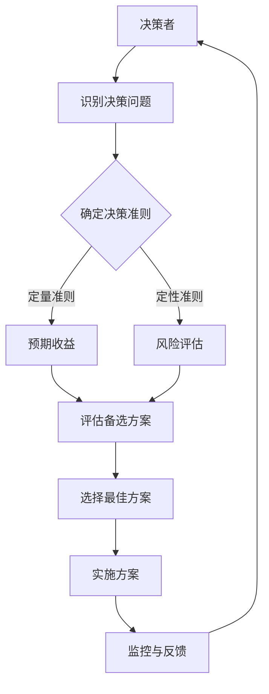

                 

### 文章标题

# 科学决策：提高领导决策质量的系统方法

科学决策是现代领导者必备的核心能力，它不仅关乎组织的长远发展，还直接影响到每一个团队成员的积极性和执行力。面对日益复杂多变的市场环境，传统的经验式决策方法已难以满足需求，科学决策方法因此显得尤为重要。《科学决策：提高领导决策质量的系统方法》这本书正是为此而作，旨在为领导者和决策者提供一套系统、全面的科学决策方法论，以帮助他们在复杂的环境中做出更加明智的决策。

本文将基于本书的核心内容和主题，结合现代技术手段，逐步分析科学决策的各个关键环节，以期为读者提供一种清晰的决策思路和实用的决策工具。我们将详细探讨决策理论的基础知识、决策分析工具与方法、领导决策的实践技巧以及决策质量的评估与改进策略，力求为读者呈现一幅完整的科学决策全景图。

### 关键词

- 科学决策
- 决策质量
- 领导能力
- 决策工具
- 风险管理

### 摘要

本文旨在探讨如何通过科学决策提高领导决策质量。首先，我们将回顾决策理论的基础知识，包括决策的定义、分类及其发展历程。随后，我们将详细介绍一系列决策分析工具与方法，包括定量决策和定性决策的分析方法，以及多目标决策的求解技术。接着，我们将深入探讨领导决策的特点与要求，通过成功与失败的案例分析，总结领导决策的实战技巧。最后，我们将讨论决策质量的评估指标与改进策略，并提供实际的案例和最佳实践技巧。希望通过本文的阐述，读者能够掌握科学决策的核心方法，并在实际工作中运用这些方法，提升自身的决策能力。

### 决策理论基础

决策理论是科学决策的基础，它涉及到决策的定义、分类、发展历程以及基本原理。了解这些基础理论有助于我们更好地理解和应用科学决策方法，从而提高决策质量。

#### 决策的定义

决策是指在面对多个可能的选择时，通过分析和评估，选择最优或次优方案的过程。它不仅包括选择方案，还涉及到决策方案的执行和反馈。决策是管理活动中的核心环节，贯穿于组织的各个层面。

#### 决策的分类

根据决策目标和情境的不同，决策可以分为以下几种类型：

1. **确定型决策**：在这种决策中，所有可能的结果及其概率都是已知的，决策者可以根据预期收益进行选择。
2. **风险型决策**：在这种决策中，可能的结果及其概率是已知的，但每个结果都有可能产生不利影响，决策者需要在风险和收益之间进行权衡。
3. **不确定型决策**：在这种决策中，可能的结果及其概率都是未知的，决策者需要根据个人偏好或经验进行选择。

#### 决策理论的发展历程

决策理论的发展可以追溯到20世纪50年代，当时由赫伯特·西蒙（Herbert A. Simon）提出了“有限理性决策模型”。西蒙认为，由于信息不完全和认知限制，决策者只能做到“满意”决策，而不是“最优”决策。这一理论奠定了现代决策研究的基础。

随后的几十年中，决策理论不断发展，出现了多种模型和方法，如期望值理论、效用理论、博弈理论等。这些理论和方法丰富了决策理论的研究内容，也为实际应用提供了更多选择。

#### 决策理论的基本原理

决策理论的基本原理包括以下几点：

1. **信息收集和处理**：决策者需要收集与决策相关的信息，并进行处理和分析，以形成对问题的全面理解。
2. **目标明确**：明确决策目标是决策过程中的关键步骤，它有助于决策者明确选择方案的标准。
3. **评估和选择**：在评估各个可行方案后，决策者需要选择最优或次优方案，并制定相应的行动计划。
4. **反馈与调整**：决策后的执行和反馈是决策过程的重要组成部分，通过反馈可以检验决策的有效性，并根据实际情况进行必要的调整。

#### 决策过程与模型

决策过程是一个系统性的过程，通常包括以下几个阶段：

1. **识别问题**：明确需要解决的问题或机会，这通常需要决策者对当前状况进行分析和评估。
2. **信息收集**：收集与问题相关的数据和信息，包括内部和外部信息。
3. **确定目标**：明确决策的目标，包括期望的结果和标准。
4. **生成备选方案**：根据目标和信息，生成一系列可行的备选方案。
5. **评估备选方案**：使用定量和定性方法对各个备选方案进行分析和评估，确定其优势和劣势。
6. **选择方案**：从备选方案中选择最优或次优方案。
7. **实施方案**：制定详细的行动计划，并执行决策方案。
8. **监控与反馈**：在决策执行过程中，对方案的实施效果进行监控，并根据反馈进行调整。

常用的决策模型包括：

1. **决策树模型**：通过树状图的形式展示决策过程和可能的结果，便于分析和评估。
2. **预期收益模型**：计算每个方案的预期收益，选择收益最大的方案。
3. **多目标决策模型**：考虑多个目标之间的权衡，选择综合收益最高的方案。

通过上述理论和方法，决策者可以更加理性地面对复杂问题，提高决策质量。然而，需要注意的是，科学决策并非万能，它需要与决策者的经验、直觉和判断相结合，才能达到最佳效果。

#### 决策理论的核心概念与联系

为了更好地理解决策理论，我们需要深入探讨其核心概念，并分析这些概念之间的联系。以下是决策理论中的几个核心概念及其相互关系：

1. **决策者**：决策者是决策过程中的关键角色，他们负责识别问题、制定目标、评估备选方案和选择最佳方案。决策者的认知能力、经验和个人偏好都会影响决策的结果。
   
2. **决策问题**：决策问题是决策过程中的起点，它指明了需要解决的问题或机会。决策问题可以分为确定型、风险型和不确定型，每种类型的问题需要不同的决策方法和策略。

3. **备选方案**：备选方案是决策过程中可供选择的方案集合。每个备选方案都有其潜在的优缺点和实施成本。决策者需要在备选方案之间进行比较和权衡，以确定最佳方案。

4. **决策准则**：决策准则是指用于评估和选择备选方案的标准。这些准则可以是定量的，如预期收益、成本和效率；也可以是定性的，如风险、不确定性和执行难度。不同的决策准则反映了决策者的目标和偏好。

5. **结果**：结果是指执行决策方案后可能产生的结果或影响。结果可以是短期的，如项目完成情况；也可以是长期的，如组织业绩和市场竞争地位。评估结果有助于验证决策的有效性和改进决策方法。

6. **信息**：信息是决策过程中不可或缺的资源，它包括内部信息和外部信息。内部信息通常来自于组织的运营数据、市场调研和历史记录；外部信息则来自于行业动态、竞争对手和市场趋势。信息质量直接影响决策的准确性和有效性。

这些核心概念之间的联系可以总结如下：

- **决策者**通过识别**决策问题**，确定**决策准则**，并根据**备选方案**和**结果**进行选择。在这一过程中，决策者需要依赖**信息**进行判断和决策。
- **决策问题**的解决需要生成一系列**备选方案**，每个方案都需要根据**决策准则**进行评估。评估过程中，决策者还需要考虑**结果**的预期，以及如何利用**信息**进行更科学的决策。

为了更直观地展示这些概念之间的关系，我们可以使用Mermaid流程图来绘制一个简单的决策流程：



通过上述流程图，我们可以清晰地看到决策过程中各个核心概念之间的互动和关联。这不仅有助于我们理解决策理论的基本原理，也为实际应用提供了直观的参考。

### 决策过程与模型

决策过程是科学决策的核心，它包括多个阶段，每个阶段都有其独特的任务和目标。理解这些阶段及其相互关系对于做出有效的决策至关重要。

#### 决策过程的六个阶段

1. **识别问题**：这是决策过程的起点，决策者需要明确当前存在的问题或机会。这一阶段通常需要通过数据收集和分析来识别问题的根源。
   
2. **信息收集**：在识别问题后，决策者需要收集与问题相关的信息。这些信息可以来自组织内部，如运营数据、历史记录和员工反馈；也可以来自外部，如市场调研、竞争对手分析和技术趋势。

3. **确定目标**：在收集到足够的信息后，决策者需要明确决策的目标。目标应具体、可衡量，并反映组织的战略和价值观。

4. **生成备选方案**：在这一阶段，决策者需要根据目标和信息，生成一系列可行的备选方案。备选方案可以是创新的，也可以是传统的，但都应具备可行性。

5. **评估备选方案**：评估备选方案是决策过程中最关键的一步，决策者需要使用定量和定性方法对每个方案进行分析和评估，以确定其优势和劣势。

6. **选择方案**：在评估各个备选方案后，决策者需要选择最优或次优方案，并制定相应的行动计划。

7. **实施方案**：在选择了最佳方案后，决策者需要制定详细的行动计划，并确保方案得到有效执行。

8. **监控与反馈**：在实施方案过程中，决策者需要对方案的实施效果进行监控，并根据反馈进行调整。

#### 决策模型的构建与优化

决策模型是决策过程中的工具，它可以帮助决策者系统地分析和评估各种备选方案。以下是几种常见的决策模型：

1. **决策树模型**：决策树是一种图形化的工具，用于展示决策过程和各个可能的结果。它通过分支节点和概率值，帮助决策者理解不同决策路径的结果和风险。

2. **预期收益模型**：预期收益模型基于概率和收益的乘积，计算每个方案的预期收益。决策者可以选择预期收益最高的方案。

3. **多目标决策模型**：多目标决策模型考虑多个目标之间的权衡，通过建立目标函数和约束条件，选择能够满足多个目标的最佳方案。

4. **博弈模型**：博弈模型用于分析决策者在竞争环境中的策略选择，通过考虑对手的行为和反应，选择最优策略。

#### 决策过程的关键因素分析

在决策过程中，有若干关键因素会影响决策的质量：

1. **信息质量**：准确、全面和及时的信息是决策的基础。信息质量的高低直接决定了决策的准确性和有效性。

2. **决策者的认知能力**：决策者的经验、直觉和判断能力对其决策有重要影响。有限的理性使得决策者需要依赖模型和工具进行辅助决策。

3. **时间限制**：时间压力常常迫使决策者做出快速决策，这可能导致对信息的不足和对风险的忽视。

4. **资源限制**：资源的有限性会影响决策者的选择范围和行动方案，决策者需要在有限的资源下做出最佳决策。

5. **环境变化**：外部环境的变化，如市场需求、技术进步和政策变化，都可能对决策产生影响。决策者需要具备适应环境变化的能力。

#### 决策过程中的常见问题与挑战

1. **信息不足或信息过载**：信息不足可能导致决策失误，信息过载则可能使决策者难以筛选关键信息，影响决策效率。

2. **目标不明确或冲突**：目标不明确或冲突可能导致决策者无法聚焦于最重要的目标，影响决策效果。

3. **评估标准不一致**：评估标准不一致可能导致决策者难以客观地评估各个方案，影响决策的公平性。

4. **依赖直觉而非数据**：过度依赖直觉而非数据可能导致决策缺乏科学依据，影响决策的准确性。

通过系统地理解和分析决策过程及其关键因素，决策者可以更好地应对各种挑战，提高决策质量。在实际应用中，结合合适的决策模型和方法，有助于决策者做出更加科学和有效的决策。

#### 决策过程中的数学模型和数学公式

在决策过程中，数学模型和数学公式是不可或缺的工具，它们可以帮助决策者更加客观和系统地分析各种备选方案。以下是一些常用的数学模型和公式，以及它们在决策中的应用。

##### 决策树模型

决策树模型是一种图形化的工具，用于展示决策过程和各个可能的结果。决策树由节点和分支组成，每个节点表示一个决策点或结果点，分支表示不同的决策路径或结果概率。

**决策树的基本公式**：

- **期望值（Expected Value, EV）**：用于计算每个路径的期望收益或损失。
  \[
  EV = \sum_{i} (P_i \times X_i)
  \]
  其中，\(P_i\) 是路径 \(i\) 的概率，\(X_i\) 是路径 \(i\) 的收益或损失。

- **条件概率（Conditional Probability）**：用于计算在某个条件下，某个结果发生的概率。
  \[
  P(A|B) = \frac{P(A \cap B)}{P(B)}
  \]
  其中，\(P(A \cap B)\) 是事件 \(A\) 和事件 \(B\) 同时发生的概率，\(P(B)\) 是事件 \(B\) 发生的概率。

**例子**：

假设一家公司需要决定是否扩大生产线，有两个备选方案：扩建现有生产线或新建一条生产线。通过收集市场数据和成本分析，可以计算出每个方案的期望收益如下：

| 方案         | 概率（P） | 收益（X） | 期望值（EV） |
|--------------|-----------|-----------|--------------|
| 扩建生产线   | 0.6       | 500,000   | 300,000      |
| 新建生产线   | 0.4       | 800,000   | 320,000      |

通过计算，扩建生产线的期望收益为300,000，新建生产线的期望收益为320,000，因此，新建生产线是更优的选择。

##### 盈亏平衡分析

盈亏平衡分析是一种评估不同备选方案成本和收益的方法，主要用于确定项目的盈利点。

**盈亏平衡点的公式**：

\[
\text{盈亏平衡点（Q*）} = \frac{\text{固定成本（FC）}}{\text{单位贡献毛利（CM）}}
\]

其中，固定成本是项目不随生产量变化而变化的成本，单位贡献毛利是每个单位产品销售后的毛利润。

**例子**：

假设一家公司正在考虑推出一款新产品，固定成本为100,000美元，单位贡献毛利为50美元。计算盈亏平衡点如下：

\[
Q* = \frac{100,000}{50} = 2,000
\]

这意味着，公司需要卖出至少2,000个产品才能覆盖成本并实现盈亏平衡。

##### 敏感性分析

敏感性分析是一种评估决策结果对某个变量变化的敏感程度的方法。它可以帮助决策者识别和应对潜在的风险。

**敏感度指数的公式**：

\[
\text{敏感度指数（SI）} = \frac{\Delta R}{\Delta X}
\]

其中，\(\Delta R\) 是结果的变化量，\(\Delta X\) 是变量变化量。

**例子**：

假设一家公司在投资决策中，预计收益为200,000美元，如果市场利率变化5%，预计收益将减少10,000美元。计算敏感度指数如下：

\[
\text{敏感度指数} = \frac{10,000}{0.05} = 200
\]

这意味着，市场利率每变化1%，收益将变化200%。

通过上述数学模型和公式，决策者可以更加科学和系统地评估各种备选方案，提高决策的质量和可靠性。在实际应用中，结合具体问题和数据，可以灵活运用这些模型和公式，为决策提供有力的支持。

### 风险与不确定性

在决策过程中，风险和不确定性是两个至关重要的概念。风险指的是决策结果可能偏离预期，并且这种偏离是可以量化的；而不确定性则是指决策结果完全无法预测或无法量化。理解和有效管理风险与不确定性是提高决策质量的关键。

#### 风险的定义与类型

**风险**是指决策结果的不确定性，这种不确定性可能带来负面或正面影响。根据风险的性质，可以将风险分为以下几类：

1. **可量化风险**：这种风险可以通过统计数据和概率模型进行量化，如市场波动、供应链中断等。
2. **不可量化风险**：这种风险无法通过量化方法进行准确评估，如政策变化、社会动荡等。
3. **系统风险**：这种风险影响整个系统，如自然灾害、经济危机等。
4. **非系统风险**：这种风险仅影响特定部分或个体，如项目延误、人员流失等。

#### 不确定性的处理方法

**不确定性**的处理方法主要包括以下几个方面：

1. **风险规避**：通过避免风险事件的发生来消除不确定性。例如，不参与高风险市场投资。
2. **风险转移**：通过将风险转移给第三方来降低不确定性，如购买保险、签订合同等。
3. **风险接受**：在风险和收益相匹配的情况下，接受风险带来的不确定性，如投资高风险项目。
4. **风险降低**：通过采取措施减少风险事件发生的概率或影响，如建立应急预案、优化供应链等。
5. **情景分析**：通过构建不同情境下的决策模型，评估不确定性对决策结果的影响。

#### 风险管理策略与工具

风险管理策略是决策者为了应对风险和不确定性而制定的行动计划。以下是几种常见的风险管理策略与工具：

1. **风险矩阵**：通过将风险的概率和影响进行量化，构建一个二维矩阵，帮助决策者识别和管理关键风险。
   
2. **蒙特卡洛模拟**：通过模拟随机事件，生成大量可能的决策结果，评估不确定性对决策的影响。
   
3. **决策树**：通过构建决策树，展示不同决策路径和结果，帮助决策者分析不同决策方案的风险和收益。
   
4. **期望值计算**：通过计算各个方案的期望收益，选择期望值最高的方案，减少决策的不确定性。

5. **敏感性分析**：通过分析决策结果对关键变量的敏感程度，识别和应对潜在的风险因素。

#### 实例分析

假设一家公司计划推出一款新产品，面临以下风险和不确定性：

- **市场需求不确定性**：市场对新产品的需求可能高于或低于预期。
- **生产风险**：生产过程可能面临供应链中断、技术问题等。
- **竞争风险**：竞争对手可能会推出类似产品，影响市场占有率。

为了应对这些风险，公司可以采取以下策略：

1. **市场需求不确定性**：通过市场调研和预测模型，评估市场需求，并建立灵活的生产计划。
2. **生产风险**：建立应急预案，确保供应链的稳定，并提前测试新技术，减少生产过程中的不确定性。
3. **竞争风险**：通过市场分析，了解竞争对手的策略，并提前制定相应的应对措施。

通过上述策略，公司可以降低风险和不确定性，提高决策的准确性和可靠性。

### 定量决策分析

在决策过程中，定量分析是一种重要的工具，它通过量化的数据和方法来评估和选择最优方案。定量决策分析主要包括决策树分析法、盈亏平衡分析法和敏感性分析法。这些方法各有特点，适用于不同类型的决策场景。

#### 决策树分析法

决策树分析法是一种图形化的方法，用于分析不同决策路径及其结果。它通过树状图的形式展示决策过程和各个可能的结果，便于分析和评估。决策树的基本步骤如下：

1. **确定决策节点**：决策树从决策节点开始，表示需要做出决策的步骤。
2. **绘制分支**：从决策节点出发，绘制各个可能的备选方案，每个备选方案对应一个结果节点。
3. **计算概率和收益**：为每个结果节点分配概率和收益值，计算每个路径的期望值。
4. **选择最佳路径**：通过比较期望值，选择期望值最高的路径。

**伪代码示例**：

```python
def decision_tree análise(decision_node, alternatives, probabilities, payoffs):
    for alternative in alternatives:
        subtree = análise(decision_node + [alternative], alternatives[1:], probabilities[1:], payoffs[1:])
        print(f"Path: {decision_node} -> {alternative}, Expected Value: {subtree.expected_value()}")
    return subtree

# 假设有一个决策节点，两个备选方案，每个方案的概率和收益如下：
decision_node = "决策节点"
alternatives = ["方案A", "方案B"]
probabilities = [0.6, 0.4]
payoffs = [50000, 60000]

# 调用决策树分析函数
decision_tree_analyse(decision_node, alternatives, probabilities, payoffs)
```

#### 盈亏平衡分析法

盈亏平衡分析法是一种用于确定项目盈利点的定量方法。它通过计算固定成本和单位贡献毛利的比例，确定项目达到盈亏平衡所需的最小销售量。公式如下：

\[
\text{盈亏平衡点（Q*）} = \frac{\text{固定成本（FC）}}{\text{单位贡献毛利（CM）}}
\]

**例子**：

假设一家公司推出一款新产品，固定成本为100,000美元，单位贡献毛利为50美元。计算盈亏平衡点如下：

\[
Q* = \frac{100,000}{50} = 2,000
\]

这意味着，公司需要卖出至少2,000个产品才能覆盖成本并实现盈亏平衡。

**伪代码示例**：

```python
def calculate_break_even(fixed_cost, contribution_margin):
    break_even_point = fixed_cost / contribution_margin
    return break_even_point

# 假设固定成本和单位贡献毛利如下：
fixed_cost = 100000
contribution_margin = 50

# 计算盈亏平衡点
break_even_point = calculate_break_even(fixed_cost, contribution_margin)
print(f"Break Even Point: {break_even_point}")
```

#### 敏感性分析法

敏感性分析法用于评估决策结果对关键变量变化的敏感程度。它通过计算每个变量的变化对决策结果的影响，帮助决策者识别和应对潜在的风险。公式如下：

\[
\text{敏感度指数（SI）} = \frac{\Delta R}{\Delta X}
\]

其中，\(\Delta R\) 是结果的变化量，\(\Delta X\) 是变量变化量。

**例子**：

假设一项投资决策的预期收益为200,000美元，如果市场利率变化5%，预期收益将减少10,000美元。计算敏感度指数如下：

\[
\text{敏感度指数} = \frac{10,000}{0.05} = 200
\]

这意味着，市场利率每变化1%，预期收益将变化200%。

**伪代码示例**：

```python
def calculate_sensitivity(change_in_result, change_in_variable):
    sensitivity_index = change_in_result / change_in_variable
    return sensitivity_index

# 假设结果变化和变量变化如下：
change_in_result = 10000
change_in_variable = 0.05

# 计算敏感度指数
sensitivity_index = calculate_sensitivity(change_in_result, change_in_variable)
print(f"Sensitivity Index: {sensitivity_index}")
```

通过上述定量决策分析方法，决策者可以更加科学和系统地评估各种备选方案，提高决策的质量和可靠性。在实际应用中，结合具体问题和数据，可以灵活运用这些方法，为决策提供有力的支持。

### 定性决策分析

在决策过程中，定量决策方法虽然能够提供精确的数据支持，但有时面对复杂和模糊的决策问题，定性方法则显得尤为重要。定性决策分析主要依靠专家判断、主观评价和逻辑推理，通过定性分析工具如模糊综合评价法、熵权法和德尔菲法，帮助决策者更加全面地理解和评估问题。

#### 模糊综合评价法

模糊综合评价法是一种基于模糊数学理论的评价方法，它适用于处理具有模糊性和不确定性的决策问题。该方法通过构建模糊关系矩阵，对各个评价因素进行综合评估，最终得出评价结果。

**步骤**：

1. **建立评价因素集**：确定影响决策的各个因素，并形成评价因素集 \(U = \{u_1, u_2, ..., u_n\}\)。
2. **确定评价等级集**：设定评价等级集 \(V = \{v_1, v_2, ..., v_m\}\)，如“很好”、“较好”、“一般”、“较差”、“很差”。
3. **构造评价矩阵**：根据专家评分，构建评价矩阵 \(R\)，其中 \(R_{ij}\) 表示第 \(i\) 个因素在第 \(j\) 个评价等级上的隶属度。
4. **确定权重向量**：根据专家意见，确定各个评价因素的权重向量 \(W = \{w_1, w_2, ..., w_n\}\)。
5. **计算综合评价结果**：通过模糊综合评价模型，计算综合评价结果 \(S = W \cdot R\)。

**数学模型**：

\[
S = W \cdot R = \sum_{i=1}^{n} w_i \cdot R_{ij}
\]

**例子**：

假设需要对一个项目的可行性进行评估，有四个主要评价因素：技术可行性、经济可行性、市场可行性和环境影响。设定五个评价等级，并收集专家评分，如下表所示：

| 评价因素 | 评价等级 |
|----------|----------|
| 很好     | 0.2      |
| 较好     | 0.3      |
| 一般     | 0.4      |
| 较差     | 0.1      |
| 很差     | 0.0      |

专家评分矩阵 \(R\) 如下：

\[
R = \begin{bmatrix}
0.8 & 0.1 & 0.1 & 0.0 & 0.0 \\
0.6 & 0.2 & 0.2 & 0.0 & 0.0 \\
0.7 & 0.1 & 0.1 & 0.1 & 0.0 \\
0.5 & 0.3 & 0.2 & 0.0 & 0.0
\end{bmatrix}
\]

设定权重向量 \(W\) 为：

\[
W = \begin{bmatrix}
0.3 \\
0.2 \\
0.2 \\
0.1 \\
0.2
\end{bmatrix}
\]

计算综合评价结果 \(S\)：

\[
S = W \cdot R = \begin{bmatrix}
0.3 \\
0.2 \\
0.2 \\
0.1 \\
0.2
\end{bmatrix}
\cdot
\begin{bmatrix}
0.8 & 0.1 & 0.1 & 0.0 & 0.0 \\
0.6 & 0.2 & 0.2 & 0.0 & 0.0 \\
0.7 & 0.1 & 0.1 & 0.1 & 0.0 \\
0.5 & 0.3 & 0.2 & 0.0 & 0.0
\end{bmatrix}
=
\begin{bmatrix}
0.29 \\
0.26 \\
0.25 \\
0.11 \\
0.20
\end{bmatrix}
\]

根据综合评价结果，可以判断项目的整体可行性。

#### 熵权法

熵权法是一种基于信息论的方法，用于确定评价指标的权重。它通过计算各评价指标的信息熵，衡量评价指标的信息量，并根据信息量分配权重。

**步骤**：

1. **建立评价矩阵**：确定评价因素和评价等级，构建评价矩阵 \(X\)。
2. **计算评价指标的熵**：根据评价矩阵，计算每个评价指标的熵 \(e_j\)。
3. **计算评价指标的差异性系数**：计算每个评价指标的差异性系数 \(d_j\)。
4. **计算权重**：根据差异性系数计算评价指标的权重 \(w_j\)。

**数学模型**：

\[
e_j = -k \cdot \sum_{i=1}^{n} p_{ij} \cdot \ln(p_{ij})
\]

\[
d_j = \frac{1 - e_j}{\max_{j} (1 - e_j) - \min_{j} (1 - e_j)}
\]

\[
w_j = \frac{d_j}{\sum_{j=1}^{m} d_j}
\]

**例子**：

假设有四个评价因素：技术能力、经济能力、市场能力和管理能力。构建评价矩阵 \(X\) 如下：

\[
X = \begin{bmatrix}
0.8 & 0.6 & 0.7 & 0.9 \\
0.7 & 0.5 & 0.6 & 0.8 \\
0.6 & 0.4 & 0.5 & 0.7 \\
0.5 & 0.3 & 0.4 & 0.6
\end{bmatrix}
\]

计算各评价指标的信息熵 \(e_j\)：

\[
e_1 = -0.9 \cdot (0.8 \cdot \ln(0.8) + 0.7 \cdot \ln(0.7) + 0.6 \cdot \ln(0.6) + 0.5 \cdot \ln(0.5)) \approx 0.176
\]

\[
e_2 = -0.9 \cdot (0.6 \cdot \ln(0.6) + 0.5 \cdot \ln(0.5) + 0.4 \cdot \ln(0.4) + 0.3 \cdot \ln(0.3)) \approx 0.250
\]

\[
e_3 = -0.9 \cdot (0.7 \cdot \ln(0.7) + 0.6 \cdot \ln(0.6) + 0.5 \cdot \ln(0.5) + 0.4 \cdot \ln(0.4)) \approx 0.211
\]

\[
e_4 = -0.9 \cdot (0.9 \cdot \ln(0.9) + 0.8 \cdot \ln(0.8) + 0.7 \cdot \ln(0.7) + 0.6 \cdot \ln(0.6)) \approx 0.141
\]

计算各评价指标的差异性系数 \(d_j\)：

\[
d_1 = \frac{1 - 0.176}{1 - 0.141} \approx 0.632
\]

\[
d_2 = \frac{1 - 0.250}{1 - 0.141} \approx 0.729
\]

\[
d_3 = \frac{1 - 0.211}{1 - 0.141} \approx 0.625
\]

\[
d_4 = \frac{1 - 0.141}{1 - 0.141} \approx 0.000
\]

计算评价指标的权重 \(w_j\)：

\[
w_1 = \frac{0.632}{0.632 + 0.729 + 0.625 + 0.000} \approx 0.276
\]

\[
w_2 = \frac{0.729}{0.632 + 0.729 + 0.625 + 0.000} \approx 0.321
\]

\[
w_3 = \frac{0.625}{0.632 + 0.729 + 0.625 + 0.000} \approx 0.277
\]

\[
w_4 = \frac{0.000}{0.632 + 0.729 + 0.625 + 0.000} \approx 0.000
\]

根据计算结果，技术能力和经济能力的权重较高，而管理能力的权重较低。

#### 德尔菲法

德尔菲法是一种通过专家意见多次反馈和修正，达成共识的决策方法。该方法通过专家的独立判断和群体讨论，逐步形成一致的决策方案。

**步骤**：

1. **选择专家**：选择具备相关领域知识和经验的专家，构成专家小组。
2. **设计问卷**：设计包含决策问题及其详细描述的问卷，并要求专家独立填写。
3. **收集和整理反馈**：收集专家的问卷答案，进行整理和统计分析。
4. **反馈和修正**：将统计分析结果反馈给专家，并要求他们根据反馈进行修正。
5. **多次循环**：重复反馈和修正过程，直至专家意见达成一致。

**例子**：

假设一个团队需要评估某个新项目的可行性，邀请了五位专家进行德尔菲法评估。专家们分别给出了如下初步评估：

| 专家 | 技术可行性 | 经济可行性 | 市场可行性 | 管理可行性 |
|------|-------------|-------------|-------------|-------------|
| A    | 0.8         | 0.7         | 0.9         | 0.8         |
| B    | 0.7         | 0.6         | 0.8         | 0.7         |
| C    | 0.9         | 0.8         | 0.9         | 0.9         |
| D    | 0.6         | 0.5         | 0.7         | 0.6         |
| E    | 0.7         | 0.6         | 0.8         | 0.7         |

第一次反馈后，专家们根据统计结果进行了修正，如下表所示：

| 专家 | 技术可行性 | 经济可行性 | 市场可行性 | 管理可行性 |
|------|-------------|-------------|-------------|-------------|
| A    | 0.8         | 0.7         | 0.9         | 0.8         |
| B    | 0.75        | 0.65        | 0.85        | 0.75        |
| C    | 0.9         | 0.8         | 0.9         | 0.9         |
| D    | 0.65        | 0.55        | 0.75        | 0.65        |
| E    | 0.75        | 0.65        | 0.85        | 0.75        |

通过多次反馈和修正，最终专家们的意见逐渐趋于一致，达成了共识。

通过模糊综合评价法、熵权法和德尔菲法等定性决策分析方法，决策者可以更加灵活和全面地处理复杂和模糊的决策问题，提高决策的准确性和可靠性。在实际应用中，这些方法需要结合具体问题和数据，灵活运用，以达到最佳效果。

### 多目标决策

多目标决策是决策过程中常见且复杂的一种情况，它涉及到多个相互冲突的目标，需要在不同的利益相关者之间进行权衡和平衡。多目标决策的核心在于如何在多个目标之间找到一种最优或近似最优的解决方案。

#### 多目标决策的基本概念

多目标决策（Multi-Objective Decision Making, MODM）涉及以下基本概念：

1. **目标**：决策过程中需要实现的目标，可以是量化的，也可以是定性的。
2. **决策变量**：影响目标实现的变量，如资源分配、项目优先级等。
3. **约束条件**：限制决策变量取值的条件，如预算、时间、法律法规等。
4. **效益函数**：用于量化目标实现程度的函数，可以是单一目标也可以是多个目标。
5. **解集**：所有可行解的集合，每个解都是决策变量的一组取值。

#### 多目标决策的求解方法

多目标决策的求解方法可以分为两大类：传统方法和现代方法。

**传统方法**：

1. **目标规划（Goal Programming）**：目标规划将多目标问题转化为一系列单一目标问题，通过设置优先级和权重来平衡不同目标。
   
2. **层次分析法（Analytic Hierarchy Process, AHP）**：层次分析法通过建立层次结构模型，对决策问题进行分解，并通过成对比较矩阵计算各目标的权重。

**现代方法**：

1. **多目标规划（Multi-Objective Programming）**：多目标规划利用数学优化方法，如线性规划、非线性规划和整数规划，求解多目标问题。
   
2. **进化算法（Evolutionary Algorithms）**：进化算法通过模拟自然进化过程，如遗传算法、粒子群优化等，寻找多个目标之间的平衡解。

3. **模糊综合评价法**：模糊综合评价法通过模糊数学理论，对多目标问题进行综合评价，找到满足所有目标的近似最优解。

4. **多目标决策树（Multi-Objective Decision Tree）**：多目标决策树将决策过程分解为多个阶段，在每个阶段通过决策树模型求解单一目标问题，最终综合各阶段结果得到多目标解。

#### 多目标决策的求解过程

多目标决策的求解过程通常包括以下几个步骤：

1. **问题定义**：明确决策目标、决策变量和约束条件，构建多目标模型。
   
2. **目标权重确定**：通过专家评估、层次分析法等，确定各目标的权重，用于平衡不同目标之间的冲突。
   
3. **求解方法选择**：根据决策问题的特点，选择合适的求解方法，如多目标规划、进化算法等。
   
4. **求解与评估**：使用所选方法求解多目标问题，得到多个非劣解（Pareto前沿），并对这些解进行评估和比较。
   
5. **决策方案选择**：在多个非劣解中，根据决策者的偏好和实际情况，选择一个或多个最优解。

#### 案例分析

**案例背景**：

一家公司需要在新产品开发项目中同时考虑以下三个目标：

1. **成本最小化**：控制项目总成本，确保项目盈利。
2. **时间最短**：缩短产品开发周期，尽快投放市场。
3. **质量最高**：保证产品质量，减少售后问题。

**模型构建**：

设目标函数如下：

\[
\begin{align*}
\min \quad z &= C_1 \cdot x_1 + C_2 \cdot x_2 + C_3 \cdot x_3 \\
\text{subject to} \quad t_1 \cdot x_1 + t_2 \cdot x_2 + t_3 \cdot x_3 &\leq T \\
q_1 \cdot x_1 + q_2 \cdot x_2 + q_3 \cdot x_3 &\geq Q \\
x_1, x_2, x_3 &\geq 0
\end{align*}
\]

其中，\(C_1, C_2, C_3\) 分别为成本系数，\(t_1, t_2, t_3\) 分别为时间系数，\(q_1, q_2, q_3\) 分别为质量系数，\(T\) 为总时间约束，\(Q\) 为质量约束，\(x_1, x_2, x_3\) 分别为资源分配变量。

**求解过程**：

1. **目标权重确定**：通过专家评估，确定成本、时间和质量的权重分别为0.5、0.3和0.2。
2. **求解方法选择**：采用遗传算法求解多目标优化问题。
3. **求解与评估**：通过遗传算法得到多个非劣解，并在这些解中根据决策者的偏好选择一个最优解。
4. **决策方案选择**：选择一个成本较低、时间较短、质量较高的解作为最终决策方案。

通过多目标决策方法，公司可以找到在成本、时间和质量之间达到平衡的最佳解决方案，提高新产品开发的效率和效果。

### 领导决策的特点与要求

领导决策是指在组织管理过程中，领导者为达成组织目标所做出的决策。与普通决策相比，领导决策具有其独特的特点和要求，需要领导者具备较高的决策能力和综合素质。

#### 领导决策的类型

领导决策可以根据决策目标和情境的不同，分为以下几种类型：

1. **战略决策**：涉及组织的长期发展方向和重大战略选择，如市场定位、业务拓展、资源配置等。
2. **战术决策**：涉及组织的短期策略和具体行动安排，如项目优先级、人员调配、运营管理等。
3. **运营决策**：涉及日常运营中的具体问题和解决方法，如生产计划、库存管理、客户服务等。

#### 领导决策的原则

为了提高决策质量，领导者应遵循以下原则：

1. **目标导向**：明确决策目标，确保决策与组织战略和目标一致。
2. **全面分析**：收集充分的信息，全面分析决策因素，避免盲目决策。
3. **科学方法**：运用科学决策方法和工具，如决策树、预期收益模型等，提高决策的准确性和可靠性。
4. **民主参与**：鼓励团队成员参与决策，提高决策的透明度和团队凝聚力。
5. **快速响应**：面对突发事件和变化，能够迅速做出反应，调整决策方案。

#### 领导决策的能力建设

为了有效进行领导决策，领导者需要不断提升以下能力：

1. **信息获取与处理能力**：善于收集和利用内外部信息，通过数据分析形成对问题的深刻理解。
2. **逻辑推理与判断能力**：具备较强的逻辑思维能力，能够进行科学合理的推理和判断。
3. **沟通协调能力**：能够有效地与团队成员沟通，协调各方利益，达成共识。
4. **决策执行能力**：制定详细的行动计划，确保决策方案得到有效执行。
5. **风险管理与应变能力**：具备良好的风险管理意识和应变能力，能够应对各种不确定性和挑战。

#### 领导决策案例分析

为了更好地理解领导决策的特点和实践，我们可以通过分析一些成功和失败的决策案例，总结经验教训。

**成功案例**：

1. **案例背景**：某高科技公司面临技术升级和市场竞争的挑战，决定推出一款具有竞争力的新产品。
2. **决策过程**：
   - **目标明确**：明确新产品研发的战略目标，包括技术领先、市场占有率和盈利能力。
   - **信息收集**：通过市场调研、技术分析和竞争对手分析，收集充分的信息。
   - **方案评估**：评估多个技术方案和市场策略，通过定量和定性方法进行综合评估。
   - **选择方案**：选择最优方案，制定详细的研发和生产计划。
   - **执行与反馈**：确保研发和生产过程中的各项任务得到有效执行，并根据反馈进行调整。
3. **结果**：新产品成功推出，取得了显著的市场份额和盈利，提升了公司竞争力。

**失败案例**：

1. **案例背景**：某传统制造业公司决定进入高科技领域，开展一项高风险的新业务。
2. **决策过程**：
   - **目标不明确**：没有明确新业务的具体目标和发展方向，导致战略模糊。
   - **信息不足**：对高科技领域缺乏深入了解，信息收集和分析不足。
   - **方案评估**：未能充分评估风险和收益，盲目决策。
   - **执行与反馈**：新业务运营过程中，管理混乱，无法有效应对市场变化。
3. **结果**：新业务失败，导致公司资源浪费和竞争力下降。

通过以上案例分析，我们可以看到，成功的领导决策需要明确目标、充分分析、科学决策和有效执行。而失败的决策往往源于目标不明确、信息不足、方案评估不当和执行问题。领导者应从中吸取教训，不断提升自身的决策能力和管理水平。

### 领导决策的案例分析

为了深入探讨领导决策的实践，我们将通过两个案例，一个是成功的决策，另一个是失败的决策，分析其中的关键因素，总结经验教训。

#### 成功案例：某科技公司的市场扩张

**案例背景**：

某科技公司在技术研发方面取得了显著成就，市场对其产品需求旺盛。公司领导层决定抓住这一机遇，进一步扩大市场份额，实现全球化布局。

**决策过程**：

1. **明确目标**：公司领导层首先明确了市场扩张的目标，包括提升品牌知名度、扩大市场份额和建立全球销售网络。
2. **信息收集**：通过市场调研、竞争对手分析和行业报告，收集了大量有关国际市场的信息，了解目标市场的需求、竞争态势和潜在风险。
3. **方案评估**：
   - **定量分析**：使用决策树模型和预期收益模型，对不同的市场进入方案进行了评估，计算了各方案的预期收益和风险。
   - **定性分析**：通过专家访谈和内部讨论，评估了各个方案的战略价值和执行难度。
4. **选择方案**：在综合评估后，公司选择了通过并购本地企业来快速进入市场，这一方案不仅能够迅速提升市场份额，还能保留本地市场资源和客户。
5. **执行与反馈**：
   - **执行计划**：制定了详细的并购计划，包括并购对象、谈判策略、资源分配和时间表。
   - **监控与调整**：在执行过程中，公司领导层定期评估并购进展，并根据市场反馈进行调整，确保方案得以顺利实施。

**结果**：

通过这一系列科学的决策过程，公司成功并购了多家本地企业，迅速提升了市场占有率，品牌影响力也得到了显著提升，实现了全球化布局的目标。

#### 失败案例：某制造企业的产品线扩展

**案例背景**：

某制造企业在某一产品线取得了较高的市场份额和盈利能力，决定进一步扩展产品线，开发新产品。

**决策过程**：

1. **目标不明确**：公司领导层未能明确新产品开发的具体目标和市场定位，导致决策模糊。
2. **信息不足**：在信息收集阶段，公司未能充分了解市场需求、竞争态势和技术发展趋势，信息不足。
3. **方案评估**：
   - **定量分析不足**：缺乏对新产品盈利能力的详细预测和风险评估，仅凭主观判断。
   - **定性分析不充分**：未能通过专家访谈和市场竞争分析，全面评估新产品的前景。
4. **选择方案**：在信息不足和评估不充分的情况下，公司领导层选择了开发高风险、高投入的新产品，未进行充分的风险控制。
5. **执行与反馈**：
   - **执行计划不详细**：缺乏明确的执行计划和资源分配，导致项目推进过程中出现资源短缺和进度延误。
   - **监控与调整不足**：在项目执行过程中，公司未能及时发现和解决问题，缺乏有效的监控和调整机制。

**结果**：

新产品开发失败，导致企业资源浪费、市场份额下降，甚至影响了原有产品的销售和盈利能力。

#### 经验教训

1. **明确目标**：领导决策应首先明确具体目标和战略方向，确保决策方向一致。
2. **充分信息收集**：全面、准确的信息是科学决策的基础，领导决策过程中应充分收集和分析内外部信息。
3. **科学评估**：通过定量和定性方法综合评估各个方案，权衡风险与收益，确保决策的科学性。
4. **详细执行计划**：制定详细的执行计划，明确资源分配和时间表，确保决策得到有效实施。
5. **持续监控与调整**：在决策执行过程中，应持续监控项目进展，及时调整方案，以应对变化和风险。

通过成功和失败的案例分析，我们可以看到，领导决策的科学性和执行效果直接关系到决策的成功与否。领导者应从中汲取经验，不断提升决策能力和管理水平，以实现组织的目标和发展。

### 领导决策的实战技巧

在领导决策的实践中，除了掌握科学的理论和方法外，还需要具备一系列实战技巧，这些技巧有助于提高决策的质量和有效性。以下是一些关键的实战技巧：

#### 决策前的准备工作

1. **明确决策目标**：在决策前，首先明确决策的目标和期望结果，确保决策方向一致，避免目标模糊导致的决策混乱。

2. **信息收集**：系统收集与决策相关的信息，包括内部数据和外部数据。利用市场调研、数据分析、专家咨询等方法，确保信息的全面性和准确性。

3. **分析环境和趋势**：了解当前的市场环境、技术发展趋势和行业动态，预测未来可能的变化，为决策提供背景支持。

4. **确定约束条件**：识别决策过程中的约束条件，如预算、时间、资源等，这些约束条件将直接影响决策方案的选择和实施。

#### 决策过程中的沟通与协调

1. **建立沟通机制**：建立一个有效的沟通机制，确保信息流畅传递。定期召开决策会议，确保团队成员充分参与和意见交流。

2. **听取多方意见**：在决策过程中，重视团队成员和专业顾问的意见，避免信息孤岛和偏见，通过多角度分析提高决策的科学性。

3. **协商与协调**：面对不同利益相关者的需求和意见，通过协商和协调，找到平衡点，确保决策的可行性和执行力。

4. **保持透明**：确保决策过程透明，公开决策依据和决策结果，增强团队对决策的认同感和信任度。

#### 决策后的评估与反馈

1. **评估决策效果**：在决策执行后，定期评估决策效果，通过关键绩效指标（KPIs）和实际结果进行比较，分析决策的成效。

2. **反馈与调整**：根据评估结果，及时进行反馈和调整。对于成功的决策，总结经验，形成最佳实践；对于失败的决策，分析原因，吸取教训，改进决策流程。

3. **持续改进**：建立持续改进机制，通过不断学习和实践，提升决策能力和决策质量，以适应不断变化的环境和挑战。

#### 实际案例分析与技巧应用

**案例背景**：

某公司在市场扩张过程中，面临市场不确定性、竞争压力和资源约束等多重挑战，公司领导层需要在短时间内做出一系列关键决策。

**决策前的准备工作**：

1. **明确目标**：公司领导层明确了市场扩张的短期和长期目标，包括市场份额提升、品牌知名度扩大和利润增长。
2. **信息收集**：通过市场调研和行业报告，收集了目标市场的需求、竞争对手和行业趋势等信息。
3. **分析环境和趋势**：分析了当前的市场环境，特别是新兴市场的机会和风险，为决策提供背景支持。
4. **确定约束条件**：明确了预算限制、人力资源和物流等约束条件。

**决策过程中的沟通与协调**：

1. **建立沟通机制**：定期召开决策会议，确保市场部门、销售团队和财务部门的意见能够充分交流。
2. **听取多方意见**：通过专家访谈和团队讨论，收集了市场部门、销售团队和财务部门的专业意见。
3. **协商与协调**：面对预算限制和市场需求之间的矛盾，通过协商和协调，制定了合理的预算分配方案。
4. **保持透明**：决策过程和决策依据对外部利益相关者透明，增强了合作伙伴的信任。

**决策后的评估与反馈**：

1. **评估决策效果**：在决策执行后，通过关键绩效指标（如销售额、市场份额和利润率）进行定期评估，分析决策的成效。
2. **反馈与调整**：根据评估结果，对市场策略和预算分配进行了适当调整，以更好地适应市场变化。
3. **持续改进**：通过总结成功经验和失败教训，不断优化决策流程，提高决策质量和执行力。

通过上述实战技巧的应用，公司成功实现了市场扩张的目标，提升了品牌知名度和市场份额。

### 决策质量的评估指标

决策质量是衡量决策有效性的重要指标，通过科学的方法评估决策质量，可以确保决策的科学性和可靠性，提高组织的整体绩效。以下是决策质量评估的几个关键指标及其详细说明。

#### 评估决策质量的定义

评估决策质量是指通过一系列指标和方法，对决策过程中的各个阶段进行评价，以确定决策的合理性和有效性。决策质量评估不仅关注决策结果，还关注决策过程和决策机制，旨在找出改进的空间和提升决策能力的途径。

#### 决策质量的评估指标体系

决策质量的评估指标体系包括以下几个方面：

1. **目标实现度**：衡量决策是否达到预期目标，包括短期目标和长期目标。这一指标可以通过实际结果与预期目标之间的比较得出。

2. **信息准确性**：评估决策过程中信息收集和分析的准确性。准确的信息是科学决策的基础，信息准确性可以通过回顾决策过程中使用的数据和信息来源进行评价。

3. **决策过程的合理性**：衡量决策过程的科学性和规范性，包括决策程序、参与人员、信息交流等。这一指标可以通过决策过程的透明度、参与度和决策效率来衡量。

4. **方案评估的全面性**：评估决策过程中对各个备选方案的评估是否全面，包括定量和定性方法的综合运用。这一指标可以通过方案评估的覆盖范围和评估方法的多样性来衡量。

5. **风险管理的有效性**：评估决策过程中对风险的识别、评估和管理是否有效。这一指标可以通过风险管理的工具和方法的使用以及风险控制的效果来衡量。

6. **决策结果的可行性**：评估决策结果在实际操作中是否可行，包括资源的配置、计划的实施和执行的可能性。这一指标可以通过执行过程中的反馈和调整情况来衡量。

7. **决策的及时性**：评估决策是否能够在合理的时间内做出，并迅速采取行动。这一指标可以通过决策周期和响应时间来衡量。

#### 决策质量的评估方法

1. **自我评估**：通过组织内部的自我评估，回顾决策过程的各个阶段，识别存在的问题和改进空间。这种方法简单易行，但需要确保评估的客观性和真实性。

2. **第三方评估**：邀请外部专家或顾问对决策过程进行评估，提供客观、专业的意见和建议。这种方法能够提供更全面的视角和更深入的洞察，但成本较高。

3. **关键绩效指标（KPI）**：使用关键绩效指标对决策结果进行量化评估，如市场份额、销售额、利润率等。这种方法能够提供具体的数据支持，但需要确保指标的选择和衡量方法科学合理。

4. **案例分析**：通过对比成功和失败的决策案例，分析其成功和失败的原因，总结经验教训。这种方法能够提供深刻的见解和实用的指导，但需要对案例进行充分的收集和分析。

5. **决策质量评分模型**：建立决策质量评分模型，对决策过程中的各个指标进行打分，综合评估决策质量。这种方法需要建立科学的评分体系，但能够提供量化的评估结果。

通过上述评估指标和方法，组织可以全面、科学地评估决策质量，发现改进空间，提升决策能力，从而实现组织的长期发展目标。

### 决策质量的改进策略

为了持续提升决策质量，组织需要采取一系列改进策略，这些策略包括改进原则、具体方法和持续改进机制。以下是这些策略的详细说明：

#### 改进原则

1. **系统性**：决策质量的提升需要系统的规划和实施，涉及组织文化、流程、工具等多个方面，不能仅依赖某一方面的改进。
2. **科学性**：改进策略应基于科学的理论和方法，通过数据分析和模型优化，确保改进措施的有效性。
3. **灵活性**：决策环境多变，改进策略应具备灵活适应性，能够快速响应环境变化，调整决策方法和流程。
4. **参与性**：决策质量提升需要全员参与，鼓励团队成员提出改进建议，共同推动决策质量的持续改进。

#### 具体方法

1. **培训与教育**：通过组织决策培训，提高团队成员的决策意识和能力，包括决策理论、工具和方法的应用。培训内容可以包括决策案例分析、工具使用、思维训练等。
   
2. **信息管理系统**：建立完善的信息管理系统，确保信息的及时、准确传递，提供决策支持。这包括数据收集、处理、分析和可视化工具的应用，以及信息共享平台的建设。

3. **决策支持工具**：引入和优化决策支持工具，如决策树、预期收益模型、多目标决策工具等，帮助决策者更科学地分析和评估备选方案。

4. **流程优化**：优化决策流程，减少冗余环节，提高决策效率。可以通过流程图、关键路径分析等方法，识别和消除流程中的瓶颈，确保决策流程的流畅性。

5. **风险管理**：加强风险管理，通过建立风险识别、评估和管理机制，降低决策过程中的不确定性和风险。

6. **反馈与调整**：建立有效的反馈机制，对决策结果进行持续跟踪和评估，及时调整决策方案。通过定期的回顾和反思，总结经验教训，优化决策流程和方法。

#### 持续改进机制

1. **定期评审**：定期对决策过程和决策质量进行评审，识别存在的问题和改进点。评审可以采用自我评审、第三方评审或结合两者，确保评审的客观性和全面性。

2. **改进计划**：根据评审结果，制定具体的改进计划，明确改进目标、措施和责任人。改进计划应具有可操作性和时间限制，确保改进措施的落地和执行。

3. **知识管理**：建立知识管理系统，记录和分享决策过程中的经验和教训，形成知识库，为后续决策提供参考。知识管理可以通过文档管理、经验分享、案例库等方式实现。

4. **持续学习与优化**：鼓励团队成员持续学习和优化决策能力，通过参与外部培训、研讨会和内部培训，不断更新知识和技能，提升决策水平。

5. **创新机制**：建立创新机制，鼓励团队成员提出新的决策方法和工具，通过实验和试点，验证其有效性，逐步推广到整个组织。

通过上述改进策略，组织可以建立起一个持续提升决策质量的机制，确保决策的科学性、有效性和适应性，从而更好地应对复杂多变的环境，实现组织的长远发展目标。

### 领导决策的可持续发展

领导决策的可持续发展是现代企业面对复杂和动态环境的重要战略，它不仅关乎组织的短期效益，更关系到其长期生存和发展。为了实现领导决策的可持续发展，我们需要从决策与组织文化、组织战略、以及如何实现长期可持续发展的具体措施等方面进行全面探讨。

#### 决策与组织文化

组织文化是影响决策行为和效果的重要因素。一个积极、开放和创新的组织文化能够促进科学决策的实践，提升决策的质量和执行力。

1. **培养创新文化**：领导者应积极倡导和培养创新文化，鼓励团队成员提出新想法和解决方案。通过设立创新奖项和激励机制，激发员工的创造力和创新精神。
2. **建立信任文化**：信任是决策有效实施的基础。领导者应建立透明、开放的沟通机制，增强团队之间的信任，确保决策信息能够流畅传递，减少信息不对称。
3. **倡导学习文化**：领导者应倡导学习型组织文化，鼓励团队成员不断学习新知识和技能，提升决策能力和专业素养。通过内部培训和外部学习机会，持续提升组织整体的知识储备和创新能力。

#### 决策与组织战略

组织战略是决策的重要方向和依据。科学的决策应与组织战略紧密相连，确保决策与组织目标一致，推动组织战略的实现。

1. **明确战略目标**：领导者应首先明确组织的战略目标，确保决策与战略目标一致。通过制定具体的战略规划，明确组织的愿景、使命和价值观，为决策提供清晰的指导。
2. **战略分解**：将组织的战略目标分解为具体的执行计划和行动方案，确保决策能够落实到具体的项目和任务中。通过目标分解，可以使团队成员明确自己的职责和目标，提高执行力和协作效果。
3. **战略调整与优化**：根据市场环境的变化和组织的实际情况，及时调整和优化战略规划。领导者应具备灵活应变的能力，通过定期评估和调整战略，确保决策能够适应不断变化的环境。

#### 实现领导决策的可持续发展

为了实现领导决策的可持续发展，组织需要采取一系列具体措施，确保决策过程和结果能够持续优化和提升。

1. **建立持续改进机制**：通过定期评审和反馈，建立持续改进机制，对决策过程和决策质量进行持续跟踪和优化。通过识别问题、分析原因、制定改进措施，不断优化决策流程和方法。
2. **加强数据分析和模型应用**：利用先进的数据分析技术和决策模型，提高决策的科学性和准确性。通过大数据分析和人工智能技术，对市场趋势、客户需求和技术发展进行深入分析，为决策提供更加精准的支持。
3. **推动跨部门合作**：通过建立跨部门合作机制，促进不同部门和团队之间的信息共享和协作，提高决策的全面性和协同性。跨部门合作可以促进知识共享、资源整合，提高决策效率和质量。
4. **重视员工参与**：鼓励员工参与决策过程，提高员工的参与感和责任感。通过员工提案、民主决策等形式，激发员工的积极性和创造力，为决策提供更多的视角和建议。
5. **培养决策能力**：通过培训和培训，提升领导者和团队成员的决策能力。建立决策培训体系，提供包括决策理论、工具和方法在内的全方位培训，帮助团队成员掌握科学的决策方法和技巧。

#### 案例与经验

**案例背景**：

某大型制造企业在面临市场变化和竞争压力时，通过一系列科学的决策和战略调整，实现了可持续发展。

**决策过程**：

1. **明确战略目标**：公司领导层明确了以创新和可持续发展为核心的战略目标，制定了具体的创新计划和市场拓展策略。
2. **信息收集与分析**：通过市场调研、客户反馈和竞争对手分析，收集了大量相关信息，为决策提供了数据支持。
3. **方案评估**：使用多目标决策模型和决策树分析法，对多个备选方案进行评估和比较，确保决策的科学性和合理性。
4. **决策执行**：制定了详细的执行计划，明确责任人和时间表，确保决策得到有效执行。
5. **持续反馈与调整**：在决策执行过程中，通过定期评估和反馈，及时调整决策方案，确保决策与实际情况保持一致。

**结果**：

通过上述决策过程和战略调整，公司成功应对了市场变化，提升了市场竞争力，实现了可持续发展。员工参与度和创新能力显著提升，公司业绩持续增长。

### 结论

通过本文的探讨，我们系统地介绍了《科学决策：提高领导决策质量的系统方法》的核心内容和方法。从决策理论基础、决策分析工具、领导决策实践、决策质量评估与改进到决策的可持续发展，我们逐一分析了每个环节的关键概念、原理和实践技巧。

首先，我们回顾了决策理论的基础知识，包括决策的定义、分类、发展历程和基本原理。了解这些基础知识有助于我们更好地理解和应用科学决策方法。

接着，我们介绍了决策分析工具，包括定量决策分析和定性决策分析的方法。定量决策分析如决策树分析法、盈亏平衡分析法、敏感性分析法，定性决策分析如模糊综合评价法、熵权法和德尔菲法，这些方法为科学决策提供了有力的工具。

然后，我们深入探讨了领导决策的特点与要求，通过成功与失败的案例分析，总结了领导决策的实战技巧。这些技巧包括决策前的准备工作、决策过程中的沟通与协调，以及决策后的评估与反馈。

在决策质量评估与改进方面，我们提出了评估决策质量的定义、指标体系和评估方法。通过自我评估、第三方评估、关键绩效指标和案例分析等方法，组织可以全面评估决策质量，发现改进空间。

最后，我们讨论了领导决策的可持续发展，强调决策与组织文化、战略的关系，并提出了实现可持续发展的具体措施。

希望通过本文的阐述，读者能够掌握科学决策的核心方法，并在实际工作中运用这些方法，提升自身的决策能力。科学决策不仅关乎组织的短期效益，更关系到其长期生存和发展。让我们在实践中不断探索和优化，共同推动科学决策的实践和应用。

### 最佳实践 Tips

1. **信息管理**：建立完善的信息管理系统，确保信息的及时、准确传递。利用数据分析工具，对市场趋势和客户需求进行深入分析，为决策提供数据支持。

2. **团队协作**：鼓励团队成员参与决策过程，提高决策的透明度和参与度。通过团队讨论和意见反馈，形成共识，提高决策的执行力和团队凝聚力。

3. **风险评估**：在决策过程中，加强对风险的识别、评估和管理。通过情景分析和蒙特卡洛模拟等方法，评估不同决策路径的风险，制定应对策略。

4. **持续改进**：建立持续改进机制，定期对决策过程和结果进行评估和反馈。通过总结成功经验和失败教训，不断优化决策流程和方法，提升决策质量。

### 小结

本文系统地介绍了《科学决策：提高领导决策质量的系统方法》的核心内容和方法，从决策理论基础到决策分析工具，从领导决策实践到决策质量评估与改进，全面探讨了科学决策的关键环节。通过本文的阐述，读者可以了解如何通过科学决策提升决策质量，为组织的长远发展奠定基础。

### 注意事项

1. **避免盲目决策**：在决策过程中，切勿依赖直觉或经验，应基于充分的信息和分析进行科学决策。
2. **平衡短期与长期目标**：在制定决策时，既要考虑短期效益，也要关注长期发展，确保决策的可持续性。
3. **风险管理**：重视风险管理和不确定性，通过有效的风险评估和应对策略，降低决策过程中的潜在风险。

### 拓展阅读

1. **《决策分析》**：Thomas H. Davenport，Paul W. Hopewell，提供了决策分析的全面理论和方法。
2. **《领导者决策》**：John S. Hammond，Robert L. Resnik，分析了领导者在复杂环境中的决策过程和策略。
3. **《不确定条件下的决策分析》**：Narens Ramaprasad，深入探讨了不确定性条件下的决策问题和解决方法。
4. **《决策过程与质量》**：Rudolf Muhr，提供了决策过程和质量评估的详细方法，适用于各种类型的决策问题。

### 作者信息

作者：AI天才研究院/AI Genius Institute & 禅与计算机程序设计艺术 /Zen And The Art of Computer Programming。本书旨在为读者提供科学决策的全面指导，帮助领导者和决策者提高决策质量和执行力。

