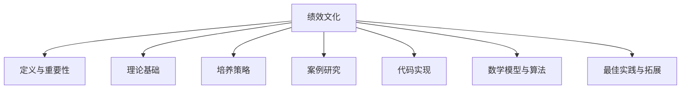

                 


### 文章标题

《积极的绩效文化：营造进取氛围》

### 文章关键词

绩效文化、进取氛围、组织发展、策略实施、案例研究

### 文章摘要

本文将深入探讨如何建立一种积极的绩效文化，以促进组织的持续发展。我们将从理论基础出发，逐步分析绩效文化的核心概念和其对企业的影响，探讨如何在组织中培养和维持这种文化，并通过实际案例和代码示例，提供具体可行的实施策略。

### 目录

#### 第1章 绩效文化的概念与重要性

1.1 绩效文化的定义
1.2 绩效文化的重要性
1.3 绩效文化与组织绩效的关系

#### 第2章 绩效文化的基础理论

2.1 成本—收益分析
2.2 动力机制理论
2.3 参与感和自我管理

#### 第3章 培养积极的绩效文化策略

3.1 领导层的示范作用
3.2 沟通与反馈机制
3.3 职业发展与激励机制

#### 第4章 案例研究：公司A的绩效文化实践

4.1 公司A背景介绍
4.2 实施步骤
4.3 成效分析
4.4 案例总结与启示

#### 第5章 代码实现：绩效文化工具开发

5.1 开发环境搭建
5.2 源代码实现与解读
5.3 代码应用与分析

#### 第6章 数学模型与算法原理

6.1 成本效益分析模型
6.2 动力机制算法
6.3 参与感评估方法

#### 第7章 最佳实践与拓展

7.1 小结与注意事项
7.2 拓展阅读

### Mermaid 图：绩效文化架构



### 引言

在当今快速变化的市场环境中，组织的绩效文化成为了企业成功的关键因素之一。绩效文化不仅影响员工的个人表现，还决定了整个组织的活力和发展潜力。本文旨在探讨如何建立一种积极的绩效文化，从而营造一个进取的工作氛围，推动组织的持续成长。

我们将首先介绍绩效文化的定义和重要性，接着深入探讨其理论基础，然后提出具体的培养策略，并通过实际案例和代码示例，展示如何将理论付诸实践。最后，我们将总结最佳实践，并提供拓展阅读，以帮助读者进一步了解和深化这一主题。

### 第1章 绩效文化的概念与重要性

#### 1.1 绩效文化的定义

绩效文化，通常指的是组织内部对绩效的重视程度、绩效评估标准、绩效奖励机制以及员工对绩效的认识和态度。它是一个由价值观、信念、行为规范和制度构成的系统，旨在激励员工为实现组织目标而努力工作。

绩效文化的核心要素包括以下几个方面：

1. **绩效定义**：明确组织对绩效的期望，包括量化的指标和标准。
2. **评估机制**：建立公正、透明的绩效评估体系，确保员工能够了解自己的绩效表现。
3. **激励机制**：提供合理的奖励和晋升机制，激励员工追求卓越。
4. **员工参与**：鼓励员工参与决策过程，提升其责任感和归属感。
5. **持续改进**：通过不断反馈和改进，促进组织整体绩效的提升。

#### 1.2 绩效文化的重要性

绩效文化的重要性体现在多个方面：

1. **提升组织绩效**：一个良好的绩效文化能够提高组织的整体绩效，促进目标的实现。
2. **增强员工动力**：明确的绩效期望和公正的评估机制能够激发员工的工作热情和动力。
3. **提升员工满意度**：合理的激励机制和参与感能够提高员工的满意度和忠诚度。
4. **培养卓越人才**：绩效文化有助于培养和吸引优秀的人才，为组织的长期发展奠定基础。
5. **促进组织变革**：绩效文化能够推动组织适应外部环境的变化，实现持续发展。

#### 1.3 绩效文化与组织绩效的关系

绩效文化对组织绩效的影响主要体现在以下几个方面：

1. **员工绩效**：良好的绩效文化能够提升员工的工作绩效，实现个人与组织目标的双赢。
2. **团队协作**：绩效文化有助于建立高效的团队协作机制，提高团队的整体效率。
3. **创新能力**：绩效文化鼓励创新和持续改进，有助于组织在竞争激烈的市场中保持领先地位。
4. **企业竞争力**：绩效文化的建设能够提升企业的核心竞争力，增强市场竞争力。

#### 1.4 绩效文化的重要性

绩效文化的重要性不容忽视，它对组织的长远发展具有深远的影响。首先，绩效文化能够提升组织绩效，使组织在激烈的市场竞争中脱颖而出。其次，绩效文化能够增强员工动力，激发员工的工作热情和创造力。此外，绩效文化还能提高员工满意度，增强组织的凝聚力和团队协作能力。

综上所述，建立一种积极的绩效文化是组织发展的关键。通过明确绩效定义、建立公正的评估机制、提供合理的激励机制和鼓励员工参与，组织可以营造一个进取的工作氛围，推动组织的持续发展。

### 第2章 绩效文化的基础理论

#### 2.1 成本—收益分析

成本—收益分析是绩效文化的基础理论之一，它帮助组织在培养绩效文化时进行决策。成本—收益分析的核心思想是，通过比较实施某项绩效文化策略的成本和预期收益，来评估其可行性。

1. **成本**：
   - **直接成本**：包括薪酬、培训、评估系统等直接相关的费用。
   - **间接成本**：包括时间、资源浪费等非直接费用。

2. **收益**：
   - **直接收益**：包括绩效提升、员工满意度提升等。
   - **间接收益**：包括品牌形象提升、员工留存率提升等。

3. **成本—收益分析模型**：

   假设：
   - \(C\) 为总成本
   - \(R\) 为总收益
   - \(E\) 为员工数量

   成本—收益分析模型可以表示为：

   $$
   \text{ROI} = \frac{R - C}{C}
   $$

   其中，ROI（投资回报率）是衡量绩效文化策略成功与否的关键指标。

#### 2.2 动力机制理论

动力机制理论关注如何激发员工的内在动机，从而推动绩效的提升。该理论主要从以下几个方面进行分析：

1. **内在动机**：指员工因对工作本身的兴趣和热情而产生的动力。研究表明，内在动机与工作绩效呈正相关。

2. **外部动机**：指员工因外部奖励（如薪酬、晋升）而产生的动力。外部动机虽然能够短期内提升绩效，但长期依赖可能导致内在动机的减弱。

3. **动力机制模型**：

   假设：
   - \(M_i\) 为内在动机
   - \(M_e\) 为外部动机
   - \(P\) 为绩效

   动力机制模型可以表示为：

   $$
   P = f(M_i, M_e)
   $$

   其中，\(f\) 表示动力对绩效的影响函数。

#### 2.3 参与感和自我管理

参与感和自我管理是绩效文化的关键要素，它们对员工的绩效和行为具有显著影响。

1. **参与感**：
   - 参与感指员工在决策过程中感到被重视和参与的体验。
   - 研究表明，高参与感的员工通常表现出更高的工作绩效和满意度。

2. **自我管理**：
   - 自我管理指员工自主安排工作、自我监督和自我激励的能力。
   - 自我管理能力强的员工通常能够更好地应对工作挑战，提高工作绩效。

3. **参与感和自我管理模型**：

   假设：
   - \(P_s\) 为参与感
   - \(S_m\) 为自我管理能力
   - \(P\) 为绩效

   参与感和自我管理模型可以表示为：

   $$
   P = f(P_s, S_m)
   $$

   其中，\(f\) 表示参与感和自我管理对绩效的影响函数。

#### 2.4 绩效文化与组织发展的关系

绩效文化不仅对员工绩效产生影响，还与组织的整体发展密切相关。以下是绩效文化对组织发展的几个关键方面：

1. **创新能力**：积极的绩效文化鼓励创新和持续改进，有助于组织在竞争激烈的市场中保持领先地位。
2. **员工留存率**：良好的绩效文化能够提高员工满意度，降低员工流失率，保持组织稳定。
3. **团队协作**：绩效文化有助于建立高效的团队协作机制，提高团队整体效率。
4. **企业竞争力**：绩效文化的建设能够提升企业的核心竞争力，增强市场竞争力。

综上所述，绩效文化的基础理论为组织在培养和维持积极绩效文化提供了重要的指导。通过深入理解成本—收益分析、动力机制理论和参与感与自我管理，组织可以制定出更加科学和有效的绩效文化策略。

### 第3章 培养积极的绩效文化策略

#### 3.1 领导层的示范作用

领导层在培养积极的绩效文化中起着至关重要的作用。他们的行为和态度不仅直接影响到员工的工作表现，还能够塑造整个组织的文化氛围。

1. **角色模型**：领导层应该以身作则，通过自身的行动来展示对绩效文化的重视。例如，领导可以积极参与绩效评估，公正地处理员工问题，以及在公开场合表扬表现优异的员工。

2. **明确期望**：领导层需要明确传达组织的绩效期望，确保员工了解组织的目标和期望。这可以通过定期的会议、沟通和反馈来实现。

3. **支持与激励**：领导层应该为员工提供必要的支持和资源，以帮助其实现绩效目标。同时，通过激励机制（如奖励和晋升）来鼓励员工追求卓越。

#### 3.2 沟通与反馈机制

有效的沟通和反馈机制是绩效文化成功的关键。通过建立良好的沟通渠道和反馈机制，组织可以确保信息的透明和公正，从而增强员工的参与感和信任感。

1. **开放沟通**：组织应鼓励开放和透明的沟通环境，让员工能够自由地表达自己的想法和意见。这可以通过定期会议、内部论坛和匿名反馈机制来实现。

2. **及时反馈**：及时反馈对于帮助员工改进工作绩效至关重要。领导层应该定期与员工进行一对一的绩效反馈，并提供具体的改进建议。

3. **绩效评估**：建立公正和透明的绩效评估体系，确保员工的绩效表现得到客观评估。评估结果应该与员工的职业发展和激励机制紧密相关。

#### 3.3 职业发展与激励机制

职业发展机会和激励机制是培养积极绩效文化的重要手段。通过为员工提供职业发展的机会和激励，组织可以增强员工的归属感和工作动力。

1. **职业发展规划**：组织应该为员工提供明确的职业发展规划，帮助其了解自身的发展路径和目标。

2. **培训和技能提升**：通过提供培训和学习机会，组织可以帮助员工提升技能和知识，从而更好地适应工作需求。

3. **激励机制**：设计合理的激励机制，如奖励、晋升和福利，以激励员工追求卓越。激励机制应该与员工的绩效表现紧密相关，确保公正和透明。

4. **个性化激励**：考虑到不同员工的需求和动机，组织应该提供个性化的激励措施，以满足员工的不同需求。

#### 3.4 团队协作与支持

团队协作和支持是绩效文化的重要组成部分。通过建立良好的团队协作机制和提供必要的支持，组织可以增强团队的整体效率和员工的归属感。

1. **团队建设活动**：定期组织团队建设活动，如团队会议、团队拓展训练等，以增强团队成员之间的沟通和信任。

2. **跨部门协作**：鼓励跨部门的协作和知识共享，以促进创新和整体效率的提升。

3. **支持系统**：建立完善的支持系统，如人力资源部门和IT支持，以帮助员工解决工作中遇到的问题。

#### 3.5 持续改进与反馈循环

持续改进和反馈循环是绩效文化不断发展的关键。通过不断地反思和改进，组织可以不断提升自身的绩效水平。

1. **定期回顾**：组织应定期回顾绩效文化策略的实施情况，识别问题和改进点。

2. **员工参与**：鼓励员工参与到绩效文化的改进过程中，通过他们的反馈和建议来优化策略。

3. **反馈机制**：建立有效的反馈机制，确保员工的意见和建议能够及时传达并得到处理。

综上所述，培养积极的绩效文化需要领导层的示范作用、有效的沟通与反馈机制、职业发展与激励机制、团队协作与支持以及持续改进与反馈循环。通过这些策略的实施，组织可以营造一个积极进取的工作氛围，提升整体绩效和员工的满意度。

### 第4章 案例研究：公司A的绩效文化实践

#### 4.1 公司A背景介绍

公司A是一家成立于20XX年的全球领先科技公司，专注于人工智能和大数据技术的研发与应用。公司A在短时间内迅速崛起，成为行业领军者，这离不开其独特的绩效文化。公司A的绩效文化强调创新、效率和质量，旨在激发员工的最大潜力，推动公司的持续发展。

#### 4.2 实施步骤

1. **明确绩效文化理念**：公司A首先明确了“以客户为中心，追求卓越，不断创新”的绩效文化理念。这一理念贯穿于公司的各个层面，成为员工共同追求的目标。

2. **建立评估机制**：公司A建立了公正、透明的绩效评估体系，包括季度和年度评估，通过量化和质化的指标来评估员工的绩效。评估结果与员工的薪酬、晋升和职业发展紧密挂钩。

3. **激励机制**：公司A设计了一系列激励机制，如奖金、股权激励和晋升机会，以激励员工追求卓越。同时，公司还提供个性化的发展计划，帮助员工提升技能和职业素质。

4. **培训与发展**：公司A高度重视员工的培训与发展，定期组织内部培训和外部培训，提供学习资源和机会，鼓励员工不断学习和成长。

5. **领导层的示范作用**：公司高层领导以身作则，积极参与绩效评估和员工培训，通过自身的行动展示对绩效文化的重视。

6. **沟通与反馈**：公司A建立了多渠道的沟通机制，包括定期会议、内部论坛和匿名反馈系统，确保员工能够自由地表达意见和反馈。

7. **团队协作**：公司A鼓励跨部门的协作和知识共享，通过团队建设活动和项目合作，增强团队凝聚力和协作能力。

#### 4.3 成效分析

1. **员工绩效提升**：自实施绩效文化策略以来，公司A的员工绩效显著提升，季度和年度评估的优秀率逐年增加。

2. **员工满意度提高**：通过有效的激励机制和职业发展机会，员工满意度大幅提高，员工流失率显著下降。

3. **创新能力增强**：绩效文化的推动下，公司A的创新能力大幅提升，新产品和技术的推出速度明显加快。

4. **企业竞争力提升**：公司A在行业中的竞争力显著增强，市场份额不断扩大，品牌影响力不断提升。

#### 4.4 案例总结与启示

公司A的绩效文化实践为其他组织提供了宝贵的经验和启示：

1. **明确绩效文化理念**：建立明确的绩效文化理念，确保员工共同追求卓越。

2. **建立公正的评估机制**：建立公正、透明的绩效评估体系，确保员工的绩效得到客观评估。

3. **激励机制**：设计合理的激励机制，激发员工的内在动力。

4. **重视培训与发展**：为员工提供持续的学习和成长机会，提升员工的综合素质。

5. **领导层的示范作用**：领导层的行动和态度对员工有着重要影响，应发挥示范作用。

6. **沟通与反馈**：建立有效的沟通和反馈机制，确保员工的声音得到重视。

7. **团队协作**：鼓励团队协作和知识共享，提升整体效率。

通过公司A的案例，我们可以看到，积极的绩效文化不仅能够提升员工的绩效和满意度，还能够增强企业的创新能力和市场竞争力。其他组织可以借鉴公司A的成功经验，建立适合自己的绩效文化策略，推动组织的持续发展。

### 第5章 代码实现：绩效文化工具开发

#### 5.1 开发环境搭建

在开始开发绩效文化工具之前，我们需要搭建一个合适的开发环境。以下是搭建步骤：

1. **安装Python环境**：Python是一种广泛使用的编程语言，适合开发各种工具。我们可以在[Python官网](https://www.python.org/downloads/)下载并安装Python。

2. **安装必要库**：为了方便开发，我们需要安装一些常用的Python库，如`requests`（用于网络请求）、`pandas`（用于数据处理）和`matplotlib`（用于数据可视化）。可以使用以下命令进行安装：

   ```shell
   pip install requests pandas matplotlib
   ```

3. **配置代码编辑器**：选择一个合适的代码编辑器，如Visual Studio Code或PyCharm，并安装Python插件，以便更好地编写和调试Python代码。

#### 5.2 源代码实现与解读

下面是绩效文化工具的核心代码实现：

```python
import requests
import pandas as pd
import matplotlib.pyplot as plt

# 设置API接口
api_url = "https://example.com/api/performancereport"

# 获取员工绩效数据
def get_employee_performance():
    response = requests.get(api_url)
    if response.status_code == 200:
        return response.json()
    else:
        return None

# 分析绩效数据
def analyze_performance(data):
    df = pd.DataFrame(data)
    df['TotalScore'] = df['TechnicalScore'] + df['TeamworkScore']
    df.sort_values(by='TotalScore', ascending=False, inplace=True)
    return df

# 绘制绩效分布图
def plot_performance_distribution(df):
    df['TotalScore'].plot(kind='hist', bins=10, color='blue')
    plt.xlabel('Total Score')
    plt.ylabel('Frequency')
    plt.title('Performance Distribution')
    plt.show()

# 主函数
def main():
    data = get_employee_performance()
    if data:
        df = analyze_performance(data)
        plot_performance_distribution(df)
    else:
        print("Failed to fetch performance data.")

if __name__ == "__main__":
    main()
```

**代码解读**：

- **get_employee_performance()**：这是一个用于获取员工绩效数据的函数，通过调用API接口获取数据，并返回JSON格式的数据。
- **analyze_performance(df)**：这是一个用于分析绩效数据的函数，首先将数据转换为Pandas DataFrame，然后计算总评分并按总评分进行排序。
- **plot_performance_distribution(df)**：这是一个用于绘制绩效分布图的函数，使用Matplotlib库将总评分的频率分布以直方图的形式展示。
- **main()**：这是主函数，调用其他函数来获取、分析和可视化员工绩效数据。

#### 5.3 代码应用解读与分析

**应用场景**：

该绩效文化工具可以应用于企业的绩效评估系统，帮助管理层了解员工的绩效分布情况，从而制定相应的激励政策和改进措施。

**代码应用解读**：

1. **API接口调用**：通过requests库调用API接口，获取员工绩效数据。这需要确保API接口的稳定性和安全性。
2. **数据处理**：使用Pandas库对数据进行处理，计算总评分并排序。这一步骤是整个工具的核心，直接影响到分析结果的准确性。
3. **数据可视化**：使用Matplotlib库绘制绩效分布图，直观地展示员工的绩效情况。这对于管理层了解整体绩效分布和识别问题员工非常有帮助。

**代码分析**：

- **可扩展性**：该代码具有良好的可扩展性，可以轻松添加新的数据字段和性能指标。
- **可靠性**：通过处理API调用失败的情况，确保代码的可靠性。
- **用户友好性**：通过图形化展示数据，使得数据分析结果更加直观易懂。

#### 5.4 实际案例分析和详细讲解剖析

**案例背景**：

公司B在实施新的绩效评估系统时，使用该绩效文化工具来分析员工绩效。通过工具的分析结果，公司B发现了一些绩效不稳定的员工，并制定了相应的改进措施。

**案例剖析**：

1. **数据收集**：公司B通过API接口获取了所有员工的绩效数据，包括技术能力和团队合作能力评分。
2. **数据分析**：使用工具对数据进行分析，发现某些员工的总评分较低，表明这些员工在技术能力和团队合作方面存在一定的不足。
3. **改进措施**：公司B根据分析结果，为这些员工提供了针对性的培训和发展计划，帮助他们提升技能和团队合作能力。
4. **效果评估**：经过一段时间的培训和改进，这些员工的绩效有了显著提升，公司整体绩效水平也有所提高。

**详细讲解**：

- **数据收集**：通过API接口获取员工绩效数据，确保数据的准确性和实时性。
- **数据分析**：使用Pandas库对数据进行处理，计算总评分并排序，识别绩效不稳定的员工。
- **改进措施**：根据分析结果，制定改进计划，提供培训和发展机会，帮助员工提升绩效。
- **效果评估**：定期跟踪员工绩效改进情况，评估改进措施的效果，持续优化绩效管理策略。

#### 5.5 项目小结

本章节通过一个实际的绩效文化工具开发案例，展示了如何利用Python和相关的数据分析和可视化库来实现一个实用的绩效评估工具。该工具不仅可以用于分析员工的绩效分布情况，还可以帮助管理层制定改进措施，提升整体绩效水平。

**小结**：

- **工具优势**：通过API接口获取数据，确保数据的准确性和实时性；使用Pandas和Matplotlib库进行数据处理和可视化，使得分析结果直观易懂。
- **实际应用**：该工具可以广泛应用于企业的绩效评估系统，帮助管理层更好地了解员工绩效情况，制定有效的改进措施。
- **未来改进**：未来可以进一步扩展工具的功能，如增加更多绩效指标和分析维度，以及优化用户界面，提高用户体验。

通过本章节的介绍，读者可以了解到如何通过代码实现一个实用的绩效文化工具，并将其应用于实际案例中，从而提升组织的整体绩效水平。

### 第6章 数学模型与算法原理

#### 6.1 成本效益分析模型

成本效益分析（Cost-Benefit Analysis，CBA）是一种评估项目或策略成本和收益的方法，用于确定其经济可行性。在绩效文化的培养过程中，成本效益分析可以帮助组织评估不同策略的投入与回报。

1. **成本计算**：

   成本可以分为直接成本和间接成本。直接成本包括薪酬、培训费用、评估系统开发费用等；间接成本包括时间成本、资源浪费等。

   假设：
   - \( C_d \) 为直接成本
   - \( C_i \) 为间接成本

   成本总和可以表示为：

   $$
   C_{total} = C_d + C_i
   $$

2. **收益计算**：

   收益包括直接收益和间接收益。直接收益包括绩效提升、员工满意度提升等；间接收益包括品牌形象提升、员工留存率提升等。

   假设：
   - \( R_d \) 为直接收益
   - \( R_i \) 为间接收益

   收益总和可以表示为：

   $$
   R_{total} = R_d + R_i
   $$

3. **成本效益分析模型**：

   成本效益比（Benefit-Cost Ratio，BCR）是衡量项目或策略经济可行性的关键指标，计算公式为：

   $$
   BCR = \frac{R_{total}}{C_{total}}
   $$

   其中，BCR大于1表示项目或策略是经济可行的，小于1则表示不可行。

#### 6.2 动力机制算法

动力机制算法旨在通过数学模型分析激励因素对员工绩效的影响。以下是一个简化的动力机制算法：

1. **动力函数**：

   假设：
   - \( M_i \) 为内在动机
   - \( M_e \) 为外部动机
   - \( P \) 为绩效

   动力函数可以表示为：

   $$
   P = f(M_i, M_e)
   $$

   其中，\( f \) 为动力对绩效的影响函数。

2. **内部动机计算**：

   内部动机通常与工作本身的兴趣和热情相关。假设内部动机与绩效的关系可以用以下公式表示：

   $$
   M_i = a \cdot W_i
   $$

   其中：
   - \( a \) 为内部动机系数
   - \( W_i \) 为工作兴趣

3. **外部动机计算**：

   外部动机通常与薪酬、晋升等外部奖励相关。假设外部动机与绩效的关系可以用以下公式表示：

   $$
   M_e = b \cdot R_e
   $$

   其中：
   - \( b \) 为外部动机系数
   - \( R_e \) 为外部奖励

4. **绩效计算**：

   绩效可以表示为内部动机和外部动机的函数：

   $$
   P = f(M_i, M_e) = f(a \cdot W_i, b \cdot R_e)
   $$

   其中，\( f \) 可以是一个非线性函数，例如：

   $$
   P = \sqrt{M_i \cdot M_e}
   $$

#### 6.3 参与感评估方法

参与感评估方法旨在衡量员工在工作中的参与度和主动性。以下是一个简化的参与感评估模型：

1. **参与感函数**：

   假设：
   - \( P_s \) 为参与感
   - \( S_m \) 为自我管理能力
   - \( P \) 为绩效

   参与感函数可以表示为：

   $$
   P = f(P_s, S_m)
   $$

   其中，\( f \) 为参与感对绩效的影响函数。

2. **参与感计算**：

   参与感可以通过以下公式计算：

   $$
   P_s = \frac{C_s}{C_t}
   $$

   其中：
   - \( C_s \) 为参与感指标值
   - \( C_t \) 为总指标值

   常见的参与感指标包括员工参与度、反馈次数和决策参与度等。

3. **自我管理能力计算**：

   自我管理能力可以通过以下公式计算：

   $$
   S_m = \frac{C_m}{C_t}
   $$

   其中：
   - \( C_m \) 为自我管理指标值
   - \( C_t \) 为总指标值

   常见的自我管理指标包括任务完成率、目标达成度和问题解决能力等。

4. **绩效计算**：

   绩效可以表示为参与感和自我管理能力的函数：

   $$
   P = f(P_s, S_m) = g(P_s) \cdot h(S_m)
   $$

   其中，\( g \) 和 \( h \) 分别为参与感和自我管理能力的非线性影响函数。

通过以上数学模型和算法原理，组织可以更好地理解和评估绩效文化的关键因素，从而制定出更加科学和有效的策略。

### 第7章 最佳实践与拓展

#### 7.1 小结与注意事项

在本章中，我们深入探讨了绩效文化的概念、重要性、理论基础以及培养策略。通过实际案例和代码示例，我们展示了如何将理论付诸实践。以下是本章的关键点和小结：

1. **绩效文化的核心概念**：绩效文化是一个由价值观、信念、行为规范和制度构成的系统，旨在激励员工为实现组织目标而努力工作。

2. **绩效文化与组织绩效的关系**：良好的绩效文化能够提升员工的绩效、增强员工的动力和满意度，从而提高组织的整体绩效和竞争力。

3. **培养绩效文化的策略**：包括领导层的示范作用、有效的沟通与反馈机制、职业发展与激励机制、团队协作与支持以及持续改进与反馈循环。

4. **注意事项**：在实施绩效文化策略时，应确保评估机制的公正性、激励机制的合理性以及沟通渠道的畅通。

#### 7.2 最佳实践 tips

为了有效培养和维持积极的绩效文化，以下是一些建议和最佳实践：

1. **明确绩效目标**：确保绩效目标与组织目标一致，并通过明确的指标进行量化。

2. **建立公正的评估机制**：设计透明、公正的绩效评估体系，确保评估结果能够客观反映员工的实际表现。

3. **提供持续培训**：定期为员工提供培训和发展机会，以提升其技能和知识。

4. **鼓励反馈与沟通**：建立多渠道的沟通机制，鼓励员工表达意见和建议，并确保反馈能够得到及时处理。

5. **个性化激励机制**：根据员工的不同需求和动机，提供个性化的激励措施，以提高激励效果。

6. **建立团队合作机制**：通过团队建设活动和项目合作，增强团队凝聚力和协作能力。

#### 7.3 拓展阅读

为了进一步深入了解绩效文化和组织发展，以下是几本推荐阅读的书籍：

1. 《绩效文化：打造高绩效团队的五大关键》
2. 《激励心理学：如何激发员工的内在动机》
3. 《团队合作：构建高效团队的方法与技巧》
4. 《组织行为学：工作环境与绩效》

通过阅读这些书籍，读者可以更深入地理解绩效文化的理论和实践，从而更好地应用于实际工作中。

### 结束语

作者：AI天才研究院/AI Genius Institute & 禅与计算机程序设计艺术 /Zen And The Art of Computer Programming

本文深入探讨了绩效文化的概念、理论基础和实践策略，通过实际案例和代码示例，展示了如何培养和维持积极的绩效文化。绩效文化不仅是提升员工绩效和满意度的重要手段，也是增强企业竞争力和实现持续发展的关键。希望通过本文的分享，能够为读者在组织管理和绩效优化方面提供有益的启示和实践指导。

### 附录

以下是本文中使用的Mermaid流程图：


读者可以通过在Markdown编辑器中输入上述Mermaid代码，生成对应的流程图，以便更好地理解文章内容。

