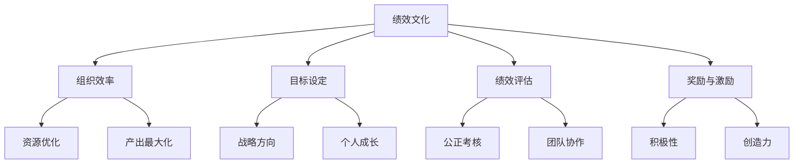
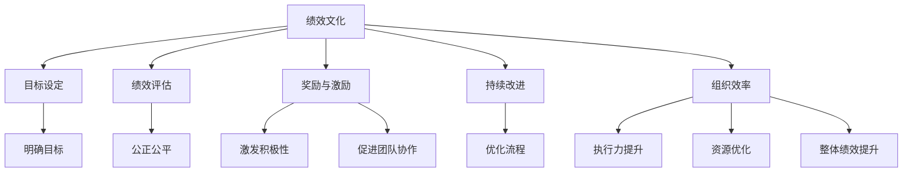

                 

## 引言

### 背景介绍

在现代职场环境中，绩效文化已经成为影响组织成败的关键因素。无论是在企业、政府机构还是教育领域，积极进取的绩效文化都能够极大地提升组织效率、激发员工潜能，并推动组织持续发展。然而，如何构建和维护一个积极进取的绩效文化，仍然是一个值得深入探讨和研究的课题。

本文将以《积极进取的绩效文化：营造高效工作氛围》为题目，通过系统性地分析和推理，探讨绩效文化的核心概念、应用和实践，并探讨其未来发展趋势。文章的核心关键词包括：绩效文化、组织效率、目标设定、绩效评估、奖励与激励、积极进取心态、团队协作、案例分析。

### 核心概念与联系

在探讨绩效文化之前，我们需要明确几个核心概念，并分析它们之间的关系。

1. **绩效文化的定义**：绩效文化是一种价值观和行为规范，它强调以结果为导向，通过设定目标、评估绩效、奖励与激励等手段，激发员工的积极性和创造力。

2. **组织效率**：组织效率是指组织在资源有限的情况下，通过优化资源配置、提高管理水平和员工执行力，实现最大化的产出和绩效。

3. **目标设定**：目标设定是绩效文化的核心要素之一，它关系到组织的战略方向和员工的个人成长。

4. **绩效评估**：绩效评估是对员工工作绩效的客观、公正的考核，是激励员工、提升团队协作的重要手段。

5. **奖励与激励**：奖励与激励是绩效文化的关键组成部分，它通过物质和精神奖励激发员工的积极性和创造力。

这些概念之间存在着密切的联系。绩效文化不仅影响组织效率，还通过目标设定、绩效评估和奖励与激励等手段，促进员工的个人成长和团队协作。以下是一个简化的Mermaid流程图，展示了这些概念之间的关系：



通过这个流程图，我们可以更直观地理解绩效文化的核心概念及其相互关系。

### 下一步分析

在下一部分，我们将深入探讨绩效文化的核心要素，包括目标设定、绩效评估和奖励与激励等。我们将使用伪代码详细阐述这些核心概念，帮助读者深入理解其原理和应用。

### 总结

本文作为对《积极进取的绩效文化：营造高效工作氛围》这一主题的初步探讨，旨在通过逻辑清晰、结构紧凑的分析，为读者提供一个全面、深入的了解。在接下来的内容中，我们将逐步展开对绩效文化的详细讨论，并通过实例和案例分析，进一步阐述其应用和实践。让我们一步步地思考，深入探索这个重要议题。

## 文章摘要

### 文章核心内容和主题思想

本文围绕“积极进取的绩效文化：营造高效工作氛围”这一主题，系统地探讨了绩效文化的定义、核心要素及其在各类组织中的应用。文章首先介绍了绩效文化的概念和内涵，明确了绩效文化在提升组织效率、明确目标、激励员工等方面的作用。接着，文章分析了绩效文化的核心要素，包括目标设定、绩效评估和奖励与激励，并通过Mermaid流程图展示了这些要素之间的相互关系。

### 核心内容摘要

1. **绩效文化的定义**：绩效文化是一种以结果为导向的价值观和行为规范，通过设定目标、评估绩效、奖励与激励等手段，激发员工的积极性和创造力。

2. **组织效率**：绩效文化能够提高组织效率，主要体现在明确目标、提升执行力、激发潜能和优化资源配置等方面。

3. **目标设定**：目标设定是绩效文化的核心要素，需要遵循SMART原则，并采取自上而下或自下而上的方法。

4. **绩效评估**：绩效评估是对员工工作绩效的客观、公正的考核，是激励员工、提升团队协作的重要手段。

5. **奖励与激励**：奖励与激励通过物质和精神奖励，激发员工的积极性和创造力。

6. **绩效文化在各类组织中的应用**：文章详细探讨了绩效文化在企业、政府机构和教育领域的应用，提供了成功案例和实施方法。

7. **积极进取绩效文化的培养策略**：文章提出了培养积极进取心态的策略、激发员工潜能的方法和提升团队协作效率的技巧。

8. **未来发展趋势**：文章分析了新时代绩效文化的特征、发展趋势以及面临的挑战与机遇。

通过以上内容，本文旨在为读者提供一个全面、深入的了解，帮助组织构建和维护积极进取的绩效文化，从而营造高效的工作氛围。

## 第1章 绩效文化的定义与内涵

### 1.1 绩效文化的概念

绩效文化是一种以结果为导向的价值观和行为规范，它强调通过设定目标、评估绩效和奖励与激励等手段，激发员工的积极性和创造力，从而实现组织的高效运作和持续发展。在绩效文化中，绩效不仅仅是工作的结果，更是一种态度和行为的体现。它要求员工具备明确的目标意识、强烈的责任感和持续的学习动力。

### 1.2 绩效文化的内涵

绩效文化的内涵包括以下几个方面：

1. **目标导向**：绩效文化强调以结果为导向，通过设定明确的目标，使员工明确自己的工作方向和任务。

2. **公正公平**：绩效评估需要做到客观公正，确保每位员工的付出和贡献都能得到合理的认可和回报。

3. **激励与约束**：奖励与激励是绩效文化的核心组成部分，它通过物质和精神奖励激发员工的积极性和创造力，同时通过约束机制防止消极行为。

4. **持续改进**：绩效文化鼓励员工持续学习和进步，通过不断优化工作流程和方法，提升个人和组织的绩效。

5. **团队合作**：绩效文化强调团队协作，通过协同努力实现共同目标，提升整体绩效。

### 1.3 绩效文化与组织效率的关系

绩效文化与组织效率之间存在着密切的联系。首先，绩效文化能够明确目标，使员工明确工作方向和任务，从而提升执行力和工作效率。其次，通过公正的绩效评估，可以激发员工的积极性和创造力，提高整体绩效。此外，奖励与激励机制能够激发员工的潜在能力，促进团队协作，进一步优化资源配置，提升组织效率。

以下是绩效文化与组织效率关系的Mermaid流程图：



通过这个流程图，我们可以更直观地理解绩效文化如何通过目标设定、绩效评估、奖励与激励和持续改进，提升组织的整体效率。

### 小结

绩效文化是一种以结果为导向的价值观和行为规范，它通过设定目标、评估绩效、奖励与激励等手段，激发员工的积极性和创造力，从而实现组织的高效运作和持续发展。绩效文化与组织效率之间存在着密切的联系，通过明确目标、公正评估、激励与约束和持续改进，绩效文化能够显著提升组织的整体效率。在接下来的章节中，我们将进一步探讨绩效文化的核心要素，包括目标设定、绩效评估和奖励与激励等，以帮助读者更深入地理解这一重要概念。

## 第2章 绩效文化的核心要素

### 2.1 目标设定

目标设定是绩效文化的核心要素之一，它直接关系到组织的战略方向和员工的个人成长。有效的目标设定能够明确工作方向，激发员工的积极性和责任感，从而提高工作效率和绩效。

#### 目标设定的原则

1. **SMART原则**：SMART原则是一种常用的目标设定方法，它要求目标要具体（Specific）、可衡量（Measurable）、可实现（Achievable）、相关（Relevant）和有时间限制（Time-bound）。例如，一个具体的目标可以是“在下一季度内提高销售量10%”，而一个不具体的目标则是“提高销售量”。

2. **自上而下与自下而上**：目标设定可以采用自上而下的方法，由组织高层领导制定整体目标，并分解到各个部门和员工；也可以采用自下而上的方法，由各部门和员工提出目标建议，经过综合评估后确定。

3. **动态调整**：目标应根据组织环境和内部情况适时调整，以确保目标始终与组织的战略方向保持一致。

#### 目标设定的方法

1. **目标分解**：将整体目标分解为可操作的小目标，并明确每个目标的负责人和完成时间。

2. **沟通与协作**：在目标设定过程中，需要充分沟通，确保各部门和员工对目标有清晰的理解，并协同合作实现目标。

3. **反馈与调整**：在目标实施过程中，定期收集反馈，根据实际情况对目标进行调整，以确保目标的可实现性和适应性。

### 2.2 绩效评估

绩效评估是对员工工作绩效的客观、公正的考核，是激励员工、提升团队协作的重要手段。有效的绩效评估能够激励员工不断提升自我，同时帮助组织发现和培养人才。

#### 绩效评估的原则

1. **公正公平**：绩效评估需要做到客观公正，确保每位员工的付出和贡献都能得到合理的认可和回报。

2. **多维度**：绩效评估应从多个维度进行，包括工作成果、工作态度、团队协作等方面，以全面衡量员工的表现。

3. **持续反馈**：绩效评估不仅仅是一次性的考核，而应通过持续的反馈和沟通，帮助员工了解自己的优势和不足，并进行改进。

#### 绩效评估的方法

1. **关键绩效指标（KPI）**：通过设定关键绩效指标，衡量员工在工作中的关键成果和表现。

2. **360度评估**：邀请员工、同事、上级和下属对员工的工作表现进行评价，以获得全面的反馈。

3. **定期评估**：定期进行绩效评估，确保评估的及时性和有效性。

### 2.3 奖励与激励

奖励与激励是绩效文化的关键组成部分，它通过物质和精神奖励激发员工的积极性和创造力，从而提高工作效率和绩效。

#### 奖励与激励的原则

1. **公平公正**：奖励与激励应做到公平公正，确保每位员工的努力和贡献都能得到相应的回报。

2. **差异化**：根据员工的工作表现和贡献，进行差异化奖励，以激发员工的竞争意识和积极性。

3. **及时性**：奖励与激励应具有及时性，确保员工的努力能够得到及时的认可和回报。

#### 奖励与激励的方法

1. **物质奖励**：包括奖金、股权激励、福利等，直接提升员工的经济收入和生活质量。

2. **精神奖励**：包括表彰、荣誉称号、员工活动等，增强员工的荣誉感和归属感。

3. **职业发展**：提供培训、晋升机会等，帮助员工实现职业成长和自我提升。

### 总结

绩效文化的核心要素包括目标设定、绩效评估和奖励与激励。有效的目标设定能够明确工作方向，激发员工的积极性和责任感；公正公平的绩效评估能够激励员工不断提升自我，提升整体绩效；合理的奖励与激励能够激发员工的积极性和创造力，提高工作效率和绩效。在构建和维护积极进取的绩效文化过程中，这些核心要素发挥着重要作用。

## 第3章 绩效文化的建立与实施

### 3.1 建立绩效文化的步骤

建立绩效文化是一个系统性、持续性的过程，需要遵循一定的步骤和方法。以下是建立绩效文化的关键步骤：

#### 第一步：明确绩效文化的目标

首先，组织需要明确绩效文化的目标，包括提升组织效率、激发员工潜能、优化资源配置等方面。明确的目标有助于统一全员的思想和行动，为后续的工作奠定基础。

#### 第二步：制定绩效文化的政策与规范

制定绩效文化的政策与规范，明确绩效评估的指标、标准和流程。这些政策与规范应具有可操作性和灵活性，以便在实施过程中能够根据实际情况进行调整。

#### 第三步：培训与宣传

对员工进行绩效文化的培训与宣传，帮助他们理解绩效文化的内涵、目标和实施方法。通过内部培训、宣传栏、内部邮件等方式，提高员工的绩效文化意识和认同度。

#### 第四步：推行绩效评估体系

推行绩效评估体系，根据绩效文化的政策与规范，对员工的工作绩效进行客观、公正的评估。绩效评估应涵盖多个维度，包括工作成果、工作态度、团队协作等。

#### 第五步：建立奖励与激励机制

建立合理的奖励与激励机制，根据员工的绩效表现进行差异化奖励。奖励不仅限于物质层面，还应包括精神层面，如表彰、荣誉称号、员工活动等。

### 3.2 绩效文化的实施策略

在建立绩效文化后，如何有效实施和推广是关键。以下是一些具体的实施策略：

#### 1. 管理层的示范作用

管理层的示范作用至关重要。领导层应率先践行绩效文化，通过自己的行为树立榜样，带动全体员工积极参与。

#### 2. 沟通与反馈

建立有效的沟通渠道，确保绩效文化的实施过程透明、公开。通过定期的反馈会议、绩效面谈等方式，与员工进行深入沟通，了解他们的需求和意见，并及时调整绩效文化的实施策略。

#### 3. 持续改进

绩效文化不是一成不变的，而是需要不断改进和优化的。组织应根据实际情况，定期评估绩效文化的实施效果，发现问题和不足，并及时进行调整。

#### 4. 个性化定制

针对不同部门和岗位的特点，制定个性化的绩效文化方案。例如，对于技术部门，可以侧重于技术能力和项目成果的评估；对于市场部门，可以侧重于市场拓展和客户满意度等。

### 3.3 面对挑战与问题

在实施绩效文化过程中，可能会面临以下挑战和问题：

#### 1. 员工抵触情绪

部分员工可能对绩效文化的实施持有抵触情绪，担心自己的绩效被过分关注。对此，组织可以通过有效的沟通和宣传，让员工了解绩效文化的优点和好处，逐步消除抵触情绪。

#### 2. 奖励与激励失衡

奖励与激励机制可能存在失衡现象，导致部分员工感到不公平。对此，组织应建立公正的评估体系，确保奖励与激励的公平性和合理性。

#### 3. 绩效评估的难度

绩效评估具有一定的主观性，难以做到完全客观和公正。对此，组织可以采用多种评估方法，如360度评估、关键绩效指标等，以提升评估的准确性和公正性。

#### 4. 持续改进的压力

持续改进需要组织付出大量的时间和精力，可能会给员工带来一定的压力。对此，组织可以通过提供培训、辅导等方式，帮助员工适应和应对改进的压力。

### 总结

建立和实施绩效文化是一个复杂而系统的过程，需要组织明确目标、制定政策与规范、培训与宣传、推行绩效评估体系、建立奖励与激励机制等。在实施过程中，组织应面对挑战和问题，采取有效的策略和方法，确保绩效文化的顺利推进和长期有效。通过持续的努力和改进，绩效文化将成为组织高效运作和持续发展的强大动力。

## 第4章 绩效文化在企业中的应用

### 4.1 企业绩效文化的特点

企业绩效文化是企业价值观的具体体现，是推动企业发展和提升竞争力的关键因素。企业绩效文化的特点主要体现在以下几个方面：

#### 1. 以结果为导向

企业绩效文化强调以结果为导向，注重员工的工作产出和实际成果。通过设定明确的绩效目标，激励员工努力实现业绩增长和业务拓展。

#### 2. 量化评估

企业绩效文化的评估体系通常采用量化的方式，通过关键绩效指标（KPI）等工具，对员工的工作绩效进行客观、公正的评估。量化评估有助于提高评估的透明度和公正性，增强员工的公平感。

#### 3. 强调团队合作

企业绩效文化重视团队合作，鼓励员工相互支持、协同合作，共同实现企业目标。团队合作能够提高工作效率，促进企业整体竞争力的提升。

#### 4. 竞争激励机制

企业绩效文化通过建立竞争激励机制，激发员工的积极性和创造力。通过绩效奖金、晋升机会等激励手段，鼓励员工不断提升自我，为企业创造更大价值。

### 4.2 企业绩效文化的实施方法

为了有效地构建和维护企业绩效文化，企业可以采取以下实施方法：

#### 1. 明确企业愿景和使命

企业首先需要明确自身的愿景和使命，将绩效文化与企业目标紧密结合起来。通过内部培训和宣传，使全体员工理解并认同企业的愿景和使命，为绩效文化的实施奠定基础。

#### 2. 制定绩效评估体系

制定科学的绩效评估体系，包括关键绩效指标（KPI）、评估标准和流程等。绩效评估体系应具有可操作性和灵活性，以便适应不同部门和岗位的需求。

#### 3. 实施绩效管理

实施绩效管理，通过定期评估、绩效反馈和辅导等方式，监督和指导员工的工作。绩效管理应贯穿于整个工作流程，确保员工在实现个人目标的同时，助力企业目标的实现。

#### 4. 建立激励与约束机制

建立有效的激励与约束机制，通过物质和精神奖励激发员工的积极性和创造力。同时，通过明确的规章制度和考核标准，约束员工的行为，防止消极现象的发生。

### 4.3 企业绩效文化的成功案例

以下是一个企业绩效文化的成功案例：

#### 案例背景

某高科技企业致力于创新和研发，为了提升员工的积极性和创造力，构建了以结果为导向的绩效文化。

#### 案例实施

1. **明确企业愿景和使命**：企业明确了“成为行业领导者”的愿景和“创新、协作、共赢”的使命，将绩效文化与企业目标紧密结合。

2. **制定绩效评估体系**：企业制定了包括关键绩效指标（KPI）、360度评估等在内的绩效评估体系，确保评估的公正性和透明度。

3. **实施绩效管理**：企业通过定期评估、绩效反馈和辅导等方式，监督和指导员工的工作。同时，鼓励员工提出改进建议，促进企业持续改进。

4. **建立激励与约束机制**：企业设立了绩效奖金、股权激励等竞争激励机制，鼓励员工提升绩效。同时，通过明确的规章制度，约束员工的行为，维护企业秩序。

#### 案例效果

通过构建绩效文化，企业实现了以下效果：

1. **员工积极性提高**：员工对绩效文化的认同度提高，工作积极性显著提升。

2. **团队协作增强**：员工之间的团队合作意识增强，共同为实现企业目标努力。

3. **企业绩效提升**：企业的业绩和市场份额显著提升，成为行业领导者。

### 总结

企业绩效文化是企业成功的关键因素之一。通过明确企业愿景和使命、制定科学的绩效评估体系、实施绩效管理和建立激励与约束机制，企业可以构建和维护一个积极进取的绩效文化，从而提升员工积极性、增强团队协作、推动企业持续发展。

## 第5章 绩效文化在政府机构中的应用

### 5.1 政府机构绩效文化的特点

政府机构绩效文化具有以下几个显著特点：

#### 1. 公共服务导向

政府机构的绩效文化强调以公共服务为导向，注重满足社会公众的需求，提高行政效能和服务质量。政府机构的工作直接关系到公共利益，因此其绩效文化更注重社会效益和公众满意度。

#### 2. 公开透明

政府机构绩效文化要求公开透明，通过信息公开、透明决策和公正执法等方式，增强政府公信力和透明度，赢得公众信任。

#### 3. 责任导向

政府机构绩效文化强调责任导向，要求各级公务员明确职责，认真履行工作职责，确保行政任务的高效完成。责任导向有助于提升公务员的责任感和使命感，提高政府机构的执行力和公信力。

#### 4. 绩效评估的复杂性

政府机构绩效评估涉及多个领域和层面，评估标准复杂多样。政府机构的工作不仅包括行政管理，还涉及立法、执法、公共服务等多个方面，因此绩效评估需要综合考虑多种因素。

### 5.2 政府机构绩效文化的实施方法

为了有效构建和实施绩效文化，政府机构可以采取以下方法：

#### 1. 制定明确的绩效目标和指标

政府机构需要制定明确的绩效目标和指标，这些目标和指标应与政府部门的职责和公共服务目标相一致。绩效目标应具体、可衡量，以便进行有效评估。

#### 2. 建立公开透明的绩效评估体系

政府机构应建立公开透明的绩效评估体系，通过设立评估委员会、定期评估等方式，确保绩效评估的公正性和透明度。评估结果应向公众公开，接受社会监督。

#### 3. 强化责任意识和责任追究

政府机构应强化责任意识，明确各级公务员的职责范围和工作要求。对于未履行职责或工作失职的公务员，应进行责任追究，确保政府机构的高效运作。

#### 4. 提供培训和激励机制

政府机构应提供绩效管理的培训和指导，帮助公务员掌握绩效管理的方法和技能。同时，建立激励机制，对表现优异的公务员给予奖励和表彰，激发公务员的工作积极性和创造力。

### 5.3 政府机构绩效文化的成功案例

以下是一个政府机构绩效文化的成功案例：

#### 案例背景

某市政府为了提升行政效能和服务质量，决定构建以公共服务为导向的绩效文化。

#### 案例实施

1. **明确绩效目标和指标**：市政府制定了包括公共服务质量、行政效率、公众满意度等在内的绩效目标和指标，确保绩效评估的具体和可衡量。

2. **建立公开透明的绩效评估体系**：市政府设立了绩效评估委员会，定期对各部门的绩效进行评估，评估结果公开透明，接受社会监督。

3. **强化责任意识和责任追究**：市政府明确了各级公务员的职责范围和工作要求，对于未履行职责或工作失职的公务员，进行了责任追究和整改。

4. **提供培训和激励机制**：市政府为公务员提供了绩效管理的培训，同时建立了激励机制，对表现优异的公务员进行了表彰和奖励。

#### 案例效果

通过构建绩效文化，该市政府实现了以下效果：

1. **行政效能提升**：行政效率显著提高，办事流程简化，公共服务质量得到提升。

2. **公众满意度提高**：公众对政府服务的满意度显著提升，社会信任度增强。

3. **公务员积极性提高**：公务员的责任意识和工作积极性明显增强，政府机构的整体绩效得到提升。

### 总结

政府机构绩效文化的建立和实施对于提升政府服务质量、增强行政效能具有重要意义。通过制定明确的绩效目标和指标、建立公开透明的绩效评估体系、强化责任意识和提供激励机制，政府机构可以构建和维护一个积极进取的绩效文化，从而更好地服务社会公众，推动政府治理能力的现代化。

## 第6章 绩效文化在教育领域的应用

### 6.1 教育领域绩效文化的特点

在教育领域，绩效文化具有以下显著特点：

#### 1. 以学生为中心

教育领域绩效文化强调以学生为中心，注重培养学生的综合能力和素质。绩效评估不仅关注学生的学业成绩，还包括学生的人际交往、创新思维、团队协作等方面。

#### 2. 教师专业化发展

教育绩效文化鼓励教师专业化发展，通过绩效评估和激励机制，推动教师不断提升教学水平和专业能力。教师的专业成长是提高教育质量的关键因素。

#### 3. 过程导向

教育绩效文化强调过程导向，注重学生的学习过程和学习体验。通过过程评估，教师可以及时了解学生的学习状况，调整教学策略，提高教学效果。

#### 4. 家校合作

教育绩效文化倡导家校合作，通过家长会、家长委员会等形式，增强家长对学校教育的参与度，共同关注学生的成长和发展。

### 6.2 教育领域绩效文化的实施方法

为了有效构建和实施教育领域绩效文化，学校和教育机构可以采取以下方法：

#### 1. 制定明确的绩效目标和指标

学校应制定明确的绩效目标和指标，包括教学质量、学生发展、教师专业成长等方面。这些目标和指标应具体、可衡量，以便进行有效评估。

#### 2. 建立多元化的绩效评估体系

教育绩效评估应多元化，不仅包括学生的学业成绩，还应包括学生的学习过程、教师的教学方法和效果等方面。评估体系应涵盖多个维度，确保全面衡量教育质量和效果。

#### 3. 强化教师专业发展

学校应提供丰富的专业发展机会，如教学培训、学术交流、教研活动等，帮助教师提升教学水平和专业能力。通过绩效评估，鼓励教师不断追求专业成长。

#### 4. 营造积极的学习氛围

学校应营造积极的学习氛围，鼓励学生积极参与课堂活动，培养自主学习能力和创新思维。通过激励和奖励机制，激发学生的学习热情和积极性。

#### 5. 家校合作

学校应积极与家长合作，通过家长会、家长委员会等形式，增强家长对学校教育的参与度。家校合作有助于形成共同育人的良好氛围，促进学生的全面发展。

### 6.3 教育领域绩效文化的成功案例

以下是一个教育领域绩效文化的成功案例：

#### 案例背景

某知名中学为了提高教育质量，决定构建以学生为中心的绩效文化。

#### 案例实施

1. **制定明确的绩效目标和指标**：学校制定了包括教学质量、学生发展、教师专业成长等在内的绩效目标和指标，确保评估的具体和可衡量。

2. **建立多元化的绩效评估体系**：学校不仅评估学生的学业成绩，还评估学生的学习过程、教师的教学方法和效果等方面，确保全面衡量教育质量。

3. **强化教师专业发展**：学校为教师提供了丰富的专业发展机会，如教学培训、学术交流、教研活动等，鼓励教师不断提升专业能力。

4. **营造积极的学习氛围**：学校通过开展丰富多彩的课外活动，鼓励学生积极参与，培养自主学习能力和创新思维。

5. **家校合作**：学校积极与家长合作，通过家长会、家长委员会等形式，增强家长对学校教育的参与度。

#### 案例效果

通过构建绩效文化，该中学实现了以下效果：

1. **教学质量提升**：教师的教学水平和专业能力得到显著提升，学生的学习效果和综合素质得到提高。

2. **学生发展全面**：学生在学业成绩、人际交往、创新思维等方面表现出色，全面发展得到有效促进。

3. **家校合作增强**：家长对学校教育的参与度提高，家校合作形成良好的互动氛围，共同关注学生的成长和发展。

### 总结

教育领域绩效文化的建立和实施对于提高教育质量和促进学生的全面发展具有重要意义。通过制定明确的绩效目标和指标、建立多元化的绩效评估体系、强化教师专业发展、营造积极的学习氛围和家校合作，学校可以构建和维护一个积极进取的绩效文化，从而提升教育质量，促进学生全面发展。

## 第7章 积极进取绩效文化的培养策略

### 7.1 培养积极进取心态的策略

培养积极进取心态是构建积极进取绩效文化的关键。以下是一些有效的策略：

#### 1. 增强自我认知

首先，员工需要增强自我认知，了解自己的优势、劣势和职业兴趣。通过自我反思和职业规划，员工可以明确自己的发展方向，增强自信心和动力。

伪代码示例：
```python
def self_awareness():
    # 收集个人信息
    personal_info = collect_personal_info()
    # 分析优势和劣势
    strengths, weaknesses = analyze_personality(personal_info)
    # 制定职业规划
    career_plan = create_career_plan(strengths, weaknesses)
    return career_plan
```

#### 2. 设定明确目标

设定明确的目标是培养积极进取心态的重要步骤。通过设定具体的、可衡量的目标，员工可以清晰地了解自己的工作方向和任务，并努力实现这些目标。

伪代码示例：
```python
def set_specific_goals():
    goals = []
    for department in departments:
        department_goals = create_department_goals(department)
        goals.extend(department_goals)
    return goals
```

#### 3. 激发内在动机

激发内在动机是培养积极进取心态的关键。通过赋予员工更多的自主权和责任感，可以激发他们的内在动机，提高工作积极性和创造力。

伪代码示例：
```python
def motivate_intrinsic_motivation():
    for employee in employees:
        if meets_requirements(employee):
            grant_autonomy(employee)
            increase_responsibility(employee)
```

### 7.2 激发员工潜能的方法

激发员工潜能是提升绩效文化的重要手段。以下是一些有效的方法：

#### 1. 提供培训和发展机会

提供培训和发展机会是激发员工潜能的重要手段。通过培训，员工可以不断提升自己的技能和知识，适应不断变化的工作环境。

伪代码示例：
```python
def provide_training_opportunities():
    for employee in employees:
        training_programs = find_appropriate_trainings(employee)
        assign_trainings(employee, training_programs)
```

#### 2. 设定挑战性任务

设定挑战性任务是激发员工潜能的有效方法。通过设定具有挑战性的任务，可以激发员工的学习热情和创造力，提高工作绩效。

伪代码示例：
```python
def assign_challenging_tasks():
    for employee in employees:
        tasks = generate_challenging_tasks(employee)
        assign_tasks(employee, tasks)
```

#### 3. 建立反馈机制

建立反馈机制是激发员工潜能的重要环节。通过及时、具体的反馈，员工可以了解自己的工作表现，发现不足之处，并加以改进。

伪代码示例：
```python
def implement_feedback_mechanism():
    for employee in employees:
        performance_reviews = conduct_performance_reviews(employee)
        provide_feedback(employee, performance_reviews)
```

### 7.3 提升团队协作效率的技巧

提升团队协作效率是构建积极进取绩效文化的重要组成部分。以下是一些提升团队协作效率的技巧：

#### 1. 明确团队目标

明确团队目标是提升团队协作效率的基础。通过设定共同的目标，团队成员可以齐心协力，共同为实现目标而努力。

伪代码示例：
```python
def set_team_goals():
    team_goals = create_team_goals()
    communicate_goals_to_team(team_goals)
```

#### 2. 强化沟通与协作

强化沟通与协作是提升团队协作效率的关键。通过建立有效的沟通机制，团队成员可以及时分享信息、协调工作，提高工作效率。

伪代码示例：
```python
def enhance_communication():
    communication_channels = establish_communication_channels()
    promote_active_participation_in_meetings()
```

#### 3. 培养团队精神

培养团队精神是提升团队协作效率的重要手段。通过团队建设活动、团队文化塑造等方式，可以增强团队成员之间的凝聚力，提高团队协作效率。

伪代码示例：
```python
def cultivate_team_spirit():
    team_building_activities = organize_team_building_activities()
    implement_team_culture()
```

### 总结

培养积极进取心态、激发员工潜能和提升团队协作效率是构建积极进取绩效文化的关键策略。通过增强自我认知、设定明确目标、激发内在动机、提供培训和发展机会、设定挑战性任务、建立反馈机制、明确团队目标、强化沟通与协作和培养团队精神，组织可以构建一个积极进取的绩效文化，从而提高组织效率和竞争力。

## 第8章 绩效文化实践案例解析

### 8.1 案例一：某高科技企业的绩效文化实践

#### 案例背景

某高科技企业（以下简称“企业”）成立于2000年，主要从事软件研发和销售。随着市场竞争的加剧，企业意识到构建积极进取的绩效文化对于提升组织效率和员工士气至关重要。因此，企业决定在2010年启动绩效文化改革。

#### 案例实施

1. **明确绩效目标**：企业首先明确了“成为行业领导者”的愿景和“创新、协作、共赢”的使命，并将绩效目标与这些目标紧密结合起来。

2. **制定绩效评估体系**：企业制定了包括关键绩效指标（KPI）、360度评估等在内的绩效评估体系，确保评估的公正性和透明度。

3. **实施绩效管理**：企业通过定期评估、绩效反馈和辅导等方式，监督和指导员工的工作。同时，鼓励员工提出改进建议，促进企业持续改进。

4. **建立激励与约束机制**：企业设立了绩效奖金、股权激励等竞争激励机制，鼓励员工提升绩效。同时，通过明确的规章制度，约束员工的行为，维护企业秩序。

#### 案例效果

通过构建绩效文化，企业实现了以下效果：

1. **员工积极性提高**：员工对绩效文化的认同度提高，工作积极性显著提升。

2. **团队协作增强**：员工之间的团队合作意识增强，共同为实现企业目标努力。

3. **企业绩效提升**：企业的业绩和市场份额显著提升，成为行业领导者。

### 8.2 案例二：某政府部门绩效文化的成功实践

#### 案例背景

某市政府（以下简称“政府”）为了提升行政效能和服务质量，决定在2015年构建以公共服务为导向的绩效文化。

#### 案例实施

1. **明确绩效目标和指标**：政府制定了包括公共服务质量、行政效率、公众满意度等在内的绩效目标和指标，确保绩效评估的具体和可衡量。

2. **建立公开透明的绩效评估体系**：政府设立了绩效评估委员会，定期对各部门的绩效进行评估，评估结果公开透明，接受社会监督。

3. **强化责任意识和责任追究**：政府明确了各级公务员的职责范围和工作要求，对于未履行职责或工作失职的公务员，进行了责任追究和整改。

4. **提供培训和激励机制**：政府为公务员提供了绩效管理的培训，同时建立了激励机制，对表现优异的公务员进行了表彰和奖励。

#### 案例效果

通过构建绩效文化，政府实现了以下效果：

1. **行政效能提升**：行政效率显著提高，办事流程简化，公共服务质量得到提升。

2. **公众满意度提高**：公众对政府服务的满意度显著提升，社会信任度增强。

3. **公务员积极性提高**：公务员的责任意识和工作积极性明显增强，政府机构的整体绩效得到提升。

### 8.3 案例三：某教育机构绩效文化的改革与创新

#### 案例背景

某知名中学（以下简称“学校”）为了提高教育质量，决定在2018年构建以学生为中心的绩效文化。

#### 案例实施

1. **制定明确的绩效目标和指标**：学校制定了包括教学质量、学生发展、教师专业成长等在内的绩效目标和指标，确保评估的具体和可衡量。

2. **建立多元化的绩效评估体系**：学校不仅评估学生的学业成绩，还评估学生的学习过程、教师的教学方法和效果等方面，确保全面衡量教育质量。

3. **强化教师专业发展**：学校为教师提供了丰富的专业发展机会，如教学培训、学术交流、教研活动等，鼓励教师不断提升专业能力。

4. **营造积极的学习氛围**：学校通过开展丰富多彩的课外活动，鼓励学生积极参与，培养自主学习能力和创新思维。

5. **家校合作**：学校积极与家长合作，通过家长会、家长委员会等形式，增强家长对学校教育的参与度。

#### 案例效果

通过构建绩效文化，学校实现了以下效果：

1. **教学质量提升**：教师的教学水平和专业能力得到显著提升，学生的学习效果和综合素质得到提高。

2. **学生发展全面**：学生在学业成绩、人际交往、创新思维等方面表现出色，全面发展得到有效促进。

3. **家校合作增强**：家长对学校教育的参与度提高，家校合作形成良好的互动氛围，共同关注学生的成长和发展。

### 总结

通过以上三个案例，我们可以看到绩效文化在不同领域的成功实践。无论是高科技企业、政府部门还是教育机构，绩效文化的建立和实施都取得了显著的成效。这些案例表明，绩效文化不仅能够提升组织效率和员工积极性，还能够促进组织持续发展和社会信任。在未来的发展中，各组织应继续深化绩效文化的建设，不断创新和实践，以应对不断变化的外部环境和挑战。

## 第9章 绩效文化实践的未来发展趋势

### 9.1 新时代绩效文化的特征

随着科技和社会的快速发展，新时代绩效文化展现出以下特征：

1. **数字化与智能化**：数字化和智能化技术成为绩效文化的重要工具，通过大数据分析、人工智能等手段，实现更精准的绩效评估和激励。

2. **个性化**：绩效文化更加注重个性化，针对不同员工的特长和需求，制定个性化的绩效目标和激励方案。

3. **开放性**：绩效文化更加开放，鼓励员工参与决策和反馈，提高组织的透明度和灵活性。

4. **全球化**：全球化趋势使得绩效文化需要具备国际视野，能够适应不同文化和市场环境。

### 9.2 绩效文化的发展趋势

1. **综合评估体系**：绩效评估将更加注重综合性和多维性，不仅关注工作成果，还关注工作过程、团队合作和创新能力。

2. **持续反馈与改进**：绩效文化将更加重视持续的反馈和改进，通过定期评估、实时反馈和持续改进，提高绩效管理的效率和效果。

3. **员工参与度**：员工参与度将成为绩效文化的重要组成部分，组织将鼓励员工参与绩效目标的设定、评估和改进，提高员工的归属感和参与感。

4. **价值观与文化的融合**：绩效文化将更加注重价值观和文化的融合，将组织价值观融入绩效评估和激励机制，推动组织文化的建设和发展。

### 9.3 绩效文化实践的未来挑战与机遇

1. **挑战**

- **技术更新换代**：随着新技术的不断涌现，组织需要不断更新和升级绩效管理工具，以适应技术变革。

- **员工期望变化**：随着员工对工作环境、职业发展和工作生活平衡的期望不断提高，组织需要调整绩效文化，满足员工的多元化需求。

- **全球化竞争**：全球化竞争使得组织需要具备更高的灵活性和适应性，以应对不同市场和文化的挑战。

2. **机遇**

- **数字化与智能化**：数字化和智能化技术为绩效文化提供了新的工具和方法，可以提高绩效评估的精准性和效率。

- **员工参与度提升**：通过提高员工参与度，可以激发员工的积极性和创造力，提高组织绩效。

- **全球化视野**：全球化为组织提供了更广阔的市场和人才资源，通过国际化视野，可以更好地推动绩效文化的发展。

### 总结

新时代绩效文化呈现出数字化、智能化、个性化、开放性和全球化的特征，发展态势呈现出综合评估体系、持续反馈与改进、员工参与度提升和价值观与文化的融合等趋势。未来，绩效文化实践将面临技术更新换代、员工期望变化和全球化竞争等挑战，同时也拥有数字化与智能化、员工参与度提升和全球化视野等机遇。组织需要积极应对这些挑战，抓住机遇，推动绩效文化的持续发展。

## 附录一：绩效文化相关文献与资源

为了帮助读者进一步了解绩效文化的相关理论和实践，以下是一些推荐的文献和资源：

### 文献推荐

1. **《绩效管理》**：作者：罗伯特·卡茨（Robert L. Katz）
   - 内容简介：本书系统地介绍了绩效管理的理论和方法，适用于企业管理者。
   - 获取方式：可在各大图书网站和图书馆查阅。

2. **《绩效文化》**：作者：艾伦·威尔金森（Alan Wilkinson）
   - 内容简介：本书深入探讨了绩效文化的概念、建立和实施方法，提供了丰富的案例。
   - 获取方式：可在各大图书网站和图书馆查阅。

### 网络资源

1. **国际绩效管理协会（IPMA）**：[网站链接](https://www.ipma.org/)
   - 提供绩效管理相关的研究、培训和资源。

2. **哈佛商业评论**：[网站链接](https://hbr.org/)
   - 发布关于绩效管理的最新研究和案例分析。

3. **LinkedIn Learning**：[网站链接](https://www.linkedin.com/learning/)
   - 提供绩效管理相关的在线课程和教程。

### 小结

以上文献和资源为读者提供了丰富的绩效文化理论和实践知识。通过阅读这些文献和访问相关网站，读者可以深入了解绩效文化的核心概念、建立和实施方法，以及最新的研究成果和案例分析。这些资源将有助于读者在绩效文化实践过程中取得更好的效果。

## 附录二：绩效文化实践工具与方法

为了有效地构建和实施绩效文化，组织可以借助多种工具和方法。以下是一些常见的工具和方法：

### 1. 绩效管理软件

绩效管理软件可以帮助组织自动化绩效评估、目标设定和反馈过程。常见的绩效管理软件包括：

- **KPI仪表板**：用于监控关键绩效指标（KPI），提供实时的绩效数据。
- **360度评估工具**：用于收集员工、同事、上级和下属的评价，提供全面的绩效反馈。
- **目标管理工具**：用于设定、跟踪和评估个人和团队的目标。

### 2. 调查问卷

调查问卷是一种简便有效的工具，可以用于收集员工对绩效文化的看法和建议。以下是一些设计调查问卷的要点：

- **明确目的**：确保调查问卷的设计围绕绩效文化的核心问题。
- **简明扼要**：问卷问题应简明扼要，避免过长和复杂。
- **结构化**：使用选择题、评分题和开放式问题，以获取不同类型的数据。
- **隐私保护**：确保问卷的隐私保护，避免员工因担心隐私问题而不愿意参与。

### 3. 反馈会议

反馈会议是一种有效的沟通工具，用于员工和管理层之间的绩效沟通。以下是一些反馈会议的要点：

- **定期举行**：确保反馈会议的定期举行，以保持绩效沟通的持续性。
- **双向沟通**：鼓励员工和管理层之间进行双向沟通，听取双方的意见和建议。
- **具体反馈**：提供具体、具体的反馈，避免模糊和不具体的评价。
- **行动计划**：在会议结束时，制定明确的行动计划，以解决反馈中提到的问题。

### 4. 演练和模拟

通过演练和模拟，员工可以在安全的环境中进行实践和改进。以下是一些演练和模拟的要点：

- **真实场景**：设计接近实际工作场景的演练和模拟，以提高员工的应对能力。
- **角色扮演**：通过角色扮演，员工可以体验不同角色的工作，提高跨职能协作能力。
- **反馈与改进**：在演练和模拟后，提供具体的反馈和改进建议，帮助员工提升绩效。

### 5. 软技能培训

软技能培训可以帮助员工提升沟通、团队合作和领导力等关键能力。以下是一些软技能培训的要点：

- **针对性**：根据员工的具体需求和职业发展阶段，设计针对性的培训课程。
- **互动性**：使用互动性强的培训方法，如小组讨论、角色扮演和案例研究，提高培训效果。
- **持续跟进**：培训后，提供持续的跟进和支持，帮助员工将所学知识应用到实际工作中。

### 小结

通过使用绩效管理软件、调查问卷、反馈会议、演练和模拟以及软技能培训等工具和方法，组织可以构建和实施有效的绩效文化。这些工具和方法有助于提高绩效评估的准确性、增强员工参与度和提升组织整体绩效。

## 附录三：常见问题解答

### 1. 绩效文化的定义是什么？

绩效文化是一种价值观和行为规范，强调以结果为导向，通过设定目标、评估绩效、奖励与激励等手段，激发员工的积极性和创造力，从而实现组织的高效运作和持续发展。

### 2. 绩效文化对企业有哪些作用？

绩效文化能够提高企业效率，主要体现在明确目标、提升执行力、激发潜能和优化资源配置等方面。此外，绩效文化还能增强员工的责任感和归属感，提高员工的工作满意度和忠诚度。

### 3. 如何建立绩效文化？

建立绩效文化需要明确绩效文化的目标，制定绩效政策与规范，进行员工培训与宣传，推行绩效评估体系，建立奖励与激励机制等步骤。

### 4. 绩效评估应该遵循哪些原则？

绩效评估应遵循SMART原则（具体、可衡量、可实现、相关、有时间限制），公正公平原则，多维度原则，以及持续反馈原则。

### 5. 奖励与激励有哪些方法？

奖励与激励包括物质奖励（如奖金、股权激励等）和精神奖励（如表彰、荣誉称号、员工活动等）。此外，职业发展机会也是重要的激励手段。

### 6. 如何培养员工的积极进取心态？

可以通过增强自我认知、设定明确目标、激发内在动机、提供培训和发展机会、设定挑战性任务、建立反馈机制等策略来培养员工的积极进取心态。

### 7. 绩效文化在政府机构中的应用特点是什么？

政府机构绩效文化强调公共服务导向、公开透明、责任导向和绩效评估的复杂性。绩效评估应涵盖行政效率、公共服务质量、公众满意度等方面。

### 8. 教育领域绩效文化如何实施？

教育领域绩效文化应注重以学生为中心，通过制定明确的绩效目标和指标、建立多元化的绩效评估体系、强化教师专业发展、营造积极的学习氛围和家校合作等方式实施。

### 总结

通过解答以上常见问题，我们希望能为读者提供关于绩效文化的全面理解。在构建和实施绩效文化的过程中，组织应根据自身特点和需求，灵活运用各种策略和工具，以实现高效运作和持续发展。

## 小结

本文围绕“积极进取的绩效文化：营造高效工作氛围”这一主题，系统地探讨了绩效文化的定义、核心要素、在各类组织中的应用、实践案例以及未来发展趋势。通过详细分析目标设定、绩效评估、奖励与激励等核心概念，我们明确了绩效文化在提升组织效率、激发员工潜能和推动组织发展中的重要作用。

在构建绩效文化的过程中，组织需要明确目标、制定政策与规范、培训与宣传、推行绩效评估体系和建立奖励与激励机制。同时，不同类型的组织（如企业、政府机构和教育领域）应根据自身特点，采取适当的绩效文化实施方法。

未来，绩效文化将朝着数字化、智能化、个性化、开放性和全球化的方向发展，面临技术更新换代、员工期望变化和全球化竞争等挑战，同时也拥有数字化与智能化、员工参与度提升和全球化视野等机遇。

我们呼吁组织在绩效文化实践中，不断探索和创新，以应对外部环境的变化，推动组织持续发展和员工个人成长。通过积极进取的绩效文化，我们可以营造一个高效、和谐、有活力的工作氛围，实现组织与员工的共同发展。

## 最佳实践 Tips

1. **明确目标与期望**：在构建绩效文化时，明确组织的目标和员工的期望是关键。通过沟通和共识，确保全员对绩效文化的目标和期望有清晰的认识。

2. **量化和可衡量**：绩效目标应具体、可衡量，以便于评估和追踪。使用关键绩效指标（KPI）等工具，确保绩效评估的客观性和准确性。

3. **持续反馈与沟通**：建立持续的反馈机制，通过定期评估、绩效反馈和辅导等方式，与员工保持密切沟通，及时解决问题，提高绩效。

4. **个性化激励**：根据员工的个性、需求和职业发展，设计个性化的奖励和激励方案，激发员工的内在动机和创造力。

5. **透明公开**：绩效文化的实施过程应透明公开，确保员工了解绩效评估的标准、流程和结果，增强信任和公平感。

6. **培训与发展**：为员工提供持续的培训和发展机会，帮助他们提升技能和知识，适应不断变化的工作环境。

7. **团队合作与协作**：鼓励团队合作和跨部门协作，通过共同实现目标，提升整体绩效。

8. **关注员工体验**：关注员工的工作体验和职业发展，提供良好的工作环境和条件，提高员工的工作满意度和忠诚度。

## 注意事项

1. **避免形式主义**：在实施绩效文化时，避免过度形式化，确保绩效评估和奖励与激励真正能够反映员工的工作绩效和贡献。

2. **平衡个人与组织利益**：在设定绩效目标和评估标准时，应平衡个人与组织的利益，确保目标既具有挑战性，又可实现。

3. **关注长期效果**：绩效文化的建立和实施是一个长期过程，需要持续关注和改进，不能期望一蹴而就。

4. **尊重多样性**：尊重员工的多样性，根据不同背景、文化背景和个性，设计差异化的绩效评估和激励方案。

## 拓展阅读

1. **《绩效管理：理论与实践》**：作者：迈克尔·杰克逊（Michael Jackson）
   - 详细介绍了绩效管理的理论和实践方法，适用于各种类型的组织。

2. **《绩效文化的构建与实施》**：作者：艾伦·威尔金森（Alan Wilkinson）
   - 深入探讨了绩效文化的概念、建立和实施方法，提供了丰富的案例和实践经验。

3. **《绩效文化与组织发展》**：作者：罗伯特·卡茨（Robert L. Katz）
   - 研究了绩效文化对组织发展的影响，提供了绩效文化在企业管理中的实际应用案例。

4. **《绩效管理：卓越之路》**：作者：约翰·沃顿（John Wharton）
   - 提供了绩效管理的最佳实践和实用技巧，适用于不同类型的组织。

通过拓展阅读，读者可以更深入地了解绩效文化的理论和实践，进一步提升绩效管理水平。

