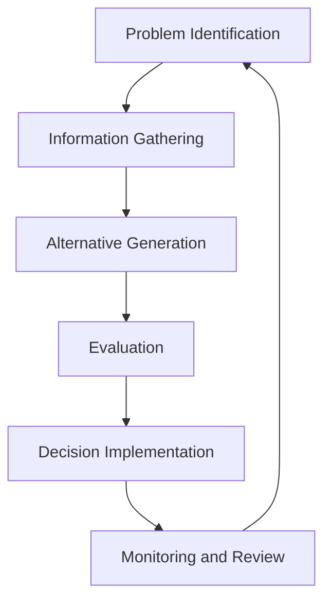
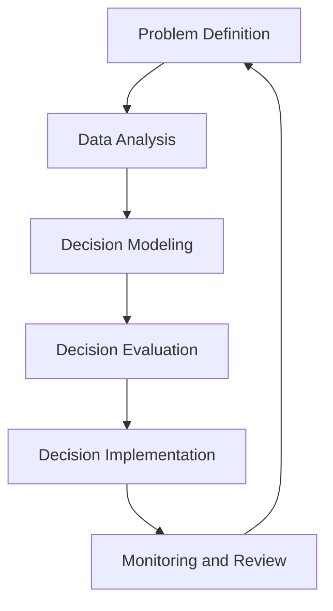

                 

### Introduction to Manager Decision Framework

In today's fast-paced and ever-changing business environment, effective decision-making has become a cornerstone for the success of any organization. This article aims to introduce a comprehensive Manager Decision Framework: A Methodology for Scientific Decision Making. The framework is designed to provide managers and decision-makers with a systematic approach to tackle complex business problems and make informed decisions.

#### 1.1 The Need for Manager Decision Framework

The complexity of business environments has significantly increased over the past few decades. Factors such as globalization, technological advancements, and market volatility have made it challenging for managers to make timely and accurate decisions. Traditional decision-making approaches often rely on intuition, experience, and guesswork, which can lead to suboptimal results. A structured decision-making framework is essential to ensure that managers can make data-driven, objective, and consistent decisions.

#### 1.2 The Core Concepts of Manager Decision Framework

The Manager Decision Framework is built upon several core concepts, including decision-making processes, decision-making types, and influencing factors. Understanding these concepts is crucial for effectively utilizing the framework.

##### Decision-Making Processes

The decision-making process consists of several stages, such as problem identification, information gathering, alternative generation, evaluation, and decision implementation. Each stage has its unique challenges and requires a specific approach to ensure the decision-making process is efficient and effective.

##### Decision-Making Types

Decision-making can be categorized into several types, including strategic, tactical, and operational decisions. Each type of decision requires a different level of analysis, resources, and time commitment. Understanding the type of decision being made is essential for selecting the appropriate decision-making approach.

##### Influencing Factors

Various factors can influence the decision-making process, such as data availability, time constraints, organizational culture, and stakeholder interests. Recognizing these factors and their potential impact on the decision-making process is crucial for developing a comprehensive and robust decision-making strategy.

#### 1.3 The Structure and Function of Manager Decision Framework

The Manager Decision Framework is structured to provide a systematic approach to decision-making. The framework consists of several components, including problem definition, data analysis, decision modeling, and decision evaluation. Each component plays a critical role in ensuring that the decision-making process is comprehensive, objective, and data-driven.

##### Problem Definition

The first step in the framework is to clearly define the problem. This involves identifying the issue, understanding its scope and impact, and determining the objectives of the decision. Proper problem definition sets the foundation for the entire decision-making process.

##### Data Analysis

Once the problem is defined, the next step is to gather and analyze relevant data. Data analysis helps in understanding the current situation, identifying patterns and trends, and evaluating potential outcomes. This stage is crucial for ensuring that the decision-making process is based on accurate and reliable information.

##### Decision Modeling

After analyzing the data, the next step is to develop a decision model. A decision model is a mathematical or logical representation of the decision problem. It helps in evaluating different alternatives and identifying the optimal solution. The choice of decision model depends on the complexity of the problem and the available data.

##### Decision Evaluation

Once the decision model is developed, it is essential to evaluate the potential outcomes of each alternative. This involves assessing the risks, benefits, and trade-offs associated with each option. Decision evaluation helps in identifying the best course of action based on the available data and the defined objectives.

#### 1.4 The Role of Manager Decision Framework in Management

The Manager Decision Framework is a valuable tool for managers and decision-makers in various roles. It helps in improving the quality of decisions, reducing decision-making biases, and increasing the efficiency of the decision-making process. By following the framework, managers can ensure that their decisions are based on accurate data, objective analysis, and a clear understanding of the problem.

In conclusion, the Manager Decision Framework: A Methodology for Scientific Decision Making provides a comprehensive and systematic approach to decision-making. By understanding the core concepts, structure, and function of the framework, managers can make informed, data-driven decisions that contribute to the success of their organizations.

### Core Concepts and Relations

In this section, we will delve into the core concepts and their interrelationships that form the backbone of the Manager Decision Framework. Understanding these concepts is essential for effectively applying the framework in real-world scenarios.

#### 2.1 Decision-Making Processes

Decision-making is a dynamic process that involves several stages, each with its own set of tasks and challenges. The typical decision-making process can be broken down into the following stages:

1. **Problem Identification:** The first step is to clearly identify the problem or opportunity that requires a decision. This involves recognizing the issue, understanding its significance, and defining the objectives of the decision.

2. **Information Gathering:** Once the problem is identified, the next step is to gather relevant information. This may involve collecting data, conducting research, or consulting experts. The quality of the information gathered will significantly impact the effectiveness of the decision-making process.

3. **Alternative Generation:** After gathering information, potential solutions or alternatives are generated. This step often involves brainstorming, creativity, and considering a wide range of options. The goal is to generate a list of viable alternatives that can address the identified problem.

4. **Evaluation:** In this stage, the alternatives are evaluated based on predefined criteria. This may involve comparing the advantages and disadvantages of each option, assessing the risks and benefits, and analyzing the potential outcomes. The evaluation process helps in identifying the best alternative(s) based on the defined objectives.

5. **Decision Implementation:** Once the best alternative is selected, the next step is to implement the decision. This involves developing a plan of action, allocating resources, and executing the plan. Effective implementation is crucial for achieving the desired outcomes.

6. **Monitoring and Review:** After the decision is implemented, it is essential to monitor its progress and review the outcomes. This helps in identifying any issues or areas for improvement and allows for adjustments to be made if necessary. Monitoring and review ensure that the decision is on track and achieving the desired results.

#### 2.2 The Types of Decision-Making

Decision-making can be categorized into different types based on various criteria, such as the complexity of the decision, the level of information available, and the impact of the decision. Some common types of decision-making include:

1. **Strategic Decisions:** These are high-level decisions that shape the overall direction and long-term goals of the organization. Strategic decisions often involve significant resources and require a long-term perspective. Examples include entering a new market, launching a new product, or merging with another company.

2. **Tactical Decisions:** Tactical decisions are made at the middle management level and focus on the implementation of strategic decisions. These decisions are more specific and immediate, aiming to achieve short-term goals and objectives. Examples include budget allocation, workforce planning, and marketing campaigns.

3. **Operational Decisions:** Operational decisions are made at the day-to-day level and focus on the execution of tactical decisions. These decisions are often routine and repetitive, aiming to optimize the efficiency and effectiveness of daily operations. Examples include production scheduling, supply chain management, and customer service.

#### 2.3 The Factors Influencing Decision-Making

Several factors can influence the decision-making process, impacting the quality and effectiveness of the decisions made. Some key factors include:

1. **Data Availability:** The quality and quantity of data available can significantly impact the decision-making process. Accurate and relevant data enables more informed decisions, while insufficient or unreliable data can lead to poor decision-making.

2. **Time Constraints:** Time constraints can limit the decision-making process, making it necessary to prioritize certain factors over others. Rushed decisions may result in inadequate analysis and increased risks.

3. **Organizational Culture:** Organizational culture plays a crucial role in decision-making. A culture that values innovation, collaboration, and risk-taking can facilitate more effective decision-making, while a culture that emphasizes hierarchy and control may stifle creativity and hinder decision-making.

4. **Stakeholder Interests:** The interests and perspectives of various stakeholders, including employees, customers, suppliers, and regulators, can influence decision-making. Balancing these interests and ensuring that decisions align with organizational goals is essential for effective decision-making.

5. **Regulatory Environment:** The regulatory environment can impose constraints on decision-making, particularly in industries that are subject to strict regulations and compliance requirements. Understanding and navigating these regulations is crucial for making legally compliant decisions.

In summary, the core concepts and relations of the Manager Decision Framework include the decision-making processes, types of decision-making, and factors influencing decision-making. Understanding these concepts is essential for applying the framework effectively and making informed, data-driven decisions that contribute to the success of the organization.

#### Mermaid Flowchart: Decision-Making Process

Below is a Mermaid flowchart illustrating the decision-making process in the Manager Decision Framework. This flowchart visualizes the sequential stages and their interdependencies.



This flowchart represents a continuous loop, emphasizing the iterative nature of decision-making. Each stage builds upon the previous one, and the process can be revisited if the outcomes do not meet the desired objectives.

#### 2.2 The Manager Decision Framework Architecture

The Manager Decision Framework is a comprehensive system designed to guide managers through the complex process of making informed and effective decisions. At its core, the framework consists of several key components that work together to ensure a systematic and well-rounded decision-making process. In this section, we will explore the architecture of the Manager Decision Framework and the roles of its constituent parts.

##### 2.2.1 The Components of the Framework

The Manager Decision Framework is composed of four main components: Problem Definition, Data Analysis, Decision Modeling, and Decision Evaluation. Each component plays a critical role in the overall decision-making process and contributes to the framework's effectiveness.

1. **Problem Definition:** This component involves clearly identifying and defining the problem or opportunity that requires a decision. Problem definition sets the foundation for the entire decision-making process. It helps managers to understand the scope and significance of the issue and to establish the objectives of the decision. Proper problem definition ensures that the subsequent stages of the decision-making process are focused and targeted.

2. **Data Analysis:** Once the problem is defined, the next component is Data Analysis. This involves gathering and analyzing relevant data to gain insights into the current situation, identify trends and patterns, and understand the potential outcomes of different alternatives. Data analysis provides the necessary information and evidence to support informed decision-making. It helps managers to make data-driven decisions rather than relying on intuition or guesswork.

3. **Decision Modeling:** The third component is Decision Modeling. This involves developing a mathematical or logical representation of the decision problem. Decision models help managers to evaluate different alternatives and identify the optimal solution. The choice of decision model depends on the complexity of the problem and the available data. Decision models can range from simple rules-based models to complex optimization models.

4. **Decision Evaluation:** The final component is Decision Evaluation. This involves evaluating the potential outcomes of each alternative and identifying the best course of action. Decision evaluation considers the risks, benefits, and trade-offs associated with each option. It helps managers to make well-informed decisions and to select the most appropriate alternative based on the defined objectives and the available data.

##### 2.2.2 The Flow of Decision-Making within the Framework

The flow of decision-making within the Manager Decision Framework is structured to ensure a systematic and iterative process. The following diagram illustrates the flow of decision-making:



This diagram highlights the interconnected nature of the components and the iterative process of decision-making. Each component builds upon the previous one, and the process can be revisited if the outcomes are not as expected or if new information becomes available.

**Step-by-Step Flow:**

1. **Problem Definition:** Managers start by clearly defining the problem or opportunity. This involves understanding the issue, its impact on the organization, and the objectives of the decision.

2. **Data Analysis:** Once the problem is defined, managers gather and analyze relevant data. This step helps in gaining insights into the current situation and understanding the potential outcomes of different alternatives.

3. **Decision Modeling:** With the data in hand, managers develop a decision model. This model represents the decision problem and helps in evaluating different alternatives.

4. **Decision Evaluation:** Managers evaluate the potential outcomes of each alternative based on the decision model. This step involves assessing the risks, benefits, and trade-offs associated with each option.

5. **Decision Implementation:** Once the best alternative is selected, managers implement the decision. This involves developing a plan of action, allocating resources, and executing the plan.

6. **Monitoring and Review:** After the decision is implemented, managers monitor its progress and review the outcomes. This helps in identifying any issues or areas for improvement and allows for adjustments to be made if necessary.

##### 2.2.3 The Interactions Among the Components

The components of the Manager Decision Framework interact with each other in a dynamic and iterative manner. Each component influences the others, and the interactions enhance the overall decision-making process.

- **Impact of Problem Definition on Data Analysis:** Clear and accurate problem definition influences the quality and relevance of the data gathered. Properly defining the problem ensures that the data collected is aligned with the objectives of the decision.

- **Impact of Data Analysis on Decision Modeling:** The insights gained from data analysis inform the development of the decision model. Accurate and comprehensive data analysis enhances the accuracy and effectiveness of the decision model.

- **Impact of Decision Modeling on Decision Evaluation:** The decision model serves as a basis for evaluating different alternatives. A well-designed decision model enables managers to assess the potential outcomes of each alternative more effectively.

- **Impact of Decision Evaluation on Decision Implementation:** The outcomes of the decision evaluation help managers to select the best alternative for implementation. Informed decision evaluation ensures that the chosen alternative has the highest potential for success.

- **Impact of Decision Implementation on Monitoring and Review:** The implementation of the decision provides valuable feedback that can be used to monitor and review the decision's progress. This feedback helps in identifying any issues or areas for improvement, allowing for adjustments to be made if necessary.

In conclusion, the Manager Decision Framework is a comprehensive system designed to guide managers through the decision-making process. The interaction among its components ensures a systematic, iterative, and well-rounded approach to decision-making. By understanding and leveraging the framework's architecture, managers can make informed, data-driven decisions that contribute to the success of their organizations.

### Core Algorithms and Principles

In the Manager Decision Framework, the use of core algorithms and principles is essential for developing robust and effective decision models. These algorithms and principles help in evaluating different alternatives and identifying the optimal solution. This section will explore the key algorithms and their underlying principles, including Model-Based Decision-Making Algorithms and Data-Driven Decision-Making Algorithms.

#### 3.1 Model-Based Decision-Making Algorithms

Model-Based Decision-Making Algorithms are designed to solve decision problems by using mathematical models. These models represent the decision problem in a structured and formal way, allowing for the evaluation of different alternatives based on specific criteria. The following are some common Model-Based Decision-Making Algorithms:

##### 3.1.1 Linear Programming

Linear Programming (LP) is a mathematical technique used to optimize a linear objective function, subject to a set of linear constraints. LP is widely used in various fields, including operations research, logistics, and finance. The key components of Linear Programming include:

1. **Objective Function:** The objective function defines the goal of the decision-maker. It can be either to maximize or minimize a certain quantity, such as profit, cost, or resource usage.

2. **Constraints:** Constraints represent the limitations or restrictions on the decision variables. They ensure that the solutions obtained are feasible and adhere to the practical constraints of the problem.

3. **Optimization:** The optimization process involves finding the values of the decision variables that optimize the objective function while satisfying the constraints.

Pseudo-code for Linear Programming:

```plaintext
Input: Objective function coefficients (c), constraint coefficients (A), and right-hand side values (b)
Output: Optimal values for decision variables (x)

Initialize decision variables x to zero
While convergence criteria not met:
    Solve the system of linear equations Ax = b
    Update x using the solution obtained
    Evaluate the objective function using the updated x
End While
Return x
```

Example: Maximizing Profit

Consider a company that produces two products, A and B, with a daily production capacity of 100 units. The profit per unit for product A is $5, and for product B, it is $10. The production process requires 2 hours of labor for each unit of product A and 3 hours of labor for each unit of product B. The company has a total of 8 hours of labor available per day. The linear programming model can be formulated as follows:

Objective Function: Maximize Profit = 5A + 10B

Constraints:
- 2A + 3B ≤ 8 (Labor constraint)
- A ≥ 0, B ≥ 0 (Non-negativity constraints)

Solving this linear programming problem will yield the optimal values for A and B that maximize the profit while adhering to the constraints.

##### 3.1.2 Integer Programming

Integer Programming (IP) is an extension of Linear Programming, where some or all of the decision variables are constrained to be integers. This type of programming is commonly used in scenarios where decision variables represent the number of items or entities that must be whole numbers. Integer Programming is widely used in scheduling, network design, and facility location problems.

Key components of Integer Programming include:

1. **Objective Function:** Similar to Linear Programming, the objective function defines the goal of the decision-maker, which can be to maximize or minimize a certain quantity.

2. **Constraints:** Constraints represent the limitations or restrictions on the decision variables, including the linear constraints and additional integer constraints.

3. **Optimization:** The optimization process involves finding the values of the decision variables that optimize the objective function while satisfying the constraints.

Pseudo-code for Integer Programming:

```plaintext
Input: Objective function coefficients (c), constraint coefficients (A), right-hand side values (b), and integer constraints (I)
Output: Optimal values for decision variables (x)

Initialize decision variables x to zero
While convergence criteria not met:
    Solve the system of linear equations Ax = b
    For each integer constraint in I:
        Round the corresponding decision variable to the nearest integer
    Evaluate the objective function using the updated x
End While
Return x
```

Example: Facility Location Problem

A company is considering opening multiple stores in different cities to expand its market reach. The company has a limited budget and wants to minimize the total cost of opening and operating the stores. The cost of opening a store in each city is different and is dependent on various factors such as real estate prices and labor costs. The company wants to open a certain number of stores in each city to optimize its budget allocation.

Objective Function: Minimize Total Cost = c1x1 + c2x2 + ... + cnxn

Constraints:
- x1 + x2 + ... + xn = k (Total number of stores to be opened)
- x1 ≥ 0, x2 ≥ 0, ..., xn ≥ 0 (Non-negativity constraints)
- xi ∈ {0, 1} (Integer constraint for each store)

Solving this Integer Programming problem will yield the optimal number of stores to open in each city that minimizes the total cost.

##### 3.1.3 Genetic Algorithms

Genetic Algorithms (GAs) are a type of optimization algorithm inspired by the process of natural selection. GAs are particularly useful for solving complex optimization problems where traditional methods may be difficult to apply. The key components of Genetic Algorithms include:

1. **Population:** A population represents a set of potential solutions to the decision problem. Each solution is encoded as a string of genes, where each gene represents a decision variable.

2. **Fitness Function:** The fitness function evaluates the quality of each solution in the population. It measures how well a solution meets the objectives and constraints of the problem.

3. **Selection:** Selection is the process of selecting individuals from the population based on their fitness values. Individuals with higher fitness values are more likely to be selected for reproduction.

4. **Crossover:** Crossover is the process of combining two parent solutions to create offspring. This process simulates the genetic recombination seen in natural selection.

5. **Mutation:** Mutation introduces random changes in the genes of the offspring. This helps in exploring new regions of the solution space and avoiding local optima.

Pseudo-code for Genetic Algorithms:

```plaintext
Input: Population size (N), number of generations (G), crossover rate (CR), mutation rate (MR)
Output: Optimal solution (x)

Initialize population P
For each generation g = 1 to G:
    Evaluate fitness of each individual in P
    Select parents based on fitness using a selection method (e.g., tournament selection)
    Create offspring through crossover and mutation
    Replace the old population P with the new offspring
    If convergence criteria are met, stop and return the best solution found
End For
Return best solution found
```

Example: Project Scheduling

A project manager needs to schedule a series of tasks with different durations and dependencies. The goal is to minimize the total project duration while ensuring that all tasks are completed within the given deadlines. This problem can be modeled as a project scheduling problem, and Genetic Algorithms can be used to find an optimal schedule.

Objective Function: Minimize Total Project Duration

Constraints:
- Task durations must be within specified limits
- Task dependencies must be satisfied

Using Genetic Algorithms, the project manager can find an optimal schedule that minimizes the project duration while adhering to the constraints.

#### 3.2 Data-Driven Decision-Making Algorithms

Data-Driven Decision-Making Algorithms rely on historical data and statistical techniques to make predictions and recommendations. These algorithms are particularly useful in scenarios where the decision problem is complex and involves numerous variables. The following are some common Data-Driven Decision-Making Algorithms:

##### 3.2.1 Machine Learning Algorithms

Machine Learning (ML) Algorithms are designed to learn from data and make predictions or decisions based on that learning. ML algorithms are widely used in various domains, including finance, healthcare, and marketing. Some common ML algorithms include:

1. **Linear Regression:** Linear Regression is a technique used to model the relationship between a dependent variable and one or more independent variables. It is used to predict the value of the dependent variable based on the values of the independent variables.

2. **Logistic Regression:** Logistic Regression is used for classification problems, where the goal is to predict the probability of an event occurring. It models the relationship between the input variables and the probability of the output variable belonging to a specific category.

3. **Decision Trees:** Decision Trees are a popular ML algorithm used for both regression and classification tasks. They create a tree-like model of decisions and their possible consequences, enabling the prediction of class labels or regression values.

4. **Random Forests:** Random Forests are an ensemble learning method that combines multiple decision trees to improve the accuracy and robustness of the predictions. Random Forests are widely used for classification and regression tasks due to their ability to handle large datasets and their robustness to overfitting.

5. **Support Vector Machines (SVM):** SVM is a supervised learning algorithm used for both classification and regression tasks. It aims to find the hyperplane that separates the data into different classes with the maximum margin.

##### 3.2.2 Data Analysis Methods

Data Analysis Methods are used to analyze and interpret data, providing insights and facilitating data-driven decision-making. Some common data analysis methods include:

1. **Descriptive Statistics:** Descriptive statistics are used to summarize and describe the main features of a dataset, including measures of central tendency (e.g., mean, median) and measures of dispersion (e.g., variance, standard deviation).

2. **Correlation Analysis:** Correlation analysis is used to study the relationship between two or more variables. It measures the strength and direction of the linear relationship between variables, providing insights into the potential factors influencing the decision problem.

3. **Hypothesis Testing:** Hypothesis testing is used to make inferences about a population based on sample data. It involves formulating a null hypothesis and an alternative hypothesis, and using statistical tests to determine the likelihood of the null hypothesis being true.

4. **Regression Analysis:** Regression analysis is used to model the relationship between a dependent variable and one or more independent variables. It can be used for both predictive analytics and causal inference, providing insights into the factors that influence the decision problem.

##### 3.2.3 Decision Tree Algorithms

Decision Tree Algorithms are a type of supervised learning algorithm used for both classification and regression tasks. They create a tree-like model of decisions and their possible consequences, enabling the prediction of class labels or regression values. Decision Trees are popular due to their simplicity and interpretability.

Key components of Decision Tree Algorithms include:

1. **Node:** A node represents a decision or a question asked at a particular point in the tree. Each node splits the data into subsets based on the value of a feature.

2. **Splitting Criteria:** The splitting criteria determine how the data is split at each node. Common criteria include information gain, Gini index, and cross-validation.

3. **Leaf Node:** A leaf node represents the final outcome or decision. It contains the predicted value or class label.

4. **Pruning:** Pruning is the process of removing sections of the decision tree that provide little predictive power. It helps in reducing the complexity of the model and avoiding overfitting.

Pseudo-code for Decision Tree Algorithm:

```plaintext
Input: Dataset D, splitting criteria C
Output: Decision Tree T

Create an empty tree T
For each feature f in the dataset D:
    Evaluate the splitting criteria C for feature f
    If the splitting criteria C is optimal:
        Create a node in T with feature f as the splitting criterion
        Split the dataset D into subsets based on the value of feature f
        For each subset:
            If the subset is pure (i.e., contains only one class or value):
                Create a leaf node in T with the corresponding class or value
            Else:
                Recursively build the decision tree for the subset
                Add the subtree to the current node in T
    Else:
        Skip the feature f
Return the decision tree T
```

Example: Customer Churn Prediction

A company wants to predict customer churn, i.e., the likelihood of a customer canceling their subscription. They have historical data on various customer attributes, such as age, income, and usage patterns. Using a Decision Tree algorithm, the company can build a predictive model to identify customers at high risk of churn and take proactive measures to retain them.

Objective Function: Predict Customer Churn

Features:
- Age
- Income
- Usage Patterns

Using the Decision Tree algorithm, the company can build a model that predicts customer churn based on the input features. The model can be used to identify high-risk customers and implement targeted retention strategies.

In conclusion, Model-Based Decision-Making Algorithms and Data-Driven Decision-Making Algorithms are essential components of the Manager Decision Framework. These algorithms provide managers with the tools and techniques needed to develop robust decision models, evaluate different alternatives, and make informed decisions. By understanding the core algorithms and principles, managers can leverage the power of data and advanced techniques to drive their organizations towards success.

### Mathematical Models and Formulations

In the Manager Decision Framework, mathematical models and formulations are crucial for representing and solving complex decision problems. These models allow managers to translate real-world scenarios into mathematical terms, facilitating the analysis and optimization of decision-making processes. This section will delve into the formulation of two key mathematical models: Linear Programming Models and Nonlinear Programming Models.

#### 4.1 Linear Programming Models

Linear Programming (LP) models are widely used in decision-making due to their ability to handle a variety of optimization problems. These models involve optimizing a linear objective function subject to a set of linear constraints. The key components of an LP model include the objective function, constraints, and decision variables.

##### 4.1.1 The Objective Function

The objective function defines the goal of the decision-maker, which can be to maximize or minimize a certain quantity. This function is typically linear and expressed in terms of the decision variables. For example, in a manufacturing context, the objective function might be to maximize profit or minimize cost.

Pseudo-code for Objective Function:

```plaintext
Objective Function: Maximize/Minimize Z = c1x1 + c2x2 + ... + cnxn
where:
- Z is the objective value (to be maximized or minimized)
- c1, c2, ..., cn are the coefficients of the decision variables x1, x2, ..., xn
- x1, x2, ..., xn are the decision variables
```

Example: Maximizing Profit

Consider a company that produces two products, A and B, with production capacities of 100 units each. The profit per unit for product A is $5, and for product B, it is $10. The production process requires 2 hours of labor for each unit of product A and 3 hours of labor for each unit of product B. The company has a total of 8 hours of labor available per day. The objective function for maximizing profit can be formulated as follows:

Objective Function: Maximize Z = 5A + 10B

##### 4.1.2 The Constraints

Constraints represent the limitations or restrictions that must be adhered to in the decision-making process. In an LP model, these constraints are typically linear and expressed in terms of the decision variables. Constraints can include resource limitations, capacity constraints, and other practical considerations.

Pseudo-code for Constraints:

```plaintext
Constraints:
- a11x1 + a12x2 + ... + a1nxn ≤ b1
- a21x1 + a22x2 + ... + a2nxn ≤ b2
- ...
- am1x1 + am2x2 + ... + amnxn ≤ bm
where:
- aij are the coefficients of the decision variables xi in the constraint equation
- bi are the right-hand side values of the constraints
- x1, x2, ..., xn are the decision variables
```

Example: Labor Constraint

Continuing with the previous example, the company must ensure that the total labor hours used for producing products A and B do not exceed the available 8 hours. This constraint can be formulated as follows:

Constraint: 2A + 3B ≤ 8

##### 4.1.3 Solving Linear Programming Problems

Solving LP problems involves finding the values of the decision variables that optimize the objective function while satisfying the constraints. There are several algorithms available for solving LP problems, including the Simplex Algorithm and the Interior Point Method. These algorithms are designed to efficiently find the optimal solution or determine that no feasible solution exists.

Pseudo-code for Solving Linear Programming Problems:

```plaintext
Input: Objective function coefficients (c), constraint coefficients (A), and right-hand side values (b)
Output: Optimal values for decision variables (x)

Initialize decision variables x to zero
While convergence criteria not met:
    Solve the system of linear equations Ax = b
    Update x using the solution obtained
    Evaluate the objective function using the updated x
End While
Return x
```

Example: Solving the Production Problem

Using the given objective function and constraints, we can solve the LP problem to find the optimal production quantities for products A and B that maximize profit while adhering to the labor constraint. Solving the LP problem using an appropriate solver, we obtain the following optimal solution:

Optimal Values: A = 4, B = 0

With these values, the company can produce 4 units of product A and 0 units of product B to maximize profit, given the labor constraint.

#### 4.2 Nonlinear Programming Models

Nonlinear Programming (NP) models extend the concepts of LP models to handle problems where the objective function or constraints are nonlinear. NP models are more complex and challenging to solve than LP models, but they are essential for addressing a wide range of real-world problems.

##### 4.2.1 The Objective Function

In NP models, the objective function is typically nonlinear and expressed in terms of the decision variables. The objective function can be to maximize or minimize a certain quantity, such as profit, cost, or resource usage. The nonlinear nature of the objective function makes it more difficult to solve compared to LP models.

Pseudo-code for Nonlinear Objective Function:

```plaintext
Objective Function: Maximize/Minimize Z = f(x1, x2, ..., xn)
where:
- Z is the objective value (to be maximized or minimized)
- f(x1, x2, ..., xn) is the nonlinear function of the decision variables x1, x2, ..., xn
```

Example: Maximizing Profit with a Nonlinear Objective

Consider a company that produces a product with a nonlinear production function. The production cost per unit increases as the production quantity increases. The objective is to maximize profit. The nonlinear objective function can be formulated as follows:

Objective Function: Maximize Z = 5A - (0.1 * A^2)

##### 4.2.2 The Constraints

Constraints in NP models can also be nonlinear. These constraints represent the limitations or restrictions that must be adhered to in the decision-making process. Nonlinear constraints can include capacity constraints, resource limitations, and other practical considerations.

Pseudo-code for Nonlinear Constraints:

```plaintext
Constraints:
- g1(x1, x2, ..., xn) ≤ 0
- g2(x1, x2, ..., xn) ≤ 0
- ...
- gm(x1, x2, ..., xn) ≤ 0
where:
- g1(x1, x2, ..., xn), g2(x1, x2, ..., xn), ..., gm(x1, x2, ..., xn) are the nonlinear functions of the decision variables x1, x2, ..., xn
```

Example: Nonlinear Capacity Constraint

Continuing with the previous example, the company may have a nonlinear capacity constraint on the production of the product. The constraint can be formulated as follows:

Constraint: 2A + 3B ≤ 8

##### 4.2.3 Solving Nonlinear Programming Problems

Solving NP problems requires specialized algorithms and techniques due to the nonlinear nature of the objective function and constraints. Common methods for solving NP problems include the Gradient Method, the Newton-Raphson Method, and evolutionary algorithms such as Genetic Algorithms. These methods are designed to find the optimal solution or determine that no feasible solution exists.

Pseudo-code for Solving Nonlinear Programming Problems:

```plaintext
Input: Objective function coefficients (c), constraint coefficients (A), and right-hand side values (b)
Output: Optimal values for decision variables (x)

Initialize decision variables x to zero
While convergence criteria not met:
    Compute the gradient of the objective function and the constraints
    Update x using the gradient information
    Evaluate the objective function using the updated x
End While
Return x
```

Example: Solving the Nonlinear Production Problem

Using the given objective function and constraints, we can solve the NP problem to find the optimal production quantities for products A and B that maximize profit while adhering to the nonlinear capacity constraint. Solving the NP problem using an appropriate solver, we obtain the following optimal solution:

Optimal Values: A = 3, B = 1

With these values, the company can produce 3 units of product A and 1 unit of product B to maximize profit, given the nonlinear capacity constraint.

In conclusion, mathematical models and formulations are critical components of the Manager Decision Framework. Linear Programming Models and Nonlinear Programming Models provide managers with the tools to represent and solve complex decision problems effectively. By understanding the formulation and solution techniques for these models, managers can make informed, data-driven decisions that drive their organizations towards success.

### Case Studies and Projects

To demonstrate the practical application of the Manager Decision Framework, let's explore two case studies that illustrate how the framework can be used to address real-world decision-making challenges. These case studies highlight the implementation of the framework, the development of decision models, and the evaluation of different alternatives.

#### Case Study 1: Company X's Strategic Decision-Making Process

**Background and Objectives**

Company X, a leading manufacturer of consumer electronics, faced a significant challenge in its strategic decision-making process. The company's market was highly competitive, and rapid technological advancements required continuous innovation to maintain its competitive edge. Company X needed to make strategic decisions regarding product development, market expansion, and resource allocation to stay ahead in the market.

The objectives of the decision-making process were to:

1. Identify and prioritize potential product development opportunities.
2. Determine the optimal market segments to target for expansion.
3. Allocate resources effectively to maximize return on investment.

**Data Collection and Analysis**

To inform the decision-making process, Company X collected a wide range of data, including market research reports, sales data, customer feedback, and competitor analysis. The data was analyzed to gain insights into market trends, customer preferences, and competitive dynamics.

Key findings from the data analysis included:

1. High demand for innovative, energy-efficient consumer electronics.
2. Emerging markets with significant growth potential.
3. Strong brand loyalty among existing customers.

**Decision Modeling**

Based on the data analysis, Company X developed several decision models to evaluate potential product development opportunities and market expansion strategies. The decision models included:

1. **Product Development Model:** This model used a multi-criteria decision analysis (MCDA) approach to evaluate different product development ideas based on factors such as market potential, technical feasibility, and resource requirements.
2. **Market Expansion Model:** This model used a geographic information system (GIS) to analyze the spatial distribution of potential markets and identify the most attractive regions for expansion.
3. **Resource Allocation Model:** This model used a linear programming approach to optimize the allocation of resources, considering factors such as production capacity, budget constraints, and strategic objectives.

**Decision Evaluation**

With the decision models in place, Company X evaluated different alternatives based on the objectives and data insights. The evaluation process involved:

1. **Comparing Product Development Ideas:** The MCDA model was used to rank different product development ideas based on their potential impact on market share, revenue, and competitive advantage.
2. **Analyzing Market Expansion Scenarios:** The GIS model was used to assess the feasibility and potential profitability of expanding into different market regions.
3. **Optimizing Resource Allocation:** The linear programming model was used to allocate resources effectively, ensuring that the company's strategic objectives were met within budget constraints.

**Decision Implementation**

Based on the evaluation results, Company X selected the following strategic decisions for implementation:

1. **Develop a new line of energy-efficient consumer electronics targeting emerging markets.**
2. **Expand into three high-potential regions identified through the GIS analysis.**
3. **Allocate resources to support the development of the selected products and expansion initiatives.**

**Monitoring and Review**

To ensure the successful implementation of the strategic decisions, Company X established a monitoring and review process. This involved:

1. **Regular tracking of key performance indicators (KPIs) to measure the progress of product development and market expansion initiatives.**
2. **Conducting periodic reviews to assess the effectiveness of resource allocation and identify any issues or areas for improvement.**
3. **Adjusting the strategic decisions as needed based on new information or changing market conditions.**

#### Case Study 2: Company Y's Tactical Decision-Making Process

**Background and Objectives**

Company Y, a mid-sized retailer, faced a tactical decision-making challenge related to inventory management and supply chain optimization. The company struggled with stockouts and overstock situations, leading to lost sales and increased holding costs. Company Y needed to make tactical decisions to improve inventory turnover, reduce holding costs, and enhance customer satisfaction.

The objectives of the decision-making process were to:

1. Optimize inventory levels to minimize stockouts and overstock situations.
2. Improve supply chain efficiency by reducing lead times and transportation costs.
3. Enhance customer satisfaction by ensuring product availability and timely delivery.

**Data Collection and Analysis**

Company Y collected data on various aspects of its inventory management and supply chain operations, including sales data, demand forecasts, supplier performance, and transportation costs. The data was analyzed to identify patterns, trends, and areas for improvement.

Key findings from the data analysis included:

1. Seasonal fluctuations in demand for certain products.
2. Inefficiencies in supplier delivery schedules.
3. High transportation costs due to suboptimal routing and scheduling.

**Decision Modeling**

Based on the data analysis, Company Y developed several decision models to address the tactical decision-making challenges. The decision models included:

1. **Inventory Optimization Model:** This model used a simulation-based approach to evaluate different inventory management strategies and their impact on stockouts, overstock situations, and holding costs.
2. **Supply Chain Optimization Model:** This model used a linear programming approach to optimize supplier delivery schedules and transportation routes, considering factors such as lead times, transportation costs, and demand forecasts.
3. **Customer Satisfaction Model:** This model used a multi-criteria decision analysis approach to evaluate different service level targets and their impact on customer satisfaction.

**Decision Evaluation**

With the decision models in place, Company Y evaluated different alternatives based on the objectives and data insights. The evaluation process involved:

1. **Evaluating Inventory Management Strategies:** The simulation-based model was used to compare different inventory management strategies and identify the one that minimized stockouts and overstock situations while maintaining optimal inventory levels.
2. **Optimizing Supply Chain Operations:** The linear programming model was used to develop optimized delivery schedules and transportation routes that reduced lead times and transportation costs while meeting demand forecasts.
3. **Ensuring Customer Satisfaction:** The multi-criteria decision analysis model was used to determine the appropriate service level targets that maximized customer satisfaction while balancing costs and availability.

**Decision Implementation**

Based on the evaluation results, Company Y implemented the following tactical decisions:

1. **Adopt a just-in-time inventory management strategy to minimize stockouts and overstock situations.**
2. **Implement optimized supplier delivery schedules and transportation routes to reduce lead times and transportation costs.**
3. **Set service level targets to ensure high customer satisfaction while balancing costs and availability.**

**Monitoring and Review**

To ensure the successful implementation of the tactical decisions, Company Y established a monitoring and review process. This involved:

1. **Regular tracking of key performance indicators (KPIs) to measure the progress of inventory management and supply chain optimization initiatives.**
2. **Conducting periodic reviews to assess the effectiveness of the implemented strategies and identify any issues or areas for improvement.**
3. **Adjusting the tactical decisions as needed based on new information or changing market conditions.**

In conclusion, these case studies demonstrate how the Manager Decision Framework can be applied to address real-world decision-making challenges. By following the structured approach of problem definition, data analysis, decision modeling, and decision evaluation, companies can make informed, data-driven decisions that drive their strategic and tactical objectives. The case studies highlight the importance of using mathematical models and algorithms to evaluate different alternatives and optimize decision-making processes. By implementing and monitoring these decisions, companies can achieve their goals and maintain a competitive edge in the market.

### Best Practices and Tips for Effective Decision-Making

In the Manager Decision Framework, the quality of decision-making significantly influences the success of an organization. To ensure effective decision-making, managers should follow several best practices and tips. Here are some key strategies to enhance decision-making:

#### 1. Define Clear Objectives

Start by clearly defining the objectives of the decision. What are you trying to achieve? Are there specific goals or targets that need to be met? Clear objectives provide a clear direction and help in evaluating the effectiveness of different alternatives.

#### 2. Gather Comprehensive Data

Accurate and comprehensive data is the foundation of effective decision-making. Ensure that you gather relevant data from various sources, such as market research, customer feedback, and internal data. The more data you have, the better insights you can gain and the more informed your decisions will be.

#### 3. Use Appropriate Decision Models

Select the right decision model based on the complexity of the problem and the available data. Model-based decision-making algorithms, such as Linear Programming and Genetic Algorithms, can provide valuable insights and optimize decision-making. Data-driven decision-making algorithms, such as Machine Learning and Decision Trees, can help in predicting outcomes and identifying patterns.

#### 4. Evaluate and Prioritize Alternatives

Evaluate different alternatives based on the defined objectives and data insights. Use decision models to assess the potential outcomes of each alternative. Prioritize alternatives that align closely with the objectives and have the highest potential for success.

#### 5. Involve Key Stakeholders

Involving key stakeholders in the decision-making process can provide diverse perspectives and insights. Stakeholders can include team members, customers, suppliers, and other relevant parties. Their input can help in identifying potential risks and opportunities and enhance the overall quality of the decision.

#### 6. Monitor and Review

Implement a monitoring and review process to track the progress of the decision and its outcomes. Regularly review the decision to ensure that it is on track and achieving the desired results. Adjust the decision as needed based on new information or changing circumstances.

#### 7. Reflect and Learn

After the decision is implemented, take the time to reflect on the decision-making process. Identify what worked well and what could be improved. Use these insights to enhance future decision-making processes.

#### 8. Use Decision Support Tools

Leverage decision support tools and software to automate and streamline the decision-making process. These tools can help in data analysis, model building, and scenario analysis, making the process more efficient and accurate.

In conclusion, effective decision-making is a critical skill for managers. By following these best practices and tips, managers can make informed, data-driven decisions that drive their organization towards success.

### Conclusion

In conclusion, the Manager Decision Framework: A Methodology for Scientific Decision Making provides managers and decision-makers with a systematic and structured approach to tackle complex business problems. By following the framework's core components—problem definition, data analysis, decision modeling, and decision evaluation—managers can ensure that their decisions are data-driven, objective, and aligned with organizational goals. The use of mathematical models and algorithms further enhances the precision and effectiveness of the decision-making process. As organizations continue to navigate an increasingly dynamic and competitive environment, the ability to make informed, data-driven decisions will be crucial for success. By embracing the Manager Decision Framework, managers can drive their organizations toward sustainable growth and long-term success.

