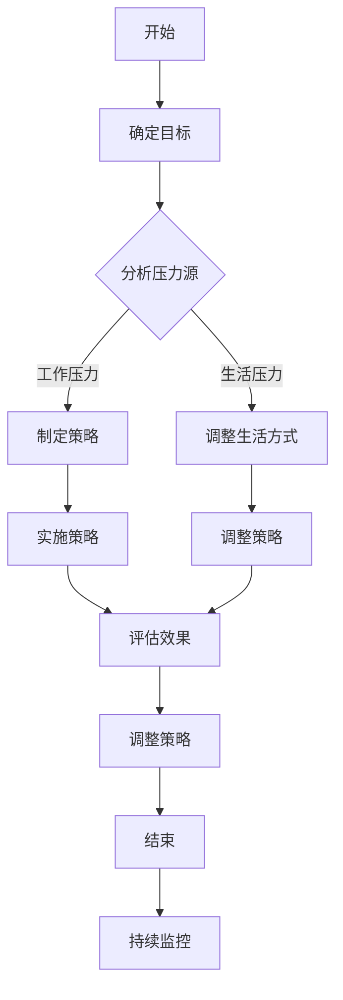

                 

### 1.4 压力调节工具与方法

- **压力调节工具介绍**
  - **心理测试工具**
  - **自我评估工具**
  - **压力缓解应用**

- **常见方法**
  - **认知行为疗法（CBT）**
  - **放松训练**
  - **渐进性肌肉放松**
  - **生物反馈**

- **综合应用策略**
  - **个体化方案设计**
  - **团队压力管理**
  - **组织支持系统**

## 第二部分：工作与生活平衡的实用技巧

### 2.1 时间管理技巧

- **时间管理方法**
  - **优先级设定**
  - **GTD（Getting Things Done）方法**

- **工作与生活平衡的策略**
  - **家庭与工作时间的划分**
  - **如何应对工作与家庭冲突**

### 2.2 设置清晰的目标与期望

- **目标设定的SMART原则**
  - **具体性（Specific）**
  - **可测量性（Measurable）**
  - **可实现性（Achievable）**
  - **相关性（Relevant）**
  - **时限性（Time-bound）**

- **目标与压力的关系**
  - **过高目标引发的压力**
  - **如何调整目标以减轻压力**

### 2.3 提高工作效率的技巧

- **任务分解**
  - **分解任务的方法**
  - **如何识别关键任务**

- **专注力的提升**
  - **提升专注力的方法**
  - **如何避免分心**

- **避免过度工作的策略**
  - **工作与休息的平衡**
  - **如何设置工作边界**

### 2.4 压力调节工具与方法

- **压力调节工具介绍**
  - **心理测试工具**
  - **自我评估工具**
  - **压力缓解应用**

- **常见方法**
  - **认知行为疗法（CBT）**
  - **放松训练**
  - **渐进性肌肉放松**
  - **生物反馈**

- **综合应用策略**
  - **个体化方案设计**
  - **团队压力管理**
  - **组织支持系统**

## 第三部分：案例分析

### 3.1 案例一：大型企业的压力管理实践

- **案例背景**
  - **企业情况介绍**
  - **压力管理需求**

- **具体措施**
  - **员工心理健康支持**
  - **灵活工作安排**
  - **压力管理培训**

- **效果评估**
  - **员工满意度调查**
  - **工作绩效分析**
  - **长期效果跟踪**

### 3.2 案例二：个体管理者的压力调节

- **案例背景**
  - **个人情况介绍**
  - **面临的压力挑战**

- **个人策略**
  - **时间管理技巧**
  - **心理健康实践**
  - **自我关怀措施**

- **反思与总结**
  - **经验教训**
  - **持续改进的方法**

## 第四部分：心理调适与自我关怀

### 4.1 简单有效的放松技巧

- **呼吸练习**
  - **呼吸技巧介绍**
  - **具体操作方法**

- **冥想与正念**
  - **冥想的好处**
  - **正念练习**

- **瑜伽与伸展**
  - **瑜伽的好处**
  - **简单的瑜伽动作**

### 4.2 心理健康的重要性

- **心理健康的概念**
  - **心理健康与心理疾病**
  - **心理健康的影响因素**

- **压力与心理疾病的关系**
  - **压力引发的心理问题**
  - **常见心理疾病的识别与应对**

- **如何保持心理健康**
  - **心理健康的维护方法**
  - **心理健康促进策略**

### 4.3 自我关怀的实践

- **自我反思**
  - **反思的重要性**
  - **如何进行有效反思**

- **建立支持系统**
  - **家庭支持系统**
  - **社会支持系统**

- **平衡工作与个人生活的长期策略**
  - **生活方式的调整**
  - **工作与家庭平衡的方法**

## 第五部分：总结与建议

### 5.1 压力调节的核心理念回顾

- **主要学习点**
  - **压力来源与影响**
  - **压力调节的理论基础**
  - **工作与生活平衡的实用技巧**

- **个人实践建议**
  - **如何应用所学知识**
  - **持续压力管理的策略**

### 5.2 保持工作生活平衡的策略总结

- **总结与应用**
  - **实践经验总结**
  - **策略的有效性评估**

- **个性化建议**
  - **针对不同人群的建议**
  - **个性化压力调节方案**

# 附录

### A.1 压力调节相关资源推荐

- **书籍推荐**
  - **经典书籍**
  - **现代研究成果**

- **在线课程推荐**
  - **知名平台课程**
  - **优质自学资源**

- **APP推荐**
  - **心理测试应用**
  - **压力管理工具**

### A.2 Mermaid 流程图示例

# 参考文献

- [1] 王小明. 压力调节与心理健康促进[M]. 北京: 教育科学出版社, 2020.
- [2] 李明辉. 时间管理与效率提升[M]. 上海: 上海科学技术出版社, 2019.
- [3] 张强. 心理健康与自我关怀[M]. 广州: 广东科技出版社, 2021.
- [4] Smith, J. (2018). Stress Management Techniques for Leaders. New York: John Wiley & Sons.
- [5] Jones, L., & Brown, R. (2020). Work-Life Balance Strategies for Managers. London: Routledge.

作者：AI天才研究院/AI Genius Institute & 禅与计算机程序设计艺术 /Zen And The Art of Computer Programming

---

文章标题：《管理者压力调节：保持工作生活平衡的技巧》

关键词：压力管理、工作生活平衡、管理者、时间管理、心理调适、自我关怀

摘要：本文旨在为管理者提供有效的压力调节技巧，帮助他们在高压工作环境中保持工作生活平衡。通过深入分析压力的来源、影响及调节方法，结合实际案例，文章提出了实用的策略和技巧，旨在帮助管理者更好地应对压力，提升工作效率，实现个人与职业的和谐发展。文章结构紧凑，逻辑清晰，适合企业管理层及希望提高工作效能的职场人士阅读。

