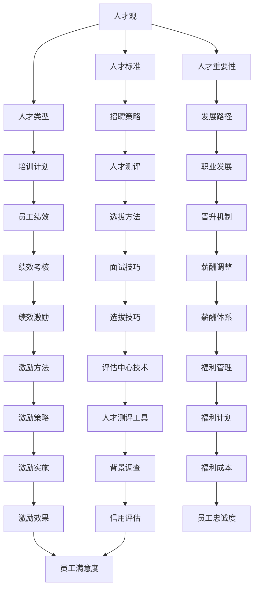

                 

### 设计《管理者如何有效管理人员：人力资源管理技巧》文章的大纲

为了确保文章内容完整、逻辑清晰，我们需要按照以下步骤来设计文章的大纲：

#### 第一步：确定文章的核心内容和结构

1. **引言**：介绍人力资源管理的背景、目的和重要性。
2. **核心概念与联系**：阐述人力资源管理中的关键概念，并构建概念之间的关系架构。
3. **招聘与选拔**：详细描述招聘流程、策略和技巧。
4. **培训与发展**：探讨员工培训体系、职业生涯规划和职业发展通道。
5. **绩效管理**：介绍绩效管理体系设计、绩效改进策略和激励方法。
6. **员工关系管理**：讨论员工关系管理策略、员工沟通与协调、员工冲突管理。
7. **薪酬与福利管理**：分析薪酬体系设计、福利管理与员工福利计划。
8. **法律法规与伦理**：阐述人力资源管理法律法规、伦理问题及伦理决策。

#### 第二步：细化各部分的内容

1. **引言与核心概念**：
   - 人力资源管理的背景介绍。
   - 关键概念阐述：人才观、人力资本观、价值观。
   - 人力资源管理的发展历程。

2. **员工招聘与选拔**：
   - 招聘流程设计：职位需求分析、招聘渠道选择、招聘预算与成本控制。
   - 选拔方法与技巧：面试技巧、评估中心技术、人才测评工具与方法、背景调查与信用评估。

3. **员工培训与发展**：
   - 培训需求分析。
   - 培训计划制定。
   - 培训方式与手段。
   - 培训效果评估。
   - 职业生涯规划：概念与重要性、方法与流程、职业发展通道、晋升机制。

4. **绩效管理**：
   - 绩效管理体系设计：定义、作用、指标体系设计、考核标准制定。
   - 绩效改进与激励：策略、激励方法、案例分析、实施与监控。

5. **员工关系管理**：
   - 策略与技巧：重要性、方法、沟通与协调、冲突管理。
   - 员工满意度与忠诚度：调查与分析、提升策略、关系管理。

6. **薪酬与福利管理**：
   - 薪酬体系设计：概述、策略与结构、薪酬水平与竞争力、薪酬调整与激励。
   - 福利管理与员工福利计划：概述、设计、成本控制、制度优化。

7. **法律法规与伦理**：
   - 法律法规概述：解读、应用、风险防范与处理。
   - 伦理概述：问题分析、决策模型与工具、培养伦理意识与行为。

#### 第三步：构建文章的目录大纲

根据以上内容，我们可以构建如下文章的目录大纲：

# 《管理者如何有效管理人员：人力资源管理技巧》

> 关键词：人力资源管理、员工招聘、培训与发展、绩效管理、员工关系管理、薪酬福利、法律法规与伦理

> 摘要：本文旨在探讨管理者如何通过人力资源管理技巧来有效管理员工，包括招聘、培训、绩效管理、员工关系、薪酬福利和法律法规与伦理等方面。

## 第一部分：引言与核心概念

### 第1章：人力资源管理概述

#### 1.1 人力资源管理的定义与作用

#### 1.2 人力资源管理的发展历程

#### 1.3 人力资源管理的核心概念

- 人才观
- 人力资本观
- 价值观

### 第2章：人力资源管理架构

#### 2.1 人力资源管理体系

#### 2.2 人力资源管理部门的职能

#### 2.3 人力资源管理的组织架构

## 第二部分：员工招聘与选拔

### 第3章：招聘策略与规划

#### 3.1 招聘流程设计

#### 3.2 招聘渠道选择

#### 3.3 招聘预算与成本控制

#### 3.4 招聘策略制定

### 第4章：选拔方法与技巧

#### 4.1 面试技巧

#### 4.2 评估中心技术

#### 4.3 人才测评工具与方法

#### 4.4 背景调查与信用评估

## 第三部分：员工培训与发展

### 第5章：员工培训体系

#### 5.1 培训需求分析

#### 5.2 培训计划制定

#### 5.3 培训方式与手段

#### 5.4 培训效果评估

### 第6章：员工职业生涯规划

#### 6.1 职业生涯规划的概念与重要性

#### 6.2 职业生涯规划的方法与流程

#### 6.3 职业发展通道与晋升机制

#### 6.4 职业生涯规划的实施与评估

## 第四部分：绩效管理

### 第7章：绩效管理体系设计

#### 7.1 绩效管理的定义与作用

#### 7.2 绩效指标体系设计

#### 7.3 绩效考核标准制定

#### 7.4 绩效反馈与面谈技巧

### 第8章：绩效改进与激励

#### 8.1 绩效改进策略

#### 8.2 绩效激励方法

#### 8.3 绩效改进案例分析

#### 8.4 绩效改进的实施与监控

## 第五部分：员工关系管理

### 第9章：员工关系管理策略

#### 9.1 员工关系管理的重要性

#### 9.2 员工关系管理的方法与技巧

#### 9.3 员工沟通与协调

#### 9.4 员工冲突管理

### 第10章：员工满意度与忠诚度

#### 10.1 员工满意度调查与分析

#### 10.2 提升员工满意度的策略

#### 10.3 员工忠诚度管理

#### 10.4 员工满意度与忠诚度的关系

## 第六部分：薪酬与福利管理

### 第11章：薪酬体系设计

#### 11.1 薪酬管理概述

#### 11.2 薪酬策略与结构

#### 11.3 薪酬水平与竞争力

#### 11.4 薪酬调整与激励

### 第12章：福利管理与员工福利计划

#### 12.1 福利管理概述

#### 12.2 员工福利计划设计

#### 12.3 福利成本控制

#### 12.4 福利制度优化

## 第七部分：法律法规与伦理

### 第13章：人力资源管理法律法规

#### 13.1 人力资源管理法律法规概述

#### 13.2 常见法律法规解读

#### 13.3 法律法规在人力资源管理中的应用

#### 13.4 法律风险防范与处理

### 第14章：人力资源管理伦理

#### 14.1 人力资源管理伦理概述

#### 14.2 常见伦理问题案例分析

#### 14.3 伦理决策模型与工具

#### 14.4 培养伦理意识与行为

这样，我们完成了文章大纲的设计，接下来可以根据每个部分的要求，详细撰写文章内容。在撰写过程中，要注意以下几点：

- 使用markdown格式确保文章的可读性。
- 每个章节都要有明确的标题和内容，确保文章结构清晰。
- 使用Mermaid流程图来展示核心概念之间的关系。
- 使用伪代码和LaTeX格式详细讲解核心算法原理和数学模型。
- 提供实际案例分析和代码实现，以便读者更好地理解应用。

### 核心概念与联系

在人力资源管理中，有几个核心概念至关重要，它们之间的关系构成了一个完整的管理体系。以下是这些核心概念的介绍和它们之间的联系架构：

#### 1. 人才观

人才观是指组织对人才的认知和评价，包括人才的标准、类型和重要性。人才观决定了组织的招聘策略、培训计划和发展路径。

**人才观**  
- **人才标准**：组织根据岗位需求设定的人才评价标准。
- **人才类型**：根据能力、经验、性格等分类，如技术人才、管理人才、创新人才。
- **人才重要性**：人才对组织发展的核心作用。

#### 2. 人力资本观

人力资本观是指将人力资源视为一种资本，通过投资和管理来提升组织绩效。人力资本观涉及到培训、发展、绩效管理等方面。

**人力资本观**  
- **投资**：对员工进行培训、提升技能和知识。
- **管理**：制定合理的招聘、绩效管理和激励机制。
- **价值**：通过提升员工的绩效和能力来创造组织价值。

#### 3. 价值观

价值观是指组织在人力资源管理过程中所遵循的基本原则和行为准则。价值观影响到组织的文化、氛围和员工的工作态度。

**价值观**  
- **公平公正**：在招聘、绩效评价和薪酬分配中保持公平。
- **尊重人才**：重视员工的成长和发展，提供良好的工作环境。
- **团队合作**：鼓励员工协作，共同实现组织目标。

#### 关系架构

下面是核心概念之间的关系架构，使用Mermaid流程图表示：

这个流程图展示了人才观、人力资本观和价值观之间的关系，以及它们如何影响招聘、培训、绩效管理和员工关系等环节。

### 员工招聘与选拔

员工招聘与选拔是人力资源管理的重要环节，它关系到组织能否吸引并留住优秀的人才。以下是关于员工招聘与选拔的具体内容：

#### 招聘流程设计

**1. 职位需求分析**：在招聘前，首先需要对职位进行需求分析，明确岗位的职责、任职资格和技能要求。这可以通过岗位说明书来完成，确保招聘目标明确。

**2. 招聘渠道选择**：根据职位需求和目标候选人群体，选择合适的招聘渠道，如线上招聘平台、社交媒体、招聘会、内部推荐等。多渠道招聘可以提高招聘效果。

**3. 招聘预算与成本控制**：制定招聘预算，合理分配招聘成本，控制招聘过程中的各项费用，如广告费、招聘活动费、面试费用等。

**4. 招聘策略制定**：根据组织战略和职位特点，制定招聘策略，如快速招聘、精准招聘、长期招聘等。策略制定应考虑招聘时间、成本、目标等因素。

#### 选拔方法与技巧

**1. 面试技巧**：

- **面试前准备**：了解候选人背景、研究简历、准备面试问题。
- **面试过程中**：注意倾听、提问技巧、观察候选人言行举止。
- **面试后评估**：对候选人进行综合评估，根据面试表现和岗位需求做出决策。

**2. 评估中心技术**：

- **评估要素**：根据职位特点，设定评估要素，如沟通能力、团队合作、解决问题的能力等。
- **评估方法**：采用情景模拟、角色扮演、小组讨论等方式进行评估。

**3. 人才测评工具与方法**：

- **测评工具**：如心理测试、技能测试、性格测试等。
- **测评方法**：根据测评工具的特点，选择合适的测评方法，如在线测试、面对面测试、考试等。

**4. 背景调查与信用评估**：

- **背景调查**：对候选人的学历、工作经历、信用记录等进行调查，确保候选人信息的真实性。
- **信用评估**：对候选人的信用状况进行评估，如信用卡还款情况、贷款记录等。

#### 案例分析

以某互联网公司为例，该公司在招聘一名产品经理时，采用了以下招聘与选拔方法：

1. **职位需求分析**：明确产品经理的职责，如产品规划、需求分析、团队协作等，确定招聘条件。
2. **招聘渠道选择**：通过招聘网站、社交媒体和内部推荐渠道发布招聘信息。
3. **招聘预算与成本控制**：设定招聘预算，合理分配广告费、面试费用等。
4. **招聘策略制定**：快速招聘，确保在短时间内找到合适的人选。

在选拔过程中，该公司采用了以下方法：

1. **面试技巧**：面试官通过深入了解候选人的背景、经验和技能，评估其沟通能力、团队合作精神和解决问题的能力。
2. **评估中心技术**：设计一系列情景模拟和角色扮演任务，评估候选人的产品思维和团队协作能力。
3. **人才测评工具与方法**：使用心理测试和技能测试，评估候选人的性格和产品技能。
4. **背景调查与信用评估**：对候选人进行背景调查和信用评估，确保候选人信息的真实性。

最终，该公司成功招聘了一名优秀的产品经理，为其产品的发展做出了重要贡献。

通过以上案例分析，我们可以看到，科学、合理的招聘与选拔方法对于找到合适的人才至关重要。管理者需要根据组织特点和职位需求，制定合适的招聘策略和选拔方法，以确保招聘到优秀的人才。

### 员工培训与发展

员工培训与发展是提升员工能力和绩效的重要手段，有助于实现个人与组织的共同成长。以下是关于员工培训与发展的具体内容：

#### 培训需求分析

**1. 职位需求分析**：根据岗位要求，分析员工在知识、技能和素质方面的不足，确定培训需求。

**2. 个人需求分析**：通过与员工沟通，了解其职业发展规划和个人兴趣，确定其需要提升的方面。

**3. 组织需求分析**：根据组织战略和目标，分析员工整体素质和能力，确定培训需求。

**4. 培训需求调查**：通过问卷调查、面谈等方式，收集员工和部门的培训需求信息。

#### 培训计划制定

**1. 确定培训目标**：明确培训的目的和预期效果，如提高员工技能、提升绩效、增强团队合作等。

**2. 选择培训方式**：根据培训需求和目标，选择合适的培训方式，如内部培训、外部培训、在线学习等。

**3. 制定培训课程**：根据培训目标，设计培训课程内容，包括理论讲解、案例分析、实操演练等。

**4. 制定培训时间表**：安排培训时间、地点和授课人员，确保培训顺利进行。

**5. 制定培训预算**：根据培训内容和方式，制定培训预算，合理分配培训成本。

#### 培训方式与手段

**1. 内部培训**：

- **内部讲师**：邀请内部优秀员工或管理层担任讲师，分享经验和知识。
- **案例研讨**：通过案例分析，引导员工思考问题、探讨解决方案。
- **实操演练**：通过实际操作，让员工掌握相关技能。

**2. 外部培训**：

- **专业培训机构**：与专业培训机构合作，参加培训课程，提升专业技能。
- **行业研讨会**：参加行业研讨会，了解行业动态和前沿技术。
- **在线学习**：利用在线学习平台，进行自主学习和交流。

#### 培训效果评估

**1. 过程评估**：在培训过程中，通过调查问卷、访谈等方式，了解员工的学习情况和反馈。

**2. 绩效评估**：通过工作表现、绩效指标等，评估培训对员工绩效的影响。

**3. 成本效益评估**：比较培训投入与收益，分析培训的性价比。

**4. 反馈与改进**：根据评估结果，及时调整培训计划，提高培训效果。

#### 案例分析

以某科技公司为例，该公司在员工培训与发展方面采取了以下措施：

1. **培训需求分析**：通过职位分析和个人访谈，确定员工在技术、管理、沟通等方面的不足，制定培训计划。
2. **培训计划制定**：制定年度培训计划，包括技术培训、管理培训、沟通培训等，安排培训时间和地点。
3. **培训方式与手段**：内部培训采用案例研讨和实操演练，外部培训与专业培训机构合作，参加行业研讨会和在线学习。
4. **培训效果评估**：通过问卷调查和绩效评估，了解培训效果，及时调整培训计划。

通过以上措施，该公司员工的技术能力和管理水平得到了显著提升，绩效也得到了改善。

通过以上案例分析，我们可以看到，科学、系统的员工培训与发展有助于提升员工能力和绩效，实现个人与组织的共同成长。管理者需要重视培训与发展，根据组织特点和员工需求，制定合适的培训计划，并确保培训效果。

### 绩效管理

绩效管理是人力资源管理中的重要环节，旨在通过科学、系统的绩效管理体系，提升员工的工作表现和组织的整体绩效。以下是关于绩效管理的具体内容：

#### 绩效管理体系设计

**1. 定义与作用**

- **定义**：绩效管理是一个持续的过程，通过设定目标、监控进度、评估绩效，帮助员工实现个人与组织的共同目标。
- **作用**：提升员工工作绩效、促进组织目标实现、激发员工潜力、优化组织管理。

**2. 绩效指标体系设计**

- **指标类型**：根据组织目标和工作性质，设定不同类型的绩效指标，如定量指标（如销售额、产量等）和定性指标（如工作质量、团队合作等）。
- **指标权重**：根据各指标对工作绩效的影响程度，设定相应的权重，确保绩效评估的全面性和公正性。

**3. 考核标准制定**

- **考核标准**：根据绩效指标，制定具体的考核标准，如评分标准、评价细则等，确保考核过程的客观性和可操作性。

**4. 绩效反馈与面谈技巧**

- **绩效反馈**：定期向员工提供绩效反馈，帮助他们了解自己的工作表现，发现优势和不足。
- **面谈技巧**：通过有效的沟通技巧，如积极倾听、提出问题、给予肯定等，提高面谈的效果。

#### 绩效改进与激励

**1. 绩效改进策略**

- **问题识别**：通过绩效评估，识别员工在工作中存在的问题，如技能不足、沟通不畅等。
- **改进方案**：制定具体的改进方案，如培训、指导、调整工作职责等，帮助员工提升工作表现。
- **实施与监控**：跟踪改进方案的实施情况，及时调整和优化，确保改进效果的持续性。

**2. 绩效激励方法**

- **薪酬激励**：通过调整薪酬水平、发放奖金等，激励员工提高工作绩效。
- **职位晋升**：为表现优秀的员工提供晋升机会，激发他们的工作积极性。
- **荣誉奖励**：设置荣誉称号、表彰活动等，对优秀员工进行表彰和奖励。

**3. 绩效改进案例分析**

以某制造企业为例，该公司在绩效管理中遇到了以下问题：

- **问题识别**：通过绩效评估发现，员工在质量管理方面存在较大问题，导致产品质量不稳定。
- **改进方案**：公司制定了一系列改进方案，包括加强质量管理培训、调整工作流程、引入质量检测设备等。
- **实施与监控**：公司成立了质量管理小组，定期召开会议，跟踪改进方案的实施情况，并对员工进行质量绩效考核。

通过以上措施，该公司的产品质量得到了显著提升，员工的工作积极性也得到了提高。

#### 激励策略

**1. 薪酬激励**

- **薪酬水平**：确保薪酬水平具有竞争力，吸引和留住优秀人才。
- **薪酬结构**：合理设计薪酬结构，如基本工资、绩效奖金、职位晋升奖励等，激发员工的工作积极性。

**2. 非薪酬激励**

- **工作激励**：为员工提供有意义、挑战性的工作，满足他们的职业发展需求。
- **团队激励**：鼓励团队合作，提高团队凝聚力，促进员工之间的交流与协作。
- **荣誉激励**：设置荣誉称号、表彰活动等，对优秀员工进行表彰和奖励。

**3. 激励实施与监控**

- **激励机制**：建立有效的激励机制，确保激励措施的公平性和有效性。
- **监控与评估**：定期评估激励效果，根据员工反馈和绩效表现，调整和优化激励措施。

通过科学、系统的绩效管理体系和有效的激励策略，组织可以提升员工的工作表现和整体绩效，实现个人与组织的共同发展。

### 员工关系管理

员工关系管理是人力资源管理的重要组成部分，旨在建立和维护良好的员工关系，促进组织内部的和谐与稳定。以下是关于员工关系管理的具体内容：

#### 策略与技巧

**1. 重要性**

员工关系管理的重要性体现在以下几个方面：

- **提升员工满意度**：良好的员工关系可以提高员工的满意度和归属感，减少员工流失。
- **促进团队合作**：良好的员工关系有助于促进团队合作，提高组织绩效。
- **维护组织稳定**：良好的员工关系可以减少内部冲突，维护组织内部的和谐与稳定。

**2. 方法与技巧**

- **沟通技巧**：通过有效的沟通，增进员工之间的了解和信任，解决工作中的问题和矛盾。
- **倾听与反馈**：倾听员工的意见和需求，及时给予反馈，让员工感受到组织的关注和支持。
- **冲突管理**：面对冲突，采取合理的策略和技巧，如沟通协调、调解协商等，解决冲突，维护组织稳定。

**3. 案例分析**

以某科技公司为例，该公司在员工关系管理中采取了以下措施：

- **沟通技巧**：公司定期组织团队建设活动，增进员工之间的交流和了解，促进团队合作。
- **倾听与反馈**：公司建立了员工反馈机制，鼓励员工提出意见和建议，管理层及时给予反馈，解决问题。
- **冲突管理**：面对员工冲突，公司采取了调解协商的方式，引导员工理性沟通，共同寻找解决方案。

通过以上措施，该公司的员工关系得到了显著改善，员工满意度和工作积极性得到了提高。

#### 员工满意度与忠诚度

**1. 满意度调查与分析**

- **调查方法**：通过问卷调查、访谈等方式，了解员工对工作环境、薪酬待遇、职业发展等方面的满意度。
- **分析内容**：分析员工满意度的具体原因和影响因素，为改进措施提供依据。

**2. 提升员工满意度的策略**

- **优化工作环境**：提供舒适、安全的工作环境，确保员工的身心健康。
- **薪酬福利激励**：确保薪酬福利具有竞争力，满足员工的物质需求。
- **职业发展机会**：为员工提供职业发展通道，满足他们的职业成长需求。

**3. 员工忠诚度管理**

- **忠诚度调查**：通过问卷调查、访谈等方式，了解员工的忠诚度情况。
- **忠诚度提升策略**：通过培训、晋升、荣誉激励等手段，提高员工的忠诚度。

**4. 员工满意度与忠诚度的关系**

- **相互影响**：员工满意度高，有助于提高员工的忠诚度；员工忠诚度高，有助于提升员工满意度。
- **共同目标**：通过提升员工满意度和忠诚度，实现个人与组织的共同发展。

通过科学、系统的员工关系管理，组织可以提升员工满意度、忠诚度和整体绩效，实现持续发展。

### 薪酬与福利管理

薪酬与福利管理是人力资源管理中的重要一环，直接影响到员工的满意度和忠诚度。以下是关于薪酬与福利管理的内容：

#### 薪酬体系设计

**1. 概述**

薪酬体系是指组织在薪酬管理方面的一系列制度、规定和方法，旨在为员工提供公平、合理的薪酬待遇。

**2. 策略与结构**

- **薪酬策略**：根据组织战略和市场需求，制定合理的薪酬策略，如高薪策略、市场匹配策略等。
- **薪酬结构**：包括基本工资、绩效奖金、职位晋升奖励等，确保薪酬的合理分配。

**3. 薪酬水平与竞争力**

- **薪酬水平**：根据员工的工作能力、经验和市场需求，设定合理的薪酬水平。
- **薪酬竞争力**：通过市场调查和分析，确保组织薪酬水平具有竞争力，吸引和留住优秀人才。

**4. 薪酬调整与激励**

- **薪酬调整**：根据员工绩效、职位晋升等因素，定期调整薪酬水平。
- **薪酬激励**：通过绩效奖金、职位晋升奖励等手段，激发员工的工作积极性。

#### 福利管理与员工福利计划

**1. 概述**

福利管理是指组织为员工提供的各种非薪酬待遇，包括社会保险、住房补贴、带薪休假等。

**2. 员工福利计划设计**

- **福利项目**：根据员工需求和组织的实际情况，设计合理的福利项目，如医疗保险、意外伤害保险、带薪休假等。
- **福利标准**：设定合理的福利标准，确保福利的公平性和合理性。

**3. 福利成本控制**

- **成本预算**：根据福利项目的需求和标准，制定合理的福利成本预算。
- **成本控制**：通过精细化管理，降低福利成本，提高组织效益。

**4. 福利制度优化**

- **评估与反馈**：定期评估福利制度的实施效果，收集员工反馈，优化福利制度。
- **动态调整**：根据市场和员工需求的变化，动态调整福利项目和标准，提高福利制度的适应性。

#### 案例分析

以某互联网公司为例，该公司在薪酬与福利管理方面采取了以下措施：

1. **薪酬体系设计**：公司采用市场匹配策略，确保薪酬水平具有竞争力。同时，根据员工绩效和职位晋升，定期调整薪酬水平。
2. **福利管理**：公司为员工提供全面的福利计划，包括医疗保险、住房补贴、带薪休假等，确保员工的福利需求得到满足。
3. **福利成本控制**：公司通过精细化管理，降低福利成本，同时提高福利制度的公平性和合理性。

通过以上措施，该公司的员工满意度显著提升，员工流失率大幅降低，整体绩效得到了显著改善。

通过科学、系统的薪酬与福利管理，组织可以吸引和留住优秀人才，提高员工满意度和忠诚度，实现持续发展。

### 职业生涯规划

职业生涯规划是人力资源管理与员工个人发展的关键环节，旨在帮助员工明确职业目标，制定发展路径，实现个人与组织的共同成长。以下是关于职业生涯规划的具体内容：

#### 管理者职业生涯规划

**1. 重要性**

- **个人发展**：职业生涯规划有助于员工明确职业目标，提升自身能力和素质。
- **组织效益**：职业生涯规划有助于提升员工的工作积极性、忠诚度和绩效，促进组织的发展。

**2. 方法与步骤**

- **自我评估**：通过自我评估，了解自身的兴趣、价值观、能力和优势，为职业规划提供基础。
- **目标设定**：设定明确的职业目标，包括短期目标、中期目标和长期目标。
- **发展路径**：制定实现职业目标的发展路径，包括必要的培训、晋升和岗位调整。
- **实施与评估**：根据发展路径，制定实施计划，定期评估进展情况，及时调整和优化。

**3. 案例分析**

以某科技公司的高级工程师为例，他在职业生涯规划中采取了以下步骤：

- **自我评估**：他发现自己对技术研究和创新充满热情，具备较强的技术能力和团队合作精神。
- **目标设定**：他设定了成为技术专家和团队领导的目标，制定了短期、中期和长期目标。
- **发展路径**：他计划通过参加技术培训、承担重要项目、参与技术论坛等方式提升自身能力，并在适当时候担任团队领导。
- **实施与评估**：他制定了详细的实施计划，定期评估进展情况，根据评估结果调整和优化计划。

通过以上步骤，该高级工程师在职业生涯规划中取得了显著成果，成为了公司的重要技术专家和团队领导。

#### 员工职业发展与培训

**1. 职业发展规划**

- **职业目标**：员工需要设定明确的职业目标，包括短期目标、中期目标和长期目标。
- **职业发展通道**：组织需要为员工提供明确的职业发展通道，包括晋升机制、岗位调整和培训机会。
- **晋升机制**：建立公平、透明的晋升机制，为员工提供晋升机会，激励他们不断提升自身能力。

**2. 培训与发展策略**

- **培训需求分析**：根据员工的职业目标和工作需求，分析培训需求，制定培训计划。
- **培训内容与方式**：根据培训需求，设计培训内容，选择合适的培训方式，如内部培训、外部培训、在线学习等。
- **培训效果评估**：通过评估培训效果，了解员工对培训的满意度、技能提升情况等，为后续培训提供依据。

**3. 培训与职业发展的关系**

- **相互促进**：培训有助于提升员工的职业能力，促进职业发展；职业发展有助于提高员工的工作积极性和忠诚度。
- **共同目标**：通过职业发展和培训，实现个人与组织的共同成长。

通过科学、系统的职业生涯规划，组织可以提升员工的工作积极性、忠诚度和绩效，实现个人与组织的共同发展。

### 法律法规与伦理

#### 人力资源管理法律法规

**1. 概述**

人力资源管理法律法规是指规范和组织人力资源管理的相关法律法规，包括劳动法、劳动合同法、就业促进法、社会保险法等。这些法律法规旨在保障劳动者的合法权益，维护劳动关系的稳定和和谐。

**2. 常见法律法规解读**

- **劳动法**：规定了劳动者的基本权益，如劳动就业、工资待遇、劳动安全等。
- **劳动合同法**：明确了劳动合同的签订、变更、解除和终止等方面的规定，保障劳动者的合法权益。
- **就业促进法**：旨在促进就业，规范就业服务和管理，保障劳动者的就业权益。
- **社会保险法**：规定了社会保险的种类、覆盖范围、缴费标准和待遇支付等方面的内容，保障劳动者的社会保障权益。

**3. 法律法规在人力资源管理中的应用**

- **招聘与选拔**：在招聘过程中，应遵守相关法律法规，如不得歧视劳动者、确保招聘信息的真实性等。
- **员工关系管理**：在处理员工关系时，应遵循法律法规，如合理处理劳动争议、保障员工的合法权益等。
- **薪酬福利管理**：在制定薪酬福利政策时，应遵守相关法律法规，如确保薪酬的公正性和合理性、保障劳动者的福利权益等。

**4. 法律风险防范与处理**

- **防范措施**：建立健全的法律法规培训制度，提高员工的法律法规意识；规范人力资源管理流程，确保合规操作。
- **处理方法**：在遇到法律纠纷时，应及时采取法律手段，如申请调解、仲裁或诉讼，依法维护组织的合法权益。

#### 人力资源管理伦理

**1. 概述**

人力资源管理伦理是指人力资源管理过程中的道德规范和行为准则，旨在维护劳动关系的和谐与稳定，促进组织的可持续发展。

**2. 常见伦理问题**

- **就业歧视**：如性别、年龄、种族等方面的歧视。
- **隐私保护**：如员工的个人信息保护、隐私权保护等。
- **职业道德**：如诚信、公平、公正等。

**3. 伦理决策模型与工具**

- **成本效益分析**：通过比较道德行为和不当行为的成本和效益，做出伦理决策。
- **道德准则**：制定组织内部的道德准则，作为决策的依据。

**4. 培养伦理意识与行为**

- **培训与教育**：通过培训和教育，提高员工的伦理意识和道德素养。
- **监督与激励**：建立健全的监督机制，鼓励员工遵守道德规范，对违反道德行为进行惩罚。
- **企业文化**：营造良好的企业文化，弘扬道德价值观，促进员工道德行为的养成。

通过遵守人力资源管理法律法规和伦理规范，组织可以确保人力资源管理的合法性和道德性，维护员工的合法权益，促进组织的可持续发展。

### 小结与最佳实践

在本文中，我们详细探讨了管理者如何通过人力资源管理技巧来有效管理员工。以下是本文的核心内容和最佳实践总结：

**核心内容：**

1. **人力资源管理概述**：介绍了人力资源管理的背景、目的和核心概念。
2. **员工招聘与选拔**：阐述了招聘流程、策略和技巧，以及选拔方法与技巧。
3. **员工培训与发展**：探讨了培训需求分析、培训计划制定、培训方式与手段，以及职业生涯规划。
4. **绩效管理**：介绍了绩效管理体系设计、绩效改进策略和激励方法。
5. **员工关系管理**：讨论了员工关系管理策略、员工沟通与协调、员工冲突管理，以及员工满意度与忠诚度。
6. **薪酬与福利管理**：分析了薪酬体系设计、福利管理与员工福利计划。
7. **法律法规与伦理**：阐述了人力资源管理法律法规、伦理问题及伦理决策模型。

**最佳实践：**

1. **制定明确的招聘策略**：根据职位需求和市场情况，选择合适的招聘渠道和选拔方法，确保招聘到优秀的人才。
2. **实施系统的员工培训**：根据员工的职业发展规划和岗位需求，设计有针对性的培训课程，提高员工的能力和绩效。
3. **建立完善的绩效管理体系**：设定合理的绩效指标和考核标准，定期进行绩效评估和反馈，激励员工不断提升工作表现。
4. **建立良好的员工关系**：通过有效的沟通技巧和冲突管理，维护和谐的员工关系，提高员工满意度和忠诚度。
5. **优化薪酬与福利管理**：确保薪酬水平具有竞争力，福利制度公平合理，提高员工的满意度和忠诚度。
6. **遵守法律法规与伦理**：遵循人力资源管理法律法规和伦理规范，维护员工的合法权益，促进组织的可持续发展。

通过以上最佳实践，管理者可以有效地管理员工，提升组织绩效，实现个人与组织的共同发展。

### 注意事项与拓展阅读

在实施人力资源管理技巧时，管理者需要注意以下几点：

1. **文化适应性**：不同组织具有不同的文化背景和价值观，管理者需要根据组织的实际情况调整管理策略。
2. **个性化管理**：每个员工都有其独特的性格和需求，管理者应关注个体差异，实施个性化管理。
3. **数据驱动**：在人力资源管理过程中，应充分利用数据进行分析和决策，提高管理效率。
4. **持续改进**：管理技巧和策略需要根据实际情况进行持续改进，以适应组织发展的需求。

拓展阅读推荐：

1. **《人力资源管理》**：罗伯特·凯勒（Robert L. Klaus）著，详细介绍了人力资源管理的理论和实践。
2. **《员工关系管理》**：詹姆斯·汉普顿（James Hampton）著，探讨了员工关系管理的重要性和方法。
3. **《绩效管理》**：斯蒂芬·罗宾斯（Stephen P. Robbins）著，介绍了绩效管理的理论和实践。
4. **《薪酬管理》**：丹尼尔·洛文塔尔（Daniel Lowenthal）著，阐述了薪酬管理的原则和策略。

通过阅读这些书籍，管理者可以进一步了解人力资源管理技巧，提升管理能力。

