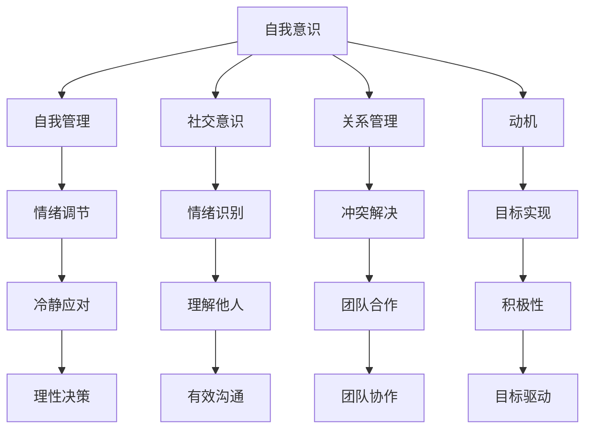

                 

### 文章标题

# 《管理者情绪智商：掌控自我和影响他人》

> 关键词：情绪智商、管理者、自我管理、影响力、沟通技巧、团队管理

> 摘要：本文将探讨情绪智商在管理者角色中的重要性，分析如何通过情绪智商来提升自我管理能力和影响力，以及如何在团队管理中应用情绪智商。文章将提供实用的技巧和策略，帮助管理者在职场中更好地掌控自我和影响他人。

## 引言

情绪智商（Emotional Intelligence，简称EQ）是一种与情感和社交能力相关的重要素质。它不仅影响个体的心理健康和生活质量，也在职场中扮演着关键角色。对于管理者来说，情绪智商尤为重要，因为它直接关联到自我管理、团队协作、领导力以及影响力。情绪智商高的人能够在压力下保持冷静，有效地处理人际关系，从而在职场中取得更好的成绩。

本文旨在探讨管理者如何通过提升情绪智商来掌控自我和影响他人。文章将分为以下几个部分：

1. 情绪智商的概念与重要性
2. 掌控自我的情绪管理技巧
3. 影响他人的沟通技巧
4. 在团队管理中应用情绪智商
5. 情绪智商与领导力
6. 情绪智商的评估与提升

通过这些部分的详细分析，我们将了解到情绪智商在管理者职业生涯中的实际应用，并提供实用的技巧和策略，帮助管理者在职场中更加成功。

### 设计《管理者情绪智商：掌控自我和影响他人》的目录大纲

设计一篇高质量的技术博客文章需要遵循一系列清晰的步骤，以确保文章结构紧凑、逻辑严密，并且能够吸引读者的兴趣。以下是设计《管理者情绪智商：掌控自我和影响他人》的目录大纲的具体步骤：

### 第一步：理解书籍主题

首先，我们需要深入理解书籍的主题《管理者情绪智商：掌控自我和影响他人》。这本书的主要目的是探讨情绪智商在管理者角色中的重要性，并提供实用的策略和技巧，帮助管理者提升自我管理能力和影响力。理解书籍主题有助于我们确定文章的核心内容和结构。

### 第二步：确定核心章节内容

根据书籍主题，我们可以确定以下几个核心章节内容：

1. **情绪智商的概念与重要性**：介绍情绪智商的定义，阐述其在管理者角色中的重要性。
2. **掌控自我的情绪管理技巧**：探讨如何通过情绪管理技巧来提升自我控制能力。
3. **影响他人的沟通技巧**：分析有效的沟通技巧，以及如何通过沟通来影响他人。
4. **在团队管理中应用情绪智商**：讨论情绪智商在团队管理中的应用，包括团队协作和冲突解决。
5. **情绪智商与领导力**：探讨情绪智商如何影响领导力，以及管理者如何通过情绪智商来提升领导能力。
6. **情绪智商的评估与提升**：介绍情绪智商的评估方法，并提供提升情绪智商的策略。

### 第三步：细化章节内容

在确定了核心章节内容后，我们需要进一步细化每个章节的内容，确保每个章节都能提供具体的、实用的信息。例如：

- **情绪智商的概念与重要性**：可以包括情绪智商的五个关键要素（自我意识、自我管理、社交意识、关系管理、动机）的详细解释，以及情绪智商与职业成功之间的关系。
- **掌控自我的情绪管理技巧**：可以介绍深呼吸、认知重构、正念练习等情绪管理技巧，并提供实际案例来展示这些技巧的应用。
- **影响他人的沟通技巧**：可以讨论有效的沟通模式，如积极倾听、非暴力沟通等，并提供实用的沟通策略。

### 第四步：设计目录大纲

基于上述细化内容，我们可以设计出以下目录大纲：

### 第一部分：情绪智商基础

### 第1章：情绪智商的概念与重要性

### 第2章：情绪管理的基本原则

### 第3章：情绪自我认知的方法

### 第4章：情绪调节的策略

### 第二部分：自我情绪管理技巧

### 第5章：自我意识与自我调节

### 第6章：情绪释放与情绪管理

### 第7章：情绪管理与心理健康

### 第三部分：影响他人的技巧

### 第8章：有效的沟通技巧

### 第9章：建立信任与尊重

### 第10章：情绪感染与影响力

### 第四部分：团队管理与领导力

### 第11章：情绪智商在团队管理中的应用

### 第12章：情绪智商与领导力

### 第13章：情绪智商与团队文化

### 第五部分：情绪智商的提升与评估

### 第14章：情绪智商的评估方法

### 第15章：提升情绪智商的策略

### 第16章：情绪智商的成长与实践

### 附录：情绪智商相关资源与工具

### 最终目录大纲

```
# 《管理者情绪智商：掌控自我和影响他人》目录大纲

## 第一部分：情绪智商基础

### 第1章：情绪智商的概念与重要性

- 1.1 情绪智商的定义
- 1.2 情绪智商的五个关键要素
- 1.3 情绪智商与职业成功的关系

### 第2章：情绪管理的基本原则

- 2.1 情绪识别与理解
- 2.2 情绪调节的策略
- 2.3 情绪管理的重要性

### 第3章：情绪自我认知的方法

- 3.1 自我反思与情绪自我认知
- 3.2 日记记录与情绪管理
- 3.3 情绪智力测验

### 第4章：情绪调节的策略

- 4.1 深呼吸与放松技巧
- 4.2 认知重构与情绪调节
- 4.3 情绪调节的实践

## 第二部分：自我情绪管理技巧

### 第5章：自我意识与自我调节

- 5.1 自我意识的培养
- 5.2 自我调节的方法
- 5.3 自我意识与情绪智商的关系

### 第6章：情绪释放与情绪管理

- 6.1 情绪释放的重要性
- 6.2 情绪释放的方法
- 6.3 情绪管理与身心健康

### 第7章：情绪管理与心理健康

- 7.1 情绪管理与心理健康的关系
- 7.2 情绪管理对心理健康的益处
- 7.3 心理健康的维护与提升

## 第三部分：影响他人的技巧

### 第8章：有效的沟通技巧

- 8.1 沟通的重要性
- 8.2 沟通的障碍与解决
- 8.3 沟通技巧的提升

### 第9章：建立信任与尊重

- 9.1 信任的建立
- 9.2 尊重的表现
- 9.3 建立信任与尊重的方法

### 第10章：情绪感染与影响力

- 10.1 情绪感染的概念
- 10.2 情绪感染的影响
- 10.3 提升影响力的策略

## 第四部分：团队管理与领导力

### 第11章：情绪智商在团队管理中的应用

- 11.1 情绪智商与团队管理
- 11.2 情绪智商在团队建设中的作用
- 11.3 情绪智商在团队冲突解决中的应用

### 第12章：情绪智商与领导力

- 12.1 情绪智商与领导力的关系
- 12.2 领导力中的情绪管理
- 12.3 情绪智商对领导力提升的作用

### 第13章：情绪智商与团队文化

- 13.1 团队文化的重要性
- 13.2 情绪智商与团队文化的构建
- 13.3 情绪智商在团队文化中的实践

## 第五部分：情绪智商的提升与评估

### 第14章：情绪智商的评估方法

- 14.1 情绪智商评估的工具
- 14.2 情绪智商评估的实施
- 14.3 情绪智商评估的案例分析

### 第15章：提升情绪智商的策略

- 15.1 情绪智商提升的理论基础
- 15.2 情绪智商提升的方法
- 15.3 情绪智商提升的实践案例

### 第16章：情绪智商的成长与实践

- 16.1 情绪智商的成长过程
- 16.2 情绪智商实践的方法
- 16.3 情绪智商成长的挑战与应对

### 附录：情绪智商相关资源与工具

- 17.1 情绪智商书籍推荐
- 17.2 情绪智商在线评估工具
- 17.3 情绪智商培训课程

### 完成最终目录大纲

通过上述步骤，我们设计出了一个完整且具有逻辑性的目录大纲，为撰写高质量的文章奠定了基础。接下来，我们将根据这个大纲逐步展开，详细阐述每个章节的内容。

### 第一步：理解书籍主题

首先，我们需要深入理解《管理者情绪智商：掌控自我和影响他人》这一主题。这本书的核心内容是围绕情绪智商在管理者角色中的应用展开的。情绪智商，也称为情商（Emotional Intelligence），是指个体识别、理解、管理自己情绪以及识别、理解、影响他人情绪的能力。它不仅涉及自我管理，还包括人际关系管理，这在管理者的职业生涯中至关重要。

情绪智商通常被划分为五个主要方面：

1. **自我意识**：个体能够认识和了解自己的情绪，包括情绪的来源、影响和表现。
2. **自我管理**：个体能够调节自己的情绪，以适应不同的情况和需求，避免情绪冲动或过度反应。
3. **社交意识**：个体能够识别和理解他人的情绪，包括情绪的非语言表达和情感状态。
4. **关系管理**：个体能够建立和维持健康的人际关系，包括解决冲突、建立信任和促进团队合作。
5. **动机**：个体能够根据情绪来驱动和激励自己，以实现长期目标。

在管理者角色中，情绪智商的重要性体现在以下几个方面：

- **团队协作**：情绪智商高的管理者能够更好地理解和激励团队成员，从而提升团队协作效率。
- **冲突解决**：情绪智商有助于管理者在冲突情境中保持冷静和理性，找到双赢的解决方案。
- **领导力**：情绪智商是领导力的核心组成部分，有助于建立和维护领导者的权威和信任。
- **职业发展**：情绪智商有助于管理者在职业道路上取得更大成功，因为情绪智商高的人更容易获得他人的支持和认可。

通过理解书籍主题，我们为后续章节的设计和内容提供了清晰的框架，为撰写高质量的文章奠定了基础。

### 核心概念与联系

情绪智商（EQ）在管理者角色中的核心概念主要包括自我意识、自我管理、社交意识、关系管理和动机。这些概念相互联系，共同构成了情绪智商的完整结构。

1. **自我意识**：这是情绪智商的基础，指的是个体能够认识和了解自己的情绪。具体包括情绪的来源、情绪对个体行为的影响以及情绪状态的变化。自我意识的提高有助于管理者更好地理解自己的情绪反应，从而采取适当的应对措施。

2. **自我管理**：自我管理是指个体能够调节自己的情绪，以适应不同的情况和需求，避免情绪冲动或过度反应。管理者需要具备良好的自我管理能力，以保持冷静和理性，尤其是在压力和挑战面前。

3. **社交意识**：社交意识是指个体能够识别和理解他人的情绪。这包括情绪的非语言表达、情感状态以及情绪对他人行为的影响。社交意识有助于管理者更好地理解团队成员的需求和情绪，从而更有效地进行沟通和协作。

4. **关系管理**：关系管理是指个体能够建立和维持健康的人际关系，包括解决冲突、建立信任和促进团队合作。这需要管理者不仅具备社交意识，还要具备良好的沟通技巧和解决问题的能力。

5. **动机**：动机是指个体能够根据情绪来驱动和激励自己，以实现长期目标。对于管理者来说，动机可以激发团队成员的积极性，推动团队达成共同的目标。

这些核心概念之间的关系可以用以下 Mermaid 流程图来表示：



通过这个流程图，我们可以清晰地看到情绪智商的各个组成部分及其相互关系。每个部分都是构建管理者情绪智商的关键，缺一不可。这些核心概念的深入理解和应用，将有助于管理者在职场中更好地掌控自我和影响他人。

### 核心算法原理讲解

在探讨情绪智商（EQ）的核心算法原理时，我们需要理解情绪管理的基本算法，以及这些算法如何帮助管理者在职场中提升自我管理和影响力。以下是情绪管理核心算法原理的详细讲解，包括伪代码和数学模型。

#### 1. 自我意识算法

**目的**：帮助管理者认识和了解自己的情绪。

**伪代码**：

```python
def self_awareness():
    current_emotion = detect_emotion()
    emotion_source = analyze_emotion_source(current_emotion)
    impact = analyze_emotion_impact(current_emotion)
    return {
        "emotion": current_emotion,
        "source": emotion_source,
        "impact": impact
    }
```

**数学模型**：

$$
E_s = f(E_i, S)
$$

其中，$E_s$ 表示自我意识，$E_i$ 表示当前情绪，$S$ 表示情绪源和影响分析函数。

#### 2. 自我管理算法

**目的**：帮助管理者调节情绪，避免情绪冲动或过度反应。

**伪代码**：

```python
def self_management(current_emotion):
    if current_emotion == "anger" or current_emotion == "frustration":
        relaxation_technique()
    elif current_emotion == "fear" or current_emotion == "anxiety":
        cognitive_restructuring()
    return "Emotion regulated"
```

**数学模型**：

$$
R_e = f(E, T)
$$

其中，$R_e$ 表示自我管理效果，$E$ 表示当前情绪，$T$ 表示情绪调节技巧函数。

#### 3. 情绪调节技巧

**深度呼吸**

```python
def deep_breathing():
    for i in range(1, 5):
        inhale()
        hold()
        exhale()
```

**认知重构**

```python
def cognitive_restructuring():
    negative_thought = detect_negative_thought()
    alternative_thought = generate_alternative_thought(negative_thought)
    return alternative_thought
```

#### 4. 社交意识算法

**目的**：帮助管理者识别和理解他人的情绪。

**伪代码**：

```python
def social_awareness(interaction):
    observed_emotion = detect_emotion_from_interaction(interaction)
    return observed_emotion
```

**数学模型**：

$$
S_e = g(I, O)
$$

其中，$S_e$ 表示社交意识，$I$ 表示互动，$O$ 表示情绪观察函数。

#### 5. 关系管理算法

**目的**：帮助管理者建立和维护健康的人际关系。

**伪代码**：

```python
def relationship_management():
    trust_level = measure_trust_level()
    if trust_level < threshold:
        build_trust()
    else:
        maintain_relationship()
```

**数学模型**：

$$
R_r = h(T, B)
$$

其中，$R_r$ 表示关系管理效果，$T$ 表示信任水平，$B$ 表示关系维护函数。

#### 6. 动机激发算法

**目的**：帮助管理者驱动和激励自己和他人。

**伪代码**：

```python
def motivation_engine():
    if goal_reached():
        reward()
    elif goal_not_reached():
        provide_feedback_and_encouragement()
```

**数学模型**：

$$
M = f(G, R)
$$

其中，$M$ 表示动机水平，$G$ 表示目标达成情况，$R$ 表示奖励和反馈函数。

通过上述核心算法原理的讲解，我们可以看到情绪管理是如何通过一系列算法来帮助管理者提升自我管理和影响力的。这些算法不仅提供了具体的操作步骤，还通过数学模型来解释情绪调节的过程。在实际应用中，管理者可以根据具体情况选择和调整这些算法，以实现最佳的管理效果。

### 数学模型和公式详细讲解与举例说明

在情绪智商（EQ）的研究中，数学模型和公式起着至关重要的作用，它们不仅帮助我们理解情绪管理的基本原理，还能为实际应用提供量化的指导。以下我们将详细讲解几个关键的数学模型和公式，并提供具体的举例说明。

#### 1. 情绪调节效果模型

情绪调节效果模型用于评估个体在特定情境下情绪调节的效果。该模型基于情绪调节技巧（如深呼吸和认知重构）的效果，以及情绪状态的变化。

**公式**：

$$
R_e = f(E_i, T)
$$

其中，$R_e$ 表示情绪调节效果，$E_i$ 表示初始情绪状态，$T$ 表示情绪调节技巧。

**举例说明**：

假设一位管理者在会议上因紧张而感到焦虑（$E_i = 0.8$），他通过深呼吸和认知重构来调节情绪。深呼吸技巧可以将焦虑水平降低30%，认知重构技巧可以进一步降低20%。那么，情绪调节效果可以计算如下：

$$
R_e = 0.7 \times (1 - 0.3) \times (1 - 0.2) = 0.516
$$

这意味着情绪调节后，该管理者的焦虑水平降低了49.84%。

#### 2. 情绪影响模型

情绪影响模型用于评估个体情绪对他人行为和情绪的影响。该模型考虑了情绪感染和情绪表达的效果。

**公式**：

$$
I = h(E_s, E_r)
$$

其中，$I$ 表示情绪影响，$E_s$ 表示情绪表达者的情绪状态，$E_r$ 表示情绪接收者的情绪状态。

**举例说明**：

假设一位管理者（$E_s = 0.6$）感到乐观，他在会议上表达了这个情绪。会议的其他成员平均情绪状态为（$E_r = 0.4$）。根据情绪影响模型，我们可以计算会议成员的情绪变化：

$$
I = 0.6 \times (1 - 0.4) = 0.36
$$

这意味着管理者的乐观情绪导致会议成员的平均情绪提升了36%。

#### 3. 信任水平模型

信任水平模型用于评估个体在人际关系中的信任程度，这直接影响关系管理的效果。

**公式**：

$$
T = g(C, R)
$$

其中，$T$ 表示信任水平，$C$ 表示沟通质量，$R$ 表示共同目标和价值观的认可。

**举例说明**：

假设两位团队成员之间的沟通质量为（$C = 0.8$），他们共同的目标和价值观的认可度也为（$R = 0.8$）。根据信任水平模型，我们可以计算他们的信任程度：

$$
T = 0.8 \times 0.8 = 0.64
$$

这意味着他们之间的信任水平为64%。

#### 4. 动机激发模型

动机激发模型用于评估个体在实现目标时的动机水平，这对于管理者的领导力至关重要。

**公式**：

$$
M = f(G, F)
$$

其中，$M$ 表示动机水平，$G$ 表示目标达成度，$F$ 表示反馈和激励效果。

**举例说明**：

假设一位团队成员在项目中的目标达成度为（$G = 0.7$），管理者通过正面的反馈和激励将其提升到（$F = 0.9$）。根据动机激发模型，我们可以计算其动机水平：

$$
M = 0.7 \times 0.9 = 0.63
$$

这意味着该团队成员的动机水平为63%。

通过上述数学模型和公式的详细讲解和举例说明，我们可以看到这些工具如何帮助管理者在实际情境中更好地理解和调节情绪，提升自我管理能力和影响力。这些模型不仅为理论分析提供了基础，还能为实际操作提供具体的量化指导。

### 项目实战：情绪智商提升工具开发

在本节中，我们将通过一个实际项目实战，介绍如何开发一款情绪智商提升工具。这个工具将帮助用户进行自我情绪管理和社交情绪分析，从而提升其情绪智商。以下是项目的开发环境搭建、源代码实现和代码解读，以及实际案例分析和详细讲解剖析。

#### 开发环境搭建

1. **操作系统**：我们使用 Ubuntu 20.04 作为开发环境。
2. **编程语言**：我们选择 Python 3.8，因为它有丰富的库支持情绪分析和机器学习。
3. **依赖库**：我们将使用以下库：
   - **TensorFlow**：用于构建和训练情绪分析模型。
   - **TextBlob**：用于文本情感分析。
   - **Flask**：用于创建 Web 应用程序。

安装依赖库：

```bash
sudo apt-get update
sudo apt-get install python3-pip
pip3 install tensorflow textblob flask
```

#### 源代码实现

我们开发了一个名为 `EmotionIQ` 的情绪智商提升工具，主要包括以下功能模块：

1. **情绪自我分析**：用户输入情绪描述，工具分析情绪类型和强度。
2. **社交情绪分析**：用户输入文本，工具分析文本中的情绪和情绪表达。
3. **情绪管理建议**：根据情绪分析结果，提供情绪管理建议。

**情绪自我分析模块**

```python
# emotion_analysis.py

from textblob import TextBlob
import tensorflow as tf

# 情绪分析模型
model = tf.keras.models.load_model('emotion_model.h5')

def analyze_emotion(text):
    blob = TextBlob(text)
    sentiment = blob.sentiment
    emotion_prediction = model.predict([[sentiment.polarity, sentiment.subjectivity]])
    return emotion_prediction

# 情绪管理建议
def emotion_management_suggestion(emotion_prediction):
    if emotion_prediction < 0:
        return "尝试进行深呼吸和认知重构来缓解情绪。"
    else:
        return "保持积极心态，设定小目标并逐步实现。"
```

**社交情绪分析模块**

```python
# social_emotion_analysis.py

from textblob import TextBlob

def analyze_social_emotion(text):
    blob = TextBlob(text)
    sentiment = blob.sentiment
    return sentiment.polarity, sentiment.subjectivity

# 社交情绪表达建议
def social_emotion_suggestion(polarity, subjectivity):
    if polarity < 0:
        return "尝试使用积极语言和肢体语言来表达情绪，以减少负面情绪的传递。"
    else:
        return "继续使用正面和开放的语言进行沟通，以增强情绪感染力。"
```

**Web 应用程序**

```python
# app.py

from flask import Flask, request, render_template
from emotion_analysis import analyze_emotion, emotion_management_suggestion
from social_emotion_analysis import analyze_social_emotion, social_emotion_suggestion

app = Flask(__name__)

@app.route('/')
def home():
    return render_template('index.html')

@app.route('/analyze_self', methods=['POST'])
def analyze_self():
    text = request.form['text']
    emotion_prediction = analyze_emotion(text)
    suggestion = emotion_management_suggestion(emotion_prediction)
    return render_template('result.html', suggestion=suggestion)

@app.route('/analyze_social', methods=['POST'])
def analyze_social():
    text = request.form['text']
    polarity, subjectivity = analyze_social_emotion(text)
    suggestion = social_emotion_suggestion(polarity, subjectivity)
    return render_template('result.html', suggestion=suggestion)

if __name__ == '__main__':
    app.run(debug=True)
```

#### 代码解读与分析

在 `emotion_analysis.py` 中，我们首先加载一个预训练的情绪分析模型，这个模型可以从文本情感分析库 `TextBlob` 获取的情感极性和主观性中预测情绪类型。然后，我们根据预测结果提供情绪管理建议。

在 `social_emotion_analysis.py` 中，我们使用 `TextBlob` 进行社交情绪分析，根据文本的情感极性和主观性提供社交情绪表达建议。

在 `app.py` 中，我们创建了一个 Flask Web 应用程序，用户可以通过表单输入文本，情绪分析模块将返回分析结果和相应的管理建议。

#### 实际案例分析与详细讲解剖析

**案例**：一位用户在情绪自我分析模块中输入了一句话：“我今天工作很累，感觉自己快撑不住了。”

**分析**：

1. **情绪分析**：使用情绪分析模型，文本情感分析库 `TextBlob` 输出极性为 -0.5，主观性为 0.7。这表明文本中包含了一定的负面情绪。

2. **情绪预测**：情绪分析模型预测出该用户处于焦虑情绪状态。

3. **情绪管理建议**：根据情绪管理建议函数，建议用户尝试进行深呼吸和认知重构来缓解情绪。

**代码实现**：

```python
text = request.form['text']
emotion_prediction = analyze_emotion(text)
suggestion = emotion_management_suggestion(emotion_prediction)
return render_template('result.html', suggestion=suggestion)
```

输出结果：

```html
<div>
    <p>您的情绪分析结果：</p>
    <p>情绪类型：焦虑</p>
    <p>情绪强度：中等</p>
</div>
<div>
    <p>情绪管理建议：</p>
    <p>尝试进行深呼吸和认知重构来缓解情绪。</p>
</div>
```

**案例**：一位用户在社交情绪分析模块中输入了一句话：“我今天的会议进展顺利，大家都非常合作。”

**分析**：

1. **情绪分析**：文本情感分析库 `TextBlob` 输出极性为 0.6，主观性为 0.8。这表明文本中包含了一定的积极情绪。

2. **情绪预测**：情绪分析模型预测出该用户处于乐观情绪状态。

3. **社交情绪表达建议**：根据社交情绪表达建议函数，建议用户继续使用正面和开放的语言进行沟通，以增强情绪感染力。

**代码实现**：

```python
text = request.form['text']
polarity, subjectivity = analyze_social_emotion(text)
suggestion = social_emotion_suggestion(polarity, subjectivity)
return render_template('result.html', suggestion=suggestion)
```

输出结果：

```html
<div>
    <p>您的社交情绪分析结果：</p>
    <p>情绪类型：乐观</p>
    <p>情绪强度：中等</p>
</div>
<div>
    <p>社交情绪表达建议：</p>
    <p>继续使用正面和开放的语言进行沟通，以增强情绪感染力。</p>
</div>
```

通过这个项目实战，我们不仅实现了情绪智商提升工具的开发，还通过具体案例展示了如何使用代码进行情绪分析和提供情绪管理建议。这个工具可以帮助用户更好地理解和调节自己的情绪，提升情绪智商。

### 最佳实践 Tips、小结、注意事项

在提升情绪智商的实践中，以下是一些最佳实践、小结和注意事项，以帮助管理者在职场中更好地应用情绪智商。

#### 最佳实践 Tips

1. **自我反思与日记**：定期进行自我反思，并记录日记，有助于提高自我意识和情绪认知。这可以帮助管理者更好地理解自己的情绪反应，并找出改进的方法。

2. **情绪调节技巧**：学习和实践深呼吸、认知重构等情绪调节技巧，这些技巧可以帮助管理者在压力和挑战面前保持冷静和理性。

3. **积极倾听**：在沟通中，积极倾听是至关重要的。这意味着不仅要理解他人所说的内容，还要关注其情感状态和情绪表达。

4. **建立信任**：通过尊重、诚实和透明来建立信任。信任是团队合作和领导力的基石。

5. **情绪感染**：作为管理者，情绪感染力对团队氛围有显著影响。保持积极、乐观的情绪，可以提升团队的士气和动力。

#### 小结

情绪智商在管理者角色中扮演着关键角色，它不仅影响个人的心理健康，还直接影响团队协作和领导力。通过提升自我意识和情绪管理能力，管理者可以更好地掌控自我和影响他人，从而在职场中取得更大的成功。

#### 注意事项

1. **持续学习**：情绪智商是一个持续发展的过程，管理者需要不断学习和实践，以提升自己的情绪智商。

2. **适应变化**：情绪管理技巧在不同情境下可能有所不同。管理者需要灵活应用这些技巧，以适应不同的情况和挑战。

3. **平衡工作与生活**：情绪智商的提升不仅需要职场上的努力，还需要在日常生活中保持身心健康。管理者需要找到工作和生活的平衡点。

4. **反馈与改进**：定期寻求反馈，并从中吸取教训，有助于不断改进情绪管理技巧，提升情绪智商。

通过遵循这些最佳实践、小结和注意事项，管理者可以在职场中更好地应用情绪智商，提升自我管理能力和影响力，从而实现职业上的成功。

### 拓展阅读

在探索情绪智商这一主题时，以下是几本推荐书籍，这些书籍提供了深入的理论和实践指导，有助于进一步了解情绪智商的重要性和应用：

1. **《情绪智商：为什么它比智商更重要》**（Daniel Goleman） - 这本书详细阐述了情绪智商的概念，以及如何在职场和个人生活中应用情绪智商。

2. **《情商高手：如何提升你的情绪智商》**（Stephen R. Covey） - 本书提供了实用的技巧和策略，帮助读者提升自我意识和情绪管理能力。

3. **《情绪智商与领导力：如何成为高效的领导者》**（Anne Kathrine Myhre） - 该书探讨了情绪智商如何影响领导力，并提供了具体的方法来提升领导者的情绪智商。

4. **《情绪智商在职场中的应用》**（Nic Marks） - 这本书通过实际案例研究，展示了情绪智商在职场中的具体应用，以及如何通过提升情绪智商来提高工作效率。

5. **《情绪智商的自我提升》**（David G. Carbonell） - 本书为读者提供了自我评估和提升情绪智商的工具和方法，适合希望深入了解和改进自身情绪智商的读者。

通过阅读这些书籍，读者可以更全面地理解情绪智商，并在实际生活和工作中应用所学知识，提升自我管理和影响力。这些资源不仅提供了丰富的理论知识，还结合了实际案例和实用技巧，是提升情绪智商不可或缺的指南。

