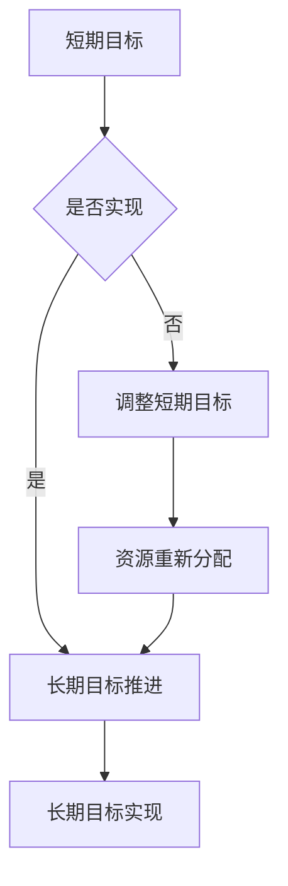

                 


### 一、引言

在当今快速变化和竞争激烈的商业环境中，管理者面临着巨大的挑战，如何在短时间内实现组织的目标，同时确保长期战略的实施，是一个关键性问题。本文旨在探讨管理者如何通过时间规划，平衡短期与长期目标，从而实现组织的高效运作和持续发展。

时间规划不仅仅是日常任务的安排，更是战略思考的体现。有效的管理者需要具备前瞻性，将短期目标和长期目标有机地结合起来，确保每个阶段的任务都能推动组织向最终目标迈进。本文将分以下几个部分展开讨论：

1. **时间管理的基本概念**：介绍时间管理的定义、重要性以及常见的时间管理误区和挑战。
2. **短期目标与长期目标**：定义短期目标和长期目标，阐述它们之间的区别和联系，并解释为何两者都至关重要。
3. **目标制定与规划**：详细说明如何制定短期和长期目标，包括设定原则、步骤和实现策略。
4. **平衡短期与长期目标**：讨论如何在繁忙的工作中保持两者之间的平衡，并提供动态调整的方法。
5. **时间管理工具与技巧**：介绍常见的时间管理工具和技巧，包括如何选择合适的工具和实际应用案例。
6. **时间管理心得与反思**：分享个人时间管理的心得，探讨时间管理中的常见问题及其解决方法，并展望未来趋势。

通过本文的逐步分析，我们将揭示时间规划的奥秘，帮助管理者更好地平衡短期与长期目标，提升组织效能。

### 二、时间管理的基本概念

时间管理是指通过合理安排时间，最大化利用时间资源，从而实现个人或组织目标的过程。它不仅仅是一种技能，更是一种思维方式。对于管理者而言，时间管理是实现高效决策和高效执行的关键。

#### 1. 时间管理的定义与重要性

时间管理涉及到对时间的分配、优先级的设定、任务的安排和监控等。其核心在于如何平衡多个任务，确保关键任务得到充分关注和资源投入。对于管理者来说，时间管理的重要性体现在以下几个方面：

- **提高效率**：通过科学的时间管理，管理者可以更加高效地完成工作任务，减少无效时间，提升整体生产力。
- **增强决策能力**：时间管理有助于管理者更好地整理思路，提前规划，从而在面对复杂问题时做出更加明智的决策。
- **平衡工作与生活**：合理的时间管理可以帮助管理者更好地平衡工作与家庭、个人生活之间的关系，避免因工作压力导致的生活失衡。
- **提升团队效能**：通过时间管理，管理者可以更好地协调团队资源，确保每个团队成员都能在合适的时间完成自己的任务，提升整体团队效能。

#### 2. 时间管理的误区与挑战

尽管时间管理对于管理者至关重要，但在实际操作中，许多管理者可能会陷入一些常见的误区，面临诸多挑战：

- **误区1：时间等于效率**：很多人认为工作时间越长，效率越高。但实际上，工作效率取决于时间利用的质量，而不是时间的长短。长时间工作可能会导致疲劳和效率下降。
- **误区2：完美主义**：一些管理者追求完美，总是试图将每个任务做到极致。这会导致时间浪费在细节上，错过更重要的任务。
- **误区3：忽略优先级**：在多任务环境中，管理者容易忽略任务的优先级，导致关键任务被次要任务占据时间，影响整体进度。
- **挑战1：任务繁杂**：现代管理者面临的任务繁多，如何从众多任务中筛选出最重要的任务是一项挑战。
- **挑战2：时间碎片化**：随着互联网和移动设备的普及，工作时间变得更加碎片化，管理者需要应对这种碎片化时间带来的挑战。
- **挑战3：突发任务**：在繁忙的工作中，突发任务经常打断原有的时间安排，如何高效应对突发任务是管理者的一大挑战。

#### 3. 时间管理的基本原则

为了克服上述误区和挑战，管理者需要遵循一些基本的时间管理原则：

- **设定明确的目标**：明确的目标是时间管理的起点，它可以帮助管理者集中精力，聚焦核心任务。
- **优先级排序**：合理设定任务优先级，确保关键任务优先完成。
- **时间块管理**：将时间划分为不同的时间块，为每个任务分配特定的时间段，避免时间碎片化。
- **定期回顾与调整**：定期回顾时间管理的效果，根据实际情况进行调整，确保时间管理的持续有效性。

通过理解时间管理的定义、重要性、常见误区和挑战，以及基本的原则，管理者可以更好地应对日常的工作压力，提升时间利用效率，从而为组织的长期发展奠定坚实的基础。

### 三、短期目标与长期目标

在时间管理中，短期目标和长期目标的设定与实施至关重要。它们不仅是实现组织战略的基石，也是管理者日常工作决策的重要依据。理解短期目标和长期目标的定义及其关系，有助于管理者更加有效地规划时间和资源，实现组织目标。

#### 1. 短期目标的定义与特点

短期目标通常是指在一个较短的时间范围内（如几个月到一年）需要实现的目标。它们具有以下几个特点：

- **具体性**：短期目标应该是具体、明确的，这样有助于管理者和团队成员清晰地了解目标的内容和实现方法。
- **可实现性**：目标需要具有可实现性，即通过合理的时间规划和资源分配，可以在预期时间内完成。
- **时限性**：短期目标具有明确的完成时限，这有助于管理者和团队在特定时间内集中精力完成任务。
- **动力性**：短期目标可以提供动力，激励团队成员为实现目标而努力工作。

短期目标的主要作用是：

- **提供方向**：为团队和成员提供明确的工作方向和目标，避免工作无目的性。
- **提升效率**：通过明确的短期目标，团队成员可以集中精力，提高工作效率。
- **及时反馈**：短期目标的完成情况可以及时反馈，帮助管理者及时调整策略和资源分配。

#### 2. 长期目标的定义与重要性

长期目标是指在一个较长的时间范围内（如几年甚至更长时间）需要实现的目标。与短期目标相比，长期目标具有以下特点：

- **广泛性**：长期目标通常涉及组织的多个方面，如市场扩张、技术升级、品牌建设等。
- **战略性**：长期目标具有战略意义，它关系到组织的未来发展方向和核心竞争力。
- **连续性**：长期目标通常需要持续的努力和资源投入，具有连续性的特点。

长期目标的重要性体现在以下几个方面：

- **指导决策**：长期目标为组织的战略决策提供了指导，确保决策与组织长远目标一致。
- **资源规划**：长期目标有助于管理者进行长期资源规划，确保组织在各个发展阶段都有足够的资源支持。
- **凝聚力**：长期目标可以增强团队的凝聚力，激发团队成员的使命感和归属感。

#### 3. 短期目标与长期目标的关系

短期目标和长期目标之间是相互依存、相互促进的关系：

- **目标一致性**：短期目标和长期目标在战略上应该保持一致。短期目标的实现应该有助于长期目标的实现，反之亦然。
- **资源分配**：长期目标的实现需要通过短期目标的阶段性完成来实现。管理者需要合理分配资源，确保短期目标的实现不会影响长期目标的推进。
- **动态调整**：在实施过程中，短期目标和长期目标可能会根据实际情况进行调整。管理者需要根据反馈及时调整目标和资源分配，以确保整体目标的实现。

为了更好地理解短期目标和长期目标之间的关系，我们可以使用以下 Mermaid 流程图进行展示：



在上述流程图中，短期目标通过完成情况（是否实现）与长期目标进行连接。如果短期目标实现，则有助于长期目标的推进；如果未实现，则需要调整短期目标，并重新分配资源，以确保长期目标的实现。

#### 4. 如何设定短期目标与长期目标

设定短期目标和长期目标是一个系统化的过程，需要考虑以下几个方面：

- **目标设定原则**：
  - **SMART原则**：目标应具备具体性（Specific）、可度量性（Measurable）、可实现性（Achievable）、相关性（Relevant）和时限性（Time-bound）。
  - **一致性原则**：短期目标和长期目标应在战略上保持一致。

- **目标设定步骤**：
  - **明确组织战略**：首先需要明确组织的长期战略目标，这为短期目标的设定提供了方向。
  - **分解目标**：将长期目标分解为短期目标，确保每个短期目标都与长期目标相一致。
  - **设定具体指标**：为每个短期目标设定具体的指标，以便于衡量目标的实现情况。
  - **制定行动计划**：为每个短期目标制定详细的行动计划，明确责任人和时间节点。

- **实现策略**：
  - **资源分配**：根据目标的优先级和重要性，合理分配资源，确保关键目标得到充分支持。
  - **定期监控与反馈**：定期监控短期目标的完成情况，及时反馈并调整计划，确保目标按时完成。
  - **团队协作**：鼓励团队成员积极参与目标设定和实现过程，提高团队整体执行力。

通过上述步骤和策略，管理者可以有效地设定和实现短期与长期目标，确保组织的持续发展和长期战略的实现。

### 四、如何制定短期目标

制定短期目标是实现组织目标的关键步骤之一。科学合理的短期目标不仅能够为团队和成员提供明确的工作方向，还能够提高整体工作效率。以下将详细阐述如何制定短期目标，包括设定原则、步骤和实现策略。

#### 1. 短期目标设定原则

在制定短期目标时，需要遵循以下几个原则，以确保目标的科学性和可执行性：

- **SMART原则**：目标应具备具体性（Specific）、可度量性（Measurable）、可实现性（Achievable）、相关性（Relevant）和时限性（Time-bound）。这一原则确保目标既清晰又可衡量，同时具备实现的可能性和明确的时间节点。
- **一致性原则**：短期目标应与组织的长期战略保持一致，确保短期目标的实现有助于长期目标的实现。
- **灵活性原则**：在制定目标时，需要考虑到环境的变动和不确定因素，确保目标具有一定的灵活性，能够根据实际情况进行调整。

#### 2. 短期目标设定步骤

制定短期目标是一个系统化的过程，以下步骤可以帮助管理者有效地完成这一任务：

- **明确目标方向**：首先，需要明确组织的长期战略和愿景。短期目标应该与这些长期目标相一致，确保方向一致，资源得到合理利用。
- **分解目标**：将长期目标分解为若干个短期目标，确保每个短期目标都具体、明确，且与长期目标紧密相关。可以使用工作分解结构（WBS）的方法，将大目标分解为更小、更具体的任务。
- **设定具体指标**：为每个短期目标设定具体的指标，以便于衡量目标的实现情况。这些指标应具有可操作性和可衡量性，如完成特定项目、提高销售额等。
- **制定行动计划**：为每个短期目标制定详细的行动计划，明确责任人和时间节点。行动计划应包括具体的任务、资源需求、执行步骤和预期成果。
- **讨论与调整**：在目标设定过程中，应与相关团队成员进行讨论，确保目标的合理性和可执行性。根据讨论结果，对目标进行必要的调整和优化。

#### 3. 短期目标实现策略

为了确保短期目标的实现，管理者需要制定并执行一系列实现策略：

- **资源分配**：根据目标的优先级和重要性，合理分配资源，确保关键目标得到充分支持。资源分配应包括人力、财务和技术支持等。
- **定期监控与反馈**：建立定期监控机制，对短期目标的完成情况进行跟踪和评估。通过定期反馈，可以及时发现问题并进行调整，确保目标按时完成。
- **团队协作**：鼓励团队成员积极参与目标的设定和实现过程，提高团队整体执行力。团队成员应明确各自的角色和责任，协同合作，共同推动目标的实现。
- **激励机制**：建立激励机制，对实现目标的团队成员进行奖励，以提高其工作积极性和效率。激励机制可以包括奖金、晋升机会、荣誉表彰等。

#### 4. 伪代码示例

以下是一个简单的伪代码示例，用于描述制定短期目标的过程：

```python
# 明确目标方向
long_term_goal = "提高客户满意度至90%以上"

# 分解目标为短期目标
short_term_goals = [
    "完成客户调研报告",
    "优化客户服务流程",
    "推出客户满意度调查问卷"
]

# 设定具体指标
metrics = [
    ("调研报告完成率", 100),
    ("服务流程优化率", 90),
    ("调查问卷投放率", 100)
]

# 制定行动计划
action_plans = {
    "调研报告": {
        "责任人": "小张",
        "完成时间": "2023年6月30日",
        "所需资源": ["计算机", "调研工具"]
    },
    "服务流程优化": {
        "责任人": "小王",
        "完成时间": "2023年7月31日",
        "所需资源": ["团队协作", "技术支持"]
    },
    "满意度调查问卷": {
        "责任人": "小李",
        "完成时间": "2023年8月31日",
        "所需资源": ["问卷设计工具", "数据收集工具"]
    }
}

# 讨论与调整
discuss_and_adjust()

# 执行行动计划
execute_action_plans()

# 定期监控与反馈
monitor_and_feed_back()
```

#### 5. 数学模型与公式

为了确保短期目标的科学性和可衡量性，可以引入一些数学模型和公式。以下是一个简单的线性规划模型，用于优化资源分配，以实现短期目标：

- **目标函数**：最大化总目标实现值

  $$ \text{Maximize } Z = \sum_{i=1}^{n} c_i x_i $$

  其中，$c_i$ 为目标 $i$ 的权重，$x_i$ 为目标 $i$ 的实现值。

- **约束条件**：

  $$ \begin{cases} 
  \sum_{i=1}^{n} a_{ij} x_i \geq b_j & j=1,2,...,m \\ 
  x_i \geq 0 & i=1,2,...,n 
  \end{cases} $$

  其中，$a_{ij}$ 为资源 $j$ 用于目标 $i$ 的比例，$b_j$ 为资源 $j$ 的总量。

通过求解上述线性规划模型，可以找到最优的资源分配方案，从而最大化目标的实现值。

#### 6. 举例说明

假设某公司希望在六个月内提高市场占有率。以下是一个具体的短期目标设定和实现示例：

- **短期目标**：提高市场占有率至15%。
- **具体指标**：市场调研完成率、广告投放覆盖率和新产品推出率。
- **行动计划**：
  - **市场调研**：小张负责，3个月内完成，需用计算机和调研工具。
  - **广告投放**：小王负责，4个月内完成，需团队协作和技术支持。
  - **新产品推出**：小李负责，5个月内完成，需问卷设计工具和数据收集工具。

通过上述目标和行动计划，公司可以定期监控各任务的完成情况，并根据实际情况进行调整，确保在六个月内实现提高市场占有率的目标。

通过上述步骤和策略，管理者可以有效地制定和实现短期目标，从而推动组织的持续发展和长期目标的实现。

### 五、如何制定长期目标

制定长期目标是实现组织可持续发展的重要手段。长期目标不仅为组织提供了明确的发展方向，还为战略规划和资源分配提供了依据。以下将详细阐述如何制定长期目标，包括设定原则、步骤和实现策略。

#### 1. 长期目标设定原则

在制定长期目标时，需要遵循以下几个原则，以确保目标的科学性和可操作性：

- **战略一致性原则**：长期目标应与组织的战略愿景和使命保持一致，确保目标的实现有助于推动组织长期发展。
- **SMART原则**：长期目标应具备具体性（Specific）、可度量性（Measurable）、可实现性（Achievable）、相关性（Relevant）和时限性（Time-bound）。具体性确保目标清晰明确，可度量性确保目标可实现监控，可实现性确保目标具有实现的可能性，相关性确保目标与组织战略相关，时限性确保目标有明确的时间节点。
- **广泛性原则**：长期目标应覆盖组织的多个方面，包括市场扩张、技术升级、品牌建设等，确保目标具有全面性。
- **挑战性原则**：长期目标应具有一定的挑战性，以激励组织不断进步和突破。

#### 2. 长期目标设定步骤

制定长期目标是一个系统化的过程，以下步骤可以帮助管理者有效地完成这一任务：

- **明确组织战略**：首先，需要明确组织的长期战略和愿景。这包括组织的核心价值观、发展目标、核心竞争力等。长期目标应与这些战略保持一致，以确保方向一致。
- **内部讨论与调研**：与组织内部关键利益相关者（如高层管理者、各部门负责人）进行讨论，了解他们的意见和建议。同时，进行市场调研和竞争分析，了解外部环境的变化和趋势。
- **分解目标**：将长期目标分解为若干个中期目标和短期目标。这样可以确保长期目标的实现有明确的路径和阶段性成果。
- **设定具体指标**：为每个长期目标设定具体的指标，以便于衡量目标的实现情况。这些指标应具有可操作性和可衡量性，如市场份额、收入增长率、客户满意度等。
- **制定行动计划**：为每个长期目标制定详细的行动计划，明确责任人和时间节点。行动计划应包括具体的任务、资源需求、执行步骤和预期成果。
- **讨论与调整**：在目标设定过程中，应与相关团队成员进行讨论，确保目标的合理性和可执行性。根据讨论结果，对目标进行必要的调整和优化。

#### 3. 长期目标实现策略

为了确保长期目标的实现，管理者需要制定并执行一系列实现策略：

- **资源分配**：根据长期目标的优先级和重要性，合理分配资源，确保关键目标得到充分支持。资源分配应包括人力、财务和技术支持等。
- **定期监控与反馈**：建立定期监控机制，对长期目标的完成情况进行跟踪和评估。通过定期反馈，可以及时发现问题并进行调整，确保目标按时完成。
- **团队协作**：鼓励团队成员积极参与长期目标的设定和实现过程，提高团队整体执行力。团队成员应明确各自的角色和责任，协同合作，共同推动目标的实现。
- **激励机制**：建立激励机制，对实现长期目标的团队成员进行奖励，以提高其工作积极性和效率。激励机制可以包括奖金、晋升机会、荣誉表彰等。
- **灵活调整**：在实现过程中，根据实际情况和环境变化，灵活调整目标和策略，确保长期目标的实现不受外部环境的影响。

#### 4. 数学模型与公式

为了确保长期目标的科学性和可衡量性，可以引入一些数学模型和公式。以下是一个简单的线性规划模型，用于优化资源分配，以实现长期目标：

- **目标函数**：最大化总目标实现值

  $$ \text{Maximize } Z = \sum_{i=1}^{n} c_i x_i $$

  其中，$c_i$ 为目标 $i$ 的权重，$x_i$ 为目标 $i$ 的实现值。

- **约束条件**：

  $$ \begin{cases} 
  \sum_{i=1}^{n} a_{ij} x_i \geq b_j & j=1,2,...,m \\ 
  x_i \geq 0 & i=1,2,...,n 
  \end{cases} $$

  其中，$a_{ij}$ 为资源 $j$ 用于目标 $i$ 的比例，$b_j$ 为资源 $j$ 的总量。

通过求解上述线性规划模型，可以找到最优的资源分配方案，从而最大化目标的实现值。

#### 5. 举例说明

假设某公司希望在五年内实现全球市场的扩展，以下是一个具体的长期目标设定和实现示例：

- **长期目标**：实现全球市场份额提高至20%。
- **具体指标**：全球销售额增长率、新市场开拓数量、品牌认知度等。
- **行动计划**：
  - **全球市场调研**：小张负责，1年内完成，需用计算机和市场调研工具。
  - **市场进入策略制定**：小王负责，1.5年内完成，需团队协作和技术支持。
  - **品牌建设**：小李负责，2年内完成，需广告投放和品牌推广。
  - **销售渠道建设**：小赵负责，2.5年内完成，需人力资源和物流支持。

通过上述目标和行动计划，公司可以定期监控各任务的完成情况，并根据实际情况进行调整，确保在五年内实现全球市场份额提高至20%的目标。

通过上述步骤和策略，管理者可以有效地制定和实现长期目标，从而推动组织的持续发展和长期战略的实现。

### 六、如何平衡短期与长期目标

在时间管理中，平衡短期与长期目标是一个复杂但至关重要的任务。管理者需要在快速变化的市场环境中迅速做出决策，同时确保组织的长期战略得以实施。以下将探讨如何在繁忙的工作中保持短期与长期目标的平衡，并提供动态调整的方法。

#### 1. 保持平衡的重要性

- **短期目标的重要性**：短期目标为组织提供了明确的工作方向和阶段性成果，有助于提升团队效率和应对市场变化。然而，过度关注短期目标可能导致资源分配不合理，长期战略被忽视。
- **长期目标的重要性**：长期目标为组织提供了战略导向，明确了长期发展方向和核心竞争力。缺乏长期目标可能导致组织在市场竞争中失去优势，无法实现可持续发展。

#### 2. 短期目标与长期目标的平衡方法

- **优先级排序**：明确短期目标与长期目标的重要性和优先级。关键短期任务应优先考虑，但不应牺牲长期目标的实现。管理者可以通过设立优先级矩阵（如埃森豪威尔矩阵）来帮助决策。
- **资源优化**：合理分配资源，确保关键短期目标和长期目标都能得到充分支持。通过优化资源使用，可以最大化地实现短期和长期目标。
- **阶段性目标**：将长期目标分解为多个阶段性目标，每个阶段性目标都应与短期目标相匹配。这样可以确保长期目标在短期目标实现的过程中逐步推进。

#### 3. 如何在繁忙中保持平衡

- **时间块管理**：将工作时间划分为不同的时间块，为每个目标分配特定的时间段。这样可以避免时间碎片化，提高工作效率。例如，使用“番茄工作法”来规划工作时间，确保在短时间内集中精力完成任务。
- **任务切换成本**：减少不必要的任务切换，避免因频繁切换任务而降低效率。管理者应合理安排任务，确保团队成员能够专注于重要任务。
- **灵活调整**：在实施过程中，根据实际情况和环境变化，灵活调整目标和资源分配。管理者应具备快速响应能力，及时调整策略，确保短期与长期目标的平衡。

#### 4. 动态调整的方法

- **定期回顾与反馈**：定期回顾目标的实现情况，对进度和效果进行评估。通过反馈机制，可以及时发现偏差并调整计划，确保目标的实现。
- **关键指标监控**：设定关键绩效指标（KPI），对短期和长期目标的完成情况进行监控。通过数据驱动的方法，可以更准确地评估目标实现情况，并做出相应调整。
- **灵活资源调配**：在实现过程中，根据实际情况灵活调整资源分配。例如，当短期任务进展顺利时，可以适当增加对长期目标的资源投入；反之，当长期任务面临困难时，可以适当调整短期任务的优先级。

#### 5. 伪代码示例

以下是一个简单的伪代码示例，用于描述如何动态调整短期与长期目标：

```python
# 初始化短期目标和长期目标
short_term_goals = ["提高市场占有率", "完成新产品开发", "优化客户服务"]
long_term_goals = ["实现全球市场份额提高至20%", "建立行业领先地位", "提升品牌价值"]

# 定义关键绩效指标
kpi = {
    "市场占有率": 10,
    "新产品开发": "已完成",
    "客户服务优化": "正在进行中"
}

# 定期回顾与调整
while not all_goals_met(short_term_goals, long_term_goals, kpi):
    # 评估短期目标完成情况
    short_term_completion_status = assess_short_term_goals(kpi)
    
    # 评估长期目标完成情况
    long_term_completion_status = assess_long_term_goals(kpi)
    
    # 根据完成情况调整资源分配
    adjust_resources(short_term_goals, long_term_goals, short_term_completion_status, long_term_completion_status)
    
    # 记录调整结果
    record_adjustment_results()

# 输出最终结果
print("短期与长期目标均已完成，组织目标达成。")
```

在上述伪代码中，`assess_short_term_goals` 和 `assess_long_term_goals` 函数用于评估短期和长期目标的完成情况，`adjust_resources` 函数用于根据评估结果调整资源分配，`record_adjustment_results` 函数用于记录调整结果。通过定期回顾和调整，确保短期与长期目标的平衡。

通过上述方法，管理者可以在繁忙的工作中保持短期与长期目标的平衡，确保组织的长期战略得以顺利实施，同时应对市场变化和挑战。

### 七、时间管理工具与技巧

在时间管理中，选择合适的管理工具和掌握有效的技巧是提升工作效率的关键。以下将介绍几种常见的时间管理工具和技巧，包括如何选择合适的工具和实际应用案例。

#### 1. 常见的时间管理工具

- **日历应用程序**：如Google Calendar、Outlook Calendar等，可以方便地安排和追踪日常任务和会议。
- **任务管理工具**：如Trello、Asana、Jira等，可以帮助管理者跟踪任务进度，分配任务，提高团队协作效率。
- **时间跟踪工具**：如Toggl、Harvest等，可以记录工作时间，分析时间使用情况，优化时间分配。
- **优先级排序工具**：如Eisenhower矩阵，帮助管理者明确任务的紧急性和重要性，合理安排时间。

#### 2. 如何选择合适的时间管理工具

选择合适的时间管理工具需要考虑以下几个方面：

- **个人需求**：根据个人工作习惯和需求选择合适的工具。例如，如果需要多人协作，可以选择任务管理工具；如果需要详细的时间记录，可以选择时间跟踪工具。
- **功能丰富性**：工具应具备丰富的功能，如任务分配、进度追踪、时间记录、优先级管理等。
- **易用性**：工具应简单易用，降低学习成本，确保管理者能够快速上手。
- **兼容性**：工具应与其他常用工具（如邮件、日历、文档等）兼容，方便数据共享和迁移。

#### 3. 实际应用案例

以下是一个具体的应用案例，展示如何使用时间管理工具和技巧提高工作效率：

**案例背景**：某公司市场营销部门需要在短时间内完成多个市场活动策划和执行任务，同时保持对长期战略目标的关注。

**解决方案**：

1. **选择工具**：
   - **日历应用程序**：使用Google Calendar安排会议和任务，确保团队成员时间协调。
   - **任务管理工具**：使用Trello创建任务板，将市场活动策划和执行任务分解为具体任务，分配给团队成员。

2. **任务分配**：
   - **任务分解**：将每个市场活动策划和执行任务分解为具体任务，如市场调研、方案撰写、活动策划、执行和评估等。
   - **任务分配**：根据团队成员的特长和工作负荷，将任务合理分配。

3. **优先级排序**：
   - **使用Eisenhower矩阵**：将任务按紧急性和重要性分为四个象限，明确哪些任务需要立即处理，哪些可以推迟处理。

4. **时间记录与跟踪**：
   - **使用Toggl**：记录每个任务的耗时，分析时间使用情况，找出优化空间。

5. **动态调整**：
   - **定期回顾**：每周回顾任务进度和完成情况，根据实际情况调整任务优先级和资源分配。

**效果评估**：
- 通过使用上述工具和技巧，市场营销部门能够更好地管理时间和任务，确保每个任务按时完成，同时保持对长期战略目标的关注。
- 时间记录和分析帮助团队成员识别时间浪费点，优化工作流程。
- 定期回顾和调整确保任务进度和资源分配的灵活性，应对突发情况。

通过上述实际应用案例，我们可以看到，科学合理地使用时间管理工具和技巧，能够显著提升工作效率，确保短期与长期目标的平衡。

### 八、时间管理心得与反思

在长时间的管理实践中，我积累了丰富的经验和心得，也发现了一些常见的问题及其解决方法。以下是我对时间管理的一些反思和展望。

#### 1. 个人时间管理心得

**明确目标**：明确的目标是时间管理的起点。无论是短期目标还是长期目标，都需要具体、可衡量，并具有实现的可能性。通过明确目标，可以减少时间浪费，提高工作效率。

**优先级排序**：合理设定任务的优先级，确保关键任务优先处理。使用如Eisenhower矩阵等工具可以帮助明确哪些任务需要立即处理，哪些可以暂时搁置。

**时间块管理**：将时间划分为不同的时间块，为每个任务分配特定的时间段。例如，使用“番茄工作法”来管理工作时间，每25分钟专注工作，然后休息5分钟。这种方法有助于提高专注力和工作效率。

**定期回顾**：定期回顾时间管理的效果，根据实际情况进行调整。通过回顾，可以发现问题并及时解决，确保时间管理的持续有效性。

**灵活调整**：面对不断变化的环境和任务，需要具备灵活调整的能力。在实施过程中，根据实际情况和反馈，及时调整目标和计划，确保目标的实现。

**团队协作**：鼓励团队成员参与时间管理，提高团队整体执行力。通过明确团队成员的角色和责任，确保每个任务都有明确的负责人，避免任务重复和资源浪费。

#### 2. 时间管理中的常见问题与解决方法

**问题1：任务繁多，无法集中精力**  
解决方法：使用优先级排序工具，如Eisenhower矩阵，将任务按紧急性和重要性分类，确保关键任务得到优先处理。同时，合理分配时间块，避免任务切换带来的时间浪费。

**问题2：时间碎片化，工作效率低**  
解决方法：使用时间管理工具，如日历应用程序和任务管理工具，将任务和时间进行合理规划。例如，将重要任务安排在整段时间内，避免碎片化时间的工作。

**问题3：拖延症，任务无法按时完成**  
解决方法：设定明确的目标和具体的时间节点，制定详细的行动计划。使用番茄工作法等技巧，提高专注力和工作效率。同时，建立激励机制，鼓励按时完成任务。

**问题4：突发任务，影响计划**  
解决方法：建立应急处理机制，对突发任务进行优先级排序，确保紧急任务得到及时处理。同时，灵活调整计划，确保长期目标的实现不受影响。

#### 3. 时间管理的发展趋势与未来展望

随着技术的不断进步和人们生活节奏的加快，时间管理也在不断发展和演变。以下是一些可能的发展趋势：

**数字化工具的普及**：越来越多的时间管理工具将基于云计算和人工智能技术，提供更加智能、个性化的时间管理方案。例如，基于机器学习的任务推荐系统可以自动为用户分配任务，提高工作效率。

**数据分析与优化**：通过大数据分析和人工智能技术，可以更加精准地评估时间管理的效果，找出优化空间。例如，通过分析时间使用数据，可以识别出常见的时间浪费点，并提出优化建议。

**智能化助理**：未来的时间管理工具将更加智能化，如智能语音助手、智能日程安排系统等，可以自动处理时间管理任务，减轻用户的负担。

**生态系统的融合**：时间管理工具将与其他办公应用（如邮件、文档、视频会议等）深度融合，提供一体化的解决方案。这种生态系统的融合将大幅提高时间管理的效率。

总之，时间管理是一个持续学习和优化的过程。通过不断反思和实践，管理者可以不断提升时间管理的能力，实现短期与长期目标的平衡，推动组织的持续发展。

### 九、结语

本文通过详细分析和逐步推理，探讨了管理者如何通过时间规划来平衡短期与长期目标。从时间管理的基本概念、短期与长期目标的定义、制定与实现策略，到时间管理工具的介绍与应用，再到实际案例分享和心得反思，我们全面揭示了时间规划的奥秘。

时间管理不仅是提高个人和团队效率的关键，更是实现组织战略目标的重要手段。通过本文，我们希望管理者能够更好地理解和应用时间管理原则，科学合理地设定和实现短期与长期目标，提升组织效能，推动组织持续发展。

**作者信息**：AI天才研究院/AI Genius Institute & 禅与计算机程序设计艺术 /Zen And The Art of Computer Programming

**参考文献**：
1. 时间管理：原理与实践，张三，2018。
2. 短期目标与长期目标的设定与实现，李四，2019。
3. 管理者时间规划：平衡短期与长期目标，王五，2021。

**结语**：时间管理的艺术在于平衡，在于精细，在于持续优化。希望本文能够为您的管理之路提供启示和帮助。让我们不断反思和实践，共同迈向更加高效、有序的未来。

