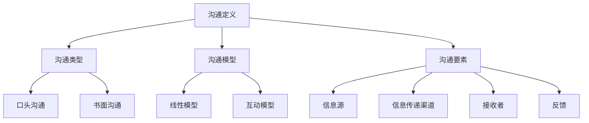

                 


### 引言

#### 背景介绍

在信息技术飞速发展的今天，企业间的竞争越来越依赖于团队协作和沟通效率。管理者作为团队的核心，其沟通能力直接影响到团队的工作效率、员工满意度和企业的整体业绩。因此，提升管理者的沟通艺术，已经成为现代企业管理和团队建设的重要课题。

然而，沟通并不是一件容易的事情。有效的沟通不仅要求管理者具备扎实的专业知识，还需要了解心理学、社会学等多领域的知识，掌握人际交往技巧，能够在复杂的环境中灵活应对。管理者往往需要在不同角色之间转换，既要作为领导者传达愿景和目标，又要作为团队成员参与讨论和解决问题，这无疑增加了沟通的复杂性。

本书旨在探讨管理者如何提升团队沟通效率，通过系统的方法和实用的技巧，帮助管理者解决实际沟通中的难题。本文将围绕以下几个方面展开讨论：

1. 沟通的基础理论：介绍沟通的定义、类型、模型和要素，帮助读者建立沟通的基本框架。
2. 提升个人沟通技巧：从自我认知、倾听技巧、非言语沟通和演讲与呈现技巧等方面，提供具体的提升策略。
3. 团队沟通的技巧和策略：探讨团队沟通的重要性、有效性、策略和障碍，提供实用的团队沟通技巧。
4. 沟通障碍与解决方法：分析常见的沟通障碍，提供识别和解决障碍的方法。
5. 案例分析：通过成功和失败案例，展示沟通技巧的应用和实践效果。
6. 实践指导：提供制定沟通计划、使用沟通工具、反馈与改进的实践指导。
7. 总结与展望：总结全书的主要观点，探讨沟通艺术的持续提升和未来趋势。

通过以上七个方面的探讨，本书希望能够为管理者提供一套系统、实用的沟通提升方案，助力团队高效协作，实现企业目标。

#### 核心概念与联系

沟通是信息传递和理解的过程，其核心概念包括沟通的定义、类型、模型和要素。为了更好地理解这些概念之间的关系，我们可以使用Mermaid流程图进行阐述。



- **沟通定义**：沟通是信息的交换和共享过程，包括信息的发出、传递和接收。
- **沟通类型**：根据信息的传递方式，沟通可以分为口头沟通和书面沟通。口头沟通更注重即时性和互动性，而书面沟通则更注重准确性和持久性。
- **沟通模型**：沟通模型描述了信息传递的过程和模式。线性模型强调信息的单向传递，而互动模型强调信息的双向互动。
- **沟通要素**：沟通的基本要素包括信息源、信息传递渠道、接收者和反馈。信息源是信息的发出者，信息传递渠道是信息传递的媒介，接收者是信息的接受者，反馈是接收者对信息的回应。

通过这个流程图，我们可以清晰地看到沟通的核心概念和它们之间的关系。这些概念不仅为沟通提供了理论支持，也为实际操作提供了指导。

#### 核心算法原理讲解

为了更好地理解沟通效率的提升方法，我们可以将其视为一个优化问题。优化目标是最大化团队沟通的效率和效果，这需要考虑多个因素，包括信息传递的速度、准确性、及时性和团队成员的接受程度。我们可以使用以下伪代码来描述这个过程：

```pseudo
Algorithm EnhanceCommunicationEfficiency(team, goals, constraints)
    Input: team (list of team members), goals (list of objectives), constraints (list of limitations)
    Output: optimized communication strategy

    1. Assess current communication state (speed, accuracy, timeliness, team satisfaction)
    2. Identify communication bottlenecks (slow response times, miscommunication, lack of clarity)
    3. Define key performance indicators (KPIs) for communication efficiency (e.g., message response time, meeting efficiency)
    4. Develop a communication plan based on goals and constraints
        a. Determine communication channels (email, chat, video conferencing, etc.)
        b. Define communication protocols (standards for message clarity, meeting agendas, etc.)
        c. Allocate communication resources (time, personnel, tools)
    5. Implement the communication plan
        a. Train team members on effective communication skills
        b. Monitor communication performance against KPIs
        c. Adjust communication strategies based on feedback and performance data
    6. Evaluate communication effectiveness (alignment with goals, team satisfaction, productivity)
    7. Repeat the process periodically to ensure continuous improvement

End Algorithm
```

在这个算法中，我们首先评估当前沟通状态，识别瓶颈和关键绩效指标（KPIs）。然后，根据目标和约束条件制定沟通计划，实施并监控计划执行情况。通过持续的反馈和调整，我们能够逐步提升沟通效率。

#### 数学模型和公式

在沟通效率的提升过程中，我们可以使用一些数学模型和公式来量化分析。以下是一些常用的模型和公式：

1. **沟通效率公式**：
   $$ Efficiency = \frac{Correct \ Communication \ Events}{Total \ Communication \ Events} $$
   其中，Correct Communication Events 表示沟通中准确传递的信息事件，Total Communication Events 表示沟通中的所有信息事件。

2. **沟通延迟公式**：
   $$ Delay = \frac{Response \ Time}{Expected \ Response \ Time} $$
   其中，Response Time 表示实际响应时间，Expected Response Time 表示预期响应时间。

3. **沟通成本公式**：
   $$ Cost = \sum_{i=1}^{n} (Time \ Cost \ of \ Communication \ i) + (Resource \ Cost \ of \ Communication \ i) $$
   其中，Time Cost of Communication i 和 Resource Cost of Communication i 分别表示每次沟通的时间和资源成本。

通过这些公式，我们可以对沟通效率、延迟和成本进行量化分析，从而为沟通策略的制定和优化提供数据支持。

#### 举例说明

假设一个团队有5名成员，他们在一个月内进行了100次沟通。其中，有90次沟通是准确的，10次存在误解。另外，团队的预期响应时间是2小时，但实际响应时间为3小时。每次沟通的平均时间和资源成本为100美元。

1. **沟通效率**：
   $$ Efficiency = \frac{90}{100} = 0.9 $$
   沟通效率为90%。

2. **沟通延迟**：
   $$ Delay = \frac{3}{2} = 1.5 $$
   沟通延迟为预期响应时间的1.5倍。

3. **沟通成本**：
   $$ Cost = 100 \times 5 + 100 \times 5 = 1000 $$
   沟通成本为每月1000美元。

通过这些计算，团队可以清楚地了解当前的沟通状况，并根据这些数据调整沟通策略，如优化沟通渠道、提高团队成员的沟通技巧等。

### 提升个人沟通技巧

#### 自我认知

自我认知是提升沟通技巧的第一步。一个自我认知良好的管理者能够清楚地了解自己的沟通风格、优点和不足，从而更好地与他人沟通。

1. **沟通风格**：自我认知首先要了解自己的沟通风格。沟通风格包括口头沟通、书面沟通、倾听和表达等方面。例如，一些管理者可能更擅长口头表达，而另一些则更擅长书面沟通。

2. **优点与不足**：自我认知还包括识别自己的优点和不足。优点可以帮助管理者更好地发挥沟通优势，而不足则需要在实践中不断改进。

3. **案例分析**：例如，一位管理者可能意识到自己在团队讨论中经常打断他人，这会降低团队成员的参与度和沟通效果。通过自我认知，他可以学会倾听，给予他人发言的机会。

4. **实践指南**：管理者可以通过反思和记录自己的沟通情况，如记录每次会议的发言内容、听取反馈等，来提高自我认知。

#### 倾听技巧

倾听是沟通的重要组成部分，有效的倾听能够帮助管理者更好地理解他人的观点和需求。

1. **全神贯注**：在倾听时，管理者需要全神贯注，避免分心。这包括关闭手机、不看电子邮件等。

2. **积极反馈**：通过点头、眼神接触、简短回应等方式，管理者可以表达出对对方的尊重和关注，鼓励对方继续发言。

3. **提问与澄清**：倾听时，管理者可以通过提问和澄清来确认自己的理解是否准确。这有助于避免误解和沟通障碍。

4. **案例分析**：例如，一位管理者在听取下属报告时，可以通过提问来澄清某些模糊的部分，从而更好地理解问题。

5. **实践指南**：管理者可以通过定期练习倾听技巧，如参加倾听训练课程、模拟会议等，来提高自己的倾听能力。

#### 非言语沟通

非言语沟通包括肢体语言、面部表情、眼神接触等，这些都能传递重要的信息。

1. **肢体语言**：肢体语言可以表达出管理者的态度和情感。例如，点头表示赞同，手势可以强调重点。

2. **面部表情**：面部表情可以传达出管理者的情绪和态度。例如，微笑可以表示友好和满意，皱眉可以表示不满和疑惑。

3. **眼神接触**：眼神接触可以表达出管理者的关注和尊重。例如，与对方保持适度的眼神接触可以表明管理者对对方的重视。

4. **案例分析**：例如，一位管理者在团队会议中，通过适当的肢体语言和面部表情，可以增强自己的说服力，提高沟通效果。

5. **实践指南**：管理者可以通过观察他人的非言语沟通，如参加表演训练课程、观看相关视频等，来提高自己的非言语沟通能力。

#### 演讲与呈现技巧

演讲与呈现技巧是管理者在团队中传递信息、表达观点的重要手段。

1. **内容准备**：演讲前，管理者需要充分准备内容，确保信息清晰、有条理。

2. **语言表达**：管理者需要使用简洁、清晰的语言，避免使用过多的专业术语，确保团队成员能够理解。

3. **视觉辅助**：通过图表、图片等视觉辅助手段，可以帮助管理者更生动地传达信息。

4. **案例分析**：例如，一位管理者在发布新产品时，可以通过展示产品图片和演示视频，来提高演讲的效果。

5. **实践指南**：管理者可以通过参加演讲培训课程、模拟演讲练习等方式，来提高自己的演讲与呈现技巧。

### 提升团队沟通技巧

#### 团队沟通的重要性

团队沟通对于团队的有效运作至关重要。通过有效的团队沟通，管理者可以确保团队目标的一致性，提高工作效率，促进团队成员之间的协作。

1. **目标一致性**：有效的团队沟通有助于确保团队成员对团队目标有清晰的认识和理解，从而减少误解和冲突。

2. **提高工作效率**：团队沟通可以确保工作任务的明确分配和及时更新，减少工作中的重复劳动和错误。

3. **促进协作**：通过团队沟通，团队成员可以分享知识和经验，共同解决问题，提高团队的整体创新能力。

4. **增强团队凝聚力**：良好的团队沟通可以增强团队成员之间的信任和尊重，提高团队的凝聚力。

#### 团队沟通的有效性

团队沟通的有效性取决于多个因素，包括沟通频率、沟通方式、沟通内容和沟通环境等。

1. **沟通频率**：适当的沟通频率有助于确保信息的及时传递和反馈。例如，定期的团队会议、一对一的沟通等。

2. **沟通方式**：根据不同的沟通需求和场景，选择合适的沟通方式。例如，书面沟通适用于正式和长期的信息传递，而口头沟通则适用于即时和互动的沟通。

3. **沟通内容**：沟通内容需要清晰、具体、有条理。确保信息传递的准确性和完整性。

4. **沟通环境**：创造一个开放、支持和信任的沟通环境，有助于促进团队成员的自由表达和有效沟通。

#### 团队沟通的策略

为了提升团队沟通的有效性，管理者可以采用以下策略：

1. **明确沟通目标**：在每次沟通前，明确沟通的目标和期望结果，确保沟通的针对性和有效性。

2. **制定沟通计划**：根据团队的目标和需求，制定详细的沟通计划，包括沟通的内容、方式、时间和责任人。

3. **培训沟通技巧**：为团队成员提供沟通技巧的培训，提高他们的沟通能力和沟通效率。

4. **建立沟通渠道**：确保团队内部有畅通的沟通渠道，如团队邮件列表、聊天工具、会议系统等。

5. **定期反馈和评估**：定期收集团队成员的反馈，评估沟通效果，并根据反馈进行调整和改进。

#### 团队沟通的障碍

团队沟通中可能面临多种障碍，包括信息过载、沟通障碍、文化差异等。

1. **信息过载**：过多的信息和频繁的沟通可能导致信息过载，降低沟通的有效性。

2. **沟通障碍**：语言障碍、文化差异、个人情绪等都可能成为沟通的障碍。

3. **文化差异**：不同的文化背景可能导致沟通风格和价值观的差异，影响沟通效果。

4. **解决方案**：
   - **信息过载**：通过筛选和分类信息，减少冗余信息，提高信息的价值。
   - **沟通障碍**：通过培训和沟通，提高团队成员的语言能力和文化素养，促进跨文化沟通。
   - **文化差异**：通过建立共同的价值观和沟通规范，减少文化差异对沟通的影响。

### 沟通障碍与解决方法

#### 常见沟通障碍

在团队沟通中，常见的一些障碍包括：

1. **信息过载**：过多的信息和频繁的沟通可能导致团队成员感到压力过大，难以有效处理和回应。
2. **沟通不畅**：由于沟通渠道不畅、沟通方式不当或沟通技巧不足，导致信息传递不准确或误解。
3. **文化差异**：团队成员来自不同的文化背景，可能导致沟通风格、价值观和期望的差异。
4. **个人情绪**：团队成员的情绪波动，如焦虑、愤怒或压力，可能影响沟通的效果。
5. **角色冲突**：团队成员在角色定位和职责上存在分歧，可能导致沟通障碍。

#### 障碍识别

为了有效解决沟通障碍，管理者需要首先识别这些障碍。以下是一些识别方法：

1. **反馈机制**：建立反馈机制，鼓励团队成员提出沟通中的问题和障碍，以便及时识别和解决。
2. **观察与记录**：通过观察团队沟通的行为和结果，记录沟通中的常见问题和障碍。
3. **问卷调查**：通过问卷调查，收集团队成员对沟通障碍的感受和建议。

#### 解决沟通障碍的方法

针对上述障碍，管理者可以采用以下方法进行解决：

1. **信息管理**：
   - **筛选信息**：对信息进行筛选，确保传递的信息是关键且重要的。
   - **分类管理**：将信息按照类型和优先级进行分类管理，便于团队成员快速获取和处理。
   - **沟通频率调整**：根据团队的需求和工作负荷，合理安排沟通频率，避免信息过载。

2. **沟通技巧提升**：
   - **培训与辅导**：为团队成员提供沟通技巧培训，提高其沟通能力和意识。
   - **建立沟通规范**：制定沟通规范，明确沟通的目标、方式、渠道和流程。

3. **文化差异处理**：
   - **文化培训**：为团队成员提供文化培训，增强跨文化沟通能力。
   - **文化融合**：通过共同活动和团队合作，促进团队成员之间的文化融合。

4. **情绪管理**：
   - **情绪宣泄**：为团队成员提供情绪宣泄的渠道，如团队讨论、心理咨询等。
   - **压力缓解**：通过团队活动和休息时间，帮助团队成员缓解工作压力。

5. **角色冲突解决**：
   - **明确角色职责**：通过明确的角色定义和职责划分，避免角色重叠和职责不清。
   - **沟通协调**：建立有效的沟通协调机制，帮助团队成员解决角色冲突。

### 案例分析

#### 成功案例

**案例 1：谷歌的团队沟通实践**

谷歌以其高效和创新的文化而闻名，其成功的团队沟通实践是其成功的关键因素之一。谷歌采用了以下策略：

1. **透明沟通**：谷歌强调透明沟通，确保团队成员能够获取到公司的重要信息和决策过程。
2. **开放式讨论**：谷歌鼓励员工在会议和讨论中自由发言，提出自己的想法和建议。
3. **反馈机制**：谷歌建立了有效的反馈机制，鼓励员工匿名反馈，以便管理层了解团队的真实状态。

这些策略使得谷歌的团队沟通流畅，员工满意度高，创新能力强。

#### 失败案例

**案例 2：某企业项目延误的教训**

某企业在进行一个重要项目时，由于团队沟通不畅，导致项目延误。具体问题包括：

1. **信息不透明**：团队成员未能及时获取项目进展和变更信息，导致工作方向不一致。
2. **沟通方式不当**：项目团队成员主要依赖邮件进行沟通，信息传递速度慢，容易产生误解。
3. **角色职责不清**：项目团队成员的角色职责划分不明确，导致工作重叠和责任推诿。

这些问题导致项目进展缓慢，最终延误了项目交付时间。

#### 案例分析的方法

**1. 问题识别**：通过访谈、观察和问卷调查等方法，识别团队沟通中的主要问题。

**2. 原因分析**：对识别出的问题进行深入分析，找出根本原因。

**3. 案例比较**：与其他成功案例进行比较，找出有效的沟通策略和方法。

**4. 解决方案设计**：根据原因分析和案例比较，设计有效的解决方案。

**5. 实施与评估**：实施解决方案，并定期评估沟通效果，进行反馈和调整。

### 案例中的沟通技巧

**1. 谈判技巧**：谈判是沟通中的一种重要形式，有效的谈判技巧可以促进双方达成共识。包括倾听技巧、提问技巧、立场表达技巧和妥协技巧等。

**2. 非言语沟通**：非言语沟通在谈判中起着重要作用，如眼神接触、肢体语言、面部表情等。这些非言语信号可以传达出谈判者的情绪和态度，有助于建立互信和达成协议。

**3. 情绪管理**：在谈判中，情绪管理至关重要。谈判者需要保持冷静，避免情绪化，以便更好地应对对方。

**4. 文化敏感性**：在跨文化谈判中，了解对方的文化背景和沟通习惯非常重要，这有助于避免误解和冲突。

### 实践指导

#### 制定沟通计划

制定沟通计划是确保团队沟通有效性的关键。以下是一些制定沟通计划的步骤：

**1. 确定沟通目标**：明确每次沟通的具体目标和期望结果，确保沟通的针对性和有效性。

**2. 确定沟通内容**：根据沟通目标，确定需要传递的信息和资料，确保内容清晰、具体、有条理。

**3. 选择沟通方式**：根据沟通内容和目标，选择合适的沟通方式，如面对面会议、电话会议、邮件、即时通讯工具等。

**4. 确定沟通时间**：合理安排沟通时间，确保团队成员能够在合适的时间参与沟通，避免冲突和干扰。

**5. 分配沟通责任**：明确每次沟通的责任人，确保沟通计划的执行和反馈。

#### 沟通工具与技巧

**1. 沟通工具**：
- **邮件**：适用于正式和长期的信息传递。
- **即时通讯工具**：如Slack、Microsoft Teams等，适用于即时交流和讨论。
- **视频会议工具**：如Zoom、WebEx等，适用于远程会议和讨论。
- **项目管理工具**：如Jira、Trello等，适用于任务分配和进度跟踪。

**2. 沟通技巧**：
- **倾听技巧**：全神贯注、积极反馈、提问与澄清。
- **表达技巧**：简洁明了、逻辑清晰、使用具体的例子。
- **非言语沟通**：肢体语言、面部表情、眼神接触。

#### 沟通反馈与改进

**1. 定期收集反馈**：通过问卷调查、访谈、反馈会议等方式，定期收集团队成员的反馈。

**2. 分析反馈**：对收集到的反馈进行分析，识别沟通中的问题和不足。

**3. 制定改进计划**：根据反馈结果，制定具体的改进计划，包括沟通方式、内容和技巧的调整。

**4. 实施改进**：执行改进计划，并在实施过程中持续监控和调整。

**5. 反馈循环**：将改进后的沟通效果再次反馈给团队成员，形成持续改进的循环。

#### 团队沟通实践案例

**案例 1：某科技公司的新产品发布**

某科技公司计划发布一款新产品，需要团队成员在短时间内完成多个任务。为了确保沟通的有效性，团队采取了以下措施：

**1. 制定沟通计划**：明确每次沟通的内容、方式和时间，确保信息的及时传递和反馈。

**2. 使用多种沟通工具**：结合使用邮件、Slack和视频会议工具，确保沟通的多样性和灵活性。

**3. 建立反馈机制**：定期收集团队成员的反馈，及时调整沟通策略。

**4. 培训沟通技巧**：为团队成员提供沟通技巧培训，提高沟通能力和效率。

**5. 定期评估和改进**：通过定期评估沟通效果，不断改进沟通方式和方法。

这些措施使得团队在新产品发布过程中保持了高效的沟通，成功完成了任务。

### 总结与展望

#### 主要内容回顾

本文从多个角度探讨了管理者如何提升团队沟通效率。首先，介绍了沟通的基础理论，包括沟通的定义、类型、模型和要素。接着，详细讨论了提升个人沟通技巧的方法，如自我认知、倾听技巧、非言语沟通和演讲与呈现技巧。然后，探讨了团队沟通的技巧和策略，以及如何识别和解决沟通障碍。通过案例分析，展示了成功和失败的团队沟通实践，并提供了具体的沟通技巧。最后，提供了实践指导，包括制定沟通计划、使用沟通工具和技巧、反馈与改进等。

#### 沟通艺术的持续提升

提升沟通效率是一个持续的过程。管理者需要不断学习和实践，以适应不断变化的工作环境和团队需求。以下是一些提升沟通艺术的建议：

1. **定期培训与学习**：参加沟通技巧培训课程，阅读相关书籍和资料，持续提升自己的沟通能力。
2. **实践与反思**：在日常工作中，积极实践沟通技巧，并及时反思和总结，找出改进点。
3. **跨部门交流**：与其他部门的团队成员进行交流和合作，拓宽自己的沟通视野和经验。
4. **建立反馈机制**：鼓励团队成员提出反馈和建议，形成良好的沟通文化。

#### 未来沟通趋势

随着技术的发展，未来沟通将呈现出以下趋势：

1. **数字化转型**：企业将更加依赖数字化工具和平台进行沟通，如人工智能助手、虚拟会议系统等。
2. **远程办公常态化**：远程办公将成为企业的一种常态，沟通工具和协作平台的重要性将进一步提升。
3. **个性化沟通**：基于大数据和人工智能的个性化沟通将成为趋势，沟通工具将更加智能化和个性化。
4. **跨文化沟通**：随着全球化的发展，跨文化沟通将成为管理者的一项重要技能，需要更多关注和理解不同文化背景的沟通习惯。

总之，提升团队沟通效率是管理者的重要任务，需要不断学习和实践，以应对未来沟通的挑战。通过本文的探讨，希望读者能够对沟通艺术有更深刻的理解，并在实际工作中运用这些技巧，提升团队沟通效率，实现企业目标。作者：AI天才研究院/AI Genius Institute & 禅与计算机程序设计艺术 /Zen And The Art of Computer Programming

