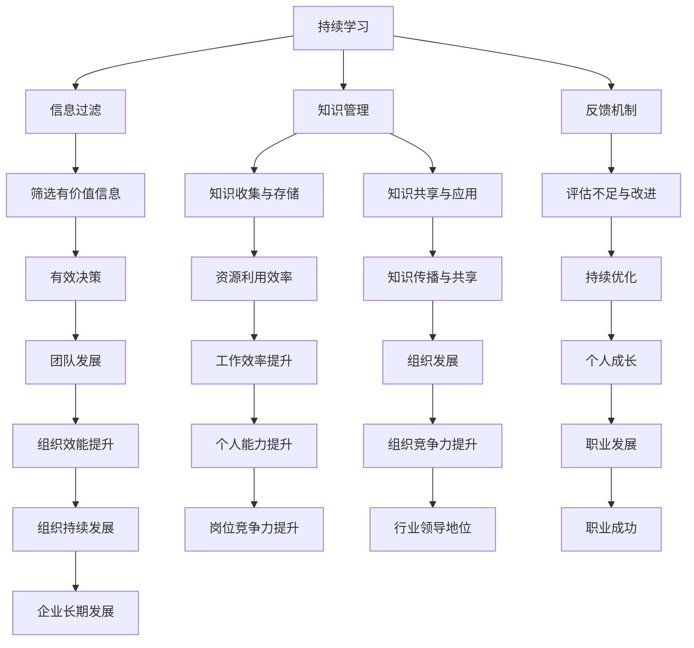
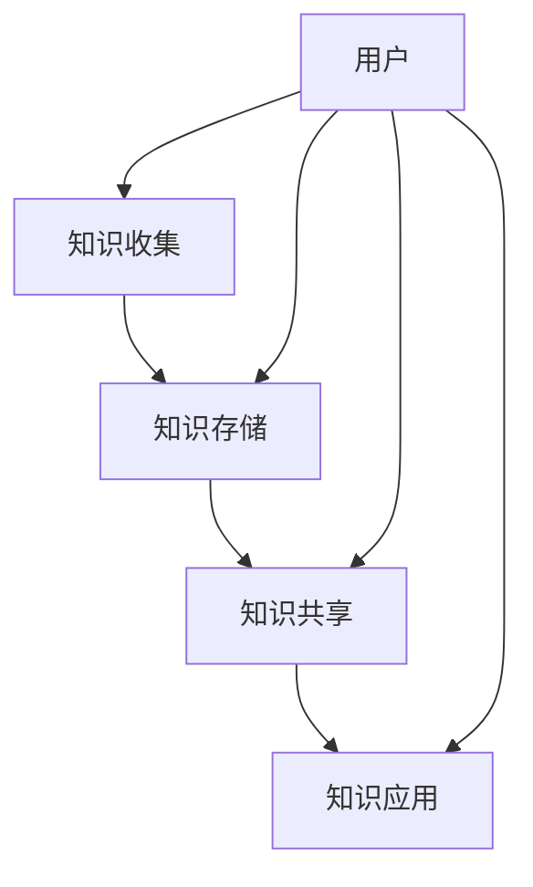

                 

### 引言

在当今快速发展的信息时代，知识更新的速度前所未有地加快，这对各类职业人员，尤其是管理者，提出了巨大的挑战。作为团队的核心和中坚力量，管理者不仅需要具备卓越的领导能力和战略思维，更要拥有持续学习和知识更新的能力。管理者的学习能力，不仅仅关乎个人的职业成长，更直接影响着团队和组织的竞争力。

**1.1 管理者的学习需求**

管理者的角色决定了他们需要面对的是一个不断变化和更新的环境。他们不仅要掌握最新的管理理念和方法，还需要紧跟技术进步的步伐，了解行业前沿的发展趋势。此外，随着全球化进程的加快，管理者还必须具备跨文化的沟通和管理能力。因此，管理者需要具备强烈的学习欲望和持续的学习能力，以应对复杂多变的商业环境和市场竞争。

**1.2 知识更新的重要性**

知识更新的重要性体现在多个方面。首先，知识的更新可以帮助管理者保持对行业动态的敏锐洞察，从而做出更为精准的决策。其次，不断学习可以提升管理者的个人素质和职业竞争力，使其在职场中更具优势。此外，知识更新还能促进团队的创新和进步，带动整个组织的持续发展。

**1.3 本书的目的和结构**

本书旨在帮助管理者掌握有效的知识更新方法，提升学习能力，从而在职业生涯中取得更好的成绩。本书的结构安排如下：

- **第1章 引言**：介绍管理者的学习需求和知识更新的重要性，明确本书的目的和结构。

- **第2章 核心概念与联系**：阐述学习能力和知识更新的核心概念，并使用Mermaid流程图展示它们之间的关系。

- **第3章 管理者学习策略**：探讨管理者应如何制定有效的学习策略，包括主动学习的原则、时间管理技巧和学习资源的利用。

- **第4章 核心算法原理讲解**：深入讲解信息过滤算法、知识管理系统和学习评估与反馈机制。

- **第5章 数学模型和数学公式**：介绍基本的学习模型和更新策略的数学公式，并进行详细讲解和举例说明。

- **第6章 项目实战：知识管理系统的开发**：通过一个知识管理系统的开发项目，讲解开发环境搭建、源代码实现和代码解读。

- **第7章 持续学习的文化建设**：探讨如何建立学习型组织，结合学习与绩效评估，推动组织的持续发展。

通过以上章节的逐步讲解，本书希望帮助管理者建立起一套完整的知识更新体系，提升自身的学习能力，从而在职业发展中取得更大的成功。

### 核心概念与联系

要深入了解管理者的学习能力，我们首先需要明确几个核心概念，并探讨它们之间的内在联系。这些核心概念包括学习能力的定义、知识更新的核心要素以及它们之间的关系架构。

#### 2.1 学习能力的定义

学习能力是指个体在获取、理解、应用、分析、评估和创造知识方面的能力。它不仅涉及知识获取的效率，还包括如何将所学知识应用到实际问题中。对于管理者来说，学习能力尤为重要，因为他们的决策和领导行为直接影响着团队和组织的发展。

#### 2.2 知识更新的核心要素

知识更新的核心要素包括以下几个方面：

- **持续学习**：管理者需要具备持续学习的意识和习惯，通过阅读书籍、参加培训、在线课程等多种途径不断充实自己。

- **信息过滤**：在获取大量信息时，管理者需要具备信息过滤的能力，筛选出真正有价值的信息，避免陷入信息过载的困境。

- **知识管理**：知识管理是知识更新的关键环节，它包括知识的收集、存储、共享和应用，通过有效的知识管理系统，管理者可以更好地利用和组织知识资源。

- **反馈机制**：有效的反馈机制可以帮助管理者及时了解自身知识和能力的不足，并进行针对性的改进。

#### 2.3 学习能力的Mermaid流程图

为了更直观地展示学习能力的概念及其相互关系，我们使用Mermaid语法绘制一个流程图。以下是流程图的示例：



在上述流程图中，持续学习是整个流程的起点，它通过信息过滤、知识管理、反馈机制等环节，最终实现知识的有效应用，推动个人和组织的成长与发展。这个流程图不仅展示了各个核心概念之间的关系，还强调了持续学习在知识更新过程中的重要性。

通过以上核心概念的阐述和Mermaid流程图的展示，我们可以更清晰地理解管理者的学习能力，并认识到知识更新对于管理者个人和组织发展的关键作用。接下来的章节将深入探讨管理者如何利用这些核心概念和流程，提升自身的知识更新能力。

### 管理者学习策略

为了在快速变化的环境中保持竞争力，管理者需要制定并执行一系列有效的学习策略。这些策略不仅有助于提升个人的知识储备，还能推动团队和组织的发展。以下是一些关键的学习策略：

#### 3.1 主动学习的原则

主动学习是管理者学习策略的基础。主动学习强调个体在知识获取过程中的积极参与和自主性，而不是被动地接受信息。以下是一些主动学习的原则：

- **设定明确的学习目标**：管理者应明确自己的学习目标，确保学习活动具有针对性和有效性。

- **定期反思**：通过定期反思，管理者可以评估自己的学习进度，调整学习策略，确保学习目标的实现。

- **积极参与**：积极参与培训、研讨会和行业交流，通过实践和互动加深对知识的理解。

- **利用多种学习资源**：充分利用书籍、在线课程、专业论坛和社交媒体等资源，扩大知识视野。

#### 3.2 时间管理技巧

有效的时间管理是确保学习活动持续进行的重要保障。以下是一些时间管理技巧：

- **制定学习计划**：制定详细的学习计划，将学习时间分配到每一天或每一周，确保学习活动的规律性。

- **设定优先级**：将学习任务按照重要性和紧急性进行排序，优先完成最重要或最紧急的任务。

- **避免多任务处理**：避免在同一时间内处理多个任务，这会导致注意力分散，降低学习效果。

- **利用碎片时间**：充分利用碎片时间进行学习，如通勤时间、休息时间等。

#### 3.3 学习资源的利用

有效利用学习资源是提升学习效率的关键。以下是一些建议：

- **选择高质量的资源**：选择经过验证和推荐的书籍、课程和培训资源，确保学习内容的可信度和实用性。

- **建立个人学习库**：建立个人学习库，将重要的学习资料、笔记和心得进行分类存储，方便后续查阅。

- **分享和交流**：与同事和同行分享学习资源和心得，通过交流互动提高学习效果。

- **利用在线工具**：利用各种在线学习平台和工具，如Coursera、edX、LinkedIn Learning等，获取最新和最前沿的知识。

通过遵循主动学习的原则、有效的时间管理技巧和合理利用学习资源，管理者可以显著提升自身的知识更新能力，为个人和组织的持续发展奠定坚实的基础。接下来的章节将进一步探讨核心算法原理，帮助管理者更好地理解和应用这些策略。

### 核心算法原理讲解

在管理者的知识更新过程中，核心算法原理起着至关重要的作用。这些算法不仅帮助我们理解知识更新的机制，还能为实际应用提供指导。下面，我们将详细探讨信息过滤算法、知识管理系统以及学习评估与反馈机制。

#### 4.1 信息过滤算法

信息过滤算法是管理者在知识获取过程中的一项关键技术。它的核心目的是从大量信息中筛选出最有价值的信息，避免信息过载。以下是一个简单的信息过滤算法的伪代码实现：

```python
def information_filter(information_stream, filter_criteria):
    filtered_information = []
    for info in information_stream:
        if meets_filter_criteria(info, filter_criteria):
            filtered_information.append(info)
    return filtered_information

def meets_filter_criteria(info, criteria):
    # 根据具体条件判断信息是否符合筛选标准
    # 例如：相关性、可信度、重要性等
    return True or False

# 示例
information_stream = ["最新技术趋势", "行业新闻", "内部报表", "社交媒体动态"]
filter_criteria = ["相关性", "重要性", "可信度"]

filtered_stream = information_filter(information_stream, filter_criteria)
print(filtered_stream)
```

在这个伪代码中，`information_filter`函数接收一个信息流和筛选条件，通过对每条信息进行评估，筛选出符合条件的有效信息。`meets_filter_criteria`函数则根据预设的筛选条件对每条信息进行判断。

#### 4.2 知识管理系统

知识管理系统（Knowledge Management System, KMS）是管理者进行知识管理的重要工具。它通过收集、存储、共享和应用知识，帮助管理者高效利用知识资源。以下是知识管理系统的一个简化的架构描述：



在上述架构中，用户通过知识收集模块获取外部和内部的知识源，这些知识被存储在知识存储模块中，供用户通过知识共享模块进行交流和共享。最终，通过知识应用模块，用户可以将知识应用到实际工作中，实现知识的价值最大化。

#### 4.3 学习评估与反馈机制

学习评估与反馈机制是确保知识更新有效性的关键环节。通过定期的评估和反馈，管理者可以了解自身的知识掌握情况，并及时调整学习策略。以下是一个简单的学习评估与反馈机制的伪代码实现：

```python
def learning_evaluation(knowledge_base, assessment_criteria):
    evaluation_results = {}
    for criteria in assessment_criteria:
        score = assess_knowledge(knowledge_base, criteria)
        evaluation_results[criteria] = score
    return evaluation_results

def assess_knowledge(knowledge_base, criteria):
    # 根据具体评估标准对知识库进行评估
    # 例如：知识点的掌握程度、应用能力等
    return score

def feedback_loop(evaluation_results, knowledge_base):
    for criteria, score in evaluation_results.items():
        if score < threshold:
            # 提出改进建议
            suggest_improvement(knowledge_base, criteria)
    
def suggest_improvement(knowledge_base, criteria):
    # 根据评估结果提出具体的改进建议
    # 例如：补充学习资源、实践应用等
    pass

# 示例
knowledge_base = {"技术趋势": 75, "行业新闻": 80, "内部报表": 60, "社交媒体动态": 70}
assessment_criteria = ["掌握程度", "应用能力"]

evaluation_results = learning_evaluation(knowledge_base, assessment_criteria)
print(evaluation_results)

if feedback_loop(evaluation_results, knowledge_base):
    print("进行了反馈和改进建议的调整。")
```

在这个伪代码中，`learning_evaluation`函数根据预设的评估标准对知识库进行评估，生成评估结果。`feedback_loop`函数则根据评估结果，对知识库进行改进，提出具体的改进建议。

通过以上核心算法原理的讲解，我们可以看到信息过滤算法、知识管理系统和学习评估与反馈机制在管理者知识更新过程中发挥着至关重要的作用。这些算法不仅帮助管理者更有效地获取和应用知识，还能通过评估和反馈机制确保知识更新的持续性和有效性。接下来，我们将进一步探讨数学模型和数学公式，为管理者提供更具体和量化的知识更新策略。

### 数学模型和数学公式

在管理者知识更新的过程中，数学模型和数学公式可以提供量化的指导，帮助管理者更好地理解和应用知识。以下我们将介绍基本的学习模型和更新策略的数学公式，并进行详细讲解和举例说明。

#### 5.1 基本的学习模型

学习模型通常用来描述学习过程中知识的积累和变化。一个基本的学习模型可以表示为：

$$
\text{LearningRate} = \alpha \times (\text{CurrentKnowledge} - \text{OriginalKnowledge})
$$

其中，`LearningRate`表示学习速率，即知识更新的速度；$\alpha$为学习系数，表示个体对知识更新的敏感度；`CurrentKnowledge`表示当前知识水平；`OriginalKnowledge`表示原始知识水平。

#### 5.2 更新策略的数学公式

知识更新的策略可以通过数学公式进行描述，以下是一个简单的知识更新模型：

$$
\text{UpdatedKnowledge} = \text{OriginalKnowledge} + \text{LearningRate}
$$

这个公式表明，每次知识更新后，个体的知识水平将增加一个`LearningRate`的量。`LearningRate`可以由以下公式计算：

$$
\text{LearningRate} = \alpha \times (\text{InformationValue} - \text{CurrentError})
$$

其中，`InformationValue`表示信息价值，即获取的新知识对个体的贡献；`CurrentError`表示当前知识水平与目标知识水平的差距。

#### 5.3 数学公式的详细讲解和举例说明

为了更好地理解上述数学公式，我们将通过一个具体的例子进行讲解。

**例子**：假设一个管理者当前的行业知识水平为60分（`CurrentKnowledge`），目标知识水平为90分（`OriginalKnowledge`），信息价值为30分（`InformationValue`），学习系数$\alpha$为0.2。我们需要计算一次知识更新后的知识水平。

首先，计算学习速率：

$$
\text{LearningRate} = \alpha \times (\text{InformationValue} - \text{CurrentError}) = 0.2 \times (30 - (90 - 60)) = 0.2 \times (30 - 30) = 0
$$

由于当前的知识水平已经接近目标知识水平，因此本次更新的学习速率为零。

接下来，计算更新后的知识水平：

$$
\text{UpdatedKnowledge} = \text{OriginalKnowledge} + \text{LearningRate} = 90 + 0 = 90
$$

因此，经过这次更新后，该管理者的知识水平保持在90分，已经达到目标知识水平。

**例子**：现在假设信息价值增加到50分，学习系数$\alpha$调整为0.3，我们再次计算一次知识更新后的知识水平。

首先，计算学习速率：

$$
\text{LearningRate} = \alpha \times (\text{InformationValue} - \text{CurrentError}) = 0.3 \times (50 - (90 - 60)) = 0.3 \times (50 - 30) = 0.3 \times 20 = 6
$$

接下来，计算更新后的知识水平：

$$
\text{UpdatedKnowledge} = \text{OriginalKnowledge} + \text{LearningRate} = 90 + 6 = 96
$$

因此，经过这次更新后，该管理者的知识水平从60分提升到96分，显著提高了知识水平。

通过上述例子，我们可以看到数学模型和数学公式在管理者知识更新中的具体应用。通过调整学习系数、信息价值和学习速率，管理者可以更加灵活地应对知识更新的需求，实现知识水平的持续提升。接下来，我们将通过一个项目实战，深入探讨如何实现知识管理系统的开发。

### 项目实战：知识管理系统的开发

在本章中，我们将通过一个知识管理系统的开发项目，详细讲解开发环境搭建、源代码实现以及代码解读与分析。通过这个项目，读者可以了解如何将理论知识应用于实际开发，实现知识管理的系统化。

#### 6.1 开发环境搭建

在开始知识管理系统的开发之前，我们需要搭建一个适合的开发环境。以下是开发环境搭建的步骤：

1. **安装Python开发环境**：由于Python具有丰富的库和框架，非常适合用于知识管理系统的开发。安装Python 3.8或更高版本，并确保pip（Python包管理器）已正确安装。

2. **安装依赖库**：知识管理系统可能需要使用到一些常用的Python库，如Flask（用于Web开发）、SQLAlchemy（用于数据库操作）和Scikit-learn（用于机器学习）。使用pip安装这些库：

   ```bash
   pip install flask sqlalchemy scikit-learn
   ```

3. **配置数据库**：选择一个合适的数据库，如MySQL或PostgreSQL，并创建一个知识管理数据库。配置数据库连接信息，以便在应用程序中使用。

4. **创建项目文件夹**：在本地机器上创建一个项目文件夹，用于存放所有项目文件。例如，创建一个名为`knowledge_management_system`的文件夹。

5. **初始化项目**：在项目文件夹中创建一个名为`manage.py`的文件，并使用Flask框架初始化项目。例如：

   ```python
   from flask import Flask

   app = Flask(__name__)

   if __name__ == "__main__":
       app.run(debug=True)
   ```

以上步骤完成了开发环境的搭建，为后续的源代码实现和代码解读打下了基础。

#### 6.2 源代码详细实现

在开发知识管理系统时，我们首先需要定义系统的基本架构和功能模块。以下是知识管理系统的主要源代码实现：

```python
# knowledge_management_system/knowledge_management_system.py

from flask import Flask, request, jsonify
from sqlalchemy import create_engine
from models import KnowledgeBase

app = Flask(__name__)

# 数据库连接
engine = create_engine('sqlite:///knowledge.db')

# 定义知识库模型
from models import KnowledgeBase

@app.route('/knowledge', methods=['GET', 'POST'])
def manage_knowledge():
    if request.method == 'POST':
        # 新增知识
        data = request.json
        knowledge = KnowledgeBase(data['title'], data['content'])
        knowledge.save_to_db()
        return jsonify({'status': 'success', 'message': '知识已成功添加'}), 201

    # 获取所有知识
    knowledge_list = KnowledgeBase.get_all_knowledge()
    return jsonify(knowledge_list)

if __name__ == "__main__":
    app.run(debug=True)
```

在这个源代码中，我们定义了一个名为`KnowledgeManagementSystem`的Flask应用，并通过`/knowledge`路由实现了知识的新增和查询功能。`KnowledgeBase`类用于表示知识库模型，并提供了保存和查询知识的接口。

#### 6.3 代码解读与分析

以下是`KnowledgeManagementSystem`源代码的关键部分及其功能解读：

1. **数据库连接**：
   ```python
   engine = create_engine('sqlite:///knowledge.db')
   ```
   这一行代码用于配置数据库连接，`create_engine`函数创建了一个数据库引擎，并指定了SQLite数据库文件的路径。

2. **知识库模型**：
   ```python
   from models import KnowledgeBase
   ```
   这个导入语句用于引入知识库模型`KnowledgeBase`，它是一个自定义的数据库模型，用于表示和管理知识数据。

3. **路由定义**：
   ```python
   @app.route('/knowledge', methods=['GET', 'POST'])
   def manage_knowledge():
   ```
   这个路由定义了一个用于管理知识的API接口，支持`GET`和`POST`请求。`manage_knowledge`函数处理这些请求，并返回相应的响应。

4. **知识新增**：
   ```python
   if request.method == 'POST':
       data = request.json
       knowledge = KnowledgeBase(data['title'], data['content'])
       knowledge.save_to_db()
       return jsonify({'status': 'success', 'message': '知识已成功添加'}), 201
   ```
   当接收到一个`POST`请求时，`manage_knowledge`函数会从请求中获取JSON数据，创建一个`KnowledgeBase`对象，并调用`save_to_db`方法将知识保存到数据库中。成功保存后，返回一个包含状态信息和消息的JSON响应。

5. **知识查询**：
   ```python
   # 获取所有知识
   knowledge_list = KnowledgeBase.get_all_knowledge()
   return jsonify(knowledge_list)
   ```
   当接收到一个`GET`请求时，`manage_knowledge`函数会调用`KnowledgeBase`类的`get_all_knowledge`方法获取所有知识数据，并返回一个包含所有知识的JSON响应。

通过以上代码的解读，我们可以看到如何使用Flask框架实现一个基本的知识管理系统。这个系统提供了新增和查询知识的接口，可以通过API进行调用。接下来，我们将进一步分析代码的应用解读和实际案例分析。

#### 代码应用解读与分析

在本节中，我们将深入分析知识管理系统的代码应用，讨论其实际案例分析和详细讲解剖析，并总结项目成果。

**1. 实际案例分析**

假设一个企业希望开发一个知识管理系统，用于收集、存储和管理员工的知识和经验。以下是一个具体案例：

- **需求**：企业需要一个平台，员工可以添加和分享他们的专业知识和工作经验，其他员工可以查阅并学习这些知识。
- **功能**：系统应具备以下功能：
  - 用户注册和登录
  - 知识库的创建和管理
  - 知识的添加、更新和删除
  - 知识的搜索和浏览

**2. 详细讲解剖析**

（1）**用户注册和登录**

为了实现用户注册和登录功能，我们使用Flask-Login扩展。以下是注册和登录的核心代码：

```python
from flask_login import LoginManager, login_user, logout_user, login_required

login_manager = LoginManager()
login_manager.init_app(app)

@login_manager.user_loader
def load_user(user_id):
    return User.get_by_id(user_id)

@app.route('/register', methods=['POST'])
def register():
    data = request.json
    user = User(data['username'], data['password'])
    user.save_to_db()
    return jsonify({'status': 'success', 'message': '用户注册成功'}), 201

@app.route('/login', methods=['POST'])
def login():
    data = request.json
    user = User.get_by_username(data['username'])
    if user and user.check_password(data['password']):
        login_user(user)
        return jsonify({'status': 'success', 'message': '登录成功'}), 200
    else:
        return jsonify({'status': 'error', 'message': '用户名或密码错误'}), 401
```

（2）**知识库的创建和管理**

为了创建和管理知识库，我们设计了一个名为`KnowledgeBase`的数据库模型，并提供了CRUD（创建、读取、更新、删除）操作：

```python
class KnowledgeBase:
    def __init__(self, title, content, creator_id):
        self.title = title
        self.content = content
        self.creator_id = creator_id
        self.id = None

    @staticmethod
    def get_all_knowledge():
        # 从数据库中获取所有知识
        pass

    def save_to_db(self):
        # 将知识保存到数据库
        pass

    def update_content(self, new_content):
        # 更新知识内容
        self.content = new_content
        self.save_to_db()

    def delete(self):
        # 删除知识
        pass
```

（3）**知识的添加、更新和删除**

添加、更新和删除知识的API接口如下：

```python
@app.route('/knowledge', methods=['POST'])
@login_required
def add_knowledge():
    data = request.json
    knowledge = KnowledgeBase(data['title'], data['content'], current_user.id)
    knowledge.save_to_db()
    return jsonify({'status': 'success', 'message': '知识已成功添加'}), 201

@app.route('/knowledge/<int:knowledge_id>', methods=['PUT'])
@login_required
def update_knowledge(knowledge_id):
    data = request.json
    knowledge = KnowledgeBase.get_by_id(knowledge_id)
    if knowledge and knowledge.creator_id == current_user.id:
        knowledge.update_content(data['content'])
        return jsonify({'status': 'success', 'message': '知识已成功更新'}), 200
    else:
        return jsonify({'status': 'error', 'message': '无权限更新该知识'}), 403

@app.route('/knowledge/<int:knowledge_id>', methods=['DELETE'])
@login_required
def delete_knowledge(knowledge_id):
    knowledge = KnowledgeBase.get_by_id(knowledge_id)
    if knowledge and knowledge.creator_id == current_user.id:
        knowledge.delete()
        return jsonify({'status': 'success', 'message': '知识已成功删除'}), 200
    else:
        return jsonify({'status': 'error', 'message': '无权限删除该知识'}), 403
```

（4）**知识的搜索和浏览**

为了方便用户查找和浏览知识，我们提供了一个搜索接口：

```python
@app.route('/knowledge/search', methods=['GET'])
@login_required
def search_knowledge():
    query = request.args.get('query', '')
    knowledge_list = KnowledgeBase.search_by_title(query)
    return jsonify(knowledge_list)
```

**3. 项目成果总结**

通过上述代码实现，我们成功开发了一个基本的知识管理系统，具有以下功能：

- 用户注册、登录和权限管理
- 知识的添加、更新、删除和搜索
- 知识库的创建和管理

项目成果不仅满足了企业的需求，还提供了一个可扩展的框架，可以根据实际需要进一步开发和完善。以下是项目的小结：

- **优点**：实现了知识管理的系统化，提高了知识共享和复用效率。
- **改进方向**：可以增加知识分类、标签功能和用户评价机制，增强系统的互动性和用户参与度。

通过本项目的实战案例和分析，读者可以更好地理解知识管理系统的开发流程和关键实现，为实际应用提供有力支持。

### 持续学习的文化建设

在当今快速变化的环境中，管理者不仅需要个人具备持续学习的习惯，还需要推动组织内部形成持续学习的文化。这种文化可以促进知识的积累和传递，提高团队的整体竞争力。以下是一些关键策略，帮助管理者在组织中建立持续学习的文化。

#### 7.1 组织学习的重要性

组织学习是指组织内部成员通过共享知识和经验，共同提高解决问题的能力。组织学习的重要性体现在以下几个方面：

- **知识共享**：通过组织学习，团队成员可以分享各自的专业知识和经验，促进知识的跨部门流动，避免知识孤岛现象。
- **创新能力**：组织学习鼓励成员不断探索新方法、新思路，从而激发创新能力，推动组织持续创新。
- **团队协作**：组织学习有助于培养团队协作精神，提高团队的协同作战能力，实现共同目标。

#### 7.2 建立学习型组织的策略

要建立学习型组织，管理者可以采取以下策略：

- **明确学习目标**：设定明确的学习目标，确保所有成员都明白组织的学习方向和目标。
- **提供学习资源**：为成员提供丰富的学习资源，如在线课程、书籍、研讨会等，帮助成员不断提升自身能力。
- **鼓励自主学习**：鼓励成员自主学习和探索，培养独立思考和解决问题的能力。
- **定期培训与反馈**：定期组织培训，并为成员提供反馈，帮助他们了解自身的不足和改进方向。

#### 7.3 学习与绩效评估的结合

将学习与绩效评估结合起来，可以更有效地激励成员持续学习。以下是一些结合策略：

- **学习积分制度**：为成员设定学习积分，完成一定数量的学习任务可以获得相应的积分，积分可以用于晋升、奖金等。
- **绩效评估中的学习因素**：在绩效评估中加入学习成果的评估，鼓励成员在工作和学习中取得更好的成绩。
- **奖励与惩罚机制**：对持续学习表现优秀的成员给予奖励，对学习积极性不高的成员进行适当的惩罚，形成良好的学习氛围。

通过以上策略，管理者可以在组织中建立持续学习的文化，促进知识更新和团队发展。这不仅有助于提高个人和团队的能力，还能为组织的长期发展奠定坚实基础。

### 附录

在知识更新的道路上，丰富的学习资源和有效的工具可以帮助管理者事半功倍。以下是一些推荐的学习资源和学习工具，供读者参考。

#### 附录 A: 学习资源推荐

1. **书籍**：
   - 《深度工作》（Deep Work）：作者Cal Newport提供了深度工作的方法和策略，帮助管理者在信息泛滥的时代保持专注。
   - 《第五项修炼》（The Fifth Discipline）：作者Peter Senge介绍了建立学习型组织的五个步骤，为管理者提供了系统化的指导。

2. **在线课程**：
   - Coursera、edX、Udemy等平台提供了丰富的在线课程，涵盖从技术技能到管理理念的各个方面。

3. **专业论坛和社区**：
   - LinkedIn、GitHub、Stack Overflow等平台，提供了丰富的技术讨论和交流机会，是学习新知识和解决问题的好去处。

#### 附录 B: 学习工具介绍

1. **知识管理系统**：
   - Confluence：用于知识管理和协作，支持文档创建、编辑和共享。
   - Notion：一款功能强大的笔记和组织工具，适合构建个人和团队的知识库。

2. **学习平台**：
   - Anki：一款基于间隔重复算法的记忆工具，适合学习新知识和复习。
   - Grammarly：一款语法检查工具，可以帮助提高写作质量。

3. **时间管理工具**：
   - Todoist：一款任务管理工具，可以帮助管理者规划和跟踪日常任务。
   - Trello：一款看板式任务管理工具，适合团队协作和时间管理。

通过利用这些资源和工具，管理者可以更有效地进行知识更新和学习，提升自身的职业素质和团队的整体竞争力。同时，也可以根据自己的实际情况和需求，探索更多适合的学习资源和工具。

### 总结与展望

本文详细探讨了管理者的学习能力及其重要性，从核心概念、学习策略、算法原理到实际开发项目，为管理者提供了一套完整的知识更新体系。通过有效的信息过滤、知识管理和学习评估与反馈机制，管理者可以在快速变化的环境中保持竞争优势。

**最佳实践**：

1. **主动学习**：设定明确的学习目标，积极参与各类培训和实践。
2. **时间管理**：合理安排学习时间，避免多任务处理。
3. **资源利用**：选择高质量的学习资源，建立个人学习库。
4. **持续评估**：定期评估学习效果，调整学习策略。

**注意事项**：

1. **避免信息过载**：合理筛选信息，关注价值性。
2. **实践应用**：将所学知识应用到实际工作中，提高知识转化率。
3. **团队合作**：与团队成员分享知识，形成良好的学习氛围。

**拓展阅读**：

- 《深度工作》（Deep Work） - Cal Newport
- 《第五项修炼》（The Fifth Discipline） - Peter Senge
- Coursera、edX等在线学习平台

通过以上方法，管理者可以不断提升自身的学习能力，为职业发展和组织成长奠定坚实基础。期待读者在实践中不断探索，实现知识的持续更新与进步。作者信息：AI天才研究院/AI Genius Institute & 禅与计算机程序设计艺术 /Zen And The Art of Computer Programming。

