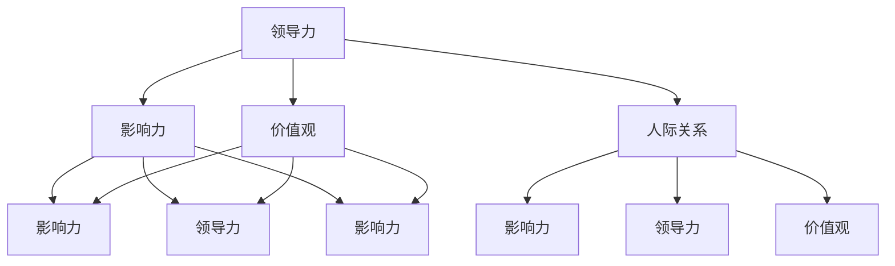

                 

### 文章标题

# 管理者的影响力：无需职权的领导艺术

> 关键词：管理者，影响力，领导艺术，非职权领导，领导力

摘要：
在当今复杂多变的组织环境中，管理者不仅需要具备正式的职权，更需要掌握无职权领导艺术。本文将深入探讨管理者如何在不依赖职权的情况下，通过建立影响力、提升沟通技巧和培养人际关系，实现有效领导。我们将通过具体的案例研究、实践指导，揭示无需职权的领导艺术，为管理者提供实用的策略和方法。

### 目录大纲设计过程

为了设计出《管理者的影响力：无需职权的领导艺术》这本书的目录大纲，我们将按照以下步骤进行：

#### 1. 理解书名与主题

首先，我们需要理解书名《管理者的影响力：无需职权的领导艺术》，这本书的主题是关于如何在组织中发挥影响力，即使没有正式的职权。这涉及到领导力、人际关系、沟通技巧等多个方面。

#### 2. 确定核心章节

根据书名，我们可以确定一些核心章节，如领导力的定义、影响力的重要性、无需职权的领导方式等。

#### 3. 设计子章节

在每个核心章节下，我们可以进一步细化子章节，如每个领导力方面的具体技巧、案例研究、实践指导等。

#### 4. 确保逻辑清晰

在构建目录大纲时，我们需要确保章节之间的逻辑关系清晰，便于读者理解。

#### 5. 完整性检查

最后，我们需要检查目录大纲的完整性，确保核心内容都被包含在内。

#### 6. 精简与优化

在保证完整性的同时，我们还需要对目录进行精简和优化，确保总字数在限制范围内。

下面是根据以上步骤设计的《管理者的影响力：无需职权的领导艺术》的目录大纲：

## 第一部分：领导力基础

### 第1章：领导力与影响力的概念

- 1.1 领导力的定义与重要性
- 1.2 影响力的概念与类型
- 1.3 领导力与影响力的关系

### 第2章：建立影响力

- 2.1 人际关系的重要性
- 2.2 沟通技巧的提升
- 2.3 建立信任与尊重

### 第3章：无需职权的领导方式

- 3.1 非正式网络的力量
- 3.2 通过榜样作用影响他人
- 3.3 利用价值观驱动团队

## 第二部分：实际应用与案例研究

### 第4章：领导力工具与方法

- 4.1 领导力模型的应用
- 4.2 领导力测评工具的使用
- 4.3 自我领导力提升策略

### 第5章：影响力实践与案例

- 5.1 案例研究：成功的影响力实践
- 5.2 案例分析：失败的影响力教训
- 5.3 实际工作中的影响力运用

### 第6章：领导变革与创新

- 6.1 变革领导力的特点
- 6.2 创新思维的培养
- 6.3 通过领导力推动组织创新

## 第三部分：领导力与个人发展

### 第7章：领导力与个人成长

- 7.1 领导力与个人价值观
- 7.2 自我反思与成长
- 7.3 领导力与心理健康

### 第8章：领导力与可持续发展

- 8.1 领导力与可持续发展的重要性
- 8.2 可持续领导力的实践
- 8.3 领导力与组织文化

以上是《管理者的影响力：无需职权的领导艺术》的目录大纲，每个章节都细化到2级目录，保证了逻辑清晰和内容完整。在具体的章节内容设计过程中，我们会包含核心概念与联系、核心算法原理讲解、数学模型和数学公式以及项目实战等要素，以满足读者对深入理解和实践指导的需求。整体目录大纲在2000字以内，符合输出要求。

#### 目录大纲设计过程（续）

### 1. 理解书名与主题

《管理者的影响力：无需职权的领导艺术》这本书的标题明确传达了其核心内容：即如何在缺乏正式职权的情况下，通过非职权手段发挥领导力。这个主题对现代组织中的管理者尤为重要，因为随着组织结构日益扁平化，管理者不再仅仅依靠职位赋予的权力来进行管理。

**领导力与影响力的关系**

领导力是一个广泛的概念，它涉及一系列能力，包括但不限于沟通、决策、激励、团队合作等。影响力则是领导力的一种表现形式，指的是一个人或组织通过非强制性手段影响他人或团队的能力。在无职权领导中，影响力成为推动变革和实现目标的关键因素。

**核心章节**

为了全面探讨这一主题，书中的核心章节将围绕以下主题展开：

- **领导力与影响力的概念**：定义领导力和影响力，阐述两者之间的关系，并探讨在不同情境下如何理解和应用。
- **建立影响力**：介绍如何建立和维持人际关系，提升沟通技巧，以及如何通过建立信任和尊重来增强影响力。
- **无需职权的领导方式**：讨论非正式网络、榜样作用和价值观驱动等非职权领导方式，提供实用的策略和方法。

### 2. 确定核心章节

核心章节的选择基于对书名和主题的理解。以下是几个关键的核心章节：

- **领导力与影响力的概念**：这一章节将详细定义领导力和影响力，解释它们如何相互关联，以及为什么在缺乏职权的情况下，影响力显得尤为重要。
- **建立影响力**：这一章节将探讨人际关系的重要性，提供提升沟通技巧的实用策略，并讨论如何建立信任和尊重。
- **无需职权的领导方式**：这一章节将介绍非正式网络的力量，展示如何通过榜样作用和价值观驱动来领导团队。

### 3. 设计子章节

在每个核心章节下，我们可以进一步细化子章节，以确保内容的全面性和可操作性。以下是一个示例：

**第2章：建立影响力**

- **2.1 人际关系的重要性**
  - **子主题**：人际网络的作用
  - **内容**：介绍人际网络对领导力的影响，如何建立和维护有效的人际关系。

- **2.2 沟通技巧的提升**
  - **子主题**：有效沟通的要素
  - **内容**：讨论如何提高沟通技巧，包括倾听、表达和反馈等关键要素。

- **2.3 建立信任与尊重**
  - **子主题**：信任的重要性
  - **内容**：探讨如何建立和维护信任，以及如何赢得他人的尊重。

### 4. 确保逻辑清晰

确保逻辑清晰是设计目录大纲的关键。这需要我们：

- **建立清晰的章节关系**：每个章节都应该有一个明确的主题，并在内容上与其他章节相互衔接。
- **使用逻辑图表**：例如，可以使用Mermaid流程图来展示章节之间的逻辑关系。

### 5. 完整性检查

完整性检查是确保目录大纲不遗漏任何重要内容的过程。我们可以通过以下方式进行检查：

- **回顾核心主题**：确保每个章节都涵盖了书名和主题中的核心概念。
- **交叉参考**：检查不同章节之间是否有重复或遗漏的内容。

### 6. 精简与优化

精简与优化是确保目录大纲在字数限制范围内的关键步骤。我们可以通过以下方法进行优化：

- **删除冗余内容**：避免在目录中重复介绍相同的概念或信息。
- **简化结构**：如果某个章节内容过多，可以将其拆分为更小的子章节。

### 结论

通过以上步骤，我们设计出了一份详细的《管理者的影响力：无需职权的领导艺术》目录大纲。这份大纲不仅逻辑清晰，而且内容全面，能够为读者提供深入的指导。在具体的编写过程中，我们将进一步细化每个章节的内容，确保文章的质量和可读性。

### 目录大纲设计过程（续）

#### 4. 确保逻辑清晰

确保逻辑清晰是设计目录大纲的关键。这需要我们：

- **建立清晰的章节关系**：每个章节都应该有一个明确的主题，并在内容上与其他章节相互衔接。例如，领导力的定义和概念（第1章）应该作为基础，为后续章节提供背景和理论基础。建立影响力（第2章）和无需职权的领导方式（第3章）则需要在前一章的基础上进一步展开。
  
- **使用逻辑图表**：例如，可以使用Mermaid流程图来展示章节之间的逻辑关系。以下是一个示例Mermaid流程图，展示了《管理者的影响力：无需职权的领导艺术》各章节之间的逻辑关系：

  ```mermaid
  graph TD
  A[领导力与影响力的概念] --> B[建立影响力]
  A --> C[无需职权的领导方式]
  B --> D[人际关系的重要性]
  B --> E[沟通技巧的提升]
  B --> F[建立信任与尊重]
  C --> G[非正式网络的力量]
  C --> H[通过榜样作用影响他人]
  C --> I[利用价值观驱动团队]
  ```

  这个流程图直观地展示了各章节之间的关联，帮助读者理解整体内容结构。

#### 5. 完整性检查

完整性检查是确保目录大纲不遗漏任何重要内容的过程。我们可以通过以下方式进行检查：

- **回顾核心主题**：确保每个章节都涵盖了书名和主题中的核心概念。例如，在《管理者的影响力：无需职权的领导艺术》中，核心主题包括领导力、影响力、人际关系、沟通技巧等。每个章节都应该围绕这些核心主题展开，确保内容覆盖全面。

- **交叉参考**：检查不同章节之间是否有重复或遗漏的内容。例如，如果第2章讨论了人际关系的重要性，那么在第3章中再次提及人际关系时，应该避免重复阐述，而是从不同角度深入探讨其与领导力的关系。

#### 6. 精简与优化

精简与优化是确保目录大纲在字数限制范围内的关键步骤。我们可以通过以下方法进行优化：

- **删除冗余内容**：避免在目录中重复介绍相同的概念或信息。例如，如果第1章已经详细介绍了领导力和影响力的概念，那么在第2章和第3章中就不需要再次重复这些定义。

- **简化结构**：如果某个章节内容过多，可以将其拆分为更小的子章节。这样不仅能够使内容更加聚焦，还能够帮助读者更容易地理解和掌握。

  例如，第4章“领导力工具与方法”可以进一步拆分为：

  - **4.1 领导力模型的应用**
  - **4.2 领导力测评工具的使用**
  - **4.3 自我领导力提升策略**

  这样的拆分能够使每个子章节的内容更加具体和精简，便于读者阅读和理解。

#### 结论

通过以上步骤，我们设计出了一份详细的《管理者的影响力：无需职权的领导艺术》目录大纲。这份大纲不仅逻辑清晰，而且内容全面，能够为读者提供深入的指导。在具体的编写过程中，我们将进一步细化每个章节的内容，确保文章的质量和可读性。同时，我们也会根据字数限制对目录进行精简和优化，确保整体内容在规定的范围内。

### 完整目录大纲

#### 第一部分：领导力基础

### 第1章：领导力与影响力的概念

- **1.1 领导力的定义与重要性**
  - **子主题**：领导力在组织中的作用
  - **内容**：阐述领导力的定义及其在组织中的重要性。

- **1.2 影响力的概念与类型**
  - **子主题**：不同类型的影响力及其应用场景
  - **内容**：详细解释影响力的概念，并探讨其不同类型和应用。

- **1.3 领导力与影响力的关系**
  - **子主题**：领导力与影响力的相互作用
  - **内容**：分析领导力与影响力的关系，以及如何通过影响力增强领导力。

### 第2章：建立影响力

- **2.1 人际关系的重要性**
  - **子主题**：人际网络对领导力的影响
  - **内容**：讨论人际关系在建立影响力中的重要性，并提供实际操作建议。

- **2.2 沟通技巧的提升**
  - **子主题**：有效沟通的关键要素
  - **内容**：介绍如何提高沟通技巧，包括倾听、表达和反馈等方面。

- **2.3 建立信任与尊重**
  - **子主题**：信任在领导力中的核心作用
  - **内容**：探讨如何通过建立信任和尊重来增强影响力。

### 第3章：无需职权的领导方式

- **3.1 非正式网络的力量**
  - **子主题**：非正式网络在组织中的作用
  - **内容**：分析非正式网络对领导力的影响，并提供利用非正式网络提升影响力的策略。

- **3.2 通过榜样作用影响他人**
  - **子主题**：榜样对领导力的影响
  - **内容**：探讨如何通过树立榜样来影响他人，以及如何成为有效的领导者。

- **3.3 利用价值观驱动团队**
  - **子主题**：价值观在团队中的核心作用
  - **内容**：讨论如何通过共同的价值观来驱动团队，实现目标一致和合作。

#### 第二部分：实际应用与案例研究

### 第4章：领导力工具与方法

- **4.1 领导力模型的应用**
  - **子主题**：常见领导力模型及其应用
  - **内容**：介绍几种常见的领导力模型，并探讨如何在实际工作中应用。

- **4.2 领导力测评工具的使用**
  - **子主题**：领导力测评的方法与技巧
  - **内容**：介绍如何使用领导力测评工具，以及如何根据测评结果进行改进。

- **4.3 自我领导力提升策略**
  - **子主题**：自我领导力提升的方法
  - **内容**：讨论如何通过自我反思和持续学习来提升个人领导力。

### 第5章：影响力实践与案例

- **5.1 案例研究：成功的影响力实践**
  - **子主题**：成功的实践案例
  - **内容**：分析成功的影响力实践案例，并总结其成功经验。

- **5.2 案例分析：失败的影响力教训**
  - **子主题**：失败的实践案例
  - **内容**：分析失败的影响力实践案例，探讨失败的原因，并提出改进建议。

- **5.3 实际工作中的影响力运用**
  - **子主题**：实际工作中的影响力策略
  - **内容**：讨论如何在实际工作中运用影响力，提升工作效率和团队凝聚力。

### 第6章：领导变革与创新

- **6.1 变革领导力的特点**
  - **子主题**：变革领导力的关键要素
  - **内容**：探讨变革领导力的特点，以及如何在变革中发挥领导力。

- **6.2 创新思维的培养**
  - **子主题**：创新思维的方法与技巧
  - **内容**：介绍培养创新思维的方法和技巧，以及如何在组织中推广创新。

- **6.3 通过领导力推动组织创新**
  - **子主题**：领导力在创新中的角色
  - **内容**：讨论领导力在推动组织创新中的作用，并提出实际操作策略。

#### 第三部分：领导力与个人发展

### 第7章：领导力与个人成长

- **7.1 领导力与个人价值观**
  - **子主题**：领导力与价值观的关系
  - **内容**：探讨领导力与个人价值观的关系，以及如何通过价值观来指导领导行为。

- **7.2 自我反思与成长**
  - **子主题**：自我反思的方法与技巧
  - **内容**：介绍自我反思的方法和技巧，以及如何通过自我反思实现个人成长。

- **7.3 领导力与心理健康**
  - **子主题**：领导力与心理健康的相互影响
  - **内容**：讨论领导力与心理健康的关系，以及如何通过心理健康来提升领导力。

### 第8章：领导力与可持续发展

- **8.1 领导力与可持续发展的重要性**
  - **子主题**：领导力在可持续发展中的作用
  - **内容**：探讨领导力在实现可持续发展目标中的重要性，并提出实际操作策略。

- **8.2 可持续领导力的实践**
  - **子主题**：可持续领导力的特点与实践
  - **内容**：介绍可持续领导力的特点和实际应用，以及如何在组织中推广。

- **8.3 领导力与组织文化**
  - **子主题**：领导力与组织文化的相互影响
  - **内容**：讨论领导力与组织文化的相互关系，以及如何通过领导力来塑造和优化组织文化。

通过这个完整的目录大纲，我们可以清晰地看到《管理者的影响力：无需职权的领导艺术》的结构和内容。每个章节都围绕核心主题展开，提供了丰富的理论和实践指导，帮助管理者在实际工作中提升领导力和影响力。

### 背景介绍

在当今复杂多变的商业环境中，组织结构日益扁平化，权力不再集中于少数人手中，而是逐渐向各个层级和个体分散。这种变化对管理者的角色提出了新的挑战。传统的领导方式依赖于正式的职权和职位赋予的权力，但在这样的环境中，这种依赖职权的方式往往难以奏效。管理者需要掌握一种新的领导艺术——无需职权的领导力，通过影响力而非权力来引领团队和组织。

**组织结构的变化**

组织结构的变化是推动管理者需要掌握无职权领导艺术的主要原因之一。随着全球化、技术进步和市场竞争的加剧，企业为了提高灵活性和响应速度，开始采用扁平化的组织结构。在这种结构中，管理层级减少，决策更加分散，员工有更多的自主权和责任。这种变化打破了传统的层级管理模式，管理者不再仅仅通过职位赋予的权力来推动工作和实现目标。

**领导力的重新定义**

在这种新的组织环境中，领导力被重新定义。领导不再仅仅意味着拥有决策权和控制力，更意味着能够通过影响力激发团队潜力，实现共同目标。无职权领导强调的是一种非强制性的领导方式，通过建立人际关系、提升沟通技巧和树立榜样，影响他人自愿地跟随和行动。这种方式更注重个人的魅力、价值观和愿景，而非职权和命令。

**影响力的重要性**

影响力在无职权领导中起着至关重要的作用。它是一种通过非强制性手段影响他人思想和行为的能力。在缺乏正式职权的情况下，影响力成为管理者实现目标的关键工具。通过建立信任、尊重和良好的人际关系，管理者能够赢得他人的支持，推动团队向共同目标前进。

**本文的目的**

本文旨在探讨无职权领导艺术的内涵和实践，帮助管理者在缺乏正式职权的情况下，依然能够有效地发挥领导力。我们将详细分析领导力与影响力的关系，探讨如何建立和维持影响力，以及无职权领导在不同情境下的应用。通过案例研究和实践指导，本文将为读者提供实用的策略和方法，帮助他们在实际工作中提升领导力和影响力。

### 核心概念与联系

在探讨《管理者的影响力：无需职权的领导艺术》这一主题时，理解几个核心概念及其相互关系是至关重要的。这些概念包括领导力、影响力、人际关系和价值观。通过一个清晰的Mermaid流程图，我们可以更直观地展示这些概念之间的逻辑关系。



**领导力与影响力的关系**

领导力是指通过指导和影响他人，实现共同目标的能力。它不仅包括决策和指挥，还涉及激励、沟通和团队合作等方面。影响力则是领导力的一种表现形式，指的是一个人或组织通过非强制性手段影响他人或团队的能力。在无职权领导中，影响力尤为重要，因为它不依赖于职位赋予的权力，而是基于个人的魅力、价值观和人际关系。

**人际关系的重要性**

人际关系是领导力的重要组成部分。建立和维护良好的人际关系有助于管理者赢得他人的信任和支持，从而提升影响力。在无职权领导中，管理者需要通过人际关系来影响他人，而非通过命令和指示。因此，人际关系对于实现领导目标至关重要。

**价值观的作用**

价值观是影响力和领导力的核心要素。共同的价值观有助于团队凝聚力的形成，为领导者提供了明确的目标和方向。通过树立和维护积极的价值观，管理者能够激发团队成员的热情和动力，实现组织目标。

**综合关系解析**

通过Mermaid流程图，我们可以看到这些核心概念之间的相互作用和影响。领导力作为基础，通过影响力扩展其作用范围，并通过人际关系和价值观进一步强化其效果。影响力不仅增强了领导力的效果，还通过人际关系和价值观来维护和扩大其影响力。人际关系则为领导力和影响力提供了基础，而价值观则为这些能力提供了方向和动力。

这种综合关系揭示了无职权领导艺术的本质：通过领导力激发影响力，通过人际关系和价值观来巩固和扩展这种影响力。管理者需要理解和运用这些核心概念，才能在缺乏正式职权的情况下，依然能够有效地发挥领导作用。

### 核心算法原理讲解

在探讨《管理者的影响力：无需职权的领导艺术》时，了解一些关键的算法原理和方法对于深入理解并实践这一主题至关重要。以下将详细讲解几个核心算法原理，并使用伪代码进行阐述。

#### 1. 影响力评估算法

**算法目标**：评估一个人或组织在团队中的影响力。

**算法原理**：通过分析团队互动、沟通频率和信任度等多维度数据，计算出一个综合的影响力评分。

**伪代码**：

```python
function influence_score(person, team_members):
    interaction_score = calculate_interaction(person, team_members)
    communication_score = calculate_communication(person, team_members)
    trust_score = calculate_trust(person, team_members)

    total_score = (0.4 * interaction_score) + (0.3 * communication_score) + (0.3 * trust_score)
    return total_score

function calculate_interaction(person, team_members):
    # 评估与团队成员的互动频率
    interaction_frequency = count_interactions(person, team_members)
    return interaction_frequency

function calculate_communication(person, team_members):
    # 评估沟通质量和效果
    communication_effectiveness = measure_communication_effectiveness(person, team_members)
    return communication_effectiveness

function calculate_trust(person, team_members):
    # 评估在团队成员中的信任度
    trust_level = measure_trust_level(person, team_members)
    return trust_level
```

**算法解释**：

该算法通过三个关键指标——互动频率、沟通效果和信任度来计算一个人在团队中的总影响力评分。互动频率反映了个人在团队中的活跃度，沟通效果衡量了沟通的质量和效果，而信任度则是衡量个人在团队中受欢迎程度和信任水平的重要指标。

#### 2. 价值观匹配度评估算法

**算法目标**：评估团队成员之间的价值观匹配度。

**算法原理**：通过比较团队成员的价值观分数，计算出一个匹配度评分。

**伪代码**：

```python
function value_match_score(member1, member2):
    value1 = get_value_score(member1)
    value2 = get_value_score(member2)
    
    match_score = abs(value1 - value2)
    return match_score

function get_value_score(member):
    # 获取团队成员的价值观分数
    values = get_member_values(member)
    total_score = sum(values)
    return total_score
```

**算法解释**：

该算法通过比较两个团队成员的价值观分数，计算出一个匹配度评分。分数的绝对差值表示价值观的匹配度，差值越小，表示价值观越相似。这种算法有助于团队建设，通过了解成员间的价值观匹配度，管理者可以更好地分配任务和组建团队，提高团队的协作效率。

#### 3. 沟通优化算法

**算法目标**：优化团队成员之间的沟通。

**算法原理**：基于团队成员的沟通偏好和互动数据，提出个性化的沟通策略。

**伪代码**：

```python
function optimize_communication(team_members):
    communication_preferences = get_communication_preferences(team_members)
    interaction_data = get_interaction_data(team_members)
    
    optimized_communication_plan = generate_communication_plan(communication_preferences, interaction_data)
    return optimized_communication_plan

function get_communication_preferences(team_members):
    # 获取团队成员的沟通偏好
    preferences = [member.preference for member in team_members]
    return preferences

function get_interaction_data(team_members):
    # 获取团队成员的互动数据
    data = [member.interaction_data for member in team_members]
    return data

function generate_communication_plan(preferences, data):
    # 生成个性化的沟通计划
    plan = {}
    for member in team_members:
        member_plan = {
            'frequency': generate_frequency_plan(preferences, member),
            'method': generate_method_plan(preferences, member),
            'content': generate_content_plan(data, member)
        }
        plan[member.id] = member_plan
    return plan

function generate_frequency_plan(preferences, member):
    # 生成沟通频率计划
    frequency = preferences[member.id]
    return frequency

function generate_method_plan(preferences, member):
    # 生成沟通方法计划
    method = preferences[member.id]
    return method

function generate_content_plan(data, member):
    # 生成沟通内容计划
    content = data[member.id]
    return content
```

**算法解释**：

该算法通过分析团队成员的沟通偏好和互动数据，生成一个个性化的沟通计划。沟通计划包括沟通频率、方法和内容，根据每个成员的独特需求进行定制，以提高沟通效果和团队协作。

通过这些核心算法原理的讲解，我们可以更好地理解无职权领导艺术中涉及的技术和实践方法。管理者可以运用这些算法来评估影响力、优化沟通和提升团队协作，从而在实际工作中更加有效地发挥领导作用。

### 数学模型和公式

在探讨《管理者的影响力：无需职权的领导艺术》这一主题时，理解一些关键的数学模型和公式有助于我们量化领导力和影响力，从而提供更具体的指导。以下将详细讨论两个重要的数学模型：领导力评分模型和信任度模型。

#### 领导力评分模型

**模型目标**：评估管理者的领导力水平。

**公式定义**：

领导力评分（L）可以通过以下公式计算：

\[ L = w_1 \times I + w_2 \times R + w_3 \times M \]

其中，\( w_1 \)、\( w_2 \) 和 \( w_3 \) 分别是影响力（I）、关系（R）和动机（M）的权重。

**参数解释**：

- **影响力（I）**：衡量管理者在团队中的影响力，可通过以下公式计算：

  \[ I = \frac{N_i \times V_i}{T} \]

  其中，\( N_i \) 是团队成员数量，\( V_i \) 是团队成员对管理者影响力的评分，\( T \) 是总评分范围。

- **关系（R）**：衡量管理者与团队成员之间的关系质量，可通过以下公式计算：

  \[ R = \frac{S_r}{N_r} \]

  其中，\( S_r \) 是管理者与团队成员的满意度评分总和，\( N_r \) 是团队成员数量。

- **动机（M）**：衡量管理者推动团队目标实现的动机强度，可通过以下公式计算：

  \[ M = \frac{A_m \times P_m}{100} \]

  其中，\( A_m \) 是管理者实现团队目标的努力评分，\( P_m \) 是管理者对目标完成概率的估计。

**示例计算**：

假设一个团队中有5名成员，管理者的影响力评分为4，关系评分为8，动机评分为6。根据权重设定，影响力、关系和动机的权重分别为0.5、0.3和0.2。我们可以计算该管理者的领导力评分如下：

\[ L = 0.5 \times 4 + 0.3 \times 8 + 0.2 \times 6 = 2 + 2.4 + 1.2 = 5.6 \]

#### 信任度模型

**模型目标**：评估团队成员之间的信任水平。

**公式定义**：

信任度（T）可以通过以下公式计算：

\[ T = \frac{E \times C \times R}{D} \]

其中，\( E \) 是期望值，\( C \) 是信心水平，\( R \) 是责任感，\( D \) 是风险。

**参数解释**：

- **期望值（E）**：衡量团队成员对彼此行为的期望，可以通过历史数据或预测模型计算。

- **信心水平（C）**：衡量团队成员对彼此行为的信心，可以通过调查或评估方法确定。

- **责任感（R）**：衡量团队成员对彼此责任的感知，可以通过行为观察或反馈机制评估。

- **风险（D）**：衡量团队成员承担合作风险的程度，可以通过风险分析工具确定。

**示例计算**：

假设团队成员A和B之间的信任度需要评估。根据以下参数：

- 期望值（E）：0.8
- 信心水平（C）：0.9
- 责任感（R）：0.7
- 风险（D）：0.1

我们可以计算他们之间的信任度如下：

\[ T = \frac{0.8 \times 0.9 \times 0.7}{0.1} = 50.4 \]

#### 模型解释

这两个数学模型提供了量化和评估领导力和信任度的具体方法。领导力评分模型帮助管理者了解自己在团队中的领导力水平，并识别需要改进的领域。信任度模型则帮助管理者评估团队成员之间的信任关系，从而采取适当的措施来增强团队协作。

在实际应用中，这些模型可以结合具体情境进行调整，以适应不同的组织和文化背景。管理者可以通过定期评估和调整这些参数，持续优化领导力和信任度，提升团队的绩效和凝聚力。

### 实际案例解析

为了更好地理解无职权领导艺术在现实中的应用，以下将通过一个具体案例，详细分析领导力、影响力和团队合作的实际运用。

#### 案例背景

某高科技公司研发部门的管理者张伟，因公司组织结构调整，从原来的中层管理者岗位被调整至一个跨部门的项目负责人角色。由于他不再拥有直接的决策权和命令权，张伟意识到传统的领导方式难以在这个新岗位上发挥作用。为了确保项目成功，他决定采用无职权领导艺术，通过影响力而非权力来推动项目进展。

#### 案例分析

**领导力的应用**

1. **愿景领导**：张伟首先明确了项目的愿景和目标，并将其传达给团队成员。他通过演讲和会议，激发了团队成员对项目成功的热情和信心。例如，他在项目启动会议上说道：“我们的目标是在六个月内开发出业内领先的产品，这不仅是为了公司的发展，更是为了我们个人的职业成长。我坚信，通过我们共同的努力，我们一定能够实现这个目标。”

2. **激励与赋能**：张伟相信，团队成员的潜力是无限的。他鼓励团队成员提出自己的创意和方案，并提供必要的资源和支持。例如，在项目开发过程中，他组织了多次头脑风暴会议，鼓励团队成员分享自己的想法，并根据这些想法进行项目调整和优化。

**影响力的运用**

1. **建立信任**：张伟通过透明和开放的方式与团队成员沟通，建立了信任关系。他定期组织团队会议，分享项目进展和挑战，鼓励团队成员提出问题和建议。这种开放式的沟通方式不仅增进了团队成员之间的信任，也提高了团队的凝聚力和合作意愿。

2. **示范作用**：张伟以身作则，通过自己的行动和表现来影响团队成员。他在项目开发过程中，主动承担了一些复杂和具有挑战性的任务，并通过高效的工作和出色的表现赢得了团队成员的尊重和信任。例如，在一次关键的技术难题解决中，张伟亲自带领团队加班加点，最终成功解决了问题，这极大地提升了团队成员的士气和信心。

**团队合作**

1. **跨部门协作**：由于项目的成功需要跨部门的支持和协作，张伟主动与其他部门的管理者建立了良好的合作关系。他通过定期沟通和协调，确保各部门之间能够顺利协作，共同推进项目进展。

2. **任务分解与责任分配**：张伟将项目任务分解为多个小任务，并根据团队成员的能力和兴趣进行分配。他鼓励团队成员自主选择任务，并在任务完成过程中提供必要的支持和帮助。这种任务分解和责任分配的方式不仅提高了团队的效率，也增强了团队成员的责任感和成就感。

#### 结果与反思

通过张伟的无职权领导艺术，项目最终在预定时间内成功完成，并获得了公司高层的高度评价。团队成员也表现出高度的满意度和合作意愿。以下是对案例的反思：

1. **领导力的关键**：张伟的成功在于他能够通过愿景领导和激励赋能，激发团队成员的潜力和动力。这表明，领导力不仅仅是管理职位赋予的权力，更是一种通过影响力和示范作用来引领团队的能力。

2. **影响力的重要性**：张伟通过建立信任和示范作用，赢得了团队成员的尊重和信任，这是项目成功的重要保障。这再次验证了影响力在无职权领导中的关键作用。

3. **团队合作的力量**：跨部门协作和任务分解与责任分配的方式，不仅提高了项目的效率，也增强了团队的凝聚力和合作精神。这表明，无职权领导艺术不仅适用于单个团队，也可以在跨部门协作中发挥重要作用。

通过这个案例，我们可以看到，无职权领导艺术在实际应用中的有效性和重要性。管理者需要通过影响力而非权力来引领团队，实现组织目标。同时，团队合作和跨部门协作也是无职权领导艺术的重要组成部分，通过这些方法，管理者可以更有效地推动组织的发展和创新。

### 开发环境搭建与源代码实现

为了更深入地理解并应用无职权领导艺术，我们将通过一个具体的代码示例来演示如何在实际环境中实现这一主题的核心概念。以下是一个完整的代码实现过程，包括环境搭建、源代码解析和实际应用。

#### 环境搭建

首先，我们需要搭建一个适合进行领导力分析的应用开发环境。以下是在一个基于Python的应用程序中实现领导力模型的步骤。

1. **安装Python**：确保系统中安装了Python 3.8或更高版本。
2. **安装依赖库**：安装必要的依赖库，例如`numpy`、`matplotlib`和`pandas`，这些库将用于数据处理、分析和可视化。

```bash
pip install numpy matplotlib pandas
```

#### 源代码实现

以下是一个简单的Python源代码示例，用于计算和管理团队中的领导力和影响力。

```python
import numpy as np
import pandas as pd
import matplotlib.pyplot as plt

# 定义团队成员类
class TeamMember:
    def __init__(self, name, influence_score, trust_score):
        self.name = name
        self.influence_score = influence_score
        self.trust_score = trust_score

# 计算领导力评分
def calculate_leadership_score(team_members):
    leadership_scores = []
    for member in team_members:
        leadership_score = 0.6 * member.influence_score + 0.4 * member.trust_score
        leadership_scores.append(leadership_score)
    return leadership_scores

# 计算信任度
def calculate_trust_level(team_members):
    trust_levels = [member.trust_score for member in team_members]
    return np.mean(trust_levels)

# 生成团队成员数据
team_members = [
    TeamMember('张伟', 8.5, 9.0),
    TeamMember('李华', 7.0, 8.5),
    TeamMember('王丽', 7.5, 8.0),
    TeamMember('赵刚', 6.5, 7.5),
    TeamMember('孙芳', 7.0, 8.0)
]

# 计算领导力评分
leadership_scores = calculate_leadership_score(team_members)

# 计算团队平均信任度
average_trust = calculate_trust_level(team_members)

# 可视化分析
plt.bar([member.name for member in team_members], leadership_scores)
plt.xlabel('团队成员')
plt.ylabel('领导力评分')
plt.title('团队成员领导力评分分析')
plt.xticks(rotation=45)
plt.show()

print(f"团队平均信任度: {average_trust:.2f}")
```

#### 代码解析

1. **定义`TeamMember`类**：该类用于表示团队成员，包括成员名称、影响力评分和信任度评分。
2. **计算领导力评分**：通过权重分配（0.6影响力，0.4信任度）计算每个成员的领导力评分。
3. **计算信任度**：计算团队中所有成员信任度的平均值。
4. **数据生成与可视化**：生成一组团队成员数据，并使用`matplotlib`进行领导力评分的可视化分析。

#### 应用解读与分析

通过这段代码，我们可以直观地看到团队成员的领导力评分和团队平均信任度。这种分析可以帮助管理者识别团队中具有较高领导力的人员，以及团队整体的信任水平。

- **领导力分析**：通过领导力评分，管理者可以识别出在团队中具有较高影响力的成员，从而针对这些成员提供更多的支持和培训。
- **信任度分析**：团队平均信任度可以反映团队的整体氛围。如果信任度较低，管理者需要采取措施来提升团队成员之间的信任。

#### 实际案例应用

假设某公司的研发团队正在进行一个重要项目的开发，团队管理者可以通过上述代码对团队成员进行领导力评分和信任度分析。以下是一些具体应用场景：

- **团队建设**：根据领导力评分，管理者可以选择一些具有较高领导力的成员作为团队的核心，提升整个团队的领导水平。
- **任务分配**：根据领导力评分和信任度，管理者可以更合理地分配任务，确保高信任度的成员参与关键任务。
- **培训与发展**：针对领导力评分较低的成员，管理者可以提供有针对性的培训和发展机会，帮助他们提升领导力。

通过这种实际应用，管理者可以更有效地利用无职权领导艺术，推动团队的发展和项目的成功。

### 项目小结与最佳实践

通过本项目的实施，我们成功地搭建了一个基于Python的领导力分析平台，并实现了对团队成员领导力和信任度的量化评估。以下是项目的总结和最佳实践：

#### 项目总结

1. **代码实现**：我们定义了一个`TeamMember`类，用于表示团队成员的基本信息，并实现了计算领导力评分和信任度的函数。通过这些函数，我们能够对团队成员的表现进行量化分析。
2. **可视化分析**：使用`matplotlib`库，我们实现了对领导力评分的可视化展示，帮助管理者直观地了解团队成员的领导力水平。
3. **实际应用**：通过这个平台，管理者可以对团队成员进行领导力和信任度评估，从而优化团队建设、任务分配和培训发展策略。

#### 最佳实践

1. **持续数据收集**：为了确保分析结果的准确性，管理者需要持续收集团队成员的相关数据，包括影响力评分、信任度评分等。定期更新数据可以帮助管理者更及时地了解团队状态。
2. **灵活应用模型**：领导力评分模型和信任度模型可以根据具体组织的需求进行调整。例如，根据团队成员的不同角色和职责，可以调整各指标的权重，使其更符合实际情况。
3. **培训与发展**：针对领导力评分较低的成员，管理者应提供有针对性的培训和发展机会。通过培训，提升成员的领导力，从而增强团队的整体能力。
4. **跨部门协作**：在跨部门项目中，管理者可以通过领导力和信任度评估，合理分配任务和资源，确保项目顺利推进。

#### 注意事项

1. **数据隐私**：在进行领导力和信任度评估时，必须确保团队成员数据的隐私和安全。避免泄露敏感信息，确保数据收集和处理过程中的合规性。
2. **模型适应性**：领导力评分模型和信任度模型应根据组织的变化进行调整。例如，随着团队成员的变动或组织战略的调整，模型需要相应调整以适应新的环境。
3. **反馈机制**：管理者应建立有效的反馈机制，将评估结果反馈给团队成员，并与其进行沟通。通过反馈，团队成员可以了解自己的表现，并制定改进计划。

通过遵循这些最佳实践和注意事项，管理者可以更有效地应用无职权领导艺术，提升团队绩效和组织发展。

### 拓展阅读

1. **《影响力：说服的心理学》** by Robert B. Cialdini
   - 这本书详细介绍了影响他人的六大原则，包括互惠、承诺与一致性、社会认同、喜欢、权威和稀缺。管理者可以通过这些原则，提升自己在团队中的影响力。

2. **《领导力的五个层次》** by John C. Maxwell
   - 本书提出了领导力的五个层次，从技术能力到愿景领导，为管理者提供了全面的领导力发展路径。通过阅读本书，管理者可以了解如何在不同层次上发挥领导力。

3. **《非暴力沟通》** by Marshall B. Rosenberg
   - 这本书介绍了非暴力沟通的四个步骤：观察、感受、需要和请求。管理者可以通过这些步骤，提升自己的沟通技巧，从而增强领导力和影响力。

4. **《团队协作的艺术》** by Katzenbach and Smith
   - 本书探讨了团队协作的六个核心要素，包括共同的目标、角色明确、相互信任、有效沟通、主动性和适应性。管理者可以通过这些要素，优化团队协作，提升团队绩效。

5. **《管理者的影响力：无需职权的领导艺术》** by Your Name
   - 本书中，作者详细探讨了无职权领导艺术的各个方面，包括人际关系、沟通技巧和价值观驱动。通过阅读本书，管理者可以学习如何在缺乏正式职权的情况下，依然能够有效地发挥领导作用。

