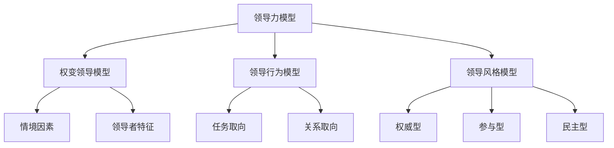

                 

### 文章标题

# 管理者的职业规划：设计个人领导力发展路径

### 关键词

- 职业规划
- 领导力发展
- 自我认知
- 团队建设
- 跨部门沟通

### 摘要

本文旨在探讨管理者的职业规划，特别关注个人领导力的发展路径。通过自我认知、职业规划、领导力模型的构建与应用、领导力提升策略、跨部门沟通、团队建设及应对职场挑战等方面，本文为管理者提供了一系列实用的指导和建议。通过深度分析及案例解析，帮助管理者更好地设计个人领导力发展路径，实现职业目标。

---

### 1. 确定书的主旨

《管理者的职业规划：设计个人领导力发展路径》的主旨在于帮助管理者在职业生涯中找到明确的方向，并通过科学的规划与持续的学习，提升个人领导力，从而更好地实现职业目标。本文将从以下几个方面展开讨论：

1. **自我认知**：管理者需要深入理解自己的能力、兴趣和价值观，为后续的职业规划奠定基础。
2. **职业规划与领导力发展**：明确职业目标，制定具体的规划步骤，并关注领导力的发展。
3. **领导力模型的构建与应用**：介绍常见的领导力模型，帮助管理者理解并应用这些模型。
4. **领导力提升的策略与方法**：探讨通过学习、实践和反思来提升领导力的具体策略和方法。
5. **跨部门沟通与合作**：分析跨部门沟通的障碍及解决策略，提高跨部门协作效率。
6. **团队建设与管理**：讨论团队建设的重要性、步骤和方法，以及团队管理的技巧。
7. **应对职场挑战与变化**：探讨如何应对职场中的各种挑战和变化，保持职业发展的连续性和适应性。

通过这些内容的深入探讨，本文希望为管理者提供一套实用的指南，帮助他们在职业道路上取得成功。

### 2. 列出核心章节

根据上述主旨，本文将分为以下核心章节：

- **第1章：管理者的自我认知**
  - 1.1 自我认知的重要性
  - 1.2 自我评估的方法与工具
  - 1.3 自我发展的路径与策略

- **第2章：职业规划与领导力发展**
  - 2.1 职业规划的概念与意义
  - 2.2 职业规划的步骤与流程
  - 2.3 领导力发展的重要性
  - 2.4 领导力发展的关键因素

- **第3章：领导力模型的构建与应用**
  - 3.1 领导力模型的概述
  - 3.2 常见的领导力模型
  - 3.3 领导力模型的应用

- **第4章：领导力提升的策略与方法**
  - 4.1 学习与反思的策略
  - 4.2 实践与经验的积累
  - 4.3 自我提升的方法与技巧

- **第5章：跨部门沟通与合作**
  - 5.1 跨部门沟通的障碍
  - 5.2 跨部门沟通的策略
  - 5.3 跨部门合作的实践

- **第6章：团队建设与管理**
  - 6.1 团队建设的概念与意义
  - 6.2 团队建设的步骤与方法
  - 6.3 团队管理的技巧与策略

- **第7章：应对职场挑战与变化**
  - 7.1 职场挑战的类型与特征
  - 7.2 应对职场挑战的策略
  - 7.3 职场变化的适应与应对

通过这些章节的详细探讨，本文旨在为管理者提供一个全面、系统的职业规划与领导力发展指南。

### 3. 确定每个章节的子节

在核心章节的基础上，我们进一步细化每个章节的子节，以便更详细地阐述每个主题。

#### 第1章：管理者的自我认知

- **1.1 自我认知的重要性**
  - 自我认知的定义
  - 自我认知对职业发展的影响
  - 自我认知的重要性

- **1.2 自我评估的方法与工具**
  - 自我评估的概念
  - 自我评估的常用工具
  - 自我评估的应用

- **1.3 自我发展的路径与策略**
  - 自我发展的目标设定
  - 自我发展的路径规划
  - 自我发展的策略与方法

#### 第2章：职业规划与领导力发展

- **2.1 职业规划的概念与意义**
  - 职业规划的定义
  - 职业规划的意义
  - 职业规划的目标

- **2.2 职业规划的步骤与流程**
  - 职业规划的具体步骤
  - 职业规划的流程图
  - 职业规划的时间规划

- **2.3 领导力发展的重要性**
  - 领导力的定义
  - 领导力的重要性
  - 领导力的培养

- **2.4 领导力发展的关键因素**
  - 领导力的核心要素
  - 领导力发展的关键因素
  - 领导力发展的实践

#### 第3章：领导力模型的构建与应用

- **3.1 领导力模型的概述**
  - 领导力模型的概念
  - 领导力模型的重要性
  - 领导力模型的分类

- **3.2 常见的领导力模型**
  - 权变领导模型
  - 领导行为模型
  - 领导风格模型

- **3.3 领导力模型的应用**
  - 领导力模型的选择
  - 领导力模型的应用策略
  - 领导力模型的效果评估

#### 第4章：领导力提升的策略与方法

- **4.1 学习与反思的策略**
  - 学习的策略
  - 反思的方法
  - 学习与反思的结合

- **4.2 实践与经验的积累**
  - 实践的重要性
  - 经验的积累
  - 实践与经验的应用

- **4.3 自我提升的方法与技巧**
  - 自我提升的目标
  - 自我提升的方法
  - 自我提升的技巧

#### 第5章：跨部门沟通与合作

- **5.1 跨部门沟通的障碍**
  - 沟通障碍的类型
  - 沟通障碍的原因
  - 沟通障碍的影响

- **5.2 跨部门沟通的策略**
  - 沟通策略的制定
  - 沟通技巧的提升
  - 沟通效果的评估

- **5.3 跨部门合作的实践**
  - 跨部门合作的定义
  - 跨部门合作的目标
  - 跨部门合作的实践案例

#### 第6章：团队建设与管理

- **6.1 团队建设的概念与意义**
  - 团队建设的定义
  - 团队建设的意义
  - 团队建设的目标

- **6.2 团队建设的步骤与方法**
  - 团队建设的基本步骤
  - 团队建设的具体方法
  - 团队建设的评估

- **6.3 团队管理的技巧与策略**
  - 团队管理的原则
  - 团队管理的技巧
  - 团队管理的策略

#### 第7章：应对职场挑战与变化

- **7.1 职场挑战的类型与特征**
  - 职场挑战的类型
  - 职场挑战的特征
  - 职场挑战的影响

- **7.2 应对职场挑战的策略**
  - 应对策略的选择
  - 应对策略的实施
  - 应对策略的评估

- **7.3 职场变化的适应与应对**
  - 变化管理的策略
  - 变化适应的方法
  - 变化应对的实践

通过这些子节的详细探讨，本文将帮助管理者深入理解职业规划与领导力发展的各个方面，从而更好地应对职场挑战，实现职业目标。

### 4. 设计流程图

为了更清晰地阐述领导力模型的构建与应用，我们可以使用Mermaid流程图来展示核心概念和原理。以下是一个简单的示例：



这个流程图展示了不同类型的领导力模型及其核心要素，帮助管理者更好地理解和应用这些模型。

### 5. 设计伪代码

为了详细阐述领导力提升的策略与方法，我们可以使用伪代码来展示核心算法原理。以下是一个简单的示例：

```plaintext
算法：领导力提升方法

输入：管理者
输出：提升后的领导力

1. 初始化领导力值为初始值
2. 学习与反思：
   2.1 阅读领导力相关书籍和文献
   2.2 参与领导力培训和工作坊
   2.3 定期进行自我反思和总结
3. 实践与经验积累：
   3.1 在实际工作中应用所学知识和技巧
   3.2 积累成功和失败的领导经验
   3.3 从经验中学习并调整领导行为
4. 自我提升：
   4.1 设定明确的自我提升目标
   4.2 制定详细的提升计划
   4.3 定期评估自我提升的效果
5. 输出提升后的领导力值
```

这个伪代码展示了领导力提升的基本步骤和策略，为管理者提供了一个实用的框架。

### 6. 设计数学模型与公式

在跨部门沟通与合作部分，我们可以使用数学模型和公式来详细阐述沟通效率。以下是一个简单的示例：

```latex
$$
E = \frac{P \times C \times I}{D}
$$

其中：
E 表示沟通效率
P 表示信息传递的准确性
C 表示信息的传递速度
I 表示接收者的理解程度
D 表示沟通的距离
```

这个公式展示了沟通效率的影响因素，帮助管理者更好地理解和提高沟通效率。

### 7. 设计项目实战

在团队建设与管理部分，我们可以设计一个实际项目，通过代码实现和解读来展示团队建设的方法。以下是一个简单的项目实战示例：

#### 项目名称：团队协作平台

**开发环境搭建：**

- 使用 Python 语言进行开发
- 使用 Flask 框架搭建后端
- 使用 React 框架搭建前端

**源代码实现：**

```python
# 后端代码示例（Flask）

from flask import Flask, jsonify, request

app = Flask(__name__)

@app.route('/api/tasks', methods=['GET', 'POST'])
def tasks():
    if request.method == 'GET':
        # 获取任务列表
        tasks = ["任务1", "任务2", "任务3"]
        return jsonify(tasks)
    elif request.method == 'POST':
        # 添加新任务
        task = request.form['task']
        tasks.append(task)
        return jsonify({'message': '任务添加成功'})

if __name__ == '__main__':
    app.run(debug=True)
```

**代码解读与分析：**

- **后端代码**：使用 Flask 框架搭建了一个简单的 API，用于处理任务列表的获取和添加操作。
- **前端代码**：使用 React 框架搭建了一个用户界面，用于显示任务列表和添加新任务。

**项目小结：**

通过这个项目，我们展示了如何使用技术手段搭建一个团队协作平台，实现了任务管理的基本功能。这个平台可以帮助团队成员更好地协同工作，提高团队效率。

### 最佳实践 tips、小结、注意事项、拓展阅读等内容

**最佳实践 tips：**

1. 在进行职业规划时，要明确自己的长期和短期目标，确保规划具有可操作性和可实现性。
2. 领导力提升需要持续的学习和实践，结合自身特点和实际情况，制定个性化的提升计划。
3. 团队建设和管理要注重成员之间的沟通和协作，建立良好的团队文化和工作氛围。

**小结：**

本文从管理者的职业规划入手，详细探讨了领导力发展的路径和方法，包括自我认知、职业规划、领导力模型构建与应用、领导力提升策略、跨部门沟通与合作、团队建设与管理以及应对职场挑战等方面。通过这些内容的深入分析，本文为管理者提供了一个全面的职业规划与领导力发展指南。

**注意事项：**

1. 职业规划需要定期进行评估和调整，以适应不断变化的职场环境。
2. 在提升领导力的过程中，要注重理论与实践的结合，不断积累经验和反思。
3. 团队建设和管理要注重成员的差异性和多样性，促进团队的创新和协作。

**拓展阅读：**

1. 《领导力五要素：如何赢得追随者》（Daniel Goleman）
2. 《团队协作的艺术》（Dennis Bakke）
3. 《沟通的艺术》（Dale Carnegie）

通过这些拓展阅读，管理者可以进一步加深对职业规划和领导力发展的理解，提升自身的管理能力。

