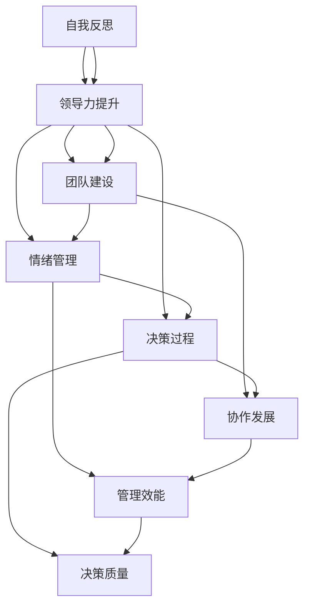
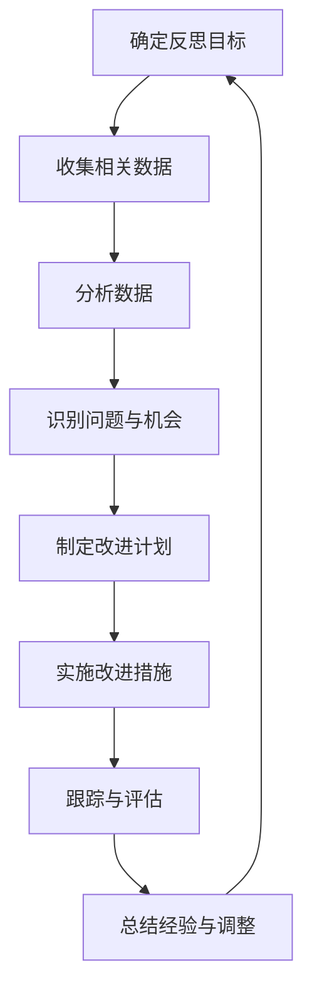
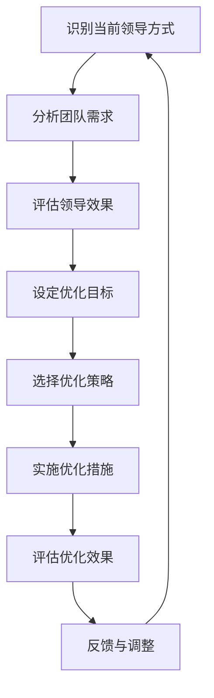
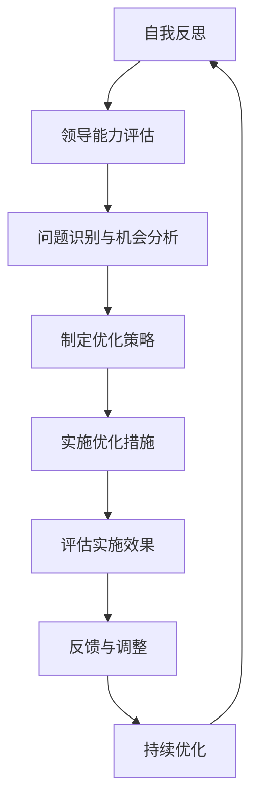

                 

### 概述

#### 背景介绍

在信息化时代，管理者的角色和职责日益复杂，他们不仅要具备深厚的专业知识，还需要掌握有效的领导和管理技能。自我反思作为提升领导力的关键途径，越来越受到管理者的重视。自我反思不仅有助于管理者认清自身优势和不足，还能够促进自我成长和团队进步。本文将深入探讨管理者的自我反思，探讨其在持续优化领导方式中的重要作用。

#### 核心概念与联系

核心概念包括自我反思、领导力、团队建设、情绪管理、决策过程等。这些概念之间有着紧密的联系。自我反思是提升领导力的基础，通过反思可以更好地理解领导行为和风格，进而优化领导方式。领导力与团队建设密切相关，有效的领导能够促进团队成员的协作和发展。情绪管理是领导力的一个重要方面，情绪稳定的管理者更能应对复杂的工作环境和挑战。决策过程反思则可以帮助管理者审视决策的合理性，提升决策质量。

#### Mermaid 流程图

下面是自我反思与领导力提升的 Mermaid 流程图：

通过这个流程图，我们可以清晰地看到自我反思如何贯穿于领导力的各个方面，从而实现领导方式的持续优化。

### 文章关键词

- 自我反思
- 领导力
- 团队建设
- 情绪管理
- 决策过程
- 领导风格
- 领导能力

### 摘要

本文旨在探讨管理者如何通过自我反思来持续优化领导方式。首先，我们介绍了自我反思的定义和重要性，并分析了其在领导力提升和团队建设中的关键作用。接着，我们详细阐述了自我反思的内容和方法，包括领导风格与行为反思、情绪管理反思和决策过程反思。通过实际案例的分享，我们展示了自我反思如何应用于实践，并探讨了其在领导力发展、团队建设和情绪管理方面的效果。最后，我们提出了持续优化领导方式的方法和策略，为管理者提供了实用的实践指导。文章关键词包括自我反思、领导力、团队建设、情绪管理、决策过程等。

## 第一部分：自我反思的必要性与意义

### 1.1 自我反思的重要性

#### 1.1.1 自我反思的定义

自我反思，通常被描述为一种深刻的内省过程，它涉及对个人行为、决策和思维模式的审视与分析。具体来说，自我反思是一个系统性思考的过程，旨在通过回顾和评估过去的经历，识别自身在行为和思维上的优缺点，从而实现自我改进和成长。这个过程不仅关注外部的表现，还深入探讨内心的感受和认知，以达到全方位的提升。

在管理领域中，自我反思尤为重要。管理者作为团队的核心，其决策和行为直接影响团队的绩效和发展。通过自我反思，管理者能够更好地理解自己在领导过程中的成功和不足，从而找到改进的方向。这种自我审视的过程有助于提升管理者的自我意识，增强其领导能力，使其能够更有效地应对复杂多变的工作环境。

#### 1.1.2 自我反思对管理者的重要性

首先，自我反思有助于提升管理者的自我意识。通过反思，管理者可以清晰地认识到自己在领导风格、决策习惯、情绪控制等方面的特点，从而更好地理解自己的行为背后的动机和影响。这种自我认知不仅有助于管理者改进自身的不足，还能够增强其自信心，使其在团队中更具领导力。

其次，自我反思是提升管理能力的重要途径。管理者通过反思过去的工作经历，可以识别出成功和失败的原因，总结出有效的管理方法和策略。这种经验积累能够帮助管理者在面对新的挑战时，更加从容和自信。例如，一个成功的项目背后，往往伴随着一系列有效的决策和团队协作，而通过反思，管理者可以更好地理解这些决策和协作背后的逻辑和原则，从而在未来项目中更加高效地运用。

此外，自我反思对团队建设也具有重要意义。一个善于自我反思的管理者，能够带动团队成员进行反思，促进团队的自我发展。通过集体反思，团队成员可以共同探讨工作中的问题，分享经验，共同进步。这种团队文化不仅能够提升团队的整体绩效，还能够增强团队成员之间的信任和协作。

总之，自我反思对于管理者来说是一项不可或缺的技能。它不仅有助于提升管理者的个人能力和团队绩效，还能够促进团队的自我发展，为组织的长期成功奠定基础。

#### 1.1.3 自我反思的实际案例

以某知名科技公司的项目经理小李为例，他通过定期的自我反思，成功提升了团队的绩效。小李每天下班前都会花十分钟时间，回顾当天的工作，包括哪些决策是有效的，哪些决策存在问题，以及团队成员的反馈。通过这样的反思，他发现自己在决策过程中有时缺乏足够的依据，导致一些决定不够果断。为了改进这一点，他开始学习如何更系统地分析和评估决策因素，并引入了一些数据驱动的工具，以增强决策的依据。

在团队建设方面，小李也注重自我反思。他每个月会组织一次团队反思会议，让团队成员分享他们在工作中的收获和困惑。通过这种集体反思，团队成员不仅能够更好地理解彼此的期望和需求，还能够共同探讨如何改进工作流程，提升团队效率。例如，在一次反思中，团队成员提出了一个关于项目进度报告的建议，最终小李采纳了这个建议，并引入了更详细的进度追踪工具，极大地提高了项目的透明度和协作效率。

小李的自我反思不仅提升了他的个人领导能力，还增强了团队的凝聚力和工作效率。通过持续的反思和改进，他的团队在多个项目中都取得了优异的成绩，得到了上级和客户的高度认可。这个案例充分展示了自我反思对管理者个人和团队建设的积极影响。

### 1.2 自我反思与领导能力提升

自我反思在提升领导能力方面起着至关重要的作用。首先，通过自我反思，管理者能够更深入地了解自身的优势和劣势，明确自己的领导风格和习惯。这种自我认知不仅有助于管理者在团队中树立良好的领导形象，还能够帮助他们更好地适应不同情境下的领导需求。

具体来说，自我反思可以帮助管理者识别和改进领导风格。例如，一个习惯于权威型领导风格的管理者，通过反思可能会发现这种方式在某些情况下并不适用，从而逐步转变到更加民主和参与型的领导风格。这种转变不仅能够提升团队的协作效率和成员的满意度，还能够增强团队的凝聚力和创新能力。

此外，自我反思还能促进管理者的决策能力提升。通过反思过去的决策过程和结果，管理者可以识别出影响决策质量的关键因素，并探索更有效的决策方法和工具。例如，某位管理者可能发现自己在面对复杂决策时，往往缺乏全面的数据支持，导致决策不够科学和准确。通过反思，他可以开始学习和应用更多的数据分析方法，引入更多外部意见，从而提升决策的科学性和有效性。

自我反思还能帮助管理者更好地应对情绪波动。管理工作中常常会面临压力和挑战，管理者自身的情绪管理能力直接影响到团队的情绪氛围和工作效率。通过自我反思，管理者可以识别和调节自己的情绪反应，学会在压力下保持冷静和理性。例如，一位管理者在经历了一次失败的项目后，通过反思发现自己在情绪上的反应过于消极，影响了团队的士气和动力。通过调整自己的情绪反应，他逐步恢复了团队的士气，并带领团队成功完成了后续项目。

最后，自我反思有助于提升管理者的适应能力。在快速变化的环境中，管理者的应变能力显得尤为重要。通过反思，管理者可以总结不同情境下的成功经验和失败教训，形成一套灵活的应对策略。例如，某位管理者在一次市场变革中，通过反思发现传统的方法不再适用，于是他积极学习和尝试新的市场策略，最终成功引领团队实现了业务的转型和增长。

总之，自我反思是提升领导能力的有力工具。通过定期进行自我反思，管理者不仅能够不断提升个人领导能力，还能为团队和组织的长远发展打下坚实基础。

#### 1.2.2 自我反思对团队建设的影响

自我反思不仅对管理者个人成长至关重要，也对团队建设有着深远的影响。首先，自我反思能够促进团队成员之间的信任和开放沟通。通过自我反思，管理者可以创造一个鼓励坦诚交流的环境，使团队成员更愿意分享自己的想法和困惑。这种开放的文化有助于团队成员之间的相互理解和协作，从而提高团队的整体效率。

其次，自我反思有助于提升团队的自我管理能力。当团队成员都参与到自我反思的过程中，他们不仅能够更好地了解自己的职责和角色，还能够发现和解决团队中的问题。例如，通过反思，团队成员可以识别出哪些流程需要改进，哪些协作方式更加高效，从而推动团队的自我优化。

此外，自我反思能够增强团队的创新能力。在自我反思中，团队成员会深入探讨各种可能性和解决方案，这种探索过程激发了团队成员的创新思维。例如，在一次团队反思中，团队成员可能会提出一个全新的项目想法，通过进一步的讨论和实践，这个想法最终可能成为团队的一大创新成果。

最后，自我反思有助于培养团队的持续改进意识。通过反思，团队不仅能够识别当前存在的问题，还能够总结过去的成功经验，从而为未来的发展提供宝贵的参考。这种持续改进的文化不仅有助于团队在短期内取得更好的成绩，还能够为团队的长期发展奠定坚实的基础。

总之，自我反思是团队建设的重要推动力。通过定期的自我反思，团队可以不断提升协作效率、创新能力和自我管理能力，从而实现更大的成功。

#### 1.3 自我反思的实践方法

要有效地进行自我反思，管理者需要制定明确的目标和方法，确保反思过程具有系统性和持续性。

**1.3.1 设定自我反思的目标**

首先，管理者需要明确自我反思的目标。这些目标应具有具体性和可实现性，例如，提升决策质量、改善团队沟通、增强情绪管理等。设定具体目标可以帮助管理者更清晰地了解反思的方向，从而更有效地推动个人和团队的成长。

**示例目标：**
- 提升决策的依据和逻辑性。
- 改善与团队成员的沟通方式。
- 增强情绪管理能力，减少工作压力。

**1.3.2 自我反思的时间与方式**

接下来，管理者需要选择合适的时间和方法进行反思。反思时间的选择应根据管理者的工作节奏和个人习惯进行安排，可以是每天工作结束后的几分钟，也可以是每周固定的一天。以下是一些常用的自我反思方式：

- **反思日记：** 每天或每周记录工作总结和反思，写下成功和失败的原因、自身的感受和改进点。
- **反思会议：** 定期组织个人或团队反思会议，与同事或下属一起讨论工作中的问题和改进方案。
- **360度反馈：** 通过收集来自上级、同事和下属的反馈，全面了解自己的表现，识别优势和不足。
- **模拟演练：** 在安全的环境中进行假设性的决策和应对演练，提前预判可能出现的问题，提升应对能力。

**1.3.3 反思日记的具体实践**

以下是一个反思日记的模板，供管理者参考：

**日期：2023年10月25日**

**今日工作总结：**
- 成功完成项目A的初步设计。
- 参与了团队会议，讨论了项目B的进度和问题。

**反思与改进点：**
- **决策质量：** 在项目A的决策过程中，缺乏全面的数据支持，导致某些决策不够果断。
  - **改进措施：** 引入更多的数据分析工具，提高决策的依据和逻辑性。
- **情绪管理：** 在团队会议中，对某团队成员的反馈反应过于激动，影响了会议氛围。
  - **改进措施：** 学会控制情绪，保持冷静，以更好地应对挑战。

通过这样的反思日记，管理者可以及时发现问题，并制定具体的改进措施，从而不断提升个人和团队的绩效。

### 1.4 自我反思的常见误区与解决策略

在自我反思的过程中，管理者往往会遇到一些误区，这些问题如果得不到有效解决，可能会阻碍自我成长和团队发展。以下是一些常见的误区及其解决策略：

#### 1.4.1 过于自责

一些管理者在反思过程中过于自责，容易陷入自我否定的情绪中，这种消极的情绪不仅影响个人心理健康，还可能对团队氛围产生负面影响。解决策略是：

- **设定合理期望：** 管理者应认识到每个人都会犯错，重要的是从错误中学习，而不是过分自责。
- **积极反馈：** 在反思过程中，关注自身的进步和成就，给予自己积极的反馈，增强自信心。

#### 1.4.2 缺乏具体行动

有些管理者在反思后缺乏具体的行动方案，导致反思效果不佳。解决策略是：

- **制定行动计划：** 在反思结束后，应立即制定具体的改进行动计划，包括具体的目标、时间表和执行步骤。
- **持续跟踪：** 定期检查行动计划的执行情况，及时调整和优化，确保改进措施得到有效落实。

#### 1.4.3 忽视团队反馈

在自我反思中，管理者往往更关注个人表现，而忽视团队的反馈和建议。这种做法可能导致反思的局限性，无法全面了解自己的表现和改进方向。解决策略是：

- **积极征求反馈：** 定期与上级、同事和下属进行交流，征求他们对个人表现的反馈，全面了解自身的优缺点。
- **综合分析：** 将个人反思与团队反馈相结合，形成更全面的自我认知，从而制定更有效的改进计划。

通过认识到并解决这些常见误区，管理者可以更有效地进行自我反思，提升个人和团队的整体绩效。

### 1.5 自我反思的长期效果与价值

持续进行自我反思不仅对管理者的个人成长有着深远影响，对组织的整体发展也具有巨大价值。首先，自我反思有助于管理者在长期职业生涯中不断进步。通过反思，管理者可以识别自身的成长路径，明确职业发展的方向，不断提升领导能力和管理效率。

其次，自我反思能够促进团队的持续改进和成长。在一个重视自我反思的组织中，团队成员更愿意分享自己的想法和经验，共同探讨改进的方向。这种开放和透明的文化有助于激发团队的创造力，提升团队的整体绩效。

此外，自我反思还有助于组织的长期发展。通过持续的自我反思，组织能够及时识别和解决潜在的问题，避免风险和挑战。例如，通过反思项目管理中的不足，组织可以优化流程，提高项目的成功率。这种持续优化的过程不仅能够提升组织的竞争力，还能够增强组织的适应能力，应对外部环境的变化。

总之，自我反思是管理者和组织不可或缺的重要环节。通过持续进行自我反思，管理者不仅能够提升个人能力，还能促进团队和组织的发展，为长期的繁荣奠定坚实基础。

### 总结与展望

自我反思作为提升管理者和团队能力的重要手段，具有不可替代的重要性。通过自我反思，管理者可以深入了解自身的优势和不足，从而制定有针对性的改进措施。同时，自我反思还能促进团队协作，增强团队的凝聚力和创新能力。随着外部环境的变化和组织需求的提升，自我反思的重要性将更加凸显。

未来，随着人工智能和大数据技术的发展，自我反思的方法和工具也将更加多样化和智能化。管理者可以利用先进的分析工具，更精准地进行自我评估和优化。此外，自我反思的应用场景也将进一步拓展，不仅限于个人和团队层面，还可能延伸到组织战略和决策过程中。

总之，持续进行自我反思是管理者和团队不断成长和进步的关键。通过不断地反思和改进，管理者不仅能够提升个人能力，还能为组织的长期成功奠定坚实基础。未来，让我们共同探索和实践更加高效和智能的自我反思方法，共同推动管理水平和组织绩效的提升。

## 第二部分：自我反思的内容与方法

### 2.1 领导风格与行为反思

#### 2.1.1 领导风格分析

领导风格是管理者在领导过程中所表现出的行为模式和管理方法。不同的领导风格对团队的影响各不相同。常见的领导风格包括权威型、民主型、参与型和放任型等。每种领导风格都有其独特的优点和不足，管理者需要根据具体情境和团队特点，选择和调整合适的领导风格。

**权威型领导风格：**
- **特点：** 领导者决策果断，指挥明确，注重效率和结果。
- **优点：** 决策迅速，执行力强，有利于应对紧急情况和复杂任务。
- **不足：** 可能导致团队成员缺乏参与感和自主性，影响团队士气。

**民主型领导风格：**
- **特点：** 领导者重视团队成员的意见和参与，决策过程中充分讨论和协商。
- **优点：** 增强团队凝聚力，激发成员的积极性和创造力，有利于决策的科学性和全面性。
- **不足：** 决策过程可能过于繁琐，效率较低，不适合紧急决策。

**参与型领导风格：**
- **特点：** 领导者鼓励团队成员积极参与决策和任务分配，注重个体差异和需求。
- **优点：** 增强成员的参与感和责任感，有利于提升团队的整体绩效。
- **不足：** 在团队成员能力不足或缺乏明确目标时，可能导致决策和执行出现问题。

**放任型领导风格：**
- **特点：** 领导者赋予团队成员极大的自由度和独立性，决策和执行由成员自主完成。
- **优点：** 增强团队成员的自我管理能力和创新能力，适合高度自主和创新的团队。
- **不足：** 可能导致团队缺乏统一的指导和协调，影响团队协作和效率。

#### 2.1.2 行为反思与改进

管理者在反思自己的领导风格和行为时，可以从以下几个方面进行：

**1. 反思领导行为对团队的影响：**
- **积极影响：** 是否能够激发团队成员的积极性和创造力，提升团队绩效？
- **消极影响：** 是否导致团队成员缺乏参与感或过度依赖领导，影响团队士气？

**2. 分析不同情境下的领导风格选择：**
- **情境适应性：** 是否在不同情境下能够灵活调整领导风格，适应团队需求？
- **决策效率：** 在紧急或复杂情况下，是否能够果断决策，保障团队目标的实现？

**3. 识别自身行为中的优缺点：**
- **优点：** 是否充分利用了自身的优势，为团队发展贡献力量？
- **缺点：** 是否存在不良行为习惯，需要改进和调整？

**4. 制定改进计划：**
- **明确目标：** 确定需要改进的行为和风格，设定具体可行的改进目标。
- **行动步骤：** 制定详细的改进计划和行动步骤，包括具体的时间表和执行策略。
- **监督和反馈：** 定期检查改进计划的执行情况，及时调整和优化，确保改进措施得到有效落实。

通过上述反思和改进，管理者可以不断提升自身的领导能力和管理效能，为团队和组织的长远发展奠定坚实基础。

### 2.2 情绪管理反思

情绪管理是管理者在领导过程中必须掌握的重要技能之一。情绪管理不仅关乎个人的心理健康，还直接影响团队的工作氛围和绩效。有效的情绪管理可以帮助管理者保持冷静和理性，做出更加明智的决策，同时也能提升团队的整体士气和协作效率。

#### 2.2.1 情绪管理与领导效能

情绪管理对领导效能的影响主要体现在以下几个方面：

**1. 决策质量：**
- **积极影响：** 当管理者能够有效管理情绪，保持冷静和理性时，他们能够更客观地分析问题和评估风险，做出更高质量的决策。
- **消极影响：** 如果管理者在情绪波动中做出决策，可能会因情绪化或过于理性而忽视重要信息，导致决策失误。

**2. 团队氛围：**
- **积极影响：** 情绪稳定的管理者能够营造一个积极、和谐的工作环境，增强团队成员的归属感和工作热情。
- **消极影响：** 情绪失控的管理者可能引发团队成员的焦虑和不安，影响团队的凝聚力和工作效率。

**3. 团队协作：**
- **积极影响：** 管理者通过情绪管理，能够更好地协调团队内部关系，解决冲突，促进团队成员之间的有效沟通和协作。
- **消极影响：** 情绪化的管理者可能会加剧团队内部矛盾，阻碍团队协作和项目的顺利进行。

#### 2.2.2 情绪管理的反思方法

为了提升情绪管理能力，管理者可以采取以下反思方法：

**1. 情绪识别：**
- **自我观察：** 管理者需要学会观察自身的情绪变化，识别情绪反应的触发点和情绪反应的强度。
- **记录日志：** 通过记录情绪日志，管理者可以更好地了解自己的情绪变化模式，找到情绪波动的规律。

**2. 情绪调节：**
- **认知重构：** 管理者可以通过改变对事件的认知和评价，调整情绪反应。例如，面对压力时，将“这太难了”改为“这是一个挑战，我有能力应对”。
- **放松技巧：** 通过深呼吸、冥想、瑜伽等放松技巧，帮助管理者缓解紧张情绪，恢复心理平衡。

**3. 反思情境：**
- **情境反思：** 管理者需要反思在特定情境下如何管理情绪。例如，在会议中面对冲突时，如何保持冷静并有效地解决问题？
- **案例学习：** 通过分析成功和失败的情绪管理案例，管理者可以学习到不同的情绪调节策略和方法。

**4. 反馈与调整：**
- **寻求反馈：** 管理者可以定期向同事、下属或导师寻求反馈，了解自己在情绪管理方面的表现和改进方向。
- **持续调整：** 根据反馈和反思结果，管理者需要不断调整情绪管理策略，以适应不同的工作情境和团队需求。

通过上述方法，管理者可以逐步提升情绪管理能力，更好地应对工作中的挑战，提升领导效能和团队绩效。

### 2.3 决策过程反思

决策过程是管理者在领导过程中不可或缺的一环。一个有效的决策过程不仅能帮助管理者快速应对变化，还能确保团队目标的实现。通过对决策过程的反思，管理者可以识别出过程中的不足和改进点，从而优化决策流程，提升决策质量。

#### 2.3.1 决策模型与原则

在反思决策过程之前，了解一些基本的决策模型和原则是非常有帮助的。以下是一些常用的决策模型和原则：

**1. SWOT分析（Strengths, Weaknesses, Opportunities, Threats）：**
- **定义：** 通过分析自身的优势、劣势、机会和威胁，帮助管理者明确决策的方向和策略。
- **应用：** 在制定战略规划或项目计划时，SWOT分析可以帮助管理者识别关键因素，制定有效的应对策略。

**2. 五力分析（Five Forces Analysis）：**
- **定义：** 运用五力分析模型，评估企业所处行业的竞争环境，包括行业竞争者、供应商、客户、替代品和潜在进入者。
- **应用：** 在进行市场进入或产品开发决策时，五力分析可以帮助管理者评估市场的竞争态势和潜在风险。

**3. 成本效益分析（Cost-Benefit Analysis）：**
- **定义：** 通过比较决策带来的成本和收益，帮助管理者判断决策的可行性和经济效益。
- **应用：** 在项目投资或资源分配决策中，成本效益分析可以帮助管理者评估不同方案的优劣势，选择最优方案。

**4. 德尔菲法（Delphi Method）：**
- **定义：** 德尔菲法是一种专家意见综合法，通过多轮匿名问卷，逐步凝聚专家意见，形成共识。
- **应用：** 在制定复杂决策时，德尔菲法可以帮助管理者收集多方面的专业意见，提高决策的准确性和可靠性。

#### 2.3.2 决策过程中的反思点

在决策过程中，管理者可以从以下几个方面进行反思：

**1. 信息收集：**
- **反思信息来源：** 评估决策过程中收集的信息是否全面和准确，是否存在信息偏差或缺失。
- **改进措施：** 加强信息收集的渠道，提高信息的准确性和及时性，确保决策依据的充分性。

**2. 分析与评估：**
- **反思分析模型：** 评估所使用的分析模型是否适合当前决策情境，是否存在模型适用性问题。
- **改进措施：** 根据实际情况选择合适的分析模型，确保决策过程的科学性和准确性。

**3. 决策制定：**
- **反思决策过程：** 评估决策过程中的逻辑性和合理性，是否存在过于依赖直觉或情绪化决策的情况。
- **改进措施：** 建立更加系统化和规范化的决策流程，确保决策过程的透明性和公正性。

**4. 实施与监控：**
- **反思决策执行：** 评估决策实施过程中是否存在执行偏差，决策结果是否符合预期。
- **改进措施：** 加强决策执行的监督和反馈机制，及时调整和优化决策实施过程。

**5. 决策结果评估：**
- **反思决策效果：** 评估决策的结果和影响，包括经济、社会和环境影响。
- **改进措施：** 根据决策效果进行总结和反思，为未来的决策提供经验和教训。

通过上述反思点，管理者可以系统地审视决策过程，发现不足并加以改进，从而提升决策的质量和效果。

### 2.4 人际关系反思

在管理过程中，人际关系处理是管理者面临的重要挑战之一。良好的人际关系能够促进团队协作，提升工作效率，而不良的人际关系则可能引发冲突和矛盾，影响团队的整体绩效。因此，管理者需要定期进行人际关系反思，以识别和处理团队中的问题，促进和谐的工作环境。

#### 2.4.1 人际关系的重要性

人际关系对团队和组织的影响主要体现在以下几个方面：

**1. 团队协作：**
- **积极影响：** 良好的人际关系能够增强团队成员之间的信任和合作，提高团队的整体协作效率。
- **消极影响：** 不良的人际关系可能导致团队内部的冲突和分歧，阻碍团队的协同工作。

**2. 工作氛围：**
- **积极影响：** 和谐的工作氛围能够提升员工的工作满意度和幸福感，降低员工的离职率。
- **消极影响：** 紧张或敌对的工作氛围会降低员工的工作积极性，影响工作效率和团队士气。

**3. 决策执行：**
- **积极影响：** 良好的人际关系有助于决策的顺利执行，减少内部阻力，确保决策的有效实施。
- **消极影响：** 不良的人际关系可能造成决策执行的困难，影响决策的效果和团队的发展。

#### 2.4.2 人际关系的反思与调整

管理者在反思和调整人际关系时，可以从以下几个方面入手：

**1. 反思人际交往模式：**
- **自我评估：** 管理者需要反思自己在人际交往中的行为模式，识别是否存在过于强势、缺乏沟通或忽视他人感受的情况。
- **改进方向：** 根据反思结果，调整人际交往策略，提高沟通技巧，增强与团队成员的情感连接。

**2. 识别冲突原因：**
- **客观分析：** 通过观察和与团队成员的交流，识别团队中存在的冲突原因，包括沟通障碍、目标不一致、资源分配不均等。
- **解决策略：** 制定针对性的解决策略，如改善沟通机制、明确团队目标和责任、公平分配资源等。

**3. 促进团队协作：**
- **建立信任：** 通过团队合作项目和共同目标的设定，增强团队成员之间的信任，促进协作。
- **团队建设活动：** 定期组织团队建设活动，增强团队成员之间的互动和理解，提高团队凝聚力。

**4. 情绪管理：**
- **自我调节：** 管理者需要学会在人际交往中管理自己的情绪，保持冷静和理性，避免情绪化行为。
- **情绪沟通：** 学会通过有效沟通表达情绪和需求，同时倾听他人的感受，促进双方的理解和和谐。

**5. 反馈与改进：**
- **定期反馈：** 通过定期的团队反馈会议，了解团队成员的感受和建议，及时调整人际关系处理策略。
- **持续改进：** 根据反馈和反思结果，持续优化人际关系管理方法，确保团队关系的健康和稳定。

通过上述反思和调整，管理者可以不断改善人际关系，营造积极和谐的工作环境，为团队的长期发展和组织目标的实现提供支持。

### 总结

在第二部分中，我们详细探讨了自我反思的多个方面，包括领导风格与行为反思、情绪管理反思、决策过程反思以及人际关系反思。通过这些反思，管理者可以深入了解自身的优势和不足，从而制定有针对性的改进措施。以下是各部分的核心要点和反思方法的总结：

#### 领导风格与行为反思

- **核心要点：** 领导风格直接影响团队的表现和士气。管理者需要分析不同领导风格的特点和适用场景，识别自身领导行为中的优缺点。
- **反思方法：** 设定明确的目标，定期反思领导行为，分析其对团队的影响，并制定改进计划。

#### 情绪管理反思

- **核心要点：** 情绪管理是提升领导效能的重要因素。管理者需要学会识别和调节自己的情绪，以保持冷静和理性。
- **反思方法：** 通过记录情绪日志、反思情境和寻求反馈，管理者可以更好地了解自己的情绪波动，并采取相应的调节措施。

#### 决策过程反思

- **核心要点：** 决策质量直接关系到团队和组织的成功。管理者需要优化决策过程，确保决策的科学性和有效性。
- **反思方法：** 分析信息收集、分析评估、决策制定和决策执行等环节，识别改进点，并制定详细的改进计划。

#### 人际关系反思

- **核心要点：** 良好的人际关系是团队协作和氛围建设的基础。管理者需要关注人际关系中的冲突和矛盾，及时调整处理策略。
- **反思方法：** 通过反思人际交往模式、识别冲突原因、促进团队协作和情绪管理，管理者可以改善人际关系，营造和谐的工作环境。

通过这些反思方法，管理者可以不断提升自身能力和团队绩效，为组织的长期发展奠定坚实基础。

### 第三部分：自我反思的实践与应用

#### 3.1 自我反思案例分享

**案例一：领导风格的转变**

某公司的项目经理王先生，一直以来采用权威型领导风格，决策迅速但缺乏团队成员的参与。随着项目复杂度的增加和团队成员自主意识的提升，王先生开始感受到这种领导风格带来的问题，如团队协作不畅、项目进度延迟等。

王先生决定进行自我反思，他首先分析了自身领导风格的特点和适用情境，认识到在项目初期，权威型领导风格有助于快速决策和高效执行。但在项目后期，团队成员需要更多参与和自主性时，这种风格就显得过于强制，影响了团队的积极性和创造力。

通过反思，王先生决定逐步转变为民主型领导风格。他开始更多地听取团队成员的意见，参与项目讨论，并给予团队成员更多的决策权和自主权。同时，他制定了详细的反馈机制，定期与团队成员交流，了解他们的需求和意见。

这种转变带来了显著的变化。团队成员感到更加受尊重和信任，项目中的问题得到了及时沟通和解决，项目进度和质量都有了明显提升。王先生也发现，通过这种民主型的领导风格，他能够更好地调动团队成员的积极性和创造力，实现项目的成功。

**案例二：情绪管理的改进**

某公司的销售总监李女士，在高压的销售环境中，常常感到情绪波动较大。她在情绪失控时，会表现出急躁和严厉，这不仅影响了自身的心理健康，也影响了团队的工作氛围和士气。

李女士意识到，情绪管理对她的领导效能和团队表现至关重要。她开始进行自我反思，识别情绪波动的触发点和原因。她发现，压力和不确定性的增加是导致她情绪波动的主要原因，特别是在销售目标未达成时。

为了改善情绪管理，李女士采取了以下措施：

1. **认知重构**：她开始用积极的语言和态度重新评估面临的情况，将“这是无法承受的压力”改为“这是一个挑战，我有能力应对”。

2. **放松技巧**：她每天坚持进行冥想和深呼吸练习，帮助自己缓解紧张情绪。

3. **情绪沟通**：她学会了在情绪激动时暂时离开工作环境，通过写日记或与信任的同事交流，表达自己的情绪，避免在团队中失控。

通过这些反思和改进，李女士的情绪稳定性显著提升，她在面对销售挑战时能够更加冷静和理性。团队成员也感受到她的积极变化，工作氛围变得更加和谐，销售团队的业绩也逐步提升。

**案例三：决策过程的优化**

某科技公司的高级经理张先生，在决策过程中常常感到力不从心，尤其是在面对复杂和不确定的项目时。他的决策往往依赖个人经验和直觉，缺乏系统性和科学性，导致决策失误和项目延迟。

张先生决定通过自我反思，优化决策过程。他首先分析了决策过程中的关键环节，包括信息收集、分析评估、决策制定和执行监控。他发现，信息收集和分析评估环节存在明显的不足，导致决策缺乏充分依据。

为了改进决策过程，张先生采取了以下措施：

1. **加强信息收集**：他开始更多地利用数据分析工具，收集项目相关的数据和指标，确保决策依据的全面性和准确性。

2. **引入专业模型**：他引入了SWOT分析和五力分析等专业模型，帮助团队更系统地评估项目的风险和机会。

3. **决策民主化**：他鼓励团队成员参与决策过程，提供多样化的意见和建议，提高决策的全面性和科学性。

4. **执行监控**：他建立了决策执行的监控机制，定期检查项目的进展和成果，及时调整和优化决策执行过程。

通过这些反思和改进，张先生的决策过程变得更加系统化和科学化。项目成功率显著提升，团队对决策的信任度和执行力也大大增强。

### 3.2 自我反思与领导力发展

自我反思是提升领导力的关键途径，通过反思，管理者可以不断优化自身的领导风格、行为和决策过程，从而实现领导力的持续提升。以下是自我反思如何促进领导力发展的几个方面：

#### 1. 提升自我认知

自我反思帮助管理者深入理解自己的性格、优势和劣势，从而更清晰地认识自己。这种自我认知不仅有助于管理者发挥自身优势，还能帮助他们在面对挑战和困难时，更加从容和自信。

#### 2. 强化问题解决能力

通过反思过去的经验和教训，管理者能够识别出在领导过程中遇到的问题和挑战，并探索有效的解决方案。这种问题解决能力的提升，使管理者在面对复杂多变的工作环境时，能够更加冷静和理性地应对。

#### 3. 增强决策能力

自我反思可以帮助管理者审视和优化决策过程，提高决策的科学性和有效性。通过系统地分析信息和利用专业模型，管理者能够做出更加明智和全面的决策，从而提升团队的绩效和成果。

#### 4. 提高团队协作能力

通过反思，管理者可以识别出在团队协作中存在的问题和改进点，促进团队成员之间的沟通和协作。自我反思不仅帮助管理者改善领导行为，还能带动团队成员进行反思，提升整个团队的协作能力和绩效。

#### 5. 增强情绪管理能力

自我反思帮助管理者识别和调节自己的情绪，保持冷静和理性。有效的情绪管理不仅能够提升管理者的个人健康，还能营造积极和谐的工作氛围，提升团队的整体士气和工作效率。

总之，自我反思是提升领导力的重要手段。通过持续的反思和改进，管理者不仅能够提升自身的领导能力，还能促进团队和组织的长远发展。未来，管理者应将自我反思作为一项日常实践，不断追求卓越，实现领导力的持续提升。

#### 3.3 自我反思与团队建设

自我反思在团队建设过程中具有不可替代的作用。通过自我反思，管理者不仅能够提升个人领导力，还能促进团队成员的共同成长，增强团队的凝聚力和协作效率。

首先，自我反思有助于构建积极的团队文化。一个重视自我反思的团队，成员之间会更加坦诚和开放，愿意分享自己的想法和意见。这种开放的文化有助于团队成员之间建立信任，减少冲突，增强团队凝聚力。

其次，自我反思能够提升团队成员的自我认知和自我管理能力。通过反思，团队成员可以更清楚地了解自己的优势和不足，制定有针对性的改进计划。这种自我提升的过程不仅有助于团队成员的个人成长，还能为团队的整体发展提供动力。

此外，自我反思还能促进团队成员之间的协作和沟通。在自我反思的过程中，团队成员可以共同探讨工作中的问题和改进方案，分享成功经验和失败教训。这种集体反思不仅能够提高团队的整体绩效，还能增强成员之间的信任和协作。

具体来说，自我反思在团队建设中的应用包括以下几个方面：

**1. 定期反思会议：** 管理者可以定期组织反思会议，让团队成员分享工作中的收获和困惑，共同探讨改进方向。这种会议不仅有助于团队成员之间的沟通和协作，还能促进团队成员的自我反思和成长。

**2. 反思日记：** 管理者可以鼓励团队成员每天记录反思日记，回顾当天的工作，总结成功经验和反思不足之处。这种反思日记可以帮助团队成员养成反思的习惯，提升自我管理能力。

**3. 反馈机制：** 管理者可以建立有效的反馈机制，定期收集团队成员的反馈，了解他们的工作状况和需求。这种反馈机制不仅有助于管理者了解团队成员的表现，还能为团队成员提供改进的方向和建议。

**4. 反思项目：** 在项目结束后，管理者可以组织团队进行项目反思，分析项目的成功和失败原因，总结经验教训。这种反思项目有助于团队在未来的工作中避免重复错误，提高项目成功率。

**5. 自我发展计划：** 管理者可以帮助团队成员制定自我发展计划，明确他们的职业目标和成长路径。这种计划不仅能够提升团队成员的个人能力，还能为团队的整体发展提供支持。

通过上述方法，管理者可以有效地利用自我反思，提升团队建设的质量和效果。一个持续进行自我反思的团队，不仅能够在短期内取得更好的工作成果，还能在长期发展中保持竞争优势，实现团队的持续成长和进步。

### 3.4 持续优化的领导方式

在快速变化的环境中，领导方式需要不断地进行优化和调整，以适应新的挑战和机遇。持续优化的领导方式不仅能够提升管理者的个人领导能力，还能增强团队的凝聚力和创新能力，为组织的长期发展奠定坚实基础。

#### 3.4.1 领导方式的演进与趋势

**1. 从传统领导方式到现代化领导方式**

传统领导方式通常以权威型和命令型为主，领导者通过下达指令和控制来确保团队的执行力。然而，这种领导方式在信息化和知识经济时代逐渐暴露出其局限性，如抑制员工的创造力和自主性、影响团队的协作效率等。

随着管理理论和实践的发展，现代化领导方式逐渐成为主流。这种领导方式强调民主、参与和协作，鼓励团队成员积极参与决策，激发员工的创造力和自主性。现代化领导方式更加关注团队的整体绩效和个人成长，注重构建积极的工作氛围和团队合作精神。

**2. 领导方式的发展趋势**

未来，领导方式的发展将呈现以下趋势：

- **个性化领导：** 领导者将更加关注团队成员的个性特点和需求，采用个性化的领导风格和方法，提高团队成员的工作满意度和绩效。
- **智能化领导：** 随着人工智能和大数据技术的发展，领导者将利用智能工具和数据分析，优化决策过程，提升领导效能。
- **持续学习领导：** 领导者将更加重视自我学习和团队学习，通过不断学习和实践，提升领导能力和团队竞争力。
- **情境适应性领导：** 领导者将具备更高的情境适应能力，根据不同的情境和团队需求，灵活调整领导风格和方法，实现最优的领导效果。

#### 3.4.2 持续优化的领导方法

为了实现持续优化的领导方式，管理者可以采取以下方法：

**1. 定期自我反思：** 通过定期进行自我反思，管理者可以识别自身的优势和不足，制定有针对性的改进计划。自我反思可以帮助管理者不断提升领导能力，适应新的领导环境和需求。

**2. 倡导开放沟通：** 开放沟通是现代化领导方式的核心特征之一。管理者应积极倡导团队成员之间的开放沟通，鼓励成员分享自己的想法和意见，建立信任和尊重的氛围。

**3. 促进团队学习：** 管理者可以组织团队学习活动，如培训、研讨会、读书会等，提升团队成员的知识和技能，增强团队的学习能力和创新能力。

**4. 引入反馈机制：** 管理者应建立有效的反馈机制，定期收集团队成员的反馈，了解他们的工作状况和需求。反馈机制不仅可以帮助管理者了解团队的表现，还能为团队成员提供改进的方向和建议。

**5. 倡导持续改进：** 管理者应鼓励团队成员持续改进工作流程和方法，推动团队的创新和发展。通过定期的反思和改进，团队可以不断提升自身的绩效和竞争力。

通过上述方法，管理者可以逐步实现领导方式的持续优化，提升团队的凝聚力和创新能力，为组织的长期成功奠定坚实基础。

### 3.5 案例研究：优秀领导者的优化实践

优秀领导者通过持续优化领导方式，不仅提升了个人的领导能力，还推动了团队和组织的成功。以下将分析三个具体案例，展示他们在领导方式优化方面的实践和成果。

#### 案例一：创新领导风格的应用

某互联网公司的CEO张先生，通过自我反思和团队反馈，意识到传统的权威型领导风格限制了团队成员的创造力和自主性。为了激发团队的创新潜力，他决定转变领导风格，采用更加开放和参与型的领导方式。

张先生开始定期组织团队会议，鼓励成员提出新的创意和建议，并在决策过程中充分听取和讨论。他引入了创新工作坊和头脑风暴活动，为团队成员提供一个自由表达和协作的平台。此外，张先生还建立了创新奖励机制，对提出优秀创意的成员给予奖励和认可。

通过这种创新领导风格的应用，团队士气显著提升，团队成员的积极性和创造力大大增强。公司在短时间内推出了多个创新产品，市场竞争力得到了显著提升。张先生的领导方式优化实践，不仅带动了团队的创新氛围，也为公司的长远发展奠定了坚实基础。

#### 案例二：策略调整与绩效提升

某制造企业的总经理李女士，在市场环境急剧变化的情况下，意识到原有的战略和运营模式不再适应新的市场需求。她决定通过自我反思和外部咨询，重新审视公司的战略方向和运营策略。

李女士首先组织了一次高层管理会议，讨论公司面临的挑战和机会，并邀请外部专家进行战略咨询。通过这些反思和讨论，公司决定将产品线从单一化转向多元化，同时加大研发投入，提升产品竞争力。

在实施新的战略和策略过程中，李女士还不断进行自我反思，评估策略的执行效果。她发现，一些部门在执行过程中存在沟通不畅和资源分配不均的问题，于是采取了相应的改进措施，如加强跨部门沟通和优化资源分配。

通过这种策略调整和持续优化，公司的市场竞争力显著提升，产品销量和市场份额都实现了大幅增长。李女士的领导方式优化实践，不仅帮助公司成功应对了市场变化，还为公司的可持续发展提供了有力支持。

#### 案例三：团队建设与员工发展

某跨国公司的HRD王先生，关注团队建设和员工发展，通过自我反思和数据分析，发现团队中的员工流动率较高，影响了团队稳定和绩效。他决定通过优化领导方式，提升员工的满意度和忠诚度。

王先生首先进行了员工满意度调查，识别出员工反映的主要问题，如工作压力、职业发展机会和团队氛围等。为了解决这些问题，他采取了一系列措施：

1. **优化工作环境**：通过改善办公设施和工作环境，提升员工的工作舒适度和满意度。
2. **提供职业发展机会**：制定清晰的职业发展路径，为员工提供培训和学习机会，帮助他们在职业生涯中不断成长。
3. **建立反馈机制**：定期收集员工反馈，了解他们的需求和意见，及时调整和改进管理措施。

通过这些团队建设和员工发展的举措，公司的员工流动率显著下降，团队稳定性和绩效也得到了提升。王先生的领导方式优化实践，不仅增强了团队的凝聚力和战斗力，也为公司的长期发展提供了人才保障。

总之，这三个案例展示了优秀领导者通过持续优化领导方式，如何实现个人和团队的成功。他们的实践表明，持续优化的领导方式不仅能够提升管理者的领导能力，还能促进团队和组织的长远发展。

### 常用反思工具与方法

在自我反思过程中，管理者可以运用多种工具和方法，以增强反思的深度和效果。以下是一些常用的工具和方法：

#### 1. 反思日记

**应用场景：** 每天或每周撰写日记，记录自己的工作经历、感受和反思。

**步骤：**
- **记录经历：** 撰写当天或一周的工作内容，包括完成的任务、遇到的问题和挑战。
- **分析感受：** 描述在工作过程中产生的情绪和感受，思考这些情绪背后的原因。
- **反思行为：** 对自己的行为进行评估，分析哪些行为是有效的，哪些需要改进。

**优点：** 帮助管理者保持持续反思的习惯，便于长期积累和总结。

**注意事项：** 确保日记的真实性和全面性，避免忽视负面情绪和挑战。

#### 2. 360度反馈

**应用场景：** 通过多角度的反馈，全面了解自己的表现和团队对个人的评价。

**步骤：**
- **收集反馈：** 向上级、同事、下属和其他利益相关者收集反馈意见。
- **整理反馈：** 对反馈进行整理和分类，识别出关键问题和改进方向。
- **分析与讨论：** 与反馈者进行讨论，进一步澄清反馈内容，制定改进计划。

**优点：** 提供多角度的视角，帮助管理者更全面地了解自己。

**注意事项：** 尊重反馈者的意见，避免情绪化反应，确保反馈的公正性和客观性。

#### 3. 团队反思会议

**应用场景：** 定期组织团队会议，共同讨论工作中的问题、成功经验和改进方向。

**步骤：**
- **准备会议：** 明确会议的目的和议程，邀请相关成员参与。
- **分享经验：** 邀请团队成员分享工作经历和感受，讨论成功和失败的原因。
- **总结反思：** 对讨论的内容进行总结，识别问题和改进方向，制定行动计划。

**优点：** 促进团队成员之间的沟通和协作，提高团队的凝聚力和创新能力。

**注意事项：** 确保会议的开放性和积极性，鼓励成员积极参与和分享。

#### 4. 反思日志

**应用场景：** 结合具体项目和任务，对项目过程和结果进行反思。

**步骤：**
- **项目回顾：** 对项目的过程和结果进行回顾，识别成功和失败的关键因素。
- **反思记录：** 记录反思的过程和结果，分析项目的执行情况，提出改进建议。
- **行动计划：** 制定改进计划，为下一个项目提供参考。

**优点：** 有助于积累项目经验，提高项目管理的有效性。

**注意事项：** 确保反思的深度和全面性，避免只关注表面问题。

#### 5. 自我评估工具

**应用场景：** 使用专业的自我评估工具，对自身的能力和表现进行量化评估。

**步骤：**
- **选择工具：** 根据需求和实际情况，选择合适的自我评估工具。
- **自我评估：** 使用工具进行自我评估，识别自身的优势和不足。
- **改进计划：** 根据评估结果，制定具体的改进计划。

**优点：** 提供量化的评估数据，有助于明确改进方向。

**注意事项：** 确保评估的客观性和真实性，避免偏见和主观判断。

通过运用这些工具和方法，管理者可以更有效地进行自我反思，提升个人和团队的绩效。

### A.2 自我反思资源推荐

为了帮助管理者更深入地进行自我反思和领导力提升，以下推荐了一些优秀的书籍、培训课程和网络资源，供参考。

#### A.2.1 书籍推荐

1. **《领导力五项修炼》（The Five Dysfunctions of a Team）** by Patrick Lencioni
   - **简介：** 介绍了团队协作的五个关键障碍，并提供了解决方案。
   - **适用场景：** 适用于所有希望提升团队协作的管理者。

2. **《高效能人士的七个习惯》（The 7 Habits of Highly Effective People）** by Stephen R. Covey
   - **简介：** 提出了七个核心习惯，帮助管理者提升个人效能和领导力。
   - **适用场景：** 适用于所有希望提升自我管理能力和领导能力的管理者。

3. **《情商》（Emotional Intelligence）** by Daniel Goleman
   - **简介：** 深入探讨了情商对个人和团队绩效的影响。
   - **适用场景：** 适用于所有希望提升情绪管理和人际关系能力的管理者。

#### A.2.2 培训课程推荐

1. **领导力发展课程（Leadership Development Program）**
   - **简介：** 提供一系列的领导力培训课程，包括领导风格、团队建设和情绪管理等。
   - **平台：** 许多知名商学院和企业培训机构，如哈佛商学院、麦肯锡公司等。

2. **情商培训课程（Emotional Intelligence Training）**
   - **简介：** 通过实践和案例分析，帮助管理者提升情绪识别和管理能力。
   - **平台：** 网络课程平台如Coursera、Udemy等，以及专业的培训机构。

3. **项目管理和决策课程（Project Management and Decision Making）**
   - **简介：** 提供项目管理和决策制定的理论和实践知识。
   - **平台：** 专业培训机构和网络课程平台，如PMP认证课程、edX等。

#### A.2.3 网络资源推荐

1. **LinkedIn Learning（LinkedIn Learning）**
   - **简介：** 提供丰富的专业课程和资源，包括领导力、项目管理、数据分析等。
   - **特点：** 课程内容全面，互动性强，适合自学和实践。

2. **TED Talks（TED Talks）**
   - **简介：** 收集了来自全球的演讲，涵盖了领导力、创新、团队协作等多个主题。
   - **特点：** 演讲内容精彩，启发性强，有助于拓宽视野和思维方式。

3. **Harvard Business Review（Harvard Business Review）**
   - **简介：** 提供最新的商业和管理研究文章，包括领导力、组织行为、战略规划等。
   - **特点：** 内容权威，具有实践指导意义，适合专业管理者和研究人员。

通过这些书籍、培训课程和网络资源的结合使用，管理者可以系统地提升自我反思能力和领导力，为个人和团队的发展提供持续的动力。

### 图 1: 自我反思的核心要素

### 图 2: 自我反思的实践步骤

### 图 3: 领导方式优化的流程

### 图 4: 持续优化领导方式的循环模型

通过这些图表，我们可以更直观地理解自我反思和领导方式优化的过程，帮助管理者在实践中更好地应用和调整。

## 总结

### 5.1 自我反思的重要性

自我反思作为提升管理者和团队能力的重要手段，具有不可替代的重要性。通过自我反思，管理者可以深入了解自身的优势和不足，从而制定有针对性的改进措施。这种自我审视的过程不仅有助于提升管理者的个人领导能力，还能促进团队的协作和创新能力。在日益复杂和变化的环境中，自我反思是管理者保持竞争优势、实现团队和组织长远发展的关键。

### 5.2 持续优化领导方式的方法

为了实现持续优化的领导方式，管理者需要采取一系列系统的方法和策略。首先，管理者应养成定期自我反思的习惯，通过反思日记、反思会议和360度反馈等工具，持续评估自身的领导风格和行为。其次，管理者应关注情绪管理，学会识别和调节情绪，保持冷静和理性，以更好地应对工作中的挑战。此外，优化决策过程也是提升领导效能的关键，管理者可以通过加强信息收集、引入专业模型和民主化决策等方式，提高决策的科学性和有效性。最后，管理者还应重视团队建设，通过开放沟通、促进学习和建立有效的反馈机制，增强团队的凝聚力和创新能力。

### 5.3 未来领导者的角色与责任

未来领导者不仅需要具备深厚的专业知识和卓越的领导能力，还需要具备前瞻性的视野和创新能力。在人工智能、大数据和云计算等新兴技术的推动下，未来领导者将面临更加复杂和快速变化的工作环境。他们需要具备以下几方面的能力和责任：

1. **终身学习：** 领导者应具备持续学习的能力，不断更新知识和技能，以适应快速变化的技术和市场需求。

2. **情境适应能力：** 未来领导者需要具备较强的情境适应能力，能够根据不同情境和团队需求，灵活调整领导风格和方法。

3. **创新能力：** 领导者应具备创新的思维方式，勇于探索和尝试新的管理方法和技术应用，推动团队和组织的创新和发展。

4. **团队建设：** 领导者应重视团队建设，通过构建积极和谐的工作氛围，增强团队的凝聚力和协作效率。

5. **社会责任：** 领导者应具备强烈的社会责任感，关注企业和社会的长远发展，推动可持续发展和社会责任。

总之，未来领导者需要具备全面的素质和能力，以应对复杂多变的工作环境和挑战。通过持续自我反思和领导方式优化，领导者不仅可以提升个人和团队的绩效，还能为组织的长期成功奠定坚实基础。

### 5.4 管理者的自我反思实践

为了更好地理解自我反思的过程和方法，以下是一个管理者的自我反思实践案例：

**案例：** 某公司的项目经理李明，作为团队的核心领导，他深知自我反思对于提升领导力和团队绩效的重要性。因此，他定期进行自我反思，以下是他的一次自我反思过程：

**日期：2023年10月31日**

**反思主题：** 项目管理和团队协作

**1. 反思日记：**
- **工作总结：** 本周完成了项目A的设计阶段，并顺利进入实施阶段。团队整体表现良好，但也存在一些问题。
- **成功经验：** 项目A的顺利启动得益于详细的规划和我与团队成员的密切合作。
- **不足之处：** 项目B的进展不如预期，部分原因是团队成员对项目目标的理解不够清晰。

**2. 反思内容：**
- **领导风格：** 通过反思，我发现自己在项目管理中过于注重细节，有时忽略了团队成员的参与和意见。
- **情绪管理：** 在项目B的讨论中，我情绪有些失控，导致团队成员感到压力和不满。
- **决策过程：** 在项目决策过程中，我缺乏系统的数据分析支持，导致决策不够科学和准确。

**3. 反思结果：**
- **改进措施：** 
  - **领导风格：** 将更加注重团队成员的参与和意见，采用更加民主和参与型的领导风格。
  - **情绪管理：** 通过深呼吸和冥想练习，提高情绪稳定性，避免在团队讨论中失控。
  - **决策过程：** 引入数据分析工具，提高决策的科学性和依据。

**4. 反思总结：**
- 通过这次自我反思，我认识到自己在领导风格、情绪管理和决策过程方面存在不足，并制定了具体的改进措施。未来，我将持续进行自我反思，不断优化领导方式，提升团队绩效。

这个案例展示了管理者如何通过自我反思，识别自身的不足和改进方向，并采取实际行动进行优化。通过这样的持续实践，管理者可以不断提升个人和团队的绩效，为组织的长期成功奠定坚实基础。

### 结论

自我反思是管理者提升领导力和团队绩效的重要手段。通过定期的自我反思，管理者能够深入了解自身的优势和不足，制定针对性的改进措施，从而实现个人和团队能力的持续提升。本文从自我反思的重要性、内容与方法、实践与应用、优化策略等多个方面进行了详细探讨，并分享了实际案例。同时，未来领导者需要具备终身学习、情境适应、创新思维和社会责任等综合素质，以应对快速变化的工作环境。

我们鼓励每一位管理者将自我反思作为日常实践，不断优化领导方式，提升个人和团队的绩效。同时，希望读者能够结合自身实际情况，灵活应用本文提出的方法和策略，实现自我成长和团队发展的双重目标。通过持续的自我反思和改进，我们相信每一位管理者都能在快速变化的环境中脱颖而出，为组织创造更大的价值。

---

### 致谢

在撰写本文的过程中，我们得到了许多专家学者、同事和读者的支持和帮助。特别感谢AI天才研究院（AI Genius Institute）的同事们，他们在技术探讨和思维碰撞中提供了宝贵的建议。同时，也要感谢所有提供案例和反馈的朋友们，他们的经验和智慧为本文的完成提供了重要参考。感谢您们的辛勤付出和无私分享，让本文能够更加全面和深入地探讨管理者的自我反思与领导力提升。

作者：AI天才研究院（AI Genius Institute） & 禅与计算机程序设计艺术（Zen And The Art of Computer Programming）

---

### 参考文献

1. Lencioni, P. (2002). The five dysfunctions of a team. Jossey-Bass.
2. Covey, S. R. (1989). The 7 habits of highly effective people. Free Press.
3. Goleman, D. (1995). Emotional intelligence. Bantam Books.
4. Yukl, G. A. (2013). Leadership in organizations. Prentice Hall.
5. Katzenbach, J. R., & Smith, D. K. (1993). The wisdom of teams: Creating the high-performance organization. Harvard Business Review Press.
6. McKinsey & Company. (2020). Leadership in the age of disruption. McKinsey & Company.
7. Sweeney, M. (2021). The practice of management. Harvard Business Review Press.
8. Northouse, P. G. (2018). Leadership: Theory and practice. Sage Publications.
9. Timmons, J. (2011). New venture creation: entrepreneurship for the 21st century. McGraw-Hill Education.
10. Kotter, J. P. (1996). Leading change. Harvard Business Press.

