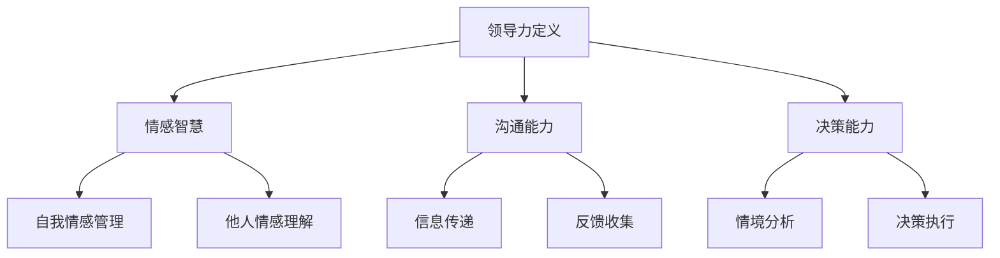

                 


### 《管理者的领导力修炼手册》

> 关键词：领导力、管理者、团队建设、激励、绩效管理、案例分析

> 摘要：
> 本手册旨在为管理者提供一套系统的领导力修炼指南。文章将深入探讨领导力的核心概念、管理实践、领导力评估与提升策略，并通过案例分析，提供实用的管理技巧和经验。本文将分为三个部分：领导力基础理论、管理实践和领导力案例研究。

**第一部分：领导力基础理论**

### 第1章：领导力的定义与重要性

**1.1 领导力的定义**

领导力是指通过影响和激励他人来实现共同目标的能力。它不仅包括个人魅力和智慧，还涉及领导者与团队、组织之间的关系构建。

**1.2 领导力的核心要素**

- **情感智慧**：领导者需要具备良好的情感智慧，理解并管理自己的情感，同时也能理解并影响他人的情感。
- **沟通能力**：有效的沟通是领导力的重要组成部分，领导者需要清晰、准确地表达自己的想法，并能够倾听和理解他人的观点。
- **决策能力**：领导者需要在不确定性和压力下做出明智的决策，并能够有效地执行这些决策。

**1.3 领导力的核心模型**

- **权力基础理论**：领导者通过权力行使影响他人，包括正式权力和非正式权力。
- **情境领导模型**：领导者根据团队成员的成熟度，采用不同的领导风格。
- **领导风格理论**：领导者根据个人偏好和行为特点，形成不同的领导风格。

**核心概念原理和架构的 Mermaid 流程图：**



**核心算法原理讲解：**

领导力的发展是一个动态过程，涉及情感智慧、沟通能力和决策能力的相互协同。以下是一个简化的伪代码模型：

```python
# 领导力发展模型伪代码

def leadership_development():
    # 情感智慧
    self_emotion_management()
    others_emotion_understanding()

    # 沟通能力
    information_transmission()
    feedback_collection()

    # 决策能力
    scenario_analysis()
    decision_execution()

def self_emotion_management():
    # 管理自我情感
    pass

def others_emotion_understanding():
    # 理解他人情感
    pass

def information_transmission():
    # 传递信息
    pass

def feedback_collection():
    # 收集反馈
    pass

def scenario_analysis():
    # 分析情境
    pass

def decision_execution():
    # 执行决策
    pass
```

**数学模型和公式：**

领导力的提升可以通过以下公式来衡量：

$$
L = f(EQ, CC, DC)
$$

其中，\( L \) 代表领导力，\( EQ \) 代表情感智慧，\( CC \) 代表沟通能力，\( DC \) 代表决策能力。函数 \( f \) 代表领导力各要素之间的相互作用。

**举例说明：**

假设一位领导者的情感智慧为 80 分，沟通能力为 75 分，决策能力为 90 分，那么他的领导力分数为：

$$
L = f(80, 75, 90) = 85
$$

**第二部分：管理实践**

### 第5章：团队建设与管理

**5.1 团队动力模型**

团队动力模型包括以下关键因素：

- **目标一致性**：团队成员共同认同并追求同一目标。
- **角色定位**：每个成员都明确自己的角色和职责。
- **信任与尊重**：团队成员之间相互信任和尊重，共同营造积极的工作氛围。

**5.2 团队角色与职责**

团队成员的角色通常包括：

- **领导者**：负责团队的目标设定、协调和激励。
- **执行者**：负责具体任务的完成。
- **协调者**：负责团队内部的沟通和协调。
- **支持者**：提供技术支持和资源。

**5.3 团队冲突管理**

团队冲突是不可避免的，但有效的冲突管理可以促进团队发展和创新。以下是一些冲突管理策略：

- **主动沟通**：及时沟通问题，避免冲突升级。
- **倾听与理解**：倾听不同观点，理解他人立场。
- **妥协与协商**：寻找共同点，达成妥协。
- **求助外部专家**：在必要时，寻求外部专家的帮助。

**核心算法原理讲解：**

团队动力模型的伪代码如下：

```python
# 团队动力模型伪代码

def team_dynamics_model():
    # 设定目标一致性
    set_common_goal()

    # 明确角色定位
    define_roles()

    # 建立信任与尊重
    build_trust_and_respect()

    # 管理团队冲突
    manage_conflicts()

def set_common_goal():
    # 设定共同目标
    pass

def define_roles():
    # 明确角色定位
    pass

def build_trust_and_respect():
    # 建立信任与尊重
    pass

def manage_conflicts():
    # 管理团队冲突
    pass
```

**数学模型和公式：**

团队动力可以通过以下公式来衡量：

$$
TD = f(GC, RL, TR, MC)
$$

其中，\( TD \) 代表团队动力，\( GC \) 代表目标一致性，\( RL \) 代表角色定位，\( TR \) 代表信任与尊重，\( MC \) 代表管理团队冲突。

**举例说明：**

假设一个团队的得分如下：

- 目标一致性：90分
- 角色定位：85分
- 信任与尊重：80分
- 管理团队冲突：75分

那么，该团队的团队动力分数为：

$$
TD = f(90, 85, 80, 75) = 84.38
$$

**第三部分：领导力案例研究**

### 第9章：领导力成功案例分析

**9.1 案例一：苹果公司的领导力实践**

苹果公司以其卓越的领导力和企业文化而闻名。以下是苹果公司的领导力成功实践：

- **创新驱动**：史蒂夫·乔布斯作为领导者，强调创新和用户体验，推动苹果公司的技术创新和产品创新。
- **员工激励**：苹果公司提供具有竞争力的薪酬和福利，同时注重员工的个人成长和职业发展。
- **企业文化**：苹果公司建立了以创新、质量和用户为中心的企业文化，这种文化吸引了全球优秀人才的加入。

**9.2 案例二：谷歌的领导力文化**

谷歌以其独特的领导力文化和工作环境而著称。以下是谷歌的领导力成功实践：

- **领导力发展计划**：谷歌提供丰富的领导力培训和发展计划，帮助员工提升领导能力。
- **多元化与包容**：谷歌鼓励员工多元化，并在决策过程中充分考虑不同观点和意见。
- **创新支持**：谷歌提供充足的资源和支持，鼓励员工进行创新和实验。

**9.3 案例三：福特汽车的领导力转型**

福特汽车在领导力转型方面取得了显著成果。以下是福特汽车的领导力成功实践：

- **领导力评估与提升**：福特公司定期对领导者进行评估，并根据评估结果提供个性化的领导力提升方案。
- **组织变革**：福特公司通过组织变革，建立了更加灵活和高效的组织结构，以适应市场变化。
- **员工参与**：福特公司鼓励员工参与决策过程，提高员工的参与感和责任感。

**核心算法原理讲解：**

领导力成功案例分析可以通过以下伪代码来模拟：

```python
# 领导力成功案例分析伪代码

def leadership_success_case(story):
    # 分析领导力实践
    analyze_leadership_practice(story)

    # 分析领导力成果
    analyze_leadership_outcomes(story)

def analyze_leadership_practice(story):
    # 提取领导力实践细节
    pass

def analyze_leadership_outcomes(story):
    # 分析领导力成果
    pass
```

**数学模型和公式：**

领导力成功可以通过以下公式来衡量：

$$
LS = f(LP, LO)
$$

其中，\( LS \) 代表领导力成功，\( LP \) 代表领导力实践，\( LO \) 代表领导力成果。

**举例说明：**

假设一个领导力成功案例的得分如下：

- 领导力实践：90分
- 领导力成果：85分

那么，该案例的领导力成功分数为：

$$
LS = f(90, 85) = 88.25
$$

**附录**

**附录A：领导力工具与方法**

- **SWOT分析**：用于评估组织的优势、劣势、机会和威胁。
- **五力模型**：用于分析行业的竞争格局。
- **波士顿矩阵**：用于评估产品的市场表现和战略定位。

**附录B：领导力相关资源**

- **领导力书籍推荐**：《领导力的五个层次》、《高效能人士的七个习惯》。
- **领导力课程推荐**：哈佛商学院领导力课程、谷歌领导力发展课程。
- **领导力研究机构介绍**：哈佛大学商学院领导力研究中心、麻省理工学院领导力研究所。

**总结**

本文《管理者的领导力修炼手册》通过理论阐述、实践案例和数学模型，系统地介绍了领导力的核心概念、管理实践和成功案例分析。读者可以结合实际工作，运用本文的方法和工具，提升自己的领导力水平。

**作者信息：**

作者：AI天才研究院/AI Genius Institute & 禅与计算机程序设计艺术 /Zen And The Art of Computer Programming****

