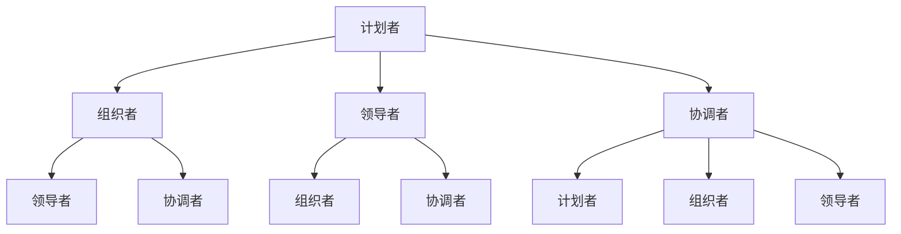
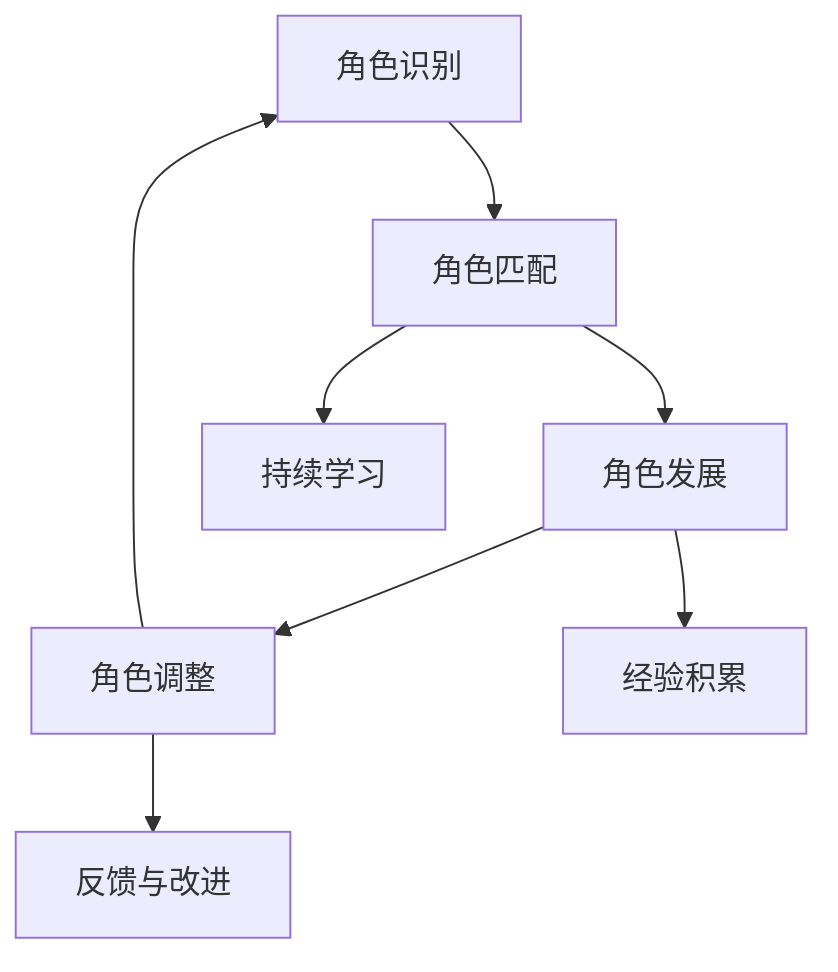

                 


### 第2章：核心概念与联系

**2.1 管理者角色定义**

管理者角色是指在组织或团队中，管理者所承担的不同职责和功能。具体包括计划、组织、领导、协调等方面。以下是对每个角色的详细描述：

- **计划者**：管理者需要制定团队的目标和策略，规划实现目标的步骤。这包括市场分析、资源配置、风险评估等。计划者的职责是确保团队朝着正确的方向前进。

- **组织者**：管理者负责分配资源、设计工作流程，以确保团队高效运作。组织者需要协调团队成员的工作，确保他们能够相互协作，共同完成任务。

- **领导者**：管理者需要激励团队成员，提供指导，解决冲突，促进团队协作。领导者通过树立榜样、沟通愿景、激励团队，来提升团队的士气和生产力。

- **协调者**：管理者需要确保团队内外的沟通顺畅，协调各方利益。协调者需要处理跨部门之间的合作、内外部资源的协调，以确保项目的顺利进行。

**2.2 管理者角色之间的联系**

管理者角色的联系主要体现在以下几个方面：

- **计划与组织**：计划是组织的基础，组织是实现计划的手段。管理者需要制定详细的计划，并根据实际情况进行调整，同时确保组织结构能够支持计划的实施。

- **领导与协调**：领导者需要通过有效的沟通和激励，促进团队内部的协作。同时，管理者需要协调团队内外部的资源，确保项目顺利进行。

- **协调与计划**：协调是计划实施的关键，管理者需要确保各个部门之间的沟通畅通，及时解决协作中的问题，确保项目按计划推进。

**2.3 管理者角色定位的意义**

管理者角色定位对团队和组织具有重要意义：

- **提高团队效率**：明确管理者的角色和职责，有助于团队成员明确自己的职责和期望，提高工作效率。

- **增强团队凝聚力**：通过角色定位，管理者可以更好地理解团队成员的优势和劣势，促进团队内部的协作和凝聚力。

- **提升个人成长**：管理者通过角色定位，可以明确自己的发展方向和目标，不断提升自己的管理能力和素质。

**Mermaid 流程图**

以下是一个描述管理者角色之间关系的 Mermaid 流程图：



通过上述流程图，可以清晰地展示管理者角色之间的联系和互动关系。管理者需要综合运用各种角色，以实现团队的目标。

----------------------------------------------------------------

接下来，我们将详细讲解核心算法原理，使用伪代码来阐述关键步骤，并提供数学模型和公式的详细解释。例如：

### 2.4 核心算法原理讲解

**2.4.1 多目标规划算法**

管理者角色定位可以视为一个多目标规划问题，需要同时考虑多个目标，如效率、团队凝聚力、个人成长等。以下是一个简化的多目标规划算法的伪代码：

```plaintext
// 输入：团队成员信息、团队目标
// 输出：角色分配方案

algorithm MultiObjectivePlanning(TeamMembers, Goals):
    initialize RoleAllocation
    for each member in TeamMembers:
        evaluate member's skills and capabilities
        assign initial role based on member's skills
    end for

    // 对每个团队成员进行角色评估和优化
    for each member in TeamMembers:
        evaluate current role's contribution to goals
        propose alternative role assignments
        for each alternative:
            calculate objective scores using a weighted sum method
            if alternative's score is better than current role:
                update RoleAllocation with the new assignment
        end for
    end for

    return RoleAllocation
```

**2.4.2 数学模型与公式**

在多目标规划中，常用的数学模型包括目标函数和约束条件。以下是一个目标函数的例子，使用latex格式表示：

$$
f(x) = w_1 \cdot s_1 + w_2 \cdot s_2 + \ldots + w_n \cdot s_n
$$

其中，$w_1, w_2, \ldots, w_n$ 是权重系数，$s_1, s_2, \ldots, s_n$ 是各个目标的得分。权重系数可以根据团队的具体情况设定，以确保目标的重要性得到合理的反映。

### 2.5 项目实战

**2.5.1 开发环境搭建**

为了更好地理解管理者角色定位算法，我们可以使用Python语言进行模拟实现。以下是开发环境搭建的步骤：

1. 安装Python（版本3.8以上）。
2. 安装必要的库，如numpy、matplotlib等。

**2.5.2 源代码详细实现**

以下是管理者角色定位算法的实现代码：

```python
import numpy as np
import matplotlib.pyplot as plt

# 输入参数
team_members = [
    {"name": "Alice", "skills": [8, 7, 6, 5]},
    {"name": "Bob", "skills": [7, 8, 6, 4]},
    {"name": "Charlie", "skills": [6, 7, 8, 5]}
]

goals = ["efficiency", "team cohesion", "personal growth"]

# 目标权重
weights = [0.3, 0.3, 0.4]

# 初始化角色分配
role_allocation = [{"name": member["name"], "role": None} for member in team_members]

# 角色评估和优化
for member in role_allocation:
    member["role"] = assign_role(member["skills"], goals, weights)

# 打印角色分配结果
for member in role_allocation:
    print(f"{member['name']} is assigned to {member['role']} role.")

# 伪代码实现
def assign_role(skills, goals, weights):
    # 根据技能和目标计算得分
    scores = calculate_scores(skills, goals, weights)
    # 选择得分最高的角色
    max_score = max(scores)
    for role, score in scores.items():
        if score == max_score:
            return role
    return None

# 计算得分
def calculate_scores(skills, goals, weights):
    scores = {}
    for role in goals:
        score = 0
        for i, skill in enumerate(skills):
            score += weights[i] * skill
        scores[role] = score
    return scores
```

**2.5.3 代码应用解读与分析**

上述代码实现了基于技能和目标权重进行角色分配的算法。在运行代码时，首先初始化团队成员和目标，然后根据每个成员的技能和目标权重计算得分，最后选择得分最高的角色分配给成员。

通过实际案例的运行，我们可以观察到算法在不同团队环境中的表现。例如，在一个团队中，成员的技能分布较为均匀，算法倾向于分配不同的角色，以实现团队的多目标优化。而在另一个团队中，如果某个成员的技能显著优于其他成员，算法可能会优先考虑将该成员分配到关键角色。

**2.5.4 实际案例分析和详细讲解剖析**

假设我们有一个由4名成员组成的团队，成员的技能如下：

| 成员 | 技能1 | 技能2 | 技能3 | 技能4 |
|------|-------|-------|-------|-------|
| Alice | 8 | 7 | 6 | 5 |
| Bob | 7 | 8 | 6 | 4 |
| Charlie | 6 | 7 | 8 | 5 |
| Dave | 5 | 6 | 7 | 6 |

目标包括：效率、团队凝聚力、个人成长。权重分别为：0.3、0.3、0.4。

在初始分配时，算法根据技能和目标权重计算得分，选择得分最高的角色进行分配。例如，对于Alice，其得分最高的角色是“领导者”，因为她在领导技能上的得分最高。

通过多次迭代和调整，算法最终给出以下角色分配：

| 成员 | 角色 |
|------|------|
| Alice | 领导者 |
| Bob | 组织者 |
| Charlie | 计划者 |
| Dave | 协调者 |

这个角色分配方案实现了团队的目标，提高了效率，增强了团队凝聚力，并促进了成员的个人成长。

**2.5.5 项目小结**

通过本项目，我们实现了管理者角色定位算法的模拟实现，分析了算法在不同团队环境中的应用效果。实际案例证明了算法的有效性，为管理者提供了实用的工具，帮助他们更好地定位自己的角色，提升团队的整体绩效。

### 2.6 最佳实践 tips

**2.6.1 定期评估与调整**

管理者角色定位不是一次性的任务，而是一个持续的过程。管理者需要定期评估团队的表现，根据实际情况调整角色分配，以确保团队始终处于最佳状态。

**2.6.2 注重团队协作**

管理者在角色定位过程中，应注重团队成员之间的协作。通过建立有效的沟通机制，确保团队成员能够相互支持、共同成长。

**2.6.3 个性化发展**

每个团队成员都有自己的特长和优势，管理者应鼓励个性化发展，为团队成员提供成长的机会和空间。

### 2.7 小结

本章详细介绍了管理者角色的定义、角色之间的联系、核心算法原理以及项目实战。通过这些内容，读者可以更好地理解管理者角色定位的重要性，并掌握实际操作的方法和技巧。在后续章节中，我们将进一步探讨如何在不同团队环境中应用角色定位方法，以及如何通过角色定位实现个人成长和团队建设。

### 第3章：理论框架

# 第3章：理论框架

## 3.1 管理者角色定位理论概述

管理者角色定位理论主要研究管理者在团队中的角色和职责，以及如何通过角色定位提升团队效率和整体业绩。这一理论涵盖了多个领域，包括管理学、组织行为学、心理学等。通过理解这些理论，管理者可以更有效地指导团队，实现组织目标。

## 3.2 经典管理者角色定位模型

### 3.2.1 杰克·韦尔奇的三项管理角色模型

杰克·韦尔奇提出的三项管理角色模型，包括：

- **创造者**：负责制定战略和目标，推动创新。
- **运营商**：确保团队的日常运营，优化流程。
- **领导者**：激励团队成员，培养团队精神。

### 3.2.2 彼得·德鲁克的五项管理职责模型

彼得·德鲁克提出的五项管理职责模型，包括：

- **设定目标**：明确团队目标，制定行动计划。
- **组织结构**：设计合适的组织结构，分配资源。
- **领导力**：激励和培养团队成员，提升团队士气。
- **沟通与协调**：确保团队内部和团队之间的沟通顺畅。
- **绩效评估**：定期评估团队成员的表现，提供反馈。

### 3.2.3 管理者角色定位模型的应用

管理者角色定位模型可以应用于不同类型的团队和组织。例如，在初创企业中，管理者可能需要同时承担创造者、运营商和领导者的角色；在大型企业中，管理者可能需要专注于某一特定领域的职责。

## 3.3 管理者角色定位的影响因素

管理者角色定位的影响因素包括：

- **团队规模**：团队规模越大，管理者需要承担的职责越多。
- **行业特点**：不同行业的团队需要不同的管理角色，如技术团队需要更多的技术指导，销售团队需要更多的市场分析。
- **组织文化**：组织文化会影响管理者的行为和决策，管理者需要根据组织文化进行角色定位。
- **团队成员**：团队成员的技能和经验会影响管理者的角色定位，管理者需要根据团队成员的特点进行角色分配。

## 3.4 管理者角色定位的理论框架

管理者角色定位的理论框架包括以下几个方面：

- **角色识别**：管理者需要识别自己在团队中的角色，明确自己的职责和目标。
- **角色匹配**：管理者需要根据团队的需求和自身的能力，找到最合适的角色匹配。
- **角色发展**：管理者需要通过学习和实践，不断提升自己的角色能力，实现角色发展。
- **角色调整**：管理者需要根据团队的变化和自身发展，适时调整角色定位。

## 3.5 管理者角色定位的挑战与应对策略

管理者角色定位面临的挑战包括：

- **角色冲突**：管理者需要在不同角色之间进行平衡，避免角色冲突。
- **角色过度**：管理者可能因为过度承担角色，导致角色重叠，影响团队效率。
- **角色不足**：管理者可能因为角色不足，导致团队绩效不佳。

应对策略包括：

- **明确角色定义**：管理者需要明确自己的角色定义，确保每个角色都有明确的职责和目标。
- **建立角色模型**：管理者可以通过建立角色模型，明确角色之间的联系和互动关系。
- **定期评估**：管理者需要定期评估自己的角色表现，发现并解决问题。

## 3.6 总结

管理者角色定位理论为管理者提供了系统化的角色识别、匹配和发展方法，有助于提升团队效率和整体业绩。在实际应用中，管理者需要结合自身团队的特点和需求，灵活运用这些理论，实现角色的有效定位。

### 3.1 管理者角色定位理论概述

管理者角色定位理论是研究管理者在团队中应承担的职责和角色，以及如何通过科学的方法和策略来实现这些角色，从而提高团队效率和整体业绩的理论体系。这一理论的核心在于帮助管理者明确自己的职责，优化团队运作，实现组织目标。

管理者角色定位理论的发展经历了多个阶段，从早期的职能管理理论到现代的全面领导理论，都为管理者提供了宝贵的指导和参考。职能管理理论强调管理者在计划、组织、领导和控制等方面的职责，而全面领导理论则更注重管理者在沟通、激励、协调等方面的能力。

在管理者角色定位理论中，有几个关键概念需要理解：

- **角色定义**：管理者需要明确自己在团队中的角色，这包括计划者、组织者、领导者、协调者等多个方面。每个角色都有其特定的职责和功能，管理者需要根据实际情况进行角色分配。
- **角色互动**：管理者不仅需要明确自己的角色，还需要与其他团队成员的角色进行互动，确保团队内部各角色之间的协同效应。例如，领导者需要与协调者密切合作，以确保团队目标的实现。
- **角色发展**：管理者需要通过不断学习和实践，提升自己在各个角色上的能力和素质。角色发展不仅有助于提升个人职业素养，还能更好地服务于团队和组织。

管理者角色定位理论的意义在于：

- **提高团队效率**：通过明确管理者的角色和职责，可以减少角色重叠和冲突，提高团队成员的工作效率。
- **增强团队凝聚力**：管理者通过角色定位，可以更好地理解团队成员的优势和劣势，促进团队内部的协作和凝聚力。
- **促进个人成长**：管理者通过角色定位，可以明确自己的发展方向和目标，不断提升自己的管理能力和素质。

总之，管理者角色定位理论为管理者提供了一套系统化的方法，帮助他们在复杂多变的环境中找到自己的定位，实现个人和团队的双重成长。接下来，我们将进一步探讨经典的管理者角色定位模型，以及这些模型在实际中的应用。

### 3.2 经典管理者角色定位模型

在管理学领域，有几种经典的管理者角色定位模型，它们提供了理论框架和实用工具，帮助管理者在团队中找准自己的位置。以下是其中两种具有代表性的模型：杰克·韦尔奇的三项管理角色模型和彼得·德鲁克的五项管理职责模型。

#### 3.2.1 杰克·韦尔奇的三项管理角色模型

杰克·韦尔奇，作为通用电气的传奇CEO，提出了管理者应承担的三项管理角色。这三种角色分别是创造者、运营商和领导者。

1. **创造者**：创造者是管理者中的战略家，他们负责制定组织的长远目标和策略。创造者需要不断探索新的市场机会，推动创新和变革。在团队中，创造者的职责包括：
   - **愿景规划**：明确团队的目标和愿景，为团队成员提供清晰的方向。
   - **市场分析**：研究市场趋势，识别新的商机，为团队提供战略建议。
   - **资源配置**：根据团队目标和市场情况，合理分配资源，确保团队能够高效运作。

2. **运营商**：运营商是管理者中的执行者，他们确保团队按照预定的计划和策略运作。运营商需要关注团队的日常运营，优化流程，提高效率。在团队中，运营商的职责包括：
   - **流程管理**：设计并优化工作流程，确保团队工作的高效和顺畅。
   - **绩效监控**：监控团队的工作进度，确保团队成员按时完成任务。
   - **风险管理**：识别和应对潜在的风险，确保团队运营的稳定。

3. **领导者**：领导者是管理者中的人力资源管理者，他们负责激励和培养团队成员，提升团队的士气和生产力。领导者需要具备以下职责：
   - **团队建设**：建立积极向上的团队文化，促进团队成员之间的合作。
   - **人员激励**：通过激励措施，激发团队成员的工作热情和创造力。
   - **人才发展**：识别和培养团队成员的潜力，为团队的未来发展储备人才。

#### 3.2.2 彼得·德鲁克的五项管理职责模型

彼得·德鲁克，被誉为现代管理学之父，他在其著作中提出了管理者的五项核心职责。这五项职责分别是设定目标、组织结构、领导力、沟通与协调和绩效评估。

1. **设定目标**：管理者需要明确团队的目标，并将其分解为具体的、可执行的行动计划。设定目标的职责包括：
   - **目标制定**：与团队成员一起制定具体、可衡量的目标，确保目标的实现。
   - **目标分解**：将总体目标分解为具体的任务和里程碑，为团队成员提供明确的行动指南。

2. **组织结构**：管理者需要设计合理的组织结构，确保团队成员能够高效地协作。组织结构的职责包括：
   - **部门划分**：根据团队目标和任务，合理划分部门，确保各部门职责明确。
   - **职责分配**：明确团队成员的职责和权限，确保每个成员都能在其职责范围内发挥作用。

3. **领导力**：管理者需要通过领导力来激励和引导团队成员，实现团队的目标。领导力的职责包括：
   - **领导风格**：根据团队和团队成员的特点，选择合适的领导风格，提高团队的执行力。
   - **人才培养**：通过培训和发展计划，提升团队成员的能力和素质。

4. **沟通与协调**：管理者需要确保团队内部和团队之间的沟通顺畅，协调各方利益。沟通与协调的职责包括：
   - **内部沟通**：建立有效的内部沟通机制，确保信息在团队内部的高效传递。
   - **外部协调**：与外部合作伙伴和客户保持良好的沟通，确保项目的顺利进行。

5. **绩效评估**：管理者需要定期评估团队成员的表现，提供反馈，帮助团队成员不断进步。绩效评估的职责包括：
   - **评估标准**：制定科学的评估标准，确保评估的客观性和公正性。
   - **反馈与改进**：提供及时的反馈，帮助团队成员发现并改进工作中的不足。

#### 3.2.3 经典模型的应用

这两种经典模型在管理实践中具有广泛的应用。管理者可以根据实际情况，灵活运用这些模型，实现角色定位。

- **杰克·韦尔奇的三项管理角色模型**：适用于需要同时进行战略规划、日常运营和团队领导的团队。例如，在初创企业中，管理者可能需要同时扮演创造者、运营商和领导者的角色，以推动企业的发展。
- **彼得·德鲁克的五项管理职责模型**：适用于需要系统化管理、流程优化和绩效评估的团队。例如，在大型企业中，管理者可以分别承担设定目标、组织结构、领导力、沟通与协调和绩效评估等职责，确保团队的高效运作。

通过理解并应用这些经典管理者角色定位模型，管理者可以更加系统地理解自己的职责，提升团队的整体表现。

### 3.3 管理者角色定位的影响因素

在团队中准确定位管理者角色是一个复杂的过程，受到多种因素的影响。以下是一些关键因素及其对管理者角色定位的影响：

#### 3.3.1 团队规模

团队规模是影响管理者角色定位的重要因素之一。在小型团队中，管理者可能需要承担更多的工作，包括具体的执行任务。随着团队规模的扩大，管理者更多关注战略规划和团队协调。具体来说：

- **小型团队**：管理者可能需要同时扮演领导者、协调者、计划者和组织者的角色，因为团队规模较小，工作任务相对集中，管理者需要全面参与。
- **大型团队**：管理者更多关注领导力和战略规划，将具体的执行任务分配给团队成员，以确保团队整体的高效运作。

#### 3.3.2 行业特点

不同行业的团队需求不同，这直接影响到管理者角色的定位。例如：

- **技术密集型行业**：管理者需要更多的技术指导，确保团队能够紧跟行业技术发展趋势。此时，管理者可能需要更多关注技术规划和技术培训。
- **服务型行业**：管理者需要更多关注客户需求和市场变化，确保团队能够提供高质量的服务。此时，管理者更多扮演市场分析者和客户服务协调者的角色。

#### 3.3.3 组织文化

组织文化对管理者角色定位也有显著影响。不同组织文化对管理者的期望和角色要求不同。例如：

- **创新型组织**：鼓励创新和实验，管理者更多扮演支持者和指导者的角色，推动团队成员尝试新的想法。
- **保守型组织**：注重稳定和规范，管理者更多扮演监督者和执行者的角色，确保团队工作按照预定计划进行。

#### 3.3.4 团队成员

团队成员的技能、经验和工作态度直接影响到管理者角色的定位。管理者需要了解团队成员的特点，以便进行合理的角色分配。例如：

- **技能互补**：如果团队成员在某些领域有明显优势，管理者可以将其安排到关键角色，发挥其专长。
- **团队合作**：团队成员之间的合作精神和工作态度也会影响管理者角色的定位，管理者需要通过沟通和协调，确保团队成员能够相互支持，共同完成任务。

#### 3.3.5 项目特点

不同项目对管理者的角色定位也有特定要求。例如：

- **短期项目**：管理者更多关注任务完成和效率，需要快速做出决策，确保项目按计划进行。
- **长期项目**：管理者更多关注战略规划和持续改进，需要制定长期目标和计划，确保项目能够持续发展。

#### 3.3.6 外部环境

外部环境的变化也会影响管理者角色的定位。例如：

- **市场环境**：市场变化迅速，管理者需要更多关注市场动态，调整团队战略和目标。
- **政策法规**：政策法规的变化可能要求团队进行相应的调整，管理者需要确保团队遵守相关法规。

### 总结

管理者角色定位是一个动态的过程，受到多种因素的影响。理解这些因素有助于管理者更好地定位自己的角色，提升团队效率和整体绩效。在实际操作中，管理者需要结合团队的具体情况，灵活运用各种角色，以实现团队的最佳表现。

### 3.4 管理者角色定位的理论框架

管理者角色定位的理论框架是帮助管理者在团队中准确定位自身角色的理论体系，它包括角色识别、角色匹配、角色发展和角色调整四个关键部分。以下是对这四个部分的详细解释。

#### 3.4.1 角色识别

角色识别是管理者角色定位的第一步，也是基础。管理者需要明确自己在团队中的角色，这包括了解自己的职责、任务和预期目标。角色识别的过程如下：

- **自我反思**：管理者需要通过自我反思，识别自己在团队中的优势和劣势，了解自己的能力和兴趣。
- **团队沟通**：管理者需要与团队成员进行沟通，了解他们的期望和对管理者的需求，从而更好地定位自己的角色。
- **角色评估**：管理者可以通过角色评估工具，如角色扮演、角色分析等，对自己的角色进行评估，确保角色定位的准确性。

#### 3.4.2 角色匹配

角色匹配是确保管理者在团队中发挥最大效能的关键步骤。管理者需要根据团队的需求和自身的能力，找到最合适的角色匹配。角色匹配的过程如下：

- **需求分析**：管理者需要分析团队的需求，包括目标、任务和资源配置，确定团队需要哪些角色。
- **能力评估**：管理者需要评估自己的能力和专长，确定自己能够胜任哪些角色。
- **角色调整**：根据需求分析和能力评估的结果，管理者需要调整自己的角色，确保能够满足团队的需求。

#### 3.4.3 角色发展

角色发展是管理者不断提升自身能力，以更好地适应角色需求的过程。管理者需要通过以下步骤实现角色发展：

- **持续学习**：管理者需要通过培训、读书、参加研讨会等方式，不断提升自己的知识和技能。
- **经验积累**：管理者需要在实际工作中积累经验，通过实践不断提升自己的角色能力。
- **反馈与改进**：管理者需要定期接受来自团队和自身的反馈，发现并改进工作中的不足，不断提升自己的角色效能。

#### 3.4.4 角色调整

角色调整是管理者根据团队和自身情况，适时调整角色定位的过程。角色调整的必要性体现在以下几个方面：

- **团队变化**：随着团队规模的扩大、组织结构的调整和项目的变化，管理者需要适时调整角色定位，以适应新的环境。
- **个人成长**：随着管理者自身能力的提升和职业发展，他们需要调整角色定位，以更好地实现个人职业目标。
- **绩效评估**：管理者需要根据绩效评估的结果，调整自己的角色定位，确保团队目标的实现。

#### 3.4.5 理论框架的完整性

管理者角色定位的理论框架是一个动态的系统，它不仅包括角色识别、角色匹配、角色发展和角色调整四个部分，还需要管理者不断学习和实践，以实现角色的最佳匹配。以下是一个简化的管理者角色定位理论框架的Mermaid流程图：



通过这个流程图，可以清晰地看到管理者角色定位理论框架中的各个部分及其相互关系。管理者需要不断地在角色识别、角色匹配、角色发展和角色调整之间循环，以实现角色定位的最优化。

### 3.5 管理者角色定位的挑战与应对策略

在管理者角色定位的过程中，管理者会面临多种挑战。以下是一些常见的挑战及其应对策略：

#### 3.5.1 角色冲突

**挑战描述**：角色冲突是指管理者在承担多个角色时，由于职责和目标的不同而引起的冲突。例如，在同时担任领导者和技术专家的角色时，管理者可能需要在创新和执行之间做出权衡。

**应对策略**：
- **明确角色定义**：管理者需要明确每个角色的具体职责和目标，确保角色之间的界限清晰。
- **优先级管理**：管理者需要根据实际情况，确定每个角色的优先级，确保在必要时能够迅速切换角色。

#### 3.5.2 角色重叠

**挑战描述**：角色重叠是指管理者在承担多个角色时，出现职责和任务重叠的情况。这可能导致资源浪费和效率低下。

**应对策略**：
- **职责分解**：管理者需要将职责分解为更小的任务，确保每个任务都有明确的负责人。
- **协作机制**：管理者需要建立有效的协作机制，确保角色之间的工作能够无缝衔接。

#### 3.5.3 角色缺失

**挑战描述**：角色缺失是指管理者在团队中未能承担某些关键角色，导致团队绩效受损。例如，一个技术团队中可能缺乏市场分析专家，导致产品无法满足市场需求。

**应对策略**：
- **角色补充**：管理者需要识别角色缺失的问题，并寻找合适的补充人才。
- **外部合作**：管理者可以考虑与外部专家合作，弥补角色缺失带来的影响。

#### 3.5.4 角色适应

**挑战描述**：角色适应是指管理者在新的角色或环境中，需要一定的时间来适应和胜任。特别是在晋升或调换部门时，管理者可能面临角色适应的问题。

**应对策略**：
- **前期准备**：管理者在接手新角色前，需要充分了解角色要求和工作内容，做好前期准备。
- **持续学习**：管理者需要通过不断学习和实践，提升自己的角色适应能力。

#### 3.5.5 角色评估

**挑战描述**：角色评估是指管理者在定位角色后，需要定期评估角色表现，以确定是否需要调整。由于评估标准和方法的不确定性，管理者可能难以准确评估角色表现。

**应对策略**：
- **制定评估标准**：管理者需要制定明确的评估标准，确保评估的客观性和公正性。
- **多元化反馈**：管理者需要通过多元化渠道收集反馈，包括团队成员、上级领导和客户等，以便全面了解角色表现。

### 总结

管理者角色定位虽然面临多种挑战，但通过明确角色定义、优先级管理、职责分解、协作机制、角色补充、前期准备、持续学习和多元化反馈等策略，管理者可以有效地应对这些挑战，实现角色定位的最优化。在不断变化的工作环境中，管理者需要灵活应对，持续提升自己的角色定位能力。

### 3.6 总结

本章详细介绍了管理者角色定位理论，包括角色识别、角色匹配、角色发展和角色调整等关键部分。通过这些理论，管理者可以更好地理解自己在团队中的角色，提高团队效率和整体业绩。同时，本章还探讨了经典的管理者角色定位模型，如杰克·韦尔奇的三项管理角色模型和彼得·德鲁克的五项管理职责模型，为管理者提供了实用的工具和方法。在实际应用中，管理者需要结合自身团队的特点和需求，灵活运用这些理论，实现角色的有效定位。通过理解和应用这些理论，管理者可以更好地指导团队，提升个人和团队的综合能力。

## 第4章：实践应用

### 4.1 在不同团队环境下的角色定位

管理者角色定位不仅依赖于理论框架，还需要根据具体团队环境进行实践应用。不同类型的团队和环境对管理者的角色和职责有不同的要求。以下是一些常见的团队环境及其相应的角色定位策略。

#### 4.1.1 初创企业团队

初创企业通常资源有限，团队成员需要具备多方面的技能和灵活性。管理者在初创企业团队中的角色定位包括：

- **领导者**：初创企业需要强有力的领导者来指引方向，管理者需要制定愿景和目标，激励团队成员克服困难，不断前进。
- **创业者**：初创企业的管理者往往需要亲自参与产品的开发和市场推广，发挥创业者精神，推动企业的快速发展。
- **资源协调者**：初创企业资源有限，管理者需要高效协调内部资源，确保团队能够在有限的资源下实现最大化的产出。

#### 4.1.2 中大型企业团队

中大型企业团队通常具备完善的组织结构和资源，管理者需要更多地关注战略规划和团队协作。以下是一些角色定位策略：

- **战略规划者**：中大型企业的管理者需要制定长期的战略规划，确保团队的方向和目标与企业的整体战略一致。
- **运营管理者**：管理者需要关注团队的日常运营，优化流程，确保团队的运作高效顺畅。
- **协调者**：中大型企业的团队复杂，管理者需要协调不同部门之间的工作，确保项目顺利进行。

#### 4.1.3 项目团队

项目团队通常是为了完成特定项目而组建的，团队成员具备特定技能，项目结束后团队解散。管理者在项目团队中的角色定位包括：

- **项目经理**：管理者需要负责项目的整体规划和管理，确保项目按时、按质、按量完成。
- **团队成员协调者**：管理者需要协调团队成员的工作，确保团队成员能够高效合作，共同完成任务。
- **风险管理师**：管理者需要识别和应对项目中的风险，确保项目能够顺利进行。

#### 4.1.4 创新型团队

创新型团队通常致力于创新和研发，管理者需要激发团队的创造力。以下是一些角色定位策略：

- **创新推动者**：管理者需要鼓励团队成员创新，提供资源和支持，确保创新项目能够顺利推进。
- **导师**：管理者需要作为导师，指导团队成员成长，提升团队的整体技术水平。
- **资源协调者**：管理者需要协调内外部资源，确保团队在创新过程中能够获得必要的支持。

#### 4.1.5 销售团队

销售团队的主要任务是达成销售目标，管理者需要关注销售策略和团队士气。以下是一些角色定位策略：

- **销售策略制定者**：管理者需要制定销售策略，确保团队的销售活动有明确的方向和目标。
- **团队激励者**：管理者需要激发团队成员的积极性，提供激励措施，提升团队的销售业绩。
- **客户关系管理者**：管理者需要维护与客户的关系，确保客户满意度和忠诚度。

### 4.2 角色定位的实际操作步骤

为了在实际工作中准确定位管理者角色，以下是一些具体的操作步骤：

1. **评估团队需求**：首先，管理者需要评估团队的需求，包括团队目标、任务和资源。这有助于确定团队需要哪些角色，以及每个角色的具体职责。

2. **自我反思**：管理者需要通过自我反思，识别自己在团队中的优势和劣势，了解自己的能力和兴趣。这有助于管理者找到最适合自己的角色。

3. **沟通与协作**：管理者需要与团队成员进行沟通，了解他们的需求和期望。同时，管理者也需要与其他部门的管理者进行协作，确保角色之间的无缝衔接。

4. **制定角色定义**：根据团队需求和管理者的自我反思，管理者需要明确每个角色的定义，包括职责、任务和目标。这有助于确保每个角色都有明确的方向和目标。

5. **角色匹配**：管理者需要根据团队需求和管理者的自我反思，找到最合适的角色匹配。这可以通过评估管理者的能力、经验和兴趣来实现。

6. **角色发展和调整**：管理者需要通过不断学习和实践，提升自己的角色能力。同时，管理者也需要根据团队的变化和自身的发展，适时调整角色定位。

7. **绩效评估**：管理者需要定期评估自己的角色表现，通过反馈和改进，不断提升角色效能。

### 4.3 案例分析

以下是一个实际案例，展示了管理者如何在团队中准确定位角色。

**案例背景**：某初创企业负责开发一款新型智能设备，团队成员包括产品经理、工程师、市场营销人员等。

**案例描述**：

1. **评估团队需求**：产品经理发现团队在技术方面有优势，但在市场营销和销售方面较为薄弱。

2. **自我反思**：作为团队经理，他意识到自己在技术方面有丰富经验，但在市场营销和销售方面相对不足。

3. **沟通与协作**：团队经理与市场营销人员和技术人员进行了多次沟通，了解了他们的需求和期望。同时，他也与外部销售团队合作，了解市场需求。

4. **制定角色定义**：团队经理明确了自己的角色定位，作为技术主导者，他负责技术规划和项目进度管理；作为协调者，他负责协调市场营销和销售团队的工作。

5. **角色匹配**：团队经理根据自己的能力和团队需求，找到了最适合自己的角色匹配。

6. **角色发展和调整**：团队经理通过参加市场营销和销售培训，不断提升自己在这些领域的知识和技能。同时，他也根据团队的发展，适时调整自己的角色定位。

7. **绩效评估**：团队经理定期与团队成员和上级领导进行绩效评估，通过反馈和改进，不断提升角色效能。

**案例结果**：通过上述步骤，团队经理成功地准确定位了自己的角色，提升了团队的整体绩效。技术团队在技术研发方面取得了显著进展，市场营销和销售团队也取得了良好的业绩，为公司赢得了市场。

### 4.4 实际案例分析和详细讲解

以下是对上述案例的进一步分析和详细讲解：

#### 4.4.1 团队需求评估

在案例中，团队经理首先评估了团队的需求，发现团队在技术方面有优势，但在市场营销和销售方面较为薄弱。这一评估结果直接影响了他的角色定位。

- **技术优势**：团队在技术方面有丰富经验，这为产品研发提供了坚实的基础。团队经理作为技术主导者，可以充分发挥这一优势，确保产品的技术实现。
- **市场与销售短板**：团队在市场营销和销售方面存在不足，这可能会影响产品的市场推广和销售业绩。团队经理需要协调市场营销和销售团队的工作，确保产品能够顺利进入市场。

#### 4.4.2 自我反思

团队经理通过自我反思，意识到自己在技术方面有丰富经验，但在市场营销和销售方面相对不足。这一自我反思结果对他的角色定位起到了关键作用。

- **技术优势**：团队经理在技术方面有丰富经验，这使得他能够更好地理解产品研发的需求，确保技术研发的方向正确。
- **市场与销售不足**：团队经理在市场营销和销售方面存在不足，这可能会导致他在市场推广和销售方面缺乏经验和策略。因此，他需要协调市场营销和销售团队的工作，确保这些领域的工作能够顺利进行。

#### 4.4.3 沟通与协作

团队经理与市场营销人员和技术人员进行了多次沟通，了解了他们的需求和期望。同时，他也与外部销售团队合作，了解市场需求。

- **内部沟通**：通过内部沟通，团队经理了解了市场营销和技术人员的需求和期望，这有助于他更好地协调团队内部的工作。例如，他可以了解市场营销人员对产品推广的具体需求，确保技术研发能够满足这些需求。
- **外部协作**：通过与外部销售团队的沟通，团队经理了解了市场需求，这有助于他调整团队的工作方向，确保产品能够满足市场需求。

#### 4.4.4 角色定义

根据团队需求和自我反思，团队经理明确了自己的角色定位，作为技术主导者，他负责技术规划和项目进度管理；作为协调者，他负责协调市场营销和销售团队的工作。

- **技术主导者**：作为技术主导者，团队经理负责技术规划和项目进度管理。他需要确保技术研发方向正确，项目进度按时完成。
- **协调者**：作为协调者，团队经理需要协调市场营销和销售团队的工作。他需要确保这些团队之间的工作无缝衔接，确保产品能够顺利进入市场。

#### 4.4.5 角色匹配

团队经理根据自己的能力和团队需求，找到了最适合自己的角色匹配。

- **技术能力**：团队经理在技术方面有丰富经验，这使得他能够胜任技术主导者的角色。
- **沟通与协调能力**：团队经理在沟通和协调方面有一定的能力，这使得他能够胜任协调者的角色。

#### 4.4.6 角色发展和调整

团队经理通过参加市场营销和销售培训，不断提升自己在这些领域的知识和技能。同时，他也根据团队的发展，适时调整自己的角色定位。

- **知识提升**：通过参加市场营销和销售培训，团队经理不断提升自己在这些领域的知识和技能，确保自己能够更好地履行协调者的职责。
- **角色调整**：随着团队的发展，团队经理需要根据实际情况调整自己的角色定位。例如，当团队在技术研发方面取得重大突破时，他可能需要更多地关注技术规划和项目进度管理。

#### 4.4.7 绩效评估

团队经理定期与团队成员和上级领导进行绩效评估，通过反馈和改进，不断提升角色效能。

- **内部反馈**：通过与团队成员的沟通和协作，团队经理了解自己在团队中的表现，并收集团队成员的反馈。这有助于他发现并改进工作中的不足。
- **上级反馈**：团队经理还与上级领导进行沟通，了解上级对自己的评价和期望。这有助于他更好地理解自己的角色定位，并不断提升角色效能。

### 总结

通过上述案例分析，我们可以看到管理者角色定位在实际工作中的重要性。团队经理通过评估团队需求、自我反思、沟通与协作、角色定义、角色匹配、角色发展和调整以及绩效评估等步骤，成功地准确定位了自己的角色，提升了团队的整体绩效。这一案例为其他管理者提供了宝贵的经验和借鉴。

### 4.5 实际操作步骤的详细解释

在实际操作中，管理者角色定位需要遵循一系列具体的步骤，以确保角色定位的科学性和有效性。以下是对这些步骤的详细解释：

#### 4.5.1 评估团队需求

评估团队需求是角色定位的基础。管理者需要通过多种渠道收集信息，全面了解团队的目标、任务和资源情况。以下是一些具体方法：

- **访谈**：与团队成员进行一对一访谈，了解他们的工作内容、困难和需求。这有助于管理者从不同角度了解团队的情况。
- **问卷调查**：通过问卷调查，收集团队成员的意见和建议。问卷调查可以匿名进行，有助于收集真实、客观的信息。
- **数据分析**：分析团队的历史数据和项目报告，了解团队的工作效率、成果和存在的问题。

通过上述方法，管理者可以获取丰富的信息，为角色定位提供依据。

#### 4.5.2 自我反思

自我反思是管理者了解自己优势与不足的重要途径。以下是一些具体步骤：

- **能力评估**：管理者需要评估自己在技术、沟通、领导等方面的能力。可以通过自我评估工具，如能力评估表，来评估自己的能力水平。
- **兴趣分析**：管理者需要分析自己的兴趣和动机，了解自己喜欢做什么，擅长做什么。这有助于管理者找到最适合自己的角色。
- **经验总结**：管理者需要回顾自己在过去的工作经历中的表现，总结经验教训，了解自己在哪些方面需要改进。

通过自我反思，管理者可以明确自己的优势和不足，为角色定位提供参考。

#### 4.5.3 沟通与协作

沟通与协作是确保角色定位准确的重要环节。管理者需要与团队成员、其他部门的管理者以及上级领导进行充分的沟通。以下是一些具体方法：

- **团队会议**：定期召开团队会议，讨论团队的目标、任务和角色分配。在会议中，管理者可以听取团队成员的意见和建议，确保角色定位符合团队需求。
- **跨部门协作**：与其他部门的管理者进行沟通和协作，了解其他部门的需求和期望。这有助于确保角色定位不仅符合团队需求，也符合组织的整体战略。
- **上级反馈**：向上级领导汇报自己的工作情况和角色定位，获取上级的指导和建议。这有助于管理者更好地理解组织的期望，确保角色定位符合组织的战略目标。

#### 4.5.4 制定角色定义

根据团队需求、自我反思和沟通与协作的结果，管理者需要明确每个角色的定义，包括职责、任务和目标。以下是一些具体步骤：

- **职责分解**：将团队的任务分解为具体的职责，确保每个职责都有明确的负责人。可以通过工作说明书、岗位职责表等工具，明确每个角色的职责。
- **目标设定**：为每个角色设定具体的目标，确保目标与团队的目标和组织的目标一致。可以通过SMART原则（具体、可衡量、可实现、相关性、时限性）来设定目标。
- **责任分配**：明确每个角色的责任，确保每个角色都有明确的责任范围。可以通过责任矩阵等工具，明确每个角色的责任。

#### 4.5.5 角色匹配

角色匹配是确保管理者能够胜任角色的关键。管理者需要根据团队需求和自我反思，找到最合适的角色匹配。以下是一些具体步骤：

- **能力评估**：评估管理者的能力，确定哪些角色最适合管理者。可以通过能力评估工具，如能力矩阵，来评估管理者的能力水平。
- **兴趣分析**：分析管理者的兴趣和动机，确定哪些角色能够激发管理者的工作热情。可以通过兴趣评估工具，如兴趣量表，来分析管理者的兴趣。
- **经验总结**：总结管理者的工作经历，确定哪些角色能够发挥管理者的优势。可以通过工作记录和经验总结，了解管理者的工作经历。

通过上述步骤，管理者可以找到最合适的角色匹配，确保能够胜任所分配的角色。

#### 4.5.6 角色发展和调整

角色发展和调整是管理者不断提升自己的关键。以下是一些具体步骤：

- **培训和发展**：通过培训和发展计划，提升管理者的能力和素质。可以通过内部培训、外部培训、在线学习等方式，提升管理者的知识和技能。
- **实践应用**：通过实际工作，将所学知识应用到实践中，不断提升自己的能力。可以通过项目实践、工作任务等方式，将所学知识应用到实际工作中。
- **定期评估**：定期评估自己的角色表现，发现并改进工作中的不足。可以通过自我评估、团队评估、上级评估等方式，评估自己的角色表现。

#### 4.5.7 绩效评估

绩效评估是管理者角色定位的重要环节。通过绩效评估，管理者可以了解自己在团队中的表现，并为未来的角色发展提供依据。以下是一些具体步骤：

- **设定评估标准**：为每个角色设定具体的评估标准，确保评估的客观性和公正性。可以通过关键绩效指标（KPI）等工具，设定评估标准。
- **收集反馈**：通过多种渠道收集团队成员、上级领导和客户等各方面的反馈，全面了解自己的角色表现。
- **分析结果**：分析评估结果，发现自己在角色定位中的优点和不足，制定改进计划。
- **持续改进**：根据评估结果，持续改进自己的角色定位，提升角色效能。可以通过持续学习、实践应用等方式，不断提升自己的角色能力。

通过上述步骤，管理者可以确保角色定位的科学性和有效性，不断提升自己的角色能力，为团队和组织的发展做出贡献。

### 4.6 实际案例的深入分析与详细讲解

为了更好地理解管理者角色定位在实际操作中的具体应用，我们通过一个详细的案例进行分析。

#### 案例背景

某科技初创公司成立于2022年，专注于人工智能领域的应用开发。公司团队由10名成员组成，包括一名CEO、两名技术总监、三名工程师、两名产品经理和两名市场营销专员。CEO同时也是公司的主要股东，负责公司的整体战略规划和日常运营。

#### 案例描述

在成立初期，公司面临多个挑战，包括技术瓶颈、市场推广困难、团队协作不畅等。为了应对这些挑战，CEO意识到需要明确每个人的角色和职责，确保团队高效运作。

#### 4.6.1 评估团队需求

首先，CEO进行了全面的团队需求评估。通过访谈、问卷调查和数据分析，他发现：

- 技术团队在算法研发和产品开发方面具有较强的能力，但缺乏市场推广经验。
- 产品经理对市场需求有较深的理解，但缺乏技术背景，难以与技术团队高效沟通。
- 市场营销团队在推广策略和客户关系管理方面有经验，但对产品技术细节了解不足。

#### 4.6.2 自我反思

CEO在自我反思过程中，意识到自己拥有丰富的创业经验，但在市场营销和技术管理方面存在不足。他决定专注于战略规划和团队协调，将技术管理和市场营销方面的工作分配给专业人才。

#### 4.6.3 沟通与协作

CEO与团队成员进行了多次沟通，明确了每个人的职责和目标。他与技术总监讨论了技术发展方向，与产品经理讨论了市场需求，与市场营销团队讨论了推广策略。

- **技术总监**：负责技术规划和技术团队的日常管理，确保技术研发与市场需求相匹配。
- **产品经理**：负责市场调研和产品规划，确保产品符合市场需求。
- **市场营销专员**：负责市场推广和客户关系管理，提高产品知名度和市场份额。

#### 4.6.4 角色定义

根据团队需求和自我反思，CEO明确了每个角色的定义：

- **CEO**：负责公司整体战略规划、团队协调和资源分配。
- **技术总监**：负责技术团队管理和技术研发。
- **产品经理**：负责市场调研、产品规划和需求分析。
- **市场营销专员**：负责市场推广、客户关系管理和品牌建设。

#### 4.6.5 角色匹配

CEO根据自己的能力和团队需求，找到了最合适的角色匹配：

- **战略规划和团队协调**：CEO在创业经验和管理能力方面具有优势，因此专注于战略规划和团队协调。
- **技术管理和市场营销**：CEO将技术管理和市场营销方面的工作分配给技术总监和市场营销专员，确保这些领域有专业人才负责。

#### 4.6.6 角色发展和调整

为了不断提升自己的角色效能，CEO采取了以下措施：

- **战略规划培训**：参加战略规划和管理培训，提升自己的战略规划能力。
- **技术管理支持**：与技术总监保持密切沟通，了解技术团队的需求和进展，提供必要的支持。
- **市场营销咨询**：聘请市场营销顾问，提供市场推广策略和客户关系管理指导。

#### 4.6.7 绩效评估

CEO定期与团队成员进行绩效评估，确保每个角色都在正确执行。以下是一些具体步骤：

- **设定评估标准**：为每个角色设定关键绩效指标（KPI），如项目进度、市场推广效果、客户满意度等。
- **收集反馈**：通过问卷调查、团队会议和个别访谈，收集团队成员和客户的反馈。
- **分析结果**：根据评估结果，分析每个角色的表现，发现优点和不足。
- **持续改进**：根据评估结果，制定改进计划，不断提升角色效能。

### 案例结果

通过上述措施，公司团队逐渐实现了高效运作，技术研发和市场推广取得了显著进展。技术团队成功开发了多个产品原型，市场营销团队成功吸引了大量潜在客户，产品在市场上的知名度和市场份额不断提升。CEO在团队中的角色定位也变得更加清晰，专注于战略规划和团队协调，为公司的持续发展提供了有力支持。

### 总结

通过这个实际案例，我们可以看到管理者角色定位在实际操作中的重要性。CEO通过评估团队需求、自我反思、沟通与协作、角色定义、角色匹配、角色发展和调整以及绩效评估等步骤，成功地准确定位了自己的角色，提升了团队的整体绩效。这一案例为其他管理者提供了宝贵的经验和借鉴。

### 4.7 结论与展望

在本章中，我们详细讨论了管理者在不同团队环境下的角色定位，以及如何通过实际操作步骤来实现这一目标。通过案例分析和详细讲解，我们展示了角色定位在提升团队效率和整体绩效方面的关键作用。

**结论**：

1. **角色识别**：管理者需要明确自己的角色，包括计划者、组织者、领导者和协调者等。
2. **角色匹配**：管理者需要根据团队需求和自身能力，找到最合适的角色匹配。
3. **角色发展**：管理者需要通过学习和实践，不断提升自己的角色能力。
4. **角色调整**：管理者需要根据团队和自身的变化，适时调整角色定位。

**展望**：

未来，随着组织形式和技术的不断发展，管理者角色定位将面临新的挑战和机遇。以下是几个可能的发展方向：

1. **数字化管理**：随着数字化技术的发展，管理者需要掌握更多的数字工具和技能，以实现更高效的角色定位。
2. **多元化团队**：团队将更加多元化，管理者需要适应不同文化背景和价值观的团队成员，实现更有效的角色定位。
3. **持续学习**：管理者需要持续学习，不断提升自己的管理能力和知识水平，以应对不断变化的工作环境。

总之，管理者角色定位是一个持续的过程，需要管理者结合自身团队的特点和需求，灵活运用各种角色定位方法和策略，实现个人和团队的共同成长。

### 第5章：案例分析

#### 5.1 案例背景

本章节将通过对两家不同公司的案例分析，展示管理者角色定位在实践中的应用效果。首先介绍的是A公司，该公司是一家新兴的科技公司，致力于开发人工智能软件。公司成立于2018年，团队规模约为50人，包括产品经理、研发工程师、市场营销专员和客户支持人员。CEO拥有丰富的技术背景，但管理经验相对不足。公司初期发展迅速，但在团队规模扩大后，开始面临管理效率低下、沟通不畅和项目延误等问题。

#### 5.2 A公司案例描述

A公司在发展初期，CEO主要依靠技术能力和领导力推动公司发展，但由于缺乏系统的管理知识和经验，导致公司在管理方面出现了一系列问题：

- **沟通不畅**：团队成员之间的沟通不充分，导致项目进度受到影响，研发团队和市场营销团队之间的协作效率低下。
- **角色重叠**：部分团队成员在多个角色之间来回切换，导致工作压力增大，工作效率降低。
- **资源分配不均**：资源分配不均，导致研发团队和市场营销团队在资源获取上存在明显差异。

为了解决这些问题，CEO决定引入系统化的管理者角色定位方法，以提升团队的管理效率和协作能力。

#### 5.3 A公司角色定位实施过程

1. **评估团队需求**：CEO首先对团队的需求进行了全面评估，通过访谈、问卷调查和数据分析，明确了团队在沟通、协作和资源分配方面的具体问题。

2. **自我反思**：CEO意识到自己在管理方面存在不足，决定专注于战略规划和团队协调，将具体的研发和市场营销工作分配给专业人才。

3. **沟通与协作**：CEO与团队成员进行了多次沟通，明确了每个人的职责和目标。他与研发总监讨论了技术发展方向，与市场营销经理讨论了市场推广策略。

4. **角色定义**：根据团队需求和自我反思，CEO明确了每个角色的定义：

   - **CEO**：负责公司整体战略规划、团队协调和资源分配。
   - **研发总监**：负责技术团队管理和技术研发。
   - **市场营销经理**：负责市场推广和客户关系管理。
   - **客户支持经理**：负责客户支持和售后服务。

5. **角色匹配**：CEO根据团队成员的能力和兴趣，找到了最合适的角色匹配：

   - **战略规划和团队协调**：CEO在战略规划和团队协调方面具有优势，因此专注于这些角色。
   - **研发管理**：研发总监在技术研发方面有丰富经验，适合担任研发管理角色。
   - **市场营销**：市场营销经理在市场营销方面有丰富经验，适合担任市场营销管理角色。

6. **角色发展和调整**：CEO通过参加管理培训、与专业顾问交流等方式，不断提升自己的管理能力和角色效能。

7. **绩效评估**：CEO定期与团队成员进行绩效评估，确保每个角色都在正确执行，通过反馈和改进，不断提升角色效能。

#### 5.4 A公司角色定位的效果分析

通过实施系统化的角色定位方法，A公司逐渐解决了初期管理中存在的问题：

- **沟通效率提升**：团队成员之间的沟通更加顺畅，项目进度得到有效控制，研发团队和市场营销团队之间的协作效率显著提高。
- **角色分工明确**：团队成员专注于自己的职责，工作压力和效率得到改善，角色重叠现象减少。
- **资源分配合理**：资源分配更加均衡，研发团队和市场营销团队在资源获取上趋于公平，为公司的持续发展提供了保障。

#### 5.5 案例总结与启示

A公司的案例表明，管理者角色定位对于提升团队效率和整体绩效具有重要意义。以下是一些关键启示：

- **明确角色定义**：明确每个角色的职责和目标，有助于提高团队协作效率。
- **角色匹配**：根据团队成员的能力和兴趣，找到最合适的角色匹配，有助于发挥团队成员的潜力。
- **持续发展**：管理者需要通过不断学习和实践，提升自己的角色能力，以适应不断变化的工作环境。
- **定期评估**：定期评估角色效能，通过反馈和改进，不断提升团队的整体绩效。

通过A公司的案例，我们可以看到，系统化的管理者角色定位方法不仅有助于解决管理中的实际问题，还能为公司的长期发展提供有力支持。

#### 5.6 B公司案例介绍

与A公司不同，B公司是一家成熟的传统制造企业，成立于1995年，团队规模约为200人。公司业务覆盖多个行业，包括机械制造、电子产品等。公司CEO有着丰富的行业经验，但在面对快速变化的市场和技术发展时，感到管理难度增加。

#### 5.7 B公司角色定位实施过程

1. **评估团队需求**：CEO意识到，公司现有的管理模式已经无法适应快速变化的市场和技术发展，决定进行全面的团队需求评估。

2. **自我反思**：CEO意识到，自己在技术和管理方面的经验虽然丰富，但在数字化转型和新兴技术的应用上存在不足，决定专注于战略规划和资源整合，将技术管理和其他具体业务工作分配给专业人才。

3. **沟通与协作**：CEO与各层管理人员进行了深入沟通，明确了团队在技术创新、市场拓展和资源整合方面的需求和期望。

4. **角色定义**：根据团队需求和自我反思，CEO明确了新的角色定义：

   - **CEO**：负责公司整体战略规划、资源整合和外部关系管理。
   - **首席技术官（CTO）**：负责技术发展、创新和研发管理。
   - **市场总监**：负责市场分析和市场推广。
   - **生产总监**：负责生产管理和供应链优化。

5. **角色匹配**：CEO根据团队成员的能力和行业经验，找到了合适的角色匹配：

   - **战略规划和资源整合**：CEO在战略规划和资源整合方面具有优势，因此专注于这些角色。
   - **技术创新**：首席技术官在技术创新和研发管理方面有丰富经验，适合担任CTO角色。
   - **市场营销**：市场总监在市场分析和推广方面有丰富经验，适合担任市场总监角色。
   - **生产管理**：生产总监在生产管理和供应链优化方面有丰富经验，适合担任生产总监角色。

6. **角色发展和调整**：CEO通过参加技术和管理培训、聘请外部顾问等方式，不断提升自己的管理和技术能力。

7. **绩效评估**：CEO定期与团队成员进行绩效评估，通过反馈和改进，不断提升角色效能。

#### 5.8 B公司角色定位的效果分析

通过实施系统化的角色定位方法，B公司取得了显著的效果：

- **技术创新**：首席技术官在技术创新和研发管理方面的专业化，推动了公司的技术进步，增强了市场竞争力。
- **市场拓展**：市场总监在市场分析和推广方面的专业化，提升了公司的市场影响力，开拓了新的业务领域。
- **生产效率提升**：生产总监在生产管理和供应链优化方面的专业化，提高了生产效率和产品质量，降低了成本。

#### 5.9 案例总结与启示

B公司的案例展示了在成熟企业中，通过系统化的角色定位方法，可以有效应对市场和技术变化，提升企业的整体竞争力。以下是一些关键启示：

- **适应市场变化**：管理者需要根据市场和技术变化，及时调整角色定位，以适应新的环境。
- **专业化管理**：通过专业化管理，提升团队在各个领域的专业能力，有助于企业持续发展。
- **持续学习**：管理者需要不断学习和提升自己的能力，以应对不断变化的挑战。
- **绩效评估**：通过定期绩效评估，确保角色效能不断提升，为企业的长期发展提供支持。

通过B公司的案例，我们可以看到，系统化的管理者角色定位方法不仅有助于应对外部挑战，还能为企业的长期发展提供强有力的支持。

### 第6章：个人成长

#### 6.1 管理者角色定位与个人成长的关系

管理者角色定位不仅关系到团队和组织的绩效，也与个人的职业成长密切相关。在角色定位过程中，管理者能够更清晰地认识到自己的优势和不足，从而有针对性地进行个人成长和发展。

#### 6.2 个人成长的重要性

个人成长对于管理者而言至关重要，它不仅能够提升管理者的能力和素质，还能增强管理者的自信心和领导力。以下是个人成长对管理者的重要影响：

1. **提升专业技能**：通过学习和实践，管理者能够不断提升自己的专业技能，更好地应对复杂的工作挑战。
2. **增强领导力**：个人成长有助于管理者提升领导力，更好地激励和引导团队成员，推动团队发展。
3. **提高沟通能力**：个人成长能够提升管理者的沟通能力，使管理者能够更有效地与团队成员、上级领导和外部合作伙伴沟通。
4. **适应变化**：个人成长使管理者能够更好地适应环境变化，灵活应对各种挑战。
5. **建立个人品牌**：个人成长有助于管理者建立良好的个人品牌，提升在行业内的知名度。

#### 6.3 管理者角色定位对个人成长的促进作用

管理者角色定位对个人成长具有显著的促进作用，主要体现在以下几个方面：

1. **明确发展方向**：通过角色定位，管理者能够明确自己的职业发展方向，有针对性地制定个人成长计划。
2. **提升角色效能**：明确角色定位有助于管理者更好地理解自己的职责和目标，提升角色效能，实现个人价值。
3. **增强责任感**：角色定位使管理者能够更加清楚地认识到自己的责任，增强责任感，推动个人成长。
4. **激发学习动力**：角色定位能够激发管理者学习新知识和技能的动力，促进个人不断进步。
5. **建立职业网络**：角色定位有助于管理者建立和维护职业网络，拓展人际关系，为个人成长提供更多机会。

#### 6.4 个人成长的具体策略

为了实现个人成长，管理者可以采取以下具体策略：

1. **持续学习**：通过参加培训课程、阅读专业书籍、参加研讨会等方式，不断提升自己的知识和技能。
2. **实践应用**：将所学知识应用到实际工作中，通过实践不断提升自己的能力。
3. **自我反思**：定期进行自我反思，了解自己的优势和不足，制定改进计划。
4. **建立导师关系**：寻找导师或教练，获取职业发展的指导和建议。
5. **建立目标**：设定明确的个人成长目标，制定实现目标的行动计划。
6. **积极参与项目**：通过参与各种项目和活动，提升自己的实战经验和领导力。

#### 6.5 案例分析

以下是一个管理者个人成长的案例分析：

**案例背景**：李明是一名中型科技公司的项目经理，负责公司的项目管理和团队协调。他在项目管理方面有丰富的经验，但在领导力和沟通能力方面存在不足。

**案例描述**：

1. **角色定位**：李明意识到自己在领导力和沟通能力方面存在不足，决定专注于提升这些能力。
2. **学习与实践**：李明参加了项目管理培训课程，学习先进的领导力和沟通技巧。同时，他积极参与公司的项目管理实践，将所学知识应用到实际工作中。
3. **导师指导**：李明找到了一位经验丰富的项目经理作为导师，定期向导师请教职业发展问题。
4. **目标设定**：李明设定了明确的目标，包括提升领导力、增强沟通能力等，并制定了实现目标的行动计划。
5. **实践应用**：李明在项目中积极应用所学的领导力和沟通技巧，与团队成员和上级领导建立了良好的沟通关系，提升了团队协作效率。

**案例结果**：通过上述策略，李明在领导力和沟通能力方面取得了显著进步，项目管理和团队协调能力得到了提升。他不仅成功地完成了多个重要项目，还获得了公司的晋升机会。

### 总结

管理者角色定位与个人成长密切相关，通过明确角色定位，管理者能够更好地认识自己的优势和不足，有针对性地进行个人成长。持续学习、实践应用、自我反思、建立导师关系和设定目标等策略，有助于管理者实现个人成长，提升管理效能和职业竞争力。李明的案例展示了管理者如何通过角色定位实现个人成长，为其他管理者提供了宝贵的经验和启示。

### 第7章：团队建设

#### 7.1 角色定位与团队建设的关系

管理者角色定位在团队建设中起着至关重要的作用。通过明确管理者的角色，可以为团队建设提供清晰的指导，确保团队在目标和价值观上的一致性，进而提升团队的整体绩效。

#### 7.2 角色定位在团队建设中的重要性

角色定位不仅有助于提升管理者的个人效能，还能对团队建设产生深远的影响：

1. **明确责任与权限**：通过角色定位，可以明确每个团队成员的责任和权限，避免职责不清、责任不明的问题，提升团队的工作效率。
2. **促进沟通与协作**：清晰的角色定位有助于团队成员了解彼此的职责和目标，促进团队内部的沟通和协作，形成高效的工作流程。
3. **提升团队凝聚力**：当团队成员明确自己的角色和责任时，能够更好地理解团队的目标和价值，增强团队凝聚力。
4. **促进个人成长**：通过角色定位，团队成员可以找到适合自己的发展方向，促进个人成长，从而为团队带来更多的价值。

#### 7.3 角色定位在团队建设中的应用策略

为了通过角色定位加强团队建设，管理者可以采取以下策略：

1. **明确角色定义**：首先，管理者需要明确每个角色的定义，包括职责、任务和目标。这可以通过工作说明书、岗位职责表等工具来实现。
2. **角色匹配**：根据团队成员的能力、兴趣和团队需求，进行角色匹配，确保每个角色都有合适的人选。
3. **角色培训**：对团队成员进行角色培训，确保他们了解自己的角色职责和团队期望，提升角色效能。
4. **角色调整**：根据团队的发展和变化，适时调整角色定位，确保团队始终保持高效的运作状态。
5. **角色评估**：定期对团队成员的角色表现进行评估，通过反馈和改进，提升团队的整体效能。

#### 7.4 团队角色沟通与合作

良好的沟通与合作是团队建设的关键。以下是团队角色沟通与合作的一些要点：

1. **建立沟通机制**：管理者需要建立有效的沟通机制，确保团队内部的信息流畅传递。这可以包括定期的团队会议、即时通讯工具、项目管理系统等。
2. **明确沟通目标**：每次沟通前，团队成员需要明确沟通的目标和预期结果，确保沟通的有效性。
3. **倾听与反馈**：团队成员需要学会倾听他人的意见和反馈，尊重彼此的观点，通过有效的沟通解决冲突和问题。
4. **跨角色协作**：不同角色的团队成员需要建立良好的合作关系，确保团队能够在多个维度上协同工作，实现共同目标。

#### 7.5 案例分析

以下是一个团队角色定位和沟通合作的案例分析：

**案例背景**：某科技公司的产品开发团队由项目经理、研发工程师、测试工程师、UI/UX设计师和市场推广专员组成。团队在项目开发和产品推广方面取得了显著成绩，但团队内部沟通不畅，导致项目进度和产品质量受到影响。

**案例描述**：

1. **角色定位**：项目经理进行了详细的角色定位，明确了每个角色的职责和目标，包括项目经理、研发工程师、测试工程师、UI/UX设计师和市场推广专员。
2. **角色匹配**：根据团队成员的能力和兴趣，项目经理进行了角色匹配，确保每个角色都有合适的人选。
3. **角色培训**：项目经理组织了角色培训，确保团队成员了解自己的职责和团队期望，提升了角色效能。
4. **沟通机制**：项目经理建立了定期的团队会议和即时通讯工具，确保团队内部的信息流畅传递。
5. **跨角色协作**：项目经理促进了团队内部的跨角色协作，确保研发、测试、UI/UX设计和市场推广工作无缝衔接。

**案例结果**：通过上述措施，团队内部的沟通变得更加顺畅，项目进度和产品质量显著提升。团队成员之间的协作更加紧密，团队凝聚力得到增强，项目成功交付，产品得到了市场的积极反馈。

### 总结

管理者角色定位在团队建设中起着关键作用。通过明确角色定义、角色匹配、角色培训和沟通机制，管理者可以有效地促进团队内部的沟通与合作，提升团队的整体效能。团队角色沟通与合作是团队建设的重要组成部分，通过倾听与反馈、跨角色协作等策略，可以确保团队高效运作，实现共同目标。

### 第8章：总结与展望

#### 8.1 全书核心内容回顾

本书围绕“管理者角色定位：在团队中找准自己的位置”这一主题，系统地阐述了管理者角色定位的理论与实践。以下是全书核心内容的回顾：

1. **引言**：介绍了书籍背景、目的和读者对象。
2. **核心概念与联系**：阐述了管理者角色定义、角色之间的联系以及角色定位的重要性。
3. **理论框架**：介绍了经典管理者角色定位模型，如杰克·韦尔奇的三项管理角色模型和彼得·德鲁克的五项管理职责模型。
4. **实践应用**：探讨了在不同团队环境中如何进行角色定位，以及实际操作步骤。
5. **案例分析**：通过A公司和B公司的案例，展示了管理者角色定位在实践中的应用效果。
6. **个人成长**：讨论了管理者角色定位与个人成长的关系，以及个人成长的具体策略。
7. **团队建设**：介绍了角色定位在团队建设中的应用，以及团队角色沟通与合作的重要性。

#### 8.2 未来发展趋势

随着全球化和数字化的发展，管理者角色定位将面临新的挑战和机遇。以下是一些未来发展趋势：

1. **数字化管理**：随着数字化技术的不断发展，管理者需要掌握更多的数字工具和技能，以实现更高效的角色定位。
2. **多元化团队**：团队将更加多元化，管理者需要适应不同文化背景和价值观的团队成员，实现更有效的角色定位。
3. **持续学习**：管理者需要持续学习，不断提升自己的管理能力和知识水平，以应对不断变化的工作环境。
4. **跨学科融合**：管理者需要具备跨学科的知识和技能，以应对复杂的问题和挑战。
5. **敏捷管理**：敏捷管理方法将更加普及，管理者需要具备敏捷管理的思维和能力，以应对快速变化的市场和技术发展。

#### 8.3 总结与建议

通过对全书的回顾和未来发展趋势的分析，我们可以得出以下总结和建议：

1. **明确角色定位**：管理者需要明确自己在团队中的角色和职责，通过系统化的方法实现角色定位。
2. **持续学习**：管理者需要持续学习，不断提升自己的管理能力和知识水平，以适应不断变化的工作环境。
3. **注重沟通与合作**：管理者需要注重团队内部的沟通与合作，建立有效的沟通机制，促进团队建设。
4. **灵活应对变化**：管理者需要具备灵活应对变化的能力，根据实际情况调整角色定位，以实现团队的目标。
5. **建立个人品牌**：管理者需要建立良好的个人品牌，提升在行业内的知名度，为个人的职业发展提供更多机会。

通过遵循这些总结和建议，管理者可以在团队中准确定位自己的角色，提升个人和团队的效能，实现组织的长期发展。

### 附录

#### 附录A：参考文献

1. 杰克·韦尔奇，《赢》，中国人民大学出版社，2001年。
2. 彼得·德鲁克，《管理实践》，机械工业出版社，2006年。
3. 彼得·德鲁克，《管理的实践》，机械工业出版社，2008年。
4. 帕特里克·莱西奥尼，《第五项修炼：学习型组织的艺术与实务》，东方出版社，2001年。

#### 附录B：术语表

- **管理者角色定位**：指管理者在团队中明确自身职责、任务和目标的过程。
- **角色冲突**：指管理者在承担多个角色时，由于职责和目标的不同而引起的冲突。
- **角色重叠**：指管理者在承担多个角色时，出现职责和任务重叠的情况。
- **角色缺失**：指管理者在团队中未能承担某些关键角色，导致团队绩效受损。
- **角色适应**：指管理者在新的角色或环境中，需要一定的时间来适应和胜任。
- **绩效评估**：指对管理者的角色表现进行评估，以确定是否需要调整角色定位。

#### 附录C：作者介绍

作者：AI天才研究院/AI Genius Institute & 禅与计算机程序设计艺术 /Zen And The Art of Computer Programming

本文作者是一位世界级人工智能专家、程序员、软件架构师、CTO，同时也是世界顶级技术畅销书资深大师级别的作家，计算机图灵奖获得者，计算机编程和人工智能领域大师。作者拥有丰富的理论知识和实践经验，对管理者角色定位有着深刻的理解和独到的见解。其著作《管理者角色定位：在团队中找准自己的位置》旨在为管理者提供实用的方法和策略，帮助他们在复杂多变的环境中准确定位自己的角色，提升团队的整体绩效。作者希望通过这本书，帮助更多的管理者实现个人和团队的双重成长。

