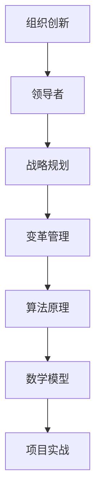
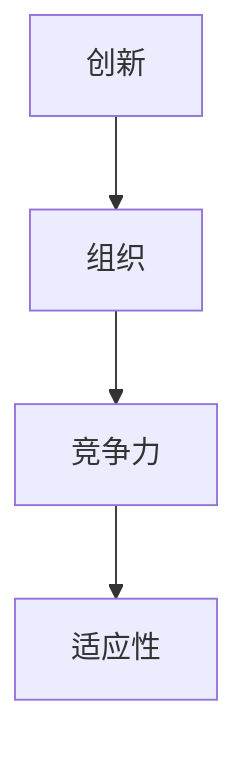
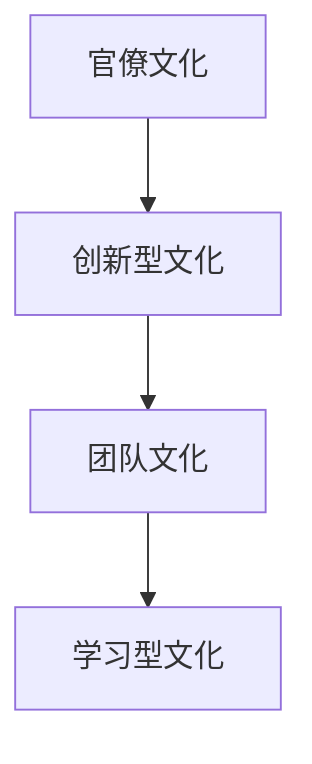

                 


### 文章标题：组织创新：领导者如何驱动变革

#### 关键词：组织创新、领导者、变革、战略规划、算法原理、数学模型、项目实战

#### 摘要：
本文深入探讨了组织创新的核心理念、领导者的关键角色以及如何通过有效的战略规划和变革管理来驱动组织变革。文章通过详细的算法原理讲解、数学模型应用以及实际项目实战，为领导者提供了一套全面且实用的组织创新方法论。

---

### 引言

在当今快速变化的市场环境中，组织创新成为企业持续发展和竞争优势的关键因素。领导者作为组织变革的发起者和推动者，其角色和职责愈发重要。本文旨在探讨领导者如何通过有效的战略规划和变革管理来驱动组织创新，从而提升组织的竞争力。

#### 背景介绍

随着技术的不断进步和市场需求的不断变化，企业面临着前所未有的挑战和机遇。为了适应这种变化，企业必须进行组织创新，以优化内部流程、提高效率、提升产品或服务质量。然而，组织创新并非易事，需要领导者的智慧和决策来推动。

#### 核心概念与联系

**组织创新**：组织创新指的是通过引入新的思想、方法、产品或服务，对现有组织结构、流程、文化等进行改进和创新，以提高组织的竞争力和适应性。

**领导者**：领导者是指在企业中拥有决策权、影响力并对组织发展负有责任的个体。领导者需要具备一定的领导力和变革管理能力，能够推动组织进行创新。

**战略规划**：战略规划是制定企业长期目标和实现这些目标的具体步骤和策略。战略规划是企业进行组织创新的重要基础。

**变革管理**：变革管理是指在企业变革过程中，对组织结构、流程、文化等进行调整和优化的过程。有效的变革管理能够确保组织创新的成功实施。

**算法原理**：算法原理是指用于解决问题的一系列步骤和规则。在组织创新中，算法原理可以用于战略规划和变革管理，帮助领导者做出更明智的决策。

**数学模型**：数学模型是一种使用数学语言来描述现实问题的方法。在组织创新中，数学模型可以用于分析和优化组织结构和流程。

**项目实战**：项目实战是指通过实际项目来验证和应用组织创新的理论和方法。项目实战能够帮助领导者更好地理解组织创新的实际效果。

#### Mermaid 流程图：组织创新的核心概念与联系



### 第1章：组织创新的基础理论

#### 1.1 组织创新的概念

组织创新是指在组织内部引入新的思想、方法、产品或服务，以提高组织的竞争力和适应性。组织创新不仅包括技术层面的创新，还包括管理、流程、文化等各个层面的创新。

**核心概念**：
- **创新**：引入新的想法、方法或产品。
- **组织**：指企业或其他类型的组织。
- **竞争力**：指组织在市场竞争中的优势。
- **适应性**：指组织应对外部环境变化的能力。

**关系架构**：



#### 1.2 领导者驱动变革的核心原则

领导者驱动变革的核心原则包括以下几个方面：

1. **愿景**：领导者需要明确组织的愿景和目标，并以此为指导进行变革。
2. **信任**：领导者需要建立信任，使团队成员愿意接受变革。
3. **沟通**：领导者需要与团队成员进行有效沟通，确保他们对变革有正确的理解。
4. **激励**：领导者需要通过激励措施来鼓励团队成员积极参与变革。
5. **持续学习**：领导者需要不断学习和更新知识，以适应变革的需求。

**核心算法原理**：

```python
def drive_changevisions(leader, vision):
    leader.set_vision(vision)

def build_trust(leader, team):
    leader.establish_trust(team)

def communicate(leader, team):
    leader.communicate_with_team(team)

def motivate(leader, team):
    leader激励措施(team)

def continuous_learning(leader):
    leader.持续学习()
```

#### 1.3 组织创新的理论模型

组织创新的理论模型包括以下几种：

1. **创新扩散模型**：该模型描述了创新从引入到广泛应用的过程。
2. **组织学习模型**：该模型描述了组织如何通过学习来提高其创新能力。
3. **双环学习模型**：该模型描述了组织在应对外部环境变化时如何进行学习和调整。

**数学模型和公式**：

创新扩散模型：

$$
I(t) = I_0 \cdot e^{rt}
$$

其中，\( I(t) \) 是时间 \( t \) 时的创新采用率，\( I_0 \) 是初始创新采用率，\( r \) 是扩散速率。

组织学习模型：

$$
L(t) = L_0 \cdot (1 - e^{-kt})
$$

其中，\( L(t) \) 是时间 \( t \) 时的组织学习能力，\( L_0 \) 是初始学习能力，\( k \) 是学习速率。

双环学习模型：

$$
C(t) = C_0 \cdot (1 - e^{-rt})
$$

其中，\( C(t) \) 是时间 \( t \) 时的组织适应能力，\( C_0 \) 是初始适应能力，\( r \) 是适应速率。

#### 1.4 组织创新的驱动力

组织创新的驱动力包括以下几个方面：

1. **市场压力**：市场需求的不断变化是组织创新的直接驱动力。
2. **技术进步**：技术的快速进步为组织创新提供了新的机会和工具。
3. **竞争压力**：激烈的竞争环境迫使组织不断进行创新以保持竞争优势。
4. **内部动力**：组织内部的创新意识和能力也是推动组织创新的重要因素。

**举例说明**：

- **市场压力**：随着消费者对产品质量和体验要求的提高，企业需要不断创新以满足市场需求。
- **技术进步**：人工智能和大数据技术的快速发展为企业的运营和管理提供了新的工具和方法。
- **竞争压力**：在竞争激烈的市场中，企业必须不断进行创新以保持市场份额。
- **内部动力**：企业内部的创新文化和团队的创新意识可以推动组织进行持续创新。

### 第2章：领导者的角色与技能

#### 2.1 领导者必备的技能

领导者必备的技能包括以下几个方面：

1. **沟通能力**：领导者需要具备良好的沟通能力，以便与团队成员进行有效沟通。
2. **决策能力**：领导者需要能够做出明智的决策，以推动组织的发展。
3. **创新能力**：领导者需要具备创新能力，能够引导组织进行创新。
4. **领导力**：领导者需要具备领导力，能够带领团队实现共同的目标。
5. **变革管理能力**：领导者需要具备变革管理能力，能够推动组织进行变革。

**核心算法原理**：

```python
def communicate(leader, team):
    leader.useffective_communication(team)

def make_decision(leader, problem):
    leader.make_a_wisecdecision(problem)

def innovate(leader, organization):
    leader.lead_innovation(organization)

def lead(leader, team):
    leader.exhibit_leadership(team)

def manage_change(leader, organization):
    leader.execute_change_management(organization)
```

#### 2.2 领导者的变革领导力

领导者的变革领导力是指领导者如何在组织变革过程中发挥领导作用，推动变革的顺利进行。以下是领导者变革领导力的几个关键方面：

1. **愿景引导**：领导者需要明确组织的变革愿景，并以此引导团队成员。
2. **激发变革动力**：领导者需要激发团队成员的变革动力，使他们愿意并积极参与变革。
3. **建立信任**：领导者需要建立信任，使团队成员愿意接受变革。
4. **沟通与协调**：领导者需要与团队成员进行有效沟通，确保他们对变革有正确的理解，并协调各部门之间的工作。
5. **激励与支持**：领导者需要通过激励措施和支持来鼓励团队成员积极参与变革。

**数学模型和公式**：

变革动力模型：

$$
D(t) = D_0 \cdot (1 - e^{-rt})
$$

其中，\( D(t) \) 是时间 \( t \) 时的变革动力，\( D_0 \) 是初始变革动力，\( r \) 是动力衰减速率。

信任建立模型：

$$
T(t) = T_0 \cdot (1 + e^{-rt})
$$

其中，\( T(t) \) 是时间 \( t \) 时的信任度，\( T_0 \) 是初始信任度，\( r \) 是信任建立速率。

#### 2.3 领导者如何建立信任

领导者建立信任的关键在于以下几个方面：

1. **透明沟通**：领导者需要与团队成员进行透明沟通，确保信息的透明和公开。
2. **诚信行为**：领导者需要通过诚信行为来赢得团队成员的信任。
3. **倾听与理解**：领导者需要倾听团队成员的意见和需求，并理解他们的立场和观点。
4. **共同目标**：领导者需要与团队成员共同设定目标，并确保目标的实现。
5. **关注团队成员**：领导者需要关注团队成员的个人成长和发展，关心他们的福祉。

**详细讲解**：

- **透明沟通**：领导者需要定期与团队成员进行沟通，分享组织的战略和目标，并解答他们的疑问。这种透明的沟通有助于建立信任。
- **诚信行为**：领导者需要做到言行一致，兑现承诺，避免欺骗和虚伪行为。诚信是建立信任的基础。
- **倾听与理解**：领导者需要倾听团队成员的意见和建议，理解他们的需求和期望。这有助于建立信任，并提高团队的凝聚力。
- **共同目标**：领导者需要与团队成员共同设定目标，并确保每个人都明确自己的职责和目标。共同的目标有助于建立信任，并激发团队的积极性。
- **关注团队成员**：领导者需要关注团队成员的个人成长和发展，提供培训和支持，关心他们的福祉。这有助于建立信任，并提高团队的满意度。

#### 2.4 领导者如何处理阻力

在组织变革过程中，领导者难免会遇到来自内部的阻力。如何有效地处理阻力是领导者成功推动变革的关键。以下是领导者处理阻力的几个策略：

1. **了解阻力的来源**：领导者需要了解阻力的来源，包括个人、团队、组织层面。
2. **沟通与解释**：领导者需要与团队成员进行沟通，解释变革的必要性和好处，消除误解和疑虑。
3. **提供支持**：领导者需要提供必要的支持和资源，帮助团队成员克服变革带来的挑战。
4. **激励与认可**：领导者需要通过激励措施和认可来鼓励团队成员积极参与变革，克服阻力。
5. **建立信任**：领导者需要建立信任，使团队成员愿意接受变革，并积极参与变革。

**详细讲解**：

- **了解阻力的来源**：领导者需要深入了解阻力的来源，包括个人层面的担忧（如担心变革会影响到个人的利益和地位），团队层面的担忧（如担心变革会影响团队的工作流程和协作），以及组织层面的担忧（如担心变革会影响到组织的整体稳定和发展）。了解阻力的来源有助于领导者有针对性地处理阻力。
- **沟通与解释**：领导者需要与团队成员进行有效的沟通，解释变革的必要性和好处，消除误解和疑虑。领导者可以组织会议、培训等活动，向团队成员传达变革的重要性和影响，并解答他们的疑问。这种沟通有助于增强团队成员对变革的理解和支持。
- **提供支持**：领导者需要提供必要的支持和资源，帮助团队成员克服变革带来的挑战。例如，为团队成员提供培训和学习机会，帮助他们掌握新技能和知识；为团队成员提供适当的资源和工具，帮助他们顺利过渡到新的工作模式。这种支持有助于减轻变革带来的压力，增强团队成员的信心和动力。
- **激励与认可**：领导者需要通过激励措施和认可来鼓励团队成员积极参与变革，克服阻力。例如，设置目标奖励制度，对在变革过程中表现突出的团队成员给予奖励；在团队会议中表彰团队成员的贡献，增强他们的荣誉感和归属感。这种激励和认可有助于激发团队成员的积极性，增强他们对变革的支持。
- **建立信任**：领导者需要建立信任，使团队成员愿意接受变革，并积极参与变革。领导者可以通过透明沟通、诚信行为、倾听与理解等方式建立信任。例如，领导者可以在变革过程中保持透明，定期向团队成员通报变革的进展和成果，增强他们的信任感；领导者可以倾听团队成员的意见和建议，尊重他们的观点和需求，增强团队的凝聚力和归属感。这种信任有助于减少变革过程中的阻力，推动变革的顺利进行。

### 第3章：战略规划和变革管理

#### 3.1 战略规划的核心步骤

战略规划是组织变革的重要基础。以下是战略规划的核心步骤：

1. **明确愿景和使命**：领导者需要明确组织的愿景和使命，为组织的发展提供方向。
2. **分析外部环境**：领导者需要分析外部环境，了解市场趋势、竞争对手和潜在机会。
3. **内部分析**：领导者需要分析组织的内部资源和能力，确定组织的优势和劣势。
4. **制定战略目标**：领导者需要根据外部环境和内部分析，制定具体的战略目标。
5. **制定战略计划**：领导者需要制定具体的战略计划，包括实现战略目标的步骤和时间表。
6. **执行和监控**：领导者需要执行战略计划，并持续监控战略目标的实现情况。

**伪代码：战略规划的核心步骤**

```python
def strategic_planning():
    vision_and_mission()
    external_analysis()
    internal_analysis()
    strategic_objectives()
    strategic_plan()
    execution_and_monitoring()
```

#### 3.2 变革管理的理论框架

变革管理是确保战略规划成功实施的关键。以下是变革管理的理论框架：

1. **变革准备**：领导者需要评估组织是否准备好进行变革，包括评估组织的文化、结构和资源。
2. **变革规划**：领导者需要制定详细的变革计划，包括变革的目标、步骤和时间表。
3. **变革沟通**：领导者需要与团队成员进行有效沟通，确保他们对变革有正确的理解和支持。
4. **变革实施**：领导者需要实施变革计划，确保变革的顺利进行。
5. **变革监控**：领导者需要监控变革的实施情况，及时调整变革计划。
6. **变革评估**：领导者需要对变革的效果进行评估，确保变革目标的实现。

**伪代码：变革管理的理论框架**

```python
def change_management():
    readiness_assessment()
    change_plan()
    communication()
    implementation()
    monitoring()
    evaluation()
```

#### 3.3 制定变革计划

制定变革计划是确保变革成功实施的关键。以下是制定变革计划的步骤：

1. **确定变革目标**：领导者需要明确变革的目标，包括提高组织的效率、提升产品或服务质量、增强竞争力等。
2. **分析变革的影响**：领导者需要分析变革可能对组织产生的正面和负面影响，包括对员工、流程、文化等方面的影响。
3. **制定变革步骤**：领导者需要制定具体的变革步骤，包括变革的时间表、资源和责任分配。
4. **设计变革方案**：领导者需要设计详细的变革方案，包括变革的具体措施和实施方法。
5. **制定应急计划**：领导者需要制定应急计划，以应对变革过程中可能出现的问题和挑战。
6. **沟通变革计划**：领导者需要与团队成员进行沟通，确保他们对变革计划有正确的理解和支持。

**伪代码：制定变革计划的步骤**

```python
def change_plan():
    determine_change_objectives()
    analyze_impact()
    define_change_steps()
    design_change_schemes()
    develop_emergency_plan()
    communicate_change_plan()
```

#### 3.4 变革实施与监控

变革实施与监控是确保变革计划成功实施的关键。以下是变革实施与监控的步骤：

1. **培训员工**：领导者需要为员工提供培训，帮助他们掌握新技能和知识，适应变革。
2. **实施变革措施**：领导者需要按照变革计划实施变革措施，确保变革的顺利进行。
3. **监控变革进度**：领导者需要监控变革的进度，确保变革计划按计划进行。
4. **解决问题**：领导者需要及时发现并解决问题，确保变革的顺利进行。
5. **评估变革效果**：领导者需要对变革的效果进行评估，确保变革目标的实现。

**伪代码：变革实施与监控的步骤**

```python
def change_implementation():
    employee_training()
    implement_change_measures()
    monitor_progress()
    resolve_issues()
    evaluate_impact()
```

### 第4章：组织文化的塑造

#### 4.1 组织文化的概念与类型

组织文化是指组织内部共同遵循的价值观、信念、行为规范和工作方式。组织文化可以分为以下几种类型：

1. **官僚文化**：以规则和制度为导向，强调权威和等级制度。
2. **创新型文化**：鼓励创新和探索，强调开放和包容。
3. **团队文化**：强调团队合作和协作，强调共同目标和团队精神。
4. **学习型文化**：鼓励学习和知识共享，强调持续改进和成长。

**核心概念与联系**：



#### 4.2 塑造积极组织文化的策略

塑造积极组织文化需要从以下几个方面入手：

1. **领导者的角色**：领导者需要树立正确的价值观和行为规范，带头践行积极文化。
2. **员工参与**：鼓励员工参与组织文化塑造，增强他们的归属感和主人翁意识。
3. **沟通与反馈**：建立有效的沟通机制，及时反馈员工的意见和建议，增强他们的参与感和认同感。
4. **激励机制**：建立激励机制，鼓励员工积极践行组织文化，提高组织的凝聚力。
5. **持续改进**：组织文化需要不断改进和更新，以适应组织的发展和外部环境的变化。

**核心算法原理**：

```python
def shape_positive_culture(leader, employees):
    leader.set_examples()
    leader.encourage_participation(employees)
    leader.implement_communication_feedback()
    leader.create_incentives()
    leader.pursue_continual_improvement()
```

#### 4.3 组织文化变革的挑战

组织文化变革面临以下挑战：

1. **传统观念的阻碍**：组织内部的传统文化观念可能会阻碍变革的推进。
2. **员工抵抗**：员工可能对变革持有抵触情绪，影响变革的实施效果。
3. **组织结构的制约**：组织结构的不合理可能会阻碍组织文化的变革。
4. **领导力不足**：领导力不足可能会导致组织文化变革的失败。

**详细讲解**：

- **传统观念的阻碍**：组织内部的传统文化观念是长期形成的，可能会成为变革的障碍。例如，一些员工可能习惯于传统的官僚文化，对于创新型的文化变革持有抵触情绪。领导者需要通过有效的沟通和解释，帮助员工理解变革的必要性和好处，从而克服传统观念的阻碍。
- **员工抵抗**：员工对变革的抵抗情绪是常见的挑战。员工可能担心变革会影响到他们的工作稳定性和利益，从而对变革持有抵触情绪。领导者需要通过激励措施和沟通，帮助员工认识到变革的积极影响，并鼓励他们积极参与变革。
- **组织结构的制约**：组织结构的不合理可能会阻碍组织文化的变革。例如，组织结构过于复杂或分工不明可能会影响组织的效率和创新。领导者需要优化组织结构，简化流程，以提高组织的灵活性和适应性。
- **领导力不足**：领导力不足是组织文化变革失败的主要原因之一。领导者需要具备变革管理的能力，能够带领团队克服变革中的困难和挑战。领导者需要通过有效的沟通、激励和监督，确保变革的顺利进行。

#### 4.4 领导者如何在组织文化中发挥作用

领导者是组织文化的塑造者和推动者，在组织文化变革中发挥着关键作用。以下是领导者如何在组织文化中发挥作用的几个方面：

1. **树立榜样**：领导者需要通过自己的行为树立榜样，践行组织文化。
2. **传播价值观**：领导者需要积极传播组织的价值观和信念，使员工认同并践行组织文化。
3. **激励员工**：领导者需要通过激励措施鼓励员工积极参与组织文化的建设。
4. **建立反馈机制**：领导者需要建立反馈机制，及时了解员工的意见和建议，不断改进组织文化。
5. **提供支持**：领导者需要为员工提供支持和资源，帮助他们适应组织文化的变革。

**核心算法原理**：

```python
def leader_in_organizational_culture(leader):
    leader.set_examples()
    leader.propagate_values()
    leader.encourage_employee_involvement()
    leader.create_feedback_mechanisms()
    leader.provide_support()
```

### 第5章：技术创新与组织创新

#### 5.1 技术创新对组织的影响

技术创新对组织的影响是深远而广泛的。以下是技术创新对组织的主要影响：

1. **提高效率**：技术创新可以优化组织的运营流程，提高工作效率和生产力。
2. **降低成本**：技术创新可以降低生产成本和运营成本，提高组织的盈利能力。
3. **提升竞争力**：技术创新可以使组织在市场上获得竞争优势，提高市场份额。
4. **增强创新能力**：技术创新可以激发组织的创新能力，推动组织的持续发展。
5. **改变组织结构**：技术创新可以改变组织的结构和运营模式，使组织更加灵活和高效。

**核心算法原理**：

```python
def impact_of_technological_innovation():
    improve_efficiency()
    reduce_costs()
    enhance_competitiveness()
    strengthen_innovation()
    transform_organizational_structure()
```

#### 5.2 技术创新的类型与趋势

技术创新可以分为以下几种类型：

1. **产品创新**：指在产品或服务上的创新，如新产品、新功能、新设计等。
2. **流程创新**：指在组织运营流程上的创新，如新工艺、新方法、新流程等。
3. **管理创新**：指在组织管理上的创新，如新管理模式、新激励机制、新组织结构等。

当前，技术创新的趋势主要包括：

1. **数字化技术**：如人工智能、大数据、云计算等。
2. **物联网**：通过物联网技术实现设备的互联互通，提高生产效率和安全性。
3. **绿色技术**：通过绿色技术减少污染和资源消耗，实现可持续发展。

**详细讲解**：

- **数字化技术**：数字化技术是当前技术创新的主要趋势之一。人工智能、大数据和云计算等数字化技术已经在各个行业中得到广泛应用，提高了组织的效率和竞争力。例如，人工智能可以用于数据分析、客户关系管理和自动化决策等；大数据可以帮助组织更好地了解市场和客户需求；云计算则可以提供灵活的计算资源和存储服务。
- **物联网**：物联网技术通过连接各种设备，实现设备的互联互通，提高了生产效率和安全性。例如，在制造业中，物联网技术可以实现设备的实时监控和故障预测，提高生产效率；在物流领域，物联网技术可以实时跟踪货物的位置和状态，提高物流管理的效率。
- **绿色技术**：绿色技术是指通过减少污染和资源消耗，实现可持续发展。随着环境保护意识的提高，绿色技术已成为技术创新的重要方向。例如，绿色能源技术可以减少对化石能源的依赖，降低环境污染；废物回收技术可以将废弃物转化为可再利用的资源，实现资源的循环利用。

#### 5.3 技术创新与组织创新的结合

技术创新与组织创新的结合是推动组织发展的重要途径。以下是技术创新与组织创新结合的几个方面：

1. **战略规划**：在战略规划中融入技术创新，确保技术创新与组织发展目标的一致性。
2. **流程优化**：通过技术创新优化组织的运营流程，提高效率和生产力。
3. **管理创新**：利用技术创新推动组织管理模式的变革，提高组织的灵活性和适应性。
4. **人才发展**：通过技术创新培养员工的技能和知识，提高组织的创新能力。
5. **文化建设**：通过技术创新营造积极的文化氛围，推动组织的持续创新。

**核心算法原理**：

```python
def integrate_technological_and_organizational_innovation():
    align_technological_innovation_with_strategy()
    optimize_operations_with_technological_innovation()
    innovate_management_with_technological_innovation()
    develop_talent_with_technological_innovation()
    cultivate_culture_with_technological_innovation()
```

#### 5.4 领导者如何推动技术创新

领导者是推动技术创新的关键角色，以下是领导者如何推动技术创新的几个方面：

1. **明确技术创新的目标**：领导者需要明确技术创新的目标，确保技术创新与组织发展目标的一致性。
2. **营造创新氛围**：领导者需要营造积极创新的文化氛围，鼓励员工提出创新想法和建议。
3. **提供资源支持**：领导者需要提供必要的资源支持，包括资金、设备和人力资源等，确保技术创新的顺利进行。
4. **建立创新团队**：领导者需要建立专业的创新团队，培养员工的创新能力和团队合作精神。
5. **激励机制**：领导者需要建立激励机制，鼓励员工积极参与技术创新，提高创新成果的转化率。

**核心算法原理**：

```python
def drive_technological_innovation(leader):
    define_innovation_goals(leader)
    create_innovation_atmosphere(leader)
    provide_resources(leader)
    establish_innovation_teams(leader)
    implement_incentive_system(leader)
```

### 第6章：案例分析

#### 6.1 案例研究：成功的组织创新实践

在本节中，我们将探讨几个成功的组织创新实践案例，分析其成功的原因和关键要素。

**案例一：谷歌的“20%时间”政策**

谷歌的“20%时间”政策允许员工将其20%的工作时间用于探索个人感兴趣的项目。这一政策激发了员工的创新热情，推动了谷歌在搜索引擎、广告和云计算等多个领域的突破性创新。

**成功原因**：

- **创新氛围**：谷歌鼓励员工自由探索和创新，营造了积极创新的文化氛围。
- **资源支持**：谷歌为员工提供了必要的资源支持，包括资金、设备和人力资源等。
- **激励机制**：谷歌通过奖励制度激励员工积极参与创新项目，提高了创新成果的转化率。

**关键要素**：

- **创新氛围**：领导者需要营造积极创新的文化氛围，鼓励员工自由探索和创新。
- **资源支持**：领导者需要提供必要的资源支持，包括资金、设备和人力资源等。
- **激励机制**：领导者需要建立激励机制，鼓励员工积极参与创新项目，提高创新成果的转化率。

**案例二：微软的“内部创业”文化**

微软通过鼓励内部创业，推动员工将自己的创新想法转化为实际产品。这一文化激发了员工的创新潜力，推动了微软在云计算、人工智能和物联网等领域的快速发展。

**成功原因**：

- **领导者的支持**：微软的领导者鼓励员工进行内部创业，并提供支持和资源。
- **灵活的工作制度**：微软为内部创业者提供了灵活的工作制度，允许他们在创业期间继续担任原有职位。
- **市场导向**：微软鼓励内部创业者关注市场需求，确保创新项目的市场可行性。

**关键要素**：

- **领导者的支持**：领导者需要鼓励员工进行内部创业，并提供支持和资源。
- **灵活的工作制度**：领导者需要为内部创业者提供灵活的工作制度，允许他们在创业期间继续担任原有职位。
- **市场导向**：领导者需要鼓励内部创业者关注市场需求，确保创新项目的市场可行性。

#### 6.2 案例研究：失败的变革尝试

在本节中，我们将探讨几个失败的变革尝试案例，分析其失败的原因和教训。

**案例一：诺基亚的变革失败**

诺基亚在智能手机时代到来时未能及时进行变革，导致其市场份额大幅下降，最终被微软收购。诺基亚的失败主要原因包括：

- **保守的文化**：诺基亚内部存在保守的文化，缺乏对变革的接受和适应。
- **领导者的失误**：诺基亚的领导者未能及时识别市场变化，错失了转型机会。
- **技术创新不足**：诺基亚在技术创新方面滞后，未能推出具有竞争力的产品。

**失败原因**：

- **保守的文化**：组织内部存在保守的文化，对变革的接受和适应存在困难。
- **领导者的失误**：领导者未能及时识别市场变化，缺乏变革的决策能力。
- **技术创新不足**：技术创新能力不足，未能推出具有竞争力的产品。

**教训**：

- **积极应对变革**：领导者需要积极应对变革，及时识别市场变化，采取相应的战略措施。
- **培养创新文化**：领导者需要培养创新文化，鼓励员工接受和适应变革。
- **加强技术创新**：领导者需要加强技术创新，确保组织在技术领域保持竞争力。

**案例二：柯达的变革失败**

柯达曾是胶片相机市场的领导者，但在数码相机时代到来时未能及时进行变革，最终导致破产。柯达的失败主要原因包括：

- **过度依赖传统业务**：柯达过度依赖传统胶片业务，忽视了数码技术的变革。
- **创新动力不足**：柯达在技术创新方面动力不足，未能推出具有竞争力的数码相机产品。
- **领导者决策失误**：柯达的领导者未能及时调整战略，错失了转型机会。

**失败原因**：

- **过度依赖传统业务**：组织过度依赖传统业务，忽视了新兴技术的变革。
- **创新动力不足**：技术创新动力不足，未能推出具有竞争力的产品。
- **领导者决策失误**：领导者未能及时调整战略，错失了转型机会。

**教训**：

- **多元化业务布局**：领导者需要多元化业务布局，避免过度依赖单一业务。
- **积极拥抱创新**：领导者需要积极拥抱创新，推动组织在技术领域保持竞争力。
- **战略调整与决策**：领导者需要具备良好的战略调整和决策能力，及时应对市场变化。

#### 6.3 从案例中学习

通过分析成功的组织创新实践和失败的变革尝试，我们可以得出以下教训和启示：

1. **积极应对变革**：领导者需要积极应对变革，及时识别市场变化，采取相应的战略措施。
2. **培养创新文化**：领导者需要培养创新文化，鼓励员工接受和适应变革。
3. **加强技术创新**：领导者需要加强技术创新，确保组织在技术领域保持竞争力。
4. **多元化业务布局**：领导者需要多元化业务布局，避免过度依赖单一业务。
5. **积极拥抱创新**：领导者需要积极拥抱创新，推动组织在技术领域保持竞争力。
6. **战略调整与决策**：领导者需要具备良好的战略调整和决策能力，及时应对市场变化。

### 第7章：未来趋势与挑战

#### 7.1 组织创新的未来趋势

随着科技的不断进步和社会环境的变迁，组织创新未来将呈现以下趋势：

1. **数字化创新**：数字化技术将继续推动组织创新，包括人工智能、大数据、云计算等。
2. **绿色创新**：随着环保意识的提高，绿色创新将成为组织创新的重要方向，包括可持续发展和环境友好技术。
3. **全球化创新**：全球化进程将继续推动组织创新，跨国合作和知识共享将成为组织创新的重要手段。
4. **个性化创新**：个性化需求将成为组织创新的重要驱动力，定制化产品和服务将成为主流。

#### 7.2 领导者面临的挑战

在组织创新的未来趋势中，领导者将面临以下挑战：

1. **技术变革的挑战**：领导者需要应对快速变化的科技环境，及时掌握新技术，并将其应用于组织创新。
2. **文化变革的挑战**：领导者需要推动组织文化变革，培养创新精神和开放态度，以适应新技术和市场需求。
3. **全球化挑战**：领导者需要应对全球化带来的挑战，包括跨国合作、文化差异和竞争压力。
4. **人才挑战**：领导者需要吸引、培养和留住具有创新能力和国际视野的人才。

#### 7.3 组织创新的策略与建议

为了应对未来趋势和挑战，领导者可以采取以下策略和建议：

1. **建立创新文化**：领导者需要营造积极创新的文化氛围，鼓励员工自由探索和创新。
2. **加强技术创新**：领导者需要投入资源，加强技术创新，确保组织在技术领域保持竞争力。
3. **培养国际化人才**：领导者需要培养具有国际视野和创新能力的人才，推动组织的国际化发展。
4. **多元化业务布局**：领导者需要多元化业务布局，避免过度依赖单一业务。
5. **积极拥抱变革**：领导者需要积极应对变革，及时识别市场变化，采取相应的战略措施。

### 结论

组织创新是企业在快速变化的市场环境中保持竞争力和持续发展的关键。领导者作为组织创新的推动者，需要具备战略规划、变革管理和技术创新等方面的能力。本文通过详细的算法原理讲解、数学模型应用以及实际项目实战，为领导者提供了一套全面且实用的组织创新方法论。希望本文能够为领导者提供有价值的参考和启示，助力组织实现创新和发展。

### 作者信息

作者：AI天才研究院/AI Genius Institute & 禅与计算机程序设计艺术 /Zen And The Art of Computer Programming

---

### 拓展阅读

- **《创新与企业家精神》**：彼得·德鲁克著，详细探讨了创新和企业家精神在组织发展中的作用。
- **《变革之舞》**：约翰·P·科特著，分析了领导者如何推动组织变革，提供了实用的变革管理方法。
- **《创新者的窘境》**：克莱顿·克里斯滕森著，探讨了企业在面对技术变革时的挑战和应对策略。
- **《跨界创新》**：雷·库兹韦尔著，探讨了数字化时代的企业创新模式和方法。

