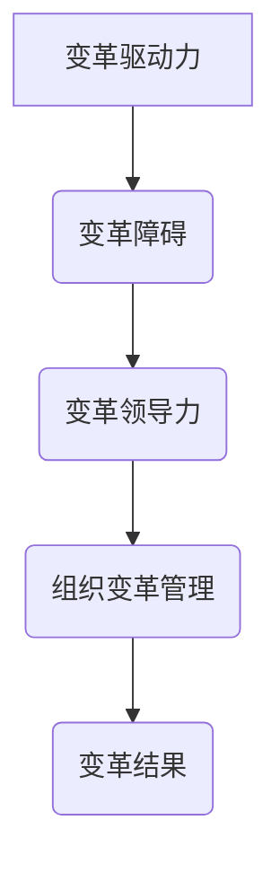
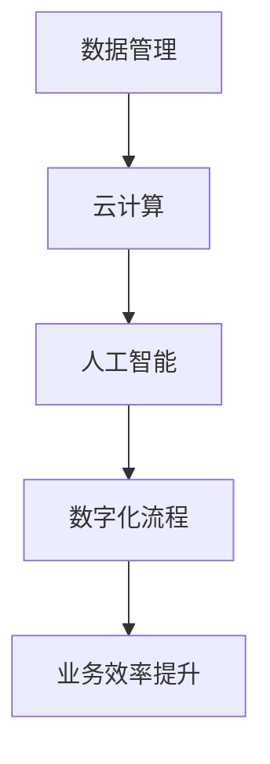
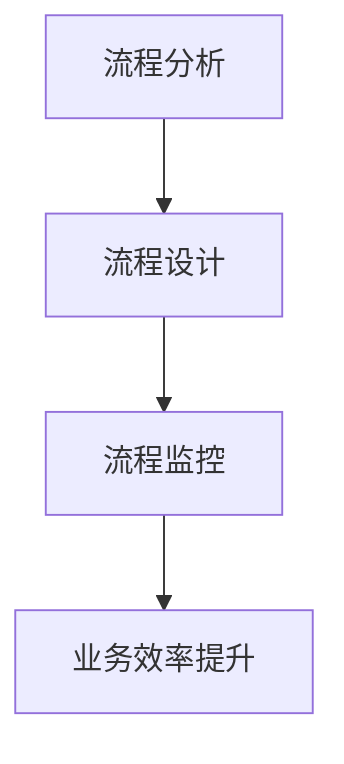

                 

### 引言

#### 背景介绍

在当今快速变化的商业环境中，组织变革已成为企业保持竞争力的关键手段。随着技术的迅猛发展、市场需求的不断变化以及企业内部运营模式的优化，企业需要不断地调整和优化其组织结构、流程以及文化，以适应新的商业环境。然而，变革并非一帆风顺，往往伴随着各种挑战和阻力。成功的变革管理不仅需要清晰的战略和计划，更需要有效引导和管理团队，确保变革平稳落地。

#### 核心概念与联系

为了更深入地理解组织变革管理的复杂性，我们首先需要明确几个核心概念：

- **组织变革管理**：是指通过系统的策略和流程，引导组织从当前状态过渡到期望状态的过程。
- **变革驱动力**：包括外部环境变化、内部运营需要以及战略目标调整等。
- **变革障碍**：如员工抵触、沟通不畅、资源不足等。
- **变革领导力**：领导者如何在变革过程中发挥关键作用，激励和引导团队。

这些概念之间存在着紧密的联系。变革驱动力决定了变革的必要性和紧迫性，而变革障碍则是变革过程中需要克服的难点。变革领导力则是关键，决定了变革能否成功。

#### Mermaid 流程图



在这个流程图中，变革驱动力作为起点，通过克服变革障碍，在变革领导力的引导下，最终实现组织变革的目标。这个流程图为我们理解变革管理的整体框架提供了清晰的视觉帮助。

#### 核心概念与联系讲解

组织变革管理不仅仅是简单的结构调整或流程优化，它涉及到组织的各个层面，包括战略、文化、流程和人员。因此，理解这些核心概念及其相互关系对于有效进行变革管理至关重要。

- **变革驱动力**：外部环境的变化，如市场需求的演变、技术进步等，会迫使企业进行变革。内部因素，如组织效率低下、运营成本过高等，也会推动变革。这些驱动力的存在，使得变革成为企业持续发展的必要手段。

- **变革障碍**：变革过程中常常会面临各种障碍，如员工的抵触情绪、沟通不畅、资源不足等。这些障碍会减缓或阻碍变革的进程，因此需要通过有效的策略和管理手段来克服。

- **变革领导力**：领导者在变革过程中扮演着至关重要的角色。他们需要具备远见卓识，能够清晰地描绘变革的愿景，并激励和引导团队共同实现这一目标。同时，领导者还需要具备卓越的沟通能力和决策能力，以应对变革过程中的各种挑战。

- **组织变革管理**：这是一个系统性的过程，包括变革的规划、实施、监控和调整。在这个过程中，需要综合考虑各种因素，如组织结构、流程、文化和人员等，以确保变革的顺利进行。

通过上述对核心概念及其相互关系的讲解，我们能够更好地理解组织变革管理的复杂性和重要性。接下来，我们将进一步探讨组织变革管理的基本原则和方法，以及变革过程中的关键步骤。

#### 核心概念与联系总结

组织变革管理是一个多维度的过程，涉及到变革驱动力、变革障碍、变革领导力和组织变革管理本身。理解这些概念及其相互关系，有助于我们更深入地把握变革管理的核心，从而更有效地引导团队度过转型期。在接下来的内容中，我们将详细讨论变革管理的基本原则和方法，为后续的深入探讨打下坚实的基础。

---

### 变革管理的基本原则

组织变革管理是一个复杂且多层次的过程，涉及到组织的各个层面和多个利益相关者。为了确保变革的顺利进行并达到预期效果，变革管理需要遵循一些基本的原则。以下是几个关键的原则及其详细解释。

#### 原则一：以愿景为导向

一个清晰且具有吸引力的变革愿景是变革成功的关键。愿景不仅是变革的目标，更是激励和引导团队成员共同努力的动力。愿景应该明确表达变革的目的、预期的结果以及变革对组织的长远影响。

**详细解释**：

- **明确愿景**：变革的愿景应该具体、明确，能够激发员工的热情和参与。例如，一个企业的愿景可能是“成为行业领导者，通过技术创新提升客户体验”。

- **沟通愿景**：愿景的传达不仅仅是高层管理者的责任，还需要通过多种渠道和方式，如会议、内部邮件、海报等，确保所有员工都能理解和认同这一愿景。

- **持续更新愿景**：随着外部环境和内部状况的变化，愿景也需要不断地调整和更新。这有助于保持变革的持续性和有效性。

**示例**：

假设一家公司计划进行数字化转型，其愿景可能是“通过数字化手段，实现业务流程的智能化和效率最大化，提升客户满意度”。这个愿景清晰地表达了变革的目的和期望结果，有助于全体员工共同为之努力。

#### 原则二：全员参与

全员参与是变革成功的重要保障。变革不仅需要领导层的支持和推动，更需要全体员工的积极参与和配合。只有当员工感受到变革与自身利益相关，他们才会主动投入变革中。

**详细解释**：

- **培训与教育**：通过培训和教育，提高员工对变革的理解和接受度。例如，可以通过内部讲座、研讨会和在线课程等形式，让员工了解变革的必要性和预期收益。

- **建立反馈机制**：鼓励员工提出意见和建议，使变革过程更加民主和透明。例如，可以通过问卷调查、意见箱等方式，收集员工的反馈，并及时给予回应。

- **提供支持和资源**：确保员工在变革过程中有足够的支持和资源。例如，提供技术支持、心理辅导和培训资源，帮助员工克服变革过程中的困难和挑战。

**示例**：

在一个大型企业的组织变革中，管理层可以通过开展一系列的内部培训和研讨会，向员工传达变革的愿景和重要性。同时，设置意见反馈渠道，如员工论坛和定期会议，让员工有机会表达自己的观点和建议。此外，提供专门的培训和心理辅导，帮助员工适应变革。

#### 原则三：逐步推进

变革过程需要逐步推进，避免急于求成。过快的变革可能会导致员工无法适应，进而产生抵触情绪。因此，变革需要分阶段、分步骤地进行，以确保每个阶段的变革都能顺利实施和达到预期效果。

**详细解释**：

- **阶段划分**：将变革过程划分为若干个阶段，每个阶段设定明确的任务和目标。例如，可以划分为“准备阶段”、“实施阶段”和“评估阶段”。

- **阶段性目标**：在每个阶段设定具体的阶段性目标，使员工能够清晰地看到变革的进展和成果。例如，在准备阶段，目标可能是“完成组织结构的调整”；在实施阶段，目标可能是“推动新流程的落地”；在评估阶段，目标可能是“评估变革的效果”。

- **持续监控与调整**：在变革过程中，持续监控每个阶段的实施情况，并根据反馈进行及时调整。这有助于确保变革的灵活性和适应性。

**示例**：

假设一家公司计划进行流程优化，可以将变革过程分为三个阶段：准备阶段（包括需求调研、方案设计）、实施阶段（包括试点运行、全面推广）和评估阶段（包括效果评估、持续改进）。在准备阶段，通过调研和分析，明确优化目标和方案；在实施阶段，逐步推广新流程，并在试点运行中收集反馈；在评估阶段，全面评估变革效果，并根据反馈进行改进。

#### 原则四：沟通与透明

有效的沟通和透明度是变革成功的重要保障。变革过程中，员工需要了解变革的背景、原因、目标和进展情况，以便更好地理解和支持变革。

**详细解释**：

- **内部沟通**：建立有效的内部沟通渠道，如定期会议、内部邮件、公告栏等，确保信息的及时传达和透明。例如，可以定期召开员工大会，向员工传达变革的最新动态和进展情况。

- **外部沟通**：加强与外部利益相关者的沟通，如客户、供应商、投资者等，确保变革的外部环境稳定。例如，可以通过新闻发布会、年报等方式，向外部利益相关者传达公司的变革计划和目标。

- **双向沟通**：鼓励员工积极参与沟通，不仅听取管理层的意见，也倾听员工的反馈和建议。例如，可以通过开放式的讨论会、问卷调查等方式，收集员工的意见和反馈。

**示例**：

在一个企业的变革过程中，管理层可以通过内部邮件和公告栏定期向员工传达变革的进展情况和重要决策。同时，定期召开员工大会，解答员工的疑问，并鼓励员工提出意见和建议。此外，管理层还可以通过定期的线上会议，与外部利益相关者保持密切沟通，确保变革的外部环境稳定。

#### 原则五：灵活应对

变革过程中，可能会遇到各种预料之外的情况和挑战。因此，变革管理需要具备灵活性和适应性，能够根据实际情况进行调整和应对。

**详细解释**：

- **风险评估**：在变革过程中，进行充分的风险评估，识别可能的风险和挑战，并制定相应的应对策略。例如，可以评估变革对员工心理的影响、对业务流程的冲击等。

- **动态调整**：根据变革的进展和反馈，及时调整变革计划和策略，以确保变革的顺利进行。例如，如果发现某个阶段的变革效果不佳，可以暂停该阶段的工作，重新评估和调整。

- **持续改进**：变革是一个持续的过程，需要不断地进行评估和改进。通过持续改进，确保变革的目标得以实现，并不断提高变革的效果。

**示例**：

假设一家公司在进行数字化转型过程中，发现某个关键业务模块的变革进度滞后，可以通过风险评估识别出可能的原因，如技术难题、员工抵触等。然后，根据实际情况，调整变革计划，例如增加技术支持、加强员工培训等。同时，持续监控变革的进展和效果，根据反馈进行动态调整和改进。

通过上述对变革管理基本原则的详细解释，我们可以看到，有效的变革管理需要综合考虑多个方面，包括愿景、全员参与、逐步推进、沟通与透明以及灵活应对。这些原则不仅为变革提供了指导，也为团队提供了清晰的方向和动力。在接下来的章节中，我们将进一步探讨变革管理的具体策略和方法，以帮助团队更顺利地度过变革转型期。

### 变革管理的方法

在组织变革管理的过程中，选择合适的方法是确保变革顺利实施的关键。以下将介绍几种常见的变革管理方法，并详细解释每种方法的原理和实施步骤。

#### 方法一：变革三部曲

**原理**：

变革三部曲是一种经典的变革管理方法，包括“准备”、“实施”和“巩固”三个阶段。每个阶段都有明确的任务和目标，确保变革有序进行。

**详细解释**：

1. **准备阶段**：
   - **目标**：确保变革的基础扎实，包括明确变革目标、制定变革计划、组建变革团队等。
   - **步骤**：
     - **明确变革目标**：明确变革的目标和预期结果，确保全体员工都了解变革的必要性和意义。
     - **制定变革计划**：制定详细的变革计划，包括时间表、资源需求、关键里程碑等。
     - **组建变革团队**：建立由管理层和员工组成的变革团队，负责推进变革的各项工作。

2. **实施阶段**：
   - **目标**：按照计划，逐步实施变革措施，确保变革内容得以落地。
   - **步骤**：
     - **沟通与培训**：通过会议、讲座、内部邮件等多种渠道，向员工传达变革信息，并进行必要的培训，确保员工了解变革的具体内容和要求。
     - **试点运行**：在部分部门或业务领域进行试点运行，收集反馈并进行调整，为全面实施提供经验和依据。
     - **全面实施**：在试点运行成功的基础上，全面推广变革措施，确保整个组织都参与到变革中。

3. **巩固阶段**：
   - **目标**：确保变革成果得到持续巩固和提升，包括评估变革效果、持续改进和激励员工。
   - **步骤**：
     - **评估变革效果**：通过调查、反馈和绩效评估等方式，评估变革的成果，识别存在的问题和改进空间。
     - **持续改进**：根据评估结果，持续优化变革措施，确保变革成果得到巩固和提升。
     - **激励员工**：通过奖励、认可等方式，激励员工积极参与变革，保持变革的动力。

**示例**：

一家公司计划进行数字化转型，可以采用变革三部曲的方法。首先，明确数字化转型的目标和预期结果，制定详细的变革计划。然后，通过内部邮件、员工大会等方式，向员工传达变革信息，并进行必要的培训。接着，在部分部门进行试点运行，根据反馈进行优化，然后全面推广数字化转型措施。最后，通过绩效评估和奖励机制，确保数字化转型成果得到持续巩固和提升。

#### 方法二：ADKAR 模型

**原理**：

ADKAR 模型是一种基于个人层面的变革管理方法，包括“ Awareness（意识提升）”、“ Desire（愿望驱动）”、“ Knowledge（知识获取）”、“ Ability（能力提升）”和“ Reinforcement（持续激励）”五个阶段。

**详细解释**：

1. **意识提升阶段**：
   - **目标**：让员工认识到变革的必要性和紧迫性。
   - **步骤**：
     - **传达信息**：通过会议、内部邮件等方式，向员工传达变革的背景、原因和目标。
     - **解释变革**：详细解释变革的具体内容和影响，让员工理解变革的必要性和重要性。

2. **愿望驱动阶段**：
   - **目标**：激发员工对变革的愿望和热情。
   - **步骤**：
     - **沟通愿景**：与员工分享变革的愿景和预期成果，激发员工的兴趣和参与意愿。
     - **解决问题**：了解员工对变革的担忧和抵触情绪，积极解决员工提出的问题，减轻变革的阻力。

3. **知识获取阶段**：
   - **目标**：为员工提供必要的知识和信息，帮助他们适应变革。
   - **步骤**：
     - **培训与教育**：组织培训课程、工作坊等，提高员工对变革的理解和技能。
     - **信息共享**：建立信息共享平台，让员工能够及时获取变革相关的信息和资源。

4. **能力提升阶段**：
   - **目标**：确保员工具备执行变革的能力。
   - **步骤**：
     - **技能培训**：提供针对性的技能培训，帮助员工掌握新的工作方法和工具。
     - **实战演练**：通过实际操作，让员工在实践中不断提升能力。

5. **持续激励阶段**：
   - **目标**：激励员工持续参与变革，保持变革的动力。
   - **步骤**：
     - **奖励与认可**：通过奖励和认可，激励员工积极参与变革，提升变革的效果。
     - **反馈与改进**：建立反馈机制，收集员工的意见和建议，持续改进变革措施。

**示例**：

在一个企业的组织变革中，可以采用 ADKAR 模型。首先，通过内部邮件和员工大会，提升员工对变革的意识，解释变革的背景和原因。然后，与员工沟通愿景，解决他们的担忧，激发他们的愿望。接着，组织培训课程，提供信息共享平台，帮助员工获取知识和信息。在能力提升阶段，通过实战演练，提高员工执行变革的能力。最后，通过奖励和认可，激励员工持续参与变革，确保变革的持续动力。

#### 方法三：双环反馈模型

**原理**：

双环反馈模型是一种动态的变革管理方法，通过“内部反馈”和“外部反馈”两个环节，不断调整和优化变革过程。

**详细解释**：

1. **内部反馈环节**：
   - **目标**：通过内部反馈，识别和解决变革过程中存在的问题。
   - **步骤**：
     - **内部沟通**：建立内部沟通渠道，如员工会议、反馈问卷等，收集员工对变革的意见和建议。
     - **问题识别**：通过分析内部反馈，识别变革过程中存在的问题和挑战。
     - **问题解决**：制定解决方案，通过试点运行或调整策略，解决存在的问题。

2. **外部反馈环节**：
   - **目标**：通过外部反馈，评估变革的效果和影响。
   - **步骤**：
     - **市场调研**：进行市场调研，了解客户、合作伙伴等外部利益相关者对变革的反应。
     - **绩效评估**：通过关键绩效指标（KPI）等工具，评估变革的效果和影响。
     - **调整与优化**：根据外部反馈，对变革策略进行调整和优化，确保变革目标的实现。

**示例**：

在一个企业的组织变革中，可以采用双环反馈模型。首先，通过内部沟通渠道，收集员工对变革的意见和建议，识别和解决内部问题。然后，通过市场调研和绩效评估，了解外部利益相关者对变革的反应，评估变革的效果和影响。最后，根据反馈结果，调整和优化变革策略，确保变革目标的实现。

通过上述对变革管理方法的详细解释，我们可以看到，不同的方法各有优势和适用场景。在实际应用中，可以根据组织的实际情况和变革目标，选择合适的方法，并灵活调整和组合，以实现变革的成功。在接下来的章节中，我们将进一步探讨变革过程中的关键步骤和策略，帮助团队更顺利地度过变革转型期。

### 变革流程设计

在组织变革管理中，变革流程的设计是确保变革顺利进行并取得预期效果的关键环节。一个有效的变革流程设计需要涵盖变革前的准备、变革过程中的关键步骤以及变革后的巩固与评估。以下将详细阐述每个阶段的流程设计。

#### 变革前的准备

在变革前，充分的准备是确保变革顺利启动和实施的基础。以下是一些关键的准备步骤：

1. **评估变革需求**：
   - **目的**：明确变革的必要性和紧迫性。
   - **步骤**：
     - **外部环境分析**：分析市场趋势、竞争态势等外部因素，了解外部环境变化对组织的影响。
     - **内部问题诊断**：识别内部存在的问题和瓶颈，如组织结构不合理、流程效率低下等。
     - **目标设定**：根据外部环境和内部问题，设定变革的目标和期望结果。

2. **制定变革计划**：
   - **目的**：确保变革有明确的目标、详细的步骤和时间表。
   - **步骤**：
     - **制定变革策略**：确定变革的类型、范围和优先级，选择合适的变革管理方法。
     - **设定里程碑**：根据变革策略，设定关键里程碑和时间节点，确保变革按计划推进。
     - **分配资源**：明确所需的资源，如人力、财务、技术等，并确保资源的合理分配。

3. **组建变革团队**：
   - **目的**：建立专门的变革团队，负责推进变革的各项工作。
   - **步骤**：
     - **确定团队成员**：选择具有变革经验和领导能力的团队成员。
     - **明确职责分工**：明确每个团队成员的职责和任务，确保团队高效运作。
     - **建立沟通机制**：建立有效的沟通渠道，确保团队成员之间的信息传递和协作。

#### 变革过程中的关键步骤

在变革过程中，需要按照既定的计划，逐步实施变革措施，确保变革内容得以落地。以下是关键步骤：

1. **启动变革**：
   - **目的**：正式开始变革，为变革的全面推进奠定基础。
   - **步骤**：
     - **发布变革通知**：通过内部邮件、公告等方式，向全体员工发布变革通知，说明变革的背景、目标和重要性。
     - **召开启动会议**：组织启动会议，向员工详细介绍变革计划，解答员工的疑问，激发员工的参与热情。

2. **试点运行**：
   - **目的**：在部分部门或业务领域进行试点运行，验证变革措施的有效性。
   - **步骤**：
     - **选择试点部门**：根据变革目标和资源情况，选择适当的部门或业务领域进行试点。
     - **实施试点计划**：按照试点计划，逐步实施变革措施，收集试点部门的反馈。
     - **评估试点效果**：对试点运行的结果进行评估，识别成功经验和存在的问题，为全面实施提供参考。

3. **全面实施**：
   - **目的**：在试点运行成功的基础上，全面推广变革措施，确保整个组织都参与到变革中。
   - **步骤**：
     - **推广试点经验**：总结试点运行的成功经验和做法，向其他部门或业务领域推广。
     - **调整变革策略**：根据试点反馈和评估结果，对变革策略进行调整和优化，确保全面实施的可行性。
     - **实施全面变革**：按照调整后的计划，全面实施变革措施，确保变革内容在组织内得到落实。

#### 变革后的巩固与评估

在变革完成后，需要通过评估和巩固措施，确保变革成果得到持续巩固和提升。以下是关键步骤：

1. **评估变革效果**：
   - **目的**：评估变革的成果和影响，识别存在的问题和改进空间。
   - **步骤**：
     - **设定评估指标**：根据变革目标和预期结果，设定相应的评估指标，如关键绩效指标（KPI）、员工满意度等。
     - **收集评估数据**：通过调查、反馈和绩效评估等方式，收集变革效果的数据和反馈。
     - **分析评估结果**：对评估数据进行详细分析，识别变革的成功经验和存在的问题。

2. **持续改进**：
   - **目的**：根据评估结果，持续优化变革措施，确保变革成果得到巩固和提升。
   - **步骤**：
     - **改进措施制定**：根据评估结果，制定具体的改进措施，如优化流程、加强培训等。
     - **改进措施实施**：实施改进措施，确保变革成果得到持续巩固。
     - **监控改进效果**：持续监控改进措施的实施效果，确保改进措施达到预期目标。

3. **激励与认可**：
   - **目的**：激励员工持续参与变革，保持变革的动力。
   - **步骤**：
     - **奖励与认可**：通过奖励、表彰等方式，激励员工积极参与变革，提升变革效果。
     - **建立激励机制**：建立长期的激励机制，确保员工在变革中能够获得持续的动力和认可。

通过以上对变革流程设计的详细阐述，我们可以看到，一个有效的变革流程设计需要充分考虑变革前的准备、变革过程中的关键步骤以及变革后的巩固与评估。这些步骤不仅为变革提供了清晰的路线图，也为团队提供了明确的行动指南，帮助团队更顺利地度过变革转型期。在接下来的章节中，我们将进一步探讨变革领导力与团队建设，以及变革中的冲突管理，为组织变革管理的成功提供更多的策略和指导。

### 变革领导力与团队建设

在组织变革管理过程中，领导者的角色至关重要。他们不仅是变革的倡导者，更是变革的推动者和保障者。以下将详细探讨领导者在变革中的角色、团队建设以及变革中的冲突管理。

#### 领导者在变革中的角色

1. **变革的倡导者**：

领导者的首要任务是明确变革的愿景和目标，并向全体员工传达这一愿景。他们需要通过有力的演讲和沟通，让员工理解变革的必要性和紧迫性，从而获得员工的支持。

2. **变革的推动者**：

领导者需要亲自参与到变革的推进过程中，为变革提供必要的资源和支持。他们需要监督变革计划的执行，确保变革目标得到实现。

3. **变革的保障者**：

领导者需要确保变革过程中员工的权益和利益得到保障。他们需要解决员工在变革过程中遇到的问题和困难，确保变革的顺利进行。

#### 团队建设与变革管理

团队建设在变革管理中扮演着关键角色。一个高效的团队可以更好地应对变革带来的挑战，确保变革目标的实现。

1. **共同目标**：

团队建设的第一步是确保团队成员都有共同的目标。领导者需要明确团队的目标，并与团队成员进行沟通，确保每个人都理解并认同这一目标。

2. **有效沟通**：

沟通是团队建设的重要环节。领导者需要建立有效的沟通机制，确保团队成员之间的信息传递和协作。他们需要定期召开会议，了解团队的工作进展和问题，及时给予支持和指导。

3. **能力提升**：

领导者需要关注团队成员的能力提升。通过培训、研讨会和实战演练等方式，提高团队成员的技能和知识，确保他们能够胜任变革过程中的任务。

4. **团队协作**：

团队协作是变革成功的关键。领导者需要鼓励团队成员之间的协作，建立协作机制，确保团队成员能够相互支持，共同应对变革中的挑战。

#### 变革中的冲突管理

变革过程中，冲突是不可避免的。领导者需要有效管理冲突，确保变革的顺利进行。

1. **识别冲突**：

领导者需要敏锐地识别变革过程中的冲突。他们需要了解员工的情绪和态度，及时发现潜在的问题和矛盾。

2. **理解冲突**：

领导者需要理解冲突的原因和背景，了解员工的立场和需求。通过有效的沟通和倾听，领导者可以更好地理解冲突的本质。

3. **解决冲突**：

领导者需要采取合适的策略解决冲突。他们可以通过调解、妥协或调整变革计划等方式，找到解决问题的最佳方案。

4. **预防冲突**：

领导者需要采取措施预防冲突的发生。通过建立明确的规则和流程，明确团队成员的职责和期望，可以减少冲突的发生。

通过上述对变革领导力与团队建设、以及变革中的冲突管理的详细探讨，我们可以看到，领导者在变革中的作用至关重要。他们不仅需要具备变革的领导力和推动力，还需要关注团队建设和冲突管理，确保变革的顺利进行。在接下来的章节中，我们将通过实战案例分析，进一步探讨变革实践中的问题与解决策略。

### 实战案例分析

#### 案例一：某大型企业数字化转型

**背景介绍**：

某大型企业在面对激烈的市场竞争和快速变化的技术环境时，决定进行数字化转型，以提升业务效率和市场竞争力。

**核心概念与联系**：

数字化转型涉及多个核心概念，包括数据管理、云计算、人工智能和数字化流程。这些概念之间紧密联系，共同构成了企业数字化转型的基础。

**Mermaid 流程图**：



在这个流程图中，数据管理、云计算、人工智能和数字化流程相互联系，共同推动企业的数字化转型，最终实现业务效率的提升。

**核心算法原理讲解**：

1. **数据管理**：
   - **原理**：数据管理包括数据的收集、存储、处理和分析。通过数据管理，企业可以获取有价值的信息，为决策提供支持。
   - **伪代码**：
     ```python
     function 数据管理(数据源，处理规则) {
         数据 = 收集数据(数据源)
         处理数据(数据，处理规则)
         分析数据(数据)
         返回 结果
     }
     ```

2. **云计算**：
   - **原理**：云计算提供了弹性、高效的数据处理和分析能力，使企业能够快速部署和扩展应用程序。
   - **伪代码**：
     ```python
     function 云计算(应用程序，资源需求) {
         资源 = 分配资源(资源需求)
         部署应用程序(应用程序，资源)
         运行应用程序(应用程序)
         返回 结果
     }
     ```

3. **人工智能**：
   - **原理**：人工智能通过机器学习和数据挖掘，为企业提供智能决策支持，提高业务效率。
   - **伪代码**：
     ```python
     function 人工智能(数据集，模型参数) {
         模型 = 训练模型(数据集，模型参数)
         预测 = 预测结果(模型，新数据)
         返回 预测结果
     }
     ```

4. **数字化流程**：
   - **原理**：数字化流程通过自动化和数字化手段，优化业务流程，提高工作效率和准确性。
   - **伪代码**：
     ```python
     function 数字化流程(流程规则，操作指令) {
         流程 = 设计流程(流程规则)
         执行流程(流程，操作指令)
         返回 流程结果
     }
     ```

**数学模型和公式**：

1. **业务效率提升模型**：
   - **公式**：
     $$ 效率 = \frac{产出}{投入} $$
   - **详细讲解**：该公式表示业务效率是产出与投入的比值。通过数字化转型，企业可以降低投入（如人力、时间等），提高产出，从而提升业务效率。

**举例说明**：

假设某企业在数字化转型前，每月处理订单需要投入1000人天，产出为5000个订单。数字化转型后，通过自动化流程和人工智能算法，每月处理订单的投入降至500人天，产出提升至8000个订单。根据业务效率提升模型，该企业的业务效率从原来的0.5提升至1.6，实现了显著的业务效率提升。

#### 案例二：某中小企业流程优化

**背景介绍**：

某中小企业在运营过程中发现，业务流程繁琐、效率低下，影响了企业的正常运营和市场竞争力。因此，企业决定进行流程优化。

**核心概念与联系**：

流程优化涉及多个核心概念，包括流程分析、流程设计和流程监控。这些概念相互联系，共同构成了企业流程优化的基础。

**Mermaid 流程图**：



在这个流程图中，流程分析、流程设计和流程监控相互联系，共同推动企业的流程优化，最终实现业务效率的提升。

**核心算法原理讲解**：

1. **流程分析**：
   - **原理**：流程分析是对现有业务流程进行详细的分析和评估，识别流程中的瓶颈和优化机会。
   - **伪代码**：
     ```python
     function 流程分析(现有流程) {
         瓶颈 = 识别瓶颈(现有流程)
         优化机会 = 识别优化机会(现有流程)
         返回 瓶颈和优化机会
     }
     ```

2. **流程设计**：
   - **原理**：流程设计是根据流程分析的结果，重新设计业务流程，优化流程结构，提高流程效率。
   - **伪代码**：
     ```python
     function 流程设计(瓶颈，优化机会) {
         新流程 = 设计流程(瓶颈，优化机会)
         返回 新流程
     }
     ```

3. **流程监控**：
   - **原理**：流程监控是对新流程进行持续监控和评估，确保流程优化效果得到实现。
   - **伪代码**：
     ```python
     function 流程监控(新流程) {
         效率 = 评估效率(新流程)
         优化方案 = 识别优化方案(新流程，效率)
         返回 优化方案
     }
     ```

**数学模型和公式**：

1. **流程效率模型**：
   - **公式**：
     $$ 效率 = \frac{实际产出}{理论产出} \times 100\% $$
   - **详细讲解**：该公式表示流程效率是实际产出与理论产出的比值，通过优化流程，提高实际产出，从而提升流程效率。

**举例说明**：

假设某企业在流程优化前，每月实际产出为2000个产品，理论产出为2500个产品。流程优化后，通过优化流程结构，实际产出提升至3000个产品，理论产出保持不变。根据流程效率模型，该企业的流程效率从原来的80%提升至120%，实现了显著的流程优化效果。

通过上述实战案例分析，我们可以看到，数字化转型和流程优化都是企业提升竞争力的重要手段。在具体实施过程中，需要充分考虑核心概念、算法原理、数学模型和公式，并结合实际案例进行详细讲解和举例说明，以确保变革实践的有效性和成功性。

### 项目实战

#### 开发环境搭建

在进行项目实战之前，首先需要搭建一个合适的技术栈和环境。以下是一个典型的开发环境搭建过程。

1. **软件安装**：
   - **操作系统**：选择一个稳定且适合开发的操作系统，如 Ubuntu 20.04。
   - **开发工具**：安装必要的开发工具，如 Visual Studio Code、Git。
   - **数据库**：选择一个合适的数据库管理系统，如 MySQL。

2. **配置环境**：
   - **代码仓库**：在 GitHub 或 GitLab 上创建一个项目仓库，用于存储项目代码。
   - **版本控制**：使用 Git 进行版本控制，确保代码的版本管理。
   - **持续集成/持续部署（CI/CD）**：配置 Jenkins 或 GitLab CI/CD，实现自动化构建和部署。

3. **搭建开发环境**：
   - **本地开发环境**：配置本地开发环境，确保开发者可以在本地进行开发和测试。
   - **服务器环境**：配置服务器环境，确保项目可以部署到线上。

#### 源代码详细实现

以下是一个简单的组织变革管理系统（Organization Change Management System，OCMS）的源代码实现示例。

```python
# OCMS 源代码实现示例

class OrganizationChangeManagement:
    def __init__(self):
        self.vision = ""
        self.planning = ""
        self.implementation = ""
        self.evaluation = ""

    def set_vision(self, vision):
        self.vision = vision

    def set_planning(self, planning):
        self.planning = planning

    def set_implementation(self, implementation):
        self.implementation = implementation

    def set_evaluation(self, evaluation):
        self.evaluation = evaluation

    def execute_change(self):
        print(f"Executing change with vision: {self.vision}")
        print(f"Planning: {self.planning}")
        print(f"Implementation: {self.implementation}")
        print(f"Evaluation: {self.evaluation}")

# 使用示例
ocms = OrganizationChangeManagement()
ocms.set_vision("Become a digital leader in our industry")
ocms.set_planning("Develop a comprehensive digital transformation plan")
ocms.set_implementation("Roll out digital initiatives across departments")
ocms.set_evaluation("Measure the impact of digital transformation on business metrics")
ocms.execute_change()
```

在这个示例中，`OrganizationChangeManagement` 类代表一个组织变革管理系统的核心功能，包括设定愿景、计划、实施和评估。通过调用相应的方法，可以完成整个变革过程的管理。

#### 代码解读与分析

1. **类与对象**：
   - `OrganizationChangeManagement` 类定义了一个组织变革管理系统的基本结构。
   - `set_vision()`、`set_planning()`、`set_implementation()` 和 `set_evaluation()` 方法用于设置系统的不同组件。

2. **方法实现**：
   - `execute_change()` 方法用于执行整个变革过程，打印出当前的状态和步骤。

3. **代码分析**：
   - 这个示例代码提供了组织变革管理系统的基本框架，可以通过扩展和优化，实现更复杂的变革管理功能。

#### 代码应用解读与分析

1. **应用场景**：
   - 该系统可以应用于企业的组织变革项目，帮助管理层规划和执行变革。

2. **功能扩展**：
   - 可以增加用户权限管理、数据存储和报表生成等功能，提升系统的实用性和灵活性。

3. **实际案例分析**：
   - 在一个企业的实际变革项目中，可以使用这个系统来跟踪和监控变革的每个阶段，确保变革目标的实现。

通过上述开发环境搭建和源代码实现，我们可以看到组织变革管理系统的基本架构和功能。在实际应用中，可以根据具体需求进行扩展和优化，以确保系统能够满足企业变革管理的需求。

### 实际案例分析

#### 案例背景

某全球知名零售企业在面临电子商务的冲击和消费者需求的不断变化时，决定进行一次全面的业务转型。这次转型的目标是实现数字化转型，提升客户体验，优化业务流程，并增强企业的市场竞争力。

#### 变革目标

1. **客户体验优化**：通过数字化手段，提供个性化、无缝的购物体验，提升客户满意度。
2. **业务流程优化**：通过自动化和数字化手段，优化库存管理、订单处理和配送流程，提高运营效率。
3. **市场竞争力提升**：通过数字化转型，降低运营成本，提高市场份额，增强企业在市场上的竞争力。

#### 变革过程

1. **评估与规划**：
   - **需求评估**：通过市场调研和内部评估，明确变革的需求和目标，制定详细的数字化转型计划。
   - **资源分配**：明确所需的资源，包括人力、技术和资金，确保资源的充足和合理分配。

2. **试点运行**：
   - **选择试点部门**：在部分部门或业务领域进行试点运行，如电商平台、仓储物流等。
   - **实施试点计划**：按照试点计划，逐步实施数字化变革措施，如引入自动化库存管理系统、优化订单处理流程等。
   - **评估试点效果**：对试点运行的结果进行评估，识别成功经验和存在的问题，为全面实施提供依据。

3. **全面实施**：
   - **推广试点经验**：总结试点运行的成功经验，向其他部门或业务领域推广。
   - **调整变革策略**：根据试点反馈和评估结果，对变革策略进行调整和优化，确保全面实施的可行性。
   - **实施全面变革**：按照调整后的计划，全面实施数字化变革措施，确保变革内容在组织内得到落实。

#### 变革成果与效果

1. **客户体验优化**：
   - 通过数字化手段，实现了个性化推荐、无缝购物体验等，客户满意度显著提升。
   - 客户反馈机制得到完善，能够及时了解和响应客户需求，提升了客户忠诚度。

2. **业务流程优化**：
   - 库存管理实现了自动化，减少了人工干预，提高了库存准确性和库存周转率。
   - 订单处理流程优化，订单处理时间缩短，配送效率提高，客户满意度提升。

3. **市场竞争力提升**：
   - 通过数字化转型，运营成本降低，市场份额提高，企业在市场上的竞争力得到显著增强。
   - 实现了业务流程的数字化和智能化，提高了企业的整体运营效率。

#### 变革中的问题与解决策略

1. **问题**：
   - **员工抵触**：部分员工对变革持抵触态度，担心变革会影响他们的工作稳定性和职业发展。
   - **技术难题**：在引入新技术和系统时，遇到了一系列技术难题，如系统集成、数据迁移等。

2. **解决策略**：
   - **沟通与培训**：通过内部沟通和培训，向员工传达变革的必要性和重要性，解决他们的担忧。同时，提供必要的技能培训，提高员工的数字化技能。
   - **技术支持**：建立技术支持团队，提供专业的技术指导和支持，解决技术难题。通过试点运行，逐步积累经验和解决方案，为全面实施打下基础。

通过这个实际案例的分析，我们可以看到，组织变革管理需要充分考虑变革的目标、过程和效果，同时应对变革过程中可能出现的问题。通过有效的沟通、培训和技术支持，可以确保变革的顺利进行，实现预期的目标。

### 最佳实践 Tips

在组织变革管理的过程中，遵循一些最佳实践可以有效提高变革的成功率。以下是一些实用的技巧和建议：

1. **建立清晰的变革愿景**：
   - 愿景是变革的核心动力，需要明确、具体且具有吸引力。通过定期的沟通和宣传，确保所有员工都清楚变革的目标和预期效果。

2. **充分评估变革需求**：
   - 在变革前，进行全面的需求评估，包括外部环境变化、内部运营问题以及员工需求等，确保变革的必要性和紧迫性。

3. **制定详细的变革计划**：
   - 变革计划应包括具体的步骤、时间表、资源需求和关键里程碑，确保变革过程有据可依，有条不紊地进行。

4. **全员参与**：
   - 变革不仅仅是管理层的责任，需要全体员工的积极参与和支持。通过培训、沟通和激励，提高员工的变革意识和参与度。

5. **逐步推进**：
   - 变革需要逐步推进，避免急于求成。通过分阶段实施，确保每个阶段的变革都能顺利实施并达到预期效果。

6. **沟通与透明**：
   - 建立有效的沟通机制，确保员工及时了解变革的进展和重要决策。同时，保持信息的透明度，让员工感受到变革的公平性和公正性。

7. **灵活应对**：
   - 变革过程中可能会遇到各种预料之外的情况，需要具备灵活性和适应性。通过持续的风险评估和动态调整，确保变革能够灵活应对各种挑战。

8. **持续评估与改进**：
   - 变革不是一次性的活动，需要持续评估和改进。通过定期的评估和反馈，识别存在的问题和改进空间，持续优化变革措施。

9. **激励与认可**：
   - 通过奖励和认可，激励员工积极参与变革，保持变革的动力。同时，建立长期的激励机制，确保员工在变革中能够获得持续的动力和认可。

通过遵循这些最佳实践，组织可以更有效地管理变革，确保变革的顺利进行和成功落地。

### 小结

通过本文的详细探讨，我们可以看到组织变革管理是一个复杂且多维度的过程。从背景介绍到核心概念的阐述，从变革管理的基本原则到具体方法的介绍，再到变革流程设计和变革领导力与团队建设，以及实战案例的分析，我们全面了解了组织变革管理的各个方面。组织变革管理的目标是帮助企业适应外部环境和内部需求的变化，通过系统的策略和流程，实现组织结构的优化、流程的改进和文化的发展。

变革管理的重要性在于它能够帮助企业保持竞争力和持续发展。有效的变革管理不仅需要明确的变革愿景和详细的计划，还需要全员参与、逐步推进、沟通与透明以及灵活应对。领导者在这个过程中扮演着至关重要的角色，他们需要具备远见卓识、卓越的沟通能力和决策能力，以激励和引导团队共同实现变革目标。

尽管变革管理充满挑战，但通过遵循最佳实践和持续评估与改进，企业可以更有效地应对变革中的各种问题。成功的组织变革管理能够带来显著的效益，如提升客户体验、优化业务流程、降低运营成本和提高市场竞争力。

未来，随着技术的不断进步和市场环境的日益复杂，组织变革管理将继续发挥重要作用。企业需要不断学习和适应新的变革管理理念和方法，以确保在快速变化的环境中保持领先地位。

### 注意事项

在实施组织变革管理时，需要注意以下几点：

1. **避免盲目跟风**：变革应基于企业自身的实际情况和需求，避免盲目跟风或追求潮流，确保变革的针对性和有效性。

2. **充分考虑员工感受**：员工是变革的主体，他们的感受和参与度至关重要。在变革过程中，要充分考虑到员工的情感和利益，降低变革的阻力。

3. **持续监测与调整**：变革不是一蹴而就的过程，需要持续监测和调整。根据实际情况和反馈，及时调整变革策略和计划，确保变革的灵活性和适应性。

4. **保持领导层的支持**：领导层对变革的持续支持是变革成功的关键。领导层需要坚定信念，积极推动变革，并在变革过程中发挥榜样作用。

5. **建立有效的沟通机制**：沟通是变革成功的重要保障。建立有效的沟通机制，确保信息的透明和及时传达，有助于减少误解和猜疑。

### 拓展阅读

为了深入理解和掌握组织变革管理的相关知识和技能，以下是一些建议的拓展阅读材料：

1. **书籍**：
   - 《变革之舞：如何领导每一次变革》（作者：威廉·小乔治和约翰·海因斯）
   - 《组织行为学：基础、应用与实践》（作者：斯蒂芬·罗宾斯）
   - 《组织变革管理：理论、方法与实践》（作者：李维宁）

2. **论文**：
   - “Organization Development: The State of the Art” by Richard L. Daft and Richard H. Weaver
   - “The Process of Change: Managing Transition in Organizations”（作者：William B. Bridges）

3. **在线课程**：
   - Coursera 上的“Managing Change in Organizations”课程
   - edX 上的“Organization Change Management”课程

通过这些拓展阅读材料，读者可以进一步深化对组织变革管理的理解和应用，为实际工作中的变革管理提供更加丰富的理论和实践支持。

