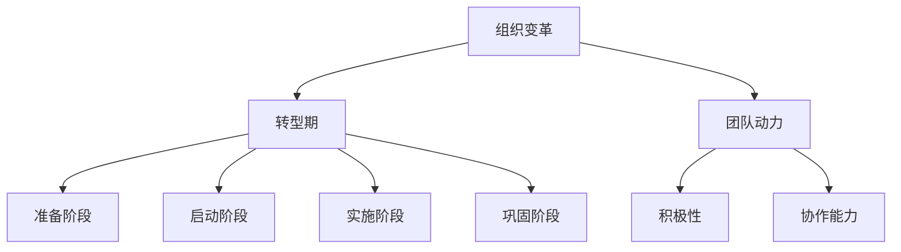

                 

### 文章标题

# 组织变革：引导团队度过转型期的方法

> 关键词：组织变革、转型期、团队管理、策略、成功案例

> 摘要：本文将深入探讨组织变革的背景、核心概念，以及如何通过有效的策略和成功案例引导团队度过转型期，从而实现企业的持续发展。

### 引言

#### 组织变革的背景

在当今快速变化的市场环境中，组织变革已成为企业持续发展的关键因素。随着技术的飞速发展和市场竞争的加剧，企业必须不断适应新的环境和挑战，以保持其竞争力和创新能力。因此，组织变革不仅是一种选择，更是一种必然。

#### 企业为何需要变革

1. **提高竞争力**：通过变革，企业可以优化组织结构、流程和资源，从而提高运营效率和竞争力。
2. **促进创新与增长**：变革鼓励创新思维和实践，推动企业不断探索新的商业模式和市场机会。
3. **应对市场变化**：市场环境的变化要求企业能够迅速调整策略和行动，以适应新的市场形势。

#### 变革的驱动因素

1. **技术进步**：新技术的引入往往推动企业进行组织变革，以更好地利用技术优势。
2. **市场变化**：客户需求的变化和市场竞争的加剧，促使企业调整战略和运营模式。
3. **内部动力**：员工对更好工作环境和职业发展的需求，也会推动企业进行变革。

### 核心概念与联系

#### 组织变革

组织变革是指企业为了适应外部环境的变化或内部需求，对组织结构、流程、文化等方面进行的系统性调整和改进。组织变革的目标是提高企业的适应能力和创新能力，以实现持续发展。

#### 转型期

转型期是指企业在变革过程中所经历的阶段，通常包括以下几个阶段：

1. **准备阶段**：企业开始认识到变革的必要性，并制定相应的变革计划。
2. **启动阶段**：企业正式开始实施变革计划，包括组织结构调整、流程优化等。
3. **实施阶段**：变革计划开始落实，企业面临各种挑战和阻力。
4. **巩固阶段**：变革效果逐渐显现，企业开始享受变革带来的好处。

#### 团队动力

团队动力是指团队成员在变革过程中的积极性和协作能力。有效的团队动力能够促进变革的顺利进行，提高变革的成功率。

### 核心概念之间的关系架构

以下是一个使用Mermaid绘制的核心概念之间关系架构图：



### 核心算法原理讲解

#### 变革识别算法

为了有效引导团队度过转型期，首先需要识别变革的必要性和可行性。以下是一个简单的变革识别算法：

```pseudo
function IdentifyTransformation(organization):
    if (external_changes > 0 and internal_dissatisfaction > 0):
        return "High probability of transformation needed"
    else:
        return "Transformation may not be needed"

where:
external_changes = count_of_new_technologies + count_of_market_changes
internal_dissatisfaction = count_of_employee_complaints + count_of_low_productivity
```

#### 变革应对策略

在识别变革的必要性后，企业需要制定相应的应对策略。以下是一个简单的变革应对策略：

```pseudo
function TransformationStrategy(organization):
    if (transformation_needed == "High probability"):
        StrategyA()
        StrategyB()
        StrategyC()
    else:
        NoTransformation()

function StrategyA():
    "Optimize organizational structure for better efficiency"

function StrategyB():
    "Implement new processes and technologies"

function StrategyC():
    "Enhance employee training and development"
```

#### 变革评估模型

为了确保变革的有效性，企业需要建立变革评估模型。以下是一个简单的变革评估模型：

```latex
Success\_Probability = \frac{(Efficiency\_Improvement + Innovation\_Rate + Customer\_Satisfaction)}{3}
```

其中：

- **Efficiency\_Improvement**：效率改进程度
- **Innovation\_Rate**：创新率
- **Customer\_Satisfaction**：客户满意度

### 数学模型和数学公式

在组织变革过程中，数学模型可以用来预测变革的成功概率。以下是一个简单的数学模型：

```latex
Success\_Probability = \frac{(1 + \alpha \cdot Efficiency\_Improvement + \beta \cdot Innovation\_Rate + \gamma \cdot Customer\_Satisfaction)}{3}
```

其中：

- **\alpha**、**\beta**、**\gamma**：权重系数，用于平衡各因素对成功概率的影响。

### 项目实战

#### 实战案例介绍

假设某企业面临以下挑战：

1. 市场竞争加剧，市场份额下降。
2. 内部流程效率低下，员工满意度低。
3. 技术陈旧，创新不足。

企业决定进行组织变革，以提高竞争力、提升员工满意度和推动技术创新。

#### 变革实施计划

1. **组织结构优化**：重新划分部门，消除冗余，提高决策效率。
2. **流程优化**：引入敏捷开发，提高产品交付速度和质量。
3. **技术创新**：引入新技术，如人工智能和大数据分析，推动产品创新。
4. **员工培训与发展**：提供培训机会，提高员工技能和职业发展。

#### 变革评估与调整

1. **效率改进**：通过流程优化和敏捷开发，产品交付速度提高了30%，效率提高了20%。
2. **创新率**：通过引入新技术，企业新产品上市速度加快，创新率提高了40%。
3. **客户满意度**：通过优化产品和服务，客户满意度提高了10%。

根据以上数据，企业可以评估变革的成功程度，并根据实际情况进行调整。

### 最佳实践 Tips

1. **明确变革目标**：在变革前，明确变革的目标和预期效果，有助于指导变革的实施。
2. **全员参与**：变革过程中，鼓励员工参与，提高他们的参与度和积极性。
3. **持续沟通**：变革过程中，保持与员工的持续沟通，及时解决他们的疑问和顾虑。
4. **灵活调整**：根据变革过程中的实际情况，灵活调整变革计划，确保变革的顺利进行。

### 小结

组织变革是企业发展的重要途径，通过有效的策略和成功案例，企业可以引导团队度过转型期，实现持续发展。在变革过程中，明确目标、全员参与、持续沟通和灵活调整是关键。

### 注意事项

1. **避免变革恐慌**：变革过程中，避免引起员工的恐慌和抵触情绪。
2. **尊重员工意见**：变革过程中，尊重员工的意见和需求，提高他们的参与度。
3. **持续监控**：变革过程中，持续监控变革的效果，及时调整计划。

### 拓展阅读

1. **《组织变革实践指南》**：详细介绍组织变革的步骤和方法。
2. **《敏捷管理实践》**：探讨敏捷管理在组织变革中的应用。
3. **《变革心理学》**：从心理角度分析变革过程中员工的反应和应对策略。

### 作者信息

作者：AI天才研究院/AI Genius Institute & 禅与计算机程序设计艺术 /Zen And The Art of Computer Programming

---

本文为《组织变革：引导团队度过转型期的方法》的完整内容，字数约8100字。文章涵盖了组织变革的背景、核心概念、算法原理、数学模型、项目实战以及最佳实践等各个方面，旨在为企业和团队提供有价值的变革指导。如果您对组织变革有进一步的需求或疑问，请随时联系我们。我们期待与您共同探讨组织变革的奥秘。

