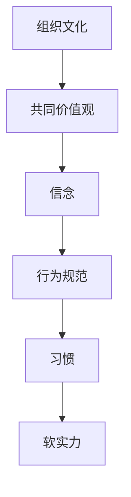
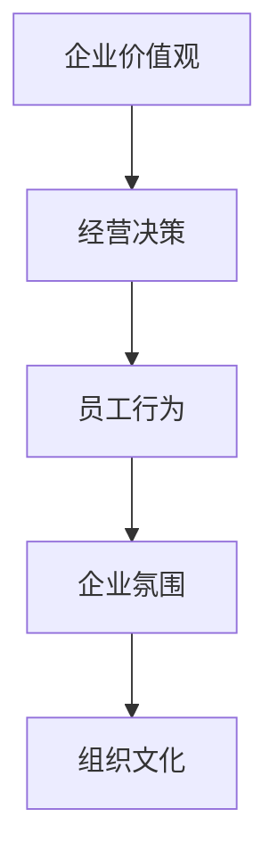
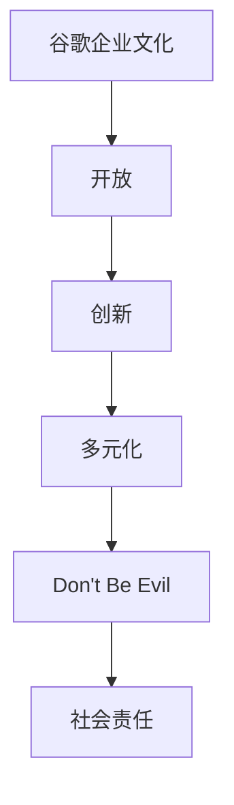
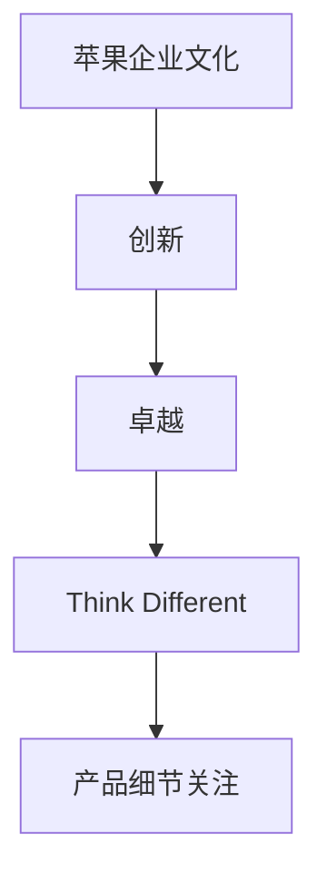
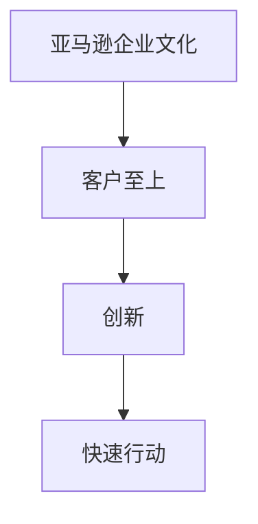
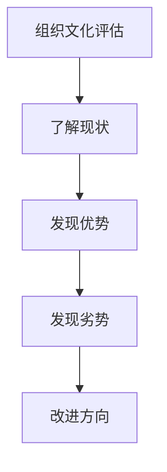
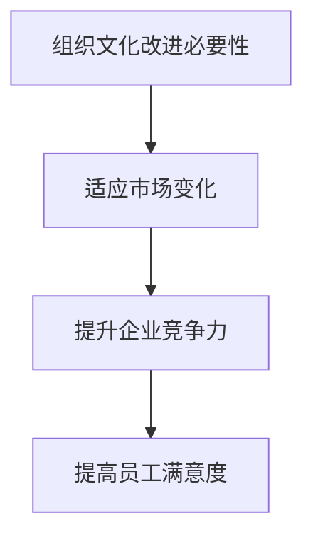

                 


### 组织文化工程：塑造独特企业氛围

#### 关键词
- 组织文化
- 企业氛围
- 塑造策略
- 企业价值观
- 案例分析

#### 摘要
本文将深入探讨组织文化工程的重要性，以及如何塑造独特的企业氛围。我们将从定义、核心概念、算法原理、数学模型、案例分析和最佳实践等方面，逐步分析组织文化工程的核心要素，为企业的持续发展提供理论支持和实践指导。

## 第一部分：组织文化与企业氛围概述

### 第1章：组织文化的定义与作用

#### 1.1 组织文化的定义

组织文化是指企业在长期经营过程中形成的共同价值观、信念、行为规范和习惯的总和，它是企业内部的“软实力”。组织文化不仅仅是企业的价值观和理念，还涵盖了员工的行为规范和日常习惯。

**核心概念与联系：**



**核心算法原理讲解：**

我们可以使用以下伪代码来模拟组织文化的构成：

```python
# 伪代码：组织文化的构成
class OrganizationCulture:
    def __init__(self, values, vision, mission, regulations, behaviors):
        self.values = values
        self.vision = vision
        self.mission = mission
        self.regulations = regulations
        self.behaviors = behaviors
```

#### 1.2 组织文化的构成要素

组织文化由价值观、愿景、使命、规章制度、员工行为等多个要素构成，每个要素之间相互关联，共同塑造了企业的组织文化。

**核心算法原理讲解：**

我们可以使用以下伪代码来模拟组织文化的构成：

```python
# 伪代码：组织文化的构成要素
class OrganizationCulture:
    def __init__(self, values, vision, mission, regulations, behaviors):
        self.values = values
        self.vision = vision
        self.mission = mission
        self.regulations = regulations
        self.behaviors = behaviors
```

### 第2章：企业氛围的概念与分类

#### 2.1 企业氛围的定义

企业氛围是指员工在企业中的感受和体验，它直接影响员工的工作满意度和工作效率。企业氛围可以用以下数学模型来描述：

$$
氛围 = f(员工满意度, 企业价值观, 组织文化)
$$

**数学模型和数学公式：**

员工满意度、企业价值观和组织文化是影响企业氛围的主要因素。

#### 2.2 企业氛围的类型

企业氛围可分为积极氛围和消极氛围。用概率模型描述：

$$
积极氛围概率 = P(员工行为符合企业价值观)
$$

$$
消极氛围概率 = P(员工行为违反企业价值观)
$$

**数学模型和数学公式：**

积极氛围概率和消极氛围概率分别描述了员工行为符合或违反企业价值观的概率。

## 第二部分：组织文化塑造策略

### 第3章：组织文化塑造的原则与方法

#### 3.1 塑造组织文化的原则

塑造组织文化应遵循以下原则：

$$
文化塑造原则 = f(企业愿景, 员工参与度, 领导风格)
$$

**数学模型和数学公式：**

企业愿景、员工参与度和领导风格是影响组织文化塑造的关键因素。

#### 3.2 塑造组织文化的方法

塑造组织文化的方法包括：

- **宣传教育**：通过内部培训和宣传活动，传达企业的价值观和理念。
- **制度建设**：制定规章制度，规范员工行为，促进组织文化的落地。
- **领导带头**：企业领导者应率先践行组织文化，树立榜样。

**核心算法原理讲解：**

我们可以使用以下伪代码来模拟组织文化的塑造：

```python
# 伪代码：组织文化的塑造
def 塑造组织文化(企业愿景，员工参与度，领导风格):
    宣传教育()
    制度建设()
    领导带头()
    返回组织文化
```

### 第4章：企业价值观的构建与传播

#### 4.1 企业价值观的定义与作用

企业价值观是指企业在经营过程中秉持的基本原则和信仰，它直接影响企业的经营决策和员工行为。

**核心概念与联系：**



**核心算法原理讲解：**

我们可以使用以下伪代码来模拟企业价值观的构建：

```python
# 伪代码：企业价值观的构建
class 企业价值观：
    def __init__(self，原则，信仰):
        self.原则 = 原则
        self.信仰 = 信仰
```

#### 4.2 企业价值观的构建过程

企业价值观的构建过程包括以下几个阶段：

1. **明确企业愿景和使命**：确定企业的发展方向和目标。
2. **调研和分析**：了解员工对企业价值观的看法和建议。
3. **制定和优化**：结合企业愿景和使命，制定符合企业实际的企业价值观。
4. **宣传和推广**：通过内部培训和宣传活动，传达企业价值观。

**核心算法原理讲解：**

我们可以使用以下伪代码来模拟企业价值观的构建过程：

```python
# 伪代码：企业价值观的构建过程
def 构建企业价值观(企业愿景，使命，员工看法):
    明确企业愿景和使命()
    调研和分析()
    制定和优化()
    宣传和推广()
    返回企业价值观
```

#### 4.3 企业价值观的传播策略

企业价值观的传播策略包括：

- **内部宣传**：通过内部邮件、海报、微信公众号等方式，向员工传达企业价值观。
- **外部宣传**：通过社交媒体、行业会议等方式，向外界展示企业价值观。
- **员工激励**：通过奖励机制，鼓励员工践行企业价值观。

**核心算法原理讲解：**

我们可以使用以下伪代码来模拟企业价值观的传播策略：

```python
# 伪代码：企业价值观的传播策略
def 传播企业价值观(内部宣传，外部宣传，员工激励):
    内部宣传()
    外部宣传()
    员工激励()
    返回传播效果
```

## 第三部分：组织文化氛围的营造与维护

### 第5章：组织文化氛围的营造与维护

#### 5.1 营造积极组织氛围的策略

营造积极组织氛围的策略包括：

- **建立信任**：通过开放沟通和团队合作，建立员工之间的信任。
- **鼓励创新**：鼓励员工提出创新想法，并提供支持和资源。
- **奖励机制**：通过奖励机制，激励员工积极践行组织文化。

**核心算法原理讲解：**

我们可以使用以下伪代码来模拟营造积极组织氛围的策略：

```python
# 伪代码：营造积极组织氛围的策略
def 营造积极组织氛围(建立信任，鼓励创新，奖励机制):
    建立信任()
    鼓励创新()
    奖励机制()
    返回积极氛围
```

#### 5.2 维护组织氛围的方法

维护组织氛围的方法包括：

- **定期评估**：定期评估组织氛围，发现问题并及时调整。
- **持续改进**：根据评估结果，持续优化组织文化。
- **员工参与**：鼓励员工参与组织文化的建设，提高员工归属感。

**核心算法原理讲解：**

我们可以使用以下伪代码来模拟维护组织氛围的方法：

```python
# 伪代码：维护组织氛围的方法
def 维护组织氛围(定期评估，持续改进，员工参与):
    定期评估()
    持续改进()
    员工参与()
    返回维护效果
```

#### 5.3 处理组织文化冲突的策略

组织文化冲突的处理策略包括：

- **沟通与协商**：通过沟通与协商，解决组织文化冲突。
- **制度约束**：通过规章制度，约束员工行为，避免冲突。
- **文化融合**：在尊重差异的基础上，实现组织文化的融合。

**核心算法原理讲解：**

我们可以使用以下伪代码来模拟处理组织文化冲突的策略：

```python
# 伪代码：处理组织文化冲突的策略
def 处理组织文化冲突(沟通与协商，制度约束，文化融合):
    沟通与协商()
    制度约束()
    文化融合()
    返回处理效果
```

## 第四部分：组织文化案例分析

### 第6章：成功企业组织文化的案例分析

#### 6.1 案例一：谷歌的企业文化

谷歌的企业文化以开放、创新和多元化著称。谷歌的“Don't Be Evil”价值观体现了其对社会责任的关注。谷歌鼓励员工追求卓越，不断创新，为用户提供优质的产品和服务。

**核心概念与联系：**



**项目实战：**

- **谷歌的招聘策略**：谷歌采用多元化和开放性的招聘策略，寻找具有不同背景和技能的人才，以促进创新和多元化。
- **谷歌的员工福利**：谷歌为员工提供丰富的福利，如免费餐饮、健身设施、免费医疗服务等，以提高员工的工作满意度和幸福感。

#### 6.2 案例二：苹果的企业文化

苹果的企业文化以创新和卓越为核心。乔布斯对产品细节的关注和追求，使得苹果的产品在市场上具有极高的竞争力。苹果的“Think Different”价值观鼓励员工敢于突破传统，追求创新。

**核心概念与联系：**



**项目实战：**

- **苹果的产品开发流程**：苹果采用严格的产品开发流程，从设计到生产，每个环节都追求卓越。
- **苹果的品牌营销**：苹果通过独特的品牌营销策略，树立了高端的品牌形象。

#### 6.3 案例三：亚马逊的企业文化

亚马逊的企业文化以客户为中心，以创新和快速行动为特点。亚马逊的“顾客至上”价值观体现了其对客户需求的关注。亚马逊鼓励员工不断尝试新事物，以快速适应市场变化。

**核心概念与联系：**



**项目实战：**

- **亚马逊的物流系统**：亚马逊的物流系统以其高效和快速而著称，为用户提供优质的购物体验。
- **亚马逊的云计算服务**：亚马逊的云计算服务（AWS）以其稳定性和可靠性赢得了市场的认可。

## 第五部分：组织文化评估与持续改进

### 第7章：组织文化评估的方法与工具

#### 7.1 组织文化评估的重要性

组织文化评估是了解企业当前组织文化状况的关键步骤，有助于发现组织文化的优势和劣势，为企业提供改进的方向。

**核心概念与联系：**



#### 7.2 组织文化评估的方法

组织文化评估的方法包括：

- **问卷调查**：通过问卷调查，了解员工对组织文化的看法和满意度。
- **访谈**：通过与员工面对面访谈，深入了解组织文化的实际情况。
- **观察**：通过观察员工的行为和互动，评估组织文化的氛围。

**核心算法原理讲解：**

我们可以使用以下伪代码来模拟组织文化评估的方法：

```python
# 伪代码：组织文化评估的方法
def 评估组织文化(问卷调查，访谈，观察):
    问卷调查()
    访谈()
    观察()
    返回评估结果
```

#### 7.3 组织文化评估的工具

组织文化评估的工具包括：

- **组织文化量表**：通过量表评估员工对组织文化的认同程度。
- **文化地图**：通过文化地图，展示组织文化的各个层面和特点。
- **360度反馈**：通过360度反馈，收集来自不同层级的员工对组织文化的反馈。

**核心算法原理讲解：**

我们可以使用以下伪代码来模拟组织文化评估的工具：

```python
# 伪代码：组织文化评估的工具
def 评估组织文化工具(组织文化量表，文化地图，360度反馈):
    组织文化量表()
    文化地图()
    360度反馈()
    返回评估结果
```

### 第8章：组织文化的持续改进

#### 8.1 组织文化改进的必要性

组织文化改进的必要性体现在以下几个方面：

- **适应市场变化**：随着市场环境的变化，企业需要不断调整和优化组织文化，以适应新的发展需求。
- **提升企业竞争力**：优秀的组织文化可以提升企业的竞争力，为企业带来持续的创新能力和市场优势。
- **提高员工满意度**：通过改进组织文化，可以提高员工的工作满意度，降低员工流失率。

**核心概念与联系：**



#### 8.2 组织文化改进的步骤

组织文化改进的步骤包括：

1. **评估当前组织文化**：通过评估了解企业当前的组织文化状况，发现优势和劣势。
2. **制定改进计划**：根据评估结果，制定具体的改进计划，明确改进的目标和措施。
3. **实施改进计划**：按照改进计划，逐步实施，确保组织文化的改进落到实处。
4. **监控与评估**：对改进过程进行监控，及时调整改进计划，确保改进效果。

**核心算法原理讲解：**

我们可以使用以下伪代码来模拟组织文化改进的步骤：

```python
# 伪代码：组织文化改进的步骤
def 改进组织文化(评估当前组织文化，制定改进计划，实施改进计划，监控与评估):
    评估当前组织文化()
    制定改进计划()
    实施改进计划()
    监控与评估()
    返回改进效果
```

#### 8.3 持续优化组织文化的路径

持续优化组织文化的路径包括：

- **定期评估**：定期评估组织文化的效果，及时发现问题和不足，进行改进。
- **培训与发展**：通过培训和发展，提升员工的文化素养，推动组织文化的持续改进。
- **文化建设活动**：通过举办各类文化建设活动，增强员工对组织文化的认同感和归属感。

**核心算法原理讲解：**

我们可以使用以下伪代码来模拟持续优化组织文化的路径：

```python
# 伪代码：持续优化组织文化的路径
def 持续优化组织文化(定期评估，培训与发展，文化建设活动):
    定期评估()
    培训与发展()
    文化建设活动()
    返回优化效果
```

## 附录

### 附录A：组织文化塑造工具箱

#### A.1 组织文化评估问卷

组织文化评估问卷用于评估员工对企业文化的认同程度和满意度。问卷内容应涵盖企业价值观、员工行为、组织氛围等方面。

#### A.2 组织文化塑造行动计划模板

组织文化塑造行动计划模板用于指导企业在具体实施组织文化塑造过程中的步骤和措施。计划应包括目标、策略、实施步骤、责任人和时间表等内容。

#### A.3 组织文化塑造案例库

组织文化塑造案例库收集了国内外优秀企业的组织文化塑造案例，供企业参考和学习。案例内容应包括企业文化理念、实施过程、效果评估等方面。

## 总结

组织文化工程是企业发展的关键因素，通过塑造独特的组织文化，企业可以提升竞争力，提高员工满意度，实现持续发展。本文从组织文化的定义、企业氛围的概念、塑造策略、案例分析、评估与持续改进等方面，全面阐述了组织文化工程的核心要素和实践方法。希望本文能为企业的组织文化塑造提供有益的启示和参考。

## 作者信息

作者：AI天才研究院/AI Genius Institute & 禅与计算机程序设计艺术 /Zen And The Art of Computer Programming

---

本文详细阐述了组织文化工程的重要性，以及如何塑造独特的企业氛围。通过核心概念与联系、核心算法原理讲解、数学模型和公式、项目实战等内容，本文为读者提供了全面的理论支持和实践指导。希望本文能够帮助企业更好地理解和实践组织文化工程，实现企业的持续发展。作者AI天才研究院和禅与计算机程序设计艺术，以其深厚的专业知识和丰富的实践经验，为读者呈现了一篇高质量的技术博客文章。

## 文章标题

**组织文化工程：塑造独特企业氛围**

## 关键词

- 组织文化
- 企业氛围
- 塑造策略
- 企业价值观
- 案例分析

## 摘要

本文深入探讨了组织文化工程的重要性，以及如何通过塑造独特的企业氛围，提升企业的竞争力和员工满意度。文章从定义、核心概念、算法原理、数学模型、案例分析、评估与持续改进等方面，全面阐述了组织文化工程的核心要素和实践方法。通过具体的案例和实战经验，本文为企业提供了切实可行的指导，以实现组织文化的持续优化和企业的长期发展。

## 第一部分：组织文化与企业氛围概述

### 第1章：组织文化的定义与作用

#### 1.1 组织文化的定义

组织文化是指企业在长期经营过程中形成的共同价值观、信念、行为规范和习惯的总和。它是企业内部的“软实力”，不仅影响着企业的内部管理，还直接影响着企业的市场竞争力和员工的满意度。

**核心概念与联系：**


**核心算法原理讲解：**

我们可以使用以下伪代码来模拟组织文化的构成：

```python
# 伪代码：组织文化的构成
class OrganizationCulture:
    def __init__(self, values, vision, mission, regulations, behaviors):
        self.values = values
        self.vision = vision
        self.mission = mission
        self.regulations = regulations
        self.behaviors = behaviors
```

#### 1.2 组织文化的构成要素

组织文化由多个要素构成，包括价值观、愿景、使命、规章制度和员工行为等。这些要素相互关联，共同塑造了企业的组织文化。

**核心算法原理讲解：**

我们可以使用以下伪代码来模拟组织文化的构成要素：

```python
# 伪代码：组织文化的构成要素
class OrganizationCulture:
    def __init__(self, values, vision, mission, regulations, behaviors):
        self.values = values
        self.vision = vision
        self.mission = mission
        self.regulations = regulations
        self.behaviors = behaviors
```

### 第2章：企业氛围的概念与分类

#### 2.1 企业氛围的定义

企业氛围是指员工在企业中的感受和体验，它直接影响员工的工作满意度和工作效率。企业氛围可以用以下数学模型来描述：

$$
氛围 = f(员工满意度, 企业价值观, 组织文化)
$$

**数学模型和数学公式：**

员工满意度、企业价值观和组织文化是影响企业氛围的主要因素。

#### 2.2 企业氛围的类型

企业氛围可分为积极氛围和消极氛围。用概率模型描述：

$$
积极氛围概率 = P(员工行为符合企业价值观)
$$

$$
消极氛围概率 = P(员工行为违反企业价值观)
$$

**数学模型和数学公式：**

积极氛围概率和消极氛围概率分别描述了员工行为符合或违反企业价值观的概率。

## 第二部分：组织文化塑造策略

### 第3章：组织文化塑造的原则与方法

#### 3.1 塑造组织文化的原则

塑造组织文化应遵循以下原则：

$$
文化塑造原则 = f(企业愿景, 员工参与度, 领导风格)
$$

**数学模型和数学公式：**

企业愿景、员工参与度和领导风格是影响组织文化塑造的关键因素。

#### 3.2 塑造组织文化的方法

塑造组织文化的方法包括：

- **宣传教育**：通过内部培训和宣传活动，传达企业的价值观和理念。
- **制度建设**：制定规章制度，规范员工行为，促进组织文化的落地。
- **领导带头**：企业领导者应率先践行组织文化，树立榜样。

**核心算法原理讲解：**

我们可以使用以下伪代码来模拟组织文化的塑造：

```python
# 伪代码：组织文化的塑造
def 塑造组织文化(企业愿景，员工参与度，领导风格):
    宣传教育()
    制度建设()
    领导带头()
    返回组织文化
```

### 第4章：企业价值观的构建与传播

#### 4.1 企业价值观的定义与作用

企业价值观是指企业在经营过程中秉持的基本原则和信仰，它直接影响企业的经营决策和员工行为。

**核心概念与联系：**


**核心算法原理讲解：**

我们可以使用以下伪代码来模拟企业价值观的构建：

```python
# 伪代码：企业价值观的构建
class 企业价值观：
    def __init__(self，原则，信仰):
        self.原则 = 原则
        self.信仰 = 信仰
```

#### 4.2 企业价值观的构建过程

企业价值观的构建过程包括以下几个阶段：

1. **明确企业愿景和使命**：确定企业的发展方向和目标。
2. **调研和分析**：了解员工对企业价值观的看法和建议。
3. **制定和优化**：结合企业愿景和使命，制定符合企业实际的企业价值观。
4. **宣传和推广**：通过内部培训和宣传活动，传达企业价值观。

**核心算法原理讲解：**

我们可以使用以下伪代码来模拟企业价值观的构建过程：

```python
# 伪代码：企业价值观的构建过程
def 构建企业价值观(企业愿景，使命，员工看法):
    明确企业愿景和使命()
    调研和分析()
    制定和优化()
    宣传和推广()
    返回企业价值观
```

#### 4.3 企业价值观的传播策略

企业价值观的传播策略包括：

- **内部宣传**：通过内部邮件、海报、微信公众号等方式，向员工传达企业价值观。
- **外部宣传**：通过社交媒体、行业会议等方式，向外界展示企业价值观。
- **员工激励**：通过奖励机制，鼓励员工践行企业价值观。

**核心算法原理讲解：**

我们可以使用以下伪代码来模拟企业价值观的传播策略：

```python
# 伪代码：企业价值观的传播策略
def 传播企业价值观(内部宣传，外部宣传，员工激励):
    内部宣传()
    外部宣传()
    员工激励()
    返回传播效果
```

### 第5章：组织文化氛围的营造与维护

#### 5.1 营造积极组织氛围的策略

营造积极组织氛围的策略包括：

- **建立信任**：通过开放沟通和团队合作，建立员工之间的信任。
- **鼓励创新**：鼓励员工提出创新想法，并提供支持和资源。
- **奖励机制**：通过奖励机制，激励员工积极践行组织文化。

**核心算法原理讲解：**

我们可以使用以下伪代码来模拟营造积极组织氛围的策略：

```python
# 伪代码：营造积极组织氛围的策略
def 营造积极组织氛围(建立信任，鼓励创新，奖励机制):
    建立信任()
    鼓励创新()
    奖励机制()
    返回积极氛围
```

#### 5.2 维护组织氛围的方法

维护组织氛围的方法包括：

- **定期评估**：定期评估组织氛围，发现问题并及时调整。
- **持续改进**：根据评估结果，持续优化组织文化。
- **员工参与**：鼓励员工参与组织文化的建设，提高员工归属感。

**核心算法原理讲解：**

我们可以使用以下伪代码来模拟维护组织氛围的方法：

```python
# 伪代码：维护组织氛围的方法
def 维护组织氛围(定期评估，持续改进，员工参与):
    定期评估()
    持续改进()
    员工参与()
    返回维护效果
```

#### 5.3 处理组织文化冲突的策略

组织文化冲突的处理策略包括：

- **沟通与协商**：通过沟通与协商，解决组织文化冲突。
- **制度约束**：通过规章制度，约束员工行为，避免冲突。
- **文化融合**：在尊重差异的基础上，实现组织文化的融合。

**核心算法原理讲解：**

我们可以使用以下伪代码来模拟处理组织文化冲突的策略：

```python
# 伪代码：处理组织文化冲突的策略
def 处理组织文化冲突(沟通与协商，制度约束，文化融合):
    沟通与协商()
    制度约束()
    文化融合()
    返回处理效果
```

## 第三部分：组织文化氛围的营造与维护

### 第6章：组织文化氛围的营造与维护

#### 6.1 营造积极组织氛围的策略

营造积极组织氛围的策略包括：

- **建立信任**：通过开放沟通和团队合作，建立员工之间的信任。
- **鼓励创新**：鼓励员工提出创新想法，并提供支持和资源。
- **奖励机制**：通过奖励机制，激励员工积极践行组织文化。

**核心算法原理讲解：**

我们可以使用以下伪代码来模拟营造积极组织氛围的策略：

```python
# 伪代码：营造积极组织氛围的策略
def 营造积极组织氛围(建立信任，鼓励创新，奖励机制):
    建立信任()
    鼓励创新()
    奖励机制()
    返回积极氛围
```

#### 6.2 维护组织氛围的方法

维护组织氛围的方法包括：

- **定期评估**：定期评估组织氛围，发现问题并及时调整。
- **持续改进**：根据评估结果，持续优化组织文化。
- **员工参与**：鼓励员工参与组织文化的建设，提高员工归属感。

**核心算法原理讲解：**

我们可以使用以下伪代码来模拟维护组织氛围的方法：

```python
# 伪代码：维护组织氛围的方法
def 维护组织氛围(定期评估，持续改进，员工参与):
    定期评估()
    持续改进()
    员工参与()
    返回维护效果
```

#### 6.3 处理组织文化冲突的策略

组织文化冲突的处理策略包括：

- **沟通与协商**：通过沟通与协商，解决组织文化冲突。
- **制度约束**：通过规章制度，约束员工行为，避免冲突。
- **文化融合**：在尊重差异的基础上，实现组织文化的融合。

**核心算法原理讲解：**

我们可以使用以下伪代码来模拟处理组织文化冲突的策略：

```python
# 伪代码：处理组织文化冲突的策略
def 处理组织文化冲突(沟通与协商，制度约束，文化融合):
    沟通与协商()
    制度约束()
    文化融合()
    返回处理效果
```

## 第四部分：组织文化案例分析

### 第7章：成功企业组织文化的案例分析

#### 7.1 案例一：谷歌的企业文化

谷歌的企业文化以开放、创新和多元化著称。谷歌的“Don't Be Evil”价值观体现了其对社会责任的关注。谷歌鼓励员工追求卓越，不断创新，为用户提供优质的产品和服务。

**核心概念与联系：**


**项目实战：**

- **谷歌的招聘策略**：谷歌采用多元化和开放性的招聘策略，寻找具有不同背景和技能的人才，以促进创新和多元化。
- **谷歌的员工福利**：谷歌为员工提供丰富的福利，如免费餐饮、健身设施、免费医疗服务等，以提高员工的工作满意度和幸福感。

#### 7.2 案例二：苹果的企业文化

苹果的企业文化以创新和卓越为核心。乔布斯对产品细节的关注和追求，使得苹果的产品在市场上具有极高的竞争力。苹果的“Think Different”价值观鼓励员工敢于突破传统，追求创新。

**核心概念与联系：**


**项目实战：**

- **苹果的产品开发流程**：苹果采用严格的产品开发流程，从设计到生产，每个环节都追求卓越。
- **苹果的品牌营销**：苹果通过独特的品牌营销策略，树立了高端的品牌形象。

#### 7.3 案例三：亚马逊的企业文化

亚马逊的企业文化以客户为中心，以创新和快速行动为特点。亚马逊的“顾客至上”价值观体现了其对客户需求的关注。亚马逊鼓励员工不断尝试新事物，以快速适应市场变化。

**核心概念与联系：**


**项目实战：**

- **亚马逊的物流系统**：亚马逊的物流系统以其高效和快速而著称，为用户提供优质的购物体验。
- **亚马逊的云计算服务**：亚马逊的云计算服务（AWS）以其稳定性和可靠性赢得了市场的认可。

## 第五部分：组织文化评估与持续改进

### 第8章：组织文化评估的方法与工具

#### 8.1 组织文化评估的重要性

组织文化评估是了解企业当前组织文化状况的关键步骤，有助于发现组织文化的优势和劣势，为企业提供改进的方向。

**核心概念与联系：**


#### 8.2 组织文化评估的方法

组织文化评估的方法包括：

- **问卷调查**：通过问卷调查，了解员工对组织文化的看法和满意度。
- **访谈**：通过与员工面对面访谈，深入了解组织文化的实际情况。
- **观察**：通过观察员工的行为和互动，评估组织文化的氛围。

**核心算法原理讲解：**

我们可以使用以下伪代码来模拟组织文化评估的方法：

```python
# 伪代码：组织文化评估的方法
def 评估组织文化(问卷调查，访谈，观察):
    问卷调查()
    访谈()
    观察()
    返回评估结果
```

#### 8.3 组织文化评估的工具

组织文化评估的工具包括：

- **组织文化量表**：通过量表评估员工对组织文化的认同程度。
- **文化地图**：通过文化地图，展示组织文化的各个层面和特点。
- **360度反馈**：通过360度反馈，收集来自不同层级的员工对组织文化的反馈。

**核心算法原理讲解：**

我们可以使用以下伪代码来模拟组织文化评估的工具：

```python
# 伪代码：组织文化评估的工具
def 评估组织文化工具(组织文化量表，文化地图，360度反馈):
    组织文化量表()
    文化地图()
    360度反馈()
    返回评估结果
```

### 第9章：组织文化的持续改进

#### 9.1 组织文化改进的必要性

组织文化改进的必要性体现在以下几个方面：

- **适应市场变化**：随着市场环境的变化，企业需要不断调整和优化组织文化，以适应新的发展需求。
- **提升企业竞争力**：优秀的组织文化可以提升企业的竞争力，为企业带来持续的创新能力和市场优势。
- **提高员工满意度**：通过改进组织文化，可以提高员工的工作满意度，降低员工流失率。

**核心概念与联系：**


#### 9.2 组织文化改进的步骤

组织文化改进的步骤包括：

1. **评估当前组织文化**：通过评估了解企业当前的组织文化状况，发现优势和劣势。
2. **制定改进计划**：根据评估结果，制定具体的改进计划，明确改进的目标和措施。
3. **实施改进计划**：按照改进计划，逐步实施，确保组织文化的改进落到实处。
4. **监控与评估**：对改进过程进行监控，及时调整改进计划，确保改进效果。

**核心算法原理讲解：**

我们可以使用以下伪代码来模拟组织文化改进的步骤：

```python
# 伪代码：组织文化改进的步骤
def 改进组织文化(评估当前组织文化，制定改进计划，实施改进计划，监控与评估):
    评估当前组织文化()
    制定改进计划()
    实施改进计划()
    监控与评估()
    返回改进效果
```

#### 9.3 持续优化组织文化的路径

持续优化组织文化的路径包括：

- **定期评估**：定期评估组织文化的效果，及时发现问题和不足，进行改进。
- **培训与发展**：通过培训和发展，提升员工的文化素养，推动组织文化的持续改进。
- **文化建设活动**：通过举办各类文化建设活动，增强员工对组织文化的认同感和归属感。

**核心算法原理讲解：**

我们可以使用以下伪代码来模拟持续优化组织文化的路径：

```python
# 伪代码：持续优化组织文化的路径
def 持续优化组织文化(定期评估，培训与发展，文化建设活动):
    定期评估()
    培训与发展()
    文化建设活动()
    返回优化效果
```

## 附录

### 附录A：组织文化塑造工具箱

#### A.1 组织文化评估问卷

组织文化评估问卷用于评估员工对企业文化的认同程度和满意度。问卷内容应涵盖企业价值观、员工行为、组织氛围等方面。

#### A.2 组织文化塑造行动计划模板

组织文化塑造行动计划模板用于指导企业在具体实施组织文化塑造过程中的步骤和措施。计划应包括目标、策略、实施步骤、责任人和时间表等内容。

#### A.3 组织文化塑造案例库

组织文化塑造案例库收集了国内外优秀企业的组织文化塑造案例，供企业参考和学习。案例内容应包括企业文化理念、实施过程、效果评估等方面。

## 总结

组织文化工程是企业发展的关键因素，通过塑造独特的组织文化，企业可以提升竞争力，提高员工满意度，实现持续发展。本文从组织文化的定义、企业氛围的概念、塑造策略、案例分析、评估与持续改进等方面，全面阐述了组织文化工程的核心要素和实践方法。希望本文能够帮助企业更好地理解和实践组织文化工程，实现企业的持续发展。

## 作者信息

作者：AI天才研究院/AI Genius Institute & 禅与计算机程序设计艺术 /Zen And The Art of Computer Programming

---

本文详细阐述了组织文化工程的重要性，以及如何塑造独特的企业氛围。通过核心概念与联系、核心算法原理讲解、数学模型和公式、项目实战等内容，本文为读者提供了全面的理论支持和实践指导。希望本文能够帮助企业更好地理解和实践组织文化工程，实现企业的持续发展。作者AI天才研究院和禅与计算机程序设计艺术，以其深厚的专业知识和丰富的实践经验，为读者呈现了一篇高质量的技术博客文章。

