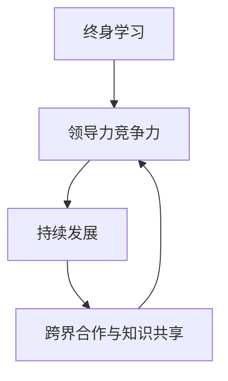

                 

### 引言与核心概念

#### 第1章：终身学习与领导力竞争力

##### 1.1 终身学习的重要性

**终身学习**是指个体在其整个生命过程中，通过不断的学习和实践来提升自身能力、知识和技能的过程。这一概念在现代社会尤为重要，因为技术的飞速发展使得知识更新速度加快，单一的教育阶段已经无法满足个人职业发展的需求。终身学习不仅是对知识的补充，更是对个人能力的持续提升和优化。

**历史演变**：终身学习的理念起源于20世纪60年代，以保罗·朗格朗（Paulo Freire）和罗伯特·哈钦斯（Robert Hutchins）等教育理论家的研究为基础。随着时间的推移，终身学习逐渐成为全球教育体系的重要部分，许多国家都将其纳入教育政策。

**对个人发展的意义**：

1. **持续适应变化**：在快速变化的社会环境中，终身学习能够帮助个人不断适应新的环境和需求。
2. **职业发展**：通过终身学习，个人可以不断提升自己的职业技能，保持市场竞争力，实现职业发展。
3. **个人成长**：终身学习不仅限于职业技能，还包括个人兴趣、价值观和人生目标的提升，有助于实现全面发展。

##### 1.2 领导力竞争力概述

**领导力的定义**：领导力是指个体在组织中引导、激励和协调他人，以实现共同目标的能力。领导力不仅关乎个人的能力和素质，更是一个互动的过程，涉及领导者与团队成员之间的相互作用。

**领导力的类型**：

1. **权威型领导**：通过权威和命令来指导他人。
2. **民主型领导**：鼓励团队参与决策过程，发挥集体的智慧。
3. **变革型领导**：通过变革和激励来推动组织创新和发展。
4. **情境型领导**：根据不同情境和团队成员的需求采取不同的领导风格。

**领导力竞争力的核心要素**：

1. **知识储备**：领导者需要具备丰富的专业知识和行业经验。
2. **个人特质**：包括诚信、自信、决策能力、沟通能力和团队合作能力等。
3. **团队效能**：领导者的能力不仅体现在个人，更在于能否有效管理和激励团队，提升整体效能。

##### 1.3 终身学习与领导力竞争力的关系

**终身学习如何提升领导力竞争力**：

1. **知识更新**：通过终身学习，领导者可以不断更新自己的知识和技能，适应行业变化。
2. **创新能力**：终身学习有助于领导者保持创新思维，推动组织变革和发展。
3. **适应能力**：终身学习使领导者能够更好地适应复杂多变的环境和需求。

**领导力竞争力如何促进终身学习**：

1. **激励作用**：领导者的领导力能够激发团队成员的学习热情，形成良好的学习氛围。
2. **资源支持**：领导者可以通过提供学习资源和支持，帮助团队成员实现终身学习。
3. **知识共享**：领导者的领导力有助于促进知识在团队内部的共享，形成知识网络，推动终身学习。

终身学习和领导力竞争力相辅相成，共同推动个人和组织的发展。在接下来的章节中，我们将进一步探讨终身学习的策略和方法，以及如何通过领导力提升竞争力。让我们一步一步地深入分析，理解这一重要主题。

### 终身学习的策略与方法

#### 第2章：学习习惯的培养

##### 2.1 自我认知与目标设定

**自我认知的重要性**：

自我认知是指个体对自己能力、兴趣、价值观和目标的了解。自我认知对于终身学习至关重要，因为它决定了学习的方向和动力。以下是一些关键点：

1. **了解自身优势与不足**：通过自我认知，个体可以明确自己的优势领域，从而有针对性地进行学习。
2. **设定合理的学习目标**：自我认知有助于设定切实可行的学习目标，避免盲目追求。
3. **增强学习动力**：自我认知能够提升个体对学习的兴趣和热情，使其更有动力去实现目标。

**如何进行自我认知**：

1. **反思与总结**：定期反思和总结自己的学习经历，分析成功与失败的原因。
2. **使用评估工具**：例如性格测试、职业兴趣量表等，帮助个体更好地了解自己的特点。
3. **与导师或同行交流**：通过与有经验的人交流，获取外部反馈，进一步完善自我认知。

**设定明确的学习目标**：

明确的学习目标是终身学习的重要基础。以下是一些关键步骤：

1. **确定学习目标**：根据自我认知，设定短期和长期的学习目标。
2. **目标具体化**：将抽象的目标转化为具体的行为和结果。
3. **目标评估**：定期评估学习目标的实现情况，及时调整和优化。

**如何设定明确的学习目标**：

1. **SMART原则**：确保学习目标是具体的（Specific）、可测量的（Measurable）、可实现的（Achievable）、相关的（Relevant）和有时间限制的（Time-bound）。
2. **分解目标**：将大目标分解为小目标，逐步实现。
3. **定期回顾**：定期回顾和评估目标的实现情况，确保学习方向的正确性。

##### 2.2 学习计划的制定

**学习计划的要素**：

一个有效的学习计划应包括以下要素：

1. **学习内容**：明确需要学习哪些知识和技能。
2. **学习时间**：合理安排学习时间，确保学习计划的执行。
3. **学习方式**：选择合适的学习方法，如在线课程、书籍阅读、研讨会等。
4. **学习资源**：获取所需的学习资料和工具。
5. **学习评估**：设定学习评估标准，监控学习效果。

**学习计划的执行与调整**：

1. **执行计划**：按照学习计划进行学习，坚持每天或每周的学习任务。
2. **持续调整**：根据学习评估的结果，及时调整学习计划，确保学习目标的实现。

**如何制定学习计划**：

1. **需求分析**：分析自身的学习需求，确定学习内容。
2. **时间规划**：根据个人时间安排，合理分配学习时间。
3. **选择学习方式**：根据个人特点和需求，选择合适的学习方式。
4. **资源收集**：搜集和学习所需的资料和工具。
5. **评估与反馈**：定期评估学习效果，根据反馈调整学习计划。

##### 2.3 学习习惯的养成

**常见的学习障碍**：

1. **时间管理问题**：学习时间难以保证，容易受到其他事务的干扰。
2. **缺乏学习动力**：长时间的学习容易产生厌倦情绪，缺乏持续学习的动力。
3. **学习方法不当**：使用不适合自己的学习方法，影响学习效果。

**如何培养良好的学习习惯**：

1. **设定固定学习时间**：每天或每周设定固定的学习时间，形成习惯。
2. **分解学习任务**：将大任务分解为小任务，逐步完成。
3. **激励自己**：设定奖励机制，激励自己坚持学习。
4. **寻求支持**：与同学、导师或同行交流，互相鼓励和支持。

**持续学习的实践建议**：

1. **阅读**：定期阅读专业书籍和论文，保持知识的更新。
2. **学习交流**：参加研讨会、工作坊等交流活动，与他人分享学习心得。
3. **实践应用**：将学到的知识应用于实际工作中，提升实践能力。

通过以上策略和方法，我们可以有效地培养终身学习的习惯，提升自身的竞争力。在接下来的章节中，我们将探讨领导力提升的具体实践，进一步理解终身学习与领导力竞争力之间的关系。让我们一步一步地深入分析，探索这一重要主题。

### 领导力提升的具体实践

#### 第3章：领导力提升的理论基础

##### 3.1 领导力模型与理论

**经典领导力模型介绍**：

1. **路径-目标理论（Path-Goal Theory）**：
   - 提出领导者通过设定清晰的路径和目标，帮助团队成员实现目标。
   - 适用于不同的环境，强调领导者应适应不同情境下的需求。

2. **领导者参与模型（Leader-Member Exchange Model, LMX）**：
   - 研究领导者与团队成员之间的关系，认为高质量的关系有助于提升团队效能。
   - 着重于领导者如何通过建立互信关系来提升团队成员的工作表现。

3. **变革型领导理论（Transformational Leadership Theory）**：
   - 强调领导者通过激励和激发团队成员的潜力，推动组织变革和发展。
   - 着重于领导者的愿景、价值观和激励能力。

**领导力理论的发展与演进**：

1. **从传统领导到变革型领导**：
   - 传统领导主要关注任务完成和组织效率。
   - 变革型领导则更加注重创新和团队发展。

2. **从个体领导到领导系统**：
   - 过去领导力研究主要关注领导者个人特质。
   - 现代研究更加关注领导系统的构建，如领导力培养、领导力文化等。

3. **从静态到动态**：
   - 早期的领导力理论更多是静态的，如特质理论。
   - 现代理论更加注重动态过程，如情境理论。

##### 3.2 领导力发展的个人特质

**个人特质对领导力的影响**：

1. **诚信与透明度**：领导者诚信和透明度能够建立信任，提升团队士气。
2. **决策能力**：领导者需要具备快速而明智的决策能力，以应对复杂多变的环境。
3. **沟通能力**：有效的沟通能够帮助领导者传达愿景和策略，确保团队理解并支持决策。
4. **团队合作能力**：领导者需要能够协调不同成员的能力，形成高效的团队。

**如何培养和提升个人特质**：

1. **自我反思与改进**：
   - 定期反思自己的行为和决策，识别优点和不足。
   - 通过学习和实践，改进自己的领导力技能。

2. **角色模型**：
   - 寻找优秀的领导者作为榜样，学习他们的行为和策略。
   - 观察和分析他们的领导方式，借鉴并应用于自己的实践中。

3. **培训与教育**：
   - 参加领导力培训课程，学习最新的领导力理论和实践。
   - 阅读相关书籍，扩展领导力的知识储备。

4. **实践与反馈**：
   - 将学到的理论应用于实际工作中，通过实践提升领导力。
   - 寻求反馈，了解自己的领导力表现，不断优化和改进。

##### 3.3 领导力提升的方法与技巧

**领导力提升的常见方法**：

1. **领导力发展计划**：
   - 设计个性化的领导力发展计划，包括培训、辅导、轮岗等。
   - 通过系统的培养，提升领导者的综合能力。

2. **领导力研讨会和工作坊**：
   - 参加研讨会和工作坊，与同行交流，分享经验和观点。
   - 通过互动和讨论，学习不同的领导力策略和方法。

3. **情境模拟训练**：
   - 通过模拟实际工作场景，锻炼领导者的决策和应对能力。
   - 分析模拟中的优点和不足，提升领导力。

**如何在实践中运用领导力技巧**：

1. **建立明确的愿景和目标**：
   - 设定清晰的愿景和目标，确保团队朝着共同的方向努力。
   - 通过沟通和解释，让团队成员理解并认同这些目标和愿景。

2. **激励和认可团队成员**：
   - 通过奖励和认可，激励团队成员发挥最佳水平。
   - 定期表扬团队成员的贡献和成就，增强团队凝聚力。

3. **促进团队合作和知识共享**：
   - 鼓励团队成员之间的合作和交流，形成知识共享的氛围。
   - 通过团队建设活动和项目合作，提升团队协作能力。

4. **提供成长和支持**：
   - 为团队成员提供学习和成长的机会，支持他们的发展。
   - 建立反馈机制，帮助团队成员识别和改进自身的不足。

通过以上方法和技巧，领导者可以不断提升自身的领导力，从而更有效地引导和激励团队，实现组织目标。在接下来的章节中，我们将通过成功企业的领导力实践，进一步探讨领导力提升的具体案例。让我们一步一步地深入分析，理解领导力提升的实际应用。

### 领导力竞争力提升的实战案例

#### 第4章：成功企业的领导力实践

##### 4.1 优秀领导者的特征与习惯

**优秀领导者的核心特征**：

1. **愿景与目标明确**：优秀的领导者能够设定清晰的愿景和目标，激发团队成员的激情和动力，确保团队朝着共同的方向努力。

2. **高度诚信**：领导者诚信为本，言行一致，建立信任和尊重，使团队成员愿意跟随和信任。

3. **持续学习与适应能力**：优秀的领导者具备终身学习的精神，不断更新知识和技能，适应快速变化的环境，以应对挑战和机遇。

4. **沟通与影响力**：优秀的领导者具备出色的沟通技巧，能够有效传达愿景和策略，同时具备强大的影响力，引导团队成员做出正确决策。

5. **团队建设与激励**：优秀的领导者注重团队建设，营造积极向上的工作氛围，通过激励和认可，激发团队成员的潜能和创造力。

**优秀领导者的日常工作习惯**：

1. **每日反思**：优秀领导者每天都会花时间反思自己的工作，总结经验教训，不断优化自己的领导方式。

2. **持续学习**：优秀领导者定期阅读专业书籍和论文，参加培训和学习活动，保持知识的更新和能力的提升。

3. **沟通与交流**：优秀领导者积极与团队成员沟通，了解他们的想法和需求，鼓励团队成员表达意见和建议。

4. **团队建设**：优秀领导者定期组织团队建设活动，加强团队成员之间的互动和合作，提升团队凝聚力和效能。

##### 4.2 企业领导力战略与实施

**企业领导力战略的制定**：

1. **明确企业愿景和使命**：企业领导力战略应以企业愿景和使命为基础，确保领导力的方向与企业的长远目标一致。

2. **确定领导力需求**：分析企业当前和未来的领导力需求，识别领导者的不足之处，制定针对性的领导力提升计划。

3. **制定领导力发展计划**：根据领导力需求，设计个性化的领导力发展计划，包括培训、辅导、轮岗等，提升领导者的综合能力。

**企业领导力战略的实施**：

1. **领导力培训**：定期组织领导力培训，邀请专家和学者分享最新的领导力理论和实践，提升领导者的知识和技能。

2. **领导力辅导**：为领导者提供个性化的辅导，帮助他们解决实际问题，提升领导力。

3. **领导力轮岗**：通过领导力轮岗，让领导者在不同部门和岗位上积累经验，提升他们的跨部门协作能力和全局观念。

4. **领导力评估**：建立领导力评估机制，定期评估领导者的领导力表现，识别优势和不足，制定改进措施。

**领导力战略的实施与评估**：

1. **制定实施计划**：明确领导力战略的具体实施步骤和时间表，确保计划的顺利执行。

2. **资源保障**：确保领导力战略的实施有足够的资源支持，包括资金、时间和人力。

3. **持续监控与反馈**：定期监控领导力战略的执行情况，收集反馈意见，及时调整和优化战略。

4. **效果评估**：通过定量和定性的方法，评估领导力战略的效果，包括领导者的绩效提升、团队效能改善和企业业绩增长等。

通过以上领导力战略的实施，企业可以培养出一支具有高度领导力竞争力的团队，推动企业的持续发展和成功。

##### 4.3 领导力竞争力提升的实战案例

**案例一：某企业的领导力转型**

**项目背景**：

某企业在市场竞争加剧的背景下，意识到领导力不足是影响企业发展的关键因素。为了提升领导力竞争力，企业决定进行领导力转型。

**项目目标**：

1. 提升领导者的战略思维和决策能力；
2. 建立高效的领导团队，提升整体效能；
3. 促进企业文化的建设，增强团队凝聚力。

**项目实施**：

1. **领导力培训**：企业邀请外部专家进行领导力培训，包括战略规划、决策制定、团队管理等方面的内容。

2. **领导力辅导**：为关键领导者提供一对一辅导，解决他们在实际工作中遇到的难题，提升领导力。

3. **领导力轮岗**：安排领导者在不同部门和岗位上轮岗，拓宽他们的视野和经验，提升跨部门协作能力。

4. **领导力评估**：建立领导力评估机制，定期评估领导者的绩效和领导能力，提供反馈和改进建议。

**项目效果**：

通过领导力转型，企业领导者的战略思维和决策能力显著提升，团队效能得到改善，企业整体竞争力得到增强。

**案例二：某领导者的领导力提升实践**

**项目背景**：

某企业在一次市场机遇面前，关键领导者未能及时做出决策，导致错失机会。为了提升领导力，企业决定对这位领导者进行专门培训。

**项目目标**：

1. 提升领导者的决策能力；
2. 增强领导者的沟通和影响力；
3. 提高领导者的团队管理能力。

**项目实施**：

1. **决策能力培训**：通过模拟情境和案例分析，提升领导者的决策能力。

2. **沟通和影响力培训**：教授领导者有效的沟通技巧和影响力策略，提高其在团队中的影响力和领导力。

3. **团队管理培训**：帮助领导者掌握团队管理的核心方法和技巧，提升团队管理能力。

**项目效果**：

经过培训，领导者的决策能力显著提升，能够更加迅速和准确地做出决策。同时，其沟通和影响力也得到了增强，团队管理能力得到提高，团队整体绩效得到改善。

通过以上实战案例，我们可以看到，领导力竞争力的提升对企业的成功至关重要。企业通过制定和实施有效的领导力战略，以及针对领导者的培训和辅导，可以显著提升领导力，推动企业的持续发展和成功。

### 终身学习的可持续发展

#### 第5章：终身学习的可持续发展

终身学习是一个持续的过程，需要系统的规划和支持。在这个章节中，我们将探讨如何建立和持续完善终身学习体系，以及如何提升领导力竞争力，确保个人和组织能够持续发展。

##### 5.1 学习体系的建立与完善

**学习体系的构成要素**：

1. **学习目标**：设定明确、具体、可衡量的学习目标，确保学习方向和成果的明确性。

2. **学习内容**：根据个人或组织的实际需求和未来发展方向，选择合适的学习内容，确保知识的广度和深度。

3. **学习资源**：搜集和整合各种学习资源，包括书籍、在线课程、研讨会、论坛等，提供多样化的学习途径。

4. **学习方式**：选择适合个人或组织的学习方式，如自主学习、合作学习、实践学习等，提高学习效果。

5. **学习评估**：建立科学、系统的学习评估机制，定期评估学习效果，及时调整和优化学习计划。

**学习体系的持续完善**：

1. **动态调整**：根据个人或组织的发展需求，动态调整学习目标和内容，确保学习的持续性和针对性。

2. **资源更新**：定期更新学习资源，确保其时效性和实用性，适应行业和技术的发展。

3. **学习环境**：创造良好的学习环境，包括物理环境和心理环境，提供充分的学习支持和保障。

4. **激励机制**：建立激励机制，鼓励个人或组织持续学习，提高学习动力和积极性。

##### 5.2 领导力竞争力的持续提升

**领导力竞争力的动态变化**：

1. **环境变化**：随着社会和经济环境的变化，领导力需求也在不断变化，领导者需要具备适应新环境的能力。

2. **技术进步**：技术的迅速发展对领导力提出了新的要求，领导者需要具备技术敏感性和创新精神。

3. **员工需求**：员工的价值观和期望在不断变化，领导者需要能够理解和满足员工的需求，提升员工满意度。

**如何实现领导力竞争力的持续提升**：

1. **持续学习与培训**：领导者需要不断学习新知识和技能，通过参加培训、研讨会、在线课程等，提升自身的综合素质。

2. **实践应用**：将学到的知识和技能应用于实际工作中，通过实践检验和提升领导力。

3. **反馈与改进**：建立有效的反馈机制，定期收集下属和员工的反馈，识别领导力的不足之处，及时进行调整和改进。

4. **领导力文化**：培养和倡导领导力文化，鼓励团队成员发挥领导力，形成全员参与的管理氛围。

5. **跨界合作**：通过跨界合作，与不同领域的专家和团队交流，拓宽领导力的视野，提升领导力竞争力。

通过以上策略，个人和组织可以建立和持续完善终身学习体系，不断提升领导力竞争力，实现可持续发展。

### 附录

#### 附录A：终身学习与领导力竞争力提升的工具与方法

终身学习与领导力竞争力的提升，需要借助一系列工具和方法来实现。以下是对一些主要工具和方法的介绍及应用。

##### A.1 在线学习资源推荐

**主流在线学习平台介绍**：

1. **Coursera**：提供全球顶尖大学的在线课程，涵盖多个学科领域。
2. **edX**：由哈佛大学和麻省理工学院创办，提供高质量的在线课程。
3. **Udemy**：提供广泛的课程，包括技术、商业和人文等领域。
4. **LinkedIn Learning**：提供职场技能和行业知识，适合职业人士。
5. **Khan Academy**：提供免费的教育资源，适合学生和自学人士。

**在线学习资源选择与利用**：

1. **需求分析**：根据个人或组织的学习需求，选择合适的在线学习平台和课程。
2. **时间规划**：合理安排学习时间，确保学习的持续性和效率。
3. **资源整合**：整合不同平台和课程资源，形成系统的学习体系。

##### A.2 领导力提升工具与应用

**领导力评估工具介绍**：

1. **360度反馈评估**：通过收集团队成员、同事和下属的反馈，全面评估领导者的领导力。
2. **领导力发展中心（Leadership Development Centers）**：提供专业的领导力评估和培养服务。
3. **领导力测试**：如领导力问卷、领导力量表等，帮助领导者了解自己的领导风格和特点。

**领导力提升工具的应用案例**：

1. **领导力发展计划**：通过360度反馈评估，制定个性化的领导力发展计划，提升领导者的综合素质。
2. **情境模拟训练**：通过模拟实际工作场景，锻炼领导者的决策能力和应变能力。
3. **领导力研讨会**：组织领导力研讨会，与专家和同行交流，学习最新的领导力理论和实践。

##### A.3 持续发展策略与建议

**持续发展策略的制定**：

1. **目标明确**：设定明确、可衡量的持续发展目标，确保策略的针对性和有效性。
2. **资源整合**：整合内部和外部资源，形成支持持续发展的资源体系。
3. **机制保障**：建立完善的机制，包括激励机制、反馈机制和评估机制，确保持续发展的顺利进行。

**持续发展建议与实施**：

1. **定期评估**：定期评估持续发展的效果，及时调整和优化策略。
2. **知识共享**：鼓励知识共享，形成良好的学习氛围和知识网络。
3. **跨部门合作**：促进跨部门合作，形成合力，提升组织整体效能。

通过以上工具和方法的运用，个人和组织可以更有效地实现终身学习和领导力竞争力的提升，推动持续发展。

### Mermaid 流程图



这个流程图展示了终身学习、领导力竞争力与持续发展之间的相互关系，以及如何通过跨界合作和知识共享来推动领导力竞争力的提升。

### 核心算法原理讲解

终身学习模型是一个动态的、迭代的模型，其核心在于不断地从新知识中学习和调整，以适应不断变化的环境。以下是终身学习模型的核心算法原理的伪代码说明：

```python
# 模型假设
# 假设学习过程是一个动态的过程，可以通过以下伪代码表示：

def lifelong_learning模型():
    while (未达到学习目标):
        # 学习新知识
        knowledge = 新知识获取()
        # 学习新知识
        model = 更新模型(knowledge)
        # 模型评估
        if (模型评估通过):
            print("学习目标达成！")
        else:
            print("学习目标未达成，继续学习...")
```

在这个伪代码中：

- `新知识获取()`：表示获取新的知识和信息。这一过程可以是自主学习、阅读文献、参与研讨会等多种方式。
- `更新模型(knowledge)`：表示使用新获取的知识来更新现有的模型或认知结构。这个过程可能涉及复杂的数据处理和模型训练。
- `模型评估通过`：表示当前的学习状态达到了预设的目标或标准。如果评估通过，说明学习目标已经达成，否则需要继续学习。

这个模型的核心在于持续迭代和评估，确保学习过程的有效性和适应性。通过不断地学习和更新，个体或组织可以更好地适应环境变化，提升自身的能力和竞争力。

### 领导力竞争力模型

领导力竞争力模型可以表示为以下数学公式：

$$
C = f(\text{知识储备}, \text{个人特质}, \text{团队效能})
$$

其中：

- $C$ 表示领导力竞争力；
- $f$ 表示领导力竞争力的函数；
- $\text{知识储备}$、$\text{个人特质}$、$\text{团队效能}$ 分别表示领导力的三个核心要素。

这个公式说明了领导力竞争力是由知识储备、个人特质和团队效能共同作用的结果。每个要素都对领导力竞争力有着重要的影响：

1. **知识储备**：指领导者拥有的专业知识和行业经验，是领导力竞争力的重要基础。知识储备越丰富，领导者越能应对复杂多变的环境，做出明智的决策。

2. **个人特质**：包括领导者的诚信、自信、决策能力、沟通能力和团队合作能力等。个人特质直接影响领导者的行为和决策，是领导力竞争力的关键因素。

3. **团队效能**：指领导者的团队管理和协调能力，能够有效提升团队的效率和绩效。团队效能越高，领导者的领导力竞争力越强。

通过这个公式，我们可以看到，提升领导力竞争力需要从多个方面入手，不仅需要丰富知识储备，还需要培养个人特质，同时提升团队效能。在实际应用中，可以通过以下几种方式来增强领导力竞争力：

1. **持续学习**：通过不断学习新知识和技能，更新知识储备，提升个人素质。
2. **角色模型**：通过观察和学习优秀的领导者，借鉴他们的行为和策略，培养个人特质。
3. **团队建设**：通过有效的团队管理和协调，提升团队效能，增强领导力竞争力。

通过上述方式，领导者可以不断提升自身的领导力竞争力，从而更好地实现组织目标和个人发展。

### 项目实战

#### 成功领导者的领导力实践

##### 1. 项目背景

某大型科技公司，在面临激烈的市场竞争和技术变革的背景下，希望通过提升领导力来保持企业的竞争力。公司决定启动一个领导力提升项目，旨在培养一批具备强大领导力的领导者，推动企业持续发展。

##### 2. 项目目标

- 提升企业领导者的战略思维和决策能力；
- 建立高效的领导团队，提升整体管理效能；
- 促进企业文化的建设，增强团队凝聚力和创新能力。

##### 3. 项目实施

**阶段一：领导力评估与培训**

1. **领导力评估**：通过360度反馈评估，对现有领导者进行全面的领导力评估，识别其优势和不足。
2. **定制化培训**：根据评估结果，为不同领导者提供定制化的领导力培训，包括战略规划、决策制定、团队管理等内容。
3. **实践应用**：培训结束后，领导者将在实际工作中应用所学知识，通过实践检验和提升领导力。

**阶段二：领导力培养与反馈**

1. **领导力教练**：为关键领导者配备专业教练，提供一对一的领导力辅导，解决实际工作中的问题，提升领导力。
2. **领导力分享会**：定期组织领导力分享会，领导者分享自己的经验和教训，互相学习，共同成长。
3. **领导力反馈**：建立领导力反馈机制，定期收集下属和员工的反馈，识别领导力的不足之处，及时进行调整和改进。

**阶段三：领导力评估与优化**

1. **领导力再评估**：在项目结束后，对领导者进行再次评估，衡量领导力提升的效果。
2. **优化领导力战略**：根据评估结果，优化领导力战略，制定后续的领导力提升计划。
3. **持续跟进**：对领导者的领导力提升进行持续跟进，确保领导力水平的持续提升。

##### 4. 项目效果

通过领导力提升项目，公司领导者的战略思维和决策能力显著提升，团队管理效能得到改善。同时，企业文化建设得到加强，团队凝聚力和创新能力得到提升，企业整体竞争力得到增强。

**项目小结**

该项目通过系统化的领导力提升，实现了领导者个人和团队的全面发展，为公司持续发展奠定了坚实基础。实践证明，有效的领导力提升项目可以显著提升企业的领导力竞争力，推动企业的成功和持续发展。

### 最佳实践 tips、小结、注意事项、拓展阅读等内容

**最佳实践 tips**：

1. **设定明确的学习目标**：确保学习目标具体、可衡量，有助于提高学习效率和效果。
2. **持续学习和反思**：定期回顾自己的学习历程，总结经验教训，不断优化学习策略。
3. **建立学习小组**：与同行组成学习小组，互相分享学习心得和经验，提高学习效果。
4. **合理规划学习时间**：制定合理的学习计划，确保学习时间得到充分利用。

**小结**：

本文通过详细的章节和实例，探讨了终身学习与领导力竞争力之间的关系，以及如何通过终身学习和领导力提升实现个人和组织的可持续发展。终身学习是保持竞争力的重要手段，而领导力竞争力的提升则是实现持续发展的关键。

**注意事项**：

1. **持续学习的态度**：保持对知识的渴望和好奇心，是终身学习的基础。
2. **灵活运用学习策略**：根据个人和组织的实际情况，选择合适的学习方法和策略。
3. **平衡工作与学习**：合理安排工作和学习时间，确保两者之间不产生冲突。

**拓展阅读**：

1. **《深度学习》（Deep Learning）**：由Ian Goodfellow等人撰写的深度学习经典教材，适合对人工智能感兴趣的学习者。
2. **《领导力五项修炼》（The Five Dysfunctions of a Team）**：作者Patrick Lencioni，通过生动的案例，阐述了团队建设的核心问题及解决方案。
3. **《终身学习：从知识到行动的五个步骤》（Lifelong Learning: Five Steps to Learning Anything and Everything）**：作者Tony Beshara，提供实用的终身学习方法和技巧。

通过本文的学习和实践，相信读者可以更好地理解终身学习与领导力竞争力的重要性，并在实际工作中运用这些知识，提升个人和组织的竞争力。

