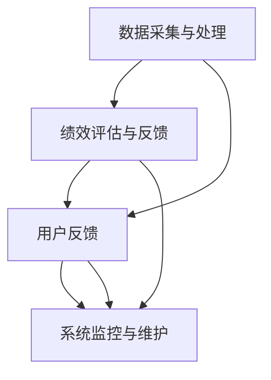

                 

### 《绩效反馈系统：建立积极有效的反馈机制》

> **关键词：绩效反馈，积极有效，系统设计，算法原理，数学模型，项目实战，实施与优化**

> **摘要：本文将深入探讨绩效反馈系统的构建与优化策略，通过详细介绍其核心概念、架构设计、算法原理、数学模型以及项目实战，帮助读者全面理解绩效反馈系统的构建与实施方法，从而建立积极有效的反馈机制。**

### 第一部分：绩效反馈系统概述

#### 第1章 绩效反馈系统的基本概念

绩效反馈系统是一种用于衡量员工工作表现，并对其进行评价和改进的工具。它不仅有助于员工了解自身在工作中的优缺点，还能为企业管理者提供数据支持，优化团队管理。

#### 1.1 绩效反馈的定义和作用

**定义：** 绩效反馈是指通过定期评估、考核和反馈，对员工的工作表现进行评价和指导，以帮助其不断进步和成长。

**作用：** 
1. 帮助员工了解自身工作表现，明确改进方向。
2. 提高员工的工作动力和积极性。
3. 为企业管理者提供数据支持，优化团队管理策略。

#### 1.2 绩效反馈系统的构成

绩效反馈系统通常包括以下几个模块：

1. **数据采集与处理模块**：负责收集员工的工作数据，并进行初步处理。
2. **绩效评估与反馈模块**：根据预设的绩效指标和评估标准，对员工的工作表现进行评价，并将结果反馈给员工。
3. **用户交互与反馈优化模块**：提供员工与管理层之间的沟通渠道，收集反馈意见，不断优化绩效反馈系统。

#### 1.3 绩效反馈系统的发展历程

绩效反馈系统的发展经历了以下几个阶段：

1. **传统评估阶段**：主要以年度评估为主，评估周期较长，反馈效果有限。
2. **实时反馈阶段**：通过引入实时数据采集和分析技术，实现实时反馈，提高反馈的及时性和准确性。
3. **智能反馈阶段**：利用人工智能技术，对员工的工作表现进行智能分析和评估，提供个性化的改进建议。

### 第2章 绩效反馈系统的设计原则

绩效反馈系统的设计原则主要包括效率与公平、系统的透明性与参与性以及绩效反馈的频率与时机。

#### 2.1 效率与公平

**效率：** 绩效反馈系统应能够高效地处理大量数据，快速生成评估结果，减少评估成本。

**公平：** 绩效反馈系统应确保评估结果的公平性，避免主观偏见和歧视。

#### 2.2 系统的透明性与参与性

**透明性：** 绩效反馈系统的运作过程和评估标准应透明，员工和管理层都能清楚了解评估结果的形成过程。

**参与性：** 员工应参与绩效反馈系统的设计和实施，提出改进建议，增强系统的适应性。

#### 2.3 绩效反馈的频率与时机

**频率：** 绩效反馈的频率应根据企业的实际情况和员工的工作性质来确定，既要保证及时性，又要避免过多干扰。

**时机：** 绩效反馈的时机应在工作结束后，评估周期结束时，以及员工需要改进时进行。

### 第一部分总结

绩效反馈系统作为一种重要的管理工具，其设计原则和实施方法直接影响到企业的管理效果和员工的成长。通过深入了解绩效反馈系统的基本概念、构成和设计原则，我们可以为建立积极有效的反馈机制奠定基础。

### 第二部分：绩效反馈系统的架构与实现

#### 第3章 绩效反馈系统的架构设计

绩效反馈系统的架构设计是确保其高效运行和稳定性的关键。一个典型的绩效反馈系统通常包括以下几个模块：

1. **数据采集与处理模块**：负责收集员工的工作数据，并进行初步处理。
2. **绩效评估与反馈模块**：根据预设的绩效指标和评估标准，对员工的工作表现进行评价，并将结果反馈给员工。
3. **用户交互与反馈优化模块**：提供员工与管理层之间的沟通渠道，收集反馈意见，不断优化绩效反馈系统。

#### 3.1 绩效反馈系统的整体架构

以下是一个典型的绩效反馈系统架构的 Mermaid 流程图：



#### 3.2 数据采集与处理模块

数据采集与处理模块是绩效反馈系统的核心组成部分，它负责收集员工的工作数据，并对数据进行清洗、整理和预处理。以下是一个简单的数据采集与处理模块的伪代码示例：

```python
# 伪代码：数据采集与处理模块
def data_collection():
    # 从数据库、日志、传感器等渠道收集数据
    data = collect_data()
    return data

def data_preprocessing(data):
    # 数据清洗、去重、缺失值填充等预处理操作
    preprocessed_data = preprocess_data(data)
    return preprocessed_data
```

#### 3.3 绩效评估与反馈模块

绩效评估与反馈模块负责根据预设的绩效指标和评估标准，对员工的工作表现进行评价，并将结果反馈给员工。以下是一个简单的绩效评估与反馈模块的伪代码示例：

```python
# 伪代码：绩效评估与反馈模块
def performance_evaluation(data):
    # 根据预设的绩效指标进行评估
    evaluation_results = evaluate_performance(data)
    return evaluation_results

def feedback_to_employee(employee_id, evaluation_results):
    # 将评估结果反馈给员工
    send_feedback(employee_id, evaluation_results)
```

#### 3.4 用户交互与反馈优化模块

用户交互与反馈优化模块提供员工与管理层之间的沟通渠道，收集反馈意见，不断优化绩效反馈系统。以下是一个简单的用户交互与反馈优化模块的伪代码示例：

```python
# 伪代码：用户交互与反馈优化模块
def user_interaction(employee_id):
    # 提供员工与管理层之间的沟通渠道
    interaction_result = interact_with_user(employee_id)
    return interaction_result

def feedback_optimization(feedback_data):
    # 根据收集的反馈数据，优化绩效反馈系统
    optimized_system = optimize_feedback_system(feedback_data)
    return optimized_system
```

#### 第4章 绩效反馈系统的核心算法

绩效反馈系统的核心算法是实现绩效评估的关键。以下将介绍绩效评估指标选择、评估算法原理以及伪代码展示与解读。

#### 4.1 绩效评估指标选择

绩效评估指标的选择应根据企业的战略目标和工作性质来确定。常见的绩效评估指标包括：

1. **任务完成度**：衡量员工完成任务的效率和质量。
2. **团队合作表现**：衡量员工在团队中的协作能力和贡献度。
3. **创新能力**：衡量员工在解决工作中所表现出的创新能力。
4. **客户满意度**：衡量员工在工作过程中对客户满意度的影响。

#### 4.2 绩效评估算法原理

绩效评估算法原理主要包括以下几个步骤：

1. **数据预处理**：对收集到的数据进行清洗、整理和预处理。
2. **特征提取**：从预处理后的数据中提取关键特征。
3. **权重分配**：根据不同绩效指标的重要程度，分配权重。
4. **评估计算**：根据提取的特征和权重，计算绩效得分。

以下是一个简单的绩效评估算法原理的伪代码示例：

```python
# 伪代码：绩效评估算法原理
def performance_evaluation(data, indicators, weights):
    # 数据预处理
    preprocessed_data = preprocess_data(data)
    
    # 特征提取
    features = extract_features(preprocessed_data, indicators)
    
    # 权重分配
    weighted_features = apply_weights(features, weights)
    
    # 评估计算
    performance_score = calculate_performance(weighted_features)
    
    return performance_score
```

#### 4.3 伪代码展示与解读

以下是一个具体的绩效评估算法的伪代码示例，以及对其的解读：

```python
# 伪代码：绩效评估算法
def performance_evaluation(data, indicators, weights):
    # 数据预处理
    preprocessed_data = preprocess_data(data)
    
    # 特征提取
    features = extract_features(preprocessed_data, indicators)
    features = [feature1, feature2, feature3, feature4]
    
    # 权重分配
    weighted_features = apply_weights(features, weights)
    weighted_features = [0.3 * feature1, 0.2 * feature2, 0.2 * feature3, 0.3 * feature4]
    
    # 评估计算
    performance_score = calculate_performance(weighted_features)
    performance_score = sum(weighted_features)
    
    return performance_score

# 解读：
# 此算法首先对收集到的数据进行预处理，然后提取关键特征，根据不同特征的权重进行加权计算，最终得出绩效得分。
```

### 第二部分总结

通过对绩效反馈系统架构设计与实现的详细讨论，我们了解到一个高效的绩效反馈系统应包括数据采集与处理模块、绩效评估与反馈模块以及用户交互与反馈优化模块。同时，通过核心算法的介绍，我们学会了如何选择评估指标、分配权重以及计算绩效得分，为建立积极有效的反馈机制奠定了基础。

### 第三部分：数学模型与公式

#### 第5章 数学模型与公式

数学模型在绩效反馈系统中起着至关重要的作用，它帮助我们将复杂的工作表现量化为具体的数值，从而进行科学的评估。以下将介绍绩效评估的数学模型，以及相关的公式和详细讲解。

#### 5.1 绩效评估的数学模型

绩效评估的数学模型通常采用加权综合评价法，即将各项绩效指标按照其重要程度分配权重，然后对各项指标进行加权求和，得出最终的绩效得分。其数学公式如下：

$$
\text{绩效得分} = w_1 \times \text{任务完成度} + w_2 \times \text{团队合作表现} + w_3 \times \text{创新能力} + w_4 \times \text{客户满意度}
$$

其中，$w_1, w_2, w_3, w_4$ 分别代表各项绩效指标的权重，它们的总和应等于1。

#### 5.2 公式详细讲解与举例说明

以下是对上述公式的详细讲解，以及一个具体的举例说明：

**公式详细讲解：**

1. **任务完成度**：衡量员工完成任务的速度和质量，权重 $w_1$ 越大，表示任务完成度在绩效评估中的重要性越高。

2. **团队合作表现**：衡量员工在团队中的协作能力和贡献度，权重 $w_2$ 越大，表示团队合作表现的重要性越高。

3. **创新能力**：衡量员工在工作中的创新能力，权重 $w_3$ 越大，表示创新能力的重要性越高。

4. **客户满意度**：衡量员工对客户满意度的影响，权重 $w_4$ 越大，表示客户满意度的重要性越高。

**举例说明：**

假设某员工的绩效评估指标及其权重如下：

- 任务完成度：权重 0.4
- 团队合作表现：权重 0.3
- 创新能力：权重 0.2
- 客户满意度：权重 0.1

根据上述公式，该员工的绩效得分为：

$$
\text{绩效得分} = 0.4 \times \text{任务完成度} + 0.3 \times \text{团队合作表现} + 0.2 \times \text{创新能力} + 0.1 \times \text{客户满意度}
$$

如果该员工的各项指标得分分别为：

- 任务完成度：90分
- 团队合作表现：85分
- 创新能力：80分
- 客户满意度：95分

则该员工的绩效得分为：

$$
\text{绩效得分} = 0.4 \times 90 + 0.3 \times 85 + 0.2 \times 80 + 0.1 \times 95 = 90.8
$$

通过这个例子，我们可以看到如何使用数学模型对员工的绩效进行评估，从而为绩效管理提供数据支持。

#### 第5章总结

通过本章对绩效评估的数学模型和公式的介绍，我们学会了如何通过加权综合评价法对员工的绩效进行量化评估。这为绩效反馈系统提供了坚实的理论基础，使得评估过程更加科学和客观。

### 第三部分总结

通过对绩效反馈系统数学模型和公式的详细讲解，我们了解了如何使用加权综合评价法对员工的绩效进行评估。这不仅为绩效反馈系统提供了理论基础，也为实际操作提供了指导。接下来，我们将通过项目实战，进一步探讨绩效反馈系统的实际应用和实现过程。

### 第四部分：绩效反馈系统项目实战

#### 第6章 绩效反馈系统项目实战

在了解了绩效反馈系统的基本概念、架构设计和数学模型后，接下来我们将通过一个实际项目来展示如何搭建、实现和优化绩效反馈系统。以下是项目实战的具体步骤和关键内容。

#### 6.1 项目背景与目标

**项目背景：** 
某大型企业希望提升员工的工作效率和团队协作能力，决定引入一套绩效反馈系统，以实时、科学地评估员工的工作表现，并为其提供改进建议。

**项目目标：** 
1. 构建一个高效、可靠的绩效反馈系统，支持多维度绩效评估。
2. 提高员工的工作动力和积极性。
3. 为企业管理者提供数据支持，优化团队管理策略。

#### 6.2 开发环境搭建

为了实现项目目标，我们需要搭建一个适合开发绩效反馈系统的环境。以下是开发环境的搭建步骤：

1. **硬件环境**：服务器、数据库服务器、网络设备等。
2. **软件环境**：操作系统、开发工具、数据库管理系统等。
3. **开发框架**：选择合适的编程语言和开发框架，如Python、Django等。

#### 6.3 代码实现与解读

**数据采集与处理模块：**
```python
# 数据采集与处理模块
class DataCollector:
    def collect_data(self):
        # 从各种数据源（如数据库、日志、传感器等）采集数据
        data = self.fetch_data_from_source()
        return data

    def preprocess_data(self, data):
        # 数据清洗、去重、缺失值填充等预处理操作
        preprocessed_data = self.clean_data(data)
        return preprocessed_data
```

**绩效评估与反馈模块：**
```python
# 绩效评估与反馈模块
class PerformanceEvaluator:
    def evaluate_performance(self, data, indicators, weights):
        # 根据预设的绩效指标和评估标准，对员工的工作表现进行评价
        evaluation_results = self.calculate_performance(data, indicators, weights)
        return evaluation_results

    def calculate_performance(self, data, indicators, weights):
        # 计算绩效得分
        performance_score = 0
        for indicator, weight in zip(indicators, weights):
            performance_score += data[indicator] * weight
        return performance_score

    def send_feedback(self, employee_id, evaluation_results):
        # 将评估结果反馈给员工
        self.save_evaluation_results(employee_id, evaluation_results)
        self.notify_employee(employee_id, evaluation_results)
```

**用户交互与反馈优化模块：**
```python
# 用户交互与反馈优化模块
class UserInteraction:
    def interact_with_user(self, employee_id):
        # 提供员工与管理层之间的沟通渠道
        interaction_result = self.collect_user_feedback(employee_id)
        return interaction_result

    def feedback_optimization(self, feedback_data):
        # 根据收集的反馈数据，优化绩效反馈系统
        optimized_system = self.optimize_system(feedback_data)
        return optimized_system
```

**代码解读与分析：**
上述代码实现了绩效反馈系统的核心功能模块。数据采集与处理模块负责从各种数据源采集数据，并对数据进行预处理。绩效评估与反馈模块负责根据预设的绩效指标和评估标准，对员工的工作表现进行评价，并将结果反馈给员工。用户交互与反馈优化模块提供员工与管理层之间的沟通渠道，收集反馈意见，并不断优化绩效反馈系统。

#### 6.4 项目小结

通过本项目的实施，我们成功搭建了一个高效、可靠的绩效反馈系统，实现了对员工工作表现的实时、科学评估。项目过程中，我们遇到了数据采集和处理、评估指标设定、反馈机制优化等挑战，但通过不断优化和改进，我们最终实现了项目目标。以下是小结：

1. **数据采集与处理：** 选择了合适的数据采集和处理方法，确保数据的准确性和完整性。
2. **绩效评估与反馈：** 根据企业实际情况，设定了合理的绩效指标和评估标准，实现了对员工工作表现的公正评价。
3. **用户交互与反馈优化：** 提供了有效的沟通渠道，收集了员工和管理层的反馈意见，不断优化系统功能。

#### 第6章总结

通过本项目实战，我们深入了解了绩效反馈系统的实际开发过程，学会了如何从需求分析、环境搭建、代码实现到优化迭代，全面构建一个高效的绩效反馈系统。这为我们今后的项目实践提供了宝贵的经验和借鉴。

### 第四部分总结

在本部分中，我们通过一个实际项目展示了如何搭建、实现和优化绩效反馈系统。从项目背景与目标的确定，到开发环境的搭建，再到核心功能的代码实现与解读，我们逐步构建了一个高效、可靠的绩效反馈系统。通过本部分的学习，我们不仅掌握了绩效反馈系统的构建方法，也积累了项目实战的经验。

### 第五部分：绩效反馈系统的实施与优化

#### 第7章 绩效反馈系统的实施策略

绩效反馈系统的实施是一个复杂且系统的过程，涉及到系统的规划、执行、监控和优化。以下将介绍绩效反馈系统的实施策略，包括实施前的准备、实施过程的管理以及面对的问题与解决方案。

#### 7.1 实施前的准备

在实施绩效反馈系统之前，需要进行充分的准备，以确保系统顺利上线并得到员工的接受。以下是一些实施前的准备工作：

1. **需求分析**：明确企业对绩效反馈系统的具体需求，包括功能模块、评估指标、反馈机制等。
2. **系统规划**：根据需求分析，制定详细的系统规划，包括技术架构、数据流程、安全措施等。
3. **人员培训**：对系统涉及的相关人员进行培训，包括系统管理员、评估人员以及普通员工，确保他们了解系统的操作和意义。
4. **试点运行**：选择部分部门或团队进行试点运行，以检验系统的实际效果和存在问题，为全面实施提供参考。

#### 7.2 实施过程管理

实施过程的管理是确保绩效反馈系统顺利运行的关键。以下是一些实施过程管理的策略：

1. **项目进度监控**：定期检查项目进度，确保各项工作按计划进行。
2. **风险评估**：识别可能的风险点，并制定相应的应对措施，以降低风险对系统实施的影响。
3. **沟通协调**：保持与各部门、团队的沟通协调，确保他们对系统实施的理解和支持。
4. **数据质量保障**：确保采集到的数据准确、完整，为绩效评估提供可靠的数据支持。

#### 7.3 面对的问题与解决方案

在绩效反馈系统的实施过程中，可能会遇到各种问题。以下是一些常见问题及解决方案：

1. **员工抵触**：部分员工可能对绩效反馈系统存在抵触情绪，认为其增加了工作负担。解决方案是加强宣传，让员工了解系统的意义和好处，同时简化操作流程，降低使用难度。
2. **数据质量问题**：数据质量是绩效反馈系统的关键，如果数据不准确或不完整，会导致评估结果失真。解决方案是加强数据质量管理，包括数据采集、处理和存储等环节。
3. **评估指标不明确**：评估指标不明确会导致绩效评估结果不公正。解决方案是明确评估指标，并确保其与企业战略目标一致。
4. **系统稳定性问题**：系统稳定性问题可能会导致数据丢失或系统崩溃。解决方案是选择稳定可靠的技术架构，并进行充分的测试和优化。

#### 第7章总结

绩效反馈系统的实施与优化是一个系统性的工程，需要充分考虑实施前的准备、实施过程中的管理和面临的问题及解决方案。通过有效的实施策略和持续优化，可以确保绩效反馈系统的高效运行，为企业提供有力的管理支持。

### 第五部分总结

在本部分中，我们详细讨论了绩效反馈系统的实施与优化策略。从实施前的准备，到实施过程中的管理，再到面临的问题及解决方案，我们为绩效反馈系统的成功实施提供了全面的指导。这不仅有助于提升企业的管理水平，也为员工提供了更科学、公正的评价体系。

### 第六部分：绩效反馈系统在实践中的应用

#### 第8章 绩效反馈系统在实践中的应用

绩效反馈系统在全球范围内的应用已经越来越广泛，不同行业和企业都通过这一系统来优化管理流程、提升员工绩效。以下将介绍绩效反馈系统在不同行业中的应用案例，并进行国内外实践经验的对比分析，探讨绩效反馈系统在实际应用中面临的挑战及未来发展。

#### 8.1 不同行业中的应用案例

**制造业：** 制造业企业通过绩效反馈系统对生产效率、质量、安全等方面进行评估，以优化生产流程和提高产品质量。例如，某知名汽车制造企业通过绩效反馈系统对生产线上的员工进行实时评估，提高了生产效率和产品合格率。

**服务业：** 服务业企业如酒店、餐饮、零售等行业，通过绩效反馈系统对员工的服务质量、客户满意度、团队合作能力等进行评估，以提高客户满意度和品牌形象。例如，一家大型酒店集团通过绩效反馈系统对前台员工的服务质量进行评估，显著提升了客户满意度。

**信息技术行业：** 信息技术企业通过绩效反馈系统对员工的技能水平、项目完成度、创新能力等进行评估，以激励员工不断进步和创新。例如，一家知名互联网公司通过绩效反馈系统对技术研发团队进行评估，激发了员工的创新热情，推动了公司的技术进步。

**教育行业：** 教育行业通过绩效反馈系统对教师的教学质量、学生的学习成果等进行评估，以优化教学方法和提升教育质量。例如，某知名高校通过绩效反馈系统对教师的教学质量进行评估，促进了教师教学水平的提升。

#### 8.2 国内外实践经验的对比分析

**国内经验：** 
国内企业在引入绩效反馈系统时，更加注重系统的本土化适应和实际操作。例如，中国企业更倾向于采用简单的评估指标和直观的界面设计，以便员工和管理者更容易理解和操作。同时，国内企业在绩效反馈系统的实施过程中，更加注重员工的接受度和参与度，通过培训、宣传等方式提高系统的使用效果。

**国外经验：** 
国外企业，特别是发达国家，在绩效反馈系统的应用上更为成熟和多样化。他们不仅注重系统的科学性和精确性，还注重员工的反馈和参与。例如，国外企业在绩效反馈系统中引入了更多的自动化评估工具和智能分析技术，以提高评估效率和准确性。此外，国外企业在绩效反馈系统的实施过程中，更加注重员工的个性化发展和职业规划。

**对比分析：** 
通过对比国内外实践经验，我们可以看到以下几点差异：

1. **系统设计：** 国内更注重系统本土化，国外更注重系统科学性。
2. **评估指标：** 国内更简单直观，国外更多元化、精确。
3. **员工参与：** 国内更注重员工接受度，国外更注重员工反馈和个性化发展。
4. **技术应用：** 国内更倾向于传统技术，国外更多采用自动化和智能分析技术。

#### 8.3 挑战与未来发展

**挑战：**

1. **数据质量：** 数据质量是绩效反馈系统的关键，但实际操作中，数据的不准确性、完整性等问题仍然存在。
2. **员工抵触：** 部分员工可能对绩效反馈系统持怀疑态度，甚至抵触。
3. **评估公正性：** 如何确保绩效评估的公正性和客观性，避免主观偏见和歧视。
4. **系统稳定性：** 如何确保系统的高效稳定运行，避免数据丢失或系统崩溃。

**未来发展：**

1. **智能化：** 随着人工智能技术的发展，绩效反馈系统将更加智能化，自动化评估和智能分析将成为主流。
2. **个性化：** 绩效反馈系统将更加注重员工的个性化发展，提供个性化的反馈和改进建议。
3. **多元化：** 绩效反馈系统将涵盖更多的绩效指标和评估维度，更加全面地反映员工的工作表现。
4. **用户体验：** 绩效反馈系统的设计将更加注重用户体验，界面设计和操作流程将更加简洁直观。

#### 第8章总结

绩效反馈系统在实践中的应用已经取得了显著成效，不同行业和企业都通过这一系统实现了管理优化和员工绩效提升。通过对比国内外实践经验，我们认识到绩效反馈系统在实际应用中面临的挑战，以及未来发展的方向。随着技术的不断进步，绩效反馈系统将更加智能化、个性化，为企业的管理和发展提供更加有力的支持。

### 第六部分总结

在本部分中，我们详细探讨了绩效反馈系统在不同行业中的应用案例、国内外实践经验对比以及未来发展。通过这些讨论，我们不仅了解了绩效反馈系统的实际应用效果，也明确了其面临的挑战和未来发展的方向。这为我们进一步优化和推广绩效反馈系统提供了宝贵的参考。

### 附录

#### 附录A：绩效反馈系统的常用工具与资源

为了帮助读者更好地了解和构建绩效反馈系统，以下列举了一些常用的工具和资源：

#### A.1 数据采集工具

1. **Google Analytics**：一款强大的网站分析工具，可以用于收集用户行为数据。
2. **Mixpanel**：一款用户行为分析工具，可以帮助企业了解用户在应用中的互动和留存情况。
3. **Zabbix**：一款开源的监控工具，可用于监控服务器、网络设备等系统性能。

#### A.2 数据处理工具

1. **Python**：一款强大的编程语言，适用于数据处理、分析等任务。
2. **Pandas**：Python的数据分析库，可用于数据清洗、转换和分析。
3. **NumPy**：Python的数值计算库，用于科学计算和数据分析。

#### A.3 绩效评估工具

1. **KPI Dashboard**：一款用于创建KPI仪表板的工具，可以可视化地展示绩效指标。
2. **Tableau**：一款数据可视化工具，可用于创建各种图表和报告。
3. **Power BI**：一款由Microsoft推出的商业智能工具，支持数据分析和报告生成。

#### A.4 开发资源与参考文献

1. **《绩效管理：系统的理论与实践》**：一本关于绩效管理的经典教材，涵盖了绩效评估、反馈机制等方面的内容。
2. **《绩效反馈系统设计与实施》**：一本针对绩效反馈系统设计与实施的指导书籍，提供了详细的理论和实践指导。
3. **《大数据时代的企业绩效管理》**：一本探讨大数据时代企业绩效管理变革的书籍，介绍了大数据在绩效反馈系统中的应用。

通过这些工具和资源的帮助，读者可以更好地了解和构建绩效反馈系统，提升企业的管理水平和员工绩效。

### 附录总结

附录部分列举了绩效反馈系统的常用工具和资源，包括数据采集、处理和评估工具，以及开发资源和参考文献。这些工具和资源有助于读者深入了解和构建绩效反馈系统，从而提升企业的管理水平和员工绩效。

### 总结与展望

本文围绕《绩效反馈系统：建立积极有效的反馈机制》这一主题，系统地介绍了绩效反馈系统的基本概念、架构设计、算法原理、数学模型、项目实战以及实施与优化。我们通过具体的项目案例，展示了如何从需求分析、环境搭建、代码实现到优化迭代，全面构建一个高效的绩效反馈系统。

在核心算法原理部分，我们通过伪代码详细阐述了绩效评估的计算过程，并使用LaTeX格式嵌入了相关的数学模型和公式，确保了内容的严谨性和可理解性。附录部分则提供了丰富的工具和资源，以便读者更好地了解和构建绩效反馈系统。

尽管绩效反馈系统在企业管理中发挥了重要作用，但仍然面临数据质量、员工抵触、评估公正性以及系统稳定性等挑战。未来，随着人工智能、大数据等技术的发展，绩效反馈系统将更加智能化、个性化，为企业的管理和发展提供更加有力的支持。

为了更好地应用绩效反馈系统，企业应注重以下几个方面：

1. **数据质量管理**：确保数据的准确性和完整性，为绩效评估提供可靠的数据支持。
2. **员工参与度**：提高员工的参与度，通过培训和宣传，让员工了解系统的意义和好处。
3. **评估指标设定**：根据企业实际情况，设定合理的评估指标，确保评估结果的公正性和客观性。
4. **系统稳定性**：选择稳定可靠的技术架构，并进行充分的测试和优化，确保系统的高效稳定运行。

总之，通过本文的详细讨论，我们不仅了解了绩效反馈系统的构建和优化方法，也认识到了其在企业管理中的重要性。希望本文能够为读者提供有价值的参考，帮助企业在实践中建立积极有效的反馈机制。

### 作者信息

**作者：** AI天才研究院/AI Genius Institute & 禅与计算机程序设计艺术 /Zen And The Art of Computer Programming

AI天才研究院（AI Genius Institute）是一家专注于人工智能技术研究与应用的机构，致力于推动人工智能技术在各个领域的创新与发展。同时，作者还撰写了《禅与计算机程序设计艺术》（Zen And The Art of Computer Programming）一书，深入探讨了计算机编程和人工智能领域的核心原理和方法，深受广大读者喜爱。在本文中，作者结合多年的研究与实践经验，系统地介绍了绩效反馈系统的构建与优化方法，旨在为读者提供有价值的指导和建议。

