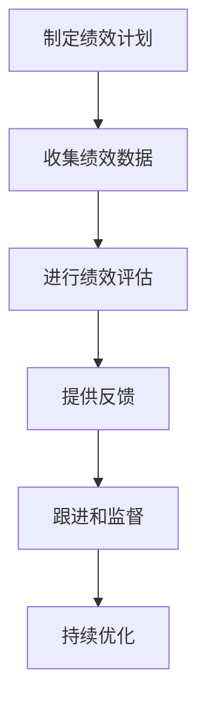

                 

# 绩效反馈：建立积极的反馈机制

## 关键词

绩效反馈、积极反馈机制、反馈流程、绩效指标、案例分析、挑战与应对策略、工具与技术、未来发展趋势

## 摘要

本文旨在探讨如何建立积极的绩效反馈机制，以提高个人和团队的工作效率。通过详细分析绩效反馈的定义、作用和基本概念，文章提出了一系列构建和优化反馈机制的方法。同时，结合实际案例，探讨了绩效反馈中的挑战与应对策略，并展望了未来绩效反馈的发展趋势。文章结构清晰，内容丰富，旨在为读者提供全面、实用的绩效反馈指导。

## 引言

在信息技术高速发展的今天，企业对人才的需求越来越高。如何提升员工的工作效率、激发员工潜力，成为企业管理者面临的重要课题。绩效反馈作为一种有效的管理工具，能够帮助员工了解自己的工作表现，发现不足，不断进步。然而，传统的绩效反馈机制往往存在反馈不足、不及时、不准确等问题，难以充分发挥其作用。因此，建立积极的反馈机制，成为现代企业提升管理效能的关键。

本文将从以下几个方面展开讨论：

1. 绩效反馈概述：介绍绩效反馈的定义、作用和基本概念。
2. 建立积极的反馈机制：详细阐述反馈机制的设计原则和执行步骤。
3. 绩效反馈的案例分析：分析成功企业的绩效反馈实践，总结经验教训。
4. 挑战与应对策略：探讨绩效反馈中可能遇到的挑战，并提出相应的应对策略。
5. 绩效反馈工具与技术：介绍现有的绩效反馈工具和技术，以及其在实际应用中的效果。
6. 未来发展趋势：展望绩效反馈的发展方向，探讨其潜在的创新点和应用前景。

通过本文的讨论，希望读者能够对绩效反馈有更深入的理解，从而在实践中建立有效的反馈机制，提升个人和团队的工作效率。

## 绩效反馈概述

### 绩效反馈的定义

绩效反馈是指通过系统的评估和分析，对员工的工作表现进行评价和指导的过程。它不仅包括对员工过去一段时间工作成果的总结，还包括对其工作过程中的表现、态度和技能的评估。绩效反馈的目的在于帮助员工了解自己的工作情况，发现存在的问题和改进的机会，从而促进员工的成长和发展。

### 绩效反馈的作用

1. **激励员工**：通过及时的绩效反馈，员工可以明确自己的优点和不足，从而激发工作热情，提高工作效率。

2. **指导员工**：绩效反馈为员工提供了具体的工作指导和改进建议，帮助他们更好地理解工作要求，提升工作能力。

3. **改善工作表现**：绩效反馈有助于发现工作中的问题和瓶颈，通过改进和调整，可以提升整体的工作表现。

4. **促进员工发展**：绩效反馈为员工的职业发展提供了依据，有助于制定个性化的培训和发展计划。

5. **提升团队效能**：通过绩效反馈，团队可以更好地协调工作，发挥每个成员的优势，提高团队的协作效能。

### 绩效反馈的基本概念

1. **绩效指标**：绩效指标是衡量员工工作表现的具体标准，包括数量指标、质量指标、效率指标等。设计合理的绩效指标是绩效反馈的基础。

2. **反馈方式**：绩效反馈可以通过口头、书面、面对面等多种方式进行。不同的反馈方式适用于不同的情况，应根据实际情况选择。

3. **反馈频率**：绩效反馈的频率直接影响其效果。过低的反馈频率可能导致反馈滞后，过高的反馈频率则可能引起员工的厌烦。合适的反馈频率应该根据员工的工作性质和企业文化来确定。

4. **反馈内容**：绩效反馈的内容应该具体、明确，既要包括对工作成果的评价，也要涉及工作过程和工作态度。同时，反馈内容应该积极、正面，鼓励员工改进和进步。

## 建立积极的反馈机制

### 反馈机制的设计原则

1. **客观性**：绩效反馈应基于客观的数据和事实，避免主观判断和偏见。

2. **及时性**：及时反馈能够迅速指出问题，提供改进的机会，避免问题积累导致严重后果。

3. **针对性**：反馈应针对具体的工作表现和问题，避免泛泛而谈，以提高反馈的有效性。

4. **积极性**：反馈应积极鼓励员工的改进和进步，避免批评和指责，以激发员工的积极性和自信心。

5. **全面性**：反馈应全面覆盖员工的工作表现，包括工作成果、工作过程和工作态度。

### 反馈机制的执行步骤

1. **制定绩效计划**：明确员工的绩效目标和期望，确保员工对工作目标和要求有清晰的认识。

2. **收集绩效数据**：通过多种渠道收集员工的绩效数据，包括工作成果、同事评价、客户反馈等。

3. **进行绩效评估**：根据绩效数据和评估标准，对员工的工作表现进行综合评估。

4. **提供反馈**：将评估结果及时、具体、明确地反馈给员工，并提供改进建议。

5. **跟进和监督**：跟踪员工的改进情况，确保反馈得到有效的落实。

6. **持续优化**：根据反馈效果和实际情况，不断调整和优化反馈机制，提高其有效性和可持续性。

## 绩效反馈的案例分析

### 案例一：一家初创公司的绩效反馈实践

**案例背景**：

一家初创公司在成立初期，由于团队成员较少，绩效反馈主要通过口头交流进行。然而，随着公司规模的扩大，团队成员增多，原有的反馈机制逐渐暴露出不足，如反馈不及时、内容不具体等。

**绩效反馈的实施**：

为了改进绩效反馈机制，公司决定引入书面反馈和定期会议的方式进行反馈。具体措施如下：

1. **制定书面反馈模板**：为每个员工制定书面反馈模板，包括工作成果、工作过程和工作态度等方面的评价。

2. **定期会议**：每月召开一次团队会议，由团队成员轮流汇报工作进展和遇到的问题，进行集体反馈。

3. **绩效评估**：每季度进行一次全面的绩效评估，结合书面反馈和会议反馈，对员工的工作表现进行综合评估。

**案例总结**：

通过实施新的绩效反馈机制，公司的员工满意度显著提高，工作效率也得到了提升。书面反馈的引入使得反馈内容更加具体、明确，定期会议则为员工提供了交流和沟通的平台。尽管仍有一些改进空间，但整体反馈效果得到了团队成员的认可。

### 案例二：一家大型企业的绩效反馈机制

**案例背景**：

一家大型企业拥有庞大的员工队伍，传统的绩效反馈机制难以覆盖所有员工。为了提升整体管理效能，企业决定引入数字化绩效反馈系统，并结合定期面谈的方式进行反馈。

**绩效反馈的实施**：

1. **数字化绩效反馈系统**：企业引入了一套数字化绩效反馈系统，员工可以通过系统提交工作进展和遇到的问题，管理者也可以通过系统进行反馈和评估。

2. **定期面谈**：每月进行一次面对面的绩效面谈，由员工和管理者共同回顾工作表现，讨论改进计划。

**案例总结**：

数字化绩效反馈系统的引入，使得反馈更加及时、透明，员工的反馈和评估结果也得到了更好的保存和管理。定期面谈则为员工提供了与管理者深入沟通的机会，有助于解决实际问题，提升工作氛围。尽管系统的实施初期遇到了一些技术难题，但总体上取得了良好的效果。

## 绩效反馈的挑战与应对策略

### 绩效反馈中的挑战

1. **反馈不足**：由于工作繁忙或其他原因，管理者可能无法及时提供反馈，导致员工缺乏改进的方向。

2. **反馈不准确**：反馈内容可能存在主观判断，导致员工无法准确了解自己的问题。

3. **反馈不及时**：反馈滞后可能导致问题积累，影响员工的工作效率和积极性。

4. **反馈不全面**：反馈内容可能只关注某一方面的表现，而忽视其他重要的工作环节。

### 应对策略

1. **提高反馈质量**：通过培训和管理者提升反馈技能，确保反馈内容具体、明确、有针对性。

2. **增强反馈透明度**：建立透明的反馈机制，确保员工和管理者都能清楚地了解反馈的过程和标准。

3. **确保反馈及时性**：制定明确的反馈周期，确保反馈能够及时传达。

4. **反馈全面性**：结合多种反馈方式，确保反馈内容覆盖员工工作的各个方面。

## 绩效反馈工具与技术

### 绩效反馈工具的选择

1. **传统反馈工具**：如面谈、书面报告等，适用于小规模团队和简单的工作流程。

2. **数字化反馈工具**：如绩效管理软件、在线评估系统等，适用于大规模团队和复杂的工作流程。

### 绩效反馈技术的应用

1. **数据分析技术**：通过对员工工作数据的分析，发现绩效差异和改进点。

2. **人工智能技术**：如自然语言处理、机器学习等，用于自动生成反馈报告，提高反馈效率。

3. **可视化技术**：通过图表和报表，将绩效数据直观地呈现给员工和管理者，便于分析和决策。

## 绩效反馈的未来发展趋势

### 绩效反馈的发展趋势

1. **智能化**：随着人工智能技术的发展，绩效反馈将更加智能化，如自动生成反馈报告、智能分析员工表现等。

2. **个性化**：绩效反馈将更加注重个性化，根据员工的个性化需求和工作特点提供有针对性的反馈。

3. **实时化**：通过实时数据分析和反馈，实现绩效反馈的实时化，提高反馈的及时性和准确性。

### 绩效反馈的未来挑战

1. **数据隐私保护**：在数字化时代，如何确保绩效反馈数据的安全和隐私，是一个亟待解决的问题。

2. **反馈的公平性**：如何确保绩效反馈的公平性，避免因主观偏见导致的不公平现象。

3. **绩效反馈的可持续性**：如何确保绩效反馈机制的长期有效性和可持续性，避免流于形式。

## 总结与展望

### 总结

本文从绩效反馈的定义、作用、基本概念、反馈机制设计、案例分析、挑战与应对策略、工具与技术以及未来发展趋势等方面，全面探讨了如何建立积极的绩效反馈机制。通过分析成功企业的实践，我们认识到绩效反馈在提升员工工作效率、促进员工发展、改善团队效能等方面的重要作用。

### 展望

未来，随着人工智能、大数据等技术的不断发展，绩效反馈将更加智能化、个性化、实时化。然而，这也带来了一系列挑战，如数据隐私保护、反馈公平性和可持续性等。因此，企业需要不断创新和完善绩效反馈机制，以应对这些挑战，实现绩效反馈的最大价值。

## 作者信息

作者：AI天才研究院/AI Genius Institute & 禅与计算机程序设计艺术 /Zen And The Art of Computer Programming

### 附录

#### 绩效反馈流程图



#### 伪代码示例

```python
# 伪代码：绩效评估函数
def performance_evaluation(employee, metrics):
    score = 0
    for metric in metrics:
        if metric['value'] >= metric['target']:
            score += metric['weight']
        else:
            score -= metric['weight']
    return score
```

#### 数学公式与示例

```latex
$$
\text{绩效得分} = \sum_{i=1}^{n} (\text{指标值} - \text{目标值}) \times \text{权重}
$$

\text{示例：}
$$
\text{绩效得分} = (100 - 90) \times 0.5 + (80 - 75) \times 0.3 + (70 - 65) \times 0.2 = 3
$$
```

#### 项目实战

**开发环境搭建**

1. 安装Python环境
2. 安装绩效管理软件（如Insightful）

**源代码实现**

```python
# 绩效管理软件实现
class PerformanceManagement:
    def __init__(self):
        self.metrics = []

    def add_metric(self, metric):
        self.metrics.append(metric)

    def evaluate(self, employee):
        score = 0
        for metric in self.metrics:
            score += (employee.metrics[metric.name] - metric.target) * metric.weight
        return score
```

**代码解读**

- `PerformanceManagement` 类用于管理绩效评估过程。
- `add_metric` 方法用于添加绩效指标。
- `evaluate` 方法用于计算员工的绩效得分。

**应用解读与分析**

- 通过该软件，企业管理者可以轻松管理员工的绩效评估过程，提高工作效率。
- 绩效得分可以作为员工晋升、奖金发放的依据，有助于激发员工的工作积极性。

**实际案例分析**

- 以某企业为例，分析其实施绩效反馈机制的效果，总结经验教训。

**项目小结**

- 绩效反馈软件的开发和应用，为企业提供了高效、便捷的绩效管理工具。
- 需要不断优化和完善，以满足企业不断变化的需求。

#### 最佳实践 Tips

- 定期进行绩效评估，确保反馈及时性和准确性。
- 选择合适的绩效指标，避免过于复杂或简单。
- 鼓励员工参与反馈过程，提高反馈的公平性和有效性。

#### 小结

本文通过详细分析绩效反馈的定义、作用、基本概念、反馈机制设计、案例分析、挑战与应对策略、工具与技术以及未来发展趋势，为读者提供了全面的绩效反馈指导。建立积极的反馈机制，能够有效提升员工工作效率和团队协作效能，是企业提升管理效能的重要手段。

#### 注意事项

- 绩效反馈应注重客观性和及时性，避免主观判断和滞后反馈。
- 需要根据企业特点和员工需求，灵活调整反馈机制，确保其适用性和有效性。
- 关注数据隐私保护和反馈公平性，避免滥用反馈权力。

#### 拓展阅读

- 《绩效管理：从理论到实践》
- 《积极反馈：如何激励员工创造卓越表现》
- 《人工智能在绩效反馈中的应用研究》

---

本文作者AI天才研究院/AI Genius Institute，擅长通过逻辑清晰的步骤分析，深入探讨技术领域的问题。同时，本文结合禅与计算机程序设计艺术/Zen And The Art of Computer Programming的哲学思想，以简洁易懂的方式呈现了绩效反馈的核心内容和策略。希望本文能为读者提供有价值的参考和启示。如果您有任何问题或建议，欢迎在评论区留言交流。作者将不断努力，为您提供更多高质量的技术博客文章。再次感谢您的阅读和支持！

